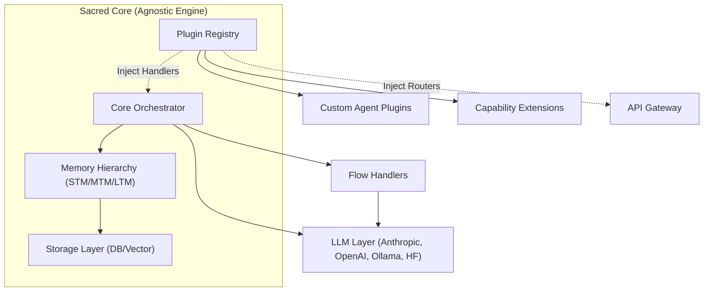

<p align="center">
  <picture>
    <source media="(prefers-color-scheme: dark)" srcset="media/full-white-og.png">
    <source media="(prefers-color-scheme: light)" srcset="media/full-black-og.png">
    
  </picture>
</p>

# BaselithCore

> **The Research-Backed Engine for Production-Grade Agentic AI.**

[](https://www.python.org/downloads/)
[](LICENSE)
[](https://github.com/astral-sh/ruff)
[](http://mypy-lang.org/)
[](tests/)
[](https://pypi.org/project/baselith-core/)

[](mkdocs-site/docs/core-modules/world-model.md)
[](mkdocs-site/docs/core-modules/swarm.md)
[](mkdocs-site/docs/architecture/agentic-patterns.md)
[](mkdocs-site/docs/core-modules/mcp.md)
[](https://github.com/baselithcore/baselithcore/blob/main/Dockerfile-full)

---

**BaselithCore** is a high-performance orchestration engine designed to transition agentic AI from experimental prototypes to resilient, production-ready infrastructure. Built on a modular architecture, it provides an agnostic foundation for engineering scalable multi-agent systems.

<div align="center">

[**Quick Start**](#quick-start) | [**Architecture**](https://docs.baselithcore.xyz/architecture/) | [**Plugin System**](https://docs.baselithcore.xyz/plugins/architecture/) | [**API Reference**](https://docs.baselithcore.xyz/api/)

</div>

---

## Core Philosophy

BaselithCore is governed by a strict architectural separation:

1. **Sacred Core**: The `core/` directory contains exclusively agnostic logic—orchestration, infrastructure, and utilities. It remains untainted by domain-specific logic.
2. **Plugin-First**: All business logic, external integrations, and specialized capabilities are implemented as **Plugins**, ensuring secondary features never bloat the primary engine.
3. **Agentic by Design**: Native adherence to the Agentic Design Patterns (Memory, Reflection, Tool Use, etc.) is baked into the orchestrator.

### Architecture Overview



---

## Key Capabilities

### Cognitive Orchestration

We manage the complexity of agentic reasoning so you can focus on domain value.

* **Strategic Optimization**: Native **Monte Carlo Tree Search (MCTS)** and **Tree of Thoughts** for advanced decision-making and "What-If" simulations.
* **Swarm Intelligence**: Decentralized **Auction Protocols** for optimal task allocation and resource efficiency across agent collectives.
* **Multilayered Memory**: Research-grade memory hierarchy (STM → MTM → LTM) with intelligent context consolidation.
* **Interoperability**: Built with native **Model Context Protocol (MCP)** support for seamless tool and data integration.

---

## <span id="quick-start"></span> Quick Start

### 1. Prerequisites

* **Python**: 3.10+
* **Docker**: For Redis, Qdrant, and PostgreSQL infrastructure.
* **Vector/Relational Storage**: Managed via Docker Compose.

### 2. Installation

Install the core engine via pip:

```bash
pip install baselith-core
```

Or clone for extension development:

```bash
git clone https://github.com/baselithcore/baselithcore.git
cd baselith-core
docker compose up -d
```

### 3. Verification

```bash
baselith doctor  # Validate environment and configuration
```

---

## Resources

| Resource                                                                             | Description                                           |
| :----------------------------------------------------------------------------------- | :---------------------------------------------------- |
| [**Official Website**](https://baselithcore.xyz)                                     | The core landing page for the BaselithCore framework. |
| [**Official Documentation**](https://docs.baselithcore.xyz)                          | The official docs for the BaselithCore framework.     |
| [**Architecture**](https://docs.baselithcore.xyz/architecture/overview/)             | Deep dive into the "Sacred Core" and design choices.  |
| [**Plugin Guide**](https://docs.baselithcore.xyz/plugins/architecture/)              | How to extend BaselithCore using the plugin system.   |
| [**Agentic Patterns**](https://docs.baselithcore.xyz/architecture/agentic-patterns/) | Implementation of Agentic Design Patterns.            |
| [**Deployment**](https://docs.baselithcore.xyz/advanced/deployment/)                 | Production-ready deployment strategies.               |

---

## Contributing & License

We welcome contributions that adhere to our code standards. Please review [CONTRIBUTING.md](CONTRIBUTING.md).

BaselithCore is licensed under the **GNU Affero General Public License v3.0 (AGPL v3)**.
See [LICENSE](LICENSE) for full details.

---
Copyright © 2026 BaselithCore Team.
