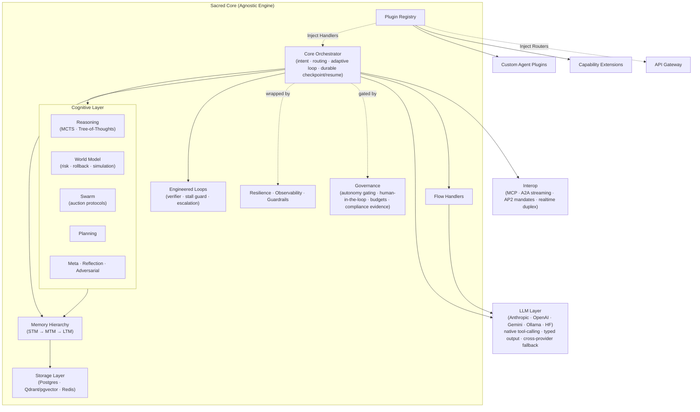

<p align="center">
  <picture>
    <source media="(prefers-color-scheme: dark)" srcset="media/full-white-og.png">
    <source media="(prefers-color-scheme: light)" srcset="media/full-black-og.png">
    
  </picture>
</p>

# BaselithCore

> **Agents that survive production.** Durable execution, enforced budgets, and EU AI Act evidence — self-hosted, with no companion SaaS.

[](https://github.com/baselithcore/baselithcore/actions/workflows/ci.yml)
[](https://pypi.org/p/baselith-core/)
[](https://www.python.org/downloads/)
[](LICENSE)
[](LICENSE.exception)
[](https://docs.baselithcore.xyz)

<p align="center">
  
</p>

BaselithCore is a Python orchestration engine for agentic AI. Execution state is
checkpointed as a run proceeds, so an interrupted process resumes from its last
completed step instead of replaying side effects. Every request carries a budget
that caps iterations, tool calls, tokens and USD spend, and every step emits
OpenTelemetry spans and Prometheus metrics with real cost attached — the audit
trail a regulated deployment has to produce is written while the system runs,
not reconstructed from logs afterwards.

<div align="center">

[**Quick start**](#quick-start) · [**Plugins**](#plugins) · [**Docs**](https://docs.baselithcore.xyz) · [**Website**](https://baselithcore.xyz) · [**Marketplace**](https://marketplace.baselithcore.xyz) · [**Architecture**](#architecture-at-a-glance) · [**Changelog**](CHANGELOG.md) · [**Contributing**](CONTRIBUTING.md)

</div>

> **Writing a plugin? You keep your source.** The [plugin exception](LICENSE.exception)
> lets any plugin that uses the framework as a library ship under any licence you
> like, including a closed one. Same terms for everyone.

---

## Why BaselithCore

- **Agents that survive production.** Durable execution with checkpoint/resume, replayable tool steps, state history and fork/rewind — a `SIGKILL` mid-run recovers without repeating a single side effect.
- **Everything included, nothing rented.** Evaluation suites, LLM-as-judge, red-teaming, OpenTelemetry tracing, Prometheus metrics with real USD cost, Helm and Terraform deployment — built in, self-hosted, no companion SaaS to subscribe to.
- **Brakes, not just horsepower.** Autonomy gating, durable human-in-the-loop approvals, per-request cost budgets, prompt-injection guardrails and sandboxed code execution, every seam fail-closed by default — plus opt-in EU AI Act, GDPR, NIS2 and DORA primitives with evidence trails.

## Quick start

Kick the tyres without installing anything:

```bash
uvx --from baselith-core baselith --version
```

Then take it as a library, in one command. The distribution is
**`baselith-core`** on PyPI:

```bash
uv pip install baselith-core        # or: pip install baselith-core
```

```python
from core.agent import Agent, Crew, Task

researcher = Agent(system_prompt="You are a meticulous researcher.")
writer = Agent(system_prompt="You write crisp executive summaries.")

crew = Crew(agents=[researcher, writer], tasks=[
    Task("Research {topic} and list the key facts.", agent=researcher),
    Task("Write a summary from the research.", agent=writer),
])
report = (await crew.run(inputs={"topic": "vector databases"})).final
```

Typed, budgeted and observable from the first line — the
[quickstart](https://docs.baselithcore.xyz/getting-started/quickstart/) adds
tools, structured output and a checkpoint store.

Or the whole runtime — API, PostgreSQL, FalkorDB and Qdrant, with migrations
applied at startup. From a checkout of this repository, with Docker running:

```bash
uv pip install -e .             # installs the `baselith` CLI
baselith setup docker-core      # writes .env and configs/.env.docker.core
docker compose --env-file configs/.env.docker.core -f docker-compose.core.yml up -d --wait
baselith doctor                 # environment and configuration diagnostics
```

`--wait` returns only once every health check is green, so the next line can
assume the stack is serving:

```bash
curl --fail http://localhost:8000/health
```

<p align="center">
  
</p>

In a project generated by `baselith init`, `baselith up` does all of this for
you: it writes the runtime files, builds and waits for `/health` in one command.

Optional capabilities (RAG, browser automation, OCR, extra model providers,
vector backends, …) install as extras — the [installation
guide](https://docs.baselithcore.xyz/getting-started/installation/) lists them,
and the [Docker Core guide](mkdocs-site/docs/getting-started/docker-core.md)
covers the checkout-based runtime in full.

## Plugins

Everything domain-specific is a plugin, and the CLI does the plumbing. Scaffold
one, check it, run it — without leaving the terminal:

```bash
baselith plugin create my_plugin --type agent               # manifest.yaml, plugin.py, agent.py
baselith plugin validate my_plugin                          # syntax, manifest, schema, deps, env vars
baselith plugin add my_plugin --name my_plugin --docker     # build, rebuild the API image, probe HTTP
```

<p align="center">
  
</p>

`--type` picks the shape: `agent`, `router` or `graph`. Running someone else's
plugin is the same `add` command with a Git URL, and the marketplace is one
command away:

```bash
baselith plugin add https://github.com/your-org/plugin-example --docker
baselith plugin marketplace search browser
baselith plugin marketplace install <plugin-id>
```

`baselith plugin list`, `status` and `logs` cover day-to-day work; `sign` writes
the integrity hash a hardened deployment verifies before it imports anything.

The [first-plugin tutorial](https://docs.baselithcore.xyz/getting-started/first-plugin/)
walks one end to end · [creating
plugins](https://docs.baselithcore.xyz/plugins/creating-plugins/) ·
[packaging](https://docs.baselithcore.xyz/plugins/packaging/) ·
[marketplace](https://docs.baselithcore.xyz/plugins/marketplace/)

## Architecture at a glance


```mermaid
graph TD
    subgraph SC["Sacred Core (Agnostic Engine)"]
        A["Core Orchestrator<br/>(intent · routing · adaptive loop · durable checkpoint/resume)"]
        F["Flow Handlers"]

        subgraph COG["Cognitive Layer"]
            RE["Reasoning<br/>(MCTS · Tree-of-Thoughts)"]
            WM["World Model<br/>(risk · rollback · simulation)"]
            SW["Swarm<br/>(auction protocols)"]
            PL["Planning"]
            MT["Meta · Reflection · Adversarial"]
        end

        LP["Engineered Loops<br/>(verifier · stall guard · escalation)"]
        M["Memory Hierarchy<br/>(STM → MTM → LTM)"]
        S["Storage Layer<br/>(Postgres · Qdrant/pgvector · Redis)"]
        R["Plugin Registry"]
        RES["Resilience · Observability · Guardrails"]
        GOV["Governance<br/>(autonomy gating · human-in-the-loop · budgets · compliance evidence)"]
    end

    A --> COG
    A --> F
    A --> LP
    A --> M
    M --> S
    COG --> M

    R --> C["Custom Agent Plugins"]
    R --> D["Capability Extensions"]
    R -.->|Inject Handlers| A
    R -.->|Inject Routers| G["API Gateway"]

    A --> H["LLM Layer<br/>(Anthropic · OpenAI · Gemini · Ollama · HF)<br/>native tool-calling · typed output · cross-provider fallback"]
    F --> H

    A --> I["Interop<br/>(MCP · A2A streaming · AP2 mandates · realtime duplex)"]
    A -.->|wrapped by| RES
    A -.->|gated by| GOV
```

Two rules hold the shape: `core/` stays domain-agnostic, and everything
domain-specific is a plugin. The [architecture
docs](https://docs.baselithcore.xyz/architecture/overview/) go deeper.

<details>
<summary><b>What's inside</b> — the full capability list</summary>

| | |
| :-- | :-- |
| **Typed agents & declarative crews** | Single-import `Agent`, sequential/parallel/manager-led `Crew`, free-form group chat → [Agent API](https://docs.baselithcore.xyz/core-modules/agent/) |
| **Durable execution & time-travel** | Checkpoint/resume (Postgres, SQLite or in-memory), replayable tool steps, state history, fork/rewind → [Orchestration](https://docs.baselithcore.xyz/core-modules/orchestration/) |
| **Loop engineering** | Verifier-owned loops with stall detection, feed-forward lessons, escalation and resumable outcomes → [Loops](https://docs.baselithcore.xyz/core-modules/loops/) |
| **Structured event streaming** | Per-run agent events in-process or over SSE, plus async run submission with completion webhooks → [Orchestration](https://docs.baselithcore.xyz/core-modules/orchestration/) |
| **Cognitive layer** | MCTS, Tree-of-Thoughts, world model, swarm auctions & bounded handoffs → [Reasoning](https://docs.baselithcore.xyz/core-modules/reasoning/) · [Swarm](https://docs.baselithcore.xyz/core-modules/swarm/) |
| **Governance & safety** | Autonomy gating, durable human-in-the-loop, plan approval, loop & tool budgets, layered guardrails, sandboxed code → [Autonomy & Safety](https://docs.baselithcore.xyz/core-modules/orchestration/) |
| **Memory & RAG** | STM→MTM→LTM hierarchy, hybrid search, hierarchical chunking, full RAG pipeline, Qdrant or pgvector backends → [Memory](https://docs.baselithcore.xyz/core-modules/memory/) |
| **Multimodal** | Vision, native PDF and audio content blocks, duplex realtime voice with barge-in → [Realtime](https://docs.baselithcore.xyz/core-modules/realtime/) |
| **Interoperability** | Native dual-era MCP (server + client + declarative registry), A2A peer interop, AP2 signed-mandate commerce → [MCP](https://docs.baselithcore.xyz/core-modules/mcp/) · [A2A](https://docs.baselithcore.xyz/core-modules/a2a/) |
| **Self-improvement, governed** | Skill evolution, prompt compilation and evolutionary search — every change eval-gated, audited and human-approvable → [Skill Evolution](https://docs.baselithcore.xyz/core-modules/skill-evolution/) |
| **Evaluation & observability** | Trajectory eval in CI, multi-model bake-off, LLM-as-judge, red-team, OTel + Prometheus with USD cost metrics → [Evaluation](https://docs.baselithcore.xyz/core-modules/evaluation/) |
| **Regulatory toolkit** | Opt-in EU AI Act / GDPR / NIS2 / DORA primitives with evidence trails → [Regulatory Compliance](https://docs.baselithcore.xyz/advanced/regulatory-compliance/) |
| **Production deployment** | Docker, Helm, Terraform, SLO rules, typed SDKs → [Deployment](https://docs.baselithcore.xyz/advanced/deployment/) |

</details>

## Contributing

Contributions are welcome, and the on-ramps are deliberately marked:

- [**good first issue**](https://github.com/baselithcore/baselithcore/issues?q=is%3Aissue+is%3Aopen+label%3A%22good+first+issue%22) — scoped, with context and an acceptance check
- [**help wanted**](https://github.com/baselithcore/baselithcore/issues?q=is%3Aissue+is%3Aopen+label%3A%22help+wanted%22) — bigger pieces that need an owner
- [**Discussions**](https://github.com/baselithcore/baselithcore/discussions) — questions, ideas, and what you built

[CONTRIBUTING.md](CONTRIBUTING.md) covers the dev setup, the quality gates your
PR has to pass, and the review turnaround you can expect. Every pull request
runs **8,924 tests** behind a **78% branch-coverage floor**, strict typing,
architecture-boundary and docs-consistency gates. Report vulnerabilities through
[SECURITY.md](SECURITY.md); release history lives in [CHANGELOG.md](CHANGELOG.md).

## Licence

**AGPL-3.0-only** — see [LICENSE](LICENSE).
[LICENSE.exception](LICENSE.exception) adds a permission under AGPL section 7:
a plugin that uses the framework as a library — rather than patching files under
`core/` — may be licensed under any terms you choose, including closed ones, and
section 13 never reaches it. Offered to everyone on identical terms; your plugin
carries the notice described in section 3(c), and [plugin
packaging](https://docs.baselithcore.xyz/plugins/packaging/) says what it must say.

---
Copyright © 2026 BaselithCore Team.
