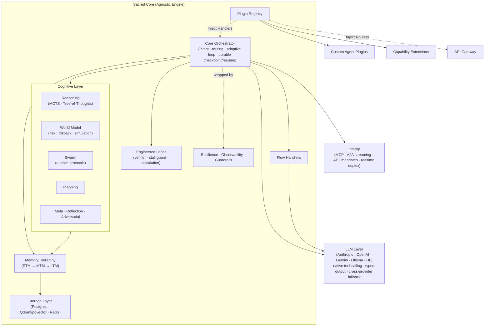

<p align="center">
  <picture>
    <source media="(prefers-color-scheme: dark)" srcset="media/full-white-og.png">
    <source media="(prefers-color-scheme: light)" srcset="media/full-black-og.png">
    
  </picture>
</p>

# BaselithCore

> **Agents that survive production.** Durable execution, enforced budgets, and EU AI Act evidence — self-hosted, with no companion SaaS.

[](https://github.com/baselithcore/baselithcore/actions/workflows/ci.yml)
[](https://pypi.org/p/baselith-core/)
[](https://www.python.org/downloads/)
[](LICENSE)
[](LICENSE.exception)
[](https://docs.baselithcore.xyz)

A Python orchestration engine for agentic AI. A run killed mid-flight resumes
from its last checkpoint without repeating a side effect. Every tool call is
budgeted, gated and traced. The evidence an EU deployment has to produce is a
by-product of running the system, not an archaeology project afterwards.

<div align="center">

[**Quick start**](#quick-start) · [**Docs**](https://docs.baselithcore.xyz) · [**Architecture**](#architecture-at-a-glance) · [**Contributing**](CONTRIBUTING.md)

</div>

> **Writing a plugin? You keep your source.** The [plugin exception](LICENSE.exception)
> lets any plugin that uses the framework as a library ship under any licence you
> like, including a closed one. Same terms for everyone.

---

## Why BaselithCore

- **Agents that survive production.** Durable execution with checkpoint/resume, replayable tool steps, state history and fork/rewind — a `SIGKILL` mid-run recovers without repeating a single side effect.
- **Everything included, nothing rented.** Evaluation suites, LLM-as-judge, red-teaming, OpenTelemetry tracing, Prometheus metrics with real USD cost, Helm/Terraform deployment — built in and self-hosted, with no companion SaaS to subscribe to.
- **Brakes, not just horsepower.** Autonomy gating, durable human-in-the-loop approvals, per-request cost budgets, prompt-injection guardrails, sandboxed code execution — every seam fail-closed by default, plus opt-in EU AI Act / GDPR / NIS2 / DORA primitives with evidence trails.

## Sixty seconds

```bash
pip install baselith-core
```

```python
from core.agent import Agent, Crew, Task

researcher = Agent(system_prompt="You are a meticulous researcher.")
writer = Agent(system_prompt="You write crisp executive summaries.")

crew = Crew(agents=[researcher, writer], tasks=[
    Task("Research {topic} and list the key facts.", agent=researcher),
    Task("Write a summary from the research.", agent=writer),
])
report = (await crew.run(inputs={"topic": "vector databases"})).final
```

Typed, budgeted and observable from the first line — the
[quickstart](https://docs.baselithcore.xyz/getting-started/quickstart/) adds
tools, structured output and a checkpoint store.

## Architecture at a glance


```mermaid
graph TD
    subgraph SC["Sacred Core (Agnostic Engine)"]
        A["Core Orchestrator<br/>(intent · routing · adaptive loop · durable checkpoint/resume)"]
        F["Flow Handlers"]

        subgraph COG["Cognitive Layer"]
            RE["Reasoning<br/>(MCTS · Tree-of-Thoughts)"]
            WM["World Model<br/>(risk · rollback · simulation)"]
            SW["Swarm<br/>(auction protocols)"]
            PL["Planning"]
            MT["Meta · Reflection · Adversarial"]
        end

        LP["Engineered Loops<br/>(verifier · stall guard · escalation)"]
        M["Memory Hierarchy<br/>(STM → MTM → LTM)"]
        S["Storage Layer<br/>(Postgres · Qdrant/pgvector · Redis)"]
        R["Plugin Registry"]
        RES["Resilience · Observability · Guardrails"]
    end

    A --> COG
    A --> F
    A --> LP
    A --> M
    M --> S
    COG --> M

    R --> C["Custom Agent Plugins"]
    R --> D["Capability Extensions"]
    R -.->|Inject Handlers| A
    R -.->|Inject Routers| G["API Gateway"]

    A --> H["LLM Layer<br/>(Anthropic · OpenAI · Gemini · Ollama · HF)<br/>native tool-calling · typed output · cross-provider fallback"]
    F --> H

    A --> I["Interop<br/>(MCP · A2A streaming · AP2 mandates · realtime duplex)"]
    A -.->|wrapped by| RES
```

Two rules hold the shape: `core/` stays domain-agnostic, and everything
domain-specific is a plugin. The [architecture
docs](https://docs.baselithcore.xyz/architecture/overview/) go deeper.

<details>
<summary><b>What's inside</b> — the full capability list</summary>

| | |
| :-- | :-- |
| **Typed agents & declarative crews** | Single-import `Agent`, sequential/parallel/manager-led `Crew`, free-form group chat → [Agent API](https://docs.baselithcore.xyz/core-modules/agent/) |
| **Durable execution & time-travel** | Checkpoint/resume (Postgres, SQLite or in-memory), replayable tool steps, state history, fork/rewind → [Orchestration](https://docs.baselithcore.xyz/core-modules/orchestration/) |
| **Loop engineering** | Verifier-owned loops with stall detection, feed-forward lessons, escalation and resumable outcomes → [Loops](https://docs.baselithcore.xyz/core-modules/loops/) |
| **Structured event streaming** | Per-run agent events in-process or over SSE, plus async run submission with completion webhooks → [Orchestration](https://docs.baselithcore.xyz/core-modules/orchestration/) |
| **Cognitive layer** | MCTS, Tree-of-Thoughts, world model, swarm auctions & bounded handoffs → [Reasoning](https://docs.baselithcore.xyz/core-modules/reasoning/) · [Swarm](https://docs.baselithcore.xyz/core-modules/swarm/) |
| **Governance & safety** | Autonomy gating, durable human-in-the-loop, plan approval, loop & tool budgets, layered guardrails, sandboxed code → [Autonomy & Safety](https://docs.baselithcore.xyz/core-modules/orchestration/) |
| **Memory & RAG** | STM→MTM→LTM hierarchy, hybrid search, hierarchical chunking, full RAG pipeline, Qdrant or pgvector backends → [Memory](https://docs.baselithcore.xyz/core-modules/memory/) |
| **Multimodal** | Vision, native PDF and audio content blocks, duplex realtime voice with barge-in → [Realtime](https://docs.baselithcore.xyz/core-modules/realtime/) |
| **Interoperability** | Native dual-era MCP (server + client + declarative registry), A2A peer interop, AP2 signed-mandate commerce → [MCP](https://docs.baselithcore.xyz/core-modules/mcp/) · [A2A](https://docs.baselithcore.xyz/core-modules/a2a/) |
| **Self-improvement, governed** | Skill evolution, prompt compilation and evolutionary search — every change eval-gated, audited and human-approvable → [Skill Evolution](https://docs.baselithcore.xyz/core-modules/skill-evolution/) |
| **Evaluation & observability** | Trajectory eval in CI, multi-model bake-off, LLM-as-judge, red-team, OTel + Prometheus with USD cost metrics → [Evaluation](https://docs.baselithcore.xyz/core-modules/evaluation/) |
| **Regulatory toolkit** | Opt-in EU AI Act / GDPR / NIS2 / DORA primitives with evidence trails → [Regulatory Compliance](https://docs.baselithcore.xyz/advanced/regulatory-compliance/) |
| **Production deployment** | Docker, Helm, Terraform, SLO rules, typed SDKs → [Deployment](https://docs.baselithcore.xyz/advanced/deployment/) |

</details>

## <span id="quick-start"></span> Quick start

```bash
pip install baselith-core       # core engine
docker compose up -d            # Redis, PostgreSQL, Qdrant (optional)
baselith doctor                 # validate environment and configuration
```

Optional capabilities (RAG, browser automation, OCR, extra model providers,
vector backends, …) install as extras — the [installation
guide](https://docs.baselithcore.xyz/getting-started/installation/) has the
full list.

## Contributing

Contributions are welcome, and the on-ramps are deliberately marked:

- [**good first issue**](https://github.com/baselithcore/baselithcore/issues?q=is%3Aissue+is%3Aopen+label%3A%22good+first+issue%22) — scoped, with context and an acceptance check
- [**help wanted**](https://github.com/baselithcore/baselithcore/issues?q=is%3Aissue+is%3Aopen+label%3A%22help+wanted%22) — bigger pieces that need an owner
- [**Discussions**](https://github.com/baselithcore/baselithcore/discussions) — questions, ideas, and what you built

[CONTRIBUTING.md](CONTRIBUTING.md) covers the dev setup, the quality gates your
PR has to pass, and the review turnaround you can expect.

## Licence

BaselithCore is licensed under the **GNU Affero General Public License v3.0 only
(AGPL-3.0-only)** — see [LICENSE](LICENSE).

[LICENSE.exception](LICENSE.exception) grants an additional permission under
AGPL section 7: a plugin that uses the framework as a library — rather than
modifying it — may be licensed under any terms you choose, including closed
ones, and section 13 never reaches it. The permission is offered to everyone on
identical terms. Two conditions come with it: your plugin must carry the notice
described in section 3(c), and patching files under `core/` makes it a modified
framework rather than a plugin, in which case AGPL-3.0-only applies in full. See
[plugin packaging](https://docs.baselithcore.xyz/plugins/packaging/) for what
the notice has to say.

---
Copyright © 2026 BaselithCore Team.
