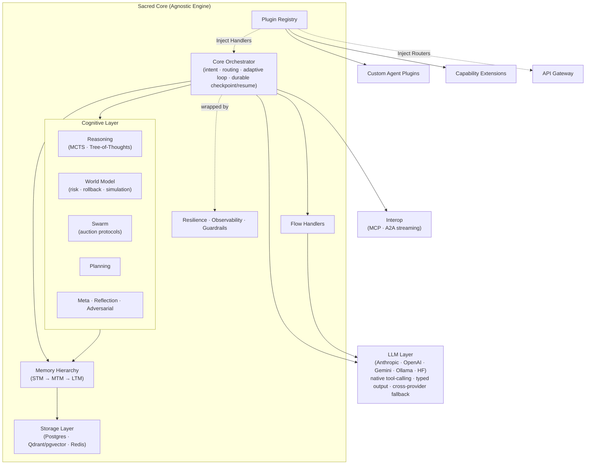

<p align="center">
  <picture>
    <source media="(prefers-color-scheme: dark)" srcset="media/full-white-og.png">
    <source media="(prefers-color-scheme: light)" srcset="media/full-black-og.png">
    
  </picture>
</p>

# BaselithCore

> **The Research-Backed Engine for Production-Grade Agentic AI.**

[](https://www.python.org/downloads/)
[](LICENSE)
[](https://github.com/astral-sh/ruff)
[](http://mypy-lang.org/)
[](tests/)
[](https://pypi.org/p/baselith-core/)

[](https://docs.baselithcore.xyz/advanced/regulatory-compliance/)
[](https://docs.baselithcore.xyz/core-modules/world-model/)
[](https://docs.baselithcore.xyz/core-modules/swarm/)
[](https://docs.baselithcore.xyz/core-modules/mcp/)
[](https://github.com/baselithcore/baselithcore/blob/main/Dockerfile-full)

---

**BaselithCore** is a high-performance orchestration engine designed to transition agentic AI from experimental prototypes to resilient, production-ready infrastructure. Built on a modular architecture, it provides an agnostic foundation for engineering scalable multi-agent systems.

<div align="center">

[**Quick Start**](#quick-start) | [**Documentation**](https://docs.baselithcore.xyz) | [**Architecture**](https://docs.baselithcore.xyz/architecture/) | [**Plugin System**](https://docs.baselithcore.xyz/plugins/)

</div>

---

## Why BaselithCore

- **Agents that survive production.** Durable execution with checkpoint/resume, replayable tool steps, state history and fork/rewind — a crash mid-run recovers without duplicating a single side effect.
- **Everything included, nothing rented.** Evaluation suites, LLM-as-judge, red-teaming, OpenTelemetry tracing, Prometheus metrics with real USD cost, Helm/Terraform deployment — built in and self-hosted, with no companion SaaS to subscribe to.
- **Brakes, not just horsepower.** Autonomy gating, durable human-in-the-loop approvals, per-request cost budgets, prompt-injection guardrails, sandboxed code execution — every seam fail-closed by default, plus opt-in EU AI Act / GDPR compliance primitives.

Ten lines to a working multi-agent pipeline — typed, budgeted, observable:

```python
from core.agent import Agent, Crew, Task

researcher = Agent(system_prompt="You are a meticulous researcher.")
writer = Agent(system_prompt="You write crisp executive summaries.")

crew = Crew(agents=[researcher, writer], tasks=[
    Task("Research {topic} and list the key facts.", agent=researcher),
    Task("Write a summary from the research.", agent=writer),
])
report = (await crew.run(inputs={"topic": "vector databases"})).final
```

## Architecture at a Glance


```mermaid
graph TD
    subgraph SC["Sacred Core (Agnostic Engine)"]
        A["Core Orchestrator<br/>(intent · routing · adaptive loop · durable checkpoint/resume)"]
        F["Flow Handlers"]

        subgraph COG["Cognitive Layer"]
            RE["Reasoning<br/>(MCTS · Tree-of-Thoughts)"]
            WM["World Model<br/>(risk · rollback · simulation)"]
            SW["Swarm<br/>(auction protocols)"]
            PL["Planning"]
            MT["Meta · Reflection · Adversarial"]
        end

        M["Memory Hierarchy<br/>(STM → MTM → LTM)"]
        S["Storage Layer<br/>(Postgres · Qdrant/pgvector · Redis)"]
        R["Plugin Registry"]
        RES["Resilience · Observability · Guardrails"]
    end

    A --> COG
    A --> F
    A --> M
    M --> S
    COG --> M

    R --> C["Custom Agent Plugins"]
    R --> D["Capability Extensions"]
    R -.->|Inject Handlers| A
    R -.->|Inject Routers| G["API Gateway"]

    A --> H["LLM Layer<br/>(Anthropic · OpenAI · Gemini · Ollama · HF)<br/>native tool-calling · typed output · cross-provider fallback"]
    F --> H

    A --> I["Interop<br/>(MCP · A2A streaming)"]
    A -.->|wrapped by| RES
```

The full deep-dive lives in the [architecture docs](https://docs.baselithcore.xyz/architecture/overview/).

## Core Philosophy

1. **Sacred Core**: The `core/` directory contains exclusively agnostic logic — orchestration, infrastructure, utilities. No domain code, ever.
2. **Plugin-First**: All business logic, integrations, and specialized capabilities live in **Plugins**, so secondary features never bloat the engine.
3. **Agentic by Design**: The Agentic Design Patterns (Memory, Reflection, Tool Use, Planning, …) are baked into the orchestrator, not bolted on.

## What's Inside

Every capability ships production-hardened: typed, tested, observable, and fail-closed by default.

| | |
| :-- | :-- |
| **Typed agents & declarative crews** | Single-import `Agent`, multi-agent `Crew` in ten lines → [Agent API](https://docs.baselithcore.xyz/core-modules/agent/) |
| **Durable execution & time-travel** | Checkpoint/resume, replayable tool steps, state history, fork/rewind → [Orchestration](https://docs.baselithcore.xyz/core-modules/orchestration/) |
| **Structured event streaming** | Per-run agent events in-process or over SSE → [Orchestration](https://docs.baselithcore.xyz/core-modules/orchestration/) |
| **Cognitive layer** | MCTS, Tree-of-Thoughts, world model, swarm auctions & handoffs → [Reasoning](https://docs.baselithcore.xyz/core-modules/reasoning/) · [Swarm](https://docs.baselithcore.xyz/core-modules/swarm/) |
| **Governance & safety** | Autonomy gating, durable human-in-the-loop, loop budgets, guardrails, sandboxed code → [Autonomy & Safety](https://docs.baselithcore.xyz/core-modules/orchestration/) |
| **Memory & RAG** | STM→MTM→LTM hierarchy, hybrid search, full RAG pipeline, Qdrant or pgvector backends → [Memory](https://docs.baselithcore.xyz/core-modules/memory/) · [Services](https://docs.baselithcore.xyz/core-modules/services/) |
| **Interoperability** | Native dual-era MCP (server + client), A2A peer interop → [MCP](https://docs.baselithcore.xyz/core-modules/mcp/) · [A2A](https://docs.baselithcore.xyz/core-modules/a2a/) |
| **Evaluation & observability** | Trajectory eval in CI, LLM-as-judge, red-team, OTel + Prometheus with USD cost metrics → [Evaluation](https://docs.baselithcore.xyz/core-modules/evaluation/) |
| **Regulatory toolkit** | Opt-in EU AI Act / GDPR / NIS2 / DORA primitives with evidence trails → [Regulatory Compliance](https://docs.baselithcore.xyz/advanced/regulatory-compliance/) |
| **Production deployment** | Docker, Helm, Terraform, SLO rules, typed SDKs → [Deployment](https://docs.baselithcore.xyz/advanced/deployment/) |

## <span id="quick-start"></span> Quick Start

```bash
pip install baselith-core       # core engine
docker compose up -d            # Redis, PostgreSQL, Qdrant (optional)
baselith doctor                 # validate environment and configuration
```

Optional capabilities (RAG, browser automation, OCR, extra model providers, vector backends, …) install as extras — see the [installation guide](https://docs.baselithcore.xyz/getting-started/installation/) for the full list, and the [quickstart](https://docs.baselithcore.xyz/getting-started/quickstart/) to build your first agent.

## Resources

| Resource                                                                             | Description                                           |
| :----------------------------------------------------------------------------------- | :---------------------------------------------------- |
| [**Official Website**](https://baselithcore.xyz)                                     | The core landing page for the BaselithCore framework. |
| [**Official Documentation**](https://docs.baselithcore.xyz)                          | The official docs for the BaselithCore framework.     |
| [**Architecture**](https://docs.baselithcore.xyz/architecture/overview/)             | Deep dive into the "Sacred Core" and design choices.  |
| [**Plugin Guide**](https://docs.baselithcore.xyz/plugins/architecture/)              | How to extend BaselithCore using the plugin system.   |
| [**Agentic Patterns**](https://docs.baselithcore.xyz/architecture/agentic-patterns/) | Implementation of Agentic Design Patterns.            |
| [**Regulatory Compliance**](https://docs.baselithcore.xyz/advanced/regulatory-compliance/) | AI Act, GDPR, NIS2 and DORA mapped article by article — gaps included. |
| [**Deployment**](https://docs.baselithcore.xyz/advanced/deployment/)                 | Production-ready deployment strategies.               |

## Contributing & License

We welcome contributions that adhere to our code standards. Please review [CONTRIBUTING.md](CONTRIBUTING.md).

BaselithCore is licensed under the **GNU Affero General Public License v3.0 (AGPL v3)**.
See [LICENSE](LICENSE) for full details.

---
Copyright © 2026 BaselithCore Team.
