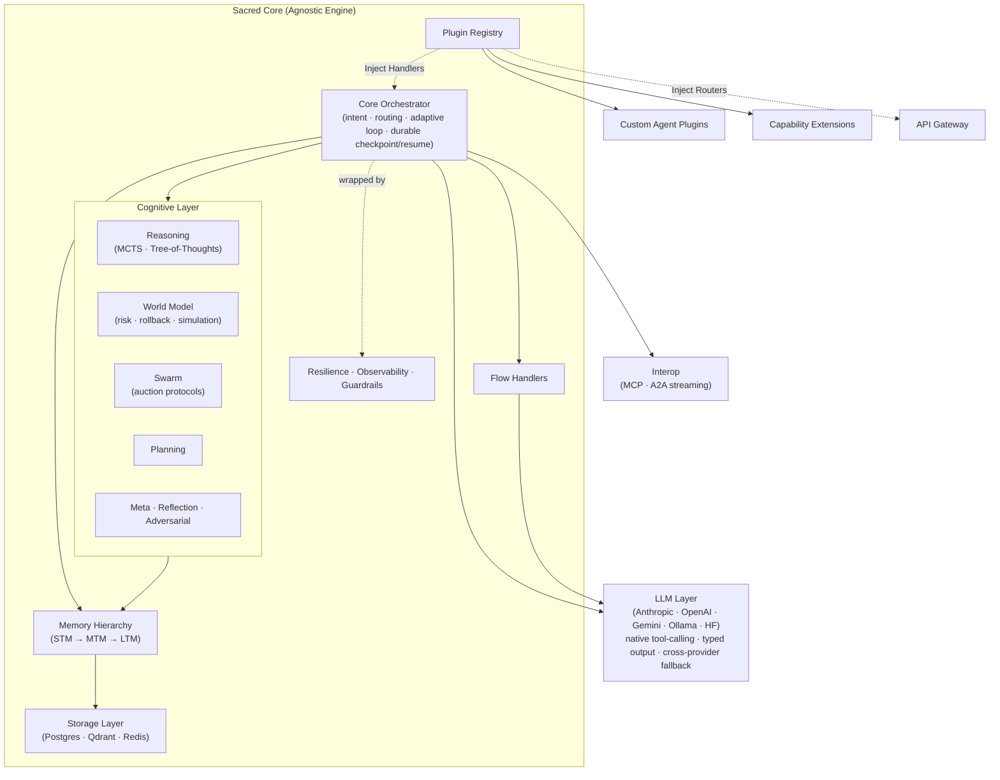

<p align="center">
  <picture>
    <source media="(prefers-color-scheme: dark)" srcset="media/full-white-og.png">
    <source media="(prefers-color-scheme: light)" srcset="media/full-black-og.png">
    
  </picture>
</p>

# BaselithCore

> **The Research-Backed Engine for Production-Grade Agentic AI.**

[](https://www.python.org/downloads/)
[](LICENSE)
[](https://github.com/astral-sh/ruff)
[](http://mypy-lang.org/)
[](tests/)
[](https://pypi.org/p/baselith-core/)

[](mkdocs-site/docs/advanced/regulatory-compliance.md)
[](mkdocs-site/docs/core-modules/privacy.md)
[](mkdocs-site/docs/core-modules/incidents.md)
[](mkdocs-site/docs/core-modules/incidents.md)
[](mkdocs-site/docs/core-modules/audit-trail.md)

[](mkdocs-site/docs/core-modules/world-model.md)
[](mkdocs-site/docs/core-modules/swarm.md)
[](mkdocs-site/docs/architecture/agentic-patterns.md)
[](mkdocs-site/docs/core-modules/mcp.md)
[](https://github.com/baselithcore/baselithcore/blob/main/Dockerfile-full)

---

**BaselithCore** is a high-performance orchestration engine designed to transition agentic AI from experimental prototypes to resilient, production-ready infrastructure. Built on a modular architecture, it provides an agnostic foundation for engineering scalable multi-agent systems.

<div align="center">

[**Quick Start**](#quick-start) | [**Architecture**](https://docs.baselithcore.xyz/architecture/) | [**Plugin System**](https://docs.baselithcore.xyz/plugins/) | [**API Reference**](https://docs.baselithcore.xyz/api/)

</div>

---

## Core Philosophy

BaselithCore is governed by a strict architectural separation:

1. **Sacred Core**: The `core/` directory contains exclusively agnostic logic—orchestration, infrastructure, and utilities. It remains untainted by domain-specific logic.
2. **Plugin-First**: All business logic, external integrations, and specialized capabilities are implemented as **Plugins**, ensuring secondary features never bloat the primary engine.
3. **Agentic by Design**: Native adherence to the Agentic Design Patterns (Memory, Reflection, Tool Use, etc.) is baked into the orchestrator.

### Architecture Overview


```mermaid
graph TD
    subgraph SC["Sacred Core (Agnostic Engine)"]
        A["Core Orchestrator<br/>(intent · routing · adaptive loop · durable checkpoint/resume)"]
        F["Flow Handlers"]

        subgraph COG["Cognitive Layer"]
            RE["Reasoning<br/>(MCTS · Tree-of-Thoughts)"]
            WM["World Model<br/>(risk · rollback · simulation)"]
            SW["Swarm<br/>(auction protocols)"]
            PL["Planning"]
            MT["Meta · Reflection · Adversarial"]
        end

        M["Memory Hierarchy<br/>(STM → MTM → LTM)"]
        S["Storage Layer<br/>(Postgres · Qdrant · Redis)"]
        R["Plugin Registry"]
        RES["Resilience · Observability · Guardrails"]
    end

    A --> COG
    A --> F
    A --> M
    M --> S
    COG --> M

    R --> C["Custom Agent Plugins"]
    R --> D["Capability Extensions"]
    R -.->|Inject Handlers| A
    R -.->|Inject Routers| G["API Gateway"]

    A --> H["LLM Layer<br/>(Anthropic · OpenAI · Gemini · Ollama · HF)<br/>native tool-calling · typed output · cross-provider fallback"]
    F --> H

    A --> I["Interop<br/>(MCP · A2A streaming)"]
    A -.->|wrapped by| RES
```

---

## Key Capabilities

### Cognitive Orchestration

We manage the complexity of agentic reasoning so you can focus on domain value.

* **Strategic Optimization**: Native **Monte Carlo Tree Search (MCTS)** and **Tree of Thoughts** for advanced decision-making and "What-If" simulations.
* **Native Tool-Calling & Typed Output**: Provider-agnostic **tool-calling and structured outputs** across Anthropic, OpenAI, Gemini and Ollama, with a prompt-coercion fallback for providers without a native API. `generate_typed()` returns a validated **Pydantic** instance — schema derived from the model, self-repairing on a schema violation.
* **Durable Execution**: **Checkpoint/resume** of the agent loop with idempotent, deterministic-replay tool steps (in-memory or Postgres-backed), so a crash mid-run recovers without duplicating side effects — plus an opt-in startup sweep that resumes runs interrupted by a restart.
* **Swarm Intelligence**: Decentralized **Auction Protocols** for optimal task allocation, structured agent **handoffs** (objective / facts / already-attempted brief, bounded payload), and budget-aware structured concurrency across agent collectives.
* **Multilayered Memory**: Research-grade memory hierarchy (STM → MTM → LTM) with token-budgeted context assembly, intelligent consolidation, and optional **context folding** — older turns summarized, recent ones verbatim, instead of hard truncation.
* **Composable Workflows**: Graph execution with per-node **retry/backoff** and **cyclic evaluation loops** (generate → evaluate → refine), bounded by a step budget so a non-converging loop fails instead of hanging.
* **Interoperability**: Native **Model Context Protocol**, complete and dual-era — the stateless **2026-07-28** revision (per-request metadata, `server/discover`, caching hints, mirrored-header validation, SSE response streams) alongside the `initialize` handshake down to `2024-11-05`, on both the server and client sides. Tools, resources, resource templates and prompts with structured output, annotations, pagination, completion and icons; **multi round-trip requests** with HMAC-sealed `requestState`; the **tasks** extension for long-running work; `subscriptions/listen` change notifications; cancellation, progress and client-side TTL caching — plus **A2A** peer interop with SSE streaming and durable task storage.

### Governance & Safety

Production agents need brakes, not just capability. Every seam is fail-closed by default.

* **Autonomy Gating**: A three-tier **autonomy policy** (supervised → semi → fully autonomous) decides which tool categories need human approval. The gate applies to *every* execution path — the ReAct loop, the parallel executor, and MCP — never just the easy one.
* **Human-in-the-Loop**: An approval request **durably pauses** the run (`awaiting_approval`) instead of failing it; operators list, approve/deny and resume through the `/approvals` API, and the loop replays completed steps.
* **Loop Budgets**: Per-request caps on iterations, tool calls, tokens, wall-clock deadline and **USD cost**, charged from inside the LLM layer — plus early escalation when a tool fails repeatedly, so a broken dependency can't burn the whole budget.
* **Content Guardrails**: Input guardrails run **before any budget or LLM spend**, on the streaming path too; non-streamed responses are filtered for PII and harmful content; external content (MCP results, scraped pages, skill bodies) is scanned and sanitized for **indirect prompt injection** by default.
* **Sandboxed Code Execution**: Agent-written code runs in Docker or MicroVM isolation (no network, dropped capabilities, resource caps), preceded by **AST static analysis** that rejects malformed code and flags dangerous imports before a container even starts.
* **Prompt-as-Code**: The conversation system prompt ships as a versioned, checksummed file served through a **prompt registry** — with labels, deterministic **A/B bucketing**, OTel provenance on every render, and deployment-level overrides via a prompt catalog directory.
* **Enforced Quality Gates**: A deterministic **trajectory-eval suite** gates every merge in CI (no API keys, no network), alongside architecture-boundary, strict-typing, file-size, plugin-integrity and OpenAPI-drift gates.

> New safety and portability features that change runtime behaviour ship **opt-in** (extended thinking, context folding, durable checkpointing, crash recovery): defaults preserve existing behaviour, and enabling them is a deployment decision.

### Regulatory Toolkit

The **EU AI Act applies in full from 2 August 2026**, alongside NIS2, DORA and the GDPR. A framework cannot be "compliant" — compliance attaches to a deployed system and the organisation running it. What BaselithCore supplies is the technical primitives each obligation requires, plus the **evidence** that they were used. Everything below is opt-in and default-off.

* **AI System Registry**: The inventory every obligation attaches to — Art. 5 prohibited-practice screening, Art. 6 risk classification (including the Art. 6(3) derogation *and* the profiling exception that defeats it), Art. 49 registration tracking, and a per-system list of the duties that follow.
* **Tamper-Evident Audit Trail**: Events are **recorded**, not merely logged — an append-only, hash-chained store whose integrity is verifiable after the fact, retained **180 days by default** because Art. 19 / Art. 26(6) demand six months. A retention purge is distinguishable from tampering by design.
* **Multi-Regime Incident Clocks**: One breach can start four independent clocks toward four different authorities. **NIS2 Art. 23** (24h/72h/1 month), **DORA Art. 19** (4h/72h/1 month), **AI Act Art. 73** (2/10/15 days, derived from the Art. 3(49) category — statutory, so not a setting), **GDPR Art. 33/34** (72h plus the register of *every* breach). Overdue obligations are detectable, not discovered at inspection.
* **Governance Artefacts**: **Annex IV** technical documentation drafted from the registry, **Art. 27 FRIA** that refuses to be marked complete while a statutory element is empty, **GDPR Art. 30 ROPA**, and an **Art. 72 post-market monitoring** plan with thresholds, breach detection and a review cadence.
* **Full Data-Subject Rights**: Access, portability, rectification, erasure, restriction and objection, plus **Art. 7 consent** as an append-only record chain — withdrawal adds a state rather than destroying the proof that prior processing was lawful.
* **Bias Examination**: Group selection rates, demographic parity, disparate impact, equalized odds and per-group accuracy for the Art. 10(2)(f)/(g) examination — with the incompatibility of fairness criteria stated rather than papered over.
* **Compliance Profiles**: `BASELITH_COMPLIANCE_PROFILE=ai-act-high-risk` checks the whole posture at startup and names every gap with the article behind it; strict mode fails startup instead. It **reports — it never switches a subsystem on by itself**, because that would change where data is written and what gets deleted.

> The [regulatory compliance matrix](mkdocs-site/docs/advanced/regulatory-compliance.md) maps each article to the module and tests that implement it — **and states the gaps**. No subsystem here files anything with an authority: conformity assessment, the EU declaration, CE marking and registration remain the operator's acts.

---

## <span id="quick-start"></span> Quick Start

### 1. Prerequisites

* **Python**: 3.12+
* **Docker**: For Redis, Qdrant, and PostgreSQL infrastructure.
* **Vector/Relational Storage**: Managed via Docker Compose.

### 2. Installation

Install the core engine via pip:

```bash
pip install baselith-core
```

Install optional capabilities only when needed:

```bash
# RAG / embedding / reranking
pip install "baselith-core[rag]"

# Browser automation and JS rendering
pip install "baselith-core[browser,web]"

# Document ingestion and OCR
pip install "baselith-core[documents,ocr,nlp]"

# Additional model providers
pip install "baselith-core[gemini]"
pip install "baselith-core[huggingface]"
```

Or clone for extension development:

```bash
git clone https://github.com/baselithcore/baselithcore.git
cd baselith-core
docker compose up -d
```

### 3. Verification

```bash
baselith doctor  # Validate environment and configuration
```

---

## Resources

| Resource                                                                             | Description                                           |
| :----------------------------------------------------------------------------------- | :---------------------------------------------------- |
| [**Official Website**](https://baselithcore.xyz)                                     | The core landing page for the BaselithCore framework. |
| [**Official Documentation**](https://docs.baselithcore.xyz)                          | The official docs for the BaselithCore framework.     |
| [**Architecture**](https://docs.baselithcore.xyz/architecture/overview/)             | Deep dive into the "Sacred Core" and design choices.  |
| [**Plugin Guide**](https://docs.baselithcore.xyz/plugins/architecture/)              | How to extend BaselithCore using the plugin system.   |
| [**Agentic Patterns**](https://docs.baselithcore.xyz/architecture/agentic-patterns/) | Implementation of Agentic Design Patterns.            |
| [**Regulatory Compliance**](https://docs.baselithcore.xyz/advanced/regulatory-compliance/) | AI Act, GDPR, NIS2 and DORA mapped article by article — gaps included. |
| [**Deployment**](https://docs.baselithcore.xyz/advanced/deployment/)                 | Production-ready deployment strategies.               |

---

## Contributing & License

We welcome contributions that adhere to our code standards. Please review [CONTRIBUTING.md](CONTRIBUTING.md).

BaselithCore is licensed under the **GNU Affero General Public License v3.0 (AGPL v3)**.
See [LICENSE](LICENSE) for full details.

---
Copyright © 2026 BaselithCore Team.
