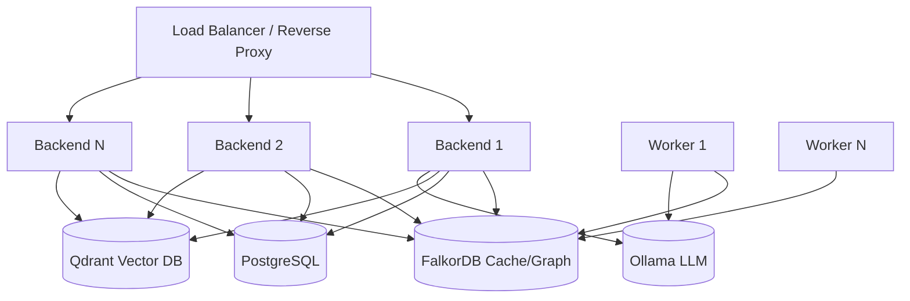

This guide walks you through deploying BaselithCore in a production environment. Proper deployment is essential to ensure **reliability**, **security**, and **scalability** of the system.

!!! info "When to Use This Guide"
    Use this guide when transitioning from local development to a production environment accessible by real users. Ensure the system functions correctly locally before proceeding.

---

## Prerequisites

Before beginning deployment, verify you have:

| Requirement        | Description                       | Verification             |
| ------------------ | --------------------------------- | ------------------------ |
| **Docker**         | Docker Engine 20.10+ installed    | `docker --version`       |
| **Docker Compose** | Docker Compose V2                 | `docker compose version` |
| **Resources**      | Minimum 4GB RAM, 2 CPU cores      | Check host dashboard     |
| **Storage**        | At least 20GB disk space for data | `df -h`                  |
| **Network**        | Port 8000 (or custom) accessible  | Test connectivity        |
| **Secrets**        | Credentials ready (DB, API keys)  | `.env` file prepared     |

!!! warning "Isolated Environment"
    Never deploy on machines running other critical services without proper containerization. Always use isolated environments.

---

## Production Architecture

The production system comprises several services working together:



**Core Services:**

- **Backend**: FastAPI server handling HTTP requests and agent orchestration
- **FalkorDB**: Unified storage for knowledge graph, caching, and task queue (Redis-compatible)
- **PostgreSQL**: Relational database for structured data persistence
- **Qdrant**: Vector database for embeddings and semantic search (optional)
- **Workers**: Async task processors for long-running operations

---

## Docker Compose

The `docker-compose.prod.yml` file defines the entire infrastructure, including reverse proxy and observability.

```yaml title="docker-compose.prod.yml"
version: '3.8'

services:
  # Main service: API Backend
  api:
    build:
      context: .
      dockerfile: Dockerfile-slim
    container_name: baselith-core-api
    env_file: configs/.env.production
    environment:
      - APP_ENV=production
      - ENVIRONMENT=production
      - CORE_LOG_FORMAT=json
      - HOST=0.0.0.0
      - PORT=8000
      - TELEMETRY_OTEL_ENDPOINT=http://jaeger:4317
      - DOCKER_HOST=tcp://${SANDBOX_DOCKER_HOST:?SANDBOX_DOCKER_HOST must be set}
      - DOCKER_TLS_VERIFY=1
      - DOCKER_CERT_PATH=/certs/client
      - SENTRY_DSN=${SENTRY_DSN}
    volumes:
      - ${SANDBOX_CERTS_DIR:-./deploy/sandbox/client-certs}:/certs/client:ro
      - ./data:/app/data
    networks:
      - app_net
      - obs_net
    depends_on:
      - falkordb
      - postgres
    init: true
    security_opt:
      - no-new-privileges:true
    cap_drop:
      - ALL
    tmpfs:
      - /tmp:size=64m,noexec,nosuid
    restart: unless-stopped
    deploy:
      resources:
        limits:
          cpus: '1.0'
          memory: 1G
    healthcheck:
      test: ["CMD", "curl", "-f", "http://localhost:8000/health"]
      interval: 30s
      timeout: 10s
      retries: 3

  # FalkorDB (Cache, Queue, and GraphDB)
  falkordb:
    image: falkordb/falkordb:latest
    volumes:
      - falkordb_data:/data
    networks:
      - app_net
    security_opt:
      - no-new-privileges:true
    cap_drop:
      - ALL
    restart: unless-stopped
    deploy:
      resources:
        limits:
          cpus: '0.8'
          memory: 1G
    healthcheck:
      test: ['CMD', 'redis-cli', 'ping']
      interval: 10s
      timeout: 5s
      retries: 5

  # Relational Database
  postgres:
    image: postgres:16-alpine
    environment:
      - POSTGRES_DB=${DB_NAME:-baselithcore}
      - POSTGRES_USER=${DB_USER:-baselithcore}
      - POSTGRES_PASSWORD=${DB_PASSWORD:?DB_PASSWORD must be set}
    volumes:
      - postgres_data:/var/lib/postgresql/data
    networks:
      - app_net
    security_opt:
      - no-new-privileges:true
    cap_drop:
      - ALL
    restart: unless-stopped
    deploy:
      resources:
        limits:
          cpus: '0.5'
          memory: 512M
    healthcheck:
      test: ['CMD-SHELL', 'pg_isready -d ${DB_NAME:-baselithcore} -U ${DB_USER:-baselithcore}']
      interval: 10s
      timeout: 5s
      retries: 5

  # Worker for Async Tasks
  worker:
    build:
      context: .
      dockerfile: Dockerfile-slim
    container_name: baselith-core-worker
    env_file: configs/.env.production
    command: python -m core.task_queue.worker
    environment:
      - APP_ENV=production
      - ENVIRONMENT=production
      - CORE_LOG_FORMAT=json
      - DOCKER_HOST=tcp://${SANDBOX_DOCKER_HOST:?SANDBOX_DOCKER_HOST must be set}
      - DOCKER_TLS_VERIFY=1
      - DOCKER_CERT_PATH=/certs/client
      - TELEMETRY_OTEL_ENDPOINT=http://jaeger:4317
      - SENTRY_DSN=${SENTRY_DSN}
    volumes:
      - ${SANDBOX_CERTS_DIR:-./deploy/sandbox/client-certs}:/certs/client:ro
      - ./data:/app/data
    networks:
      - app_net
      - obs_net
    depends_on:
      postgres:
        condition: service_healthy
      falkordb:
        condition: service_healthy
    init: true
    security_opt:
      - no-new-privileges:true
    cap_drop:
      - ALL
    tmpfs:
      - /tmp:size=64m,noexec,nosuid
    restart: unless-stopped
    deploy:
      resources:
        limits:
          cpus: '0.8'
          memory: 1G

  # Reverse Proxy
  gateway:
    image: nginx:alpine
    container_name: baselith-gateway
    ports:
      - "80:80"
    volumes:
      - ./deploy/nginx/nginx.conf:/etc/nginx/nginx.conf:ro
    networks:
      - app_net
    depends_on:
      - api
    read_only: true
    security_opt:
      - no-new-privileges:true
    cap_drop:
      - ALL
    cap_add:
      - NET_BIND_SERVICE
    tmpfs:
      - /var/cache/nginx
      - /var/run
      - /tmp:size=32m,noexec,nosuid
    restart: unless-stopped
    deploy:
      resources:
        limits:
          cpus: '0.5'
          memory: 256M

  # === Observability Stack ===
  jaeger:
    image: jaegertracing/all-in-one:1.52
    container_name: baselith-jaeger
    environment:
      - COLLECTOR_OTLP_ENABLED=true
    ports:
      - "16686:16686"
    networks:
      - obs_net
    security_opt:
      - no-new-privileges:true
    cap_drop:
      - ALL
    restart: unless-stopped

  prometheus:
    image: prom/prometheus:v2.47.0
    container_name: baselith-prometheus
    volumes:
      - ./prometheus.yml:/etc/prometheus/prometheus.yml:ro
      - ./deploy/prometheus/alert-rules.yml:/etc/prometheus/alert-rules.yml:ro
      - prometheus_data:/prometheus
    networks:
      - app_net
    command:
      - '--config.file=/etc/prometheus/prometheus.yml'
      - '--storage.tsdb.path=/prometheus'
    security_opt:
      - no-new-privileges:true
    cap_drop:
      - ALL
    restart: unless-stopped

volumes:
  falkordb_data:
  postgres_data:
  prometheus_data:

networks:
  app_net:
  obs_net:
```

!!! warning "Production Compose Hardening"
    The backend container is intentionally **not** published directly on the host anymore. Route traffic through the reverse proxy only.
    Also avoid weak fallback credentials in production: `DB_PASSWORD` must be explicitly set, and the runtime now reads both `APP_ENV=production` and `ENVIRONMENT=production` to activate production-only checks consistently.
    As an extra hardening layer, the production compose enables `no-new-privileges` broadly, drops ambient Linux capabilities for non-privileged services, and keeps the Nginx gateway on a read-only filesystem with dedicated `tmpfs` mounts.
    The runtime images now honor `HOST`, `PORT`, and optional `WEB_CONCURRENCY`, so container startup stays aligned with Compose, health checks, and reverse proxy settings.
    TLS is expected to terminate on an external reverse proxy or load balancer. The bundled Nginx gateway stays on internal HTTP only and preserves incoming `X-Forwarded-Proto` / `X-Forwarded-Port` headers.
    The production compose does not start a privileged sandbox daemon locally. API and worker connect to an external sandbox host via `SANDBOX_DOCKER_HOST` and a client cert bundle mounted from `SANDBOX_CERTS_DIR`.

### Service Explanation

#### Backend Service

The FastAPI application server that:

- Handles HTTP API requests
- Orchestrates agent workflows
- Manages plugin lifecycle
- Serves WebSocket connections for streaming

**Health checks** ensure the container restarts if unresponsive.

#### FalkorDB Service (Redis-Compatible)

Provides three critical functionalities:

- **Graph Storage**: Knowledge Graph for agent reasoning.
- **Session cache**: User context and conversation history.
- **Task queue**: Async job distribution via RQ.

**Persistence** via AOF (Append-Only File) prevents data loss on restart.

#### PostgreSQL Service

Stores structured data:

- User accounts and authentication
- Plugin configurations
- Audit logs
- System metadata

**Volumes** ensure data persists across container restarts.

#### Worker Service

Processes background tasks:

- LLM batch processing
- Document embedding generation
- Report generation
- External API integrations

**Concurrency** parameter determines parallel task execution (adjust based on CPU cores).

#### External Sandbox Host

Production code execution is expected to run on a separate sandbox host or node. API and worker connect to it over mutual TLS:

- `SANDBOX_DOCKER_HOST` points to the external daemon address, for example `sandbox.internal.example:2376`
- `SANDBOX_CERTS_DIR` provides the client TLS bundle mounted at `/certs/client`
- the sandbox host should run in an isolated trust zone and should not share the same node as the main application stack

### Starting the System

```bash
# Create environment file
cp .env.example .env.production
# Edit .env.production with your values

# Run preflight checks (required vars, sandbox certs, external daemon reachability)
./scripts/prod-preflight.sh

# Start all services
docker compose -f docker-compose.prod.yml --env-file .env.production up -d

# Verify status
docker compose ps
```

---

## Scaling

One of the system's strengths is horizontal scalability to handle increasing loads.

### Horizontal Scaling (Backend)

Launch multiple backend instances to distribute load. The load balancer (Nginx, Traefik, or cloud LB) distributes requests.

```bash
# Start 3 backend instances
docker compose up --scale backend=3 -d
```

!!! tip "Statelessness"
    The backend is designed to be **stateless**: all sessions are in Redis, so you can scale without consistency issues.

**When to Scale:**

- CPU consistently > 70%
- Request latency > 2 seconds
- Frequent 503 errors

**Monitoring scaling effectiveness:**

```bash
# Monitor container resource usage
docker stats

# Check request distribution
docker compose logs backend | grep "Request completed"
```

### Worker Scaling

Workers process async tasks (embeddings, LLM batches, etc.). Scale based on queue depth.

```bash
# Start 5 parallel workers
docker compose up --scale worker=5 -d
```

**Queue Monitoring:**

```bash
baselith queue status
```

If you consistently see `Pending > 100`, add workers.

**Optimal worker count:**

- **CPU-bound tasks**: Number of CPU cores
- **I/O-bound tasks**: 2-4x CPU cores
- **Mixed workloads**: Start with CPU cores, then scale based on metrics

---

## Reverse Proxy (Production)

In production, **never expose the backend directly**. Use a reverse proxy like Nginx or Traefik.

### Nginx Configuration

```nginx title="/etc/nginx/sites-available/multiagent"
upstream backend {
    # Backend server pool (if scaled)
    server 127.0.0.1:8000;
    server 127.0.0.1:8001;
    server 127.0.0.1:8002;
    
    # Keepalive connections
    keepalive 32;
}

server {
    listen 80;
    server_name baselith.ai;
    
    # Redirect HTTP -> HTTPS
    return 301 https://$server_name$request_uri;
}

server {
    listen 443 ssl http2;
    server_name baselith.ai;
    
    # SSL Certificates (Let's Encrypt recommended)
    ssl_certificate /etc/letsencrypt/live/baselith.ai/fullchain.pem;
    ssl_certificate_key /etc/letsencrypt/live/baselith.ai/privkey.pem;
    
    # Security headers
    add_header X-Frame-Options "SAMEORIGIN" always;
    add_header X-Content-Type-Options "nosniff" always;
    add_header X-XSS-Protection "1; mode=block" always;
    add_header Strict-Transport-Security "max-age=31536000; includeSubDomains" always;
    
    location / {
        proxy_pass http://backend;
        proxy_http_version 1.1;
        proxy_set_header Upgrade $http_upgrade;
        proxy_set_header Connection "upgrade";
        proxy_set_header Host $host;
        proxy_set_header X-Real-IP $remote_addr;
        proxy_set_header X-Forwarded-For $proxy_add_x_forwarded_for;
        proxy_set_header X-Forwarded-Proto $scheme;
        
        # Timeout for LLM (long responses)
        proxy_read_timeout 120s;
        proxy_connect_timeout 10s;
    }

    # SSE / chat streaming: disable proxy buffering to preserve token-by-token delivery
    location /chat/stream {
        proxy_pass http://backend;
        proxy_http_version 1.1;
        proxy_set_header Host $host;
        proxy_set_header X-Real-IP $remote_addr;
        proxy_set_header X-Forwarded-For $proxy_add_x_forwarded_for;
        proxy_set_header X-Forwarded-Proto $scheme;
        proxy_buffering off;
        proxy_cache off;
        add_header X-Accel-Buffering no;
        proxy_read_timeout 300s;
    }
}
```

### SSL Certificate Setup (Let's Encrypt)

```bash
# Install certbot
sudo apt install certbot python3-certbot-nginx

# Obtain certificate
sudo certbot --nginx -d baselith.ai

# Auto-renewal is configured automatically
sudo certbot renew --dry-run
```

---

## Production Checklist

Before going live, verify every point:

### Security

- [ ] `CORE_DEBUG=false` - Disable debug mode
- [ ] `APP_ENV=production` and `ENVIRONMENT=production` set consistently
- [ ] Secrets in environment variables (never in code)
- [ ] HTTPS configured with valid certificate
- [ ] Rate limiting active (enforced by `SecurityManager`; `fastapi-limiter` for secondary per-route limits)
- [ ] CORS configured for authorized domains only
- [ ] API documentation disabled or restricted (`ENABLE_API_DOCS=false`)
- [ ] Strong JWT secret (256-bit minimum)
- [ ] `DB_PASSWORD` set to a strong value with no insecure fallback in compose
- [ ] Firewall rules configured (only necessary ports open)

### Resilience

- [ ] Health checks configured for each service
- [ ] Restart policy (`unless-stopped`) set
- [ ] Monitoring configured (Prometheus/Grafana)
- [ ] Alerting configured for critical metrics
- [ ] Automated database backups (daily minimum)
- [ ] Log rotation configured
- [ ] Circuit breakers enabled (LLM, VectorStore)
- [ ] Retry policies configured (LLM, VectorStore, Database)
- [ ] Run `alembic upgrade head` before first deploy — migration status is checked at startup and logged as ERROR if outdated

### Performance

- [ ] Database connection pooling (`DATABASE_POOL_SIZE=20`)
- [ ] Redis persistence enabled
- [ ] LLM cache active for repeated prompts
- [ ] Indexes created on frequently queried columns
- [ ] Static content CDN configured
- [ ] Compression enabled (gzip/brotli)

### Observability

- [ ] Structured logging (JSON format)
- [ ] Log aggregation (ELK/Splunk/Datadog)
- [ ] Distributed tracing (Jaeger)
- [ ] Metrics collection (Prometheus)
- [ ] Error tracking (Sentry)
- [ ] Uptime monitoring configured

---

## Production Configuration

Complete example of `.env.production`:

```env title=".env.production"
# Environment
APP_ENV=production
ENVIRONMENT=production
CORE_DEBUG=false
LOG_LEVEL_CONSOLE=INFO
LOG_LEVEL_FILE=INFO
LOG_JSON=true
LOG_MASKING_ENABLED=true

# Security (CHANGE THESE VALUES!)
SECRET_KEY=your-256-bit-secret-key-change-me-use-openssl-rand
ALLOW_ORIGINS=["https://baselith.ai","https://app.baselith.ai"]
AUTH_REQUIRED=true

# Database
DB_HOST=postgres
DB_NAME=baselithcore
DB_USER=baselithcore
DB_PASSWORD=strong_password_here
DB_POOL_MIN_SIZE=5
DB_POOL_MAX_SIZE=20

# Cache / Queue / Graph
CACHE_BACKEND=redis
CACHE_REDIS_URL=redis://falkordb:6379/1
QUEUE_REDIS_URL=redis://falkordb:6379/2
GRAPH_DB_ENABLED=true
GRAPH_DB_URL=redis://falkordb:6379

# LLM
LLM_PROVIDER=openai
LLM_MODEL=gpt-4o-mini
LLM_OPENAI_API_KEY=${OPENAI_API_KEY:-}
LLM_BUDGET_ENABLED=true
LLM_BUDGET_MAX_TOKENS=500000

# Rate Limiting
API_KEY_ENABLED=true

# Observability
TELEMETRY_ENABLED=true
TELEMETRY_OTEL_ENDPOINT=http://jaeger:4317
SENTRY_DSN=${SENTRY_DSN}
```

!!! danger "Secrets Security"
    **NEVER commit `.env.production` to Git!** Add to `.gitignore`. Use secret managers (Vault, AWS Secrets Manager, etc.) in enterprise environments.

### Generating Secure Secrets

```bash
# Generate JWT secret (256-bit)
openssl rand -base64 32

# Generate API key salt
openssl rand -hex 16

# Generate strong database password
openssl rand -base64 24
```

---

## Troubleshooting

### Backend Won't Start

**Symptoms:** Container in restart loop, connection errors.

**Diagnosis:**

```bash
# Check logs
docker compose logs backend --tail 50

# Verify database connectivity
docker compose exec backend python -c "from core.db import engine; print(engine.url)"

# Check environment variables
docker compose exec backend env | grep DATABASE
```

**Common Solutions:**

- **Database unreachable** -> Verify `DATABASE_URL` and postgres is running
- **Redis unreachable** -> Verify `REDIS_URL`
- **Port already in use** -> Change port in docker-compose
- **Missing dependencies** -> Rebuild image: `docker compose build --no-cache`

### Performance Degradation

**Symptoms:** High latency, frequent timeouts.

**Diagnosis:**

```bash
# Check resource usage
docker stats

# Check task queue
baselith queue status

# Check cache hit rate
baselith cache stats

# Check database connections
docker compose exec postgres psql -U multiagent -c "SELECT count(*) FROM pg_stat_activity;"
```

**Solutions:**

- **High CPU** → Scale backend (`--scale backend=N`)
- **Long queue** → Scale workers (`--scale worker=N`)
- **High cache miss rate** → Increase TTL or cache size
- **Database connection pool exhausted** → Increase `DATABASE_POOL_SIZE`

### 502/503 Errors

**Symptoms:** Bad Gateway or Service Unavailable from reverse proxy.

**Solutions:**

1. Verify backend is running: `docker compose ps`
2. Increase `proxy_read_timeout` for long LLM requests
3. Check health endpoint: `curl http://localhost:8000/health`
4. Review backend logs: `docker compose logs backend --tail 100`
5. Verify nginx configuration: `sudo nginx -t`

### Database Connection Issues

**Symptoms:** `FATAL: remaining connection slots are reserved`

**Diagnosis:**

```bash
# Check active connections
docker compose exec postgres psql -U multiagent -c \
  "SELECT count(*), state FROM pg_stat_activity GROUP BY state;"
```

**Solutions:**

- Increase PostgreSQL `max_connections` in `postgresql.conf`
- Reduce application `DATABASE_POOL_SIZE`
- Investigate connection leaks in application code
- Enable connection pooling with PgBouncer

---

## Backup Strategy

### Database Backups

**Automated daily backups:**

```bash title="scripts/backup-db.sh"
#!/bin/bash
DATE=$(date +%Y%m%d_%H%M%S)
BACKUP_DIR="/backups/postgres"

# Create backup
docker compose -f docker-compose.prod.yml exec -T postgres pg_dump -U baselithcore baselithcore \
  | gzip > "${BACKUP_DIR}/backup_${DATE}.sql.gz"

# Retain last 30 days
find "${BACKUP_DIR}" -name "backup_*.sql.gz" -mtime +30 -delete
```

**Cron configuration:**

```cron
0 2 * * * /opt/baselith/scripts/backup-db.sh >> /var/log/backup.log 2>&1
```

### Redis Backups

Redis AOF provides automatic persistence. Manual snapshots:

```bash
# Trigger manual snapshot
docker compose exec redis redis-cli BGSAVE

# Copy RDB file
docker compose cp redis:/data/dump.rdb ./backups/redis/
```

### Application State Backups

```bash
# Backup plugin configurations
docker compose exec backend tar czf - /app/configs \
  > backups/configs_$(date +%Y%m%d).tar.gz

# Backup uploaded files (if any)
docker compose exec backend tar czf - /app/uploads \
  > backups/uploads_$(date +%Y%m%d).tar.gz
```

---

## Monitoring Setup

### Prometheus Metrics

Add Prometheus to `docker-compose.prod.yml`:

```yaml
prometheus:
  image: prom/prometheus:latest
  volumes:
    - ./prometheus.yml:/etc/prometheus/prometheus.yml
    - prometheus_data:/prometheus
  ports:
    - "9090:9090"
  restart: unless-stopped
```

```yaml title="prometheus.yml"
global:
  scrape_interval: 15s

scrape_configs:
  - job_name: 'multiagent'
    static_configs:
      - targets: ['backend:9090']
```

### Grafana Dashboards

```yaml
grafana:
  image: grafana/grafana:latest
  ports:
    - "3000:3000"
  environment:
    - GF_SECURITY_ADMIN_PASSWORD=${GRAFANA_PASSWORD}
  volumes:
    - grafana_data:/var/lib/grafana
  restart: unless-stopped
```

Access Grafana at `http://localhost:3000` and import pre-built dashboards for FastAPI applications.

---

## Next Steps

After deployment:

1. **Configure Monitoring** -> See [Observability](observability.md)
2. **Setup Backups** -> Schedule daily PostgreSQL backups
3. **Load Testing** -> Verify behavior under load (use tools like Locust, k6)
4. **Operations** -> See the [Runbooks](runbooks.md) for incident response
5. **Security Review** -> Perform security audit and penetration testing
6. **Disaster Recovery Plan** -> Document recovery procedures

---

## Cloud Platform Guides

COMING SOON
