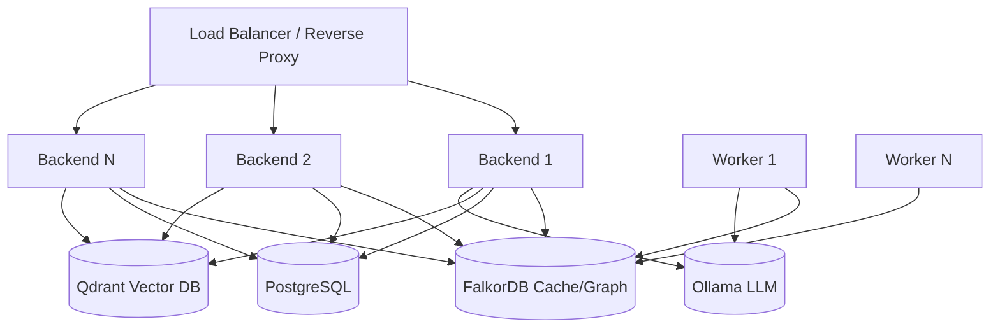

<!-- markdownlint-disable-file MD046 -->

This guide walks you through deploying BaselithCore in a production environment. Proper deployment is essential to ensure **reliability**, **security**, and **scalability** of the system.

!!! info "When to Use This Guide"
    Use this guide when transitioning from local development to a production environment accessible by real users. Ensure the system functions correctly locally before proceeding.

---

## Prerequisites

Before beginning deployment, verify you have:

| Requirement        | Description                       | Verification             |
| ------------------ | --------------------------------- | ------------------------ |
| **Docker**         | Docker Engine 20.10+ installed    | `docker --version`       |
| **Docker Compose** | Docker Compose V2                 | `docker compose version` |
| **Resources**      | Minimum 4GB RAM, 2 CPU cores      | Check host dashboard     |
| **Storage**        | At least 20GB disk space for data | `df -h`                  |
| **Network**        | Port 8000 (or custom) accessible  | Test connectivity        |
| **Secrets**        | Credentials ready (DB, API keys)  | `.env` file prepared     |

!!! warning "Isolated Environment"
    Never deploy on machines running other critical services without proper containerization. Always use isolated environments.

---

## Production Architecture

The production system comprises several services working together:


```mermaid
graph TB
    LB[Load Balancer / Reverse Proxy] --> B1[Backend 1]
    LB --> B2[Backend 2]
    LB --> B3[Backend N]

    B1 --> Falkor[(FalkorDB Cache/Graph)]
    B2 --> Falkor
    B3 --> Falkor

    B1 --> PG[(PostgreSQL)]
    B2 --> PG
    B3 --> PG

    B1 --> Qdrant[(Qdrant Vector DB)]
    B2 --> Qdrant
    B3 --> Qdrant

    W1[Worker 1] --> Falkor
    W2[Worker N] --> Falkor

    B1 --> Ollama[(Ollama LLM)]
    W1 --> Ollama
```

**Core Services:**

- **API** (`api` service): FastAPI server handling HTTP requests and agent orchestration
- **FalkorDB**: Unified storage for knowledge graph, caching, and task queue (Redis-compatible)
- **PostgreSQL**: Relational database for structured data persistence
- **Qdrant**: Vector database for embeddings and semantic search (optional)
- **Workers**: Async task processors for long-running operations

---

## Docker Compose

The `docker-compose.prod.yml` file defines the entire infrastructure, including reverse proxy and observability.

```yaml title="docker-compose.prod.yml"
services:
  # Main service: API Backend
  api:
    build:
      context: .
      dockerfile: Dockerfile-slim
    container_name: baselith-core-api
    env_file: configs/.env.production
    environment:
      - APP_ENV=production
      - ENVIRONMENT=production
      - CORE_LOG_FORMAT=json
      - HOST=0.0.0.0
      - PORT=8000
      - DOCKER_HOST=tcp://${SANDBOX_DOCKER_HOST:?SANDBOX_DOCKER_HOST must be set}
      - DOCKER_TLS_VERIFY=1
      - DOCKER_CERT_PATH=/certs/client
      - TELEMETRY_OTEL_ENDPOINT=http://jaeger:4317
      - SENTRY_DSN=${SENTRY_DSN}
      # Trust X-Forwarded-* from the gateway network (pinned subnet below), so
      # per-IP rate limits / admin lockout see the real client, not nginx.
      - FORWARDED_ALLOW_IPS=${FORWARDED_ALLOW_IPS:-${APP_NET_SUBNET:-172.28.0.0/24}}
    volumes:
      - ${SANDBOX_CERTS_DIR:-./deploy/sandbox/client-certs}:/certs/client:ro
      - ./data:/app/data
    networks:
      - app_net
      - obs_net
    depends_on:
      - falkordb
      - postgres
    init: true
    security_opt:
      - no-new-privileges:true
    cap_drop:
      - ALL
    tmpfs:
      - /tmp:size=64m,noexec,nosuid
    restart: unless-stopped
    deploy:
      resources:
        limits:
          cpus: '1.0'
          memory: 1G
    healthcheck:
      test: ["CMD", "curl", "-f", "http://localhost:8000/health"]
      interval: 30s
      timeout: 10s
      retries: 3

  # Cache and Message Queue
  # Graph Database and Cache (Redis compatible)
  falkordb:
    # Pinned: a `latest` re-pull silently changes the data plane.
    image: falkordb/falkordb:v4.20.4
    container_name: baselith-falkordb
    # REDIS_PASSWORD is optional but strongly recommended: without it any
    # container on app_net (and any host process via the loopback publish)
    # has full RW access to cache, queues, and rate-limit counters. When set,
    # point CACHE_REDIS_URL etc. at redis://:<password>@falkordb:6379.
    # Passed via REDIS_ARGS (not a command override) so the image's default
    # entrypoint keeps loading the FalkorDB graph module.
    environment:
      - REDIS_ARGS=${REDIS_PASSWORD:+--requirepass $REDIS_PASSWORD}
    # Publish to host loopback so a natively-deployed app (running on the host,
    # not in a container) can reach the cache/graph at 127.0.0.1. Bound to
    # 127.0.0.1 only — not exposed on any external interface. Harmless for the
    # all-in-container deployment (services still talk over app_net).
    ports:
      - "127.0.0.1:6379:6379"
    volumes:
      - falkordb_data:/data
    networks:
      - app_net
    security_opt:
      - no-new-privileges:true
    cap_drop:
      - ALL
    restart: unless-stopped
    deploy:
      resources:
        limits:
          cpus: '0.8'
          memory: 1G
    healthcheck:
      test: ['CMD-SHELL', 'redis-cli ${REDIS_PASSWORD:+-a $$REDIS_PASSWORD} ping | grep PONG']
      interval: 10s
      timeout: 5s
      retries: 5

  # Relational Database
  postgres:
    image: postgres:16-alpine
    # Publish to host loopback so a natively-deployed app (running on the host,
    # not in a container) can reach Postgres at 127.0.0.1. Bound to 127.0.0.1
    # only — not exposed on any external interface. Harmless for the
    # all-in-container deployment (services still talk over app_net).
    ports:
      - "127.0.0.1:${DB_PORT:-5432}:5432"
    environment:
      - POSTGRES_DB=${DB_NAME:-baselithcore}
      - POSTGRES_USER=${DB_USER:-baselithcore}
      - POSTGRES_PASSWORD=${DB_PASSWORD:?DB_PASSWORD must be set}
    volumes:
      - postgres_data:/var/lib/postgresql/data
    networks:
      - app_net
    security_opt:
      - no-new-privileges:true
    cap_drop:
      - ALL
    # `cap_drop: ALL` alone does not work for this image: its entrypoint starts
    # as root, prepares (and chowns) the data directory, then drops to the
    # `postgres` user via gosu. Without these five, first boot fails in initdb
    # and the container restart-loops — the hardening looks applied while the
    # database never comes up. This is the minimal set for that sequence; the
    # dangerous ones (SYS_ADMIN, NET_RAW, SYS_PTRACE …) stay dropped.
    cap_add:
      - CHOWN           # chown the PGDATA volume on first boot
      - DAC_OVERRIDE    # read/write it before the ownership change lands
      - FOWNER          # chmod 0700 PGDATA as required by initdb
      - SETGID          # gosu: drop to the postgres group
      - SETUID          # gosu: drop to the postgres user
    restart: unless-stopped
    deploy:
      resources:
        limits:
          cpus: '0.5'
          memory: 512M
    healthcheck:
      test: ['CMD-SHELL', 'pg_isready -d ${DB_NAME:-baselithcore} -U ${DB_USER:-baselithcore}']
      interval: 10s
      timeout: 5s
      retries: 5

  # Worker for Async Tasks
  worker:
    build:
      context: .
      dockerfile: Dockerfile-slim
    container_name: baselith-core-worker
    env_file: configs/.env.production
    command: python -m core.task_queue.worker
    environment:
      - APP_ENV=production
      - ENVIRONMENT=production
      - CORE_LOG_FORMAT=json
      - DOCKER_HOST=tcp://${SANDBOX_DOCKER_HOST:?SANDBOX_DOCKER_HOST must be set}
      - DOCKER_TLS_VERIFY=1
      - DOCKER_CERT_PATH=/certs/client
      - TELEMETRY_OTEL_ENDPOINT=http://jaeger:4317
      - SENTRY_DSN=${SENTRY_DSN}
    volumes:
      - ${SANDBOX_CERTS_DIR:-./deploy/sandbox/client-certs}:/certs/client:ro
      - ./data:/app/data
    networks:
      - app_net
      - obs_net
    depends_on:
      postgres:
        condition: service_healthy
      falkordb:
        condition: service_healthy
    init: true
    security_opt:
      - no-new-privileges:true
    cap_drop:
      - ALL
    tmpfs:
      - /tmp:size=64m,noexec,nosuid
    restart: unless-stopped
    deploy:
      resources:
        limits:
          cpus: '0.8'
          memory: 1G

  # Reverse Proxy
  gateway:
    image: nginx:alpine
    container_name: baselith-gateway
    ports:
      - "80:80"
    volumes:
      - ./deploy/nginx/nginx.conf:/etc/nginx/nginx.conf:ro
    networks:
      - app_net
    depends_on:
      - api
    read_only: true
    security_opt:
      - no-new-privileges:true
    cap_drop:
      - ALL
    # NET_BIND_SERVICE alone is not enough: the master process starts as root
    # and `user nginx;` (deploy/nginx/nginx.conf) makes it fork its workers as
    # an unprivileged user, which needs SETUID/SETGID. Without them nginx exits
    # at startup with "setgid(101) failed (1: Operation not permitted)".
    cap_add:
      - NET_BIND_SERVICE  # bind :80 as a non-root worker
      - SETGID            # master -> worker privilege drop
      - SETUID
    tmpfs:
      - /var/cache/nginx
      - /var/run
      - /tmp:size=32m,noexec,nosuid
    restart: unless-stopped
    deploy:
      resources:
        limits:
          cpus: '0.5'
          memory: 256M

  # === Observability Stack ===
  jaeger:
    image: jaegertracing/all-in-one:1.76.0
    container_name: baselith-jaeger
    environment:
      - COLLECTOR_OTLP_ENABLED=true
    ports:
      - "127.0.0.1:16686:16686"
    networks:
      - obs_net
    security_opt:
      - no-new-privileges:true
    cap_drop:
      - ALL
    restart: unless-stopped

  prometheus:
    image: prom/prometheus:v3.5.5
    container_name: baselith-prometheus
    volumes:
      - ./prometheus.yml:/etc/prometheus/prometheus.yml:ro
      - ./deploy/prometheus/alert-rules.yml:/etc/prometheus/alert-rules.yml:ro
      - ./deploy/prometheus/slo-rules.yml:/etc/prometheus/slo-rules.yml:ro
      - prometheus_data:/prometheus
    networks:
      - app_net
    command:
      - '--config.file=/etc/prometheus/prometheus.yml'
      - '--storage.tsdb.path=/prometheus'
    security_opt:
      - no-new-privileges:true
    cap_drop:
      - ALL
    restart: unless-stopped

volumes:
  falkordb_data:
  postgres_data:
  prometheus_data:

networks:
  app_net:
    # Fixed subnet so FORWARDED_ALLOW_IPS above can trust the gateway by
    # network; override APP_NET_SUBNET on collision, keeping both in step.
    ipam:
      config:
        - subnet: ${APP_NET_SUBNET:-172.28.0.0/24}
  obs_net:
```

!!! warning "Production Compose Hardening"
    The backend container is intentionally **not** published directly on the host anymore. Route traffic through the reverse proxy only.
    Also avoid weak fallback credentials in production: `DB_PASSWORD` must be explicitly set, and the runtime reads both `APP_ENV` and `ENVIRONMENT` (`APP_ENV` wins) to activate production-only checks consistently. The aliases `prod`, `prd` and `live` now resolve to `production` too, and an environment name the framework does not recognise is treated as production — see [Environment naming](#environment-naming).
    As an extra hardening layer, the production compose enables `no-new-privileges` broadly, drops ambient Linux capabilities for non-privileged services, and keeps the Nginx gateway on a read-only filesystem with dedicated `tmpfs` mounts.
    The runtime images now honor `HOST`, `PORT`, and optional `WEB_CONCURRENCY`, so container startup stays aligned with Compose, health checks, and reverse proxy settings.
    TLS is expected to terminate on an external reverse proxy or load balancer. The bundled Nginx gateway stays on internal HTTP only and preserves incoming `X-Forwarded-Proto` / `X-Forwarded-Port` headers.
    The production compose does not start a privileged sandbox daemon locally. API and worker connect to an external sandbox host via `SANDBOX_DOCKER_HOST` and a client cert bundle mounted from `SANDBOX_CERTS_DIR`. The default single-host `docker-compose.yml` follows the same rule — its Docker-in-Docker daemon moved to the opt-in `docker-compose.sandbox.yml` overlay (see [Opt-in sandbox overlay](#opt-in-sandbox-overlay-single-host)).
    Runtime-critical images are **pinned**, not `latest`: `falkordb/falkordb:v4.20.4` in both compose files, `ollama/ollama:0.33.2` in the default stack and `nginx:1.31.5-alpine` for the production gateway — a `latest`/`alpine` re-pull must not silently change the data plane, the local LLM runtime or the edge. The default stack also adds healthchecks for Qdrant (TCP connect probe — the image ships no curl) and Ollama (`ollama ls`), and `api`/`worker` now gate on `condition: service_healthy` for all four dependencies instead of `service_started`.
    Set `REDIS_PASSWORD` to arm `--requirepass` on the FalkorDB/Redis service (optional but strongly recommended — without it anything on the network has full RW access to cache, queues, and rate-limit counters). Both compose files pass it through the FalkorDB image's `REDIS_ARGS` environment variable — the image entrypoint ignores a `command:` override, so `REDIS_ARGS` is the only way to add flags while the graph module keeps loading (the default stack also sets `--appendonly yes --maxmemory 512mb --maxmemory-policy allkeys-lru` there). When set, point `CACHE_REDIS_URL` / `QUEUE_REDIS_URL` / `GRAPH_DB_URL` at `redis://:<password>@falkordb:6379` — in the default stack the service is named `redis` but carries a `falkordb` network alias, so the same URL works.

### Uvicorn Runtime Flags

The production image's entrypoint runs Uvicorn with proxy-aware and shutdown flags:

```bash
uvicorn backend:app --host "$HOST" --port "$PORT" \
    --proxy-headers --no-server-header \
    --forwarded-allow-ips "${FORWARDED_ALLOW_IPS:-127.0.0.1}" \
    --timeout-graceful-shutdown "${GRACEFUL_SHUTDOWN_TIMEOUT:-25}" \
    --timeout-keep-alive "${UVICORN_KEEP_ALIVE:-75}"
```

- **`--proxy-headers --forwarded-allow-ips`** — trust `X-Forwarded-For` only from
  your load balancer / reverse proxy. **Set `FORWARDED_ALLOW_IPS` to the LB
  address** (IPs or CIDRs, comma-separated): without it every request appears
  to originate from the proxy IP, and per-IP rate limiting, the failed-auth
  throttle and the admin lockout collapse into a single shared bucket. The
  production compose pins `app_net` to a fixed subnet (`APP_NET_SUBNET`,
  default `172.28.0.0/24`) and trusts it by default; the Helm chart exposes the
  same knob as `forwardedAllowIps` (set it to the ingress controller's pod
  CIDR).
- **`--no-server-header`** — drop the `Server: uvicorn` banner. The bundled
  nginx replaces it at the edge, but a pod behind a cloud LB / ingress that
  passes upstream headers through would otherwise advertise the exact server
  stack to every caller.
- **`--timeout-graceful-shutdown`** — bound the connection-drain window on
  SIGTERM (default 25s), kept below the Kubernetes 30s termination grace so the
  pod drains cleanly instead of being force-killed.
- **`--timeout-keep-alive`** — how long an idle client connection is kept
  open (default 75s). Uvicorn's own default is 5s, *shorter* than the idle
  timeout of the upstream keepalive pool of every common reverse proxy
  (nginx, ALB and Envoy all default to 60s), so the proxy would reuse sockets
  the app had already closed and surface sporadic `502`s. Keep the app side
  longer than the proxy side; set `UVICORN_KEEP_ALIVE` to match yours.

!!! tip "Worker processes (`WEB_CONCURRENCY`)"
    Size `WEB_CONCURRENCY` to roughly the number of CPU cores available to the
    container in production. A single worker means any CPU-bound work (embedding,
    tokenization, JSON serialization) freezes the whole API for its duration.

    Startup migrations are multi-worker safe: `ensure_schema` takes a Postgres
    session **advisory lock** before running `alembic upgrade head`, so with
    `WEB_CONCURRENCY>1` exactly one worker migrates while the others block, then
    run `upgrade head` as a no-op — they no longer race the same DDL (which could
    crash-loop a losing worker on `lock_timeout`).

### Service Explanation

#### API Service (`api`)

The FastAPI application server that:

- Handles HTTP API requests
- Orchestrates agent workflows
- Manages plugin lifecycle
- Serves WebSocket connections for streaming

**Health checks** ensure the container restarts if unresponsive.

#### FalkorDB Service (Redis-Compatible)

Provides three critical functionalities:

- **Graph Storage**: Knowledge Graph for agent reasoning.
- **Session cache**: User context and conversation history.
- **Task queue**: Async job distribution via RQ.

**Persistence** via AOF (Append-Only File) prevents data loss on restart.

**Authentication** is armed by setting `REDIS_PASSWORD` (see the hardening
note above); the healthcheck passes the same credential, so a password-protected
instance still reports healthy.

#### PostgreSQL Service

Stores structured data:

- User accounts and authentication
- Plugin configurations
- Audit logs
- System metadata

**Volumes** ensure data persists across container restarts.

#### Worker Service

Processes background tasks:

- LLM batch processing
- Document embedding generation
- Report generation
- External API integrations

**Concurrency** parameter determines parallel task execution (adjust based on CPU cores).

#### External Sandbox Host

Production code execution is expected to run on a separate sandbox host or node. API and worker connect to it over mutual TLS:

- `SANDBOX_DOCKER_HOST` points to the external daemon address, for example `sandbox.internal.example:2376`
- `SANDBOX_CERTS_DIR` provides the client TLS bundle mounted at `/certs/client`
- the sandbox host should run in an isolated trust zone and should not share the same node as the main application stack

#### Opt-In Sandbox Overlay (Single Host)

The default `docker-compose.yml` stack ships **without** a sandbox daemon. The
Docker-in-Docker service needs `privileged: true`, which is root-equivalent on
the compose host — a container escape from sandboxed agent code would
compromise every other service, including the Postgres volume — so it lives in
a separate opt-in overlay, `docker-compose.sandbox.yml`. Enable sandboxed agent
code execution with:

```bash
docker compose -f docker-compose.yml -f docker-compose.sandbox.yml up -d
```

The overlay starts the `sandbox-daemon` service (`docker:24-dind`, mutual TLS
on port `2376`) on a dedicated bridge network and injects `DOCKER_HOST`,
`DOCKER_CERT_PATH` and `DOCKER_TLS_VERIFY` plus the read-only `sandbox_certs`
client-certificate volume into the `api` and `worker` services.

!!! danger "Privileged DinD is host-root-equivalent"
    Run the overlay only on a host you are prepared to treat as fully exposed
    to agent-executed code — ideally a dedicated VM — or use a rootless/Sysbox
    runtime instead. For production, prefer the external sandbox host wired
    via `SANDBOX_DOCKER_HOST` above.

#### Dev Override Overlay (Explicit Only)

The live-reload development overlay is named
`docker-compose.dev.override.yml` — **deliberately not**
`docker-compose.override.yml`. Compose auto-merges a file with the stock
override name into every plain `docker compose up`, which silently
bind-mounted the source tree over the production image, converting the stack
into a dev deploy without any visible flag. Dev usage is now explicit:

```bash
docker compose -f docker-compose.yml -f docker-compose.dev.override.yml up -d
```

A plain `docker compose up -d` runs the image as built, with no source
mounts.

### Starting the System

```bash
# Fill in the production env file. Both api and worker read it via
# `env_file: configs/.env.production`; the preflight requires DB_HOST,
# DB_PASSWORD, SECRET_KEY (>= 32 chars), SANDBOX_DOCKER_HOST and SANDBOX_CERTS_DIR.
$EDITOR configs/.env.production

# Run preflight checks (required vars, sandbox certs, external daemon reachability)
./scripts/prod-preflight.sh

# Point every docker compose command below at the production stack
export COMPOSE_FILE=docker-compose.prod.yml

# Start all services. --env-file feeds compose interpolation
# (DB_PASSWORD, SANDBOX_DOCKER_HOST, SANDBOX_CERTS_DIR, REDIS_PASSWORD, SENTRY_DSN)
docker compose --env-file configs/.env.production up -d

# Verify status
docker compose ps
```

---

## Scaling

One of the system's strengths is horizontal scalability to handle increasing loads.

!!! tip "Kubernetes / Helm"
    For production clusters, prefer the Helm chart over Docker Compose — it ships
    HPA autoscaling, a PodDisruptionBudget, liveness/readiness probes, hardened
    pod security, and an optional worker Deployment. See
    [Kubernetes (Helm)](kubernetes.md).

!!! warning "Multi-replica coordination"
    When running more than one replica, any periodic trigger / cron / run-once
    task must be guarded with a [distributed lock](../core-modules/resilience.md#distributed-lock)
    so it fires on exactly one replica — in-memory coordination does not span pods.

    The startup index bootstrap (`ensure_startup_bootstrap`) already does
    this: with Redis as the cache backend it elects one leader via the
    `DistributedLock` named `index_bootstrap` (TTL 10 minutes, never
    explicitly released — the winner only needs the window in which it writes
    its sentinel), so `WEB_CONCURRENCY=N` or N replicas don't run N parallel
    re-index passes. Losers skip; a lock **error** fails open and bootstraps
    anyway — a duplicate bootstrap is wasted load, a missing one is missing
    indices.

### Horizontal Scaling (API)

Launch multiple API instances to distribute load. The load balancer (Nginx, Traefik, or cloud LB) distributes requests.

!!! warning "`--scale` and fixed container names"
    `docker-compose.prod.yml` pins `container_name: baselith-core-api` on `api`
    (and `baselith-core-worker` on `worker`), and Compose refuses to scale a
    service with a fixed container name. To run several replicas on one host,
    drop `container_name` from the service in an override file and add the
    extra upstreams to `deploy/nginx/nginx.conf`; for real horizontal scaling
    use the [Helm chart](kubernetes.md).

```bash
# Start 3 API instances (after removing container_name from the api service)
docker compose up --scale api=3 -d
```

!!! tip "Statelessness"
    The backend is designed to be **stateless**: all sessions are in Redis, so you can scale without consistency issues.

**When to Scale:**

- CPU consistently > 70%
- Request latency > 2 seconds
- Frequent 503 errors

**Monitoring scaling effectiveness:**

```bash
# Monitor container resource usage
docker stats

# Check request distribution
docker compose logs api | grep "Request completed"
```

### Worker Scaling

Workers process async tasks (embeddings, LLM batches, etc.). Scale based on queue depth.

```bash
# Start 5 parallel workers (same container_name caveat as the API above)
docker compose up --scale worker=5 -d
```

**Queue Monitoring:**

```bash
baselith queue status
```

If you consistently see `Pending > 100`, add workers.

**Optimal worker count:**

- **CPU-bound tasks**: Number of CPU cores
- **I/O-bound tasks**: 2-4x CPU cores
- **Mixed workloads**: Start with CPU cores, then scale based on metrics

---

## Reverse Proxy (Production)

In production, **never expose the backend directly**. Use a reverse proxy like Nginx or Traefik.

### Nginx Configuration

```nginx title="/etc/nginx/sites-available/multiagent"
upstream backend {
    # Backend server pool (if scaled)
    server 127.0.0.1:8000;
    server 127.0.0.1:8001;
    server 127.0.0.1:8002;

    # Keepalive connections
    keepalive 32;
}

server {
    listen 80;
    server_name baselith.ai;

    # Redirect HTTP -> HTTPS
    return 301 https://$server_name$request_uri;
}

server {
    listen 443 ssl http2;
    server_name baselith.ai;

    # SSL Certificates (Let's Encrypt recommended)
    ssl_certificate /etc/letsencrypt/live/baselith.ai/fullchain.pem;
    ssl_certificate_key /etc/letsencrypt/live/baselith.ai/privkey.pem;

    # Security headers
    add_header X-Frame-Options "SAMEORIGIN" always;
    add_header X-Content-Type-Options "nosniff" always;
    add_header X-XSS-Protection "0" always;   # legacy auditor off — matches the app
    add_header Strict-Transport-Security "max-age=31536000; includeSubDomains" always;

    location / {
        proxy_pass http://backend;
        proxy_http_version 1.1;
        proxy_set_header Upgrade $http_upgrade;
        proxy_set_header Connection "upgrade";
        proxy_set_header Host $host;
        # Let nginx compress (gzip on, in C, off the app's event loop) instead
        # of the app's Python gzip middleware: strip the client's
        # Accept-Encoding so the upstream answers identity.
        proxy_set_header Accept-Encoding "";
        proxy_set_header X-Real-IP $remote_addr;
        proxy_set_header X-Forwarded-For $proxy_add_x_forwarded_for;
        proxy_set_header X-Forwarded-Proto $scheme;

        # Timeout for LLM (long responses)
        proxy_read_timeout 120s;
        proxy_connect_timeout 10s;
    }

    # SSE / chat streaming: disable proxy buffering to preserve token-by-token
    # delivery. Regex so the versioned alias /v1/chat/stream is covered too —
    # a plain prefix location would let it fall through to `location /` and
    # its shorter read timeout.
    location ~ ^/(v1/)?chat/stream$ {
        proxy_pass http://backend;
        proxy_http_version 1.1;
        proxy_set_header Host $host;
        proxy_set_header X-Real-IP $remote_addr;
        proxy_set_header X-Forwarded-For $proxy_add_x_forwarded_for;
        proxy_set_header X-Forwarded-Proto $scheme;
        proxy_buffering off;
        proxy_cache off;
        add_header X-Accel-Buffering no;
        proxy_read_timeout 300s;
    }
}
```

### SSL Certificate Setup (Let's Encrypt)

```bash
# Install certbot
sudo apt install certbot python3-certbot-nginx

# Obtain certificate
sudo certbot --nginx -d baselith.ai

# Auto-renewal is configured automatically
sudo certbot renew --dry-run
```

---

## Production Checklist

Before going live, verify every point:

### Security

- [ ] `CORE_DEBUG=false` - Disable debug mode
- [ ] `APP_ENV=production` and `ENVIRONMENT=production` set consistently (`prod`/`prd`/`live` also resolve to production; an unrecognised name is hardened as production — see [Environment naming](#environment-naming))
- [ ] Secrets in environment variables (never in code)
- [ ] HTTPS configured with valid certificate
- [ ] Rate limiting active (enforced by `SecurityManager` through the sliding-window `RateLimiter`; `RATE_LIMIT_FAIL_MODE` resolved for the Redis backend)
- [ ] CORS configured for authorized domains only
- [ ] API documentation disabled or restricted (`DOCS_ENABLED=false`; when unset, `/docs`, `/redoc` and the OpenAPI schema are switched off automatically once the environment resolves to production)
- [ ] Strong JWT secret (256-bit minimum); `PyJWT >= 2.10.1` pinned
- [ ] `MAX_REQUEST_SIZE_BYTES` set for workload (default 10 MiB; raise only for endpoints that legitimately accept large bodies)
- [ ] No `BaseHTTPMiddleware` in the stack — pure ASGI only (see [Security › Security Headers](../advanced/security.md#security-headers))
- [ ] `DB_PASSWORD` set to a strong value with no insecure fallback in compose
- [ ] Firewall rules configured (only necessary ports open)
- [ ] `FORWARDED_ALLOW_IPS` set to the load balancer address (so per-IP rate limiting / admin lockout do not collapse into one bucket behind the proxy)
- [ ] Jaeger UI (`16686`) bound to `127.0.0.1` — not exposed externally, accessed via SSH tunnel

### Resilience

- [ ] Health checks configured for each service
- [ ] Restart policy (`unless-stopped`) set
- [ ] Monitoring configured (Prometheus/Grafana)
- [ ] Alerting configured for critical metrics
- [ ] Automated database backups (daily minimum)
- [ ] Log rotation configured
- [ ] Circuit breakers enabled (LLM, VectorStore)
- [ ] Retry policies configured (LLM, VectorStore, Database)
- [ ] Run `alembic upgrade head` before first deploy — migration status is checked at startup and logged as ERROR if outdated

### Performance

- [ ] Database connection pooling (`DB_POOL_MIN_SIZE` / `DB_POOL_MAX_SIZE=20`)
- [ ] Redis persistence enabled
- [ ] LLM cache active for repeated prompts
- [ ] Indexes created on frequently queried columns (run `alembic upgrade head` — includes migration `003_interactions_feedback_indexes` with `CONCURRENTLY` to avoid locking writers)
- [ ] `AgentState.MAX_TRAJECTORY_ENTRIES` / `MAX_LOG_ENTRIES` tuned for session length (defaults 200 / 500; check `trajectory_dropped` / `logs_dropped` counters in production)
- [ ] Static content CDN configured
- [ ] Compression enabled (gzip/brotli)

### Observability

- [ ] Structured logging (JSON format)
- [ ] Log aggregation (ELK/Splunk/Datadog)
- [ ] Distributed tracing (Jaeger)
- [ ] Metrics collection (Prometheus)
- [ ] Error tracking (Sentry)
- [ ] Uptime monitoring configured

---

## Production Configuration

Complete example of `configs/.env.production` (the file both `api` and `worker` load through `env_file`):

```env title="configs/.env.production"
# Environment
APP_ENV=production
ENVIRONMENT=production
CORE_DEBUG=false
LOG_LEVEL_CONSOLE=INFO
LOG_LEVEL_FILE=INFO
LOG_JSON=true
LOG_MASKING_ENABLED=true

# Security (CHANGE THESE VALUES!)
SECRET_KEY=your-256-bit-secret-key-change-me-use-openssl-rand
ALLOW_ORIGINS=["https://baselith.ai","https://app.baselith.ai"]
AUTH_REQUIRED=true
DOCS_ENABLED=false
MAX_REQUEST_SIZE_BYTES=10485760

# Runtime / proxy (set FORWARDED_ALLOW_IPS to your load balancer address or
# CIDR; the production compose defaults it to the app_net subnet)
WEB_CONCURRENCY=4
FORWARDED_ALLOW_IPS=172.28.0.0/24
GRACEFUL_SHUTDOWN_TIMEOUT=25

# Database
DB_HOST=postgres
DB_NAME=baselithcore
DB_USER=baselithcore
DB_PASSWORD=strong_password_here
DB_POOL_MIN_SIZE=5
DB_POOL_MAX_SIZE=20

# Cache / Queue / Graph
CACHE_BACKEND=redis
CACHE_REDIS_URL=redis://falkordb:6379/1
QUEUE_REDIS_URL=redis://falkordb:6379/2
GRAPH_DB_ENABLED=true
GRAPH_DB_URL=redis://falkordb:6379

# LLM
LLM_PROVIDER=openai
LLM_MODEL=gpt-4o-mini
LLM_OPENAI_API_KEY=${OPENAI_API_KEY:-}
# Per-run token cap that stops runaway agent loops. Aliases: COST_CONTROL_ENABLED /
# LLM_BUDGET_ENABLED and AGENT_MAX_TOKENS / LLM_BUDGET_MAX_TOKENS. The default is
# 10000 — raise it deliberately per workload; a huge value disables the guard.
COST_CONTROL_ENABLED=true
AGENT_MAX_TOKENS=10000

# Rate Limiting
API_KEY_ENABLED=true

# Observability
TELEMETRY_ENABLED=true
TELEMETRY_OTEL_ENDPOINT=http://jaeger:4317
SENTRY_DSN=${SENTRY_DSN}
```

!!! danger "Secrets Security"
    **NEVER commit `.env.production` to Git!** Add to `.gitignore`. Use secret managers (Vault, AWS Secrets Manager, etc.) in enterprise environments.

    The file is also **kept out of the Docker build context**: `.dockerignore`
    excludes `configs/.env*`, so a filled-in template on the build host is never
    baked into an image layer. Compose injects it from the host via `env_file:`;
    the application itself never reads `configs/.env.*` at runtime.

### Environment naming

`APP_ENV` (falling back to `ENVIRONMENT`) is what switches the framework
between its permissive and hardened postures — plugin signature enforcement,
unsigned-A2A rejection, the A2A SSRF internal-host deny, admin lockout on Redis
loss, the `JWT_ISSUER`/`JWT_AUDIENCE` startup check and the anonymous `/docs`
gate all read it. Two rules matter when you name a deployment:

| You declare | Resolves to | Hardened? |
|-------------|-------------|-----------|
| `production`, `prod`, `prd`, `live` | `production` | yes |
| `development`, `dev`, `local`, `test`, `ci`, `staging`, `stage`, `qa`, `uat`, `sandbox`, `demo`, `preview`, `preprod`, `nonprod` (and their variants) | as declared | no |
| anything else (`integration-eu`, `eu-west-1`, a typo) | as declared | **yes** — unrecognised fails closed |

!!! warning "Upgrading with a custom environment name"
    Before this release only the literal `production` counted, so a cluster
    running `APP_ENV=prod` was silently unhardened and a cluster running
    `APP_ENV=integration-eu` was too. Both now get the production posture. If
    the environment is genuinely not production, set `APP_ENV` to a known
    non-production name and keep the custom label in `DEPLOYMENT_ENVIRONMENT`
    (the OTel `deployment.environment` tag) instead. The full alias list lives
    in [Configuration › Runtime
    environment](../core-modules/config.md#runtime-environment).

### Marketplace integration

A BaselithCore instance reaches the plugin marketplace in **client mode**. The only variables you need to set on your host are the publishing credentials (if you also publish plugins) and the marketplace URL (if you run a private mirror).

| Variable | Default | Purpose |
|----------|---------|---------|
| `MARKETPLACE_API_KEY` | — | Publisher API key sent by the CLI/CI when running `baselith plugin marketplace publish` |
| `MARKETPLACE_CENTRAL_URL` | `https://marketplace.baselithcore.xyz/api/marketplace/plugins/registry.json` | Registry index URL (`PluginConfig.REGISTRY_URL`; `PLUGIN_REGISTRY_URL` / `REGISTRY_URL` are aliases). Override only if you mirror the marketplace internally |

See the [Publishing to the Marketplace](../plugins/marketplace.md#publishing) guide for the end-to-end workflow.

---

### Generating Secure Secrets

```bash
# Generate JWT secret (256-bit)
openssl rand -base64 32

# Generate API key salt
openssl rand -hex 16

# Generate strong database password
openssl rand -base64 24
```

---

## Troubleshooting

### Backend Won't Start

**Symptoms:** Container in restart loop, connection errors.

**Diagnosis:**

```bash
# Check logs
docker compose logs api --tail 50

# Verify infrastructure connectivity (Redis, DB, LLM) from inside the container
docker compose exec api baselith doctor

# Check environment variables
docker compose exec api env | grep -E '^(DB_|CACHE_REDIS_URL|QUEUE_REDIS_URL|GRAPH_DB_URL)'
```

**Common Solutions:**

- **Database unreachable** -> Verify `DB_HOST` / `DB_PASSWORD` (or `DATABASE_URL`) and that `postgres` is healthy
- **Redis unreachable** -> Verify `CACHE_REDIS_URL` / `QUEUE_REDIS_URL` / `GRAPH_DB_URL` (including the `REDIS_PASSWORD` embedded in them)
- **Port already in use** -> Change port in docker-compose
- **Missing dependencies** -> Rebuild image: `docker compose build --no-cache`

### Performance Degradation

**Symptoms:** High latency, frequent timeouts.

**Diagnosis:**

```bash
# Check resource usage
docker stats

# Check task queue
baselith queue status

# Check cache hit rate
baselith cache stats

# Check database connections
docker compose exec postgres psql -U baselithcore -d baselithcore -c "SELECT count(*) FROM pg_stat_activity;"
```

**Solutions:**

- **High CPU** → Scale the API (`--scale api=N`, see [Horizontal Scaling](#horizontal-scaling-api))
- **Long queue** → Scale workers (`--scale worker=N`)
- **High cache miss rate** → Increase TTL or cache size
- **Database connection pool exhausted** → Increase `DB_POOL_MAX_SIZE`

### 502/503 Errors

**Symptoms:** Bad Gateway or Service Unavailable from reverse proxy.

**Solutions:**

1. Verify the `api` container is running: `docker compose ps`
2. Increase `proxy_read_timeout` for long LLM requests
3. Check health endpoint: `curl http://localhost:8000/health`
4. Review API logs: `docker compose logs api --tail 100`
5. Verify nginx configuration: `sudo nginx -t`

### Database Connection Issues

**Symptoms:** `FATAL: remaining connection slots are reserved`

**Diagnosis:**

```bash
# Check active connections
docker compose exec postgres psql -U baselithcore -d baselithcore -c \
  "SELECT count(*), state FROM pg_stat_activity GROUP BY state;"
```

**Solutions:**

- Increase PostgreSQL `max_connections` in `postgresql.conf`
- Reduce application `DB_POOL_MAX_SIZE`
- Investigate connection leaks in application code
- Enable connection pooling with PgBouncer

---

## Backup Strategy

### Database Backups

**Automated daily backups:**

```bash title="scripts/backup-db.sh"
#!/bin/bash
DATE=$(date +%Y%m%d_%H%M%S)
BACKUP_DIR="/backups/postgres"

# Create backup
docker compose -f docker-compose.prod.yml exec -T postgres pg_dump -U baselithcore baselithcore \
  | gzip > "${BACKUP_DIR}/backup_${DATE}.sql.gz"

# Retain last 30 days
find "${BACKUP_DIR}" -name "backup_*.sql.gz" -mtime +30 -delete
```

**Cron configuration:**

```cron
0 2 * * * /opt/baselith/scripts/backup-db.sh >> /var/log/backup.log 2>&1
```

### Redis Backups

Redis AOF provides automatic persistence. Manual snapshots:

```bash
# Trigger manual snapshot (add -a "$REDIS_PASSWORD" when --requirepass is armed)
docker compose exec falkordb redis-cli BGSAVE

# Copy RDB file
docker compose cp falkordb:/data/dump.rdb ./backups/redis/
```

### Application State Backups

```bash
# Backup plugin configurations
docker compose exec api tar czf - /app/configs \
  > backups/configs_$(date +%Y%m%d).tar.gz

# Backup uploaded files (if any)
docker compose exec api tar czf - /app/uploads \
  > backups/uploads_$(date +%Y%m%d).tar.gz
```

---

## Monitoring Setup

### Readiness Endpoint

`GET /health/ready` gates only on the database (503 → traffic drains) and
additionally reports two **advisory** keys that never gate readiness: `redis`
(the framework falls back to in-memory) and `vectorstore` (recall degrades to
keyword search). Watch both in dashboards/alerts — an operator should see them
down even though the pod keeps serving. See
[REST API › Readiness Check](../api/rest.md#get-healthready-readiness-check).

### Prometheus Metrics

Prometheus is already part of `docker-compose.prod.yml` (`prom/prometheus:v3.5.5`,
no host port published — reach the UI over `app_net` or an SSH tunnel). It loads
the repository's `prometheus.yml` plus the rule files mounted from
`deploy/prometheus/` (`alert-rules.yml`, `slo-rules.yml`) and scrapes the API
container directly:

```yaml title="prometheus.yml"
global:
  scrape_interval: 15s
  evaluation_interval: 15s

rule_files:
  - '/etc/prometheus/alert-rules.yml'
  - '/etc/prometheus/slo-rules.yml'

scrape_configs:
  - job_name: 'baselith-core'
    static_configs:
      - targets: ['api:8000']
    metrics_path: /metrics
    scrape_interval: 10s
    # basic_auth:
    #   username: admin
    #   password_file: /etc/prometheus/secrets/admin_password
```

`GET /metrics` requires admin basic auth by default (`METRICS_AUTH_REQUIRED=true`).
Either uncomment `basic_auth` and mount the admin password as a file into the
Prometheus container, or set `METRICS_AUTH_REQUIRED=false` on the `api` service
when the scrape network is private (for example, restricted by a NetworkPolicy).

### Grafana Dashboards

```yaml
grafana:
  image: grafana/grafana:latest
  ports:
    - "3000:3000"
  environment:
    - GF_SECURITY_ADMIN_PASSWORD=${GRAFANA_PASSWORD}
  volumes:
    - grafana_data:/var/lib/grafana
  restart: unless-stopped
```

Access Grafana at `http://localhost:3000` and import pre-built dashboards for FastAPI applications.

!!! warning "No default Grafana password"
    The bundled observability stack (`docker-compose.observability.yml`)
    **requires** `GRAFANA_ADMIN_PASSWORD` — compose aborts when it is unset,
    instead of falling back to `admin`/`admin`. Whatever compose file you use,
    never ship the default credential: a reachable Grafana on `admin`/`admin`
    hands over every dashboard and datasource.

---

## Next Steps

After deployment:

1. **Configure Monitoring** -> See [Observability](observability.md)
2. **Setup Backups** -> Schedule daily PostgreSQL backups
3. **Load Testing** -> Verify behavior under load (use tools like Locust, k6)
4. **Operations** -> See the [Runbooks](runbooks.md) for incident response
5. **Security Review** -> Perform security audit and penetration testing
6. **Disaster Recovery Plan** -> Document recovery procedures

---

## Cloud Platform Guides

COMING SOON
