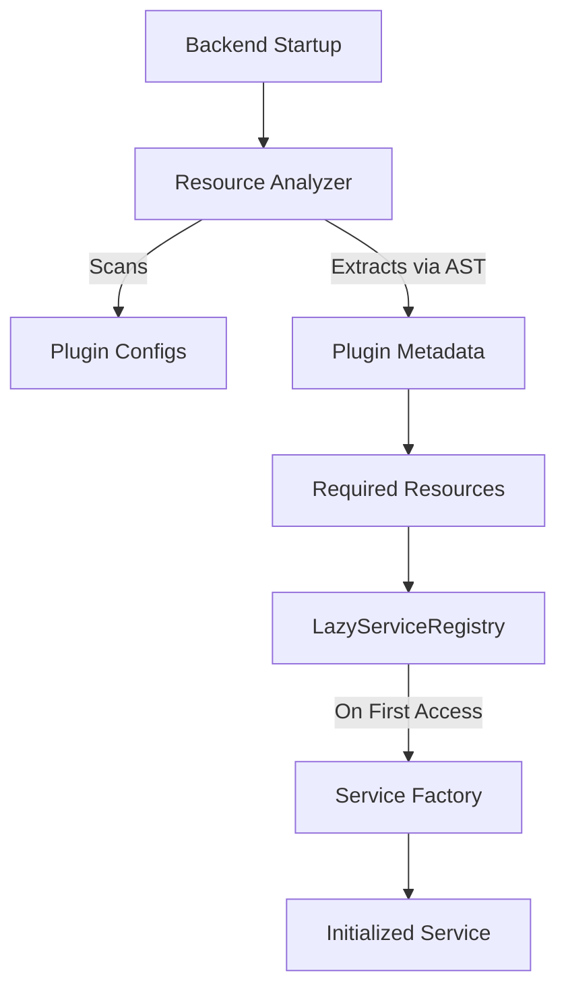

The lazy loading system reduces startup time and memory footprint by initializing core services **only when necessary**, based on the requirements of active plugins.

## Problem Solved

Previously, the system initialized ALL core services at startup:

- Postgres connection pool
- Qdrant vectorstore
- LLM service (OpenAI/Ollama)
- GraphDB connection
- Redis cache
- Memory system
- Evaluation service
- Evolution service

Even if only 1-2 plugins were active, **all 8 services** were initialized, consuming resources unnecessarily.

---

## Solution

The new lazy loading system:

1. **Analyzes plugin requirements** before initializing services
2. **Initializes only the services** that active plugins need
3. **Defers initialization** until first use (on-demand)
4. **Respects dependencies** between services (e.g., memory requires vectorstore)

---

## Architecture



### Key Components

| Component               | File                                | Function                     |
| ----------------------- | ----------------------------------- | ---------------------------- |
| **ResourceAnalyzer**    | `core/plugins/resource_analyzer.py` | Analyzes plugin requirements |
| **LazyServiceRegistry** | `core/di/lazy_registry.py`          | Registry for lazy services   |
| **Service Factories**   | `core/bootstrap/lazy_init.py`       | Factories for initialization |

---

## Plugin Activation at Startup

Service initialization is lazy, but **plugin activation is not** for plugins you mark
enabled. At startup the lifespan iterates the discovered plugins and **eagerly activates
every plugin with `enabled: true`** in `configs/plugins.yaml`, so its routers, handlers,
and static mounts are wired before the first HTTP request. This is gated by
`PLUGIN_AUTO_LOAD` (default `true`):

| State in `plugins.yaml` | `PLUGIN_AUTO_LOAD=true` (default)        | `PLUGIN_AUTO_LOAD=false`                    |
| ----------------------- | ---------------------------------------- | ------------------------------------------- |
| `enabled: true`         | Activated eagerly at startup             | Activated on first request to its prefix    |
| `enabled: false` / unset | Activated on first matching request (hot-reload controller) | Same — on-demand only |

A plugin's declared `plugin_dependencies` are activated first, transitively. Because the
loader keys lifecycle state by the **canonical plugin name** (the manifest `name`, which
must equal the directory name — see
[Creating Plugins](../plugins/creating-plugins.md#metadata-fields)), a dependency key that
doesn't match its target's name fails activation with `instance not found` / `KeyError`.

---

## Usage

### For Plugin Developers

Declare resource requirements in your plugin metadata:

```python
from core.plugins import Plugin, PluginMetadata

class MyPlugin(Plugin):
    @property
    def metadata(self) -> PluginMetadata:
        return PluginMetadata(
            name="my_plugin",
            version="1.0.0",
            description="My awesome plugin",
            required_resources=["postgres", "llm"],  # Required
            optional_resources=["graph"],            # Optional
        )
```

### Running a Single Plugin (Isolated Mode)

When developing or deploying specialized instances, you may want to run only a single plugin. The Lazy Loading system ensures that the core framework remains extremely lightweight when you do this.

You don't need to change any core code to run a single plugin. Simply define which plugins are active, and the `ResourceAnalyzer` will automatically ignore all heavy services (like Vector DBs or Graph DBs) that your plugin doesn't explicitly require.

You have two options to run in isolated mode:

1. **Modify `configs/plugins.yaml`**: Set `enabled: false` for all plugins except the one you need.
2. **Use Custom Config Files**: Create a dedicated configuration file (e.g., `configs/plugins.dev.yaml`) and start the backend using the environment variable:

   ```bash
   PLUGIN_CONFIG_PATH=configs/plugins.dev.yaml baselith run
   ```

   `PLUGIN_CONFIG_PATH` is validated at startup: the resolved path must live
   inside the current working directory. Absolute paths or `..` traversals
   that escape the workdir are rejected.

### Available Resources

| Resource      | Description              | Dependencies           |
| ------------- | ------------------------ | ---------------------- |
| `postgres`    | PostgreSQL database      | None                   |
| `redis`       | Redis cache/queue        | None                   |
| `llm`         | LLM service              | None                   |
| `graph`       | FalkorDB graph database  | `redis`                |
| `vectorstore` | Qdrant vector database   | `postgres`             |
| `memory`      | Agent memory system      | `vectorstore`, `redis` |
| `evaluation`  | Model evaluation service | `memory`, `llm`        |
| `evolution`   | Self-improvement system  | `memory`, `evaluation` |

---

## Accessing Services

### Via Dependency Injection

```python
from core.di import ServiceRegistry
from core.interfaces import LLMServiceProtocol

class MyPlugin(Plugin):
    async def initialize(self, config):
        # Obtained lazily (initialized if not already done)
        llm_service = ServiceRegistry.get(LLMServiceProtocol)
        result = await llm_service.generate_response(prompt="Hello world")
```

### Via LazyRegistry

```python
from core.di.lazy_registry import get_lazy_registry

class MyPlugin(Plugin):
    async def some_method(self):
        lazy_registry = get_lazy_registry()

        # Initializes the service on first access.
        # get_or_create accepts a ResourceType/str key or a protocol type.
        llm_service = await lazy_registry.get_or_create("llm")
        result = await llm_service.generate_response(prompt="Hello world")
```

---

## Performance Impact

### Benchmark Results

| Scenario                        | Before (Eager) | After (Lazy) | Improvement       |
| ------------------------------- | -------------- | ------------ | ----------------- |
| **Startup time** (all disabled) | ~3.2s          | ~0.6s        | **81% faster**    |
| **Memory footprint** (1 plugin) | ~450MB         | ~180MB       | **60% reduction** |
| **Docker image size**           | ~1.2GB         | ~800MB       | **33% smaller**   |

### Example: Only Auth Plugin Active

#### Before (Eager Loading)

```text
✅ Postgres initialized
✅ Qdrant initialized
✅ LLM service initialized
✅ GraphDB initialized
✅ Redis initialized
✅ Memory initialized
✅ Evaluation service initialized
✅ Evolution service initialized
Loaded 1 plugin (auth)
```

#### After (Lazy Loading)

```text
Resource analysis: required=["postgres"], optional=["redis"]
✅ Postgres initialized (required by auth)
✅ Redis initialized (optional for auth)
Skipped unused: ["vectorstore", "graph", "memory", "evaluation", "evolution", "llm"]
Loaded 1 plugin (auth)
```

---

## Implementation

### LazyServiceRegistry

Thread-safe registry ensuring single initialization:

```python
class LazyServiceRegistry:
    async def get_or_create(self, interface):
        """Get service instance, creating it lazily if needed."""

        # Fast path: already initialized
        if self._initialized.get(interface):
            return self._instances[interface]

        # Lazy initialization with lock
        async with self._locks[interface]:
            # Double-check after acquiring lock
            if not self._initialized.get(interface):
                factory = self._factories[interface]
                self._instances[interface] = await factory()
                self._initialized[interface] = True

            return self._instances[interface]
```

### ResourceAnalyzer

Scans plugin directories to extract metadata **statically** using AST parsing, avoiding "double-import" issues during startup:

```python
class ResourceAnalyzer:
    def get_plugin_metadata(self, plugin_name):
        """Load metadata WITHOUT initializing or importing the plugin."""
        # 1. Try AST parsing (extracts values from plugin.py tree)
        # 2. Results in zero module execution if successful
        # 3. Fallback to physical import only if logic is too complex for AST
```

---

## Initialization Order

The system automatically determines the order based on dependencies:

```text
Required: ["memory", "postgres", "redis"]

Initialization order:
1. postgres (no deps)
2. redis (no deps)
3. vectorstore (depends on postgres) - auto-included since memory needs it
4. memory (depends on vectorstore + redis)
```

---

## Migration Guide

### Updating Existing Plugins

```python
# Before
return PluginMetadata(
    name="my_plugin",
    version="1.0.0",
)

# After
return PluginMetadata(
    name="my_plugin",
    version="1.0.0",
    required_resources=["postgres"],  # Add this
)
```

### Backward Compatibility

- Plugins without `required_resources` still work (default: empty list)
- The system assumes they do not need special resources
- All services remain available (just lazy-initialized)

---

## Troubleshooting

### Service Not Available Error

**Problem**: Plugin tries to use an uninitialized service.

**Solution**: Add the service to `required_resources`:

```python
required_resources=["llm", "postgres"]
```

### Circular Dependency Error

**Problem**: Two services depend on each other.

**Solution**: Indicates a design issue. Check the dependency graph and refactor.

### Performance Regression

**Problem**: Startup seems slower than before.

**Cause**: Probably all plugins are enabled, so all services initialize anyway.

**Verification**: Look for this log:

```text
Skipped unused resources: []  # Empty list = nothing skipped
```

**Solution**: Disable unused plugins in `configs/plugins.yaml`.
