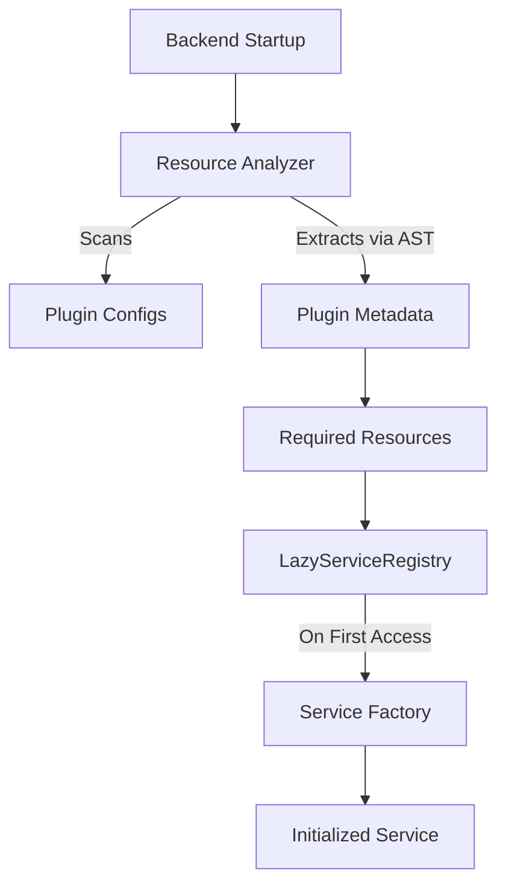

Two independent layers defer work until something asks for it:

- **Import time** — reading one name out of a package must not cost the whole
  package. Covered immediately below.
- **Service initialisation** — a connection pool or a vector store is built
  only when an active plugin declares it. Covered from *Problem Solved*
  onward, and it is what the rest of this page is about.

They compose: import-time laziness decides what Python parses, service
laziness decides what connects.

---

## Import-time laziness

A package whose `__init__.py` imports every submodule makes the cost of
touching *any* of its names the cost of *all* of them. `core.plugins` and
`core.orchestration` both did, and the bill landed on code that wanted one
small thing:

| Import | Before | After |
| --- | --- | --- |
| `import baselith` | 79 modules | 79 modules |
| `from core.plugins import SkillResult` | 955 modules, 0.36 s | 226 modules, 0.05 s |
| `from core.orchestration import AutonomyPolicy` | 3 209 modules | 95 modules |
| `from core.agent import Agent` | 3 209 modules, 0.61 s | 1 107 modules, 0.28 s |

`SkillResult` is four Pydantic fields. Reaching it imported the plugin
registry, the loader, the hot-reload controller, a FastAPI router and the
observability stack, because importing any submodule of a package first runs
that package's `__init__`.

### How it works

[PEP 562](https://peps.python.org/pep-0562/) module `__getattr__`, built by
`core._lazy.lazy_exports`. The package keeps the same literal `__all__` and
adds a table mapping each exported name to the submodule that defines it. A
name is imported the first time it is read, then cached in the package
namespace, so later reads are dictionary lookups.

```python
from core._lazy import lazy_exports

_EXPORTS: Final[dict[str, str]] = {
    "SkillResult": "result",
    "PluginLoader": "loader",
    # "submodule:original" where the package renames on the way out
    "plugin_management_router": "api:router",
}

__getattr__ = lazy_exports(__name__, _EXPORTS)
```

No import site changes. `from core.plugins import SkillResult` still works,
and so does `core.plugins.loader` — a name that is not an exported symbol is
tried as a submodule before `AttributeError` is raised, which preserves the
side effect the eager imports had of binding submodules as attributes.

### Provider SDKs

The same principle applies inside a function. `core.services.llm.provider_factory`
imported the anthropic, openai, ollama and huggingface clients at module
scope in order to construct exactly one of them: 0.38 s and roughly 1 800
modules on every path that reached the LLM service. Each import now sits
inside the branch that builds that provider.

The consequence for tests: patch a provider where it is **defined**
(`core.services.llm.providers.openai_provider.OpenAIProvider`), not as an
attribute of the factory, which no longer has one.

### Keeping it

`tests/unit/test_import_cost.py` holds a module-count budget per import path
and asserts that no provider SDK is reachable from any of them. Counts rather
than seconds, because a count is the same on a laptop and on a CI runner. The
budgets are a ratchet: tighten one when the number drops, never raise one to
make a red test green. A jump past a budget means a module-scope import landed
somewhere it should have been deferred.

---

The rest of this page covers the second layer: the lazy loading system that
reduces startup time and memory footprint by initializing core services **only
when necessary**, based on the requirements of active plugins.

## Problem Solved

Previously, the system initialized ALL core services at startup:

- Postgres connection pool
- Qdrant vectorstore
- LLM service (OpenAI/Ollama)
- GraphDB connection
- Redis cache
- Memory system
- Evaluation service
- Evolution service

Even if only 1-2 plugins were active, **all 8 services** were initialized, consuming resources unnecessarily.

---

## Solution

The new lazy loading system:

1. **Analyzes plugin requirements** before initializing services
2. **Registers a factory only for the services** that enabled plugins declare
   (required or optional) — everything else is never registered
3. **Creates the required ones the lifespan cannot defer eagerly** — `postgres`,
   `vectorstore`, `evaluation` and `evolution` are built at startup when a
   plugin *requires* them (`core/api/lifespan.py`); every other required
   resource (`llm`, `redis`, `graph`, `memory`, …) and every *optional* resource
   is created on the first `get_or_create()` call
4. **Respects dependencies** between services (e.g., memory requires vectorstore)

---

## Architecture


```mermaid
graph TB
    Startup[Backend Startup] --> Analyzer[Resource Analyzer]
    Analyzer --> |Scans| Plugins[Plugin Configs]
    Analyzer --> |Extracts via AST| Metadata[Plugin Metadata]
    Metadata --> Required[Required Resources]
    Required --> Registry[LazyServiceRegistry]
    Registry --> |On First Access| Factory[Service Factory]
    Factory --> Service[Initialized Service]
```

### Key Components

| Component               | File                                | Function                     |
| ----------------------- | ----------------------------------- | ---------------------------- |
| **ResourceAnalyzer**    | `core/plugins/resource_analyzer.py` | Analyzes plugin requirements |
| **LazyServiceRegistry** | `core/di/lazy_registry.py`          | Registry for lazy services   |
| **Service Factories**   | `core/bootstrap/lazy_init.py`       | Factories for initialization |

---

## Plugin Activation at Startup

Service initialization is lazy, but **plugin activation is not** for enabled plugins.
At startup the lifespan (`PluginRuntimeHooks.auto_activate`,
`core/api/_plugin_runtime.py`) iterates the discovered plugins and **eagerly activates
every one that `configs/plugins.yaml` enables**, so its routers, handlers, MCP tools
and static mounts are wired before the first HTTP request. "Enabled" is the rule
discovery already applied (`core.plugins.config_file.plugin_enabled`): no config file
enables every plugin; a non-empty file enables the plugins it names unless their entry
says `enabled: false`. This is gated by `PLUGIN_AUTO_LOAD` (default `true`):

| State in `plugins.yaml`                                  | `PLUGIN_AUTO_LOAD=true` (default)                                 | `PLUGIN_AUTO_LOAD=false`                 |
| -------------------------------------------------------- | ----------------------------------------------------------------- | ---------------------------------------- |
| No config file (or an empty one)                         | Every discovered plugin activated eagerly at startup              | Activated on first request to its prefix |
| `enabled: true`, or entry present with `enabled` omitted | Activated eagerly at startup                                      | Activated on first request to its prefix |
| `enabled: false`, or absent from a non-empty file        | **Never auto-activated** — not discovered, and refused on request | Same                                     |

On-request activation (`PluginActivationMiddleware`) only applies to plugins that
are in the enabled discovery set but not yet imported. `ResourceAnalyzer.discover_plugins`
drops `enabled: false` entries (and, when the file is non-empty, any plugin absent
from it), and `_activate_locked` (`core/api/_plugin_runtime.py`) refuses those
plugins — even transitively as another plugin's dependency — logging
`Refusing to auto-activate plugin <name>: not in the enabled discovery set
(disabled or absent from config)`; the request gets a `503`. Enable the plugin
in the config, or use the admin endpoint
`POST /api/plugins/{plugin_name}/enable` (`core/plugins/api.py`).

A plugin's declared `plugin_dependencies` are activated first, transitively. Because the
loader keys lifecycle state by the **canonical plugin name** (the manifest `name`, which
must equal the directory name — see
[Creating Plugins](../plugins/creating-plugins.md#metadata-fields)), a dependency key that
doesn't match its target's name fails activation with `instance not found` / `KeyError`.

---

## Usage

### For Plugin Developers

Declare resource requirements in your plugin metadata:

```python
from core.plugins import Plugin, PluginMetadata

class MyPlugin(Plugin):
    @property
    def metadata(self) -> PluginMetadata:
        return PluginMetadata(
            name="my_plugin",
            version="1.0.0",
            description="My awesome plugin",
            required_resources=["postgres", "llm"],  # Required
            optional_resources=["graph"],            # Optional
        )
```

### Running a Single Plugin (Isolated Mode)

When developing or deploying specialized instances, you may want to run only a single plugin. The Lazy Loading system ensures that the core framework remains extremely lightweight when you do this.

You don't need to change any core code to run a single plugin. Simply define which plugins are active, and the `ResourceAnalyzer` will automatically ignore all heavy services (like Vector DBs or Graph DBs) that your plugin doesn't explicitly require.

You have two options to run in isolated mode:

1. **Modify `configs/plugins.yaml`**: Set `enabled: false` for all plugins except the one you need.
2. **Use Custom Config Files**: Create a dedicated configuration file (e.g., `configs/plugins.dev.yaml`) and start the backend using the environment variable:

   ```bash
   PLUGIN_CONFIG_PATH=configs/plugins.dev.yaml baselith run
   ```

   `PLUGIN_CONFIG_PATH` is validated at startup: the resolved path must live
   inside the current working directory. Absolute paths or `..` traversals
   that escape the workdir are rejected.

### Available Resources

The nine keys of `RESOURCE_FACTORIES` (`core/bootstrap/lazy_init.py`);
dependencies come from `ResourceAnalyzer.DEFAULT_DEPENDENCIES`:

| Resource              | Description                                  | Dependencies                                                   |
| --------------------- | -------------------------------------------- | -------------------------------------------------------------- |
| `postgres`            | PostgreSQL database                          | None                                                           |
| `redis`               | Redis cache/queue                            | None                                                           |
| `llm`                 | LLM service                                  | None                                                           |
| `graph`               | FalkorDB graph database                      | `redis`                                                        |
| `vectorstore`         | Qdrant vector database                       | `postgres`                                                     |
| `memory`              | Agent memory system                          | `vectorstore`, `redis`                                         |
| `hierarchical_memory` | `HierarchicalMemory` (STM → MTM → LTM)       | None declared — its factory resolves the LLM service and embedder itself |
| `evaluation`          | Model evaluation service                     | `memory`, `llm`                                                |
| `evolution`           | Self-improvement system                      | `memory`, `evaluation`                                         |

---

## Accessing Services

### Via Dependency Injection

```python
from core.di import ServiceRegistry
from core.interfaces import LLMServiceProtocol

class MyPlugin(Plugin):
    async def initialize(self, config):
        # The lifespan registers an async *factory* under LLMServiceProtocol;
        # awaiting it resolves the service through the lazy registry
        # (initialized on the first call, cached afterwards).
        get_llm = ServiceRegistry.get(LLMServiceProtocol)
        llm_service = await get_llm()
        result = await llm_service.generate_response(prompt="Hello world")
```

### Via LazyRegistry

```python
from core.di.lazy_registry import get_lazy_registry

class MyPlugin(Plugin):
    async def some_method(self):
        lazy_registry = get_lazy_registry()

        # Initializes the service on first access. Keys are the resource
        # *names* the lifespan registered ("llm", "postgres", "vectorstore",
        # ...); passing a protocol type raises KeyError because no factory is
        # registered under it.
        llm_service = await lazy_registry.get_or_create("llm")
        result = await llm_service.generate_response(prompt="Hello world")
```

---

## Performance Impact

### Benchmark Results

| Scenario                        | Before (Eager) | After (Lazy) | Improvement       |
| ------------------------------- | -------------- | ------------ | ----------------- |
| **Startup time** (all disabled) | ~3.2s          | ~0.6s        | **81% faster**    |
| **Memory footprint** (1 plugin) | ~450MB         | ~180MB       | **60% reduction** |
| **Docker image size**           | ~1.2GB         | ~800MB       | **33% smaller**   |

### Example: Only `browser_agent` Enabled

`plugins/browser_agent/manifest.yaml` declares `required_resources: [llm]` and
`optional_resources: [internet]`.

#### Before (Eager Loading)

```text
✅ Postgres initialized
✅ Qdrant initialized
✅ LLM service initialized
✅ GraphDB initialized
✅ Redis initialized
✅ Memory initialized
✅ Evaluation service initialized
✅ Evolution service initialized
```

#### After (Lazy Loading)

```text
📊 Resource analysis complete: 1 required, 1 optional
   Required: ['llm']
   Optional: ['internet']
🔌 Discovered 1 plugins in lazy-import mode
```

Only the `llm` factory is registered (`internet` has no entry in
`RESOURCE_FACTORIES`), and nothing connects until the first
`get_or_create("llm")`. The lazy registry never builds Postgres, Qdrant, Redis or
the rest (independent subsystems such as the distributed rate limiter still open
their own Redis connection when configured).

---

## Implementation

### LazyServiceRegistry

Thread-safe registry ensuring single initialization:

```python
class LazyServiceRegistry:
    async def get_or_create(self, interface):
        """Get service instance, creating it lazily if needed."""

        # Fast path: already initialized
        if self._initialized.get(interface):
            return self._instances[interface]

        # Lazy initialization with lock
        async with self._locks[interface]:
            # Double-check after acquiring lock
            if not self._initialized.get(interface):
                factory = self._factories[interface]
                self._instances[interface] = await factory()
                self._initialized[interface] = True

            return self._instances[interface]
```

### ResourceAnalyzer

Scans plugin directories to extract metadata **statically** using AST parsing, avoiding "double-import" issues during startup:

```python
class ResourceAnalyzer:
    def get_plugin_metadata(self, plugin_name):
        """Load metadata WITHOUT initializing or importing the plugin."""
        # 1. Try AST parsing (extracts values from plugin.py tree)
        # 2. Results in zero module execution if successful
        # 3. Fallback to physical import only if logic is too complex for AST
```

---

## Initialization Order

The system automatically determines the order based on dependencies:

```text
Required: ["memory", "postgres", "redis"]

Initialization order:
1. postgres (no deps)
2. redis (no deps)
3. vectorstore (depends on postgres) - auto-included since memory needs it
4. memory (depends on vectorstore + redis)
```

---

## Migration Guide

### Updating Existing Plugins

```python
# Before
return PluginMetadata(
    name="my_plugin",
    version="1.0.0",
)

# After
return PluginMetadata(
    name="my_plugin",
    version="1.0.0",
    required_resources=["postgres"],  # Add this
)
```

### Backward Compatibility

- Plugins without `required_resources` still work (default: empty list)
- The system assumes they do not need special resources
- All services remain available (just lazy-initialized)

---

## Troubleshooting

### Service Not Available Error

**Problem**: Plugin tries to use an uninitialized service.

**Solution**: Add the service to `required_resources`:

```python
required_resources=["llm", "postgres"]
```

### Circular Dependency Error

**Problem**: Two services depend on each other.

**Solution**: Indicates a design issue. Check the dependency graph and refactor.

### Performance Regression

**Problem**: Startup seems slower than before.

**Cause**: Probably all plugins are enabled, so all services initialize anyway.

**Verification**: Look for the analysis summary at startup:

```text
📊 Resource analysis complete: 6 required, 1 optional
   Required: ['evaluation', 'graph', 'llm', 'memory', 'postgres', 'vectorstore']
```

If the `Required:` line lists (almost) every resource, nothing is being skipped.

**Solution**: Disable unused plugins in `configs/plugins.yaml`.
