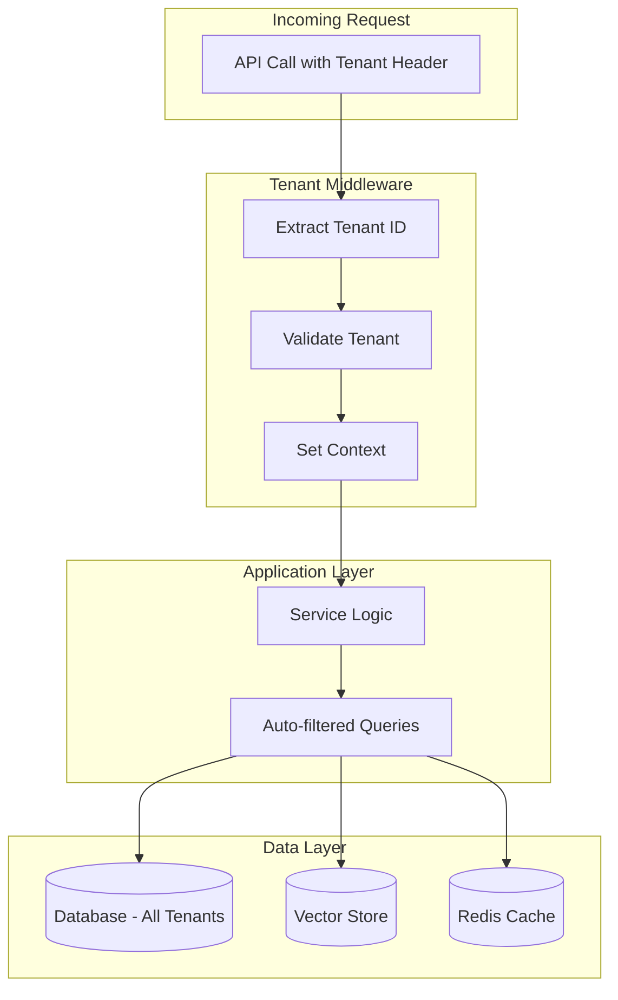

**Multi-Tenancy** is an architectural pattern that allows a single instance of the application to serve **multiple customers (tenants)** while keeping their data completely isolated. It is fundamental for **SaaS** applications where different customers share infrastructure but must have separate data.

!!! info "When Multi-Tenancy is Needed"
    - **SaaS Products**: Each customer has their own isolated data space
    - **Enterprise**: Separate business divisions on the same system
    - **White-Label**: Partners using the system with their own branding
    - **Compliance**: Regulatory requirements demanding data separation (e.g., GDPR, HIPAA)

---

## Architecture

The framework implements Multi-Tenancy at the **application level** (not schema-per-tenant), ensuring isolation via automatic context propagation:



**Benefits of this approach:**

| Aspect          | Benefit                                       |
| --------------- | --------------------------------------------- |
| **Simplicity**  | Single database, single schema                |
| **Scalability** | Easy to add new tenants                       |
| **Costs**       | Shared infrastructure, lower costs            |
| **Maintenance** | Updates applied to all tenants simultaneously |

---

## Context Propagation

The core of the system is the **tenant context**, which automatically propagates the tenant identifier through the entire application stack.

### How It Works

For **HTTP requests**, the tenant context is derived by `TenantMiddleware`
(`core/middleware/tenant.py`, a pure-ASGI middleware) from the authenticated
user. The flow is:

1. The auth layer populates the request user (`scope['user']` / `request.state.user`) as an `AuthUser`. Route dependencies such as `require_user` / `require_admin` (exported from `core.middleware`) enforce authentication.
2. `TenantMiddleware` reads that `AuthUser` and calls `set_tenant_context(user.tenant_id)`, falling back to `"default"` if no `AuthUser` is present. The token is retained for cleanup, and `tenant_id` is bound to structlog. It **also** binds the authenticated user id via `set_user_context(user.user_id)` — identity-derived, never a client header — so plugins can resolve a per-user tenant (see [Per-plugin tenancy](#per-plugin-tenancy-personal-vs-shared)). `SecurityManager` (`core/middleware/security.py`) binds the same pair on the auth path.
3. The route handler and all downstream code see the correct `tenant_id` via `get_current_tenant_id()` and the user id via `get_current_user_id()`.
4. `TenantMiddleware` calls `reset_tenant_context(token)` (and `reset_user_context(...)`) in its `finally` block.

For **background tasks and scripts**, you must set the context explicitly (see Troubleshooting below).

When a request arrives with a valid token, the auth layer extracts the tenant ID from the authenticated user and sets it in the asynchronous context. Tenant-aware components (such as `SemanticLLMCache`, which partitions its entries by `get_current_tenant_id()`) then key off the current context.

There is **no** context-manager helper. `core/context.py` exposes `set_tenant_context()` (which returns a token), `reset_tenant_context(token)`, and `get_current_tenant_id()` — plus the parallel `set_user_context()` / `reset_user_context(token)` / `get_current_user_id()` for the authenticated **user** id. Set the context at the entry point and reset it with the returned token in a `finally` block:

```python
from core.context import set_tenant_context, reset_tenant_context, get_current_tenant_id

# Set the tenant at the start of the request/task
token = set_tenant_context("tenant-123")
try:
    # Tenant-aware components read the current context

    # Verify current tenant (useful for debugging)
    tenant_id = get_current_tenant_id()  # "tenant-123"

    # Tenant-partitioned semantic cache reads/writes under this tenant
    result = await semantic_cache.get(prompt)
finally:
    reset_tenant_context(token)
```

!!! warning "Manual data-layer filtering"
    The data layer uses raw SQL (psycopg), not an ORM with automatic query
    rewriting. Repository queries that must be tenant-scoped include an explicit
    `WHERE tenant_id = %s` clause (see `core/db/feedback.py`,
    `core/db/documents.py`). `get_current_tenant_id()` is the source of truth for
    the value to filter on. Fully automatic, framework-wide query/cache/vector
    filtering is a **Roadmap** item, not a current guarantee.

### Usage in Your Handlers

If you are developing a plugin, the tenant context is already set when your code executes (the auth layer set it for the request):

```python
from core.context import get_current_tenant_id

class MyPluginHandler(FlowHandler):
    async def handle(self, query: str, context: dict) -> dict:
        # Tenant is already available
        tenant = get_current_tenant_id()

        # Use for specific business logic
        if tenant == "premium-client":
            return await self.premium_processing(query)
        return await self.standard_processing(query)
```

---

## Per-plugin tenancy (personal vs shared)

A single deployment can mix tenancy models **per plugin**. A plugin declares its
model in its manifest:

```yaml title="plugins/my-plugin/manifest.yaml"
tenancy: personal        # "shared" (default) | "personal"
```

| Mode                  | Scope key                                              | Use it for                                             |
| --------------------- | ----------------------------------------------------- | ------------------------------------------------------ |
| `shared` *(default)*  | the deployment-derived tenant (`get_current_tenant_id()`) | classic SaaS — many users share one tenant's data      |
| `personal`            | the authenticated **user** id (1 user = 1 tenant)     | per-user private data even on a shared deployment       |

The key insight: `personal` keys off the **bound user identity**, never a
request header — so it is as forgery-resistant as the tenant context. This is
what lets, say, a personal-notes plugin give every user a private silo while the
rest of the deployment stays single-tenant.

### Resolving the key

A plugin must never call `get_current_tenant_id()` directly for storage scoping —
that ignores its declared mode. Instead call `Plugin.tenant_key()`, which honours
the manifest:

```python
class MyPlugin(Plugin):
    async def handle(self, query: str, context: dict) -> dict:
        # Honours manifest `tenancy`: per-user for "personal", per-deployment
        # for "shared". Use this value in WHERE tenant_id = … / namespaces / paths.
        scope = self.tenant_key()
        await cursor.execute(
            "SELECT * FROM notes WHERE tenant_id = %s", (scope,)
        )
```

Under the hood `tenant_key()` delegates to `core.context.resolve_plugin_tenant(mode)`:

- `"personal"` → `get_current_user_id()` when a user is bound; otherwise it falls
  back to `get_tenant_or_default()` (the non-raising deployment tenant) so
  background tasks and scripts still get a stable, non-raising key.
- anything else (`"shared"`) → the deployment-derived tenant via
  `get_tenant_or_default()`.

#### Store-layer code with no `Plugin` self

`tenant_key()` is an instance method, so store/repository code that scopes a
plugin's persistence but has no `self` to call it on cannot use it. Reaching for
`get_current_tenant_id()` there would silently ignore the plugin's declared mode
**and** any runtime override. Use the store-layer counterpart instead:

```python
from core.context import resolve_plugin_tenant_key

scope = resolve_plugin_tenant_key("my-plugin", declared_mode)  # declared_mode defaults to "shared"
await cursor.execute("SELECT * FROM notes WHERE tenant_id = %s", (scope,))
```

It runs the same resolution as `tenant_key()` — effective mode (manifest +
override) → identity-derived tenant. For `shared` with no override it is exactly
`get_tenant_or_default()`, so swapping it in is behaviour-preserving. The
`system`-plugin override-exemption lives at the `Plugin` chokepoint and is **not**
re-checked here (a store belongs to a non-system plugin), so system plugins must
not use it to bypass that.

!!! warning "`personal` data still lives in the shared tables"
    `tenancy: personal` changes only the **value** written to `tenant_id`, not the
    storage backend. Per-user rows coexist with shared-tenant rows in the same
    tables, isolated solely by the scope key. `purge_tenant_data(user_id)` therefore
    erases a `personal` user's data exactly as it would a tenant's.

### Overriding the declared mode at runtime

A plugin's `tenancy:` is a *default*, not a hard binding. The framework exposes a
registration **seam** so an override source can flip a plugin's effective mode —
`shared` ↔ `personal` — at runtime, without editing the manifest or re-packaging.
The seam lives in core while the override source stays in plugin land, so the
Sacred-Core boundary is never crossed:

```python
from core.context import set_plugin_tenancy_resolver

# An admin-facing plugin registers a resolver at activation.
# resolver(plugin_name) -> "shared" | "personal" to override, or None to inherit.
set_plugin_tenancy_resolver(my_override_lookup)
```

`Plugin.tenant_key()` resolves the effective mode through
`core.context.resolve_plugin_tenancy_mode(plugin_name, declared)`:

- **No resolver registered** → the declared manifest mode is used verbatim, so a
  deployment that never registers one behaves exactly as before (zero behaviour
  change).
- A resolver that returns `None`, an unknown value, or raises → degrades to the
  declared mode. An override-source outage can never break or silently re-scope a
  plugin's storage.

!!! danger "System plugins are exempt — their tenancy is locked"
    A plugin marked `system: true` (platform infrastructure) can **never** be
    overridden: `tenant_key()` short-circuits to the declared mode for system
    plugins, so even a stray override entry cannot re-scope them. Re-scoping an
    infrastructure plugin — e.g. the identity/tenancy source itself — would
    fracture isolation system-wide, so the exemption is a hard core invariant.

!!! warning "Switching mode is not a data migration"
    Changing a plugin's effective tenancy only changes the key that *new* reads
    and writes use. Existing rows stay under their previous `tenant_id` and may
    become invisible under the new mode (e.g. `shared` → `personal` hides the
    org's rows from every user). Prefer setting the mode **before** a plugin
    accumulates data.

---

## Resource Isolation

### Database (PostgreSQL)

The data layer uses raw SQL via `psycopg`. Tenant-scoped queries include an
explicit `tenant_id` filter sourced from the current context. There is no ORM and
no automatic query rewriting:

```python
from core.context import get_current_tenant_id

# Tenant-scoped query (see core/db/feedback.py, core/db/documents.py)
tenant_id = get_current_tenant_id()
await cursor.execute(
    "SELECT * FROM chat_feedback WHERE tenant_id = %s",
    (tenant_id,),
)
```

The core interaction store (`core/storage/postgres.py`) carries a `tenant_id`
column on `interactions` and `feedback` (DEFAULT `'default'` for backward
compatibility) and scopes every read/write to `get_current_tenant_id()`.

!!! info "Roadmap: automatic query filtering"
    Transparent, framework-wide injection of the `tenant_id` filter into every
    query (and a corresponding cross-tenant admin escape hatch) is planned but
    **not yet implemented**. Today, application-level tenant scoping is the
    responsibility of each repository query.

#### Defense-in-depth: Row-Level Security (opt-in)

Set `DB_RLS_ENABLED=true` to bind the request's tenant to the DB session on every
pool checkout (`SELECT set_config('app.tenant_id', …, false)`), so Postgres RLS
policies of the form `USING (tenant_id = current_setting('app.tenant_id'))` isolate
rows **at the database**, independent of application-level filtering.

The flag is **OFF by default** and a strict no-op when off — the connection path
is byte-identical to before. Even when on, it has no effect until RLS policies
exist *and* the app connects as a non-owner (or `FORCE ROW LEVEL SECURITY`) role,
so toggling it alone is never a regression. Outside a request (background task,
script) the session binds to `"default"`.

### Vector Store (Qdrant)

When a repository constructs a vector search, it is expected to pass the tenant
filter explicitly using `get_current_tenant_id()`. Automatic, transparent
tenant filtering on every vector search is a **Roadmap** item.

### Cache (semantic LLM cache)

`SemanticLLMCache` (`core/cache/semantic_cache.py`) is tenant-partitioned: it
stores entries under `entries[tenant_id][prompt_hash]`, deriving `tenant_id` from
`get_current_tenant_id()`. Two tenants issuing the same prompt never share a cache
entry:

```python
# Internally, SemanticLLMCache keys by the current tenant context:
#   self._entries[get_current_tenant_id()][prompt_hash] = CacheEntry
```

!!! info "Roadmap: Redis keyspace prefixing & per-tenant flush"
    A Redis-backed cache with automatic per-tenant key prefixing and a
    `flush_tenant()`-style bulk eviction is planned. The in-process semantic
    cache partitions by tenant, but a transparent prefixed Redis keyspace and
    bulk per-tenant flush are not yet available.

---

## Isolation Guarantees

`core/tenancy` provides reusable enforcement so isolation does not depend on
each store re-implementing the check correctly.

### Cross-tenant guard

Any store or service that resolves a resource by id must verify the resource
belongs to the request's tenant **before acting** — a forgotten check is a
cross-tenant IDOR. Use the shared guard:

```python
from core.tenancy import tenants_match, require_tenant_match

# Predicate form — treat a mismatch as "not found" (don't leak existence):
if not tenants_match(resource.tenant_id):           # vs the active tenant context
    raise HTTPException(404)

# Or fail loudly at a choke point:
require_tenant_match(resource.tenant_id)             # raises CrossTenantError on mismatch
```

The webhook service uses this guard for delete/replay, so a `webhooks:write`
holder in one tenant cannot touch another tenant's endpoints or deliveries.

### Per-tenant encryption-at-rest

For fields that must be **cryptographically** isolated, derive a tenant-bound
key so data encrypted in one tenant's context cannot be decrypted in another's —
even with full database access. The tenant id is mixed into an HKDF expansion of
the operator's base key, on top of the AES-256-GCM
[field encryptor](../core-modules/security.md):

```python
from core.tenancy import tenant_field_encryptor

base_keys = {"k1": "operator-secret-or-base64-key"}
enc = tenant_field_encryptor(tenant_id, base_keys, active_key_id="k1")
token = enc.encrypt(value)        # bound to tenant_id
enc.decrypt(token)                # only succeeds in the same tenant's encryptor
```

A different tenant's encryptor fails the GCM authentication and raises
`DecryptionError`. Key ids (and therefore rotation) are preserved per tenant.

---

## Strict Mode

For environments with high security requirements, you can enable **strict tenant isolation** (`strict_tenant_isolation` on the app config):

```env
STRICT_TENANT_ISOLATION=true
```

In strict mode:

- ❌ Calling `get_current_tenant_id()` **without** a tenant context raises instead of falling back to `"default"`
- ❌ No implicit `"default"` tenant is returned
- ✅ Surfaces code paths that forgot to set the context

**Example error in strict mode:**

```python
from core.context import get_current_tenant_id

# Without tenant context, with strict_tenant_isolation enabled
tenant_id = get_current_tenant_id()
# Raises: TenantContextError(
#     "Strict tenant isolation enabled: No tenant context found in current contextvar."
# )
```

!!! tip "Recommendation"
    Enable strict mode in production to prevent accidental security bugs.

---

## Management API

Tenants are managed through `TenantService` (`core/services/tenant/service.py`),
backed by the primary SQL database. Obtain the singleton via `get_tenant_service()`.
Protect admin routes with the auth manager's `require_auth({AuthRole.ADMIN})`
decorator.

### Create a Tenant

```python
from core.auth.types import AuthRole
from core.services.tenant.service import get_tenant_service

tenant_service = get_tenant_service()

@router.post("/api/admin/tenants")
@auth.require_auth({AuthRole.ADMIN})  # auth = AuthManager instance
async def create_tenant(tenant_id: str, name: str):
    """
    Register a new tenant in the system.

    Returns:
        Tenant (id, name, status, created_at)
    """
    return await tenant_service.create_tenant(tenant_id=tenant_id, name=name)
```

### List / Get Tenants

```python
@router.get("/api/admin/tenants")
@auth.require_auth({AuthRole.ADMIN})
async def list_tenants():
    return await tenant_service.list_tenants()

@router.get("/api/admin/tenants/{tenant_id}")
@auth.require_auth({AuthRole.ADMIN})
async def get_tenant(tenant_id: str):
    return await tenant_service.get_tenant(tenant_id)
```

### Per-tenant usage quotas

A tenant carries an **aggregate request budget** across all its members, enforced
independently of (and on top of) per-identity quotas. `QuotaMiddleware` consumes
one unit from both the caller's identity budget and their tenant's budget on every
authenticated request, rejecting with `429` when either window is exhausted.

```python
from core.config.quotas import set_tenant_quota

# Tenant plan: 1M requests/day, 20M/month (aggregate across all members)
set_tenant_quota("tenant-123", daily=1_000_000, monthly=20_000_000)
```

Defaults apply to every tenant via `QUOTA_TENANT_DAILY_REQUESTS` /
`QUOTA_TENANT_MONTHLY_REQUESTS`; `None`/`0` means unlimited. See the
[Usage Quotas](../core-modules/quotas.md) module for the full enforcement model.

!!! info "Roadmap: storage & feature-flag quotas"
    Aggregate request budgets ship today. Per-tenant storage, vector-document
    quotas, and feature flags on the `Tenant` model itself remain planned.

### Tenant data purge (GDPR)

`purge_tenant_data(tenant_id)` (`core/services/tenant/purge.py`) deletes every row
scoped to a tenant across **all** public tables carrying a `tenant_id` column —
core (`interactions`, `feedback`) and any plugin store. The table set is discovered
dynamically from `information_schema`, and foreign-key ordering is resolved by a
fixpoint retry loop, so no hand-maintained table list can drift:

```python
from core.services.tenant import purge_tenant_data

deleted = await purge_tenant_data("tenant-123")  # {table: rows_deleted}
```

It is idempotent and covers tenant-scoped data only — the tenant entity row
itself is owned by `TenantService` (`core/services/tenant/service.py`).

---

## Testing Multi-Tenancy

When writing tests, ensure you verify isolation:

```python
import pytest
from core.context import set_tenant_context, reset_tenant_context

@pytest.mark.asyncio
async def test_tenant_isolation():
    # Create data for tenant A
    token = set_tenant_context("tenant-a")
    try:
        await repository.create(Item(name="A Item"))
    finally:
        reset_tenant_context(token)

    # Create data for tenant B
    token = set_tenant_context("tenant-b")
    try:
        await repository.create(Item(name="B Item"))
    finally:
        reset_tenant_context(token)

    # Verify isolation
    token = set_tenant_context("tenant-a")
    try:
        items = await repository.get_all()
        assert len(items) == 1
        assert items[0].name == "A Item"
    finally:
        reset_tenant_context(token)

    token = set_tenant_context("tenant-b")
    try:
        items = await repository.get_all()
        assert len(items) == 1
        assert items[0].name == "B Item"
    finally:
        reset_tenant_context(token)
```

---

## Troubleshooting

### "TenantContextError" (strict isolation)

**Problem:** You receive a `TenantContextError` from `get_current_tenant_id()`.

**Cause:** With `strict_tenant_isolation` enabled, you are running code outside of an HTTP request context (e.g., background task, script) without setting the tenant first.

**Solution:**

```python
from core.context import set_tenant_context, reset_tenant_context

async def background_task(tenant_id: str):
    token = set_tenant_context(tenant_id)
    try:
        # Your code here
        await process_data()
    finally:
        reset_tenant_context(token)
```

### One tenant's data visible to another

**Problem:** Queries returning cross-tenant data.

**Cause:** You are likely using raw SQL or bypassing the ORM.

**Solution:** Always use framework-provided repositories, or ensure you include the filter:

```python
# ❌ Don't do this
results = session.execute(text("SELECT * FROM items"))

# ✅ Do this instead
results = await item_repository.get_all()  # Auto-filtered
```

---

## Best Practices

!!! tip "Tenant Identification"
    Use UUIDs to identify tenants, never persistent or sequential values.

!!! tip "Logging"
    Always include `tenant_id` in logs to facilitate debugging:
    ```python
    logger.info("Processing", tenant_id=get_current_tenant_id())
    ```

!!! warning "Backup"
    Backups are cross-tenant. Implement per-tenant export if required for compliance.
