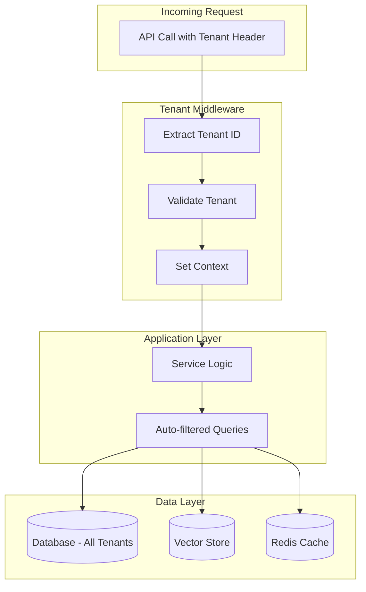

**Multi-Tenancy** is an architectural pattern that allows a single instance of the application to serve **multiple customers (tenants)** while keeping their data completely isolated. It is fundamental for **SaaS** applications where different customers share infrastructure but must have separate data.

!!! info "When Multi-Tenancy is Needed"
    - **SaaS Products**: Each customer has their own isolated data space
    - **Enterprise**: Separate business divisions on the same system
    - **White-Label**: Partners using the system with their own branding
    - **Compliance**: Regulatory requirements demanding data separation (e.g., GDPR, HIPAA)

---

## Architecture

The framework implements Multi-Tenancy at the **application level** (not schema-per-tenant), ensuring isolation via automatic context propagation:



**Benefits of this approach:**

| Aspect          | Benefit                                       |
| --------------- | --------------------------------------------- |
| **Simplicity**  | Single database, single schema                |
| **Scalability** | Easy to add new tenants                       |
| **Costs**       | Shared infrastructure, lower costs            |
| **Maintenance** | Updates applied to all tenants simultaneously |

---

## Context Propagation

The core of the system is the **tenant context**, which automatically propagates the tenant identifier through the entire application stack.

### How It Works

When a request arrives, the middleware extracts the tenant ID from the header or JWT token and sets it in the asynchronous context. From that moment, **all operations** (database, cache, vector store) are automatically filtered.

```python
from core.context import tenant_context, get_current_tenant

# Middleware sets the tenant at the start of the request
async with tenant_context("tenant-123"):
    # All operations are automatically isolated
    
    # Database query: returns ONLY tenant-123 data
    data = await repository.get_all()  
    
    # Cache: uses separate keyspace
    cached = await cache.get("my-key")  # reads tenant-123:my-key
    
    # Vector search: filters by tenant
    results = await vectorstore.search(query)
    
    # Verify current tenant (useful for debugging)
    tenant_id = get_current_tenant()  # "tenant-123"
```

### Usage in Your Handlers

If you are developing a plugin, the tenant context is already set when your code executes:

```python
from core.context import get_current_tenant

class MyPluginHandler(FlowHandler):
    async def handle(self, query: str, context: dict) -> str:
        # Tenant is already available
        tenant = get_current_tenant()
        
        # Use for specific business logic
        if tenant == "premium-client":
            return await self.premium_processing(query)
        return await self.standard_processing(query)
```

---

## Resource Isolation

### Database (PostgreSQL)

All SQL queries are automatically filtered. You don't need to do anything special in your code:

```python
# Your code
users = await user_repository.get_all()

# What runs internally
# SELECT * FROM users WHERE tenant_id = 'tenant-123'
```

The framework uses SQLAlchemy events to automaticall inject the `tenant_id` filter into every query.

!!! warning "Watch Out for Admin"
    Administrative queries (cross-tenant) require explicit admin context:
    ```python
    async with admin_context():
        all_users = await user_repository.get_all()  # ALL tenants
    ```

### Vector Store (Qdrant)

Vector searches automatically include the tenant filter:

```python
# Your code
results = await vectorstore.search(
    query="How do I reset my password?",
    top_k=5
)

# Internally, the framework adds the filter:
# filter={"tenant_id": "tenant-123"}
```

This guarantees that a tenant can never see documents from another tenant, even in semantic searches.

### Cache (Redis)

Redis uses **isolated keyspaces** for each tenant. Keys are automatically prefixed:

```text
# Logical key in your code:
await cache.set("session:abc", data)

# Actual key in Redis:
tenant-123:session:abc

# Another tenant:
tenant-456:session:abc   # Completely separate
```

This also allows operations like "clear all cache for a tenant" without impacting others:

```python
await cache.flush_tenant("tenant-123")  # Only this tenant's keys
```

---

## Strict Mode

For environments with high security requirements, you can enable **strict mode**:

```env
MULTI_TENANCY_STRICT=true
```

In strict mode:

- ❌ Every operation **without** explicit tenant context fails with error
- ❌ No "default tenant" exists
- ✅ Ensures no query "escapes" isolation

**Example error in strict mode:**

```python
# Without tenant context
data = await repository.get_all()
# Raises: TenantContextRequired("No tenant context set. Enable admin_context() for cross-tenant operations.")
```

!!! tip "Recommendation"
    Enable strict mode in production to prevent accidental security bugs.

---

## Management API

Administrators can manage tenants via dedicated APIs:

### Create a Tenant

```python
from core.auth import require_roles, AuthRole

@router.post("/api/admin/tenants")
@require_roles([AuthRole.ADMIN])
async def create_tenant(tenant: TenantCreate):
    """
    Creates a new tenant in the system.
    
    Args:
        tenant: New tenant data (name, config, limits)
    
    Returns:
        TenantInfo with ID and created details
    """
    return await tenant_service.create(tenant)
```

### List Tenants

```python
@router.get("/api/admin/tenants")
@require_roles([AuthRole.ADMIN])
async def list_tenants(
    skip: int = 0,
    limit: int = 100
) -> list[TenantInfo]:
    return await tenant_service.list(skip=skip, limit=limit)
```

### Tenant Limits

You can configure specific limits for each tenant:

```python
tenant_limits = TenantLimits(
    max_requests_per_minute=100,
    max_storage_mb=1000,
    max_vector_documents=10000,
    features=["basic", "premium_agent"]
)

await tenant_service.update_limits("tenant-123", tenant_limits)
```

---

## Testing Multi-Tenancy

When writing tests, ensure you verify isolation:

```python
import pytest
from core.context import tenant_context

@pytest.mark.asyncio
async def test_tenant_isolation():
    # Create data for tenant A
    async with tenant_context("tenant-a"):
        await repository.create(Item(name="A Item"))
    
    # Create data for tenant B
    async with tenant_context("tenant-b"):
        await repository.create(Item(name="B Item"))
    
    # Verify isolation
    async with tenant_context("tenant-a"):
        items = await repository.get_all()
        assert len(items) == 1
        assert items[0].name == "A Item"
    
    async with tenant_context("tenant-b"):
        items = await repository.get_all()
        assert len(items) == 1
        assert items[0].name == "B Item"
```

---

## Troubleshooting

### "TenantContextRequired" Error

**Problem:** You receive a missing context error.

**Cause:** You are running code outside of an HTTP request context (e.g., background task, script).

**Solution:**

```python
from core.context import tenant_context

async def background_task(tenant_id: str):
    async with tenant_context(tenant_id):
        # Your code here
        await process_data()
```

### One tenant's data visible to another

**Problem:** Queries returning cross-tenant data.

**Cause:** You are likely using raw SQL or bypassing the ORM.

**Solution:** Always use framework-provided repositories, or ensure you include the filter:

```python
# ❌ Don't do this
results = session.execute(text("SELECT * FROM items"))

# ✅ Do this instead
results = await item_repository.get_all()  # Auto-filtered
```

---

## Best Practices

!!! tip "Tenant Identification"
    Use UUIDs to identify tenants, never persistent or sequential values.

!!! tip "Logging"
    Always include `tenant_id` in logs to facilitate debugging:
    ```python
    logger.info("Processing", tenant_id=get_current_tenant())
    ```

!!! warning "Backup"
    Backups are cross-tenant. Implement per-tenant export if required for compliance.
