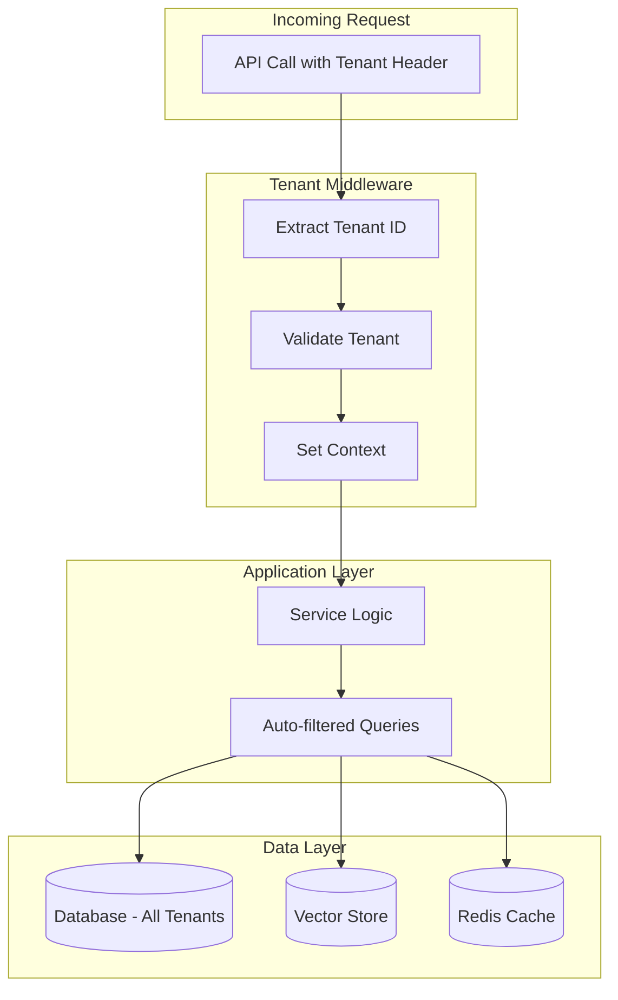

**Multi-Tenancy** is an architectural pattern that allows a single instance of the application to serve **multiple customers (tenants)** while keeping their data completely isolated. It is fundamental for **SaaS** applications where different customers share infrastructure but must have separate data.

!!! info "When Multi-Tenancy is Needed"
    - **SaaS Products**: Each customer has their own isolated data space
    - **Enterprise**: Separate business divisions on the same system
    - **White-Label**: Partners using the system with their own branding
    - **Compliance**: Regulatory requirements demanding data separation (e.g., GDPR, HIPAA)

---

## Architecture

The framework implements Multi-Tenancy at the **application level** (not schema-per-tenant), ensuring isolation via automatic context propagation:



**Benefits of this approach:**

| Aspect          | Benefit                                       |
| --------------- | --------------------------------------------- |
| **Simplicity**  | Single database, single schema                |
| **Scalability** | Easy to add new tenants                       |
| **Costs**       | Shared infrastructure, lower costs            |
| **Maintenance** | Updates applied to all tenants simultaneously |

---

## Context Propagation

The core of the system is the **tenant context**, which automatically propagates the tenant identifier through the entire application stack.

### How It Works

For **HTTP requests**, the tenant context is derived by `TenantMiddleware`
(`core/middleware/tenant.py`, a pure-ASGI middleware) from the authenticated
user. The flow is:

1. The auth layer populates the request user (`scope['user']` / `request.state.user`) as an `AuthUser`. Route dependencies such as `require_user` / `require_admin` (exported from `core.middleware`) enforce authentication.
2. `TenantMiddleware` reads that `AuthUser` and calls `set_tenant_context(user.tenant_id)`, falling back to `"default"` if no `AuthUser` is present. The token is retained for cleanup, and `tenant_id` is bound to structlog.
3. The route handler and all downstream code see the correct `tenant_id` via `get_current_tenant_id()`.
4. `TenantMiddleware` calls `reset_tenant_context(token)` in its `finally` block.

For **background tasks and scripts**, you must set the context explicitly (see Troubleshooting below).

When a request arrives with a valid token, the auth layer extracts the tenant ID from the authenticated user and sets it in the asynchronous context. Tenant-aware components (such as `SemanticLLMCache`, which partitions its entries by `get_current_tenant_id()`) then key off the current context.

There is **no** context-manager helper. `core/context.py` exposes `set_tenant_context()` (which returns a token), `reset_tenant_context(token)`, and `get_current_tenant_id()`. Set the context at the entry point and reset it with the returned token in a `finally` block:

```python
from core.context import set_tenant_context, reset_tenant_context, get_current_tenant_id

# Set the tenant at the start of the request/task
token = set_tenant_context("tenant-123")
try:
    # Tenant-aware components read the current context

    # Verify current tenant (useful for debugging)
    tenant_id = get_current_tenant_id()  # "tenant-123"

    # Tenant-partitioned semantic cache reads/writes under this tenant
    result = await semantic_cache.get(prompt)
finally:
    reset_tenant_context(token)
```

!!! warning "Manual data-layer filtering"
    The data layer uses raw SQL (psycopg), not an ORM with automatic query
    rewriting. Repository queries that must be tenant-scoped include an explicit
    `WHERE tenant_id = %s` clause (see `core/db/feedback.py`,
    `core/db/documents.py`). `get_current_tenant_id()` is the source of truth for
    the value to filter on. Fully automatic, framework-wide query/cache/vector
    filtering is a **Roadmap** item, not a current guarantee.

### Usage in Your Handlers

If you are developing a plugin, the tenant context is already set when your code executes (the auth layer set it for the request):

```python
from core.context import get_current_tenant_id

class MyPluginHandler(FlowHandler):
    async def handle(self, query: str, context: dict) -> dict:
        # Tenant is already available
        tenant = get_current_tenant_id()

        # Use for specific business logic
        if tenant == "premium-client":
            return await self.premium_processing(query)
        return await self.standard_processing(query)
```

---

## Resource Isolation

### Database (PostgreSQL)

The data layer uses raw SQL via `psycopg`. Tenant-scoped queries include an
explicit `tenant_id` filter sourced from the current context. There is no ORM and
no automatic query rewriting:

```python
from core.context import get_current_tenant_id

# Tenant-scoped query (see core/db/feedback.py, core/db/documents.py)
tenant_id = get_current_tenant_id()
await cursor.execute(
    "SELECT * FROM chat_feedback WHERE tenant_id = %s",
    (tenant_id,),
)
```

!!! info "Roadmap: automatic query filtering"
    Transparent, framework-wide injection of the `tenant_id` filter into every
    query (and a corresponding cross-tenant admin escape hatch) is planned but
    **not yet implemented**. Today, tenant scoping is the responsibility of each
    repository query.

### Vector Store (Qdrant)

When a repository constructs a vector search, it is expected to pass the tenant
filter explicitly using `get_current_tenant_id()`. Automatic, transparent
tenant filtering on every vector search is a **Roadmap** item.

### Cache (semantic LLM cache)

`SemanticLLMCache` (`core/cache/semantic_cache.py`) is tenant-partitioned: it
stores entries under `entries[tenant_id][prompt_hash]`, deriving `tenant_id` from
`get_current_tenant_id()`. Two tenants issuing the same prompt never share a cache
entry:

```python
# Internally, SemanticLLMCache keys by the current tenant context:
#   self._entries[get_current_tenant_id()][prompt_hash] = CacheEntry
```

!!! info "Roadmap: Redis keyspace prefixing & per-tenant flush"
    A Redis-backed cache with automatic per-tenant key prefixing and a
    `flush_tenant()`-style bulk eviction is planned. The in-process semantic
    cache partitions by tenant, but a transparent prefixed Redis keyspace and
    bulk per-tenant flush are not yet available.

---

## Strict Mode

For environments with high security requirements, you can enable **strict tenant isolation** (`strict_tenant_isolation` on the app config):

```env
STRICT_TENANT_ISOLATION=true
```

In strict mode:

- ❌ Calling `get_current_tenant_id()` **without** a tenant context raises instead of falling back to `"default"`
- ❌ No implicit `"default"` tenant is returned
- ✅ Surfaces code paths that forgot to set the context

**Example error in strict mode:**

```python
from core.context import get_current_tenant_id

# Without tenant context, with strict_tenant_isolation enabled
tenant_id = get_current_tenant_id()
# Raises: TenantContextError(
#     "Strict tenant isolation enabled: No tenant context found in current contextvar."
# )
```

!!! tip "Recommendation"
    Enable strict mode in production to prevent accidental security bugs.

---

## Management API

Tenants are managed through `TenantService` (`core/services/tenant/service.py`),
backed by the primary SQL database. Obtain the singleton via `get_tenant_service()`.
Protect admin routes with the auth manager's `require_auth({AuthRole.ADMIN})`
decorator.

### Create a Tenant

```python
from core.auth.types import AuthRole
from core.services.tenant.service import get_tenant_service

tenant_service = get_tenant_service()

@router.post("/api/admin/tenants")
@auth.require_auth({AuthRole.ADMIN})  # auth = AuthManager instance
async def create_tenant(tenant_id: str, name: str):
    """
    Register a new tenant in the system.

    Returns:
        Tenant (id, name, status, created_at)
    """
    return await tenant_service.create_tenant(tenant_id=tenant_id, name=name)
```

### List / Get Tenants

```python
@router.get("/api/admin/tenants")
@auth.require_auth({AuthRole.ADMIN})
async def list_tenants():
    return await tenant_service.list_tenants()

@router.get("/api/admin/tenants/{tenant_id}")
@auth.require_auth({AuthRole.ADMIN})
async def get_tenant(tenant_id: str):
    return await tenant_service.get_tenant(tenant_id)
```

!!! info "Roadmap: per-tenant quotas"
    The `Tenant` model currently exposes `id`, `name`, `status`, and
    `created_at`. Configurable per-tenant limits (rate, storage, vector-document
    quotas, feature flags) are planned but not yet part of `TenantService`.

---

## Testing Multi-Tenancy

When writing tests, ensure you verify isolation:

```python
import pytest
from core.context import set_tenant_context, reset_tenant_context

@pytest.mark.asyncio
async def test_tenant_isolation():
    # Create data for tenant A
    token = set_tenant_context("tenant-a")
    try:
        await repository.create(Item(name="A Item"))
    finally:
        reset_tenant_context(token)

    # Create data for tenant B
    token = set_tenant_context("tenant-b")
    try:
        await repository.create(Item(name="B Item"))
    finally:
        reset_tenant_context(token)

    # Verify isolation
    token = set_tenant_context("tenant-a")
    try:
        items = await repository.get_all()
        assert len(items) == 1
        assert items[0].name == "A Item"
    finally:
        reset_tenant_context(token)

    token = set_tenant_context("tenant-b")
    try:
        items = await repository.get_all()
        assert len(items) == 1
        assert items[0].name == "B Item"
    finally:
        reset_tenant_context(token)
```

---

## Troubleshooting

### "TenantContextError" (strict isolation)

**Problem:** You receive a `TenantContextError` from `get_current_tenant_id()`.

**Cause:** With `strict_tenant_isolation` enabled, you are running code outside of an HTTP request context (e.g., background task, script) without setting the tenant first.

**Solution:**

```python
from core.context import set_tenant_context, reset_tenant_context

async def background_task(tenant_id: str):
    token = set_tenant_context(tenant_id)
    try:
        # Your code here
        await process_data()
    finally:
        reset_tenant_context(token)
```

### One tenant's data visible to another

**Problem:** Queries returning cross-tenant data.

**Cause:** You are likely using raw SQL or bypassing the ORM.

**Solution:** Always use framework-provided repositories, or ensure you include the filter:

```python
# ❌ Don't do this
results = session.execute(text("SELECT * FROM items"))

# ✅ Do this instead
results = await item_repository.get_all()  # Auto-filtered
```

---

## Best Practices

!!! tip "Tenant Identification"
    Use UUIDs to identify tenants, never persistent or sequential values.

!!! tip "Logging"
    Always include `tenant_id` in logs to facilitate debugging:
    ```python
    logger.info("Processing", tenant_id=get_current_tenant_id())
    ```

!!! warning "Backup"
    Backups are cross-tenant. Implement per-tenant export if required for compliance.
