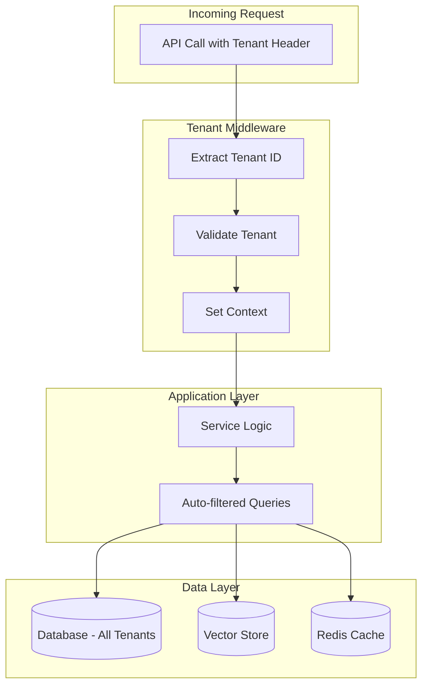

<!-- markdownlint-disable MD046 -->

**Multi-Tenancy** is an architectural pattern that allows a single instance of the application to serve **multiple customers (tenants)** while keeping their data completely isolated. It is fundamental for **SaaS** applications where different customers share infrastructure but must have separate data.

!!! info "When Multi-Tenancy is Needed"
    - **SaaS Products**: Each customer has their own isolated data space
    - **Enterprise**: Separate business divisions on the same system
    - **White-Label**: Partners using the system with their own branding
    - **Compliance**: Regulatory requirements demanding data separation (e.g., GDPR, HIPAA)

---

## Architecture

The framework implements Multi-Tenancy at the **application level** (not schema-per-tenant), ensuring isolation via automatic context propagation:


```mermaid
flowchart TD
    subgraph Request["Incoming Request"]
        R1[API Call with Tenant Header]
    end

    subgraph Middleware["Tenant Middleware"]
        M1[Extract Tenant ID]
        M2[Validate Tenant]
        M3[Set Context]
    end

    subgraph Application["Application Layer"]
        A1[Service Logic]
        A2[Auto-filtered Queries]
    end

    subgraph Storage["Data Layer"]
        D1[(Database - All Tenants)]
        D2[(Vector Store)]
        D3[(Redis Cache)]
    end

    R1 --> M1 --> M2 --> M3 --> A1
    A1 --> A2
    A2 --> D1
    A2 --> D2
    A2 --> D3
```

**Benefits of this approach:**

| Aspect          | Benefit                                       |
| --------------- | --------------------------------------------- |
| **Simplicity**  | Single database, single schema                |
| **Scalability** | Easy to add new tenants                       |
| **Costs**       | Shared infrastructure, lower costs            |
| **Maintenance** | Updates applied to all tenants simultaneously |

---

## Context Propagation

The core of the system is the **tenant context**, which automatically propagates the tenant identifier through the entire application stack.

### How It Works

For **HTTP requests**, the tenant context is derived by `TenantMiddleware`
(`core/middleware/tenant.py`, a pure-ASGI middleware) from the authenticated
user. The flow is:

1. The auth layer populates the request user (`scope['user']` / `request.state.user`) as an `AuthUser`. Route dependencies such as `require_user` / `require_admin` (exported from `core.middleware`) enforce authentication.
2. `TenantMiddleware` reads that `AuthUser` and calls `set_tenant_context(user.tenant_id)`, falling back to `"default"` if no `AuthUser` is present. The token is retained for cleanup, and `tenant_id` is bound to structlog. It **also** binds the authenticated user id via `set_user_context(user.user_id)` — identity-derived, never a client header — so plugins can resolve a per-user tenant (see [Per-plugin tenancy](#per-plugin-tenancy-personal-vs-shared)). `SecurityManager` (`core/middleware/security.py`) binds the same pair on the auth path.
3. The route handler and all downstream code see the correct `tenant_id` via `get_current_tenant_id()` and the user id via `get_current_user_id()`.
4. `TenantMiddleware` calls `reset_tenant_context(token)` (and `reset_user_context(...)`) in its `finally` block.

For **background tasks and scripts**, you must set the context explicitly (see Troubleshooting below).

When a request arrives with a valid token, the auth layer extracts the tenant ID from the authenticated user and sets it in the asynchronous context. Tenant-aware components (such as `SemanticLLMCache`, which partitions its entries by `get_tenant_or_default()`) then key off the current context.

There is **no** general-purpose context-manager helper for an arbitrary tenant. `core/context.py` exposes `set_tenant_context()` (which returns a token), `reset_tenant_context(token)`, `get_current_tenant_id()` and `tenant_is_bound()` — plus the parallel `set_user_context()` / `reset_user_context(token)` / `get_current_user_id()` for the authenticated **user** id. Set the context at the entry point and reset it with the returned token in a `finally` block:

```python
from core.context import set_tenant_context, reset_tenant_context, get_current_tenant_id

# Set the tenant at the start of the request/task
token = set_tenant_context("tenant-123")
try:
    # Tenant-aware components read the current context

    # Verify current tenant (useful for debugging)
    tenant_id = get_current_tenant_id()  # "tenant-123"

    # Tenant-partitioned semantic cache reads/writes under this tenant
    result = await semantic_cache.get(prompt)
finally:
    reset_tenant_context(token)
```

#### "Is a tenant bound at all?" — `tenant_is_bound()`

`core/context.py` also exposes `tenant_is_bound() -> bool`, the public answer to
"did someone upstream actually say which tenant this work belongs to?".

`get_current_tenant_id()` cannot answer it: it conflates *unbound* with the
`"default"` fallback unless `strict_tenant_isolation` happens to be on.

```python
from core.context import get_current_tenant_id, tenant_is_bound

# With STRICT_TENANT_ISOLATION off and nothing bound upstream:
tenant_is_bound()          # False  — nobody said
get_current_tenant_id()    # "default"  — indistinguishable from a real tenant
```

Code that must fail closed **regardless of that unrelated switch** asks
`tenant_is_bound()` instead of reaching into the module-private contextvar. The
in-tree example is row-level security binding the DB session
(`core/db/connection.py`): with `DB_RLS_ENABLED=true` and no tenant bound it
raises `TenantContextError` rather than silently binding `app.tenant_id` to
`"default"` and serving another tenant's rows.

!!! warning "Manual data-layer filtering"
    The data layer uses raw SQL (psycopg), not an ORM with automatic query
    rewriting. Repository queries that must be tenant-scoped include an explicit
    `WHERE tenant_id = %s` clause (see `core/db/feedback.py`,
    `core/db/documents.py`). `get_current_tenant_id()` is the source of truth for
    the value to filter on. Fully automatic, framework-wide query/cache/vector
    filtering is a **Roadmap** item, not a current guarantee.

### Usage in Your Handlers

If you are developing a plugin, the tenant context is already set when your code executes (the auth layer set it for the request):

```python
from core.context import get_current_tenant_id

class MyPluginHandler(FlowHandler):
    async def handle(self, query: str, context: dict) -> dict:
        # Tenant is already available
        tenant = get_current_tenant_id()

        # Use for specific business logic
        if tenant == "premium-client":
            return await self.premium_processing(query)
        return await self.standard_processing(query)
```

---

## Per-plugin tenancy (personal vs shared)

A single deployment can mix tenancy models **per plugin**. A plugin declares its
model in its manifest:

```yaml title="plugins/my-plugin/manifest.yaml"
tenancy: personal        # "shared" (default) | "personal"
```

| Mode                  | Scope key                                              | Use it for                                             |
| --------------------- | ----------------------------------------------------- | ------------------------------------------------------ |
| `shared` *(default)*  | the deployment-derived tenant (`get_current_tenant_id()`) | classic SaaS — many users share one tenant's data      |
| `personal`            | the authenticated **user** id (1 user = 1 tenant)     | per-user private data even on a shared deployment       |

The key insight: `personal` keys off the **bound user identity**, never a
request header — so it is as forgery-resistant as the tenant context. This is
what lets, say, a personal-notes plugin give every user a private silo while the
rest of the deployment stays single-tenant.

### Resolving the key

A plugin must never call `get_current_tenant_id()` directly for storage scoping —
that ignores its declared mode. Instead call `Plugin.tenant_key()`, which honours
the manifest:

```python
class MyPlugin(Plugin):
    async def handle(self, query: str, context: dict) -> dict:
        # Honours manifest `tenancy`: per-user for "personal", per-deployment
        # for "shared". Use this value in WHERE tenant_id = … / namespaces / paths.
        scope = self.tenant_key()
        await cursor.execute(
            "SELECT * FROM notes WHERE tenant_id = %s", (scope,)
        )
```

Under the hood `tenant_key()` delegates to `core.context.resolve_plugin_tenant(mode)`:

- `"personal"` → `get_current_user_id()` when a user is bound; otherwise it falls
  back to `get_tenant_or_default()` (the non-raising deployment tenant) so
  background tasks and scripts still get a stable, non-raising key.
- anything else (`"shared"`) → the deployment-derived tenant via
  `get_tenant_or_default()`.

#### Store-layer code with no `Plugin` self

`tenant_key()` is an instance method, so store/repository code that scopes a
plugin's persistence but has no `self` to call it on cannot use it. Reaching for
`get_current_tenant_id()` there would silently ignore the plugin's declared mode
**and** any runtime override. Use the store-layer counterpart instead:

```python
from core.context import resolve_plugin_tenant_key

scope = resolve_plugin_tenant_key("my-plugin", declared_mode)  # declared_mode defaults to "shared"
await cursor.execute("SELECT * FROM notes WHERE tenant_id = %s", (scope,))
```

It runs the same resolution as `tenant_key()` — effective mode (manifest +
override) → identity-derived tenant. For `shared` with no override it is exactly
`get_tenant_or_default()`, so swapping it in is behaviour-preserving. The
`system`-plugin override-exemption lives at the `Plugin` chokepoint and is **not**
re-checked here (a store belongs to a non-system plugin), so system plugins must
not use it to bypass that.

!!! warning "`personal` data still lives in the shared tables"
    `tenancy: personal` changes only the **value** written to `tenant_id`, not the
    storage backend. Per-user rows coexist with shared-tenant rows in the same
    tables, isolated solely by the scope key. `purge_tenant_data(user_id)` therefore
    erases a `personal` user's data exactly as it would a tenant's.

### Overriding the declared mode at runtime

A plugin's `tenancy:` is a *default*, not a hard binding. The framework exposes a
registration **seam** so an override source can flip a plugin's effective mode —
`shared` ↔ `personal` — at runtime, without editing the manifest or re-packaging.
The seam lives in core while the override source stays in plugin land, so the
Sacred-Core boundary is never crossed:

```python
from core.context import set_plugin_tenancy_resolver

# An admin-facing plugin registers a resolver at activation.
# resolver(plugin_name) -> "shared" | "personal" to override, or None to inherit.
set_plugin_tenancy_resolver(my_override_lookup)
```

`Plugin.tenant_key()` resolves the effective mode through
`core.context.resolve_plugin_tenancy_mode(plugin_name, declared)`:

- **No resolver registered** → the declared manifest mode is used verbatim, so a
  deployment that never registers one behaves exactly as before (zero behaviour
  change).
- A resolver that returns `None`, an unknown value, or raises → degrades to the
  declared mode. An override-source outage can never break or silently re-scope a
  plugin's storage.

!!! danger "System plugins are exempt — their tenancy is locked"
    A plugin marked `system: true` (platform infrastructure) can **never** be
    overridden: `tenant_key()` short-circuits to the declared mode for system
    plugins, so even a stray override entry cannot re-scope them. Re-scoping an
    infrastructure plugin — e.g. the identity/tenancy source itself — would
    fracture isolation system-wide, so the exemption is a hard core invariant.

!!! warning "Switching mode is not a data migration"
    Changing a plugin's effective tenancy only changes the key that *new* reads
    and writes use. Existing rows stay under their previous `tenant_id` and may
    become invisible under the new mode (e.g. `shared` → `personal` hides the
    org's rows from every user). Prefer setting the mode **before** a plugin
    accumulates data.

---

## Resource Isolation

### Database (PostgreSQL)

The data layer uses raw SQL via `psycopg`. Tenant-scoped queries include an
explicit `tenant_id` filter sourced from the current context. There is no ORM and
no automatic query rewriting:

```python
from core.context import get_current_tenant_id

# Tenant-scoped query (see core/db/feedback.py, core/db/documents.py)
tenant_id = get_current_tenant_id()
await cursor.execute(
    "SELECT * FROM chat_feedback WHERE tenant_id = %s",
    (tenant_id,),
)
```

The core interaction store (`core/storage/postgres.py`) carries a `tenant_id`
column on `interactions` and `feedback` (DEFAULT `'default'` for backward
compatibility) and scopes every read/write to `get_current_tenant_id()`.

!!! info "Roadmap: automatic query filtering"
    Transparent, framework-wide injection of the `tenant_id` filter into every
    query (and a corresponding cross-tenant admin escape hatch) is planned but
    **not yet implemented**. Today, application-level tenant scoping is the
    responsibility of each repository query.

#### Defense-in-depth: Row-Level Security

Application-level scoping has one failure mode: a forgotten `WHERE tenant_id = %s`
is a cross-tenant read, and nothing catches it. Row-level security moves the
predicate into Postgres, where it cannot be forgotten.

Two halves have to be in place, and a third to make them bite.

**1. The session binding.** `DB_RLS_ENABLED=true` binds the request's tenant to
the DB session on every pool checkout
(`SELECT set_config('app.tenant_id', …, false)`). The flag is OFF by default and
a strict no-op when off — the connection path is byte-identical.

Outside a request (background task, script) the tenant contextvar may be unset,
and what that means depends on the flag:

| `DB_RLS_ENABLED` | Unbound caller | Why |
| --- | --- | --- |
| off | Binds `"default"`, exactly as before | Nothing downstream reads `app.tenant_id` for access control, so a missing context must not break the caller. |
| **on** | **Raises `TenantContextError`** | `"default"` would be the worst possible answer: every policy would then match the `default` tenant's rows, so an unbound background job reads and writes another tenant's data *while the database reports that isolation is enforced*. |

The check asks `tenant_is_bound()`, not what `get_current_tenant_id()` resolves
to, so it fails closed regardless of `strict_tenant_isolation`
(`core/db/connection.py`). Work that legitimately runs outside a request declares
itself with [`system_tenant_scope()`](#system-tenant-scope) instead.

**2. The policies.** `migrations/versions/008_row_level_security.py` enables RLS
and creates a `tenant_isolation` policy on every tenant-scoped table;
`009_tool_invocations.py` adds the same policy to the table it creates, and
`010_system_tenant_rls_exemption.py` widens the predicate across all seven. The
current list — `interactions`, `feedback`, `chat_feedback`, `agent_patterns`,
`a2a_tasks`, `agent_checkpoints`, `tool_invocations` — lives in
`core.db.ddl.RLS_PROTECTED_TABLES`.

The policy is symmetric: for an ordinary tenant a row is visible, **and may be
written**, only when its `tenant_id` equals the session's. So a cross-tenant
`INSERT` or an `UPDATE` that moves a row to another tenant is refused, not
silently hidden. The one exemption is the maintenance identity — see
[migration 010](#system-tenant-scope) below.

**3. A role that RLS applies to.** This is the step that is easy to miss.
Postgres exempts three kinds of session from row-level security: a
**superuser**, a role carrying **`BYPASSRLS`**, and the **table owner** (unless
the table is set to `FORCE ROW LEVEL SECURITY`). The default single-role
deployment is all three — `POSTGRES_USER` in the compose stack is a superuser
that owns every table — so the policies are inert until the deployment separates
the roles:

```sql
-- run once, as the owner
CREATE ROLE baselith_runtime LOGIN PASSWORD '…' NOSUPERUSER NOBYPASSRLS;
GRANT USAGE ON SCHEMA public TO baselith_runtime;
GRANT SELECT, INSERT, UPDATE, DELETE ON ALL TABLES IN SCHEMA public
    TO baselith_runtime;
ALTER DEFAULT PRIVILEGES IN SCHEMA public
    GRANT SELECT, INSERT, UPDATE, DELETE ON TABLES TO baselith_runtime;
```

Then point the application at the new role (`DB_USER`/`DB_PASSWORD`) and keep
running migrations as the owner. `GRANT USAGE ON SCHEMA` is not optional: a role
without it cannot resolve a table name at all, and Postgres reports
`relation "…" does not exist` rather than a permission error.

`FORCE ROW LEVEL SECURITY` is deliberately not set by the migration. It would
apply the policy to the owner too, and a background job running without a bound
tenant would silently stop seeing its rows — a deployment decision, not
something a migration should impose.

`tests/integration/test_rls_tenant_isolation.py` proves the policy under exactly
this setup: it creates a least-privilege role and asserts that a tenant sees only
its own rows, that a query with no `WHERE tenant_id` still isolates, that a
cross-tenant write is refused, and that an unbound session sees nothing.

##### The deployment cannot get step 3 silently wrong any more

Steps 1 and 2 fail loudly when they are missing. Step 3 used to fail *silently*:
every policy in place, `DB_RLS_ENABLED=true` in the config, and a role every one
of those policies skips. Nothing in the logs, nothing in a health check, and a
console that reports isolation is on.

`core/db/rls_posture.py` reads the three exemptions back from the catalogs at
startup whenever `DB_RLS_ENABLED` is on — the role's `rolsuper` and
`rolbypassrls`, and whether it owns a protected table that lacks
`FORCE ROW LEVEL SECURITY` — plus whether the policies are enabled at all. In
**production** a bypass **refuses the boot**, naming every reason at once and
the remediation; elsewhere it logs at ERROR.
`BASELITH_ALLOW_RLS_BYPASS=true` is the auditable opt-out for a deployment that
knows why (a single-tenant install that wants the GUC and nothing else).

##### Provisioning the role

Two supported paths, both idempotent and both keeping DDL with the owner:

=== "Kubernetes (Helm)"

    ```yaml
    database:
      runtimeRole:
        enabled: true
        name: baselith_runtime
        adminSecret:
          name: postgres-superuser   # owner credential, used only by the Job
    config:
      DB_USER: baselith_runtime
      DB_RLS_ENABLED: "true"
    ```

    A `pre-install,pre-upgrade` Job runs **after** the migration Job, so the
    `GRANT`s cover the tables that exist and `ALTER DEFAULT PRIVILEGES` covers
    every table a later migration adds. Re-running it repairs a role whose
    attributes drifted. The role's password comes from the same
    `DB_PASSWORD` the app authenticates with, so provisioning and connecting
    cannot disagree, and neither credential ever reaches a command line.

    **Plugins build their schema at deploy time too.** Set
    `database.pluginSchemaInit.enabled` alongside: a Job runs
    `baselith plugin schema-init` as the owner, after the migrations and after
    the role exists, and only then does Helm apply the Deployment. Without it
    a plugin that creates its tables from the serving process fails with
    `permission denied for schema public` — or, once granted that, with
    `must be owner of table …`, which no grant fixes, because ownership is not
    a privilege. And a plugin that *did* own its tables would be exempt from
    their policies, which is the failure this whole arrangement exists to
    prevent.

=== "Docker Compose"

    ```bash
    # in .env, before the FIRST `up` of a new volume
    DB_RUNTIME_USER=baselith_runtime
    DB_RUNTIME_PASSWORD=<a strong, distinct password>

    docker compose -f compose.prod.yaml -f compose.rls.yaml up -d
    ```

    `deploy/postgres/initdb/10-runtime-role.sh` runs from the postgres image's
    entrypoint, which executes `/docker-entrypoint-initdb.d/*` **only on a
    fresh data directory** — an existing volume never sees it, so provision the
    role by hand there with the SQL above.

#### Out-of-request work: `system_tenant_scope()` {#system-tenant-scope}

Not everything that touches Postgres belongs to a tenant. Under RLS an unbound
caller is refused (above), so work that legitimately runs outside a request has to
*say what it is* rather than be guessed at:

```python
from core.db.connection import system_tenant_scope

with system_tenant_scope():
    await run_maintenance()
```

It binds the tenant context to `SYSTEM_TENANT_ID` (`"system"`,
`core/db/session_setup.py`) for the whole block and restores the previous token on
exit, including when the body raises. It is a plain `contextmanager`, so it works
in sync and async code alike — `contextvars` propagate into awaited coroutines —
and because it binds the *tenant context* rather than just the DB session,
everything else that scopes by tenant (caches, memory, stores) sees the same
explicit identity instead of each falling back on its own.

Who uses it today:

| Caller | Work |
| --- | --- |
| `core/bootstrap/lazy_init.py`, `core/db/schema.py`, `core/api/startup_checks.py` | Boot and schema paths |
| `core/orchestration/checkpoint_postgres.py`, `core/a2a/task_store_postgres.py`, `core/prompts/store_postgres.py` | `initialize()` / DDL on first touch |
| `core/task_queue/worker.py` | Wraps job execution — but only when RLS is on |
| `core/cli/handlers.py` | CLI commands that read the database |
| `core/orchestration/recovery.py` | Crash-recovery and stale-run sweeps |
| `core/services/tenant/purge.py` | GDPR erasure — cross-tenant by construction |

Note what this is **not** for: it is schema, boot, maintenance and cross-tenant
work, never a shortcut for reading one tenant's data. A request path that has a
tenant must bind that tenant.

!!! info "Migration 010 grants the `system` tenant its exemption"
    `system_tenant_scope()` binds `app.tenant_id = 'system'`, and until migration
    010 that identity matched **nothing**: migrations 008/009 created
    `tenant_isolation` with the strict predicate
    `tenant_id = COALESCE(current_setting('app.tenant_id', true), 'default')`,
    symmetric in `USING` and `WITH CHECK`. Neither knew about the `system`
    tenant, which did not exist yet.

    `migrations/versions/010_system_tenant_rls_exemption.py` widens the predicate
    — it does not replace the policy. Same name, same permissive policy, same
    `COALESCE(..., 'default')` handling of an unset GUC, still no
    `FORCE ROW LEVEL SECURITY`:

    ```sql
    CREATE POLICY tenant_isolation ON <table>
      USING      (tenant_id = <session> OR <session> = 'system')
      WITH CHECK (tenant_id = <session> OR <session> = 'system');
    -- <session> = COALESCE(current_setting('app.tenant_id', true), 'default')
    ```

    It covers all **seven** protected tables (008's six plus `tool_invocations`
    from 009 — the union is `core.db.ddl.RLS_PROTECTED_TABLES`), and
    `downgrade()` restores 008/009's predicate byte-identically, so the chain is
    reversible.

    **Ordinary tenants are unchanged.** The escape compares the *session*, not
    the row: for a session bound to `acme` the second disjunct is
    `'acme' = 'system'` — constant false — so the predicate reduces to
    `tenant_id = 'acme'` exactly as before, in `USING` **and** `WITH CHECK`. One
    tenant still cannot read or write another's rows.

    Why it is not a hole: `app.tenant_id` is set only by the pooled-checkout hook
    in `core/db/connection.py`, from the tenant contextvar — never from client
    input. What keeps a request from *asking* to be `system` is a check, not an
    accident of wiring; see
    [Reserved tenant ids](#reserved-tenant-ids) below.

    A deployment wanting a harder boundary still has the two levers above: deny
    the runtime role the maintenance path, or run maintenance under a separate
    role.

    Like 008, this is **inert in the default single-role deployment** — Postgres
    does not apply RLS to a table's owner — so it only matters once you have
    taken step 3.

!!! warning "This reverses the `WITH CHECK` advice this page used to give"
    An earlier revision of this page told operators to close the gap by hand and
    offered an Option A that deliberately kept `WITH CHECK` **strict**, on the
    reasoning that the maintenance identity should be able to read and delete
    across tenants but never *write* a row under a tenant it is not.

    **Migration 010 widens `WITH CHECK` too, and that published position was
    wrong.** The stale-run sweep in `core/orchestration/recovery.py` writes back
    through an `INSERT … ON CONFLICT DO UPDATE` that re-sends the run's own
    `tenant_id` (`'acme'`, not `'system'`), so a strict `WITH CHECK` refuses it.
    The two clauses cover different verbs and both are needed:

    | Clause | Verbs | Why the system tenant needs it |
    | --- | --- | --- |
    | `USING` | `SELECT`, and which rows `UPDATE`/`DELETE` can even see | A `DELETE` has no `WITH CHECK` at all, so a hidden row is not *refused* — it simply is not there and the statement reports `0`. That is how `purge_tenant_data()` returned a truthful zero that read as a successful GDPR erasure. |
    | `WITH CHECK` | `INSERT`, `UPDATE` | The recovery sweep's write-back re-sends a real tenant's id under the `system` session. |

    **If you applied Option A by hand, it is being superseded.** Migration 010
    issues `DROP POLICY IF EXISTS tenant_isolation` before creating its own, so a
    hand-applied policy of that name is replaced on upgrade — no error, no
    warning, and your narrower `WITH CHECK` is gone. That is the intended
    outcome; nothing is required of you beyond knowing it happened. A hand-rolled
    policy under a *different* name survives and will now be evaluated alongside
    010's — permissive policies are OR-ed, so an extra one can only widen access.
    Drop it.

    If you chose Option B instead (a separate `BYPASSRLS` maintenance role), it
    still works and 010 does not touch it. It remains blunter than the policy:
    `BYPASSRLS` exempts that role from RLS everywhere, while 010's escape is
    scoped to one GUC value the framework alone sets.

    Either way, verify on a staging copy: run a purge against a seeded tenant
    under the least-privilege role and assert the deleted row counts are
    non-zero. `tests/unit/test_system_tenant_rls_policy.py` pins the migration's
    shape (17 cases, including that `downgrade()` restores 008's predicate
    verbatim and that neither direction drops anything but the policy);
    `tests/integration/test_rls_tenant_isolation.py` proves the isolation itself
    against a real Postgres.

#### Reserved tenant ids {#reserved-tenant-ids}

`system` is not just a convention — it is a **reserved identity**, because
migration 010 gives it cross-tenant read and write. `core/context.py` names the
set and the predicate:

```python
from core.context import RESERVED_TENANT_IDS, ReservedTenantError, is_reserved_tenant

RESERVED_TENANT_IDS            # frozenset({"system"})
is_reserved_tenant("system")   # True
is_reserved_tenant("acme")     # False
```

`ReservedTenantError` (a `ValueError` subclass, so existing bad-input handlers
keep working) is raised where such an id would otherwise be **accepted** —
minting a token that asserts it, provisioning a tenant record for it.

##### Binding a principal-derived tenant

!!! danger "Code that binds a tenant from a principal MUST use `bind_principal_tenant()`"
    A tenant that came from a caller's identity — a JWT or OIDC claim, an API-key
    record, anything a request, connection or token asserted — is bound with
    `core.context.bind_principal_tenant()`, never the plain setter. It returns a
    `contextvars.Token` exactly like `set_tenant_context()`, so it is a drop-in,
    and it raises `ReservedTenantError` if the id is reserved.

    ```python
    from core.context import (
        ReservedTenantError,
        bind_principal_tenant,
        reset_tenant_context,
    )

    try:
        token = bind_principal_tenant(user.tenant_id)   # from a credential
    except ReservedTenantError:
        raise HTTPException(status_code=403, detail="Forbidden") from None
    try:
        ...
    finally:
        reset_tenant_context(token)
    ```

    Translate the refusal into your own surface's rejection — a 403, a closed
    socket — and **never fall back to binding it**.

The plain `set_tenant_context()` stays correct, and is not deprecated, for a
value the **framework itself owns**: the maintenance identity via
`system_tenant_scope()`, a job's enqueued metadata, an event record, a
checkpoint's stored tenant. That is why there is no blanket ban on the setter —
the distinction is where the value came from, not which function is safer.

Every write to the tenant contextvar is one of these eight sites. Only the first
two derive the value from a principal:

| Binding site | Value comes from | How it binds |
| --- | --- | --- |
| `core/middleware/tenant.py` (`TenantMiddleware`) | The authenticated `AuthUser` | `bind_principal_tenant()` → 403 on `ReservedTenantError` |
| `core/middleware/security.py` (`SecurityManager.enforce_auth`) | The authenticated `AuthUser`, for every `HTTPConnection` — **WebSockets included** | `bind_principal_tenant()` → 403 on `ReservedTenantError` |
| `core/task_queue/worker.py` | RQ job metadata | `set_tenant_context()` — framework-owned |
| `core/events/_dispatch.py`, `core/events/durable.py` | The event record | `set_tenant_context()` — framework-owned |
| `core/orchestration/recovery.py` | The checkpoint row's own `tenant_id` | `set_tenant_context()` — framework-owned |
| `core/services/tenant/purge.py` | The purge's target tenant, bound to count its rows | `set_tenant_context()` — framework-owned |
| `core/db/session_setup.py` | `system_tenant_scope()` itself | `set_tenant_context()` — this *is* the system binding |

Both middlewares call the helper rather than doing their own
`if is_reserved_tenant(...)` first, which matters for more than tidiness: **the
check-then-bind window is gone**, because the refusal happens *inside* the
binding call. A per-site check only protects the sites somebody remembered;
making the binding itself refuse also protects the ones nobody thought of —
including binding sites in another checkout that shares this `core`.

`enforce_auth` is the one worth naming explicitly: it binds for every
`HTTPConnection`, so it covers surfaces the pure-ASGI `TenantMiddleware` does not
reach in the same way — the chat WebSocket among them. Until this landed it was
the door through which a token claiming `tenant_id="system"` bound the privileged
identity for the whole connection.

Defence in depth sits one layer earlier, at **mint time**: the JWT issuer
(`core/auth/_jwt_issue.py`) raises `ReservedTenantError` rather than signing a
token that asserts a reserved tenant — for **access and refresh tokens alike**, so
a refresh cannot launder one in. The middleware checks are what protect a
deployment whose tokens come from somewhere else (a federated IdP, a token minted
before the check existed).

!!! note "Erasure cannot be silently blocked either"
    `purge_tenant_data()` no longer trusts a row count of zero. It counts the
    tenant's rows **as that tenant** before deleting them as `system`, and
    `assert_purge_visible()` raises `TenantPurgeBlockedError` when rows existed
    and none were removed — the signature of a policy hiding them. Both outcomes
    used to be `0` and indistinguishable. The error message names the remedy:
    apply migration 010, extend a hand-written policy on a plugin table, or grant
    the maintenance role `BYPASSRLS`.

    A blocked purge is **partial**, so the exception carries what actually
    happened: `TenantPurgeBlockedError.purged` is the `{table: rows_deleted}` map
    for the tables completed before the block — the same shape a successful call
    returns — and `.pending` lists the tables never attempted or deferred by the
    foreign-key fixpoint loop. An erasure that cleared four tables and stalled on
    the fifth is a different operational situation from one that cleared nothing,
    and a caller that can only report "it failed" forces someone to go and look.
    Re-running the purge after fixing the policy is safe: the deletes are
    idempotent.

#### CLI commands that deliberately run unbound

`baselith` wraps most commands in `system_tenant_scope()`, but not the ones that
are long-lived or touch no database (`core/cli/handlers.py`):

| Exemption | Members | Why |
| --- | --- | --- |
| `UNSCOPED_COMMANDS` | `init`, `run`, `test`, `lint`, `shell` | `init`/`test`/`lint` open no connection. `run` and `shell` are **long-lived processes**: binding `system` for their lifetime would turn the pool's fail-closed check into a no-op for every unbound query underneath. |
| `UNSCOPED_SUBCOMMANDS` | `("queue", "worker")` | Same argument as `run` — it blocks for the life of the process, and the worker already binds an identity per *unit of work*. Keyed on the pair because `baselith queue status` is an ordinary short command and stays scoped. |

!!! warning "`baselith shell` and `baselith queue worker` run unbound under RLS"
    That is the intended design — but it means a query you type into the REPL has
    no tenant bound, so with `DB_RLS_ENABLED=true` the pool refuses the checkout
    with `TenantContextError`. Bind one explicitly:

    ```python
    from core.context import set_tenant_context, reset_tenant_context

    token = set_tenant_context("acme")          # or the tenant you mean
    try:
        ...
    finally:
        reset_tenant_context(token)
    ```

    For maintenance work in the REPL, use `system_tenant_scope()` instead — and
    remember it now carries cross-tenant read **and** write.

#### Who creates the schema

Every Postgres table is owned by a migration. Four stores used to run
`CREATE TABLE IF NOT EXISTS` on the shared pool at first use, which forced the
runtime role to hold DDL privileges; `DB_RUNTIME_DDL` now gates that path. Unset,
it is allowed outside production and refused when `APP_ENV=production`, where the
migrations Job owns the schema. `tests/unit/test_schema_ownership.py` fails if a
module ever creates a Postgres table no migration creates.

Embedded SQLite stores (`core.privacy`, `core.incidents`, `core.compliance`,
`core.thirdparty`, the audit chain, the SQLite checkpoint store) are out of
scope — a single-file store has no migration job. So is the pgvector provider,
which creates one table per *collection* on demand.

### Vector Store (Qdrant)

When a repository constructs a vector search, it is expected to pass the tenant
filter explicitly using `get_current_tenant_id()`. Automatic, transparent
tenant filtering on every vector search is a **Roadmap** item.

### Cache (semantic LLM cache)

`SemanticLLMCache` (`core/cache/semantic_cache.py`) is tenant-partitioned: it
stores entries under `entries[tenant_id][prompt_hash]`, deriving `tenant_id` from
`get_tenant_or_default()`. Two tenants issuing the same prompt never share a cache
entry:

```python
# Internally, SemanticLLMCache keys by the current tenant context:
#   self._entries[get_tenant_or_default()][prompt_hash] = CacheEntry
```

The **exact** LLM response cache (`core/services/llm/_generation.py`) and the
Redis cache prefix (`core/optimization/caching.py`) partition the same way. All
three resolve the tenant *leniently* — see
[Namespacing is not a boundary](#namespacing-is-not-a-boundary).

!!! info "Roadmap: Redis keyspace prefixing & per-tenant flush"
    A Redis-backed cache with automatic per-tenant key prefixing and a
    `flush_tenant()`-style bulk eviction is planned. The in-process semantic
    cache partitions by tenant, but a transparent prefixed Redis keyspace and
    bulk per-tenant flush are not yet available.

---

## Isolation Guarantees

`core/tenancy` provides reusable enforcement so isolation does not depend on
each store re-implementing the check correctly.

### Cross-tenant guard

Any store or service that resolves a resource by id must verify the resource
belongs to the request's tenant **before acting** — a forgotten check is a
cross-tenant IDOR. Use the shared guard:

```python
from core.tenancy import tenants_match, require_tenant_match

# Predicate form — treat a mismatch as "not found" (don't leak existence):
if not tenants_match(resource.tenant_id):           # vs the active tenant context
    raise HTTPException(404)

# Or fail loudly at a choke point:
require_tenant_match(resource.tenant_id)             # raises CrossTenantError on mismatch
```

The webhook service uses this guard for delete/replay, so a `webhooks:write`
holder in one tenant cannot touch another tenant's endpoints or deliveries.

### Per-tenant encryption-at-rest

For fields that must be **cryptographically** isolated, derive a tenant-bound
key so data encrypted in one tenant's context cannot be decrypted in another's —
even with full database access. The tenant id is mixed into an HKDF expansion of
the operator's base key, on top of the AES-256-GCM
[field encryptor](../core-modules/security.md):

```python
from core.tenancy import tenant_field_encryptor

base_keys = {"k1": "operator-secret-or-base64-key"}
enc = tenant_field_encryptor(tenant_id, base_keys, active_key_id="k1")
token = enc.encrypt(value)        # bound to tenant_id
enc.decrypt(token)                # only succeeds in the same tenant's encryptor
```

A different tenant's encryptor fails the GCM authentication and raises
`DecryptionError`. Key ids (and therefore rotation) are preserved per tenant.

---

## Strict Mode

**Strict tenant isolation** (`AppConfig.strict_tenant_isolation`) is **on by
default** (`STRICT_TENANT_ISOLATION=true`). Set it to `false` only if you need
the permissive fallback:

```env
# default — no need to set it
STRICT_TENANT_ISOLATION=true

# permissive mode: missing context falls back to the "default" tenant
STRICT_TENANT_ISOLATION=false
```

In strict mode:

- ❌ Calling `get_current_tenant_id()` **without** a tenant context raises instead of falling back to `"default"`
- ❌ No implicit `"default"` tenant is returned
- ✅ Surfaces code paths that forgot to set the context

**Example error in strict mode:**

```python
from core.context import get_current_tenant_id

# Without tenant context, with the default strict_tenant_isolation=True
tenant_id = get_current_tenant_id()
# Raises: TenantContextError(
#     "Strict tenant isolation enabled: No tenant context found in current contextvar."
# )
```

!!! tip "Recommendation"
    Leave strict mode on in production; it is the default precisely so that a
    code path that forgot to set the tenant context fails loudly instead of
    silently reading or writing the `"default"` tenant.

### Namespacing is not a boundary

Strict mode is about *data*. A lookup that only builds a key prefix has no data
to protect, so it must not fail closed — otherwise a cache key prefix becomes a
hard dependency on request context and takes down the work it was caching for.
Two helpers, one rule:

| Call | Use for | No tenant bound |
|---|---|---|
| `get_current_tenant_id()` | data boundaries: rows, documents, graph nodes, per-tenant scratchpads | raises `TenantContextError` under strict isolation |
| `get_tenant_or_default()` | namespacing only: cache keys, cost ledger entries, metric labels | returns `"default"` |

In `core/`, the second group is the LLM response cache
(`core/services/llm/_generation.py`), the semantic cache
(`core/cache/semantic_cache.py`), the Redis cache prefix
(`core/optimization/caching.py`) and the cost ledger
(`core/quotas/cost_enforcement.py`): an entry is keyed by the prompt hash and
never read across prefixes, so an unbound caller shares the `"default"` bucket.

Apply the same rule in your own code. A failure in this group is easy to miss:
callers that degrade gracefully (falling back to a template, skipping the
cache) swallow the exception, and the only trace of it is a failed span in the
observability view — the feature silently stops using the LLM while the service
looks healthy.

---

## Management API

Tenants are managed through `TenantService` (`core/services/tenant/service.py`),
backed by the primary SQL database. Obtain the singleton via `get_tenant_service()`.
Protect admin routes with the auth manager's `require_auth({AuthRole.ADMIN})`
decorator.

### Create a Tenant

```python
from core.auth.types import AuthRole
from core.services.tenant.service import get_tenant_service

tenant_service = get_tenant_service()

@router.post("/admin/tenants")
@auth.require_auth({AuthRole.ADMIN})  # auth = AuthManager instance
async def create_tenant(tenant_id: str, name: str):
    """
    Register a new tenant in the system.

    Returns:
        Tenant (id, name, status, created_at)
    """
    return await tenant_service.create_tenant(tenant_id=tenant_id, name=name)
```

### List / Get Tenants

```python
@router.get("/admin/tenants")
@auth.require_auth({AuthRole.ADMIN})
async def list_tenants(limit: int = 100, offset: int = 0):
    return await tenant_service.list_tenants(limit=limit, offset=offset)

@router.get("/admin/tenants/{tenant_id}")
@auth.require_auth({AuthRole.ADMIN})
async def get_tenant(tenant_id: str):
    return await tenant_service.get_tenant(tenant_id)
```

`list_tenants` is **paginated, never unbounded**: the query always carries a
`LIMIT`/`OFFSET`, defaulting to `DEFAULT_TENANT_PAGE_SIZE` (100) and clamped to
`MAX_TENANT_PAGE_SIZE` (500). The tenants table grows with every onboarding, so
an unbounded `SELECT` would eventually materialize the whole directory into
memory on a single admin request; callers that need every row page through with
`offset`. The bundled `GET /admin/tenants` endpoint exposes `limit` and
`offset` as query parameters with the same bounds.

### Per-tenant usage quotas

A tenant carries an **aggregate request budget** across all its members, enforced
independently of (and on top of) per-identity quotas. `QuotaMiddleware` consumes
one unit from both the caller's identity budget and their tenant's budget on every
authenticated request, rejecting with `429` when either window is exhausted.

```python
from core.config.quotas import set_tenant_quota

# Tenant plan: 1M requests/day, 20M/month (aggregate across all members)
set_tenant_quota("tenant-123", daily=1_000_000, monthly=20_000_000)
```

Defaults apply to every tenant via `QUOTA_TENANT_DAILY_REQUESTS` /
`QUOTA_TENANT_MONTHLY_REQUESTS`; `None`/`0` means unlimited. See the
[Usage Quotas](../core-modules/quotas.md) module for the full enforcement model.

!!! info "Roadmap: storage & feature-flag quotas"
    Aggregate request budgets ship today. Per-tenant storage, vector-document
    quotas, and feature flags on the `Tenant` model itself remain planned.

### Tenant data purge (GDPR)

`purge_tenant_data(tenant_id)` (`core/services/tenant/purge.py`) deletes every row
scoped to a tenant across **all** public tables carrying a `tenant_id` column —
core (`interactions`, `feedback`) and any plugin store. The table set is discovered
dynamically from `information_schema`, and foreign-key ordering is resolved by a
fixpoint retry loop, so no hand-maintained table list can drift:

```python
from core.services.tenant import purge_tenant_data

deleted = await purge_tenant_data("tenant-123")  # {table: rows_deleted}
```

It is idempotent and covers tenant-scoped data only — the tenant entity row
itself is owned by `TenantService` (`core/services/tenant/service.py`).

---

## Testing Multi-Tenancy

When writing tests, ensure you verify isolation:

```python
import pytest
from core.context import set_tenant_context, reset_tenant_context

@pytest.mark.asyncio
async def test_tenant_isolation():
    # Create data for tenant A
    token = set_tenant_context("tenant-a")
    try:
        await repository.create(Item(name="A Item"))
    finally:
        reset_tenant_context(token)

    # Create data for tenant B
    token = set_tenant_context("tenant-b")
    try:
        await repository.create(Item(name="B Item"))
    finally:
        reset_tenant_context(token)

    # Verify isolation
    token = set_tenant_context("tenant-a")
    try:
        items = await repository.get_all()
        assert len(items) == 1
        assert items[0].name == "A Item"
    finally:
        reset_tenant_context(token)

    token = set_tenant_context("tenant-b")
    try:
        items = await repository.get_all()
        assert len(items) == 1
        assert items[0].name == "B Item"
    finally:
        reset_tenant_context(token)
```

---

## Troubleshooting

### "TenantContextError" (strict isolation, or RLS)

**Problem:** You receive a `TenantContextError`.

**Cause:** Two different switches raise it, and the message tells you which:

| Raised from | Switch | Meaning |
| --- | --- | --- |
| `get_current_tenant_id()` | `strict_tenant_isolation` | Code is running outside an HTTP request (background task, script) without setting the tenant first. |
| A **pool checkout** (`core/db/connection.py`) | `DB_RLS_ENABLED=true` | No tenant is bound, so `app.tenant_id` cannot be set. Raised regardless of `strict_tenant_isolation`, and the message names `system_tenant_scope()`. |

For the second, the fix is usually not to invent a tenant: if the work is boot,
schema, maintenance or cross-tenant, wrap it in
[`system_tenant_scope()`](#system-tenant-scope). Bind a real tenant only when the
work genuinely belongs to one.

**Solution (first case):** bind the tenant at the entry point of the task and restore it
after — `contextvars` do not cross task boundaries on their own, so setting it
once at startup does not cover a consumer loop started later:

```python
from core.context import set_tenant_context, reset_tenant_context

async def background_task(tenant_id: str):
    token = set_tenant_context(tenant_id)
    try:
        # Your code here
        await process_data()
    finally:
        reset_tenant_context(token)
```

The framework already binds at every chokepoint it owns
(`core/middleware/tenant.py`, `core/task_queue/worker.py`,
`core/events/durable.py`); a plugin that starts its own producer or consumer
task owns the same responsibility.

If the raising call is only building a cache key or a metric label, the fix is
the other way round — use `get_tenant_or_default()`, see
[Namespacing is not a boundary](#namespacing-is-not-a-boundary).

### One tenant's data visible to another

**Problem:** Queries returning cross-tenant data.

**Cause:** You are likely using raw SQL or bypassing the ORM.

**Solution:** Always use framework-provided repositories, or ensure you include the filter:

```python
# ❌ Don't do this
results = session.execute(text("SELECT * FROM items"))

# ✅ Do this instead
results = await item_repository.get_all()  # Auto-filtered
```

---

## Best Practices

!!! tip "Tenant Identification"
    Use UUIDs to identify tenants, never persistent or sequential values.

!!! tip "Logging"
    Always include `tenant_id` in logs to facilitate debugging:
    ```python
    logger.info("Processing", tenant_id=get_current_tenant_id())
    ```

!!! warning "Backup"
    Backups are cross-tenant. Implement per-tenant export if required for compliance.
