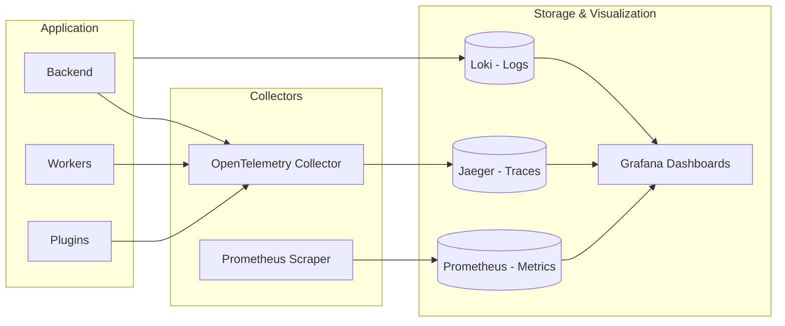

<!-- markdownlint-disable-file MD046 -->

<!-- markdownlint-disable MD046 -->
**Observability** is the ability to understand the internal state of a system by analyzing its outputs. In BaselithCore, observability is **fundamental** for debugging, performance tuning, and incident response.

!!! info "The Three Pillars of Observability"
    Modern observability is built on three complementary pillars:

    1. **Logs**: Discrete events with timestamps (the "what happened")
    2. **Metrics**: Numerical measurements aggregated over time (the "how much")
    3. **Traces**: Request paths through distributed services (the "where and how")

---

## Observability Architecture

The framework integrates a complete observability stack:



| Component   | Technology             | Function                            |
| ----------- | ---------------------- | ----------------------------------- |
| **Tracing** | OpenTelemetry + Jaeger | Distributed request tracing         |
| **Metrics** | Prometheus + Grafana   | Numerical metrics and dashboards    |
| **Logging** | structlog + Loki       | Structured and searchable JSON logs |

---

## Distributed Tracing

Tracing allows you to follow a request as it traverses multiple system components. It is essential for understanding latency, bottlenecks, and errors in distributed systems.

### Why Tracing is Important

In BaselithCore, a single request can:

1. Pass through the orchestrator
2. Be forwarded to a specialized agent
3. Call the LLM service
4. Query the vector store
5. Save to cache

**Without tracing**, an error or slowdown requires hours of manual log analysis. **With tracing**, you immediately see where time is being spent.

### Implementation in Code

```python
from core.observability import get_tracer

# Create a tracer for your module/plugin
tracer = get_tracer("my-plugin")

async def my_operation(data: dict):
    # Start a span for this operation
    with tracer.start_span("process_data") as span:
        # Add useful attributes for debugging
        span.set_attribute("data_size", len(data))
        span.set_attribute("tenant_id", get_current_tenant())
        
        # Operations automatically traced within the span
        processed = await transform_data(data)
        
        # Nested spans for internal operations
        with tracer.start_span("llm_call") as llm_span:
            llm_span.set_attribute("model", "gpt-4")
            result = await llm.generate(processed)
            llm_span.set_attribute("tokens_used", result.tokens)
        
        span.set_attribute("result_count", len(result))
        return result
```

### How to Read a Trace in Jaeger

When you open the Jaeger UI (`http://localhost:16686`), you will see:

1. **Service Dropdown**: Select the service (e.g., `backend`, `my-plugin`)
2. **Operation Dropdown**: Filter by specific operation
3. **Timeline View**: Visualize the duration of each span

**Common interpretation:**

- Very long spans = slow operations (likely LLM or DB)
- Gaps between spans = I/O time or waiting
- Red spans = errors

### Configuration

```env
# Enable tracing
ENABLE_TRACING=true

# OpenTelemetry Collector or Direct Jaeger Endpoint
OTEL_EXPORTER_OTLP_ENDPOINT=http://localhost:4317

# Service Name (appears in Jaeger)
OTEL_SERVICE_NAME=baselith-backend
```

**Start Jaeger (Development):**

```bash
docker run -d --name jaeger \
  -p 16686:16686 \
  -p 4317:4317 \
  jaegertracing/all-in-one:latest
```

Access UI: `http://localhost:16686`

---

## Metrics

Metrics are numerical values aggregated over time. They are ideal for monitoring trends, alerting, and capacity planning.

### Metric Types

| Type          | Use                 | Example            |
| ------------- | ------------------- | ------------------ |
| **Counter**   | Cumulative count    | Total requests     |
| **Gauge**     | Instantaneous value | Active connections |
| **Histogram** | Value distribution  | Request latency    |

### Creating Custom Metrics

```python
from core.observability import create_counter, create_histogram, create_gauge

# Counter: increments monotonically
request_counter = create_counter(
    name="my_plugin_requests_total",
    description="Total requests processed by my plugin",
    labels=["endpoint", "status"]
)

# Histogram: distribution of values (e.g., latencies)
latency_histogram = create_histogram(
    name="my_plugin_latency_seconds",
    description="Request latency in seconds",
    labels=["operation"],
    buckets=[0.01, 0.05, 0.1, 0.5, 1.0, 5.0]  # Custom buckets
)

# Gauge: value that goes up and down
active_connections = create_gauge(
    name="my_plugin_active_connections",
    description="Current number of active connections"
)

# Usage
async def handle_request(endpoint: str):
    active_connections.inc()  # Connection open
    
    start_time = time.time()
    try:
        result = await process()
        request_counter.labels(endpoint=endpoint, status="success").inc()
        return result
    except Exception:
        request_counter.labels(endpoint=endpoint, status="error").inc()
        raise
    finally:
        duration = time.time() - start_time
        latency_histogram.labels(operation=endpoint).observe(duration)
        active_connections.dec()  # Connection closed
```

### Prometheus Endpoint

Metrics are exposed automatically:

```bash
curl http://localhost:8000/metrics
```

**Example Output:**

```text
# HELP my_plugin_requests_total Total requests processed by my plugin
# TYPE my_plugin_requests_total counter
my_plugin_requests_total{endpoint="/api/chat",status="success"} 1247
my_plugin_requests_total{endpoint="/api/chat",status="error"} 23

# HELP my_plugin_latency_seconds Request latency in seconds
# TYPE my_plugin_latency_seconds histogram
my_plugin_latency_seconds_bucket{operation="/api/chat",le="0.1"} 812
my_plugin_latency_seconds_bucket{operation="/api/chat",le="0.5"} 1180
my_plugin_latency_seconds_bucket{operation="/api/chat",le="+Inf"} 1270
my_plugin_latency_seconds_sum{operation="/api/chat"} 312.45
my_plugin_latency_seconds_count{operation="/api/chat"} 1270
```

### Grafana Dashboard

Configure Prometheus as a data source in Grafana and use PromQL queries:

```promql
# Request rate per second (last 5 minutes)
rate(my_plugin_requests_total[5m])

# p95 Latency
histogram_quantile(0.95, rate(my_plugin_latency_seconds_bucket[5m]))

# Error rate
sum(rate(my_plugin_requests_total{status="error"}[5m])) / sum(rate(my_plugin_requests_total[5m]))
```

---

## Structured Logging

BaselithCore transforms standard logging into a powerful diagnostic tool. By using structured JSON in production and enhanced, colorized output in development, you gain immediate clarity into system behavior.

### Unified Logging Pipeline

The framework automatically unifies all system logs. Whether a message comes from your plugin, the core orchestrator, or third-party libraries like **Uvicorn**, it will be processed through the same pipeline, enriched with the same metadata, and rendered with the same professional style.

### Creating a Logger

Always use the framework-specific `get_logger` function. This ensures your logs are correctly integrated into the unified pipeline.

```python
from core.observability import get_logger

# Create logger with module name
logger = get_logger(__name__)

# Log with structured context
logger.info(
    "Processing request",
    user_id="user-456",
    action="chat_completion"
)
```

### Enhanced Development Output

In development mode (`LOG_FORMAT=text`), BaselithCore integrates with **Rich** to provide:

- **Color-coded levels**: Immediate visual distinction between INFO, WARNING, and ERROR.
- **Prettified Tracebacks**: Deeply readable error reports with syntax highlighting.
- **Consistent Timestamps**: Clean, human-readable time formats.
- **Automatic Alignment**: Aligned log messages and metadata for better scanning.

### Log Context Binding

Use `bind_context` to automatically add metadata to every log message within a specific scope (e.g., a function or a request).

```python
from core.observability.logging import bind_context

async def process_user_data(user_id: str):
    with bind_context(user_id=user_id):
        # All logs inside this block will automatically include 'user_id'
        logger.info("Starting process") 
        await execute_logic()
        logger.info("Process complete")
```

### JSON Output

Logs are emitted in structured JSON format:

```json
{
  "timestamp": "2024-01-20T10:30:00.123456Z",
  "level": "info",
  "message": "Processing request",
  "request_id": "abc123",
  "user_id": "user-456",
  "tenant_id": "tenant-789",
  "action": "chat_completion",
  "service": "my-plugin",
  "trace_id": "abc123def456"
}
```

**Advantages:**

- Easily indexed by systems like Elasticsearch or Loki
- Correlatable with trace_id
- Filterable by specific field

### Log Levels

| Level      | When to Use                       |
| ---------- | --------------------------------- |
| `DEBUG`    | Technical details for development |
| `INFO`     | Normal business flow events       |
| `WARNING`  | Anomalous situations but handled  |
| `ERROR`    | Errors impacting functionality    |
| `CRITICAL` | System non-operational            |

---

## Custom Configuration via YAML

For advanced scenarios where you need granular control over the underlying logging engine (Uvicorn, FastAPI, and standard library loggers), BaselithCore supports a standalone YAML configuration file.

### Using `log_config.yaml`

By placing a `log_config.yaml` file in your project root, you can override how the system handles different loggers. This is particularly useful for production environments where you might want to silence specific library noises or redirect certain levels to different handlers.

**Example `log_config.yaml`:**

```yaml
version: 1
disable_existing_loggers: false
formatters:
  structlog_formatter:
    format: '%(message)s'
handlers:
  console:
    class: logging.StreamHandler
    formatter: structlog_formatter
    stream: ext://sys.stdout
loggers:
  uvicorn:
    handlers: [console]
    level: INFO
    propagate: false
  uvicorn.error:
    level: INFO
  uvicorn.access:
    handlers: [console]
    level: WARNING
    propagate: false
root:
  level: INFO
  handlers: [console]
```

### Manual Usage with Uvicorn

If you are running the server manually via `uvicorn` instead of using the `baselith run` command, you can specify this configuration explicitly:

```bash
uvicorn backend:app --log-config log_config.yaml
```

!!! note "CLI Synchronization"
    The `baselith run` command uses the internal `get_log_config()` helper which is synchronized with your `.env` settings (`LOG_LEVEL` and `LOG_FORMAT`). `log_config.yaml` is reserved for manual overrides or complex custom deployments.
303:
304: ---
305:
306: ## Alerting

Configure alerts to be proactively notified of issues.

### Prometheus Alerting Rules

```yaml title="prometheus/alerts.yml"
groups:
  - name: baselith_core
    rules:
      # Alert if error rate exceeds 5%
      - alert: HighErrorRate
        expr: |
          sum(rate(http_requests_total{status=~"5.."}[5m])) 
          / sum(rate(http_requests_total[5m])) > 0.05
        for: 5m
        labels:
          severity: warning
        annotations:
          summary: "High error rate detected"
          description: "Error rate is {{ $value | humanizePercentage }}"
      
      # Alert if p95 latency exceeds 2 seconds
      - alert: HighLatency
        expr: |
          histogram_quantile(0.95, rate(http_request_duration_seconds_bucket[5m])) > 2
        for: 5m
        labels:
          severity: warning
        annotations:
          summary: "High latency detected"
```

### Notification Integration

Configure alertmanager to send notifications to:

- Slack
- PagerDuty
- Email
- Telegram

---

## Complete Configuration

```env title=".env"
# Logging
LOG_LEVEL=INFO          # DEBUG|INFO|WARNING|ERROR
LOG_FORMAT=json         # json|text

# Tracing
ENABLE_TRACING=true
OTEL_EXPORTER_OTLP_ENDPOINT=http://jaeger:4317
OTEL_SERVICE_NAME=baselith-backend

# Metrics
METRICS_ENABLED=true
METRICS_PORT=9090       # Port for /metrics endpoint
```

---

## Troubleshooting with Observability

### Problem: Slow Requests

1. **Open Jaeger** and search trace by request_id
2. **Identify the longest span** (usually LLM or DB)
3. **Check metrics** to confirm if it's a pattern
4. **Solution**: Cache, query optimization, or scaling

### Problem: Intermittent Errors

1. **Search logs** filtering by `level=error`
2. **Find the trace_id** in the log
3. **Open trace in Jaeger** to see full context
4. **Analyze spans** to understand the sequence of events

### Problem: Memory Leak

1. **Monitor gauge** `process_resident_memory_bytes`
2. **Create alert** if it grows beyond threshold
3. **Correlate with trace** to identify problematic operations

---

## Best Practices

!!! tip "Naming Conventions"
    Use consistent metric names:
    - `{service}_{component}_{metric}_total` for counters
    - `{service}_{component}_{metric}_seconds` for latencies

!!! tip "Label Cardinality"
    Avoid high cardinality labels (e.g., user_id in every metric). Use labels like `status`, `endpoint`, `method`.

!!! warning "Log Verbosity"
    In production use `LOG_LEVEL=WARNING` to reduce log volume. Tracing captures details anyway.

!!! tip "Correlation IDs"
    Always propagate `request_id` and `trace_id` to correlate logs, metrics, and traces of the same request.
