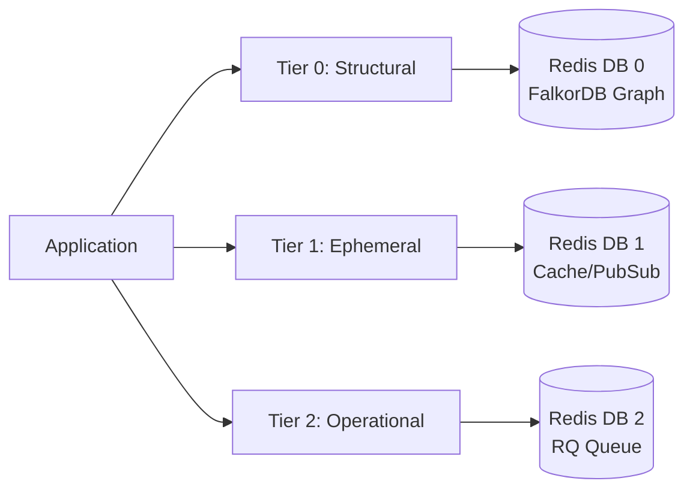

The system uses a **Unified Storage** architecture powered by **FalkorDB** (a Redis-compatible engine) to optimize resource usage and ensure logical isolation between different critical functionalities.

---

## The Problem

Instead of requiring multiple Redis instances, the system leverages **Database IDs** (0-15 standard) to segregate data based on persistence, volatility, and operational purpose.

---

## Tier Architecture (FalkorDB)



| Tier | Database ID | Logical Name | Main Purpose | Persistence |
|------|-------------|--------------|--------------|-------------|
| **Tier 0** | `0` | **Structural** | Knowledge Graph (**FalkorDB**) | High (Stateful) |
| **Tier 1** | `1` | **Ephemeral** | Caching, PubSub (Redis-compatible) | Low (Cache) |
| **Tier 2** | `2` | **Operational** | Task Queue (RQ) (Redis-compatible) | Medium (Transient) |

---

## Tier 0: Structural Storage (DB 0)

Used by **FalkorDB** to store the system's Knowledge Graph. BaselithCore requires FalkorDB (a Redis fork) for Tier 0 to support high-performance graph operations.

### Tier 0 Content

- Entities, relationships, ontologies loaded by plugins
- Long-term structured memory

### Tier 0 Configuration

```env
GRAPH_DB_URL=redis://localhost:6379/0
```

---

## Tier 1: Ephemeral Storage (DB 1)

Used for all high-speed operations that do not require long-term persistence.

### Tier 1 Content

- **TTLCache**: Cache for LLM results and heavy computations
- **SemanticCache**: Vector cache for similar queries
- **Rate Limiting**: Counters for traffic control
- **PubSub**: Real-time communication between components

### Tier 1 Configuration

```env
CACHE_REDIS_URL=redis://localhost:6379/1
```

### Mechanics

Data in this tier can be deleted (`FLUSHDB`) without impacting the structural stability of the system.

```bash
# Flush only the cache
redis-cli -n 1 FLUSHDB
```

---

## Tier 2: Operational Storage (DB 2)

Dedicated to asynchronous process management and work queues.

### Tier 2 Content

- **RQ (Redis Queue)**: Job definitions and queues (`default`, `high`, `low`)
- **TaskTracker**: Task execution status (pending, running, failed, completed)

### Tier 2 Configuration

```env
QUEUE_REDIS_URL=redis://localhost:6379/2
```

### Note

Ensures workers can coordinate without interfering with the Knowledge Graph or application cache.

---

## Multi-Tenancy and Isolation

Beyond separation via Database ID, the system implements granular isolation via **Key Prefixing**:

### Key Structure

```text
{global_prefix}:{tenant_id}:{tier}:{entity_type}:{entity_id}

Examples:
agentbot:tenant-123:cache:llm:prompt-hash-abc
agentbot:tenant-456:queue:job:doc-ingestion-789
agentbot:global:graph:entity:user-001
```

### Rules

1. **Global Prefix**: Each tier uses a global prefix defined in `core.config` (e.g., `agentbot:`)
2. **Tenant Isolation**: The cache layer automatically injects `tenant_id` into the key prefix
3. **Namespace Separation**: Never mix data of different nature in the same database

---

## Benefits of Tiering

### Resource Efficiency

A single Redis instance can manage the entire infrastructure stack.

### Fault Isolation

A crash or memory saturation in Tier 1 (Cache) does not prevent queues (Tier 2) from functioning.

### Maintainability

You can flush cache or reset queues independently without touching Knowledge Graph data.

```bash
# Flush ONLY cache (Tier 1)
redis-cli -n 1 FLUSHDB

# Flush ONLY queues (Tier 2)
redis-cli -n 2 FLUSHDB

# Graph remains intact in DB 0
```

### Monitoring

Allows monitoring load and memory usage differentially for each system function.

```bash
# Monitor specific DB
redis-cli -n 1 INFO memory
redis-cli -n 2 INFO keyspace
```

---

## Production Configuration

### FalkorDB Configuration

```conf title="redis.conf"
# Enable RDB + AOF for Tier 0 (Graph)
save 900 1
save 300 10
save 60 10000
appendonly yes
appendfsync everysec

# Multi-DB support (default 16)
databases 16

# Memory eviction per DB
maxmemory-policy allkeys-lru
```

### Application Configuration

```python title="core/config/storage.py"
from pydantic import BaseSettings

class StorageConfig(BaseSettings):
    # Tier 0: Graph
    graph_db_url: str = "redis://localhost:6379/0"
    
    # Tier 1: Cache
    cache_redis_url: str = "redis://localhost:6379/1"
    cache_ttl_seconds: int = 300
    
    # Tier 2: Queue
    queue_redis_url: str = "redis://localhost:6379/2"
    queue_default_timeout: int = 600
```

---

## Best Practices

!!! tip "Logical Separation"
    Never use the same DB for structural data and volatile cache.

!!! tip "Selective Backups"
    Configure automatic backups ONLY for Tier 0 (Graph), not for cache/queue.

!!! tip "Granular Monitoring"
    Monitor memory usage per database, not just globally.

!!! warning "Eviction Policy"
    Configure appropriate `maxmemory-policy` for each tier:
    - Tier 0: `noeviction` (Graph must persist)
    - Tier 1: `allkeys-lru` (Cache can be evicted)
    - Tier 2: `noeviction` (Job queue is critical)
