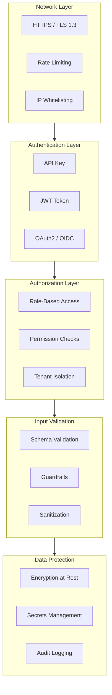

**Security** is a fundamental pillar of the framework, integrated **by-design** into every component. This guide covers available protection mechanisms and best practices for keeping the system secure.

!!! warning "Security-First Mindset"
    Security is not optional. Every framework feature is designed with security as a primary requirement, not an afterthought.

---

## Security Model

The framework implements a **multi-layered** security model:



---

## Authentication

Authentication verifies **who you are**. The framework supports multiple strategies.

### JWT (JSON Web Token)

JWT is the recommended method for web applications and APIs. Tokens are cryptographically signed and contain verifiable claims.

```python
from core.auth import create_access_token, verify_token
from datetime import timedelta

# Create token after login
token = create_access_token(
    user_id="user-123",
    roles=["user", "admin"],
    tenant_id="tenant-abc",  # Important for multi-tenancy
    expires_delta=timedelta(hours=1)
)
# Result: "eyJhbGciOiJIUzI1NiIsInR5cCI6IkpXVCJ9..."

# Verify token in subsequent request
try:
    payload = verify_token(token)
    print(payload["user_id"])  # "user-123"
    print(payload["roles"])    # ["user", "admin"]
except TokenExpiredError:
    # Token expired, request refresh
    pass
except InvalidTokenError:
    # Invalid or tampered token
    pass
```

**JWT Token Structure:**

| Claim       | Description                 | Example             |
| ----------- | --------------------------- | ------------------- |
| `sub`       | User ID                     | `user-123`          |
| `roles`     | User roles                  | `["user", "admin"]` |
| `tenant_id` | Tenant affiliation          | `tenant-abc`        |
| `exp`       | Expiration (Unix timestamp) | `1672531200`        |
| `iat`       | Issued at                   | `1672527600`        |
| `iss`       | Issuer (optional)           | `baselith-core`     |
| `aud`       | Audience (optional)         | `api.myapp.com`     |

Configure issuer and audience validation via `JWT_ISSUER` and `JWT_AUDIENCE` environment variables. When set, tokens are rejected if the claims don't match — preventing token reuse across services.

### API Key

For server-to-server integrations or scripts, use API Keys. They're simpler but less flexible than JWT.

```python
from core.auth import validate_api_key, generate_api_key

# Generate API Key for a user
api_key = generate_api_key(
    user_id="user-123",
    name="Production Integration",
    scopes=["read", "write"]
)
# Result: "sk_live_xxxxxxxxxxxxxxxxxxxxx"

# Validation in an endpoint
@router.get("/api/data")
async def get_data(api_key: str = Header(..., alias="X-API-Key")):
    key_info = await validate_api_key(api_key)

    if not key_info:
        raise HTTPException(401, "Invalid API key")

    if "read" not in key_info.scopes:
        raise HTTPException(403, "Insufficient permissions")

    return await fetch_data(key_info.user_id)
```

!!! tip "API Key Best Practices"
    - Use prefixes to identify type: `sk_live_`, `sk_test_`
    - Never show complete API key after creation
    - Implement periodic key rotation
    - Log every use for audit

---

## Authorization

Authorization verifies **what you can do**. Use the role and permission system.

### Role-Based Access Control (RBAC)

```python
from core.auth import require_roles, AuthRole, get_current_user

# Available roles
class AuthRole:
    USER = "user"           # Base user
    ADMIN = "admin"         # Administrator
    SUPERADMIN = "superadmin"  # Global administrator
    SERVICE = "service"     # Service account

# Decorator to protect endpoints
@router.post("/admin/users")
@require_roles([AuthRole.ADMIN])
async def create_user(
    user_data: UserCreate,
    current_user = Depends(get_current_user)
):
    """Only admins can create new users."""
    # current_user contains authenticated user info
    logger.info(f"User {current_user.id} creating new user")
    return await user_service.create(user_data)
```

### Permission-Based Access

For more granular controls, use permissions:

```python
from core.auth import require_permissions

@router.delete("/documents/{doc_id}")
@require_permissions(["documents:delete"])
async def delete_document(doc_id: str):
    """Requires specific document deletion permission."""
    return await document_service.delete(doc_id)
```

### Programmatic Checks

For conditional logic:

```python
from core.auth import has_permission, has_role

async def process_request(user, request):
    if has_role(user, AuthRole.ADMIN):
        # Admin logic
        return await admin_processing(request)

    if has_permission(user, "premium:features"):
        # Premium logic
        return await premium_processing(request)

    return await standard_processing(request)
```

---

## Input Validation & Sanitization

Input validation prevents numerous attacks. **Never trust user input**.

### Schema Validation (Pydantic)

All inputs must pass through Pydantic models:

```python
from pydantic import BaseModel, Field, validator

class ChatInput(BaseModel):
    message: str = Field(..., min_length=1, max_length=10000)
    session_id: str | None = Field(None, pattern=r'^[a-zA-Z0-9\-]+$')

    @validator('message')
    def sanitize_message(cls, v):
        # Remove control characters
        return ''.join(c for c in v if c.isprintable() or c in '\n\t')
```

### Guardrails (LLM Input Protection)

For LLM inputs, use Guardrails to prevent prompt injection:

```python
from core.guardrails import InputGuard

guard = InputGuard()

async def process_user_input(user_input: str):
    result = await guard.process(user_input)

    if not result.is_safe:
        logger.warning(
            "Blocked malicious input",
            reason=result.block_reason,
            risk_score=result.risk_score
        )
        raise HTTPException(400, "Invalid input detected")

    # Sanitized input safe to pass to LLM
    safe_input = result.sanitized_content
    return await llm.generate(safe_input)
```

**What Guardrails Check:**

- **Prompt Injection**: Attempts to override system instructions
- **Jailbreak Attempts**: Known jailbreak patterns
- **PII Detection**: Sensitive personal data
- **Malicious Patterns**: SQL injection, XSS, etc.

### Indirect Prompt Injection (External Content)

`InputGuard` only sees the **user prompt**. Instructions hidden inside content
the agent fetches itself — web pages, tool output, documents — bypass it. The
`IndirectInjectionScanner` (`core/guardrails/indirect.py`) catches those:
zero-width/bidi unicode, instruction-bearing HTML comments, hidden CSS, and
agent-directed phrases.

Use `scan_external_content(...)` at every ingestion boundary. It is **log-only
by default** (returns content unchanged) and is already wired into the
framework's untrusted-content boundaries — external MCP tool results
(`MCPClient.call_tool`) and scraped pages (both web-scraper fetchers):

```python
from core.guardrails import scan_external_content

text = scan_external_content(tool_output, source=f"mcp_tool:{name}")
```

Set `BASELITH_SANITIZE_EXTERNAL_CONTENT=true` (or pass `sanitize=True`) to
strip invisibles and HTML comments before the content reaches the model. See
[Guardrails](../core-modules/guardrails.md#indirect-injection-scanning).

### Agent-Initiated Commerce Replay Protection

Signed mandate chains (`core/world_model/mandates.py`) authorize autonomous
purchases. Pass a `replay_guard` to `verify_chain(...)` to consume each intent
exactly once, so a valid signed chain cannot be re-submitted within its expiry
window. See [World Model](../core-modules/world-model.md#replay-protection).

---

## Security Configuration

`SecurityConfig` enforces safety at startup via Pydantic validators:

| Setting                    | Default      | Notes                                                                                 |
| -------------------------- | ------------ | ------------------------------------------------------------------------------------- |
| `SECRET_KEY`               | `None`       | **Required** when `AUTH_REQUIRED=true`. Must be at least 32 chars. Uses `SecretStr`. |
| `ADMIN_PASS`               | `None`       | Uses `SecretStr`. Rejected at startup if set to `"password"`, `"changeme"`, or `"admin"`. |
| `ADMIN_PASS_HASHED`        | `None`       | PBKDF2-SHA256 hashed password. Preferred over `ADMIN_PASS`.                          |
| `API_KEYS_USER` / `API_KEYS_ADMIN` / `API_KEYS_JOB` | `[]` (empty) | Comma-separated keys, wrapped in `SecretStr` so they never appear in `repr()`, logs, or Sentry frames. |
| `ALLOW_ORIGINS`            | `[]` (empty) | Blocks all cross-origin by default. `["*"]` disables credentials for security. |
| `TRUSTED_HOSTS`            | `[]` (empty) | Optional allowlist for incoming `Host` headers. Recommended behind reverse proxies in production. |
| `AUTH_REQUIRED`            | `true`       | Enforced by default. Even when set to `false`, admin/job/service routes still reject anonymous traffic. |
| `JWT_ISSUER`               | `None`       | Optional `iss` claim for token scoping.                                               |
| `JWT_AUDIENCE`             | `None`       | Optional `aud` claim for token scoping.                                               |
| `JWT_STRICT_VALIDATION`    | `false`      | When `true`, rejects any JWT missing `aud` or `iss` claims even if not configured on the handler. Recommended for multi-region/multi-cluster deployments to prevent cross-cluster token acceptance. |
| `SECURITY_HEADERS_ENABLED` | `true`       | Enables CSP, HSTS, Permissions-Policy. Baseline headers are always active.           |
| `ENABLE_HSTS`              | `true`       | Adds `Strict-Transport-Security` header. Enabled by default. Disable only if TLS is not terminated upstream. |
| `CONTENT_SECURITY_POLICY`  | `None`       | Custom CSP value.                                                                     |
| `MAX_REQUEST_SIZE_BYTES`   | `10485760` (10 MiB) | Hard cap on inbound request body size. Bodies that advertise or stream beyond the cap are rejected with HTTP 413. Set to `0` to disable. |

Generate a secure secret key:

```bash
python -c "import secrets; print(secrets.token_urlsafe(64))"
```

!!! danger "Environment Files"
    `.env` files are **gitignored** and must never be committed. Use `.env.example` as a template.

### Hardening Environment Flags

These flags live outside `SecurityConfig` and harden specific subsystems. All
default to a non-breaking posture; enable the stricter ones in production.

| Variable | Default | Effect |
| -------- | ------- | ------ |
| `BASELITH_SANITIZE_EXTERNAL_CONTENT` | off | Strip invisibles/bidi/HTML comments from fetched content (tool output, scraped pages) instead of log-only. |
| `BASELITH_REQUIRE_SIGNED_PLUGINS` | off | Strict mode: reject plugins lacking a verified `integrity_sha256`. |
| `BASELITH_FAIL_ON_UNSIGNED_IN_PROD` | off | Turn the production "plugins unsigned" warning into a hard startup error (fail closed). |
| `BASELITH_SKIP_INTEGRITY_CHECK` | off | Dev-only escape hatch; skips hash verification (ignored when strict mode is on). |
| `BASELITH_BROWSER_ALLOW_INTERNAL` | off | Allow the browser agent to reach loopback/private hosts (trusted local dev only). |
| `BASELITH_A2A_SHARED_SECRET` | unset | Enable HMAC-SHA256 signing of A2A traffic: the client signs every request and the A2A router rejects unsigned/invalid requests with 401. Set the same value on all peers. Unset = unauthenticated (a CRITICAL log fires in production). |
| `MCP_ALLOWED_COMMANDS` | `python,python3,node,npx,uvx,uv,deno,bun,bunx` | Allowlist of executable basenames `MCPClient` may spawn for stdio servers; custom commands outside the list are rejected. |
| `BASELITH_MARKETPLACE_ALLOW_HTTP` | off | Permit a plaintext `http://` marketplace registry on non-loopback hosts (MITM risk — trusted networks only). HTTPS and `file://` are always allowed. |

!!! note "JWT algorithm safety"
    `JWTHandler` rejects the `none` algorithm at construction (disabled
    signature verification — the JWT downgrade attack), requires the `exp`
    claim on every verified token (a token without expiry could never be
    blacklisted), and accepts the signing key as `SecretStr` so the plaintext
    is not unwrapped until the last moment. Successful verifications are cached
    in-process for a short window (≤5s, never past the token's own `exp`) to
    skip the signature check and Redis blacklist round-trip on repeated
    requests. The cache is a bounded LRU (8192 entries) so a burst of distinct
    valid tokens — rotation or token spray — cannot grow it without limit.
    Revoking a token evicts its entry immediately in-process; the short TTL
    bounds staleness across other workers.

## Container Hardening

In production, the compose stack applies extra runtime restrictions to reduce post-compromise blast radius:

- `no-new-privileges:true` is enabled on the main application, data, and observability containers.
- Ambient Linux capabilities are dropped for non-privileged services.
- The Nginx gateway runs with a read-only root filesystem and dedicated `tmpfs` mounts for runtime state.
- Internal services are segmented across dedicated Docker networks.
- TLS termination is expected to happen upstream, so certificate lifecycle is managed outside this application stack.

The main residual risk is intentionally pushed out of this compose stack: the sandbox daemon should run on a dedicated external host or node, not inside the main production application deployment.

## Supply-Chain Security

Dependencies and source are continuously scanned in CI; findings surface under
the repository's **Security → Code scanning** tab.

| Layer | Tool | What it covers |
| ----- | ---- | -------------- |
| Dependency updates | **Dependabot** (`.github/dependabot.yml`) | Weekly grouped PRs for pip, npm (SDK / dashboard / portal), GitHub Actions, and Docker base images |
| SAST | **CodeQL** (`.github/workflows/codeql.yml`) | Python + JavaScript/TypeScript, `security-and-quality` queries, on push/PR and weekly |
| SAST | **Semgrep** (`.github/workflows/semgrep.yml`) | OSS rulesets `p/python`, `p/security-audit`, `p/secrets` (no token), report-mode |
| Dependency CVEs / SBOM | **Trivy** + **CycloneDX** (in `ci.yml`) | Vulnerability scan and a generated software bill of materials |
| Image provenance | **cosign** + SLSA (`release-image.yml`) | Keyless-signed images with provenance and SBOM attestations |

CodeQL and Trivy run in **report mode** — they publish findings without failing
the build, so security signal is visible without blocking delivery. Tighten to
blocking once the baseline is clean.

!!! note "Scan scope: the Backstage portal is excluded from the Trivy dependency scan"
    `backstage-portal/yarn.lock` is skipped by the Trivy filesystem scan
    (`--skip-files` in `ci.yml`). The developer portal is a **vendored, dev-only
    tool** — it is not part of the published `baselith-core` wheel or the release
    container image — and its transitive npm tree is authored upstream by
    Backstage. That tree carries advisories we cannot resolve without a Backstage
    release, most notably the abandoned **`vm2`** package (no patched version
    exists; it is a build-time transitive of
    `@backstage/config-loader → typescript-json-schema`). Scanning it produced
    ~70 unactionable Code-scanning alerts that drowned out real signal for the
    shipped product. Dependency hygiene for the portal is owned by **Dependabot**
    (the `Backstage developer portal` group) instead. Secret and misconfig
    scanning of the portal source is unaffected — only its lockfile is skipped.

## Secrets Management

**Never hardcode secrets in code**. Always use the configuration system.

### Correct Configuration

```python
# ✅ Correct: use config
from core.config import get_security_config

config = get_security_config()
secret = config.secret_key

# ✅ Correct: use environment variables
import os
api_key = os.environ.get("EXTERNAL_API_KEY")
```

### Anti-Patterns to Avoid

```python
# ❌ NEVER do this
JWT_SECRET = "my-super-secret-key"  # Hardcoded!

# ❌ NEVER commit .env files with real secrets
# .env in repo with: OPENAI_API_KEY=sk-xxxxx

# ❌ NEVER log secrets
logger.info(f"Using API key: {api_key}")  # NO!
```

!!! note "LLM provider credentials stay wrapped"
    The OpenAI, Anthropic, and HuggingFace providers store their API key as a
    `SecretStr` internally and unwrap it only at the SDK client boundary
    (`AsyncOpenAI(api_key=...)`, etc.). The plaintext never lives as a bare
    instance attribute, so a provider object captured in a traceback or Sentry
    frame does not leak the credential.

### Pluggable Secrets Backend

By default secrets resolve from environment variables (unchanged behaviour). For
production you can switch to mounted Docker/Kubernetes secrets — keeping
plaintext out of the environment and image layers — without code changes:

```bash
SECRETS_BACKEND=file
SECRETS_DIR=/run/secrets        # reads /run/secrets/DB_PASSWORD, honours DB_PASSWORD_FILE
```

```python
from core.security import get_secret

db_password = get_secret("DB_PASSWORD")   # SecretStr | None
```

External managers (HashiCorp Vault, cloud KMS) are registered at startup via
`register_secrets_provider("vault", factory)` and selected with
`SECRETS_BACKEND=vault`. See
[Security & Encryption](../core-modules/security.md#secret-resolution).

### Encryption at Rest

Protect PII columns and other sensitive values with authenticated AES-256-GCM
field encryption. Opt-in via `DATA_ENCRYPTION_KEYS`:

```python
from core.security import get_field_encryptor

enc = get_field_encryptor()               # None if not configured
if enc:
    token = enc.encrypt("user@example.com")
    plain = enc.decrypt(token)
```

### Secret / Key Rotation

Encryption keys are **versioned**; a token embeds the id of the key that
produced it, so rotation is lossless:

1. Add the new key and make it active:
   `DATA_ENCRYPTION_KEYS=v1:<old>,v2:<new>`, `DATA_ENCRYPTION_ACTIVE_KEY_ID=v2`.
2. Old ciphertext keeps decrypting (the `v1` key stays loaded).
3. Re-encrypt lazily — `encryptor.needs_rotation(token)` flags ciphertext made
   by a non-active key; decrypt then re-encrypt to migrate.
4. Drop the old key once nothing reports `needs_rotation`.

For `SECRET_KEY` / JWT signing rotation, roll the env value and force re-login
(short token TTLs minimise the window). Full details:
[Security & Encryption](../core-modules/security.md).

---

## Rate Limiting

The distributed rate limiter uses Redis to count requests per identifier (role + user/key/IP). The counter is initialised with `SET NX EX` before being incremented with `INCR`, making the TTL-assignment atomic and eliminating the race condition that previously allowed unlimited requests under high concurrency.

---

## Admin Account Lockout

After **5 failed** HTTP Basic Auth attempts within **60 seconds**, the admin account is locked for **15 minutes**. The lockout counter is stored in Redis and cleared automatically on successful login.

---

## CORS (Cross-Origin Resource Sharing)

The framework implements a strict CORS policy to prevent unauthorized cross-origin requests, especially for authenticated endpoints.

### Wildcard Origins vs Credentials

Following security best practices and the CORS specification, **credentials (cookies, Authorization headers, Basic Auth) cannot be used with a wildcard origin (`*`)**.

- **If `ALLOW_ORIGINS=["*"]`**: The framework automatically sets `allow_credentials=False`. This is safe for public APIs but will break the Admin Console and other authenticated cross-origin tools if accessed from a different origin.
- **If credentials are required**: You **MUST** explicitly list the allowed origins in `ALLOW_ORIGINS` (e.g., `["https://admin.myapp.com", "https://myapp.com"]`).

!!! critical "Security Footgun Prevented"
    Previous versions allowed `allow_credentials=True` with a regex-based wildcard bypass. This has been removed. The framework now enforces a hard-fail or credential disablement when `*` is used, protecting the Admin Console from CSRF-like data theft.

---

## CSRF Protection

A middleware validates the `Origin` header on all state-changing requests (`POST`, `PUT`, `DELETE`, `PATCH`).

1. **Origin Validation**: If an `Origin` header is present, it must match one of the entries in `ALLOW_ORIGINS`.
2. **Wildcard Handle**: If `ALLOW_ORIGINS` contains `*`, CSRF protection is relaxed for public endpoints, but credentials remain disabled (see [CORS](#cors-cross-origin-resource-sharing)).
3. **No-Origin Requests**: Requests without an `Origin` header (e.g., direct `curl` calls) are permitted, as they cannot be forged by a browser.

Bearer-token and API-key authentication are inherently immune to CSRF because they require an explicit header that browsers won't add automatically to cross-origin requests.

---

## Host Header Validation

When `TRUSTED_HOSTS` is configured, FastAPI enables `TrustedHostMiddleware` and rejects requests whose `Host` header is not in the allowlist.

Recommended production setup:

- Set `TRUSTED_HOSTS` to the public domains actually served by your reverse proxy.
- Keep `localhost` only if you really expose local health checks through that host.
- Do not use `*` in production unless you intentionally want to disable host validation.

Example:

```env
TRUSTED_HOSTS=["api.example.com","admin.example.com"]
```

---

## Security Headers

Four baseline headers are emitted on **every response**, regardless of configuration:

| Header                    | Value                  |
| ------------------------- | ---------------------- |
| `X-Content-Type-Options`  | `nosniff`              |
| `X-Frame-Options`         | `DENY` (configurable)  |
| `Referrer-Policy`         | `same-origin`          |
| `X-XSS-Protection`        | `1; mode=block`        |

`Content-Security-Policy` and `Permissions-Policy` are opt-in via `SecurityConfig`. `Strict-Transport-Security` is **enabled by default** (`ENABLE_HSTS=true`) and requires TLS termination upstream — set `ENABLE_HSTS=false` only in environments without TLS. All three are emitted only when `SECURITY_HEADERS_ENABLED=true`.

`SecurityHeadersMiddleware` is implemented as pure ASGI — `BaseHTTPMiddleware` is **forbidden** by the architecture rules because it wraps every request in an extra anyio task and breaks streaming/cancellation semantics. Any new HTTP middleware **must** follow the same pattern.

---

## Request Body Size Limit

`RequestSizeLimitMiddleware` (pure ASGI, registered immediately after the request-id middleware) protects the application from memory-exhaustion DoS via oversized POST/PUT bodies. Enforcement is two-stage:

1. **Fast reject** when the `Content-Length` header exceeds `MAX_REQUEST_SIZE_BYTES` (no body read).
2. **Streaming counter** on the receive channel that aborts the request as soon as the cumulative body size crosses the cap — defends against chunked-encoding bypass and missing `Content-Length`.

Rejected requests receive `HTTP 413 Request Entity Too Large` and increment the Prometheus counter `security_events_total{reason="request_too_large"}`. WebSocket and lifespan scopes are passed through unchanged. Set `MAX_REQUEST_SIZE_BYTES=0` to disable the check (not recommended outside dev).

For large file uploads beyond ~100 MiB, prefer a dedicated streaming-upload endpoint that pipes directly to object storage rather than raising the global cap.

---

## SSRF Protection

The scraper validates all outgoing URLs against a private-IP blocklist. Hostname resolution happens at validation time and the HTTP client connects directly to the **verified IP** (IP pinning), preventing DNS rebinding attacks where a second resolution at connection time could return a private address.

```python
# Internal helper — used automatically by HttpxFetcher
from core.scraper.utils import get_pinned_url_for_host

result = get_pinned_url_for_host("https://example.com/page")
if result is None:
    raise ValueError("SSRF check failed")
pinned_url, original_host = result
# HTTP client connects to the pinned IP; Host header preserved
```

!!! note "Canonical location"
    `core.scraper.utils` is a compatibility shim that re-exports from the canonical
    module `plugins.web_scraper.utils`. New code should import from
    `plugins.web_scraper.utils` directly.

---

## OWASP Top 10 Mitigations

The framework provides protections for main OWASP vulnerabilities:

| #       | Vulnerability             | Mitigation                                                                              |
| ------- | ------------------------- | --------------------------------------------------------------------------------------- |
| **A01** | Broken Access Control     | RBAC, tenant isolation, route protection, plugin API requires `admin` role              |
| **A02** | Cryptographic Failures    | TLS 1.3, PBKDF2-SHA256 for admin passwords, secrets via `SecretStr`                    |
| **A03** | Injection                 | Input validation, parametrized queries, path traversal protection on file ingest        |
| **A04** | Insecure Design           | Security by design, CSRF middleware, atomic rate limiter, request body size limit         |
| **A05** | Security Misconfiguration | Secure defaults, startup validation, baseline security headers always active, pure-ASGI middleware only (no `BaseHTTPMiddleware`) |
| **A06** | Vulnerable Components     | Updated dependencies, `pip-audit` CVE scan in CI, Bandit static analysis; JSON used for all cache serialization |
| **A07** | Auth Failures             | Atomic rate limiting, admin account lockout (5 attempts / 15 min lock)                 |
| **A08** | Software Integrity        | Signed packages, checksum verification                                                  |
| **A09** | Logging Failures          | Structured audit logging; plugin management actions fully audited                       |
| **A10** | SSRF                      | URL validation, DNS resolution at validation time, IP pinning to prevent DNS rebinding  |

---

## Security Audit Logging

Log all security events for compliance and incident response:

```python
from core.observability import security_logger

# Successful login
security_logger.info(
    "user.login.success",
    user_id=user.id,
    ip_address=request.client.host,
    user_agent=request.headers.get("user-agent")
)

# Failed attempt
security_logger.warning(
    "user.login.failed",
    username=credentials.username,
    ip_address=request.client.host,
    failure_reason="invalid_password"
)

# Administrative action
security_logger.audit(
    "admin.user.deleted",
    actor_id=admin.id,
    target_id=deleted_user.id,
    action="user_deletion"
)
```

---

## Security Checklist

Before go-live, verify every point:

### Authentication Verification

- [x] JWT secret key is at least 256 bits long
- [x] Tokens have reasonable expiration (1-24h)
- [x] Refresh token implemented for long sessions
- [x] Rate limiting on login endpoint (5 attempts/minute)
- [x] Admin account lockout after 5 failed attempts
- [x] `JWT_ISSUER` and `JWT_AUDIENCE` set in multi-service environments
- [x] `JWT_STRICT_VALIDATION=true` in multi-region/multi-cluster deployments

### Network

- [x] HTTPS mandatory in production
- [x] CORS configured only for authorized domains
- [x] HTTP security headers configured (CSP, HSTS, etc.)
- [x] CSRF origin validation active for state-changing endpoints

### Input/Output

- [x] All inputs validated with Pydantic
- [x] Guardrails active for LLM inputs
- [x] Output encoding to prevent XSS

### Secrets

- [x] No hardcoded secrets in code
- [x] `.env` in `.gitignore`
- [x] Secrets manager in production (Vault, AWS SM) — `SECRETS_BACKEND=file` or a registered backend
- [x] Encryption at rest for PII/sensitive fields (`DATA_ENCRYPTION_KEYS`)
- [x] Documented key-rotation procedure

---

## Incident Response

In case of suspected breach:

1. **Containment**: Immediately revoke compromised tokens/API keys
2. **Analysis**: Examine security logs
3. **Notification**: Inform affected users
4. **Remediation**: Fix the vulnerability
5. **Documentation**: Document incident for future prevention

```python
# Revoke all user tokens
await token_service.revoke_all_user_tokens(user_id)

# Force re-login for everyone
await session_service.invalidate_all_sessions()
```

---

## Next Steps

- Configure [Observability](observability.md) to monitor security events
- Implement secure backups (see [Deployment](deployment.md))
- Run periodic penetration testing
