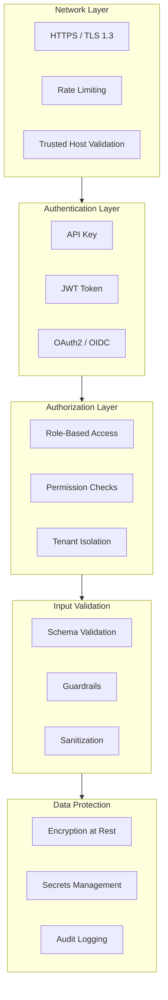

**Security** is a fundamental pillar of the framework, integrated **by-design** into every component. This guide covers available protection mechanisms and best practices for keeping the system secure.

!!! warning "Security-First Mindset"
    Security is not optional. Every framework feature is designed with security as a primary requirement, not an afterthought.

---

## Security Model

The framework implements a **multi-layered** security model:


```mermaid
flowchart TB
    subgraph Network["Network Layer"]
        N1[HTTPS / TLS 1.3]
        N2[Rate Limiting]
        N3[Trusted Host Validation]
    end

    subgraph Auth["Authentication Layer"]
        A1[API Key]
        A2[JWT Token]
        A3[OAuth2 / OIDC]
    end

    subgraph Authz["Authorization Layer"]
        Z1[Role-Based Access]
        Z2[Permission Checks]
        Z3[Tenant Isolation]
    end

    subgraph Input["Input Validation"]
        I1[Schema Validation]
        I2[Guardrails]
        I3[Sanitization]
    end

    subgraph Data["Data Protection"]
        D1[Encryption at Rest]
        D2[Secrets Management]
        D3[Audit Logging]
    end

    Network --> Auth --> Authz --> Input --> Data
```

---

## Authentication

Authentication verifies **who you are**. The framework supports multiple strategies.

### JWT (JSON Web Token)

JWT is the recommended method for web applications and APIs. Tokens are cryptographically signed and contain verifiable claims.

The `AuthManager` singleton (`core/auth/manager.py`) owns the `JWTHandler`;
`AuthManager.create_token` is `async` because it stamps the user's current
token epoch into the claim set (see [Incident Response](#incident-response)),
and `JWTHandler.verify_token` is `async` because it consults the Redis
blacklist.

```python
from core.auth import AuthRole, InvalidTokenError, TokenExpiredError, get_auth_manager

auth = get_auth_manager()

# Mint an access token after the user has authenticated
token = await auth.create_token(
    "user-123",
    roles={AuthRole.USER, AuthRole.ADMIN},
    tenant_id="tenant-abc",  # reserved claim: the isolation boundary
    lifetime=3600,           # seconds; overrides the handler default (1 h)
)
# Result: "eyJhbGciOiJIUzI1NiIsInR5cCI6IkpXVCJ9..."

# Verify it on a later request
try:
    user = await auth.jwt.verify_token(token, expected_type="access")
    print(user.user_id)    # "user-123"
    print(user.roles)      # {AuthRole.USER, AuthRole.ADMIN}
    print(user.tenant_id)  # "tenant-abc"
except TokenExpiredError:
    ...  # expired: rotate the refresh token
except InvalidTokenError:
    ...  # tampered, revoked, wrong key, or a refresh token on the access path
```

`verify_token` returns an `AuthUser` (`core/auth/types.py`); the decoded
payload is kept on `user.metadata`. `tenant_id`, `exp` and `act` are
**reserved claims**: they are stripped from `extra_claims`, so pass them as the
first-class parameters shown above or they are silently dropped.

**JWT Token Structure:**

| Claim       | Description                                                                 | Example             |
| ----------- | --------------------------------------------------------------------------- | ------------------- |
| `sub`       | User ID                                                                     | `user-123`          |
| `roles`     | User roles                                                                  | `["user", "admin"]` |
| `scopes`    | Explicit capability scopes (optional; role-derived scopes are computed at check time) | `["chat:read"]` |
| `tenant_id` | Tenant affiliation                                                          | `tenant-abc`        |
| `jti`       | Token id — the key the revocation blacklist is written under               | `3f9a1c2b7d4e6a01`  |
| `tv`        | Token epoch — bumped per user to strand every outstanding token at once     | `3`                 |
| `exp`       | Expiration (Unix timestamp)                                                 | `1672531200`        |
| `iat`       | Issued at                                                                   | `1672527600`        |
| `iss`       | Issuer (optional)                                                           | `baselith-core`     |
| `aud`       | Audience (optional)                                                         | `api.myapp.com`     |

Issuer and audience validation defaults from `APP_BASE_URL`, and `JWT_STRICT_VALIDATION` switches on by itself once `AUTH_REQUIRED=true` and both claims resolve — at that point every token carries them, so requiring them costs nothing. Set `JWT_ISSUER`/`JWT_AUDIENCE` explicitly to override. Without the binding, any two deployments sharing a `SECRET_KEY` (e.g. a staging value copy-pasted to prod) accept each other's tokens; with no `APP_BASE_URL` to derive from, startup logs a warning naming exactly what to set.

**Refresh-token rotation with family revocation (RFC 9700 §4.14.2).** Every
refresh token carries a reserved `family` claim chaining it to its rotation
lineage (a fresh login starts a new family). Rotation consumes and blacklists
the presented token; if a **blacklisted** refresh token is ever presented
again — the signature of theft, since someone rotated it first — the whole
family is revoked, killing the thief's freshly rotated descendant too. Legacy
refresh tokens without the claim keep rotating (they start a new family on
first rotation), and access-token verification adds no extra Redis lookups.

### API Key

For server-to-server integrations or scripts, use API Keys. They're simpler but less flexible than JWT.

Keys are **operator-minted**: there is no generator endpoint. Mint a random
token, put it in the environment, and `APIKeyValidator`
(`core/auth/api_keys.py`) registers it at startup with the role its variable
implies:

| Variable          | Role(s) granted                                  | Format                                   |
| ----------------- | ------------------------------------------------ | ---------------------------------------- |
| `API_KEYS_USER`   | `user`                                           | comma-separated keys                     |
| `API_KEYS_ADMIN`  | `admin` + `user`                                 | comma-separated keys                     |
| `API_KEYS_JOB`    | `service` (also satisfies `job` routes)          | comma-separated keys                     |
| `API_KEYS_SCOPED` | `scoped` — **no** role-derived scopes, only the listed ones | `key1=chat:read\|chat:write,key2=webhooks:write` |

Clients send the key as `X-API-Key: <key>` (or `Authorization: ApiKey <key>`).
The same validator is available for runtime registration and for checks
outside the HTTP path:

```python
from core.auth import AuthRole, get_auth_manager

auth = get_auth_manager()

# Register a least-privilege key minted by a provisioning job
auth.api_keys.register_key(
    api_key,                      # the random secret you generated (see below)
    user_id="reporting-service",
    roles={AuthRole.SCOPED},      # authorization comes only from the scopes
    scopes={"chat:read"},
    expires_at=None,              # or a timezone-aware datetime
)

# Validation — what the X-API-Key path does on every request
user = await auth.api_keys.validate_key(api_key)   # AuthUser | None
if user is None:
    raise HTTPException(401, "Authentication required.")
if not user.has_scope("chat:read"):
    raise HTTPException(403, "Insufficient scope")
```

`validate_key` returns `None` for an unknown key, an expired one, and one
that was revoked with `await auth.api_keys.revoke_key(key)` — revocation
writes a persistent Redis tombstone, so it reaches every worker and survives a
restart (re-trusting the same value needs an explicit `reinstate_key`).

!!! tip "API Key Best Practices"
    - Never show the complete key after creation; the validator only ever
      stores a SHA-256 digest
    - Prefer `API_KEYS_SCOPED` for automation that needs one capability
    - Rotate periodically: register the new key, `revoke_key` the old one
    - Every authenticated request is already audit-logged (`AUDIT | AUTH`)

!!! warning "Keys must be random tokens, not passwords"
    Configured keys are indexed by a **SHA-256** hash (`core/auth/api_keys.py`),
    not by a password KDF: the lookup runs on every authenticated request, and a
    slow KDF buys nothing for a high-entropy random token. That reasoning only
    holds while the key *is* random — `SecurityConfig` therefore warns at startup
    about any configured key shorter than 32 characters. Mint them with
    `python -c "import secrets; print(secrets.token_urlsafe(32))"`.

---

## Authorization

Authorization verifies **what you can do**. Roles are the coarse gate;
capability **scopes** (`resource:action`) are the fine-grained one.

### Role-Based Access Control (RBAC)

`AuthRole` (`core/auth/types.py`) is a `str` enum:

| Role        | Meaning                                                                                   |
| ----------- | ----------------------------------------------------------------------------------------- |
| `ANONYMOUS` | Unauthenticated; `AuthUser.is_authenticated` is `False`                                   |
| `USER`      | Base user (the default when a token carries no roles)                                     |
| `ADMIN`     | Administrator; `AuthUser.is_admin()`                                                      |
| `SERVICE`   | Service-to-service identity; also satisfies `job` routes                                  |
| `GUEST`     | Read-only access to dashboards                                                            |
| `JOB`       | Automated job/scheduler access                                                            |
| `SCOPED`    | Pure capability identity: grants nothing on its own, only its explicit scopes apply       |

On FastAPI routes, use the dependencies from `core.middleware.security`
(re-exported by `core.middleware`). Each one authenticates the request,
applies the per-role rate limit, binds the tenant context, and returns the
**role** that matched (`"anonymous"` on an auth-disabled deployment):

```python
from fastapi import APIRouter, Depends

from core.middleware import require_admin, require_admin_or_job, require_user

router = APIRouter()


@router.post("/admin/users", dependencies=[Depends(require_admin)])
async def create_user(user_data: UserCreate):
    """Only admins can create new users."""
    return await user_service.create(user_data)


@router.post("/index", dependencies=[Depends(require_admin_or_job)])
async def reindex():
    """Admin or automation identities."""
    ...


@router.get("/me")
async def me(role: str = Depends(require_user)):
    return {"role": role}
```

Outside the router (a tool gate, a service method), the same check is the
`require_auth` decorator on the manager. It reads the identity from a `user`
or `current_user` keyword argument and raises `InsufficientPermissionsError`;
`roles` means *any of*:

```python
from core.auth import AuthRole, AuthUser, get_auth_manager

auth = get_auth_manager()


@auth.require_auth(roles={AuthRole.ADMIN})
async def delete_tenant(tenant_id: str, *, user: AuthUser) -> None:
    ...
```

### Scope-Based Access

Scopes (`core/auth/scopes.py`) are `resource:action` strings — `chat:read`,
`memory:write`, `webhooks:write`, `plugins:manage`, `mcp:invoke`, … (the full
set is `KNOWN_SCOPES`). An identity's effective scopes are the ones its roles
imply (`ROLE_SCOPES`) plus any explicit grant from a scoped API key or a JWT
`scopes` claim; `"*"` and `"resource:*"` wildcards are honoured.

```python
from core.auth import AuthUser, get_auth_manager

auth = get_auth_manager()


# Decorator form: same ``user`` / ``current_user`` kwarg convention as require_auth
@auth.require_scopes("webhooks:write")
async def create_webhook(payload: dict, *, user: AuthUser):
    ...


# Chokepoint form: raises InsufficientScopeError (unauthenticated counts as missing)
auth.enforce_scopes(user, "chat:read", "memory:read", require_all=True)
```

### Programmatic Checks

For conditional logic, ask the `AuthUser` directly:

```python
from core.auth import AuthRole, scope_satisfied


async def process_request(user, request):
    if user.has_role(AuthRole.ADMIN):
        return await admin_processing(request)

    if user.has_scope("chat:write"):
        return await premium_processing(request)

    # Same check against an arbitrary grant set (wildcard-aware)
    if scope_satisfied(user.effective_scopes(), "webhooks:write"):
        ...

    return await standard_processing(request)
```

`has_scopes(*scopes, require_all=True)` checks several at once. For an RFC 8693
agent-delegated token (`act.client_id` present) `effective_scopes()` returns
**only** the explicit scopes — the exchange narrowed them, and re-expanding the
user's roles would undo that.

---

## Input Validation & Sanitization

Input validation prevents numerous attacks. **Never trust user input**.

### Schema Validation (Pydantic)

All inputs must pass through Pydantic models:

```python
from pydantic import BaseModel, Field, field_validator


class ChatInput(BaseModel):
    message: str = Field(..., min_length=1, max_length=10000)
    session_id: str | None = Field(None, pattern=r"^[a-zA-Z0-9\-]+$")

    @field_validator("message")
    @classmethod
    def sanitize_message(cls, v: str) -> str:
        # Remove control characters
        return "".join(c for c in v if c.isprintable() or c in "\n\t")
```

### Guardrails (LLM Input Protection)

For LLM inputs, use Guardrails to prevent prompt injection:

```python
from fastapi import HTTPException

from core.guardrails import InputGuard

guard = InputGuard()  # GuardrailsConfig from the environment by default


async def process_user_input(user_input: str) -> str:
    # validate() is the synchronous regex layer; validate_async() runs it
    # first and, when it passes, asks the LLM for a SAFE/MALICIOUS verdict.
    result = await guard.validate_async(user_input)

    if not result.is_valid:
        logger.warning(
            "Blocked malicious input",
            reason=result.blocked_reason,
            patterns=result.detected_patterns,
        )
        raise HTTPException(400, "Invalid input detected")

    # On success sanitized_input carries the text to hand to the model
    return await llm.generate_response(result.sanitized_input)
```

`InputValidationResult` has four fields: `is_valid`, `blocked_reason`,
`detected_patterns` (each entry is prefixed with the layer that fired —
`injection:`, `code:`, `custom:`, or `llm_guardrail`) and `sanitized_input`.

**What the input guard checks** (`GuardrailsConfig`, all on by default):

- **Length**: inputs over `max_input_length` (10 000 chars) are rejected
- **Prompt injection / jailbreak**: known override and DAN-style patterns
  (`block_injection_patterns`)
- **Code execution attempts**: shell/eval-style payloads
  (`block_code_execution`)
- **Custom patterns**: operator-supplied regexes
- **LLM verdict**: `validate_async` only, skipped when `llm_detection` is off;
  a failed LLM call falls back to the regex result

PII and harmful-content filtering happen on the **output** side
(`OutputGuard`), and both guards run automatically on every
`Orchestrator.process` call while `BASELITH_ORCHESTRATOR_GUARDRAILS` is on.

### Indirect Prompt Injection (External Content)

`InputGuard` only sees the **user prompt**. Instructions hidden inside content
the agent fetches itself — web pages, tool output, documents — bypass it. The
`IndirectInjectionScanner` (`core/guardrails/indirect.py`) catches those:
zero-width/bidi unicode, instruction-bearing HTML comments, hidden CSS, and
agent-directed phrases.

Use `scan_external_content(...)` at every ingestion boundary. It is **log-only
by default** (returns content unchanged) and is already wired into the
framework's untrusted-content boundaries — external MCP tool results
(`MCPClient.call_tool`) and scraped pages (both web-scraper fetchers):

```python
from core.guardrails import scan_external_content

text = scan_external_content(tool_output, source=f"mcp_tool:{name}")
```

Sanitizing is **on by default**: invisibles and instruction-bearing HTML
comments are stripped from flagged content before it reaches the model. Set
`BASELITH_SANITIZE_EXTERNAL_CONTENT=false` for legacy detection-only mode. See
[Guardrails](../core-modules/guardrails.md#indirect-injection-scanning).

### Log Injection (Untrusted Values in Log Lines)

Anything that reaches a log line from outside the process — plugin manifest
fields, filenames, header values — can carry newlines or terminal escapes and
forge additional log entries. `sanitize_log_value` (`core/utils/logsafe.py`)
escapes every non-printable character (`\n` becomes the literal `\x0a`, so the
evidence survives) and caps the length, keeping one record on one line. It is
applied at every boundary where outside text meets a log line — the plugin
gates and loader, the plugin admin API, the tenant router, and the `SafeLogger`
fallback in `core/observability/logging.py`, which also replaces values whose
key marks them a secret:

```python
from core.utils import sanitize_log_value

logger.error("Refusing plugin %s: integrity check failed", sanitize_log_value(name))
```

It is stdlib-only by design — the plugin integrity and signature gates
(`core/plugins/integrity.py`, `core/plugins/signing.py`) use it before the
observability stack is available, and `PluginLoader` escapes every
manifest-supplied name it logs.

### Path Traversal (Plugin Identifiers)

A plugin identifier names a directory under the plugins root, and it arrives
from outside: an HTTP path parameter (`/api/plugins/{plugin_name}/reload`), a
CLI argument, a manifest field. `safe_plugin_path`
(`core/plugins/_resolve.py`) is the only sanctioned way to turn one into a
path — a whitelist on the identifier plus a containment check on the result:

```python
from core.plugins._resolve import safe_plugin_path

plugin_dir = safe_plugin_path(self.plugins_dir, plugin_name)  # ValueError if it escapes
```

Identifiers must match `[A-Za-z0-9][A-Za-z0-9._-]{0,63}`, and the joined path
is canonicalised (`os.path.realpath`) and required to sit under the root, so a
symlink pointing outside is refused too. `PluginLoader.resolve_plugin_dir` and
`ResourceAnalyzer.get_plugin_metadata` both go through it; endpoints that
package a directory (`/api/plugins/export/publish`) apply the same
realpath-and-prefix check against `PLUGIN_PUBLISH_WORKSPACE_ROOT` and pass the
**validated** path downstream rather than the raw request value.

### Agent-Initiated Commerce Replay Protection

Signed mandate chains (`core/world_model/mandates.py`) authorize autonomous
purchases. **Replay protection is on by default**: `verify_chain(...)` consumes
each intent exactly once, so a valid signed chain cannot be re-submitted within
its expiry window. Passing `replay_guard=None` is the explicit opt-in to
stateless verification.

The default guard is resolved lazily by
`core.world_model.replay_guard.build_default_replay_guard()`: a Redis-backed
`RedisReplayGuard` (`SET key value NX EX`, atomic across workers and replicas)
when `CACHE_REDIS_URL` is configured, otherwise the process-local
`InMemoryReplayGuard` — which logs an ERROR in production, because with
`WEB_CONCURRENCY > 1` each worker keeps its own ledger and the same chain then
executes once *per worker*. The Redis guard is **fail-closed**: an unreachable
ledger raises `ReplayLedgerUnavailableError` instead of reporting the intent as
unused, since for a payment authorization *unknown* must read as *refused*.
Mandate signatures are decoded inside the verification boundary too — a non-hex
`signature_hex` from a peer raises `MandateSignatureError`, not a `500`.
See [World Model](../core-modules/world-model.md#replay-protection).

---

## Security Configuration

`SecurityConfig` enforces safety at startup via Pydantic validators:

| Setting                    | Default      | Notes                                                                                 |
| -------------------------- | ------------ | ------------------------------------------------------------------------------------- |
| `SECRET_KEY`               | `None`       | **Required** when `AUTH_REQUIRED=true`. Must be at least 32 chars. Uses `SecretStr`. |
| `ADMIN_PASS`               | `None`       | Uses `SecretStr`. Rejected at startup if set to `"password"`, `"changeme"`, or `"admin"`. |
| `ADMIN_PASS_HASHED`        | `None`       | PBKDF2-SHA256 hashed password. Preferred over `ADMIN_PASS`.                          |
| `API_KEYS_USER` / `API_KEYS_ADMIN` / `API_KEYS_JOB` | `[]` (empty) | Comma-separated keys, wrapped in `SecretStr` so they never appear in `repr()`, logs, or Sentry frames. |
| `ALLOW_ORIGINS`            | `[]` (empty) | Blocks all cross-origin by default. `["*"]` disables credentials for security. |
| `TRUSTED_HOSTS`            | `[]` (empty) | Allowlist for incoming `Host` headers. Empty means `TrustedHostMiddleware` is **not mounted** and the header goes unvalidated — production **refuses to boot** that way unless `BASELITH_ALLOW_UNVALIDATED_HOST=true`. Set it to the hostnames your reverse proxy serves. |
| `AUTH_REQUIRED`            | `true`       | Enforced by default. Even when set to `false`, admin/job/service routes still reject anonymous traffic. |
| `JWT_ISSUER`               | `APP_BASE_URL` | `iss` claim binding tokens to this deployment.                                       |
| `JWT_KEYS`                 | `None`       | Verification key ring `kid=key,...` enabling key rotation with no session loss — see [Auth](../core-modules/auth.md#key-rotation-without-logging-everyone-out). Held as `SecretStr`: under HS256 every ring entry can mint tokens, so the ring is redacted from `repr()`/dumps like `SECRET_KEY`. |
| `JWT_ACTIVE_KID`           | `None`       | Ring entry that signs new tokens (required with more than one key).                   |
| `JWT_SIGNING_KEY`          | `None`       | Private key for asymmetric signing; omit on verify-only services so they cannot mint. |
| `JWT_AUDIENCE`             | `None`       | Optional `aud` claim for token scoping.                                               |
| `JWT_STRICT_VALIDATION`    | auto         | Rejects any JWT missing `aud` or `iss`. Enabled automatically once `AUTH_REQUIRED=true` and both claims resolve; set explicitly to override. |
| `SECURITY_HEADERS_ENABLED` | `true`       | Enables CSP, HSTS, Permissions-Policy. Baseline headers are always active.           |
| `ENABLE_HSTS`              | `true`       | Adds `Strict-Transport-Security` header. Enabled by default. Disable only if TLS is not terminated upstream. |
| `CONTENT_SECURITY_POLICY`  | `None`       | Custom CSP value.                                                                     |
| `CROSS_ORIGIN_OPENER_POLICY` | `same-origin-allow-popups` | `Cross-Origin-Opener-Policy` value; severs `window.opener` with cross-origin windows while keeping OAuth/SSO popups opened by the console working. Empty omits the header. |
| `CROSS_ORIGIN_RESOURCE_POLICY` | `same-origin` | `Cross-Origin-Resource-Policy` value; blocks no-cors subresource loads of API responses from foreign origins (CORS-approved fetches are exempt). Use `same-site` for split api/app subdomains; empty omits the header. |
| `MAX_REQUEST_SIZE_BYTES`   | `10485760` (10 MiB) | Hard cap on inbound request body size. Bodies that advertise or stream beyond the cap are rejected with HTTP 413. Set to `0` to disable. |

Generate a secure secret key:

```bash
python -c "import secrets; print(secrets.token_urlsafe(64))"
```

!!! danger "Environment Files"
    `.env` files are **gitignored** and must never be committed. Use `.env.example` as a template.

### Hardening Environment Flags

These flags live outside `SecurityConfig` and harden specific subsystems. All
default to a non-breaking posture; enable the stricter ones in production.

| Variable | Default | Effect |
| -------- | ------- | ------ |
| `BASELITH_SANITIZE_EXTERNAL_CONTENT` | **on** | Strip invisibles/bidi/HTML comments from flagged fetched content (tool output, scraped pages). Set `false` for legacy detection-only mode. |
| `BASELITH_ORCHESTRATOR_GUARDRAILS` | **on** | Input validation (regex, pre-budget) + output PII/harmful-content filtering on every `Orchestrator.process` call. Set `false` to bypass for trusted internal traffic. |
| `BASELITH_REQUIRE_SIGNED_PLUGINS` | off | Strict mode (all environments): reject plugins lacking a verified `integrity_sha256`. Also demands the **current** hash surface — a digest computed before 0.27 (which left shipped `ui/dist/**` assets, native modules and shell scripts uncovered) is refused until the plugin is re-signed. |
| `BASELITH_ALLOW_UNSIGNED_IN_PROD` | off | **Production is fail-closed by default** — an unsigned plugin (no `integrity_sha256`) is refused at load. Set this to allow unsigned plugins in production (insecure; logs a CRITICAL). Outside production, unsigned plugins always load. |
| `BASELITH_SKIP_INTEGRITY_CHECK` | off | Dev-only escape hatch; skips hash verification. **Ignored in production** (and when strict mode is on). |
| `BASELITH_REQUIRE_PLUGIN_SIGNATURES` | off | Publisher-authenticity gate: refuse any plugin whose `integrity_sha256` is not signed (`signature_ed25519` in the manifest) by a key in the trust roots. The hash proves the tree matches the manifest; the Ed25519 signature proves **who** published it. Sign with `scripts/sign_plugin_ed25519.py`. |
| `BASELITH_PLUGIN_TRUST_ROOTS` | unset | Comma-separated hex-encoded Ed25519 public keys trusted to sign plugins (generate with `scripts/sign_plugin_ed25519.py keygen`). |
| `BASELITH_BROWSER_ALLOW_INTERNAL` | off | Allow the browser agent (navigation + sub-resource requests) to reach loopback/private hosts (trusted local dev only). |
| `WEBHOOK_ALLOW_INTERNAL` | off | Allow outbound webhook dispatch (`core.webhooks`) to target loopback/private/link-local hosts. |
| `BASELITHBOT_ALLOW_INTERNAL_WEBHOOKS` | off | Allow every baselithbot outbound HTTP call (channels, integrations, skills, the Ollama model probe) to reach loopback/private hosts. |
| `A2A_ALLOW_INTERNAL_ENDPOINTS` | **dev on / prod off** | `A2AClientConfig.allow_internal_endpoints` default. Unset, it is environment-aware: allowed in development (meshes commonly run peer agents internally), denied in production (a peer endpoint cannot be steered at cloud metadata/Redis/Postgres). An explicit `true`/`false` overrides in both directions — set `true` to opt a private-mesh production deployment back in. |
| `MCP_ALLOW_INTERNAL_ENDPOINTS` | off | Allow the MCP Streamable HTTP client transport (`core.mcp.http_client_transport`) to reach loopback/private hosts. |
| `BASELITH_A2A_SHARED_SECRET` | unset | Enable HMAC-SHA256 signing of A2A traffic: the client signs every request (timestamp + single-use nonce bound into the MAC, so captured requests cannot be replayed even within the skew window) and the A2A router rejects unsigned/invalid/replayed requests with 401. The nonce is **required**: a signed request without one is refused. Set the same value on all peers. Unset = unauthenticated (a CRITICAL log fires in production). |
| `BASELITH_A2A_ALLOW_LEGACY_NONCELESS` | off | **Deprecated compatibility window**: accept signed A2A requests without a nonce (pre-nonce peers). Their MAC is valid but replayable within the skew window, so enabling logs a CRITICAL. Turn on only while upgrading a mesh, then remove. |
| `BASELITH_LOCKOUT_FAIL_OPEN` | off | When Redis is unreachable in production, admin lockout **fails closed** (privileged auth returns 503) because per-replica in-memory counters are defeated by rotating replicas. This covers both a Redis that fails mid-request and one that was never reachable at all, so the client was never built — the second case used to drop silently to per-process counting for the life of the process. Only applies when `CACHE_BACKEND=redis` is actually declared: a deployment with no Redis runs the in-process counter by design. Set true to prefer availability over the control. |
| `BASELITH_ALLOW_UNBOUND_JWT` | off | Production with `AUTH_REQUIRED=true` refuses to start when JWTs carry no `iss`/`aud` binding (cross-environment token replay). Set true to accept the risk explicitly. |
| `DOCS_ENABLED` | auto | Force `/docs`, `/redoc`, `/openapi.json` on or off. Auto = off in production, and off when auth is enforced but no `ENVIRONMENT`/`APP_ENV` was declared — a config shape that smells like a forgotten prod env var, and one that now arms the full assumed-production posture rather than just the docs gate (see [What counts as production](#what-counts-as-production)). |
| `MCP_ALLOWED_COMMANDS` | `python,python3,node,npx,uvx,uv,deno,bun,bunx` | Allowlist of executable basenames `MCPClient` may spawn for stdio servers; custom commands outside the list are rejected. |
| `MCP_HTTP_REQUIRED_SCOPE` | `mcp:invoke` | Capability an authenticated caller must hold to reach the Streamable HTTP MCP endpoint (`403` + JSON-RPC `-32002` without it). The `admin`, `service`, `user` and `job` roles carry it by default; scoped API keys and `guest` do not. Empty disables the check. |
| `MCP_HTTP_RATE_LIMIT_PER_MINUTE` | `120` | Per-identity request budget for the MCP endpoint (`tenant:user_id`, or the peer address when `MCP_HTTP_REQUIRE_AUTH=false`). Over budget → `429` + JSON-RPC `-32003`. `0` disables the limit. |
| `BASELITH_MARKETPLACE_ALLOW_HTTP` | off | Permit a plaintext `http://` marketplace registry on non-loopback hosts (MITM risk — trusted networks only). HTTPS and `file://` are always allowed. |
| `BASELITH_MARKETPLACE_ALLOW_INTERNAL` | off | Permit a marketplace registry URL whose host resolves to a loopback/private/link-local/metadata address. Default-deny (SSRF guard) — set only for a trusted on-prem/air-gapped registry. |

!!! note "SSRF opt-out flags at a glance"
    `BASELITH_BROWSER_ALLOW_INTERNAL`, `WEBHOOK_ALLOW_INTERNAL`,
    `BASELITHBOT_ALLOW_INTERNAL_WEBHOOKS`, `A2A_ALLOW_INTERNAL_ENDPOINTS`, and
    `MCP_ALLOW_INTERNAL_ENDPOINTS` are the five environment knobs that flip a
    component's `SsrfPolicy.allow_internal` — see [SSRF: connection
    pinning](#ssrf-connection-pinning) below for what each guards and
    `BASELITH_MARKETPLACE_ALLOW_INTERNAL` above for the plugin-registry
    equivalent. Four of the five default **off** in every environment;
    `A2A_ALLOW_INTERNAL_ENDPOINTS`, when unset, is the lone environment-aware
    knob — permissive in development, deny in production.

!!! note "JWT algorithm safety"
    `JWTHandler` rejects the `none` algorithm at construction (disabled
    signature verification — the JWT downgrade attack), requires the `exp`
    claim on every verified token (a token without expiry could never be
    blacklisted), and accepts the signing key as `SecretStr` so the plaintext
    is not unwrapped until the last moment. Successful verifications are cached
    in-process for a short window (≤5s, never past the token's own `exp`) to
    skip the signature check and Redis blacklist round-trip on repeated
    requests. The cache is a bounded LRU (8192 entries) so a burst of distinct
    valid tokens — rotation or token spray — cannot grow it without limit.
    Revoking a token evicts its entry immediately in-process; the short TTL
    bounds staleness across other workers.

## Container Hardening

In production, the compose stack applies extra runtime restrictions to reduce post-compromise blast radius:

- `no-new-privileges:true` is enabled on the main application, data, and observability containers.
- Ambient Linux capabilities are dropped for non-privileged services.
- The Nginx gateway runs with a read-only root filesystem and dedicated `tmpfs` mounts for runtime state.
- Internal services are segmented across dedicated Docker networks.
- TLS termination is expected to happen upstream, so certificate lifecycle is managed outside this application stack.
- The observability overlay ships **no default Grafana credential**: `docker-compose.observability.yml` requires `GRAFANA_ADMIN_PASSWORD` (compose aborts when unset) instead of falling back to `admin`/`admin` — a reachable Grafana on the default credential is an instant takeover of every dashboard and datasource.
- `REDIS_PASSWORD` (optional, strongly recommended) arms `--requirepass` on the FalkorDB/Redis service in both compose files through the image's `REDIS_ARGS` environment variable — never a `command:` override, which would bypass the FalkorDB entrypoint and stop the graph module from loading. The healthcheck picks the password up the same way. When set, point `CACHE_REDIS_URL`/`QUEUE_REDIS_URL`/`GRAPH_DB_URL` at `redis://:<password>@…`. Without it, any container on the network (and any host process via the loopback publish) has full RW access to cache, queues, and rate-limit counters.

The main residual risk is intentionally pushed out of this compose stack: the sandbox daemon should run on a dedicated external host or node, not inside the main production application deployment. The default single-host `docker-compose.yml` applies the same rule — the Docker-in-Docker daemon needs `privileged: true` (root-equivalent on the compose host), so it lives in the opt-in `docker-compose.sandbox.yml` overlay and joins the stack only via `docker compose -f docker-compose.yml -f docker-compose.sandbox.yml up -d`. See [Deployment › Opt-in sandbox overlay](deployment.md#opt-in-sandbox-overlay-single-host).

## Supply-Chain Security

Dependencies and source are continuously scanned in CI; findings surface under
the repository's **Security → Code scanning** tab.

| Layer | Tool | What it covers |
| ----- | ---- | -------------- |
| SAST | **CodeQL** (`.github/workflows/codeql.yml`) | Python + JavaScript/TypeScript, `security-extended` queries, on push/PR and weekly |
| SAST | **Semgrep** (`.github/workflows/semgrep.yml`) | OSS rulesets `p/python`, `p/security-audit`, `p/secrets` (no token); report pass for every severity, then a blocking `--severity ERROR --error` pass |
| Dependency CVEs / SBOM | **Trivy** + **CycloneDX** (in `ci.yml`) | Vulnerability scan and a generated software bill of materials |
| Dependency updates | Manual, gated by CI | Automated bump PRs are deliberately off: `pip-audit` (on the base install **and** on the locked set with every non-conflicting extra, so torch/transformers/pypdf/playwright are covered) and Trivy block on known vulnerabilities, so a CVE surfaces as a red build rather than a queue of PRs. Version ceilings stay a reviewed decision — `anthropic` is capped `<1.0`, `openai` `<3.0` in `pyproject.toml` |
| Image provenance | **cosign** + SLSA (`release-image.yml`) | Keyless-signed images with provenance and SBOM attestations |

CodeQL runs in **report mode** — it publishes findings without failing the
build. Semgrep and Trivy each run **twice**: a report-only pass that feeds the
Security tab (Semgrep without `--error`; Trivy `--scanners vuln,secret,misconfig
--exit-code 0`, uploaded as SARIF), then a blocking pass — Semgrep
`--severity ERROR --error`, Trivy `--scanners vuln --severity HIGH,CRITICAL
--exit-code 1` for anything not accepted in `.trivyignore.yaml`. A new
HIGH/CRITICAL dependency CVE is therefore a red build, the same posture as
`pip-audit`; IaC and secret findings stay visible without gating.

<!-- markdownlint-disable MD046 -->
<!-- The tables below sit inside an mkdocs admonition, so they are indented by
     four spaces. markdownlint has no notion of admonitions and reads that
     indentation as a code block, which MD046 then reports as the wrong style.
     Scoped to this block: the content is a table, not code. -->

!!! info "Scanner baseline: accepted findings live in config, not in comments"
    Inline markers (`# codeql[...]`, `# nosemgrep`) document a decision next to
    the code, but only Semgrep acts on them — the CodeQL CLI dropped
    `--sarif-include-alertsuppressions`, and a dismissal in the Security tab
    does not reach a local or IDE run. So the accepted findings are declared in
    the repository instead:

    | File | Role |
    | ---- | ---- |
    | [`.github/codeql/codeql-config.yml`](https://github.com/baselithcore/baselithcore/blob/main/.github/codeql/codeql-config.yml) | `paths-ignore` for code that is not part of the shipped product (`templates/`, `examples/`, `backstage-portal/`, Alembic revision modules) and the reviewed exclusions as `query-filters`. Language-agnostic: it applies to the Python, JavaScript and Actions runs alike. |
    | [`.github/codeql/baselithcore.qls`](https://github.com/baselithcore/baselithcore/blob/main/.github/codeql/baselithcore.qls) | The Python entry point for local and IDE runs — same suite, same exclusions, so a local scan matches CI instead of resurrecting accepted findings. |
    | [`.semgrepignore`](https://github.com/baselithcore/baselithcore/blob/main/.semgrepignore) | The same path set for Semgrep. **Note:** this file *replaces* Semgrep's built-in ignore list, so the defaults (tests, vendored trees, build output) are restated in it. |

    CI runs **`security-extended`**, not `security-and-quality`. The quality half
    duplicates a layer this repo already gates with a ratchet — ruff, mypy and
    the checks under `scripts/` — and produced ~400 style findings that buried
    the security signal; `security-extended` runs *more* security queries than
    the default suite, which is the half worth having. The one quality family
    ruff cannot see is import cycles: those queries are listed, commented out,
    in the `.qls` with the command to run them on demand.

    Three queries are excluded, each with a compensating control:

    | Query | Why | What still catches it |
    | ----- | --- | --------------------- |
    | `py/weak-sensitive-data-hashing` | `core/security/digest.py` indexes **random tokens** (API keys, JWTs), not passwords | operator passwords go through argon2/PBKDF2 in `core/auth`; `SecurityConfig` warns on short API keys |
    | `py/stack-trace-exposure` | the MCP spec requires a human-readable `message` on every JSON-RPC error, and the text is written by this codebase | the A2A and quota paths return fixed messages; no third-party exception text is returned anywhere |
    | `js/clear-text-storage-of-sensitive-data` | the operator console keeps the API key the operator pastes in `sessionStorage`; a client-held bearer credential has no more-secure browser store (httpOnly cookies need a server-side session the console does not have) | the key is write-only in the UI — never read back into the DOM, dropped when the tab closes — and `API_KEYS_SCOPED` bounds what a leaked key can reach |

    Adding a fourth exclusion is a review decision, not a convenience: state the
    compensating control in both files or fix the finding.

<!-- markdownlint-enable MD046 -->

!!! note "Scan scope: the Backstage portal is excluded from the Trivy dependency scan"
    `backstage-portal/yarn.lock` is skipped by the Trivy filesystem scan
    (`--skip-files` in `ci.yml`). The developer portal is a **vendored, dev-only
    tool** — it is not part of the published `baselith-core` wheel or the release
    container image — and its transitive npm tree is authored upstream by
    Backstage. That tree carries advisories we cannot resolve without a Backstage
    release, most notably the abandoned **`vm2`** package (no patched version
    exists; it is a build-time transitive of
    `@backstage/config-loader → typescript-json-schema`). Scanning it produced
    ~70 unactionable Code-scanning alerts that drowned out real signal for the
    shipped product, so its lockfile is an accepted exclusion. Secret and
    misconfig scanning of the portal source is unaffected — only its lockfile is
    skipped.

## Secrets Management

**Never hardcode secrets in code**. Always use the configuration system.

### Correct Configuration

```python
# ✅ Correct: use config
from core.config import get_security_config

config = get_security_config()
secret = config.secret_key

# ✅ Correct: use environment variables
import os
api_key = os.environ.get("EXTERNAL_API_KEY")
```

### Anti-Patterns to Avoid

```python
# ❌ NEVER do this
JWT_SECRET = "my-super-secret-key"  # Hardcoded!

# ❌ NEVER commit .env files with real secrets
# .env in repo with: OPENAI_API_KEY=sk-xxxxx

# ❌ NEVER log secrets
logger.info(f"Using API key: {api_key}")  # NO!
```

!!! note "LLM provider credentials stay wrapped"
    The OpenAI, Anthropic, and HuggingFace providers store their API key as a
    `SecretStr` internally and unwrap it only at the SDK client boundary
    (`AsyncOpenAI(api_key=...)`, etc.). The plaintext never lives as a bare
    instance attribute, so a provider object captured in a traceback or Sentry
    frame does not leak the credential.

!!! note "Connection strings are redacted on every dump"
    A DSN carries its credential inline (`redis://:pw@host`,
    `postgresql://user:pw@host`), so `SecretStr` is the wrong shape for it —
    call sites need the usable string. `StorageConfig` therefore redacts at the
    *serialization* boundary instead: `repr()`, `model_dump()` and
    `model_dump_json()` strip the `user:password@` userinfo from
    `DATABASE_URL`, `DB_REPLICA_URL`, `GRAPH_DB_URL`, `CACHE_REDIS_URL` and
    `QUEUE_REDIS_URL`, keeping only scheme/host/port/path. Those three surfaces
    are what reaches config breadcrumbs, debug output and Sentry frames;
    attribute access still returns the credentialed value. For the same reason
    `conninfo` is a plain `@property`, not a `computed_field` — as a computed
    field the assembled DSN would be dumped with the password in clear,
    defeating the `SecretStr` on `DB_PASSWORD`. `RedisCacheConfig.url`
    (`core/config/cache.py`, env `CACHE_REDIS_URL`) follows the identical
    contract.

### Pluggable Secrets Backend

By default secrets resolve from environment variables (unchanged behaviour). For
production you can switch to mounted Docker/Kubernetes secrets — keeping
plaintext out of the environment and image layers — without code changes:

```bash
SECRETS_BACKEND=file
SECRETS_DIR=/run/secrets        # reads /run/secrets/DB_PASSWORD, honours DB_PASSWORD_FILE
```

```python
from core.security import get_secret

db_password = get_secret("DB_PASSWORD")   # SecretStr | None
```

External managers (HashiCorp Vault, cloud KMS) are registered at startup via
`register_secrets_provider("vault", factory)` and selected with
`SECRETS_BACKEND=vault`. See
[Security & Encryption](../core-modules/security.md#secret-resolution).

### Encryption at Rest

Protect PII columns and other sensitive values with authenticated AES-256-GCM
field encryption. Opt-in via `DATA_ENCRYPTION_KEYS`:

```python
from core.security import get_field_encryptor

enc = get_field_encryptor()               # None if not configured
if enc:
    token = enc.encrypt("user@example.com")
    plain = enc.decrypt(token)
```

### Secret / Key Rotation

Encryption keys are **versioned**; a token embeds the id of the key that
produced it, so rotation is lossless:

1. Add the new key and make it active:
   `DATA_ENCRYPTION_KEYS=v1:<old>,v2:<new>`, `DATA_ENCRYPTION_ACTIVE_KEY_ID=v2`.
2. Old ciphertext keeps decrypting (the `v1` key stays loaded).
3. Re-encrypt lazily — `encryptor.needs_rotation(token)` flags ciphertext made
   by a non-active key; decrypt then re-encrypt to migrate.
4. Drop the old key once nothing reports `needs_rotation`.

For `SECRET_KEY` / JWT signing rotation, roll the env value and force re-login
(short token TTLs minimise the window). Full details:
[Security & Encryption](../core-modules/security.md).

---

## Rate Limiting

The distributed rate limiter uses Redis to count requests per identifier (role + user/key/IP). The counter is initialised with `SET NX EX` before being incremented with `INCR`, making the TTL-assignment atomic and eliminating the race condition that previously allowed unlimited requests under high concurrency.

Per-scope limits default to `RATE_LIMIT_USER_PER_MINUTE=60` and `RATE_LIMIT_ADMIN_PER_MINUTE=120` (admin is **no longer unlimited** by default — a `None` limit no-ops the limiter, which left admin endpoints unthrottled). `RATE_LIMIT_JOB_PER_MINUTE` remains unset (trusted server-to-server jobs) unless configured. Set any of these to a high value to widen a scope.

`RATE_LIMIT_FAIL_MODE` decides what happens when the Redis limiter backend is
unreachable. Left unset it resolves when the limiter is built: `closed` in
production **when a Redis cache backend is declared** (`CACHE_BACKEND=redis`) —
the per-role limits, the auth-failure throttle and the admin lockout are
brute-force and cost controls, and an outage of the shared counter must not
silently widen them to N× across replicas — and `open` everywhere else: outside
production, and in a deployment that never configured Redis, where the
per-process window is the design rather than a degraded state (the same rule
the A2A nonce ledger and the AP2 replay guard apply). Set `open` or `closed`
explicitly to pin either behaviour; `closed` answers `503` with `Retry-After`
for rate-limited routes while Redis is down.

**Anonymous traffic is metered too.** On deployments that opt out of
authentication (`AUTH_REQUIRED=false` with no API keys configured), requests
that pass the anonymous gate are still rate-limited per client IP
(`default:anonymous:{ip}`) before reaching the route — disabling auth no
longer hands out unmetered LLM invocation to anyone who can reach the port.

**Failed authentication is throttled per source IP.** The per-scope limits above
only meter already-authenticated traffic, so a request with rejected credentials
never reaches them. To close the credential brute-force / stuffing vector,
rejected auth attempts are counted per client IP on a dedicated key
(`authfail:{ip}`) using `AUTH_FAILURE_LIMIT_PER_MINUTE` (default **20**, over the
same `RATE_LIMIT_WINDOW_SECONDS` window): once an IP exceeds the budget it gets
`429` (with `Retry-After`) instead of an unmetered stream of `401`s. Successful
auth never touches this counter, so a mistyped token or a NAT'd client is not
penalised. Set it to a blank value to disable the throttle (not recommended —
it leaves every authenticated route brute-forceable).

A per-request **cost budget** breach (`BudgetExceededError` — token, graph- or
SQL-query limits) is rendered as a `429` RFC 9457 problem document
(`urn:baselith:error:budget_exceeded`) wherever it is raised: a dedicated
exception handler covers errors thrown deep inside application code, which
Starlette's `ExceptionMiddleware` would otherwise convert to a generic 500
before the cost-control middleware could see them.

---

## Admin Account Lockout

After **5 failed** HTTP Basic Auth attempts within **60 seconds**, further attempts are locked out for **15 minutes**. The counter is keyed on the **client IP**, not the (guessable) admin username — so an attacker cannot lock the legitimate admin out by hammering the login. The counter is stored in Redis (in-memory fallback) and cleared on successful login.

!!! warning "Behind a reverse proxy: run uvicorn with `--proxy-headers`"
    IP-keyed protections (this lockout, anonymous rate limiting) key on
    `request.client.host`. Behind a load balancer without `--proxy-headers`
    (plus `--forwarded-allow-ips` pinned to the proxy address) every client
    shares the LB's IP — 5 bad attempts from **anyone** would lock **every**
    admin out. `scripts/prod-preflight.sh` reminds you about this.

**PBKDF2 iteration floor.** When `ADMIN_PASS_HASHED` is used, hashes with
fewer than `PBKDF2_MIN_ITERATIONS` (**100 000**) iterations are rejected
outright (the log message shows how to regenerate) — a hand-rolled
`pbkdf2_sha256$1$…` value can no longer masquerade as a real KDF. Hashes
between the floor and `PBKDF2_RECOMMENDED_ITERATIONS` (**600 000**, OWASP's
current PBKDF2-SHA256 recommendation) still **verify but log a warning**
telling the operator to regenerate with ≥ 600 000 iterations at the next
rotation — a silently accepted 100k hash would stay under-hardened forever.

**TOTP step-up (MFA).** `TOTPProvider.verify_code(..., identity=...)` enforces
single-use codes (an accepted OTP cannot be replayed within the clock-skew
window, RFC 6238 §5.2) and throttles failed attempts per identity (RFC 4226
§7.3). See [MFA](../core-modules/mfa.md) for the pluggable guard.

---

## CORS (Cross-Origin Resource Sharing)

The framework implements a strict CORS policy to prevent unauthorized cross-origin requests, especially for authenticated endpoints.

### Wildcard Origins vs Credentials

Following security best practices and the CORS specification, **credentials (cookies, Authorization headers, Basic Auth) cannot be used with a wildcard origin (`*`)**.

- **If `ALLOW_ORIGINS=["*"]`**: The framework automatically sets `allow_credentials=False`. This is safe for public APIs but will break the Admin Console and other authenticated cross-origin tools if accessed from a different origin.
- **If credentials are required**: You **MUST** explicitly list the allowed origins in `ALLOW_ORIGINS` (e.g., `["https://admin.myapp.com", "https://myapp.com"]`).
- **Startup guard**: configuring `*` together with admin credentials — `ADMIN_PASS` **or** `ADMIN_PASS_HASHED` — fails startup: the CSRF `Origin` comparison is a no-op under wildcard (only the [`Sec-Fetch-Site` fallback](#csrf-protection) still bites), while browsers replay cached Basic-auth credentials on cross-site form POSTs against the admin endpoints.

!!! critical "Security Footgun Prevented"
    Previous versions allowed `allow_credentials=True` with a regex-based wildcard bypass. This has been removed. The framework now enforces a hard-fail or credential disablement when `*` is used, protecting the Admin Console from CSRF-like data theft.

---

## CSRF Protection

`CSRFOriginMiddleware` (pure ASGI, `core/middleware/csrf.py`) validates the `Origin` header on all state-changing requests (`POST`, `PUT`, `DELETE`, `PATCH`).

1. **Origin Validation**: If an `Origin` header is present, it must match one of the entries in `ALLOW_ORIGINS`.
2. **Wildcard Handle**: If `ALLOW_ORIGINS` contains `*`, the origin check is relaxed for public endpoints, but credentials remain disabled (see [CORS](#cors-cross-origin-resource-sharing)) and the Fetch-metadata fallback below still applies.
3. **Fetch-metadata fallback**: A request with **no** `Origin` but `Sec-Fetch-Site: cross-site` is rejected — **including in wildcard mode**. The header is set by the user agent and cannot be forged from script, so its presence is positive proof that a *browser* initiated the request from another site. This closes the two gaps the `Origin` check alone leaves open: cross-site requests that reach the server without an `Origin` (origin-stripping intermediaries, some legacy form posts) and the wildcard no-op.
4. **No-Origin Requests**: Requests with **neither** header (direct `curl` calls, server-to-server SDKs) are permitted, as no browser can produce that combination. `Sec-Fetch-Site: same-origin`, `same-site` and `none` are likewise permitted — `same-site` is by definition the operator's own registrable domain (e.g. split `api.`/`app.` subdomains).

Bearer-token and API-key authentication are inherently immune to CSRF because they require an explicit header that browsers won't add automatically to cross-origin requests.

Rejections answer `HTTP 403` with `{"detail": "CSRF check failed: origin not allowed."}` and increment `security_events_total{reason="csrf_origin_rejected"}`.

---

## WebSocket Origin Validation (CSWSH)

The Same-Origin Policy **does not apply to WebSockets**. Any page on the internet
can call `new WebSocket("wss://your-host/...")`, and the browser attaches the
ambient cookies / Basic-Auth credentials to the handshake — the socket comes up
authenticated as the victim. This is Cross-Site WebSocket Hijacking, and an
`Origin` check on the handshake is the only thing that stops it.

The same `CSRFOriginMiddleware` therefore also runs on `websocket` scopes,
applying the **identical** decision function against `ALLOW_ORIGINS`:

- Handshake with an `Origin` that is not allowlisted ⇒ rejected.
- Handshake with no `Origin` but `Sec-Fetch-Site: cross-site` ⇒ rejected.
- Handshake with no `Origin` at all ⇒ allowed (native/CLI WebSocket clients).
- Every handshake is checked: a WebSocket has no "safe method" equivalent, it is
  bidirectional from the first frame.

!!! warning "List your own origin"
    Browsers send `Origin` on same-origin WebSocket handshakes too. A browser UI
    served from the same deployment (e.g. the `baselithbot` dashboard, which opens
    `/ws/pair`) therefore needs its own origin in `ALLOW_ORIGINS` — exactly as it
    already does for state-changing HTTP requests.

**How the handshake is denied at the ASGI level.** Returning without answering
would leave the peer hanging until it times out, so the middleware always emits
a response:

| Server capability | Denial emitted | What the client sees |
| --- | --- | --- |
| `websocket.http.response` in `scope["extensions"]` (uvicorn `websockets` and `wsproto` impls, Starlette `TestClient`) | `websocket.http.response.start` + `.body` | Real `HTTP 403` with a JSON body, visible in devtools and access logs |
| Extension unavailable | `websocket.close` sent **before** `websocket.accept`, code `1008` (policy violation) | Failed handshake (uvicorn answers `HTTP 403`) |

The initial `websocket.connect` message is consumed first, keeping the exchange a
well-formed ASGI conversation. Rejections increment
`security_events_total{reason="cswsh_handshake_rejected"}`.

`SecurityHeadersMiddleware` and `RequestSizeLimitMiddleware` still pass
`websocket` scopes through unchanged — a handshake has no HTTP response to
decorate and no `http.request` body to meter.

---

## Host Header Validation

`TrustedHostMiddleware` is mounted **only** when `TRUSTED_HOSTS` is non-empty,
and the default is an empty list — so out of the box nothing validates the
`Host` / `X-Forwarded-Host` header. Whoever can reach the app then chooses the
hostname it believes it is served from, which poisons every absolute URL built
from the request (password-reset and verification links) and any cache keyed by
host.

Recommended production setup:

- Set `TRUSTED_HOSTS` to the public domains actually served by your reverse proxy.
- Keep `localhost` only if you really expose local health checks through that host.
- Do not use `*` in production unless you intentionally want to disable host validation.

Example:

```env
TRUSTED_HOSTS=["api.example.com","admin.example.com"]
```

!!! danger "Startup check: empty `TRUSTED_HOSTS` in production is fail-closed"
    `core.api.startup_checks._warn_missing_trusted_hosts` — run from
    `warm_auth_singletons()` during lifespan — **refuses to start** the app in
    production when `TRUSTED_HOSTS` is empty (`UnvalidatedHostConfigError`,
    with remediation in the message), the same posture as the JWT trust
    perimeter. A deployment that consciously accepts the risk — a proxy that
    already rewrites `Host`, an internal-only service — opts out with
    `BASELITH_ALLOW_UNVALIDATED_HOST=true`, an auditable escape hatch that
    downgrades the check to an ERROR log. Outside production it is silent.

---

## Security Headers

Four baseline headers are emitted on **every response**, regardless of configuration:

| Header                    | Value                  |
| ------------------------- | ---------------------- |
| `X-Content-Type-Options`  | `nosniff`              |
| `X-Frame-Options`         | `DENY` (configurable)  |
| `Referrer-Policy`         | `same-origin`          |
| `X-XSS-Protection`        | `0` (disabled)         |

!!! note "`X-XSS-Protection: 0`"
    The legacy XSS auditor header is deprecated: modern browsers ignore it and
    `1; mode=block` could itself introduce a side channel in older ones. Per
    current OWASP guidance it is set to `0` and protection relies on the CSP.

`Content-Security-Policy` ships a strict default (operator value via
`CONTENT_SECURITY_POLICY` always wins) whose `connect-src` contains **no bare
`ws:`/`wss:` sources** — a scheme-only source matches *every* host, which
would hand an XSS foothold a free WebSocket exfiltration channel. CSP3
browsers already allow same-origin sockets under `'self'`; deployments needing
cross-origin sockets set the policy explicitly. Its `img-src` accepts
`'self' data: blob: https:` — `blob:` is there because a bundled SPA that
fetches an image over the authenticated API can only render it through
`URL.createObjectURL`, and a `blob:` URL is minted by the page from bytes it
already holds, so it opens no exfiltration path of its own. The default policy
also states `base-uri 'self'`, `form-action 'self'` and `object-src 'none'` —
all three are *permissive* when omitted, and leaving them unset would let a
`<base>` injection rebase every relative script URL, an injected form post
credentials to a foreign origin, and legacy plugin embedding stay open. `Permissions-Policy` ships a **restrictive default** — it denies `geolocation`, `camera`, `microphone`, `payment`, `usb`, and the motion sensors — and is emitted by default; override it via `PERMISSIONS_POLICY`, or set it empty to omit the header. `Strict-Transport-Security` is **enabled by default** (`ENABLE_HSTS=true`) and requires TLS termination upstream — set `ENABLE_HSTS=false` only in environments without TLS. The cross-origin isolation pair from the OWASP Secure Headers Project ships too: `Cross-Origin-Opener-Policy: same-origin-allow-popups` (`CROSS_ORIGIN_OPENER_POLICY`) and `Cross-Origin-Resource-Policy: same-origin` (`CROSS_ORIGIN_RESOURCE_POLICY`) — set either empty to omit it, or `same-site` on CORP for a split api/app subdomain layout. All are emitted only when `SECURITY_HEADERS_ENABLED=true`. Independently of that switch, a response to a **credentialed** request (`Authorization` / `X-API-Key` present) gets `Cache-Control: no-store` unless the route set its own directive, so an authenticated payload never lands in a shared or browser cache.

`SecurityHeadersMiddleware` is implemented as pure ASGI — `BaseHTTPMiddleware` is **forbidden** by the architecture rules because it wraps every request in an extra anyio task and breaks streaming/cancellation semantics. Any new HTTP middleware **must** follow the same pattern.

---

## Request Body Size Limit

`RequestSizeLimitMiddleware` (pure ASGI, registered immediately after the request-id middleware) protects the application from memory-exhaustion DoS via oversized POST/PUT bodies. Enforcement is two-stage:

1. **Fast reject** when the `Content-Length` header exceeds `MAX_REQUEST_SIZE_BYTES` (no body read).
2. **Streaming counter** on the receive channel that cuts the request off the moment the cumulative body size crosses the cap — defends against chunked-encoding bypass and missing `Content-Length`. The over-cap chunk never reaches the handler (the receive channel raises, so `request.body()` cannot buffer the remainder first), and a handler that swallows that exception still has its response replaced by the `413` (or cut short, if it had already started responding).

Rejected requests receive `HTTP 413 Request Entity Too Large` with `Connection: close` (the unread body is never drained for keep-alive) and increment the Prometheus counter `security_events_total{reason="request_too_large"}`. WebSocket and lifespan scopes are passed through unchanged. Set `MAX_REQUEST_SIZE_BYTES=0` to disable the check (not recommended outside dev).

For large file uploads beyond ~100 MiB, prefer a dedicated streaming-upload endpoint that pipes directly to object storage rather than raising the global cap.

---

## SSRF Protection

The scraper validates all outgoing URLs against a private-IP blocklist. Hostname resolution happens at validation time and the HTTP client connects directly to the **verified IP** (IP pinning), preventing DNS rebinding attacks where a second resolution at connection time could return a private address.

```python
# Internal helper — used automatically by HttpxFetcher
from core.scraper.utils import get_pinned_url_for_host

result = get_pinned_url_for_host("https://example.com/page")
if result is None:
    raise ValueError("SSRF check failed")
pinned_url, original_host = result
# HTTP client connects to the pinned IP; Host header preserved
```

The Playwright fetcher additionally routes **every** request the rendered
page issues — not just the initial navigation — through the same guard, so a
scraped page cannot smuggle an SSRF probe through a same-origin
``/`fetch` sub-resource load. See [Web Scraper §Security &
SSRF Protection](../core-modules/scraper.md#security-ssrf-protection).

!!! note "Canonical location"
    `core.scraper.utils` is a compatibility shim that re-exports from the canonical
    module `plugins.web_scraper.utils`, whose SSRF checks now delegate to the
    unified `core.security.ssrf` module (see [Security & Encryption
    §SSRF Protection](../core-modules/security.md#ssrf-protection)). New code
    should import from `plugins.web_scraper.utils` or `core.security.ssrf`
    directly.

---

## OWASP Top 10 Mitigations

The framework provides protections for main OWASP vulnerabilities:

| #       | Vulnerability             | Mitigation                                                                              |
| ------- | ------------------------- | --------------------------------------------------------------------------------------- |
| **A01** | Broken Access Control     | RBAC, tenant isolation, route protection, plugin API requires `admin` role              |
| **A02** | Cryptographic Failures    | TLS 1.3, PBKDF2-SHA256 for admin passwords, secrets via `SecretStr`                    |
| **A03** | Injection                 | Input validation, parametrized queries, path traversal protection on file ingest        |
| **A04** | Insecure Design           | Security by design, CSRF middleware, atomic rate limiter, request body size limit         |
| **A05** | Security Misconfiguration | Secure defaults, startup validation, baseline security headers always active, pure-ASGI middleware only (no `BaseHTTPMiddleware`) |
| **A06** | Vulnerable Components     | Updated dependencies, `pip-audit` CVE scan in CI, Bandit static analysis; JSON used for all cache serialization |
| **A07** | Auth Failures             | Atomic rate limiting, per-IP failed-auth throttle, admin account lockout (5 attempts / 15 min lock) |
| **A08** | Software Integrity        | Signed packages, checksum verification                                                  |
| **A09** | Logging Failures          | Structured audit logging; plugin management actions fully audited                       |
| **A10** | SSRF                      | URL validation, DNS resolution at validation time, IP pinning to prevent DNS rebinding  |

---

## Security Audit Logging

Security events go through the audit logger (`core/observability/audit.py`),
not the application logger. `get_audit_logger()` returns the process-wide
`AuditLogger`, which fans each `AuditEvent` out to its sinks — a
`LoggerAuditSink` by default; add the hash-chained `SQLiteAuditSink`
(`core/observability/audit_chain.py`) with `add_sink(...)` when the trail has
to be evidence rather than telemetry.

```python
from core.observability import AuditEventType, audit_emit, get_audit_logger

audit = get_audit_logger()

# Authentication outcome: AUTH_LOGIN on success, AUTH_FAILED otherwise
await audit.log_auth(
    success=False,
    user_id="user-123",
    ip_address=request.client.host,
    user_agent=request.headers.get("user-agent"),  # extra kwargs land in details
)

# Administrative action
await audit.log(
    AuditEventType.ADMIN_ACTION,
    user_id=admin.user_id,
    tenant_id=admin.tenant_id,
    resource=f"user:{deleted_user_id}",
    action="user_deletion",
    ip_address=request.client.host,
)

# From synchronous code: scheduled fire-and-forget on the running loop
audit_emit(AuditEventType.CONFIG_CHANGE, user_id=admin.user_id, action="rotate_keys")
```

`log_api_request(method, path, ...)` and `log_chat(query, ...)` are the other
convenience wrappers; the framework itself already emits `AUTH_FAILED` when a
protected route is reached without a valid identity (`enforce_auth`),
`TOOL_INVOKE`/`TOOL_BLOCKED` from the orchestration enforcement chokepoint, and
the `PRIVACY_*` and `INCIDENT_*` families from their subsystems. A sink that
raises never breaks the request path — the error is logged and the remaining
sinks still receive the event.

---

## Security Checklist

Before go-live, verify every point:

### Authentication Verification

- [x] JWT secret key is at least 256 bits long
- [x] Tokens have reasonable expiration (1-24h)
- [x] Refresh token implemented for long sessions
- [x] Failed-auth throttle per source IP left on (`AUTH_FAILURE_LIMIT_PER_MINUTE=20`)
- [x] Admin Basic-auth lockout after 5 failed attempts in 60 s (15 min lock)
- [x] `APP_BASE_URL` set, so `JWT_ISSUER`/`JWT_AUDIENCE` bind tokens to this deployment
- [x] `JWT_STRICT_VALIDATION` on (automatic when `AUTH_REQUIRED=true` and both claims resolve)
- [x] `JWT_KEYS` + `JWT_ACTIVE_KID` configured, so the signing key can be rotated without ending every session

### Network

- [x] HTTPS mandatory in production
- [x] CORS configured only for authorized domains
- [x] HTTP security headers configured (CSP, HSTS, etc.)
- [x] CSRF origin validation active for state-changing endpoints
- [x] WebSocket handshakes origin-validated against `ALLOW_ORIGINS` (anti-CSWSH)

### Input/Output

- [x] All inputs validated with Pydantic
- [x] Guardrails active for LLM inputs
- [x] Output encoding to prevent XSS

### Secrets

- [x] No hardcoded secrets in code
- [x] `.env` in `.gitignore`
- [x] Secrets manager in production (Vault, AWS SM) — `SECRETS_BACKEND=file` or a registered backend
- [x] Encryption at rest for PII/sensitive fields (`DATA_ENCRYPTION_KEYS`)
- [x] Documented key-rotation procedure

---

## Runtime hardening controls

These framework-level controls are on by default; the notes below cover the
knobs and the production posture to verify.

### What counts as production

Most of the controls on this page are *conditional on the runtime environment*:
plugin signature enforcement, unsigned-A2A rejection, the A2A SSRF internal-host
deny, admin lockout on Redis loss, the JWT `iss`/`aud` startup check and the
anonymous `/docs` gate all ask `is_production_env()` first. That answer now has
exactly one implementation — `core/utils/runtime_env.py`, stdlib-only so the
plugin-integrity and A2A paths can share it — instead of the three
near-identical copies that previously drifted.

- **Production aliases are normalized.** `APP_ENV`/`ENVIRONMENT` set to
  `production`, `prod`, `prd` or `live` all resolve to `production`. Previously
  only the literal `production` counted, so `APP_ENV=prod` — the most common
  spelling in the wild — silently ran a production deployment with every
  control above disabled.
- **Unknown names fail closed.** A value outside both the production aliases
  and the known non-production list (`development`/`dev`/`local`, `test`/`ci`,
  `staging`/`stage`/`qa`/`uat`, `sandbox`/`demo`/`preview`, `preprod`/`nonprod`
  and their variants) is treated as production.
- **Undeclared environments harden when the config smells like prod.** When
  `AUTH_REQUIRED` is on but neither `APP_ENV` nor `ENVIRONMENT` was declared,
  `create_app()` arms `assume_production_when_undeclared()`
  (`core.utils.runtime_env`) and logs a startup warning: `is_production_env()`
  then answers `True`, so *every* gate above fails closed — plugin signature
  enforcement, unsigned-A2A rejection, the A2A SSRF internal-host deny, `/docs`
  off. Previously only `/docs` applied this heuristic while everything else
  silently relaxed to the `development` default. Declaring a known
  non-production name (`APP_ENV=development`, `staging`, `test`, …) opts out; a
  declared environment always wins over the assumed posture.

!!! warning "Upgrade check: custom environment names now harden"
    A deployment naming its environment something the framework cannot classify
    — `integration-eu`, `eu-west-1`, a typo — is newly treated as production and
    will refuse unsigned plugins, reject unsigned A2A traffic, deny internal A2A
    endpoints, hide `/docs`, and (with `AUTH_REQUIRED=true` and no
    `BASELITH_ALLOW_UNBOUND_JWT` opt-out) refuse to boot until `JWT_ISSUER` and
    `JWT_AUDIENCE` resolve. Declare a known non-production name in `APP_ENV` and carry
    the custom label in `DEPLOYMENT_ENVIRONMENT` instead. The full alias table
    is in [Configuration › Runtime
    environment](../core-modules/config.md#runtime-environment).

### Agentic loop enforcement

The orchestration safety primitives are enforced on the hot path, not merely
declared. `core.orchestration.enforcement` exposes two chokepoint helpers that
handlers call around each loop step and tool invocation:

- `enforce_iteration(context)` — advances the per-request `LoopBudget` (iteration
  cap) and raises `BudgetExceededError` at the limit.
- `enforce_tool_invocation(context, tool, category, cost_usd=...)` — fail-closed
  order: **contract** (`ContractValidator.check_tool_call`) → **autonomy**
  (`enforce_approval`) → **budget** (tool-call + USD cap).

`ParallelToolExecutor` accepts `loop_budget` and `contract_validator` and
enforces all three (it already gated on `autonomy_policy`). Each helper is a
no-op when its primitive is absent, so custom handlers can call them
unconditionally. Defaults: 25 iterations, 50 tool calls, $0.50 per request.

### SSRF: connection pinning

Outbound fetch guards resolve DNS and **pin the connection to the validated IP**
so the address checked is the address connected to (defeats DNS rebinding):

- **Webhooks** — `resolve_pinned_target()` returns a `(pinned_url, host)` pair;
  the dispatcher POSTs to the pinned IP with `Host` + TLS `sni_hostname` set to
  the original hostname, and `follow_redirects=False` so a 3xx cannot redirect
  to an internal host. Override for local dev only with `WEBHOOK_ALLOW_INTERNAL`.
- **BrowserAgent** — a Playwright route interceptor re-validates **every**
  request the page issues, not just navigation: sub-resource loads (scripts,
  images, fetch/XHR) and server-driven redirects are all checked, so a page
  cannot smuggle an SSRF probe through a same-origin asset request. DNS
  resolution runs off-loop and fails closed; decimal/octal/hex and
  IPv4-mapped-IPv6 encodings are normalized/blocked. A per-host verdict cache
  avoids a DNS lookup per sub-resource and is cleared on every top-level
  navigation, so the residual DNS-rebinding window is bounded to "within the
  currently loaded page" rather than eliminated outright. Override with
  `BASELITH_BROWSER_ALLOW_INTERNAL=true`.
- **Web scraper (Playwright fetcher)** — the same all-requests pattern as
  BrowserAgent (no per-host cache: scraper page loads are typically
  shorter-lived), gated by `ScraperConfig.block_private_ips` (default `True`).
  See [Web Scraper](../core-modules/scraper.md#security-ssrf-protection).

`core.security.ssrf` (`assert_url_safe`/`assert_url_safe_async`) and
`core.security.http.create_hardened_async_client` are the unified guard other
outbound call sites build on — full API reference in [Security & Encryption
§SSRF Protection](../core-modules/security.md#ssrf-protection):

- **OIDC discovery** (`core.auth.oidc`) — the issuer and the `jwks_uri` read
  back from its discovery document (attacker-influenced if the issuer or its
  DNS is ever compromised) are both screened via `_assert_issuer_safe()`
  before any HTTP call. Every OIDC HTTP call goes through the pinning path —
  PyJWT's own `PyJWKClient` (which fetches via `urllib.request.urlopen`,
  invisible to this guard) is not used. No opt-out; a self-hosted IdP on an
  internal network needs an externally reachable JWKS/discovery endpoint.
- **A2A client** (`core.a2a.client.A2AClient`) — see [A2A Client](../core-modules/a2a.md);
  gated by `A2AClientConfig.allow_internal_endpoints` (env
  `A2A_ALLOW_INTERNAL_ENDPOINTS`). Unset, the default is environment-aware:
  internal hosts stay allowed in development for peer meshes but are denied in
  production, matching the MCP/webhook deny-by-default posture. An explicit env
  var overrides in both directions.
- **MCP Streamable HTTP transport** (`core.mcp.http_client_transport`) — see
  [MCP](../core-modules/mcp.md#ssrf-guard-streamable-http-transport); gated by
  `MCP_ALLOW_INTERNAL_ENDPOINTS` (default off).
- **Fine-tuning providers** (`core.finetuning.providers.TogetherProvider`) —
  hardcoded public SaaS endpoints; the guard is defense-in-depth with no
  functional impact.
- **Plugin exporters** (`core.plugins.exporters.router`) — the GitHub →
  marketplace JWT exchange always targets `OFFICIAL_MARKETPLACE_URL`, now
  additionally hardened against a compromised/misconfigured marketplace URL.
- **Baselithbot** (`plugins.baselithbot.http.hardened_client`) — every channel
  webhook, integration, and skill HTTP call (Slack, Discord, Matrix, the
  ClawHub skill, dashboard security checks, the Ollama model probe, …) routes
  through this factory. Gated by `BASELITHBOT_ALLOW_INTERNAL_WEBHOOKS` (default
  off) — see [baselithbot Security](https://github.com/baselithcore/baselithcore/blob/main/plugins/baselithbot/docs/security.md).

### SSRF unification — migration notes

This release replaced two independent, partially-overlapping SSRF
implementations (browser agent, webhook dispatcher) with the single
`core.security.ssrf`/`core.security.http` module documented above, and
adopted it on every outbound-URL call site the audit found. Practical
consequences when upgrading:

- **New default-deny on previously-unguarded call sites.** OIDC discovery/
  JWKS, the A2A-adjacent fine-tuning providers, the plugin exporters'
  marketplace JWT exchange, and every baselithbot outbound HTTP call now
  reject internal/loopback/link-local/metadata destinations by default. If
  any of these legitimately need to reach an internal host in your
  deployment (a self-hosted fine-tuning mirror, an internal marketplace, a
  LAN Ollama instance, an internal webhook receiver), set the corresponding
  opt-out env var (see below) — OIDC and the fine-tuning/exporter call
  sites have no opt-out (see bullets above).
- **Malformed URLs are now rejected even with `block_private_ips=False`.**
  The web-scraper's `check_ssrf_safe`/`get_pinned_url_for_host` route through
  `resolve_pinned_target`, whose scheme/host parsing (`_parse_and_screen`)
  runs unconditionally — before the `allow_internal` policy check. Disabling
  private-IP blocking no longer implies "accept anything parseable or not".
- **`is_private_ip()` narrowed.** The web-scraper's legacy `is_private_ip()`
  (kept for backward compatibility) now delegates to
  `hostname_is_blocked_literal()`, which recognizes literal blocked names
  (`localhost`, `broadcasthost`, `*.localhost`) and literal internal IPs, but
  no longer pattern-matches hostname suffixes like `.local`/`.internal`. The
  enforced SSRF path (`check_ssrf_safe`/`get_pinned_url_for_host`) is
  unaffected — it still resolves DNS and blocks on the resolved IP — so this
  only matters for code calling `is_private_ip()` directly as an offline
  heuristic.
- **`core/webhooks/ssrf.py` is now a deprecated shim** over
  `core.security.ssrf` (see [Security & Encryption §Deprecated
  shims](../core-modules/security.md#deprecated-shims)); existing imports
  keep working unchanged.
- **Ollama model discovery** (`plugins.baselithbot.diagnostics.ollama_probe`)
  requires `BASELITHBOT_ALLOW_INTERNAL_WEBHOOKS=true` to reach a
  localhost/LAN Ollama instance — without it the probe fails closed and the
  dashboard falls back to its static model catalog (it never raises).
- **Hardened clients no longer honor `HTTP_PROXY`/`HTTPS_PROXY` from the
  environment.** `create_hardened_async_client` always builds (or receives) an
  explicit `transport`, and httpx only auto-reads env proxies (`trust_env`)
  when it constructs its own default transport — so an explicit transport
  disables `allow_env_proxies` implicitly. This is intentional: a proxy and
  IP pinning are incompatible (the pinned connection would be handed to the
  proxy instead of the validated address). If you need a proxy, configure it
  on the inner transport you pass in: `create_hardened_async_client(transport=httpx.AsyncHTTPTransport(proxy="http://proxy:3128"))`.

Opt-out for a development environment that legitimately needs one of these
call sites to reach an internal host: see the five `*_ALLOW_INTERNAL*` /
`*_ALLOW_INTERNAL_ENDPOINTS` rows in [Hardening Environment
Flags](#hardening-environment-flags) above for the full list and defaults.

### Log redaction

Sensitive-data redaction is a **structlog processor** (`redact_sensitive`)
installed in both the main pipeline and the foreign-log pre-chain, so it applies
on the FastAPI/uvicorn path — not only the MCP server. It redacts secrets by key
name (recursively) and masks emails / inline `key=secret` patterns in message
strings. Gated by `LOG_MASKING_ENABLED` (default on). Connection strings are
scrubbed with `redact_url_credentials()` before logging.

### Transport (production)

`StorageConfig` emits a **warning** (non-fatal) in production when transport is
unencrypted, so upgrades never break but operators get a clear signal:

- Set `DB_SSL_MODE=require` (or `verify-full`) — the default falls back to
  libpq `prefer` (plaintext accepted).
- Use `rediss://` with AUTH/ACL for `CACHE_REDIS_URL`, `GRAPH_DB_URL`,
  `QUEUE_REDIS_URL`. The task queue serializes jobs with pickle, so an
  unauthenticated Redis reachable by an attacker is an RCE path — lock it down.

### Multi-tenant cache isolation

The GraphDB read cache is keyed on the **tenant-scoped** parameters (including
`tenant_id`), so an identical query from a different tenant never collides on a
cached entry.

### API surface

- Interactive docs (`/docs`, `/redoc`, `/openapi.json`) are **disabled in
  production** (enabled otherwise for DX).
- Refresh tokens cannot be replayed as access tokens: `verify_token` enforces a
  `type` claim (`expected_type="access"` by default).
- **A 401 body never says why.** Every rejected credential returns the same
  `"Authentication required."` detail. PyJWT's own text ("Signature
  verification failed", "Audience doesn't match") would tell whoever is probing
  which field to fix next, so it is logged — `jwt_verification_failed` with the
  exception class and its sanitized message — and kept on `__cause__`, never
  returned. See [Error disclosure](../core-modules/auth.md#error-disclosure-the-401-body-says-nothing).
- **Idempotency replay is credential-bound.** The `Idempotency-Key` middleware
  runs before route auth, so its cache key hashes the raw
  `Authorization`/`X-API-Key` header. A caller with **no** credential gets no
  replay at all (nothing stored, nothing served) — otherwise every anonymous
  caller would share one bucket and a guessed key would hand over someone
  else's response. `BASELITH_IDEMPOTENCY_ALLOW_ANONYMOUS=true` re-enables it,
  bucketed per peer address, for deployments that run unauthenticated on
  purpose.
- `API_KEY_ENABLED=false` now actually disables API-key authentication.
- The feedback endpoint caps all persisted fields (query/answer/comment/
  conversation_id) on both the model and the legacy fallback path, and ignores
  unexpected fields (`extra="ignore"`) instead of storing them.

### Agent-to-agent (A2A) and A2UI

- **A2A dispatch fails closed in production.** With no `BASELITH_A2A_SHARED_SECRET`
  configured, unsigned requests are rejected (`401`) in production unless the
  operator explicitly opts in with `BASELITH_A2A_ALLOW_UNAUTHENTICATED=true`.
  Outside production the previous unauthenticated behavior is preserved for
  trusted-mesh / local use. When a secret is set, HMAC signing is required.
- **A2UI blueprints allow-list URL schemes.** `Link.href` / `Image.src` accept
  only `http`/`https`/`mailto` or relative URLs; `javascript:` / `data:` /
  `vbscript:` (including whitespace/control-char obfuscation) are rejected at
  schema validation, closing the agent-driven XSS path.
- **A2A errors say nothing.** An unhandled exception on the dispatch,
  streaming-dispatch or message paths returns a bare JSON-RPC `-32603`
  `"Internal error"` with no `data`. The exception text — psycopg/redis
  internals, filesystem paths — is logged with `logger.exception` instead of
  being serialized back to the peer, matching what
  `core.api.errors.unhandled_exception_handler` does on the HTTP surface. See
  [A2A › Error disclosure](../core-modules/a2a.md#error-disclosure).

### Plugin install

The marketplace installer verifies plugin integrity **before** running
`pip install` (whose build backend executes arbitrary code), and uses
`sys.executable -m pip` for both install and uninstall (no PATH hijack). In
production an unsigned plugin is **refused by default** (fail-closed); set
`BASELITH_ALLOW_UNSIGNED_IN_PROD=true` to override, or
`BASELITH_REQUIRE_SIGNED_PLUGINS=true` to reject unsigned plugins in every
environment. The registry URL is additionally run through the SSRF guard —
a host resolving to a loopback/private/metadata address is rejected unless
`BASELITH_MARKETPLACE_ALLOW_INTERNAL=true` (trusted internal registry).

Both admission checks now also cover the **synchronous app-middleware
pre-discovery** (`core.plugins.app_setup.apply_plugin_app_middleware`), which
imports plugins at app-construction time — before the async loader runs — so a
plugin declaring `setup_app_middleware` reached `exec_module` with
`BASELITH_REQUIRE_PLUGIN_SIGNATURES` entirely bypassed. See [Plugins ›
App-Level Middleware](../core-modules/plugins.md#app-level-middleware).

---

## Incident Response

In case of suspected breach:

1. **Containment**: Immediately revoke compromised tokens/API keys
2. **Analysis**: Examine security logs
3. **Notification**: Inform affected users
4. **Remediation**: Fix the vulnerability
5. **Documentation**: Document incident for future prevention

Revocation has three radii, all on the `AuthManager`:

```python
from core.auth import get_auth_manager

auth = get_auth_manager()

# One token: blacklist its jti in Redis until it expires
await auth.revoke_token(compromised_token)

# One user, every outstanding access token: bump the epoch stamped into them.
# False means the epoch store was unreachable and the sessions are still live.
ended: bool = await auth.revoke_user_tokens(user_id)

# One API key: persistent Redis tombstone, survives restarts
await auth.api_keys.revoke_key(leaked_api_key)
```

`revoke_user_tokens` wraps `auth.jwt.bump_user_epoch(user_id)`; tokens minted
through `AuthManager.create_token` carry the epoch (`tv` claim), so any token
issued before the bump is refused on its next verification. Refresh tokens are
revoked in their own store — presenting an already-rotated one revokes its
whole family (see [JWT](#jwt-json-web-token)).

**Everyone at once** is a key rotation, not an API call: with a `JWT_KEYS`
ring, add a new `kid`, point `JWT_ACTIVE_KID` at it, and drop the old entry once
its tokens have expired; without a ring, roll `SECRET_KEY` and every session
ends immediately.

---

## Next Steps

- Configure [Observability](observability.md) to monitor security events
- Implement secure backups (see [Deployment](deployment.md))
- Run periodic penetration testing
