The system exposes a **REST API** based on FastAPI that provides programmatic access to the framework's functionality. Each plugin can extend the API with its custom endpoints.

---

## API Architecture

```mermaid
graph LR
    Client[HTTP Client] --> Router[FastAPI Router]
    Router --> Core[Core Routers]
    Router --> Plugins[Plugin Endpoints]

    Core --> Chat[Chat]
    Core --> Index[Indexing]
    Core --> Admin[Admin]
    Core --> PluginMgmt[Plugin Management]
    Core --> A2A[A2A Discovery]

    Plugins --> Custom[Custom Plugins]
```



**Base URL**: `http://localhost:8000` (configurable via `API_HOST` and `API_PORT`)

!!! info "No global `/api` prefix"
    The framework's application routers ship in the `api_routers` plugin
    (`plugins/api_routers/*`; the modules under `core/routers/*` are thin
    re-export shims). They are mounted **without** a global `/api` prefix, so
    the chat endpoint is `POST /chat`, not `POST /api/chat`. The plugin
    management, Backstage, and frontend-manifest surfaces are the routers that
    actually live under `/api/...` (see below).

---

## Authentication

The framework uses two distinct schemes depending on the surface:

| Surface | Scheme | Dependency |
| ------- | ------ | ---------- |
| Chat, feedback, indexing, plugin management, Backstage | API key or Bearer token | `require_user` / `require_admin` / `require_admin_or_job` |
| Admin HTML/analytics, tenant admin, `/metrics`, `/status` | HTTP Basic Auth | `verify_credentials` |

### API Key / Bearer token

Most programmatic endpoints accept either an `X-API-Key` header or an
`Authorization: Bearer <token>` header. The `SecurityManager` resolves the
caller's role (`user`, `admin`, `job`/`service`) and applies per-role rate
limits.

```bash
curl -H "X-API-Key: your-api-key-here" \
  -H "Content-Type: application/json" \
  -d '{"query": "Hello"}' \
  http://localhost:8000/chat
```

### HTTP Basic Auth (Admin)

The admin dashboard, analytics, tenant management, `/metrics`, and `/status`
endpoints are protected by **HTTP Basic Auth**, not JWT. Credentials are read
from the security config (`ADMIN_USER` / `ADMIN_PASS` or `ADMIN_PASS_HASHED`).
Repeated failures trigger an account lockout (5 failures → 15-minute lock).

```bash
curl -u admin:password http://localhost:8000/admin/data
```

!!! note "No JWT login endpoint"
    There is **no** `POST /api/auth/login` route that returns an
    `access_token`. `core/auth/jwt.py` exists as a token-handling library used
    by the API-key/Bearer pipeline, but the framework does not expose a
    username/password login route. Admin access is HTTP Basic Auth.

---

## Chat

Mounted by the `api_routers` plugin (`plugins/api_routers/chat.py`). The whole
router requires authentication (`Depends(require_user)`), so both endpoints
accept the `user`, `admin`, or `job` roles.

### `POST /chat` - Send Message

Main endpoint to interact with the system. Delegates to `ChatService`, which
handles retrieval, reranking, caching, and response generation.

**Request**:

```bash
curl -X POST http://localhost:8000/chat \
  -H "Content-Type: application/json" \
  -H "X-API-Key: your-api-key" \
  -d '{
    "query": "What is the capital of France?",
    "conversation_id": "user123-session",
    "stream": false
  }'
```

**Request Body** (`ChatRequest`, rejects unknown fields):

```json
{
  "query": "string",                 // User query (required, 1–8000 chars)
  "conversation_id": "string",       // Conversation/session id (optional)
  "stream": false,                   // Compatibility flag; use /chat/stream
  "rag_only": false,                 // Restrict to retrieval-only answers
  "kb_label": "string",              // Knowledge-base label filter (optional)
  "tenant_id": "string",             // Tenant override (optional)
  "max_response_tokens": 2000        // Upper bound 1–16000 (optional)
}
```

**Response** (`ChatResponse`):

```json
{
  "answer": "The capital of France is Paris.",
  "conversation_id": "user123-session",
  "metadata": {},
  "sources": []
}
```

---

### `POST /chat/stream` - SSE Streaming

Streaming response useful for long answers displayed progressively.

**Stream safety limits** (enforced server-side):

- **Total response size**: hard-capped at **4 MB** per stream to prevent unbounded memory growth. Streams exceeding this are truncated and a `chat_stream_truncated` warning is logged.
- **Per-chunk size**: hard-capped at **64 KB**. Oversized chunks are split transparently.
- **`max_response_tokens`** (optional request field, `1–16000`): client-side upper bound on the number of response tokens. Useful to enforce stricter budgets per request.

**Request**:

```bash
curl -X POST http://localhost:8000/chat/stream \
  -H "Content-Type: application/json" \
  -H "X-API-Key: your-api-key" \
  -d '{"query": "Tell me a long story", "max_response_tokens": 2000}'
```

**Response** (`text/plain` chunked stream):

The endpoint streams the answer as raw UTF-8 text chunks (media type
`text/plain`, `Cache-Control: no-cache`, `X-Accel-Buffering: no`). Each chunk
is part of the answer and can be appended directly:

```text
Once upon a time...
```

---

## Health & Monitoring

### `GET /health` - Health Check

Liveness probe (no auth). Cheap, no dependency checks — fails only if the
process is wedged. Use for the Kubernetes `livenessProbe`.

**Response** (200 OK):

```json
{ "status": "ok" }
```

---

### `GET /health/ready` - Readiness Check

Readiness probe (no auth). Verifies critical dependencies and returns **503**
when the database is unreachable, so Kubernetes drains traffic from the pod
until it recovers. Redis is reported but advisory (the framework falls back to
in-memory), so it does not gate readiness. Results are cached (~30s).

**Response** (200 OK / 503 Service Unavailable):

```json
{ "status": "ready", "services": { "database": true, "redis": true }, "cached": false }
```

---

### `GET /status` - System Status

Returns synthetic counters, the active Qdrant collection, and the indexed
document count. Protected by **HTTP Basic Auth** (`require_admin`).

```bash
curl -u admin:password http://localhost:8000/status
```

---

### `GET /metrics` - Prometheus Metrics

Exports metrics in Prometheus format.

!!! warning "Authentication Required"
    Protected by Administrator HTTP Basic Auth (`verify_credentials`) to
    prevent unauthorized scraping of system metrics.

```bash
curl -u admin:password http://localhost:8000/metrics
```

---

## Admin & Analytics

The admin surface is HTML + analytics JSON, protected by **HTTP Basic Auth**
(`plugins/api_routers/admin.py`). It is only mounted when feedback is enabled
(`ENABLE_FEEDBACK`).

### `GET /admin` - Admin Dashboard

Serves the admin HTML page (`static/admin.html`).

```bash
curl -u admin:password http://localhost:8000/admin
```

### `GET /admin/data` - Analytics JSON

Aggregated feedback analytics: totals, daily series, recent feedback, and the
most-cited queries/documents.

```bash
curl -u admin:password "http://localhost:8000/admin/data?days=30&recent_limit=20&top_limit=10"
```

| Query param    | Default | Range  | Description                          |
| -------------- | ------- | ------ | ------------------------------------ |
| `days`         | 30      | 1–365  | Analytics time window                |
| `recent_limit` | 20      | 1–100  | Number of recent feedback entries    |
| `top_limit`    | 10      | 1–50   | Max entries for popular queries/docs |

---

## Indexing

Document indexing lifecycle (`plugins/api_routers/index.py`). The whole router
requires admin or job credentials (`require_admin_or_job`).

### `GET /index/status`

Current status of the background indexing engine, including
`bootstrap_enabled` and a derived `state` (`running` / `idle`).

### `POST /index/bootstrap`

Schedule a full or incremental bootstrap. Returns `503` if bootstrapping is
disabled by config, `409` if an indexing job is already running.

```bash
curl -u admin:password -X POST "http://localhost:8000/index/bootstrap?force_full=true"
```

### `POST /reindex`

Synchronous incremental reindex of local documents. Returns the number of
newly indexed files; `409` if a job is already running.

---

## Feedback

Recorded when `ENABLE_FEEDBACK` is set (`plugins/api_routers/feedback.py`).

### `POST /feedback`

Record positive/negative feedback for a generated answer. Requires a user
token (`require_user`). Accepts a `FeedbackRequest` body (`query`, `answer`,
`feedback` = `positive`|`negative`, optional `conversation_id`, `sources`,
`comment`).

### `GET /feedbacks`

List recorded feedback entries. Requires admin (`require_admin`). Optional
`feedback` filter (`positive`|`negative`) and `limit` (1–200).

---

## Plugin Management API

Hot-reload and lifecycle management for plugins (`core/plugins/api.py`),
mounted under the `/api/plugins` prefix. The whole router requires admin
(`require_admin`).

| Method & path                              | Description                                  |
| ------------------------------------------ | -------------------------------------------- |
| `GET /api/plugins/`                        | List all plugins with state and metadata     |
| `GET /api/plugins/{name}`                  | Detailed info for a single plugin            |
| `POST /api/plugins/{name}/enable`          | Enable a disabled plugin (optional config)   |
| `POST /api/plugins/{name}/disable`         | Disable an active plugin                      |
| `POST /api/plugins/{name}/reload`          | Hot-reload a plugin (optional new config)    |
| `POST /api/plugins/reload-all`             | Reload all active plugins                     |
| `GET /api/plugins/status/overview`         | Lifecycle summary + dependency graph          |
| `GET /api/plugins/{name}/dependents`       | Plugins depending on this one                 |
| `GET /api/plugins/metrics/{name}`          | Metrics for one plugin                        |
| `GET /api/plugins/metrics/all`             | Metrics for all tracked plugins               |
| `GET /api/plugins/metrics/system/overview` | System-wide aggregated metrics                |
| `GET /api/plugins/metrics/system/performance` | Load/reload/error-rate summary             |
| `DELETE /api/plugins/metrics/{name}`       | Reset metrics for one plugin                  |
| `DELETE /api/plugins/metrics/system/reset` | Reset all plugin metrics                      |

!!! note "Reload is REST-only"
    Hot-reload is exposed via this REST API only; there is **no**
    `baselith plugin reload` CLI command.

### `GET /api/plugins/frontend-manifest`

Returns the manifest of all plugin frontend assets for UI injection. Defined
directly on the app (`core/api/factory.py`), not on the plugin-management
router.

---

## Backstage Integration

Software-catalog export endpoints (`core/plugins/exporters/router.py`), mounted
under `/api/backstage`. All endpoints require admin or job credentials.

| Method & path                                       | Description                                   |
| --------------------------------------------------- | --------------------------------------------- |
| `GET /api/backstage/entities`                       | Full Entity Provider payload (all plugins)    |
| `GET /api/backstage/entities/{name}`                | catalog-info entity for one plugin            |
| `GET /api/backstage/entities/{name}/patterns`       | Detected Agentic Design Pattern labels        |
| `GET /api/backstage/health`                         | Backstage exporter health                     |
| `GET /api/backstage/software-template.yaml`         | Backstage scaffolder Software Template        |
| `GET /api/backstage/publish-template.yaml`          | Backstage publish template                    |
| `POST /api/backstage/publish`                       | Submit a plugin bundle to the marketplace hub |

---

## A2A Discovery

Agent-to-agent discovery card (`core/a2a/router.py`), advertising this
instance's capabilities. No authentication required.

| Method & path                  | Description                          |
| ------------------------------ | ------------------------------------ |
| `GET /.well-known/agent.json`  | Standard A2A agent-card discovery     |
| `GET /a2a/agent-card`          | Alias for the agent card              |

---

## Tenant Administration

Multi-tenant management (`plugins/api_routers/tenant.py`), mounted under the
`/admin/tenants` prefix and protected by **HTTP Basic Auth**
(`verify_credentials`).

| Method & path           | Description           |
| ----------------------- | --------------------- |
| `GET /admin/tenants`    | List all tenants      |
| `POST /admin/tenants`   | Create a tenant (`201`) |

---

## Console

The admin console (`plugins/api_routers/console.py`) is served at `GET /console`
and `GET /console/{path}`, returning `core/static/frontend/index.html`. The
shipped console is a self-contained, dependency-free page (`index.html` +
`console.css` + `console.js`) served same-origin under `/static/frontend/`, so
it satisfies the strict runtime CSP without any external CDN or build step. It
provides a streaming chat client (`/chat/stream` with `/chat` fallback), a live
`/health` badge, a `/status` panel, and an API-key field stored in
`localStorage` and sent as `X-API-Key`. Static assets are mounted under
`/static`.

---

## Plugin Endpoints

Each plugin can register its own routers. Custom plugins typically expose their
endpoints under a plugin-specific prefix; consult each plugin's documentation
for the exact routes.

---

## Response Codes

| Code  | Meaning               | When                                |
| ----- | --------------------- | ----------------------------------- |
| `200` | OK                    | Request completed successfully      |
| `201` | Created               | Resource created (e.g. new session) |
| `400` | Bad Request           | Invalid parameters                  |
| `401` | Unauthorized          | Missing or invalid API Key          |
| `403` | Forbidden             | Insufficient permissions            |
| `404` | Not Found             | Endpoint or resource not found      |
| `429` | Too Many Requests     | Rate limit exceeded                 |
| `500` | Internal Server Error | Server error                        |
| `503` | Service Unavailable   | System temporarily unavailable      |

---

## Errors

Error responses follow a standard format:

```json
{
  "error": {
    "code": "INVALID_REQUEST",
    "message": "Missing required field: message",
    "details": {
      "field": "message",
      "expected": "string"
    }
  },
  "request_id": "req_abc123xyz"
}
```

**Common Error Codes**:

- `INVALID_REQUEST`: Missing or invalid parameters
- `AUTHENTICATION_FAILED`: Invalid API Key
- `RATE_LIMIT_EXCEEDED`: Too many requests
- `LLM_ERROR`: Error in LLM service
- `INTERNAL_ERROR`: Generic internal error

---

## Rate Limiting

The API applies rate limiting to prevent abuse.

**Default Limits**:

- `100 requests / minute` per API Key
- `1000 requests / hour` per API Key
- `10 requests / minute` for admin endpoints

**Response Headers**:

```http
X-RateLimit-Limit: 100
X-RateLimit-Remaining: 87
X-RateLimit-Reset: 1672531200
```

Configure custom limits in `core/config/resilience.py`.

---

## Complete Examples

### Simple Chat

```python
import requests

response = requests.post(
    "http://localhost:8000/chat",
    headers={"X-API-Key": "your-api-key"},
    json={
        "query": "Hello, how are you?",
        "conversation_id": "user123"
    }
)

data = response.json()
print(data["answer"])
```

---

### SSE Streaming

```python
import requests
import json

response = requests.post(
    "http://localhost:8000/chat/stream",
    headers={"X-API-Key": "your-api-key"},
    json={"query": "Tell me a story"},
    stream=True
)

# /chat/stream emits raw text chunks (media type text/plain), not SSE events.
for chunk in response.iter_content(chunk_size=None):
    print(chunk.decode("utf-8", errors="replace"), end="", flush=True)
```

---

## Interactive Documentation

Access interactive Swagger/OpenAPI documentation:

- **Swagger UI**: `http://localhost:8000/docs`
- **ReDoc**: `http://localhost:8000/redoc`
- **OpenAPI JSON**: `http://localhost:8000/openapi.json`

From here you can test endpoints directly from the browser.

---

## Best Practices

!!! tip "Use Session ID"
    Always pass the same `session_id` to maintain conversational context across multiple requests.

!!! tip "Handle Rate Limiting"
    Implement retry with exponential backoff when receiving 429.

!!! warning "Secure API Keys"
    Don't commit API keys in code. Use environment variables.

!!! tip "Streaming for UX"
    Use `/chat/stream` for long responses to improve user experience.
