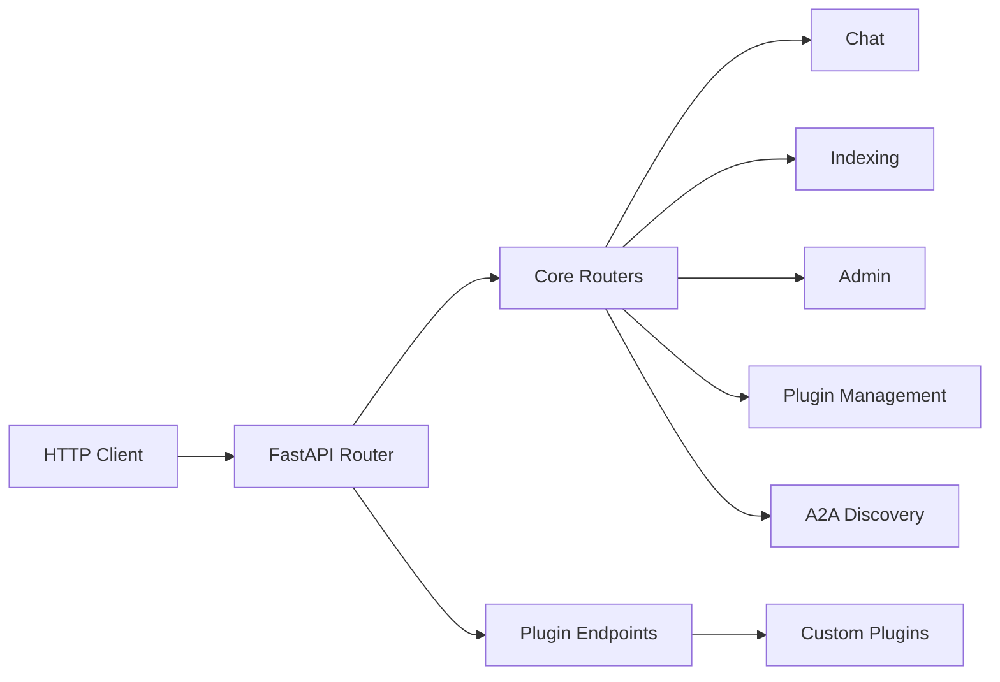

The system exposes a **REST API** based on FastAPI that provides programmatic access to the framework's functionality. Each plugin can extend the API with its custom endpoints.

---

## API Architecture


```mermaid
graph LR
    Client[HTTP Client] --> Router[FastAPI Router]
    Router --> Core[Core Routers]
    Router --> Plugins[Plugin Endpoints]

    Core --> Chat[Chat]
    Core --> Index[Indexing]
    Core --> Admin[Admin]
    Core --> PluginMgmt[Plugin Management]
    Core --> A2A[A2A Discovery]

    Plugins --> Custom[Custom Plugins]
```

**Base URL**: `http://localhost:8000` (configurable via `HOST` and `PORT`,
defaults `0.0.0.0` / `8000`)

!!! info "No global `/api` prefix"
    The framework's application routers ship in the `api_routers` plugin
    (`plugins/api_routers/*`; the modules under `core/routers/*` are thin
    re-export shims). They are mounted **without** a global `/api` prefix, so
    the chat endpoint is `POST /chat`, not `POST /api/chat`. The plugin
    management, Backstage, and frontend-manifest surfaces are the routers that
    actually live under `/api/...` (see below).

---

## API Versioning

The data routers (chat, indexing, metrics, status, feedback, tenant) are also
mounted under a **`/v1`** prefix, in addition to their unprefixed paths:

```text
POST /chat        # unversioned (kept for backward compatibility)
POST /v1/chat     # versioned alias — pin new clients here
```

Both resolve to the same handler, so versioning is **additive** and breaks no
existing client. Set `API_V1_ENABLED=false` to disable the aliases. HTML/admin,
plugin-management, Backstage, and discovery routes are not versioned.

---

## Error Envelope

Every error — framework exceptions, `HTTPException`, request-validation
failures and uncaught exceptions alike — is rendered by `core/api/errors.py`
as an [RFC 9457](https://www.rfc-editor.org/rfc/rfc9457) problem document
(`Content-Type: application/problem+json`), so the API never emits two error
shapes. The `request_id` matches the `X-Request-ID` response header:

```json
{
  "type": "urn:baselith:error:not_found",
  "title": "Not Found",
  "status": 404,
  "detail": "Run 'abc' not found.",
  "instance": "/runs/abc/history",
  "code": "not_found",
  "request_id": "…"
}
```

| Member | Meaning |
|---|---|
| `type` | `urn:baselith:error:<code>` — stable machine classifier |
| `title` | HTTP status phrase |
| `status` | HTTP status code |
| `detail` | Human-readable explanation (an `HTTPException.detail` string lands here unchanged) |
| `instance` | Request path |
| `code` | Stable error code (extension member) |
| `request_id` | Correlation id (extension member) |
| `error_type` | Server-side exception class name (extension; omitted for uncaught exceptions and framework errors mapped to 5xx, so internals are not fingerprinted) |
| `errors` | Per-field `{type, loc, msg}` list — request-validation failures only |

Stable `code` for an `HTTPException`, by status (any other status maps to
`http_error`):

| Status | `code` |
|---|---|
| 400 | `bad_request` |
| 401 | `unauthorized` |
| 403 | `forbidden` |
| 404 | `not_found` |
| 405 | `method_not_allowed` |
| 406 | `not_acceptable` |
| 409 | `conflict` |
| 410 | `gone` |
| 413 | `payload_too_large` |
| 415 | `unsupported_media_type` |
| 422 | `unprocessable_entity` |
| 429 | `rate_limited` |
| 500 | `internal_error` |
| 502 | `bad_gateway` |
| 503 | `service_unavailable` |
| 504 | `gateway_timeout` |

A route that raises a structured `HTTPException(detail={"code": ..., "message": ...})`
promotes its own `code` (for example the step-up MFA gate's `mfa_required`)
and its `message` becomes `detail`. Response headers attached to the exception
(`WWW-Authenticate` on 401, `Retry-After` on 429) are preserved.

Status mapping for framework (`BaselithError`) exceptions:

| Exception | Status | `code` |
|---|---|---|
| `ItemNotFoundError`        | 404 | `not_found` |
| `DuplicateRegistrationError` | 409 | `conflict` |
| `PluginConfigError`        | 400 | `invalid_configuration` |
| `PluginIntegrityError`     | 403 | `integrity_error` |
| `PluginDependencyError`    | 409 | `dependency_error` |
| other `BaselithError` / uncaught | 500 | `internal_error` |

Authorization, quota and budget failures raised by the guards and middleware:

| Exception | Status | `code` |
|---|---|---|
| `InsufficientPermissionsError` (missing role) | 403 | `insufficient_permissions` |
| `InsufficientScopeError` (missing capability)  | 403 | `insufficient_scope` |
| `QuotaExceededError` (usage budget) | 429 | `quota_exceeded` |
| `BudgetExceededError` (per-request cost budget) | 429 | `budget_exceeded` |

Request-validation failures return **422** with code `validation_error`,
`detail` `"Request validation failed."` and the per-field list under `errors`
(the offending `input` is deliberately dropped, so a submitted secret is never
echoed back). Uncaught exceptions return **500** with code `internal_error`
and a generic `detail` — check the logged traceback by `request_id`.

---

## Pagination

Pagination is per endpoint — there is no global scheme:

| Endpoint | Scheme |
| -------- | ------ |
| `GET /webhooks/deliveries` | Opaque cursor: `limit` (default 50, clamped to 200) + `cursor`; the page carries `deliveries`, `next_cursor` and `has_more` |
| `GET /admin/tenants` | `limit` (default 100, max 500) + `offset` |
| `GET /admin/dlq` | `limit` (default 50, max 500) + `offset` |
| `GET /feedbacks` | `limit` only (1–200) |

```bash
GET /webhooks/deliveries?limit=50
# → { "deliveries": [...], "next_cursor": "eyJvZmZzZXQiOjUwfQ", "has_more": true }
GET /webhooks/deliveries?limit=50&cursor=eyJvZmZzZXQiOjUwfQ
```

Cursors are **opaque** — do not parse or construct them; the server may change
the encoding. An invalid cursor returns `400`. The webhooks router is only
mounted with `WEBHOOKS_ENABLED=true` and has no `/v1` alias.

---

## Usage quotas

Beyond per-minute [rate limiting](../core-modules/auth.md#api-key-hashing),
identities can carry **persistent usage budgets** per calendar window (daily /
monthly), enabled with `QUOTAS_ENABLED=true`. When an identity exhausts a
window, requests return `429` with code `quota_exceeded` until the window resets.
Limits default per identity and can be raised per key. See
[Usage Quotas](../core-modules/quotas.md).

---

## Authentication

The framework uses two distinct schemes depending on the surface:

| Surface | Scheme | Dependency |
| ------- | ------ | ---------- |
| Chat (REST + WebSocket), async agent runs, `POST /feedback`, frontend manifest, webhooks / privacy / compliance (plus a capability scope) | API key or Bearer token | `require_user` |
| Plugin management, `GET /status`, `GET /feedbacks` | API key or Bearer token (`admin` role) | `require_admin` |
| Indexing, Backstage | API key or Bearer token (`admin` or `job` role) | `require_admin_or_job` |
| Admin HTML/analytics/DLQ, tenant admin, prompt catalog, `/runs`, `/approvals`, `/metrics` (while `METRICS_AUTH_REQUIRED=true`, the default) | HTTP Basic Auth | `verify_credentials` |

### API Key / Bearer token

Most programmatic endpoints accept either an `X-API-Key` header or an
`Authorization: Bearer <token>` header. The `SecurityManager` resolves the
caller's role (`user`, `admin`, `job` — a `service` identity is treated as
`job` — or `scoped` for least-privilege keys, which only `require_user`
admits) and applies per-role rate limits. HTTP Basic credentials are not
read on these routes.

```bash
curl -H "X-API-Key: your-api-key-here" \
  -H "Content-Type: application/json" \
  -d '{"query": "Hello"}' \
  http://localhost:8000/chat
```

### Capability scopes & federated SSO

Beyond coarse roles, identities can carry fine-grained **capability scopes**
(`resource:action`, e.g. `webhooks:write`) — mint least-privilege keys via
`API_KEYS_SCOPED` and enforce them with `enforce_scopes` / `@require_scopes`. A
denied check returns **403** with code `insufficient_scope`.

Bearer tokens may also be issued by an external **OpenID Connect** provider
(Okta/Auth0/Azure AD/Keycloak): set `OIDC_ENABLED=true` + `OIDC_ISSUER` +
`OIDC_AUDIENCE` and the framework validates the IdP token (local HS256 is tried
first, OIDC as fallback). Full details — scope grammar, role map, claim
mapping — are in [Authentication & Authorization](../core-modules/auth.md).

### HTTP Basic Auth (Admin)

The admin dashboard, analytics and DLQ, tenant management, the prompt
catalog, the `/runs` and `/approvals` operator APIs, and `/metrics` (unless
`METRICS_AUTH_REQUIRED=false`) are protected by **HTTP Basic Auth**, not
API keys. Credentials are read
from the security config (`ADMIN_USER` / `ADMIN_PASS` or `ADMIN_PASS_HASHED`).
Repeated failures trigger an account lockout (5 failures → 15-minute lock).

```bash
curl -u admin:password http://localhost:8000/admin/data
```

!!! note "No JWT login endpoint"
    There is **no** `POST /api/auth/login` route that returns an
    `access_token`. `core/auth/jwt.py` exists as a token-handling library used
    by the API-key/Bearer pipeline, but the framework does not expose a
    username/password login route. Admin access is HTTP Basic Auth.

---

## Chat

Mounted by the `api_routers` plugin (`plugins/api_routers/chat.py`). The whole
router requires authentication (`Depends(require_user)`), so both endpoints
accept the `user`, `admin`, or `job` roles.

### `POST /chat` - Send Message

Main endpoint to interact with the system. Delegates to `ChatService`, which
handles retrieval, reranking, caching, and response generation.

**Request**:

```bash
curl -X POST http://localhost:8000/chat \
  -H "Content-Type: application/json" \
  -H "X-API-Key: your-api-key" \
  -d '{
    "query": "What is the capital of France?",
    "conversation_id": "user123-session",
    "stream": false
  }'
```

**Request Body** (`ChatRequest`, rejects unknown fields):

```json
{
  "query": "string",                 // User query (required, 1–8000 chars)
  "conversation_id": "string",       // Conversation/session id (optional)
  "stream": false,                   // Compatibility flag; use /chat/stream
  "rag_only": false,                 // Restrict to retrieval-only answers
  "kb_label": "string",              // Knowledge-base label filter (optional)
  "tenant_id": "string",             // Accepted, ignored: tenant comes from identity
  "max_response_tokens": 2000        // Upper bound 1–16000 (optional)
}
```

**Response** (`ChatResponse`):

```json
{
  "answer": "The capital of France is Paris.",
  "conversation_id": "user123-session",
  "metadata": {},
  "sources": []
}
```

---

### `POST /chat/stream` - SSE Streaming

Streaming response useful for long answers displayed progressively.

**Stream safety limits** (enforced server-side):

- **Total response size**: hard-capped at **4 MB** per stream to prevent unbounded memory growth. Streams exceeding this are truncated and a `chat_stream_truncated` warning is logged.
- **Per-chunk size**: hard-capped at **64 KB**. Oversized chunks are split transparently.
- **`max_response_tokens`** (optional request field, `1–16000`): client-side upper bound on the number of response tokens. Useful to enforce stricter budgets per request.

**Request**:

```bash
curl -X POST http://localhost:8000/chat/stream \
  -H "Content-Type: application/json" \
  -H "X-API-Key: your-api-key" \
  -d '{"query": "Tell me a long story", "max_response_tokens": 2000}'
```

**Response** (`text/plain` chunked stream):

The endpoint streams the answer as raw UTF-8 text chunks (media type
`text/plain`, `Cache-Control: no-cache`, `X-Accel-Buffering: no`). Each chunk
is part of the answer and can be appended directly:

```text
Once upon a time...
```

---

### WebSocket Chat (`WS /chat/ws`)

Persistent conversational channel (`plugins/api_routers/chat_ws.py`): one
authenticated connection, many turns. SSE (`POST /chat/stream`) remains the
one-shot streaming surface.

**Handshake authorization** — the handshake runs the *same gate* as
`POST /chat` (`require_user`): the same credentials, sent as handshake headers
(`Authorization: Bearer <token>` / `Authorization: ApiKey <key>`, or
`x-api-key`), the same allowed roles (`user`, `admin`, `job`, `scoped` — a
`guest` identity is refused exactly as on REST), the same per-identity rate
limit and the same per-IP throttle on failed credentials. A rejected handshake
is closed *before* the connection is accepted — no model spend for anonymous
sockets — with the HTTP status the gate would have answered, offset by 4000:

| Close code | Meaning |
| ---------- | ------- |
| **4401** | Authentication required (missing/invalid credential) |
| **4403** | Permission denied for this role |
| **4429** | Rate limit exceeded at the handshake |
| **4503** | Gate unavailable (e.g. fail-closed limiter store) |

**Per-turn metering** — the gate runs again on every turn, so one WebSocket
turn is metered exactly like one REST request. A rate-limited turn costs an
`error` frame (with `retry_after` when the limiter supplied one) and the
connection stays open; a credential that expired or was revoked mid-session
closes the socket with 4401/4403 at the next turn. This is what keeps a
long-lived connection from becoming an unmetered channel — the HTTP body-size
and quota middlewares do not see WebSocket scopes. Cross-site WebSocket
hijacking is rejected upstream by the CSWSH origin guard
(`core/middleware/csrf.py`).

**Frames** — the client sends one JSON frame per turn:

```json
{"query": "Tell me a story", "conversation_id": "user123-session"}
```

and receives typed JSON frames back:

| Server frame | Meaning |
| ------------ | ------- |
| `{"type": "chunk", "content": "..."}` | One streamed answer fragment |
| `{"type": "final"}` | The turn is complete — send the next query |
| `{"type": "error", "detail": "..."}` | The frame was rejected (missing `query`, over-long query, rate-limited turn — then with `retry_after`); the connection stays open |

Each turn's stream runs through the **same size guards as SSE** (4 MB total /
64 KB per chunk), and the query is bound by the same `ChatRequest` limits as
the REST chat surface.

```python
import asyncio
import json

import websockets  # pip install websockets


async def chat() -> None:
    async with websockets.connect(
        "ws://localhost:8000/chat/ws",
        additional_headers={"x-api-key": "your-api-key"},
    ) as ws:
        await ws.send(json.dumps({"query": "Tell me a story"}))
        while True:
            frame = json.loads(await ws.recv())
            if frame["type"] == "chunk":
                print(frame["content"], end="", flush=True)
            elif frame["type"] in ("final", "error"):
                break


asyncio.run(chat())
```

### `POST /agent/async` - Async Agent Run

Enqueues one agent request on the task queue (`plugins/api_routers/async_runs.py`)
and returns immediately — for runs too long for a synchronous HTTP response.
Authenticated like the chat surface.

```bash
curl -X POST http://localhost:8000/agent/async \
  -H "x-api-key: your-api-key" \
  -H "Content-Type: application/json" \
  -d '{"query": "Summarize the Q3 incident reports"}'
# 202 → {"task_id": "…", "status_url": "/agent/status/…"}
```

Body: `query` (1–8000 chars, required) and optional `conversation_id`. A queue
outage surfaces as `503`, never a hang.

### `GET /agent/status/{task_id}` - Async Run Status

Polls the TaskTracker record for a submitted run: `404` for an unknown task
id, `503` when the tracker is unreachable. The job itself emits terminal
`agent.completed` / `agent.failed` webhooks, so subscribers need not poll —
see [Task Queue › Async Agent Runs](../core-modules/task-queue.md#async-agent-runs-agentasync).

---

## Health & Monitoring

### `GET /health` - Health Check

Liveness probe (no auth). Cheap, no dependency checks — fails only if the
process is wedged. Use for the Kubernetes `livenessProbe`.

**Response** (200 OK):

```json
{ "status": "ok" }
```

---

### `GET /health/ready` - Readiness Check

Readiness probe (no auth). Verifies critical dependencies and returns **503**
when the database is unreachable, so Kubernetes drains traffic from the pod
until it recovers. Redis and the vector store are reported but advisory
(Redis falls back to in-memory; recall degrades to keyword search), so
neither gates readiness. Results are cached (~30s).

**Response** (200 OK / 503 Service Unavailable):

```json
{ "status": "ready", "services": { "database": true, "redis": true, "vectorstore": true }, "cached": false }
```

---

### `GET /status` - System Status

Returns synthetic counters, the active Qdrant collection, and the indexed
document count. Requires an **admin** API key or Bearer token
(`require_admin`); HTTP Basic credentials are rejected with `401`.

```bash
curl -H "X-API-Key: your-admin-api-key" http://localhost:8000/status
```

---

### `GET /metrics` - Prometheus Metrics

Exports metrics in Prometheus format.

!!! warning "Authentication Required"
    Protected by administrator HTTP Basic Auth (`verify_credentials`) while
    `METRICS_AUTH_REQUIRED=true` (the default), to prevent unauthorized
    scraping of system metrics. Set it to `false` only when the scrape
    endpoint is reachable solely from a trusted network.

```bash
curl -u admin:password http://localhost:8000/metrics
```

---

## Admin & Analytics

The admin surface is HTML + analytics JSON + the dead-letter queue, protected
by **HTTP Basic Auth** (`plugins/api_routers/admin.py`). It is only mounted
when feedback is enabled (`ENABLE_FEEDBACK=true`, the default). The DLQ
endpoints under `/admin/dlq` are listed with the other
[feature-gated routers](#feature-gated-routers).

### `GET /admin` - Admin Dashboard

Serves the admin HTML page (`static/admin.html`).

```bash
curl -u admin:password http://localhost:8000/admin
```

### `GET /admin/data` - Analytics JSON

Aggregated feedback analytics: totals, daily series, recent feedback, and the
most-cited queries/documents.

```bash
curl -u admin:password "http://localhost:8000/admin/data?days=30&recent_limit=20&top_limit=10"
```

| Query param    | Default | Range  | Description                          |
| -------------- | ------- | ------ | ------------------------------------ |
| `days`         | 30      | 1–365  | Analytics time window                |
| `recent_limit` | 20      | 1–100  | Number of recent feedback entries    |
| `top_limit`    | 10      | 1–50   | Max entries for popular queries/docs |

---

## Indexing

Document indexing lifecycle (`plugins/api_routers/index.py`). The whole router
requires admin or job credentials (`require_admin_or_job`).

### `GET /index/status`

Current status of the background indexing engine, including
`bootstrap_enabled` and a derived `state` (`running` / `idle`).

### `POST /index/bootstrap`

Schedule a full or incremental bootstrap. Returns `503` if bootstrapping is
disabled by config, `409` if an indexing job is already running.

```bash
curl -X POST -H "X-API-Key: your-admin-or-job-api-key" \
  "http://localhost:8000/index/bootstrap?force_full=true"
```

### `POST /reindex`

Synchronous incremental reindex of local documents. Returns the number of
newly indexed files; `409` if a job is already running.

---

## Feedback

Recorded when `ENABLE_FEEDBACK` is set (`plugins/api_routers/feedback.py`).

### `POST /feedback`

Record positive/negative feedback for a generated answer. Requires a user
token (`require_user`). Accepts a `FeedbackRequest` body (`query`, `answer`,
`feedback` = `positive`|`negative`, optional `conversation_id`, `sources`,
`comment`).

### `GET /feedbacks`

List recorded feedback entries. Requires admin (`require_admin`). Optional
`feedback` filter (`positive`|`negative`) and `limit` (1–200).

---

## Plugin Management API

Hot-reload and lifecycle management for plugins (`core/plugins/api.py`),
mounted under the `/api/plugins` prefix. The whole router requires admin
(`require_admin`).

| Method & path                              | Description                                  |
| ------------------------------------------ | -------------------------------------------- |
| `GET /api/plugins/`                        | List all plugins with state and metadata     |
| `GET /api/plugins/{name}`                  | Detailed info for a single plugin            |
| `POST /api/plugins/{name}/enable`          | Enable a disabled plugin (optional config)   |
| `POST /api/plugins/{name}/disable`         | Disable an active plugin                      |
| `POST /api/plugins/{name}/reload`          | Hot-reload a plugin (optional new config)    |
| `POST /api/plugins/reload-all`             | Reload all active plugins                     |
| `GET /api/plugins/status/overview`         | Lifecycle summary + dependency graph          |
| `GET /api/plugins/{name}/dependents`       | Plugins depending on this one                 |
| `GET /api/plugins/metrics/{name}`          | Metrics for one plugin                        |
| `GET /api/plugins/metrics/all`             | Metrics for all tracked plugins               |
| `GET /api/plugins/metrics/system/overview` | System-wide aggregated metrics                |
| `GET /api/plugins/metrics/system/performance` | Load/reload/error-rate summary             |
| `DELETE /api/plugins/metrics/{name}`       | Reset metrics for one plugin                  |
| `DELETE /api/plugins/metrics/system/reset` | Reset all plugin metrics                      |

!!! note "Reload is REST-only"
    Hot-reload is exposed via this REST API only; there is **no**
    `reload` subcommand under `baselith plugin`.

### `GET /api/plugins/frontend-manifest`

Returns the manifest of all plugin frontend assets for UI injection. Defined
directly on the app (`core/api/factory.py`), not on the plugin-management
router, and gated by `require_user` (any authenticated role) rather than
admin-only.

---

## Backstage Integration

Software-catalog export endpoints (`core/plugins/exporters/router.py`), mounted
under `/api/backstage`. All endpoints require admin or job credentials.

| Method & path                                       | Description                                   |
| --------------------------------------------------- | --------------------------------------------- |
| `GET /api/backstage/entities`                       | Full Entity Provider payload (all plugins)    |
| `GET /api/backstage/entities/{plugin_name}`         | catalog-info entity for one plugin            |
| `GET /api/backstage/entities/{plugin_name}/patterns` | Detected Agentic Design Pattern labels       |
| `GET /api/backstage/health`                         | Backstage exporter health                     |
| `GET /api/backstage/software-template.yaml`         | Backstage scaffolder Software Template        |
| `GET /api/backstage/publish-template.yaml`          | Backstage publish template                    |
| `POST /api/backstage/publish`                       | Submit a plugin bundle to the marketplace hub |

---

## A2A Discovery

Agent-to-agent discovery card (`core/a2a/router.py`), advertising this
instance's capabilities. No authentication required.

| Method & path                  | Description                          |
| ------------------------------ | ------------------------------------ |
| `GET /.well-known/agent.json`  | Standard A2A agent-card discovery     |
| `GET /a2a/agent-card`          | Alias for the agent card              |

---

## Tenant Administration

Multi-tenant management (`plugins/api_routers/tenant.py`), mounted under the
`/admin/tenants` prefix and protected by **HTTP Basic Auth**
(`verify_credentials`).

| Method & path           | Description           |
| ----------------------- | --------------------- |
| `GET /admin/tenants`    | List tenants, newest first (`limit` 1–500, default 100; `offset`) |
| `POST /admin/tenants`   | Create a tenant (`201`) |

---

## Prompt Catalog Administration

Durable prompt-version and label management
(`plugins/api_routers/prompts.py`), mounted under the `/prompts` prefix and
protected by **HTTP Basic Auth** (`verify_credentials`). Reads always serve
the local registry; the write endpoints require the durable prompt-sync
backend (`BASELITH_PROMPT_SYNC=postgres`) and answer **503** without it, so a
promotion can never silently stay replica-local.

| Method & path | Description |
| ------------- | ----------- |
| `GET /prompts` | List prompts with their versions and labels |
| `POST /prompts/{name}/versions` | Register + persist a new version (`201`) |
| `POST /prompts/{name}/labels/{label}` | Promote a label to an existing version (`404` unknown version) |

See
[Prompt Registry › Durable catalog](../core-modules/prompts.md#durable-catalog-and-cross-replica-sync)
for the write-through semantics and the cross-replica refresh model.

---

## Console

The admin console (`plugins/api_routers/console.py`) is served at `GET /console`
and `GET /console/{path}`, returning `core/static/frontend/index.html`. The
shipped console is a self-contained, dependency-free page (`index.html` +
`console.css` + `console.js`) served same-origin under `/static/frontend/`, so
it satisfies the strict runtime CSP without any external CDN or build step. It
provides a streaming chat client (`/chat/stream` with `/chat` fallback), a live
`/health` badge, a `/status` panel, and an API-key field stored in
`localStorage` and sent as `X-API-Key`. Static assets are mounted under
`/static`.

---

## Plugin Endpoints

Each plugin can register its own routers. Custom plugins typically expose their
endpoints under a plugin-specific prefix; consult each plugin's documentation
for the exact routes.

The framework's own `api_routers` plugin also mounts, at application startup,
the [prompt-catalog admin API](#prompt-catalog-administration) (`/prompts`),
the [WebSocket chat channel](#websocket-chat-ws-chatws) (`/chat/ws`), the
async agent runs (`POST /agent/async`, `GET /agent/status/{task_id}`) and the
feature-gated routers below. None of them has a `/v1` alias, and because they
are registered at lifespan they are absent from a spec exported without running
the app (see [Client SDKs › OpenAPI schema](sdk.md#openapi-schema)).

### Feature-gated routers

| Routes | Auth | Gate |
| ------ | ---- | ---- |
| `GET`/`DELETE /admin/dlq`, `GET`/`DELETE /admin/dlq/{job_id}`, `POST /admin/dlq/{job_id}/replay` — list (`limit`/`offset`), inspect, purge, re-enqueue — [Task Queue › DLQ](../core-modules/task-queue.md#dead-letter-queue-dlq) | HTTP Basic (`verify_credentials`) | `ENABLE_FEEDBACK=true` (default); mounted by `create_app()` |
| `POST`/`GET /webhooks`, `DELETE /webhooks/{endpoint_id}`, `GET /webhooks/deliveries`, `POST /webhooks/deliveries/{delivery_id}/replay` — [Webhooks › Management API](../core-modules/webhooks.md#management-api) | API key / Bearer (`require_user`) + `webhooks:read` / `webhooks:write` scope | `WEBHOOKS_ENABLED=true` |
| `GET /privacy/providers`, `POST /privacy/export`, `POST /privacy/erase`, `POST /privacy/retention/sweep` (`202`) — [Privacy › Admin API](../core-modules/privacy.md#admin-api) | API key / Bearer (`require_user`) + `privacy:manage` scope | `PRIVACY_ENABLED=true` |
| `/compliance/*` — systems, summary, documentation, FRIA, RoPA, post-market, profile, audit — [Compliance › Admin API](../core-modules/compliance.md#admin-api) | API key / Bearer (`require_user`) + `compliance:manage` scope | `COMPLIANCE_ENABLED=true` |
| `GET /runs/{run_id}/history`, `GET /runs/{run_id}/history/{version}`, `GET /runs/{run_id}/events` (SSE), `POST /runs/{run_id}/fork` — [Orchestration › Durable checkpointing](../core-modules/orchestration.md#durable-checkpointing-resume) | HTTP Basic (`verify_credentials`) | `ORCHESTRATOR_CHECKPOINT_ENABLED=true` (default) |
| `GET /approvals`, `POST /approvals/{run_id}/decision`, `POST /approvals/{run_id}/resume` — [Orchestration › Durable approvals](../core-modules/orchestration.md#durable-human-in-the-loop-approvals-pause-decide-resume) | HTTP Basic (`verify_credentials`) | `ORCHESTRATOR_CHECKPOINT_ENABLED=true` (default) |
| `POST /mcp` (JSON-RPC), `DELETE /mcp` (end session), `GET /mcp` (answers `405`) — path from `MCP_HTTP_PATH` (default `/mcp`) — [MCP › Over Streamable HTTP](../core-modules/mcp.md#over-streamable-http) | `Authorization` header (Bearer or `ApiKey`) + `mcp:invoke` scope while `MCP_HTTP_REQUIRE_AUTH=true` (default) | `MCP_HTTP_TRANSPORT_ENABLED=true`; mounted by `create_app()` |

Ops note: when running more than one replica, set
`BASELITH_RUN_EVENTS_BRIDGE=redis` so the `GET /runs/{run_id}/events` SSE feed
can be served by **any** replica, not only the one executing the run — see
[cross-replica delivery](../core-modules/orchestration.md#cross-replica-delivery-the-redis-bridge).

---

## Response Codes

| Code  | Meaning               | When                                |
| ----- | --------------------- | ----------------------------------- |
| `200` | OK                    | Request completed successfully      |
| `201` | Created               | Resource created (`POST /admin/tenants`, `POST /prompts/{name}/versions`, `POST /webhooks`) |
| `202` | Accepted              | Work enqueued (`POST /agent/async`, `POST /privacy/retention/sweep`) |
| `400` | Bad Request           | Invalid parameters                  |
| `401` | Unauthorized          | Missing or invalid API Key          |
| `403` | Forbidden             | Insufficient permissions            |
| `404` | Not Found             | Endpoint or resource not found      |
| `409` | Conflict              | Duplicate resource or a job already running |
| `422` | Unprocessable Entity  | Request validation failed (`code: validation_error`) |
| `429` | Too Many Requests     | Rate limit exceeded                 |
| `500` | Internal Server Error | Server error                        |
| `503` | Service Unavailable   | System temporarily unavailable      |

---

## Errors

Every error body is an RFC 9457 problem document — see
[Error Envelope](#error-envelope) for the members and the stable `code`
table. A request-validation failure, for example:

```json
{
  "type": "urn:baselith:error:validation_error",
  "title": "Unprocessable Entity",
  "status": 422,
  "detail": "Request validation failed.",
  "instance": "/chat",
  "code": "validation_error",
  "request_id": "…",
  "error_type": "RequestValidationError",
  "errors": [
    { "type": "missing", "loc": ["body", "query"], "msg": "Field required" }
  ]
}
```

Branch on `code`, not on `detail`: the human-readable text may change, the
code is the stable contract.

---

## Rate Limiting

Rate limits are enforced per authenticated identity by the `require_*`
dependencies (`core/middleware/rate_limiter.py`): a Redis-backed fixed window
of `RATE_LIMIT_WINDOW_SECONDS` (default `60`), with an in-memory fallback when
Redis is unavailable. With `AUTH_REQUIRED=false` and no API keys configured,
anonymous traffic on user routes is metered per client IP with the same limit.

| Setting | Default | Applies to |
| ------- | ------- | ---------- |
| `RATE_LIMIT_USER_PER_MINUTE` | `60` | `require_user` routes (chat, feedback, webhooks, …) |
| `RATE_LIMIT_ADMIN_PER_MINUTE` | `120` | `require_admin` routes |
| `RATE_LIMIT_JOB_PER_MINUTE` | unset — falls back to the admin limit | `require_admin_or_job` routes (indexing, Backstage) |
| `AUTH_FAILURE_LIMIT_PER_MINUTE` | `20` | Failed authentication attempts **per source IP** on every `require_*` route (successful auth never counts) |
| `RATE_LIMIT_FAIL_MODE` | unset — `closed` in production with a Redis cache backend, else `open` | Redis unreachable: `open` degrades to a per-process window, `closed` answers `503` |

There is no hourly budget; persistent per-window budgets are the separate
[usage quotas](#usage-quotas) feature.

A throttled request gets **429** with code `rate_limited` and the IETF
`RateLimit` headers plus `Retry-After`. Successful responses carry no
rate-limit headers:

```http
HTTP/1.1 429 Too Many Requests
Content-Type: application/problem+json
Retry-After: 42
RateLimit-Limit: 60
RateLimit-Remaining: 0
RateLimit-Reset: 42
```

All limits live in `SecurityConfig` (`core/config/security.py`).

---

## Complete Examples

### Simple Chat

```python
import requests

response = requests.post(
    "http://localhost:8000/chat",
    headers={"X-API-Key": "your-api-key"},
    json={
        "query": "Hello, how are you?",
        "conversation_id": "user123"
    }
)

data = response.json()
print(data["answer"])
```

---

### SSE Streaming

```python
import requests
import json

response = requests.post(
    "http://localhost:8000/chat/stream",
    headers={"X-API-Key": "your-api-key"},
    json={"query": "Tell me a story"},
    stream=True
)

# /chat/stream emits raw text chunks (media type text/plain), not SSE events.
for chunk in response.iter_content(chunk_size=None):
    print(chunk.decode("utf-8", errors="replace"), end="", flush=True)
```

---

## Interactive Documentation

Access interactive Swagger/OpenAPI documentation:

- **Swagger UI**: `http://localhost:8000/docs`
- **ReDoc**: `http://localhost:8000/redoc`
- **OpenAPI JSON**: `http://localhost:8000/openapi.json`

From here you can test endpoints directly from the browser.

!!! warning "Disabled in production — and when the environment is undeclared"
    `create_app()` turns all three endpoints **off** when the runtime
    environment resolves to production, and also when `AUTH_REQUIRED` is on
    but neither `APP_ENV` nor `ENVIRONMENT` is declared. That undeclared shape
    now arms the full assumed-production posture — `is_production_env()`
    returns `True` for *every* production gate (plugin signature enforcement,
    unsigned-A2A rejection, the A2A SSRF deny), not just `/docs` — and logs a
    warning at startup. Declare a known environment (e.g.
    `APP_ENV=development`) to opt out locally, or force the docs explicitly
    with `DOCS_ENABLED=true`.

---

## Best Practices

!!! tip "Use conversation_id"
    Always pass the same `conversation_id` to maintain conversational context across multiple requests. `ChatRequest` rejects unknown fields, so a `session_id` key is answered with `422`.

!!! tip "Handle Rate Limiting"
    Implement retry with exponential backoff when receiving 429.

!!! warning "Secure API Keys"
    Don't commit API keys in code. Use environment variables.

!!! tip "Streaming for UX"
    Use `/chat/stream` for long responses to improve user experience.
