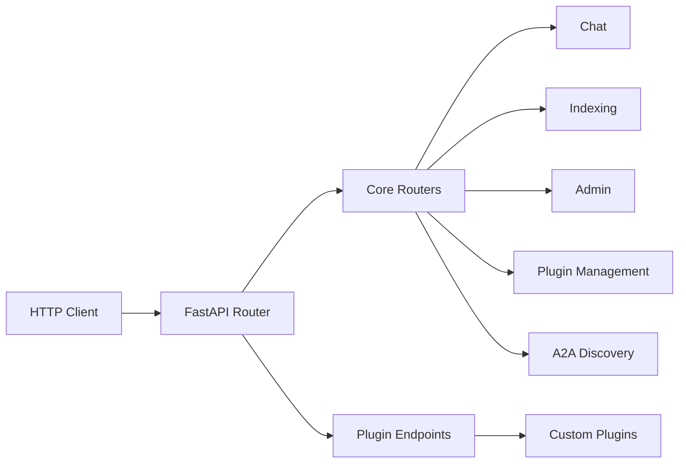

The system exposes a **REST API** based on FastAPI that provides programmatic access to the framework's functionality. Each plugin can extend the API with its custom endpoints.

---

## API Architecture


```mermaid
graph LR
    Client[HTTP Client] --> Router[FastAPI Router]
    Router --> Core[Core Routers]
    Router --> Plugins[Plugin Endpoints]

    Core --> Chat[Chat]
    Core --> Index[Indexing]
    Core --> Admin[Admin]
    Core --> PluginMgmt[Plugin Management]
    Core --> A2A[A2A Discovery]

    Plugins --> Custom[Custom Plugins]
```

**Base URL**: `http://localhost:8000` (configurable via `HOST` and `PORT`,
defaults `0.0.0.0` / `8000`)

!!! info "No global `/api` prefix"
    The framework's application routers ship in the `api_routers` plugin
    (`plugins/api_routers/*`; the modules under `core/routers/*` are thin
    re-export shims). They are mounted **without** a global `/api` prefix, so
    the chat endpoint is `POST /chat`, not `POST /api/chat`. The plugin
    management, Backstage, and frontend-manifest surfaces are the routers that
    actually live under `/api/...` (see below).

The clean Docker Core profile can start without the legacy `api_routers` plugin.
Its fallback exposes `/health` and `/health/ready`; those minimal responses do
not certify every optional service or plugin. Missing legacy application routes
remain unavailable. The fallback admin credential dependency returns 404 when
the admin router plugin is absent; it does not grant access. See the
[Docker Core runbook](../getting-started/docker-core.md) for installation checks.

!!! info "The site root `/`"
    No route is registered at `/`, so the bare hostname answers `404`: the
    homepage of an installation is one of the plugin SPAs it loaded, which the
    framework cannot guess. Setting `BASELITH_ROOT_REDIRECT` to a
    site-relative path (e.g. `/<plugin>/`) makes `GET /` and `HEAD /` answer a
    `307` to it; anything that is not such a path — an absolute URL, a
    protocol-relative `//host`, a backslash, an embedded newline, or `/`
    itself — fails the boot instead of becoming an open redirect.

---

## API Versioning

Every API router is mounted under a **`/v1`** prefix — the stable contract to
pin clients to (both SDKs already do) — and, for backward compatibility, at
its historical unprefixed path:

```text
POST /v1/chat     # versioned — pin clients here
POST /chat        # unprefixed — still served, deprecated
```

Versioned: chat (`/chat`, `/chat/stream`), indexing (`/index/*`, `/reindex`),
feedback, the plugin-management API (`/api/plugins/*`), and the routers the
`api_routers` plugin mounts — `/compliance`, `/approvals`, `/runs`,
`/webhooks`, `/privacy`, `/prompts` and `/agent` — and the WebSocket chat
channel (`/v1/chat/ws`, see below).

The unprefixed copies are **deprecated**: their operations carry
`deprecated: true` in the OpenAPI document, and every response they produce —
errors included — carries the runtime signal:

```http
Deprecation: @1791072000
Link: </v1/chat>; rel="successor-version"
```

`Deprecation` ([RFC 9745](https://www.rfc-editor.org/rfc/rfc9745)) is the
date the unprefixed path was deprecated (2026-10-04); the `Link`
([RFC 5829](https://www.rfc-editor.org/rfc/rfc5829) `successor-version`) names
the `/v1` path to move to. Both headers are CORS-exposed. No removal date is
set yet; a `Sunset` header will announce one.

Not versioned (one unprefixed path, never deprecated): health and readiness
probes, `/metrics`, `/status`, `/admin/*`, the console, Backstage, discovery
(`/.well-known/*`) and MCP — probes, Prometheus, nginx and the Helm chart
address them directly. `/metrics`,
`/status` and `/admin/tenants` keep their historical `/v1` aliases.

The WebSocket chat channel is served at **`/v1/chat/ws`** (canonical) and at
`/chat/ws`, which is **deprecated** but carries no runtime signal: a WebSocket
handshake has no response a client reliably reads `Deprecation`/`Link`
headers from, so the deprecation is announced here only. Move WebSocket
clients to `/v1/chat/ws`.

Set `API_V1_ENABLED=false` to disable the `/v1` copies; the unprefixed paths
are then the only ones and are not marked deprecated.

---

## Browser clients (CORS)

Only the origins listed in `ALLOW_ORIGINS` may call the API from a browser;
the default is empty, which blocks every cross-origin request — the right
posture for an API with no browser front end. Credentials are allowed for a
concrete origin list and disabled under the `*` wildcard, which is the
standard rule (a wildcard and credentials cannot be combined).

Allowed request headers (anything else fails the preflight): `Content-Type`,
`Authorization`, `X-API-Key` (the TypeScript SDK's API-key header),
`X-Requested-With`, `X-Request-ID`, `Idempotency-Key`, `Accept`, `Origin`, the
MCP Streamable HTTP headers `Mcp-Session-Id`, `Mcp-Protocol-Version`,
`Mcp-Method` and `Mcp-Name`, and `Last-Event-ID` (SSE resumption).

**`Idempotency-Key` on mutating requests.** An authenticated `POST`/`PUT`/
`PATCH`/`DELETE` carrying `Idempotency-Key` has its response stored and replayed
(with `Idempotency-Replayed: true`) for a retry with the same key and
credential. The key is bound to the request body and query string: reusing it with a
**different body** or a **different query string** returns `422` rather than the first request's response, and
a retry while the original is still running returns `409`. Only requests with a
credential that authenticates and that match a route are stored; `404`, `405`,
`5xx` and retryable statuses never are. See
[IdempotencyMiddleware](../core-modules/middleware.md#idempotencymiddleware).

Six response headers are **exposed** to the calling script, since a browser
cannot read any other: `X-Request-ID` (the correlation id to quote in a bug
report), `Idempotency-Replayed`, `Retry-After`, `Mcp-Session-Id` (how an
MCP browser client learns its session id from the `initialize` response), and
`Deprecation` / `Link` (the [deprecated-path signal](#api-versioning)).

A preflight answer stays cacheable in the browser for **7200 seconds**. The
framework default is Starlette's 600s, at which a dashboard making
credentialed JSON calls re-asks `OPTIONS` for every distinct URL every ten
minutes — a full round trip that gates the real request. 7200s is the ceiling
Chromium honours (Firefox allows up to 86400). The price is latency on a
policy change: a browser tab that is already open picks up an edited
`ALLOW_ORIGINS`, method or header list within two hours rather than ten
minutes, so widen the lists before you need them and treat narrowing as a
change that reaches clients slowly.

---

## Error Envelope

Every error — framework exceptions, `HTTPException`, request-validation
failures and uncaught exceptions alike — is rendered by `core/api/errors.py`
as an [RFC 9457](https://www.rfc-editor.org/rfc/rfc9457) problem document
(`Content-Type: application/problem+json`), so the API never emits two error
shapes. The `request_id` matches the `X-Request-ID` response header:

```json
{
  "type": "urn:baselith:error:not_found",
  "title": "Not Found",
  "status": 404,
  "detail": "Run 'abc' not found.",
  "instance": "/runs/abc/history",
  "code": "not_found",
  "request_id": "…"
}
```

| Member | Meaning |
|---|---|
| `type` | `urn:baselith:error:<code>` — stable machine classifier |
| `title` | HTTP status phrase |
| `status` | HTTP status code |
| `detail` | Human-readable explanation (an `HTTPException.detail` string lands here unchanged) |
| `instance` | Request path |
| `code` | Stable error code (extension member) |
| `request_id` | Correlation id (extension member) |
| `error_type` | Server-side exception class name (extension; omitted for uncaught exceptions and framework errors mapped to 5xx, so internals are not fingerprinted) |
| `errors` | Per-field `{type, loc, msg}` list — request-validation failures only |

Stable `code` for an `HTTPException`, by status (any other status maps to
`http_error`):

| Status | `code` |
|---|---|
| 400 | `bad_request` |
| 401 | `unauthorized` |
| 403 | `forbidden` |
| 404 | `not_found` |
| 405 | `method_not_allowed` |
| 406 | `not_acceptable` |
| 409 | `conflict` |
| 410 | `gone` |
| 413 | `payload_too_large` |
| 415 | `unsupported_media_type` |
| 422 | `unprocessable_entity` |
| 429 | `rate_limited` |
| 500 | `internal_error` |
| 502 | `bad_gateway` |
| 503 | `service_unavailable` |
| 504 | `gateway_timeout` |

A route that raises a structured `HTTPException(detail={"code": ..., "message": ...})`
promotes its own `code` (for example the step-up MFA gate's `mfa_required`)
and its `message` becomes `detail`. Response headers attached to the exception
(`WWW-Authenticate` on 401, `Retry-After` on 429) are preserved.

Status mapping for framework (`BaselithError`) exceptions:

| Exception | Status | `code` |
|---|---|---|
| `ItemNotFoundError`        | 404 | `not_found` |
| `DuplicateRegistrationError` | 409 | `conflict` |
| `PluginConfigError`        | 400 | `invalid_configuration` |
| `PluginIntegrityError`     | 403 | `integrity_error` |
| `PluginDependencyError`    | 409 | `dependency_error` |
| other `BaselithError` / uncaught | 500 | `internal_error` |

Authorization, quota and budget failures raised by the guards and middleware:

| Exception | Status | `code` |
|---|---|---|
| `InsufficientPermissionsError` (missing role) | 403 | `insufficient_permissions` |
| `InsufficientScopeError` (missing capability)  | 403 | `insufficient_scope` |
| `QuotaExceededError` (usage budget) | 429 | `quota_exceeded` |
| `BudgetExceededError` (per-request cost budget) | 429 | `budget_exceeded` |

Database outages are infrastructure conditions, not defects:

| Exception | Status | `code` |
|---|---|---|
| `psycopg_pool.PoolTimeout` (no connection within `DB_POOL_TIMEOUT`) | 503 | `service_unavailable` |
| `psycopg.OperationalError` (connection refused, server shut down, query cancelled) | 503 | `service_unavailable` |

Both carry `Retry-After: 5`; the driver's class and message (which can name
the database host) are logged at WARNING and never returned to the caller.

Refusals answered by a middleware layer before any route runs are problem
documents too — same media type, `request_id` and `instance`:

| Layer | Status | `code` |
|---|---|---|
| `CostControlMiddleware` (per-request budget; `Retry-After` when the breach carries a hint) | 429 | `budget_exceeded` |
| `PluginActivationMiddleware` (plugin failed to activate / not ready; `Retry-After` during the backoff) | 503 | `plugin_unavailable` |
| `CSRFOriginMiddleware` (cross-site state-changing request) | 403 | `csrf_origin_rejected` |
| `IdempotencyMiddleware` — key too long | 400 | `idempotency_key_invalid` |
| `IdempotencyMiddleware` — same key still in flight | 409 | `idempotency_key_in_flight` |
| `IdempotencyMiddleware` — same key, different body or query | 422 | `idempotency_key_mismatch` |

A budget breach never names the configured thresholds: `detail` is the fixed
`"Request budget exceeded for this deployment."` whether the middleware or the
exception handler answers it; the limits are in the operator log.

Request-validation failures return **422** with code `validation_error`,
`detail` `"Request validation failed."` and the per-field list under `errors`
(the offending `input` is deliberately dropped, so a submitted secret is never
echoed back). Uncaught exceptions return **500** with code `internal_error`
and a generic `detail` — check the logged traceback by `request_id`. The
`500` is rendered by `UnhandledErrorMiddleware` inside the request-id,
security-header and CORS layers, so it carries the `X-Request-ID` header, a
non-null `request_id` member, the security headers and — for an allowed
browser origin — `Access-Control-Allow-Origin`, like every other error. See
[UnhandledErrorMiddleware](../core-modules/middleware.md#unhandlederrormiddleware).

---

## Pagination

The list endpoints of the API routers share one **cursor** contract
(`core.api.pagination.page_params` + `paginated`):

- Query: `limit` — `1..200`, default `50` (the bounds are in the OpenAPI
  schema; out of range is a `422`) — and `cursor`, the opaque `next_cursor` of
  the previous page.
- Body: the endpoint's historical list key (`systems`, `endpoints`,
  `history`, …) holding **this page**, `count` (items in this page),
  `next_cursor` (`null` on the last page) and `has_more`. A client that
  ignores the two new members keeps working; it just sees the first page.

```bash
GET /v1/webhooks/deliveries?limit=50
# → { "deliveries": [...], "count": 50, "next_cursor": "eyJvZmZzZXQiOjUwfQ", "has_more": true }
GET /v1/webhooks/deliveries?limit=50&cursor=eyJvZmZzZXQiOjUwfQ
```

| Endpoint | List key | Notes |
| -------- | -------- | ----- |
| `GET /webhooks`, `GET /webhooks/deliveries` | `endpoints`, `deliveries` | |
| `GET /compliance/systems`, `/pending-registration` | `systems` | |
| `GET /compliance/documentation`, `/fria`, `/dpia` | `documents`, `assessments` | |
| `GET /compliance/ropa`, `/automated-decisions` | `activities` | `in_scope` counts the whole registry |
| `GET /compliance/post-market`, `/risk-management`, `/instructions` | `plans`, `files`, `instructions` | |
| `GET /prompts` | `prompts` | sorted by name; `total` counts every prompt |
| `GET /runs/{run_id}/history` | `history` | |
| `GET /approvals` | `pending` | newest first; keyset cursor on `(updated_at, run_id)` |

`GET /approvals` lists only runs whose status is `awaiting_approval` (crash
recovery rows are never scanned) and loads only the page's checkpoints,
concurrently. Its cursor is a keyset, so a decision landing between two page
fetches — which removes that run from the listing — never makes the next page
skip or repeat an entry. The listing covers the 500 most recent pending runs;
a fuller backlog logs `approvals_listing_window_full`.

Cursors are **opaque** — do not parse or construct them; the server may change
the encoding. An invalid cursor returns `400`. Older operator surfaces keep
their own scheme:

| Endpoint | Scheme |
| -------- | ------ |
| `GET /admin/tenants` | `limit` (default 100, max 500) + `offset` |
| `GET /admin/dlq` | `limit` (default 50, max 500) + `offset` |
| `GET /feedbacks` | `limit` only (default 50, max 200), newest first |

---

## Usage quotas

Beyond per-minute [rate limiting](../core-modules/auth.md#api-key-hashing),
identities can carry **persistent usage budgets** per calendar window (daily /
monthly), enabled with `QUOTAS_ENABLED=true`. When an identity exhausts a
window, requests return `429` until the window resets, with `Retry-After` set
to the seconds left in that window (until midnight UTC, or the first of next
month). An unreachable quota store answers `503` with `Retry-After: 5`.
Limits default per identity and can be raised per key. A request that is
admitted but then answered `401`/`403`/`404`/`405`/`409`/`429`/`503`, or
answered from the idempotency store (`Idempotency-Replayed`), does not spend
a unit; a per-request cost-budget `429` (`budget_exceeded`) does, because the
handler ran first. See
[Usage Quotas](../core-modules/quotas.md).

---

## Authentication

The framework uses two distinct schemes depending on the surface:

| Surface | Scheme | Dependency |
| ------- | ------ | ---------- |
| Chat (REST + WebSocket), async agent runs, `POST /feedback`, frontend manifest, webhooks / privacy / compliance (plus a capability scope) | API key or Bearer token | `require_user` |
| Plugin management, `GET /status`, `GET /feedbacks` | API key or Bearer token (`admin` role) | `require_admin` |
| Indexing, Backstage | API key or Bearer token (`admin` or `job` role) | `require_admin_or_job` |
| Admin HTML/analytics/DLQ, `/admin/status`, `/admin/reindex`, tenant admin, prompt catalog, `/runs`, `/approvals`, `/metrics` (while `METRICS_AUTH_REQUIRED=true`, the default) | HTTP Basic Auth | `verify_credentials` |

### API Key / Bearer token

Most programmatic endpoints accept either an `X-API-Key` header or an
`Authorization: Bearer <token>` header. The `SecurityManager` resolves the
caller's role (`user`, `admin`, `job` — a `service` identity is treated as
`job` — or `scoped` for least-privilege keys, which only `require_user`
admits) and applies per-role rate limits through the sliding-window
[`RateLimiter`](../core-modules/middleware.md#ratelimiter) — the only limiter
in the stack; no secondary per-route limiter is initialised at startup. HTTP
Basic credentials are not read on these routes.

```bash
curl -H "X-API-Key: your-api-key-here" \
  -H "Content-Type: application/json" \
  -d '{"query": "Hello"}' \
  http://localhost:8000/chat
```

### Capability scopes & federated SSO

Beyond coarse roles, identities can carry fine-grained **capability scopes**
(`resource:action`, e.g. `webhooks:write`) — mint least-privilege keys via
`API_KEYS_SCOPED` and enforce them with `enforce_scopes` / `@require_scopes`. A
denied check returns **403** with code `insufficient_scope`.

Bearer tokens may also be issued by an external **OpenID Connect** provider
(Okta/Auth0/Azure AD/Keycloak): set `OIDC_ENABLED=true` + `OIDC_ISSUER` +
`OIDC_AUDIENCE` and the framework validates the IdP token (local HS256 is tried
first, OIDC as fallback). Full details — scope grammar, role map, claim
mapping — are in [Authentication & Authorization](../core-modules/auth.md).

### HTTP Basic Auth (Admin)

The admin dashboard, analytics and DLQ, tenant management, the prompt
catalog, the `/runs` and `/approvals` operator APIs, and `/metrics` (unless
`METRICS_AUTH_REQUIRED=false`) are protected by **HTTP Basic Auth**, not
API keys. Credentials are read
from the security config (`ADMIN_USER` / `ADMIN_PASS` or `ADMIN_PASS_HASHED`).
Repeated failures trigger an account lockout (5 failures → 15-minute lock).

```bash
curl -u admin:password http://localhost:8000/admin/data
```

!!! note "No JWT login endpoint"
    There is **no** `POST /api/auth/login` route that returns an
    `access_token`. `core/auth/jwt.py` exists as a token-handling library used
    by the API-key/Bearer pipeline, but the framework does not expose a
    username/password login route. Admin access is HTTP Basic Auth.

---

## Chat

Mounted by the `api_routers` plugin (`plugins/api_routers/chat.py`). The whole
router requires authentication (`Depends(require_user)`), so both endpoints
accept the `user`, `admin`, or `job` roles.

### `POST /chat` - Send Message

Main endpoint to interact with the system. Delegates to `ChatService`, which
handles retrieval, reranking, caching, and response generation.

**Request**:

```bash
curl -X POST http://localhost:8000/chat \
  -H "Content-Type: application/json" \
  -H "X-API-Key: your-api-key" \
  -d '{
    "query": "What is the capital of France?",
    "conversation_id": "user123-session",
    "stream": false
  }'
```

**Request Body** (`ChatRequest`, rejects unknown fields):

```json
{
  "query": "string",                 // User query (required, 1–8000 chars)
  "conversation_id": "string",       // Conversation/session id (optional)
  "stream": false,                   // Compatibility flag; use /chat/stream
  "rag_only": false,                 // Restrict to retrieval-only answers
  "kb_label": "string",              // Knowledge-base label filter (optional)
  "tenant_id": "string",             // Accepted, ignored: tenant comes from identity
  "max_response_tokens": 2000        // Upper bound 1–16000 (optional)
}
```

**Response** (`ChatResponse`):

```json
{
  "answer": "The capital of France is Paris.",
  "conversation_id": "user123-session",
  "metadata": {},
  "sources": []
}
```

---

### `POST /chat/stream` - SSE Streaming

Streaming response useful for long answers displayed progressively.

**Stream safety limits** (enforced server-side):

- **Total response size**: hard-capped at **4 MB** per stream to prevent unbounded memory growth. Streams exceeding this are truncated and a `chat_stream_truncated` warning is logged.
- **Per-chunk size**: hard-capped at **64 KB**. Oversized chunks are split transparently.
- **Wall clock**: `CHAT_STREAM_TIMEOUT_SECONDS` (default `300.0`) bounds the whole response; on expiry the stream is closed cleanly with its terminal `event: done` frame rather than dropped mid-token.
- **Client disconnect**: the generator stops as soon as the client is gone, releasing the upstream LLM call instead of leaving it running (and billing).
- **Heartbeat**: while the model is quiet a `: keepalive` comment frame goes out every `SSE_HEARTBEAT_SECONDS` (default `15`), so a proxy or client idle timeout does not drop a stream that is merely waiting; the client is re-checked on every heartbeat. Comment frames are ignored by every SSE consumer, both SDKs included.
- **Identifiers**: `conversation_id`, `kb_label` and `tenant_id` are capped at 128 characters (`422` beyond).
- **`max_response_tokens`** (optional request field, `1–16000`): client-side upper bound on the number of response tokens. Useful to enforce stricter budgets per request.

**Request**:

```bash
curl -X POST http://localhost:8000/chat/stream \
  -H "Content-Type: application/json" \
  -H "X-API-Key: your-api-key" \
  -d '{"query": "Tell me a long story", "max_response_tokens": 2000}'
```

**Response** (`text/event-stream`):

The endpoint streams the answer as **Server-Sent Events**
(`Cache-Control: no-cache`, `X-Accel-Buffering: no`). One `data:` frame per
model chunk — a chunk containing newlines becomes one `data:` line per line —
and a terminal `event: done` that lets a client tell "the model finished" apart
from "the connection died". Every event carries an `id:`, numbered from `1`
per response:

```text
id: 1
data: Once upon a time...

: keepalive

id: 2
data: and they lived happily ever after.

id: 3
event: done
data: [DONE]

```

There is no replay: a completion cannot be resumed from an event index, so a
`Last-Event-ID` is ignored and a client that lost the connection re-sends the
request. The ids exist so a client can tell exactly which events it received.

If the stream fails mid-flight, an `event: error` frame goes out before the
terminal event. Its `data:` is a JSON object with a stable `code`, a fixed
`detail` and the request's `request_id` (the same value as the
`X-Request-ID` response header):

```text
id: 2
event: error
data: {"code":"stream_failed","detail":"stream failed","request_id":"…"}

id: 3
event: done
data: [DONE]

```

The payload is deliberately fixed — the exception text can carry provider
detail, prompt fragments or credentials, and it is already in the server log
under `chat_stream_failed`, keyed by that `request_id`. Servers before this
change sent the bare text `stream failed`; both SDKs accept either form.

---

### WebSocket Chat (`WS /v1/chat/ws`)

Persistent conversational channel (`plugins/api_routers/chat_ws.py`): one
authenticated connection, many turns. SSE (`POST /chat/stream`) remains the
one-shot streaming surface. Connect to `/v1/chat/ws`; the unprefixed
`/chat/ws` still works but is deprecated (see
[API Versioning](#api-versioning)).

**Handshake authorization** — the handshake runs the *same gate* as
`POST /chat` (`require_user`): the same credentials, sent as handshake headers
(`Authorization: Bearer <token>` / `Authorization: ApiKey <key>`, or
`x-api-key`), the same allowed roles (`user`, `admin`, `job`, `scoped` — a
`guest` identity is refused exactly as on REST), the same per-identity rate
limit and the same per-IP throttle on failed credentials. A rejected handshake
is closed *before* the connection is accepted — no model spend for anonymous
sockets — with the HTTP status the gate would have answered, offset by 4000:

| Close code | Meaning |
| ---------- | ------- |
| **4401** | Authentication required (missing/invalid credential) |
| **4403** | Permission denied for this role |
| **4429** | Rate limit exceeded at the handshake |
| **4503** | Gate unavailable (e.g. fail-closed limiter store) |

**Per-turn metering** — the gate runs again on every turn, so one WebSocket
turn is metered exactly like one REST request. A rate-limited turn costs an
`error` frame (with `retry_after` when the limiter supplied one) and the
connection stays open; a credential that expired or was revoked mid-session
closes the socket with 4401/4403 at the next turn. This is what keeps a
long-lived connection from becoming an unmetered channel — the HTTP body-size
and quota middlewares do not see WebSocket scopes. Cross-site WebSocket
hijacking is rejected upstream by the CSWSH origin guard
(`core/middleware/csrf.py`).

**Frames** — the client sends one JSON frame per turn:

```json
{"query": "Tell me a story", "conversation_id": "user123-session"}
```

and receives typed JSON frames back:

| Server frame | Meaning |
| ------------ | ------- |
| `{"type": "chunk", "content": "..."}` | One streamed answer fragment |
| `{"type": "final"}` | The turn is complete — send the next query |
| `{"type": "error", "detail": "..."}` | The frame was rejected (missing `query`, over-long query, rate-limited turn — then with `retry_after`), or the turn hit its deadline (`"stream timed out"`, followed by `final`); the connection stays open |

Each turn's stream runs through the **same size guards as SSE** (4 MB total /
64 KB per chunk) and the **same wall-clock budget**
(`CHAT_STREAM_TIMEOUT_SECONDS`, default 300 s), and the query is bound by the
same `ChatRequest` limits as the REST chat surface. The upstream stream is
closed on every exit — deadline, error or client disconnect — so the LLM call
behind an abandoned turn is released instead of running on.

```python
import asyncio
import json

import websockets  # pip install websockets


async def chat() -> None:
    async with websockets.connect(
        "ws://localhost:8000/v1/chat/ws",
        additional_headers={"x-api-key": "your-api-key"},
    ) as ws:
        await ws.send(json.dumps({"query": "Tell me a story"}))
        while True:
            frame = json.loads(await ws.recv())
            if frame["type"] == "chunk":
                print(frame["content"], end="", flush=True)
            elif frame["type"] in ("final", "error"):
                break


asyncio.run(chat())
```

### `POST /agent/async` - Async Agent Run

Enqueues one agent request on the task queue (`plugins/api_routers/async_runs.py`)
and returns immediately — for runs too long for a synchronous HTTP response.
Authenticated like the chat surface.

```bash
curl -X POST http://localhost:8000/agent/async \
  -H "x-api-key: your-api-key" \
  -H "Content-Type: application/json" \
  -d '{"query": "Summarize the Q3 incident reports"}'
# 202 → {"task_id": "…", "status_url": "/v1/agent/status/…"}
#       Location: /v1/agent/status/…
```

Body: `query` (1–8000 chars, required) and optional `conversation_id` (≤128
chars). The poll URL is returned both as `status_url` and in the `Location`
header, under `/v1` (unprefixed when `API_V1_ENABLED=false`). A queue
outage surfaces as `503`, never a hang.

### `GET /agent/status/{task_id}` - Async Run Status

Polls the TaskTracker record for a submitted run: `404` for an unknown task
id, `503` when the tracker is unreachable. The job itself emits terminal
`agent.completed` / `agent.failed` webhooks, so subscribers need not poll —
see [Task Queue › Async Agent Runs](../core-modules/task-queue.md#async-agent-runs-agentasync).

---

## Health & Monitoring

### `GET /health` - Health Check

Liveness probe (no auth). Cheap, no dependency checks — fails only if the
process is wedged. Use for the Kubernetes `livenessProbe`.

**Response** (200 OK):

```json
{ "status": "ok" }
```

---

### `GET /health/ready` - Readiness Check

Readiness probe (no auth). Verifies critical dependencies and returns **503**
when the database is unreachable, so Kubernetes drains traffic from the pod
until it recovers. Redis and the vector store are reported but advisory
(Redis falls back to in-memory; recall degrades to keyword search), so
neither gates readiness. `vectorstore` is `false` both when the store is
unreachable and when it answers but the configured collection does not exist
(the server log says which); a provider without a cheap probe (pgvector)
reports `true`. The three probes run concurrently, so a cache miss costs the
slowest probe's timeout rather than the sum of the three. Results are cached
(~30s).

With PostgreSQL down at boot the app still starts — in well under a second,
since every boot step reuses one short reachability probe instead of waiting
out a pool timeout each (see
[PostgreSQL down at boot](../core-modules/db.md#postgresql-down-at-boot-one-probe-not-a-timeout-per-step))
— and this probe answers 503 until the database returns.

Once the process has received SIGTERM/SIGINT it answers **503** with
`{"status": "draining", "services": {}, "cached": false}` immediately — no
dependency check, cached result ignored — so the pod leaves the Service
endpoints while uvicorn finishes in-flight requests, even though its database
is fine. The plugin-less fallback route behaves the same way.

**Response** (200 OK / 503 Service Unavailable):

```json
{ "status": "ready", "services": { "database": true, "redis": true, "vectorstore": true }, "cached": false }
```

!!! warning "Some misconfigurations never reach this probe"
    A readiness probe reports on a running app. Three security postures are
    checked *before* the app starts serving and **refuse the boot in
    production** instead of answering 503 — an empty `TRUSTED_HOSTS`, an
    unbound JWT trust perimeter, and a database role that silently bypasses
    row-level security while `DB_RLS_ENABLED=true`
    (`core.api.startup_checks` → [`core.db.rls_posture`](../core-modules/db.md#is-row-level-security-actually-enforced)).
    Each names its own auditable opt-out in the failure message. A pod
    crash-looping with one of those errors is not an outage to route around;
    it is the framework refusing to serve behind a perimeter that is not
    there. A fourth check refuses the boot for a different reason:
    `LLM_PREFLIGHT` (`core.services.llm.preflight`, `auto` = strict in
    production) validates that the deployment will serve from the provider it
    thinks it will — a configuration that never set `LLM_PROVIDER` inherits
    the package default and answers every request from a local model on that
    pod, successfully, which is exactly why nothing downstream reports it.

!!! note "Shutdown drains long-lived streams"
    At startup the application lifespan installs a drain hook in front of the
    server's SIGTERM/SIGINT handlers (`core.lifecycle.drain`). The first stop
    signal marks the process as draining before the server waits for open
    connections, so a stream that awaits `wait_for_drain()` — an SSE feed or
    WebSocket subscription that would otherwise stay open until the client
    leaves — ends cleanly instead of being cancelled at
    `--timeout-graceful-shutdown`. Clients should treat such an end as a cue
    to reconnect, which lands them on a pod that is still serving. See
    [Draining long-lived streams](../core-modules/lifecycle.md#draining-long-lived-streams).

---

### `GET /status` - System Status

Returns synthetic counters, the active Qdrant collection, and the indexed
document count. Requires an **admin** API key or Bearer token
(`require_admin`); HTTP Basic credentials are rejected with `401`.

```bash
curl -H "X-API-Key: your-admin-api-key" http://localhost:8000/status
```

---

### `GET /metrics` - Prometheus Metrics

Exports metrics in Prometheus format.

!!! warning "Authentication Required"
    Protected by HTTP Basic Auth while `METRICS_AUTH_REQUIRED=true` (the
    default), to prevent unauthorized scraping of system metrics. Set it to
    `false` only when the scrape endpoint is reachable solely from a trusted
    network.

Two credentials are accepted: the scrape-only pair `METRICS_USERNAME`
(default `metrics`) / `METRICS_PASSWORD` (default unset), which grants this
route and nothing else, and the admin pair. Give Prometheus the scrape-only
one. An empty or blank `METRICS_PASSWORD` is read as **unset**, never as an
empty password, so an uncommented `METRICS_PASSWORD=` template line does not
open the endpoint.

Both credentials share the **admin lockout**: the lockout is checked first,
keyed by `client_bucket(ip)`, and a wrong scrape guess falls through to the
admin check, which records the failure against the same bucket. A locked-out
source gets `429` even with the correct scrape password, so the `200`/`429`
split cannot confirm guesses. The payload is rendered in a worker thread
(`asyncio.to_thread`), so a scrape — including the per-scrape merge of every
worker's files under `PROMETHEUS_MULTIPROC_DIR` — never stalls the event loop.

```bash
curl -u metrics:"$METRICS_PASSWORD" http://localhost:8000/metrics
```

---

## Admin & Analytics

The admin surface is HTML + analytics JSON + the dead-letter queue, protected
by **HTTP Basic Auth** (`plugins/api_routers/admin.py`). It is only mounted
when feedback is enabled (`ENABLE_FEEDBACK=true`, the default). The DLQ
endpoints under `/admin/dlq` are listed with the other
[feature-gated routers](#feature-gated-routers).

### `GET /admin` - Admin Dashboard

Serves the admin HTML page (`core/static/admin.html`). The page and every
call it makes use the same Basic credentials: it reads `/admin/data` and
`/admin/status` and triggers `/admin/reindex` — never the API-key routes
(`/status`, `/reindex`), which reject Basic credentials. The page's `POST` is
same-origin, which the [CSRF guard](../advanced/security.md#csrf-protection)
admits without an `ALLOW_ORIGINS` entry.

```bash
curl -u admin:password http://localhost:8000/admin
```

### `GET /admin/status` - Status for the dashboard

The [`GET /status`](#get-status---system-status) payload behind Basic Auth, so the
dashboard can read it with the credentials it already holds.

```bash
curl -u admin:password http://localhost:8000/admin/status
```

### `POST /admin/reindex` - Reindex from the dashboard

Schedules the same incremental reindex as [`POST /reindex`](#post-reindex)
(same `202` + `status_url`, same `409` while a job runs) behind Basic Auth; the
dashboard then refreshes `GET /admin/status` to follow it. It is a
state-changing request, so a browser `POST` from another site is refused by
the CSRF guard (`403`); a same-origin `POST` from the dashboard passes.

```bash
curl -u admin:password -X POST http://localhost:8000/admin/reindex
```

### `GET /admin/data` - Analytics JSON

Aggregated feedback analytics: totals, daily series, recent feedback, and the
most-cited queries/documents.

```bash
curl -u admin:password "http://localhost:8000/admin/data?days=30&recent_limit=20&top_limit=10"
```

| Query param    | Default | Range  | Description                          |
| -------------- | ------- | ------ | ------------------------------------ |
| `days`         | 30      | 1–365  | Analytics time window                |
| `recent_limit` | 20      | 1–100  | Number of recent feedback entries    |
| `top_limit`    | 10      | 1–50   | Max entries for popular queries/docs |

---

## Indexing

Document indexing lifecycle (`plugins/api_routers/index.py`). The whole router
requires admin or job credentials (`require_admin_or_job`).

### `GET /index/status`

Current status of the background indexing engine — `running`, `mode`,
`error`, `last_completed`, `last_new_documents` (files indexed by the last
finished run), `bootstrap_enabled` and a derived `state` (`running` /
`idle`). This is the `status_url` both triggers below point at.

Both triggers are **asynchronous**: they start the run in the background and
answer `202 Accepted` immediately, with the poll URL in the body
(`status_url`) and the `Location` header (under `/v1` unless
`API_V1_ENABLED=false`). They share one task slot, so a trigger while any
indexing run is in progress returns `409`.

### `POST /index/bootstrap`

Schedule a full or incremental bootstrap. Returns `202` with the bootstrapper
status plus `status: "scheduled"`, `mode` and `status_url`; `503` if
bootstrapping is disabled by config, `409` if an indexing job is already
running.

```bash
curl -X POST -H "X-API-Key: your-admin-or-job-api-key" \
  "http://localhost:8000/index/bootstrap?force_full=true"
```

### `POST /reindex`

Incremental reindex of local documents, run in the background (it used to
run inside the request, holding a worker slot — and racing proxy timeouts —
for the whole pass). Works even when `INDEX_BOOTSTRAP_ENABLED` is off.

```bash
curl -X POST -H "X-API-Key: $BASELITH_API_KEY" http://localhost:8000/v1/reindex
# 202 → {"status": "scheduled", "mode": "incremental", "status_url": "/v1/index/status"}
#       Location: /v1/index/status
```

Poll `status_url` until `running` is `false`; `last_new_documents` then holds
the count the old synchronous response returned as `new_files_indexed`.

---

## Feedback

Recorded when `ENABLE_FEEDBACK` is set (`plugins/api_routers/feedback.py`).

### `POST /feedback`

Record positive/negative feedback for a generated answer. Requires a user
token (`require_user`). Accepts a `FeedbackRequest` body (`query`, `answer`,
`feedback` = `positive`|`negative`, optional `conversation_id`, `sources`,
`comment`).

### `GET /feedbacks`

List recorded feedback entries for the caller's tenant, newest first.
Requires admin (`require_admin`). Optional `feedback` filter
(`positive`|`negative`) and `limit` (default 50, max 200) — the listing is
always bounded, an omitted `limit` returns the default page.

---

## Plugin Management API

Hot-reload and lifecycle management for plugins (`core/plugins/api.py`),
mounted under the `/api/plugins` prefix. The whole router requires admin
(`require_admin`).

| Method & path                              | Description                                  |
| ------------------------------------------ | -------------------------------------------- |
| `GET /api/plugins/`                        | List all plugins with state and metadata     |
| `GET /api/plugins/{name}`                  | Detailed info for a single plugin            |
| `POST /api/plugins/{name}/enable`          | Enable a disabled plugin (optional config)   |
| `POST /api/plugins/{name}/disable`         | Disable an active plugin                      |
| `POST /api/plugins/{name}/reload`          | Hot-reload a plugin (optional new config)    |
| `POST /api/plugins/reload-all`             | Reload all active plugins                     |
| `GET /api/plugins/status/overview`         | Lifecycle summary + dependency graph          |
| `GET /api/plugins/{name}/dependents`       | Plugins depending on this one                 |
| `GET /api/plugins/metrics/{name}`          | Metrics for one plugin                        |
| `GET /api/plugins/metrics/all`             | Metrics for all tracked plugins               |
| `GET /api/plugins/metrics/system/overview` | System-wide aggregated metrics                |
| `GET /api/plugins/metrics/system/performance` | Load/reload/error-rate summary             |
| `DELETE /api/plugins/metrics/{name}`       | Reset metrics for one plugin                  |
| `DELETE /api/plugins/metrics/system/reset` | Reset all plugin metrics                      |

!!! note "Reload is REST-only"
    Hot-reload is exposed via this REST API only; there is **no**
    `reload` subcommand under `baselith plugin`.

!!! note "Enabling a plugin that was disabled at boot"
    `POST /api/plugins/{name}/enable` also runs the plugin's
    `setup_app_middleware` hook, once per plugin class, so a plugin skipped at
    boot gets its SPA mount on enable. Middleware cannot join an already
    started stack: a hook that calls `app.add_middleware(...)` logs a
    restart-required warning and the response carries
    `restart_required: true`. The enable is not persisted to
    `configs/plugins.yaml`, so restarting alone does not finish it: set
    `enabled: true` for the plugin in the plugin config, then restart. See
    [Plugins › App-Level Middleware](../core-modules/plugins.md#app-level-middleware).

### Plugin update checks (`/api/plugins/updates`)

Served by `core/plugin_updates/api.py`, admin-only, and registered before the
plugin-management router so `/{name}` does not capture `/updates`.

| Method & path                         | Description                                                          |
| ------------------------------------- | -------------------------------------------------------------------- |
| `GET /api/plugins/updates`            | `{"enabled": bool, "report": ...}` — last saved report, no network   |
| `POST /api/plugins/updates/check`     | Run a check now; `503` when updates are not configured. Within 60 s of the worker's last check the cached report is returned |

The report shape, refusal reasons and trust model are described in
[Plugin Updates](../core-modules/plugin-updates.md#api).

### `GET /api/plugins/frontend-manifest`

Returns the manifest of all plugin frontend assets for UI injection. Defined
directly on the app (`core/api/factory.py`), not on the plugin-management
router, and gated by `require_user` (any authenticated role) rather than
admin-only.

---

## Backstage Integration

Software-catalog export endpoints (`core/plugins/exporters/router.py`), mounted
under `/api/backstage`. All endpoints require admin or job credentials.

| Method & path                                       | Description                                   |
| --------------------------------------------------- | --------------------------------------------- |
| `GET /api/backstage/entities`                       | Full Entity Provider payload (all plugins)    |
| `GET /api/backstage/entities/{plugin_name}`         | catalog-info entity for one plugin            |
| `GET /api/backstage/entities/{plugin_name}/patterns` | Detected Agentic Design Pattern labels       |
| `GET /api/backstage/health`                         | Backstage exporter health                     |
| `GET /api/backstage/software-template.yaml`         | Backstage scaffolder Software Template        |
| `GET /api/backstage/publish-template.yaml`          | Backstage publish template                    |
| `POST /api/backstage/publish`                       | Submit a plugin bundle to the marketplace hub |

---

## A2A Discovery

Agent-to-agent discovery card (`core/a2a/router.py`), advertising this
instance's capabilities. No authentication required. The default app mounts
the card only, not the A2A JSON-RPC endpoint, so the card advertises
`streaming: false`.

| Method & path                       | Description                                        |
| ----------------------------------- | -------------------------------------------------- |
| `GET /.well-known/agent-card.json`  | A2A 0.3.0 agent-card discovery (canonical path)     |
| `GET /.well-known/agent.json`       | Pre-0.3.0 alias, identical body                     |
| `GET /a2a/agent-card`               | Alias for the agent card                            |

---

## Tenant Administration

Multi-tenant management (`plugins/api_routers/tenant.py`), mounted under the
`/admin/tenants` prefix and protected by **HTTP Basic Auth**
(`verify_credentials`).

| Method & path           | Description           |
| ----------------------- | --------------------- |
| `GET /admin/tenants`    | List tenants, newest first (`limit` 1–500, default 100; `offset`) |
| `POST /admin/tenants`   | Create a tenant (`201`) |

---

## Prompt Catalog Administration

Durable prompt-version and label management
(`plugins/api_routers/prompts.py`), mounted under the `/prompts` prefix and
protected by **HTTP Basic Auth** (`verify_credentials`). Reads always serve
the local registry; the write endpoints require the durable prompt-sync
backend (`BASELITH_PROMPT_SYNC=postgres`) and answer **503** without it, so a
promotion can never silently stay replica-local.

| Method & path | Description |
| ------------- | ----------- |
| `GET /prompts` | List prompts with their versions and labels |
| `POST /prompts/{name}/versions` | Register + persist a new version (`201`) |
| `POST /prompts/{name}/labels/{label}` | Promote a label to an existing version (`404` unknown version) |

See
[Prompt Registry › Durable catalog](../core-modules/prompts.md#durable-catalog-and-cross-replica-sync)
for the write-through semantics and the cross-replica refresh model.

---

## Console

The admin console (`plugins/api_routers/console.py`) is served at `GET /console`
and `GET /console/{path}`, returning `core/static/frontend/index.html`. The
shipped console is a self-contained, dependency-free page (`index.html` +
`console.css` + `console.js`) served same-origin under `/static/frontend/`, so
it satisfies the strict runtime CSP without any external CDN or build step. It
provides a streaming chat client (`/chat/stream` with `/chat` fallback), a live
`/health` badge, a `/status` panel, and an API-key field stored in
`localStorage` and sent as `X-API-Key`. Static assets are mounted under
`/static`.

---

## Plugin Endpoints

Each plugin can register its own routers. Custom plugins typically expose their
endpoints under a plugin-specific prefix; consult each plugin's documentation
for the exact routes.

The framework's own `api_routers` plugin also mounts, at application startup,
the [prompt-catalog admin API](#prompt-catalog-administration) (`/prompts`),
the [WebSocket chat channel](#websocket-chat-ws-v1chatws) (`/v1/chat/ws`), the
async agent runs (`POST /agent/async`, `GET /agent/status/{task_id}`) and the
feature-gated routers below, each under `/v1` and, deprecated, unprefixed. They are
registered at lifespan, so `baselith docs generate` misses them;
`scripts/export_openapi.py` mounts them explicitly and the committed
`sdk/openapi.json` therefore includes them (see
[Client SDKs › OpenAPI schema](sdk.md#openapi-schema)).

These routes exist only while the `api_routers` plugin is active. A non-empty
`configs/plugins.yaml` loads only the plugins it lists, so the shipped file
carries an `api_routers` entry (`enabled: true`); a custom config file that
omits it leaves these routers unmounted (the table rows marked "mounted by
`create_app()`" are unaffected). See
[Plugin Activation at Startup](../advanced/lazy-loading.md#plugin-activation-at-startup).

### Feature-gated routers

| Routes | Auth | Gate |
| ------ | ---- | ---- |
| `GET`/`DELETE /admin/dlq`, `GET`/`DELETE /admin/dlq/{job_id}`, `POST /admin/dlq/{job_id}/replay` — list (`limit`/`offset`), inspect, purge, re-enqueue — [Task Queue › DLQ](../core-modules/task-queue.md#dead-letter-queue-dlq) | HTTP Basic (`verify_credentials`) | `ENABLE_FEEDBACK=true` (default); mounted by `create_app()` |
| `POST`/`GET /webhooks`, `DELETE /webhooks/{endpoint_id}`, `GET /webhooks/deliveries`, `POST /webhooks/deliveries/{delivery_id}/replay` — [Webhooks › Management API](../core-modules/webhooks.md#management-api) | API key / Bearer (`require_user`) + `webhooks:read` / `webhooks:write` scope | `WEBHOOKS_ENABLED=true` |
| `GET /privacy/providers`, `POST /privacy/export`, `POST /privacy/erase`, `POST /privacy/retention/sweep` (`202`) — [Privacy › Admin API](../core-modules/privacy.md#admin-api) | API key / Bearer (`require_user`) + `privacy:manage` scope | `PRIVACY_ENABLED=true` |
| `/compliance/*` — systems, summary, documentation, FRIA, RoPA, post-market, profile, audit — [Compliance › Admin API](../core-modules/compliance.md#admin-api) | API key / Bearer (`require_user`) + `compliance:manage` scope | `COMPLIANCE_ENABLED=true` |
| `GET /runs/{run_id}/history`, `GET /runs/{run_id}/history/{version}`, `GET /runs/{run_id}/events` (SSE), `POST /runs/{run_id}/fork` — [Orchestration › Durable checkpointing](../core-modules/orchestration.md#durable-checkpointing-resume) | HTTP Basic (`verify_credentials`) | `ORCHESTRATOR_CHECKPOINT_ENABLED=true` (default) |
| `GET /approvals`, `POST /approvals/{run_id}/decision`, `POST /approvals/{run_id}/resume` — [Orchestration › Durable approvals](../core-modules/orchestration.md#durable-human-in-the-loop-approvals-pause-decide-resume) | HTTP Basic (`verify_credentials`) | `ORCHESTRATOR_CHECKPOINT_ENABLED=true` (default) |
| `POST /mcp` (JSON-RPC), `DELETE /mcp` (end session), `GET /mcp` (answers `405`) — path from `MCP_HTTP_PATH` (default `/mcp`) — [MCP › Over Streamable HTTP](../core-modules/mcp.md#over-streamable-http) | `Authorization` header (Bearer or `ApiKey`) + `mcp:invoke` scope while `MCP_HTTP_REQUIRE_AUTH=true` (default) | `MCP_HTTP_TRANSPORT_ENABLED=true`; mounted by `create_app()` |

Ops note: when running more than one replica, set
`BASELITH_RUN_EVENTS_BRIDGE=redis` so the `GET /runs/{run_id}/events` SSE feed
can be served by **any** replica, not only the one executing the run — see
[cross-replica delivery](../core-modules/orchestration.md#cross-replica-delivery-the-redis-bridge).

---

## Response Codes

| Code  | Meaning               | When                                |
| ----- | --------------------- | ----------------------------------- |
| `200` | OK                    | Request completed successfully      |
| `201` | Created               | Resource created (`POST /admin/tenants`, `POST /prompts/{name}/versions`, `POST /webhooks`) |
| `202` | Accepted              | Work enqueued (`POST /agent/async`, `POST /privacy/retention/sweep`) |
| `400` | Bad Request           | Invalid parameters                  |
| `401` | Unauthorized          | Missing or invalid API Key          |
| `403` | Forbidden             | Insufficient permissions            |
| `404` | Not Found             | Endpoint or resource not found      |
| `409` | Conflict              | Duplicate resource or a job already running |
| `422` | Unprocessable Entity  | Request validation failed (`code: validation_error`) |
| `429` | Too Many Requests     | Rate limit exceeded                 |
| `500` | Internal Server Error | Server error                        |
| `503` | Service Unavailable   | System temporarily unavailable      |

---

## Errors

Every error body is an RFC 9457 problem document — see
[Error Envelope](#error-envelope) for the members and the stable `code`
table. A request-validation failure, for example:

```json
{
  "type": "urn:baselith:error:validation_error",
  "title": "Unprocessable Entity",
  "status": 422,
  "detail": "Request validation failed.",
  "instance": "/chat",
  "code": "validation_error",
  "request_id": "…",
  "error_type": "RequestValidationError",
  "errors": [
    { "type": "missing", "loc": ["body", "query"], "msg": "Field required" }
  ]
}
```

Branch on `code`, not on `detail`: the human-readable text may change, the
code is the stable contract.

---

## Rate Limiting

Rate limits are enforced per authenticated identity by the `require_*`
dependencies (`core/middleware/rate_limiter.py`): a Redis-backed sliding window
of `RATE_LIMIT_WINDOW_SECONDS` (default `60`), with an in-memory fallback
(capped at 10 000 keys) when Redis is unavailable. With `AUTH_REQUIRED=false`
and no API keys configured, anonymous traffic on user routes is metered per
client address with the same limit — an IPv4 address as-is, an IPv6 address
by its /64, so rotating through one prefix buys no extra budget.

| Setting | Default | Applies to |
| ------- | ------- | ---------- |
| `RATE_LIMIT_USER_PER_MINUTE` | `60` | `require_user` routes (chat, feedback, webhooks, …) |
| `RATE_LIMIT_ADMIN_PER_MINUTE` | `120` | `require_admin` routes |
| `RATE_LIMIT_JOB_PER_MINUTE` | unset — falls back to the admin limit | `require_admin_or_job` routes (indexing, Backstage) |
| `AUTH_FAILURE_LIMIT_PER_MINUTE` | `20` | Failed authentication attempts **per source IP** on every `require_*` route (successful auth never counts) |
| `RATE_LIMIT_FAIL_MODE` | unset — `closed` in production with a Redis cache backend, else `open` | Redis unreachable: `open` degrades to a per-process window, `closed` answers `503` |

There is no hourly budget; persistent per-window budgets are the separate
[usage quotas](#usage-quotas) feature.

A throttled request gets **429** with code `rate_limited` and the IETF
`RateLimit` headers plus `Retry-After`. Successful responses carry no
rate-limit headers:

```http
HTTP/1.1 429 Too Many Requests
Content-Type: application/problem+json
Retry-After: 42
RateLimit-Limit: 60
RateLimit-Remaining: 0
RateLimit-Reset: 42
```

All limits live in `SecurityConfig` (`core/config/security.py`).

---

## Complete Examples

### Simple Chat

```python
import requests

response = requests.post(
    "http://localhost:8000/chat",
    headers={"X-API-Key": "your-api-key"},
    json={
        "query": "Hello, how are you?",
        "conversation_id": "user123"
    }
)

data = response.json()
print(data["answer"])
```

---

### SSE Streaming

```python
import requests

response = requests.post(
    "http://localhost:8000/chat/stream",
    headers={"X-API-Key": "your-api-key"},
    json={"query": "Tell me a story"},
    stream=True,
)

event = ""
for line in response.iter_lines(decode_unicode=True):
    if line is None or line == "":
        event = ""                      # blank line terminates the event
    elif line.startswith("event: "):
        event = line[len("event: "):]
    elif line.startswith("data: "):
        data = line[len("data: "):]
        if event == "done":
            break
        if event == "error":
            raise RuntimeError(data)
        print(data, end="", flush=True)
```

---

## Worker boot report

When `UPDATE_APPLY_ENABLED=true`, each API worker writes a small report of the
plugins it loaded (`boot/<pid>.json` under the update state directory) at the
end of its startup, so the plugin updater can confirm a restart. The hook never
delays or fails the boot: errors are logged and swallowed. See
[Plugin updates](../core-modules/plugin-updates.md#boot-report).

## Interactive Documentation

Access interactive Swagger/OpenAPI documentation:

- **Swagger UI**: `http://localhost:8000/docs`
- **ReDoc**: `http://localhost:8000/redoc`
- **OpenAPI JSON**: `http://localhost:8000/openapi.json`

From here you can test endpoints directly from the browser.

**Typed responses.** The public routes declare Pydantic response models, so
the OpenAPI document carries a typed 2xx schema rather than a bare object:
chat (`POST /chat` → `ChatResponse`), feedback, async runs (submit and
status), indexing (status and the two `202` triggers), the prompt catalog,
privacy (providers, export, erasure, retention sweep), tenants, approvals
(list, decision, resume), runs (history, state, fork) and webhooks (CRUD,
deliveries, replay). The models live in `plugins/api_routers/schemas.py` and
describe the existing payloads without changing them: open-ended payloads
(task-tracker records, index status, run state) allow extra keys, and keys
that are only sometimes present (a feedback `comment`, a task `result`) stay
absent rather than appearing as `null`. Open values — a run state's `answer`,
`budget`, `steps` and `plugin_data`, a resumed run's `result`, the export
bundle's `data` — are encoded with `jsonable_encoder` before the model sees
them, so they keep their pre-model spelling (`Decimal` as a number, a UTC
`datetime` as `+00:00`, an arbitrary object as its attribute dict) instead of
pydantic's (`"1.5"`, `Z`, or a 500 on an unserializable object). The same operations document their
error statuses as `ProblemDetails` under `application/problem+json` (see
[Error Envelope](#error-envelope)). Operation ids are unchanged: every API
route is mounted twice (`/v1` and unprefixed), so a `<tag>_<function>`
scheme would collide.

!!! warning "Disabled in production — and when the environment is undeclared"
    `create_app()` turns all three endpoints **off** when the runtime
    environment resolves to production, and also when `AUTH_REQUIRED` is on
    but neither `APP_ENV` nor `ENVIRONMENT` is declared. That undeclared shape
    now arms the full assumed-production posture — `is_production_env()`
    returns `True` for *every* production gate (plugin signature enforcement,
    unsigned-A2A rejection, the A2A SSRF deny), not just `/docs` — and logs a
    warning at startup. Declare a known environment (e.g.
    `APP_ENV=development`) to opt out locally, or force the docs explicitly
    with `DOCS_ENABLED=true`.

---

## Best Practices

!!! tip "Use conversation_id"
    Always pass the same `conversation_id` to maintain conversational context across multiple requests. `ChatRequest` rejects unknown fields, so a `session_id` key is answered with `422`.

!!! tip "Handle Rate Limiting"
    Implement retry with exponential backoff when receiving 429.

!!! warning "Secure API Keys"
    Don't commit API keys in code. Use environment variables.

!!! tip "Streaming for UX"
    Use `/chat/stream` for long responses to improve user experience.

!!! note "Shutdown of the inference bridge"
    The application lifespan closes the synchronous inference bridge
    (`core.services.inference`) at shutdown, after plugins and lazy services
    have stopped. See [Inference Services](../advanced/inference-services.md).
