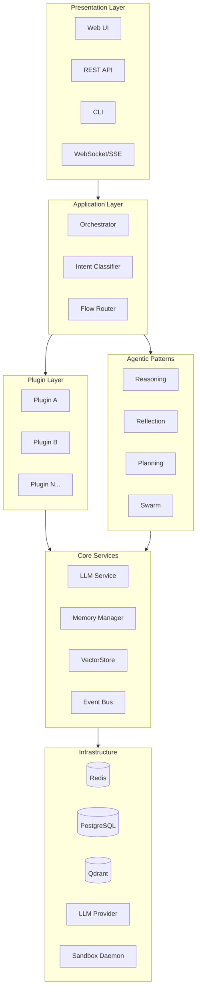
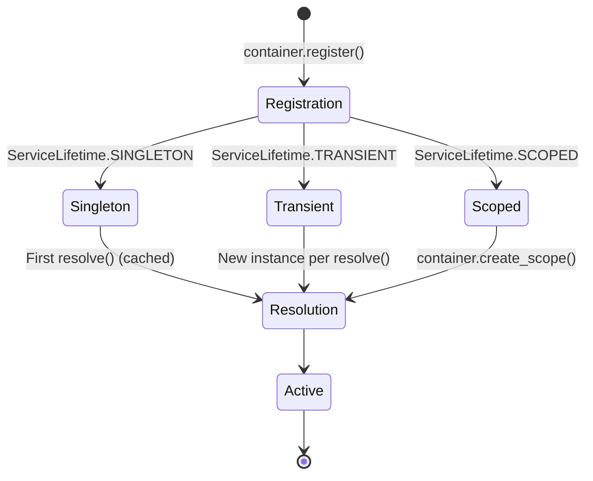
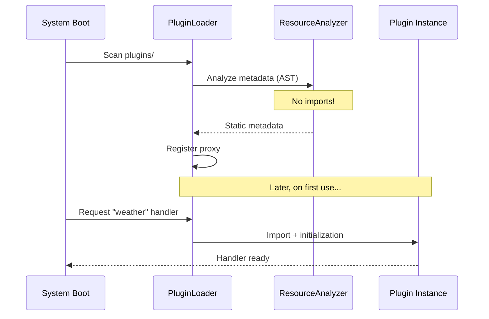

<!-- markdownlint-disable-file MD025 -->

BaselithCore is designed with a modular, layered architecture that cleanly separates infrastructure from business logic.

## Layer

 Architecture



---

## Main Components

### 1. Presentation Layer

System access interfaces:

| Component       | Description                          | Endpoint        |
| --------------- | ------------------------------------ | --------------- |
| **REST API**    | FastAPI for integrations             | e.g. `/chat`    |
| **Streaming**   | Chunked streaming chat responses     | `/chat/stream`  |
| **CLI**         | Command-line interface               | `baselith`      |

### 2. Application Layer

The orchestration core:

```python
# Simplified flow
async def handle_request(query: str):
    # 1. Classify intent
    intent = await intent_classifier.classify(query)

    # 2. Find appropriate plugin/handler
    handler = plugin_registry.get_handler(intent)

    # 3. Execute with context
    context = await memory.get_context(session_id)
    result = await handler.execute(query, context)

    # 4. Update memory and return
    await memory.update(session_id, result)
    return result
```

### 3. Plugin Layer

Plugins contain domain logic:

```text
plugins/
├── auth/               # Authentication and roles
│   ├── plugin.py       # Entry point
│   ├── models.py       # Data models
│   └── router.py       # API endpoints
├── marketplace/        # Plugin marketplace
└── custom_plugin/      # Your plugin
```

!!! tip "Golden Rule"
    **NEVER** insert domain-specific logic into `core/`. If you're writing code mentioning a specific domain (e.g., "weather", "finance"), it must be a plugin.

### 4. Core Services

Domain-agnostic services:

| Service            | Module                      | Responsibility                 |
| ------------------ | --------------------------- | ------------------------------ |
| **LLM Service**    | `core/services/llm`         | LLM provider abstraction       |
| **Memory Manager** | `core/memory`               | Context and history management |
| **VectorStore**    | `core/services/vectorstore` | Semantic search                |
| **Event Bus**      | `core/events`               | Internal pub/sub               |
| **Task Queue**     | `core/task_queue`           | Asynchronous jobs              |

### 5. Infrastructure

Persistence and compute backends:

```yaml
# Redis distribution for different purposes
Database 0: Knowledge Graph (FalkorDB)
Database 1: Caching (session, results)
Database 2: Task Queue (RQ workers)
```

---

## Dependency Injection

The system uses a custom DI container (`core/di`):

```python
from core.di import DependencyContainer, ServiceLifetime

# Create a container
container = DependencyContainer()

# Singleton - single instance for entire app
container.register(
    LLMServiceProtocol,
    lambda: LLMService(),
    lifetime=ServiceLifetime.SINGLETON,
)

# Transient - new instance per resolve
container.register(
    SessionContext,
    lambda: SessionContext(),
    lifetime=ServiceLifetime.TRANSIENT,
)

# Resolution
llm = container.resolve(LLMServiceProtocol)
```

For async, lazily-initialized singletons (the pattern used by the runtime
itself), use the global `LazyServiceRegistry`:

```python
from core.di import get_lazy_registry

registry = get_lazy_registry()
registry.register_factory(LLMServiceProtocol, build_llm_service)  # async factory

llm = await registry.get_or_create(LLMServiceProtocol)
```

### Lifecycle



---

## Centralized Configuration

All configuration is managed via Pydantic Settings in `core/config`:

```python
from core.config import get_llm_config, get_resilience_config

# ✅ Correct - use factory functions
config = get_llm_config()
llm_model = config.model

# ❌ Wrong - never use os.getenv directly
model = os.getenv("DEFAULT_MODEL")  # NO!
```

### Configuration Modules

| Module         | File            | Content                    |
| -------------- | --------------- | -------------------------- |
| **Base**       | `base.py`       | Fundamental configurations |
| **Services**   | `services.py`   | LLM, VectorStore, Vision   |
| **Resilience** | `resilience.py` | Circuit breaker, retry     |
| **Storage**    | `storage.py`    | Database connections       |
| **Security**   | `security.py`   | Auth, CORS, rate limiting  |

---

## Protocols and Interfaces

Every core service defines a `Protocol` (interface):

```python
# core/interfaces/services.py
from typing import Protocol, AsyncIterator

class LLMServiceProtocol(Protocol):
    """Protocol for LLM services."""

    async def generate_response(
        self,
        prompt: str,
        model: str | None = None,
        json: bool = False,
    ) -> str:
        """Generate a response."""
        ...

    async def generate_response_stream(
        self,
        prompt: str,
        model: str | None = None,
    ) -> AsyncIterator[str]:
        """Generate in streaming mode."""
        ...
```

The protocol is re-exported from `core.interfaces`, so import it with
`from core.interfaces import LLMServiceProtocol`.

This enables:

- **Swapping implementations** without modifying client code
- **Easy mocking** in tests
- **Rigorous type checking** with mypy

---

## Lazy Loading

The system implements lazy loading at multiple levels to optimize startup time:

### Plugin Lazy Loading



### Service Lazy Loading

```python
from core.di import get_lazy_registry

registry = get_lazy_registry()

# Register an async factory; the service is not created until first use
registry.register_factory(LLMServiceProtocol, build_llm_service)

# First access → creation (subsequent calls return the cached singleton)
llm_service = await registry.get_or_create(LLMServiceProtocol)
response = await llm_service.generate_response("Hello")
```

---

## Security

Security is integrated at all levels:

### Authentication

```python
from fastapi import Depends
from core.middleware import require_admin

# Auth is enforced as a FastAPI dependency. require_admin (admin-only),
# require_user (user/admin/job) and require_admin_or_job all live in
# core.middleware.security and return the resolved identity string.
@router.get("/admin/stats")
async def admin_stats(user: str = Depends(require_admin)):
    return {"stats": "..."}
```

### Input Sanitization

```python
from core.guardrails import InputGuard

guard = InputGuard()

# Validate user input (async variant available as validate_async)
result = guard.validate(user_input)
if not result.is_valid:
    ...  # reject

# Sanitize when you need a cleaned string
safe_input = guard.sanitize(user_input)
```

### Secrets Management

```python
# ✅ Secrets in .env, accessed via config
from core.config import get_security_config
jwt_secret = get_security_config().secret_key

# ❌ Never hardcoded
jwt_secret = "my-secret-key"  # NO!
```

---

## Next Steps

<div class="feature-grid" markdown>

<div class="feature-card" markdown>

### :material-transit-connection: Request Flow

Discover the [complete flow of a request](request-flow.md).

</div>

<div class="feature-card" markdown>

### :material-brain: Agentic Patterns

Explore the [agentic patterns](agentic-patterns.md) implemented.

</div>

</div>
