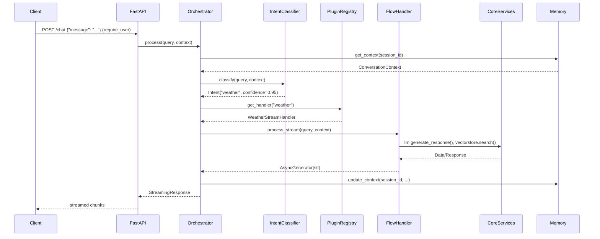
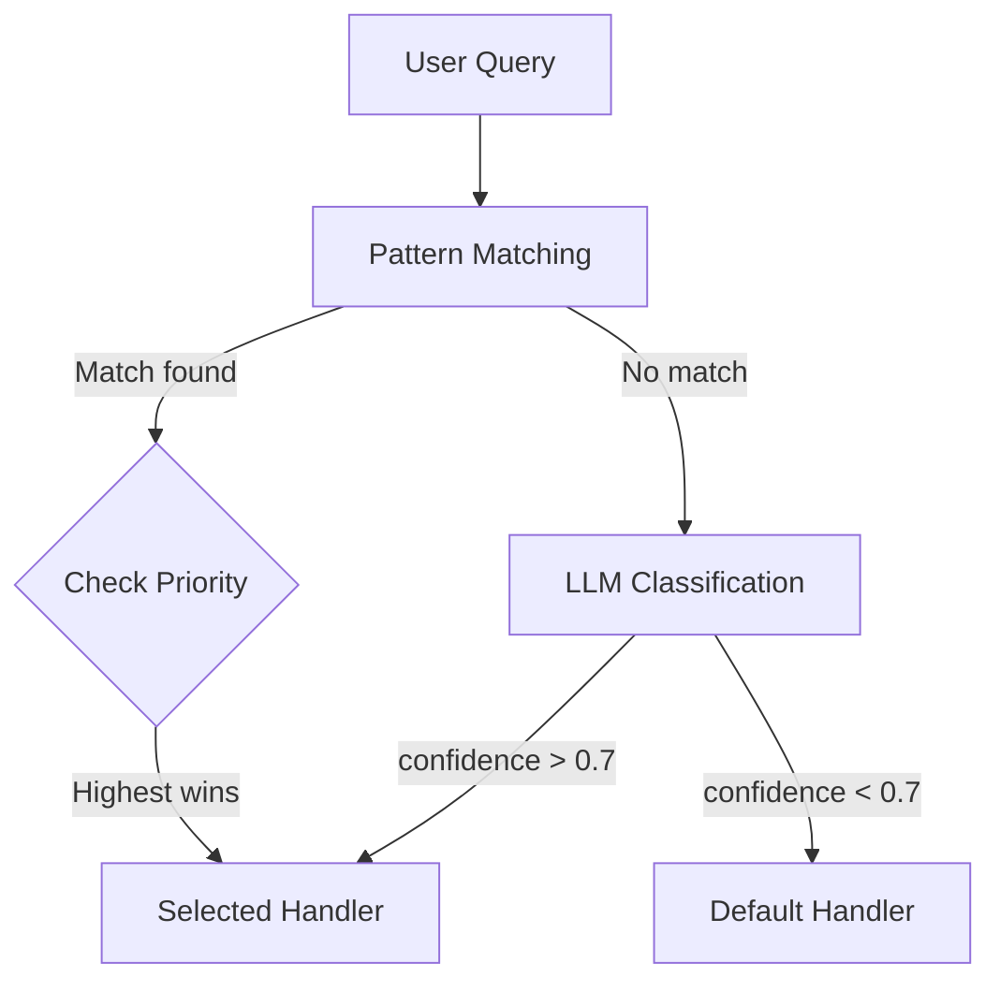
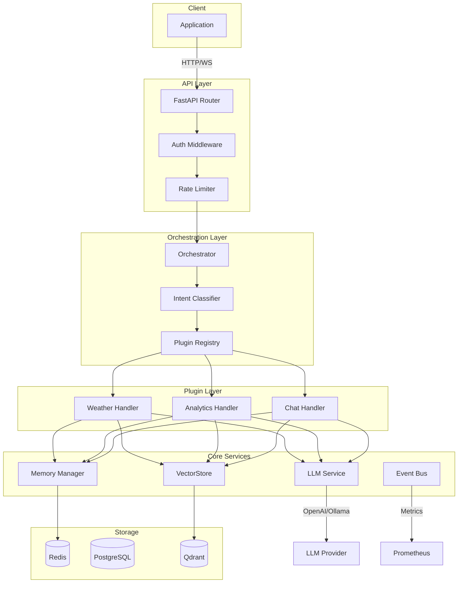

<!-- markdownlint-disable MD046 -->

This guide illustrates the path of a request from client to final response.

---

## Overview



---

## Phase 1: Request Reception

### Entry Point Endpoint

The real chat routes live in `plugins/api_routers/chat.py`. They are mounted
**without** an `/api` prefix and require authentication via the `require_user`
dependency (declared on the router). The handlers delegate to `chat_service`,
but the equivalent orchestrator-driven flow looks like this:

```python title="illustrative orchestrator flow"
from fastapi import APIRouter, Depends
from fastapi.responses import StreamingResponse

from core.middleware import require_user
from core.orchestration import Orchestrator

router = APIRouter(dependencies=[Depends(require_user)])
orchestrator = Orchestrator()

@router.post("/chat")
async def chat(request: ChatRequest):
    return await orchestrator.process(
        query=request.message,
        context={"session_id": request.session_id},
    )

@router.post("/chat/stream")
async def chat_stream(request: ChatRequest):
    async def generate():
        async for chunk in orchestrator.process_stream(
            query=request.message,
            context={"session_id": request.session_id},
        ):
            yield chunk

    return StreamingResponse(generate(), media_type="text/plain")
```

### Middleware Chain

All HTTP middleware in `core/middleware/` is implemented as **pure ASGI**
(`async def __call__(scope, receive, send)`); `BaseHTTPMiddleware` is
explicitly forbidden because it wraps every request in an extra anyio task
and breaks streaming/cancellation. The order below reflects the actual
execution sequence configured in `core/api/factory.py:create_app()`
(remember: in FastAPI/Starlette the *last* middleware added is the *first*
one to run on the inbound request).

```mermaid
graph LR
    Request --> ReqId[RequestIdMiddleware]
    ReqId --> SizeLimit[RequestSizeLimitMiddleware<br/>413 on oversized bodies]
    SizeLimit --> Cost[CostControlMiddleware]
    Cost --> StaticCache[StaticCacheMiddleware]
    StaticCache --> Gzip[SmartGzipMiddleware<br/>skips /chat/stream]
    Gzip --> Headers[SecurityHeadersMiddleware<br/>CSP, HSTS, X-Frame-Options]
    Headers --> Hosts[TrustedHostMiddleware]
    Hosts --> CSRF[CSRF origin check<br/>state-changing methods]
    CSRF --> PluginAct[Plugin activation<br/>lazy load on first match]
    PluginAct --> CORS[CORSMiddleware]
    CORS --> Tenant[TenantMiddleware]
    Tenant --> Auth[Route deps<br/>require_user/admin/job]
    Auth --> Rate[RateLimiter<br/>Redis SET NX EX]
    Rate --> Handler[Route Handler]
```



`RequestSizeLimitMiddleware` runs early so oversized bodies are rejected
before any downstream middleware buffers or parses them. See
[Security › Request Body Size Limit](../advanced/security.md#request-body-size-limit).

---

## Phase 2: Context Loading

The orchestrator retrieves conversation context:

```python title="core/orchestration/orchestrator.py"
async def process(self, query: str, context: dict | None = None, intent: str | None = None):
    # 1. Retrieve existing conversation context
    context = await self.memory.get_context(session_id)

    # 2. Context includes:
    #    - Recent message history
    #    - User data (if authenticated)
    #    - Tenant ID (multi-tenancy)
    #    - Compressed memory (if active)
```

### Context Structure

```python
@dataclass
class ConversationContext:
    session_id: str
    tenant_id: str | None
    user_id: str | None

    # Last N messages
    messages: list[Message]

    # Compressed memory (summary of long history)
    compressed_memory: str | None

    # Custom metadata (plugin-specific)
    metadata: dict[str, Any]
```

---

## Phase 3: Intent Classification

The IntentClassifier determines which handler will process the request:

```python title="core/orchestration/intent_classifier.py"
class IntentClassifier:
    async def classify(
        self,
        query: str,
        context: ConversationContext
    ) -> ClassificationResult:

        # 1. Pattern-based matching (fast)
        for pattern in self.patterns:
            if pattern.matches(query):
                return ClassificationResult(
                    intent=pattern.intent,
                    confidence=0.95,
                    source="pattern"
                )

        # 2. LLM-based fallback (accurate)
        result = await self._llm_classify(query, context)
        return result
```

### Pattern Registration

Plugins register their patterns:

```python
# plugins/weather/plugin.py
def get_intent_patterns(self):
    return [
        {
            "intent": "weather",
            "patterns": ["weather", "temperature", "forecast"],
            "priority": 100
        }
    ]
```

### Conflict Resolution



---

## Phase 4: Handler Resolution

The PluginRegistry finds the appropriate handler:

```python title="core/plugins/registry.py"
class PluginRegistry:
    def get_handler(
        self,
        intent: str,
        mode: str = "stream"
    ) -> FlowHandler:

        # Search registered plugins
        for plugin in self._plugins.values():
            handlers = plugin.get_flow_handlers()
            if intent in handlers:
                handler_class = handlers[intent][mode]
                return handler_class(plugin)

        # Fallback to default handler
        return self._default_handler
```

### Thread Safety

```python
class PluginRegistry:
    def __init__(self):
        self._lock = threading.RLock()
        self._plugins: dict[str, Plugin] = {}

    def register(self, plugin: Plugin):
        with self._lock:  # Thread-safe
            self._plugins[plugin.name] = plugin
```

---

## Phase 5: Handler Execution

The handler processes the request:

```python title="plugins/weather/handlers.py"
from core.orchestration.protocols import StreamHandler

class WeatherStreamHandler(StreamHandler):
    # StreamHandler's protocol method is handle() (returns an async generator)
    async def handle(
        self,
        query: str,
        context: dict
    ) -> AsyncGenerator[str, None]:

        # 1. Extract entities from query
        city = await self._extract_city(query)

        # 2. Fetch external data
        weather = await self.api.get_weather(city)

        # 3. Generate response with LLM
        async for chunk in self.llm.stream(
            prompt=self._build_prompt(query, weather),
            context=context.get("messages", [])
        ):
            yield chunk
```

### Accessing Core Services

Handlers access services via DI:

```python
from core.di import get_lazy_registry
from core.interfaces import LLMServiceProtocol, VectorStoreProtocol

class MyHandler:
    async def init_services(self):
        registry = get_lazy_registry()
        self.llm = await registry.get_or_create(LLMServiceProtocol)
        self.vectorstore = await registry.get_or_create(VectorStoreProtocol)
```

---

## Phase 6: Context Update

After processing, the context is updated:

```python
# Save message and response
await memory.add_memory(
    content=query,
    metadata={"session_id": session_id, "role": "user"},
)

await memory.add_memory(
    content=full_response,
    metadata={"session_id": session_id, "role": "assistant"},
)

# Compress older memories into higher tiers when needed
await memory.compress_old_memories()
```

---

## Phase 7: Event Emission

The system emits events for observability and learning:

```python
from core.events import get_event_bus, EventNames

bus = get_event_bus()

await bus.emit(EventNames.FLOW_COMPLETED, {
    "intent": intent,
    "session_id": session_id,
    "duration_ms": elapsed,
    "success": True
})

# EventListener collects metrics automatically
```

---

## Phase 8: Response Delivery

### Synchronous Response

```python
return JSONResponse({
    "response": full_response,
    "intent": intent.name,
    "session_id": session_id
})
```

### Streaming Response (SSE)

```python
async def generate_sse():
    async for chunk in handler.handle(query, context):
        yield f"data: {json.dumps({'chunk': chunk})}\n\n"

    yield "data: [DONE]\n\n"

return StreamingResponse(
    generate_sse(),
    media_type="text/event-stream"
)
```

---

## Complete Diagram



---

## Performance Considerations

!!! tip "Integrated Optimizations"

    - **Connection Pooling**: PostgreSQL and Redis use shared pools
    - **Lazy Loading**: Plugins loaded only when needed
    - **Caching**: LLM and vectorstore results cached in Redis
    - **Streaming**: Chunked responses for better perceived latency

### Timing Benchmarks

Typical request flow timing (production environment):

| Phase                 | Average Time    | Notes            |
| --------------------- | --------------- | ---------------- |
| Context Loading       | 5-10ms          | Cached in Redis  |
| Intent Classification | 15-30ms         | Pattern matching |
| Handler Resolution    | <1ms            | In-memory lookup |
| LLM Generation        | 500-2000ms      | Depends on model |
| Context Update        | 10-15ms         | Async write      |
| **Total**             | **~600-2100ms** | End-to-end       |

---

## Next Steps

:material-arrow-right: Explore the [Agentic Patterns](agentic-patterns.md) implemented in the framework.
