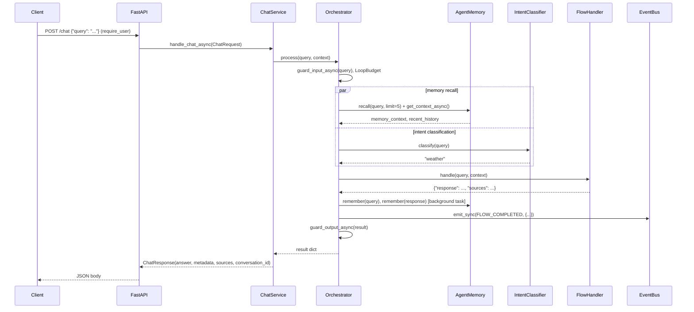
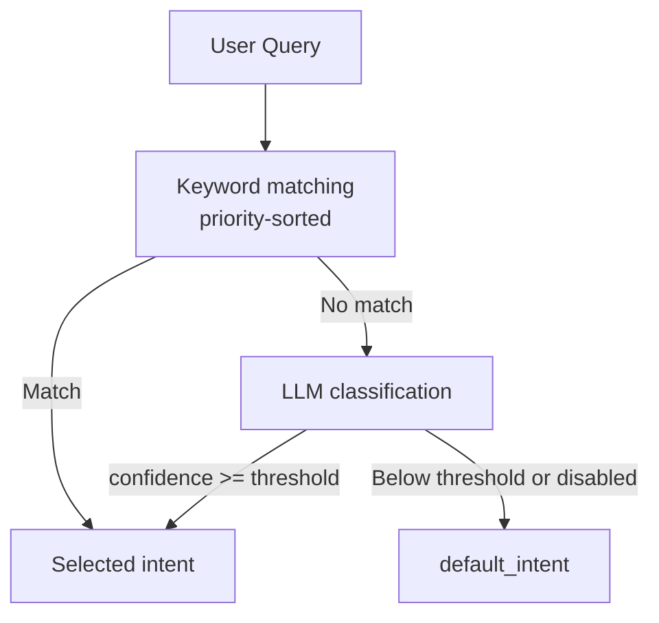
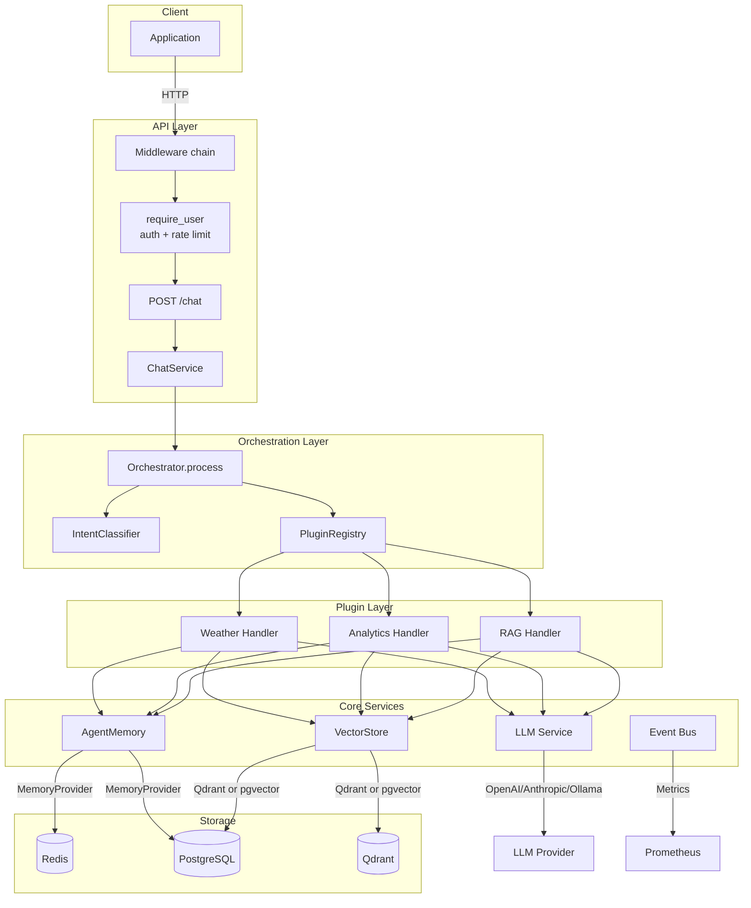

<!-- markdownlint-disable MD046 -->

This guide illustrates the path of a request from client to final response,
using the real names from `plugins/api_routers/chat.py`,
`core/services/chat/service.py` and `core/orchestration/`.

---

## Overview


```mermaid
sequenceDiagram
    participant C as Client
    participant F as FastAPI
    participant CS as ChatService
    participant O as Orchestrator
    participant M as AgentMemory
    participant I as IntentClassifier
    participant H as FlowHandler
    participant E as EventBus

    C->>F: POST /chat {"query": "..."} (require_user)
    F->>CS: handle_chat_async(ChatRequest)
    CS->>O: process(query, context)
    O->>O: guard_input_async(query), LoopBudget
    par memory recall
        O->>M: recall(query, limit=5) + get_context_async()
        M-->>O: memory_context, recent_history
    and intent classification
        O->>I: classify(query)
        I-->>O: "weather"
    end
    O->>H: handle(query, context)
    H-->>O: {"response": ..., "sources": ...}
    O->>M: remember(query), remember(response) [background task]
    O->>E: emit_sync(FLOW_COMPLETED, {...})
    O->>O: guard_output_async(result)
    O-->>CS: result dict
    CS-->>F: ChatResponse(answer, metadata, sources, conversation_id)
    F-->>C: JSON body
```

---

## Phase 1: Request Reception

### Entry Point Endpoint

The chat routes live in `plugins/api_routers/chat.py`. They are mounted
**without** an `/api` prefix (a `/v1` alias is mounted additively) and the
router declares `require_user` as a dependency, so every call is authenticated
and rate-limited before the route body runs. The routes delegate to
`chat_service` (`core.chat.chat_service`), which owns the `Orchestrator`.

```python title="plugins/api_routers/chat.py (trimmed)"
from fastapi import APIRouter, Depends, Response
from fastapi.responses import StreamingResponse

from core.chat import chat_service
from core.middleware import require_user
from core.models.chat import ChatRequest

router = APIRouter(dependencies=[Depends(require_user)])


@router.post("/chat")
async def chat(req: ChatRequest, response: Response):
    result = await chat_service.handle_chat_async(req)  # -> ChatResponse
    return result


@router.post("/chat/stream")
async def chat_stream(req: ChatRequest):
    stream = await chat_service.handle_chat_stream_async(req)
    return StreamingResponse(
        bounded_stream(stream, STREAM_MAX_BYTES, STREAM_MAX_CHUNK_BYTES),
        media_type="text/plain",
        headers={"Cache-Control": "no-cache", "X-Accel-Buffering": "no"},
    )
```

The trimmed parts are the transparency headers (`X-Baselith-AI-Disclosure`,
`X-Baselith-AI-Provenance`, added only when `TransparencyService` is enabled)
and `bounded_stream`, which caps a stream at `STREAM_MAX_BYTES` (4 MiB) in
total and `STREAM_MAX_CHUNK_BYTES` (64 KiB) per chunk.

### Request Model

The body is `ChatRequest` (`core/models/chat.py`):

| Field                 | Type           | Default | Notes                                               |
| --------------------- | -------------- | ------- | --------------------------------------------------- |
| `query`               | `str`          | —       | Required, 1–8000 characters                         |
| `conversation_id`     | `str \| None`  | `None`  | Echoed back on the response                         |
| `stream`              | `bool \| None` | `False` | Accepted for compatibility; use `/chat/stream`      |
| `rag_only`            | `bool`         | `False` | Forwarded into the orchestrator context             |
| `kb_label`            | `str \| None`  | `None`  | Knowledge-base selector, forwarded into the context |
| `tenant_id`           | `str \| None`  | `None`  | Optional tenant hint                                |
| `max_response_tokens` | `int \| None`  | `None`  | 1–16000                                             |

The model is declared with `extra="forbid"`: any unknown key (for example
`message` or `session_id`) is rejected with HTTP 422 before the route runs.

```bash
curl -X POST http://localhost:8000/chat \
  -H "Authorization: Bearer <token>" \
  -H "Content-Type: application/json" \
  -d '{"query": "What is the weather in Rome?", "conversation_id": "conv-123"}'
```

### Middleware Chain

All HTTP middleware in `core/middleware/` is implemented as **pure ASGI**
(`async def __call__(scope, receive, send)`); `BaseHTTPMiddleware` is
explicitly forbidden because it wraps every request in an extra anyio task
and breaks streaming/cancellation. The order below is the inbound execution
sequence derived from the `add_middleware` calls in
`core/api/factory.py:create_app()` (in Starlette the *last* middleware added
is the *outermost*, so it runs first on the way in).


```mermaid
graph LR
    Request --> Metrics[HTTPMetricsMiddleware<br/>RED metrics, outermost]
    Metrics --> ReqId[RequestIdMiddleware<br/>X-Request-ID]
    ReqId --> Headers[SecurityHeadersMiddleware<br/>CSP, HSTS, nosniff]
    Headers --> SizeLimit[RequestSizeLimitMiddleware<br/>413 on oversized bodies]
    SizeLimit --> Hosts[TrustedHostMiddleware<br/>only when TRUSTED_HOSTS is set]
    Hosts --> CSRF[CSRFOriginMiddleware<br/>state-changing methods]
    CSRF --> Quota[QuotaMiddleware<br/>no-op unless QUOTAS_ENABLED]
    Quota --> PluginCtx[PluginContextMiddleware<br/>attributes the request to a plugin]
    PluginCtx --> Tenant[TenantMiddleware]
    Tenant --> CORS[CORSMiddleware]
    CORS --> PluginAct[PluginActivationMiddleware<br/>lazy load on first match]
    PluginAct --> Idem[IdempotencyMiddleware<br/>Idempotency-Key replay]
    Idem --> Gzip[SmartGzipMiddleware<br/>skips /chat/stream]
    Gzip --> StaticCache[StaticCacheMiddleware]
    StaticCache --> Cost[CostControlMiddleware]
    Cost --> Auth[Route deps<br/>require_user: auth + rate limit]
    Auth --> Handler[Route Handler]
```

Plugin-contributed app middleware (`Plugin.setup_app_middleware`, composed by
`apply_plugin_app_middleware`) sits between `CSRFOriginMiddleware` and
`QuotaMiddleware`.

`RequestSizeLimitMiddleware` runs early so oversized bodies are rejected
before any downstream middleware buffers or parses them. See
[Security › Request Body Size Limit](../advanced/security.md#request-body-size-limit).

Authentication and rate limiting are **route dependencies**, not middleware:
`require_user` calls `SecurityManager.enforce_auth(...)`, which resolves the
identity (bearer JWT or API key), checks the role, then calls
`RateLimiter.check(identifier, limit_per_minute, window)` with a tenant-scoped
key (`{tenant}:{role}:...`). The limiter is an atomic Redis `INCR` plus
first-call `EXPIRE` Lua script — one round trip per request.

---

## Phase 2: Bridging to the Orchestrator

`ChatService.handle_chat_async` (`core/services/chat/service.py`) validates the
query with `InputGuard`, builds the orchestration context from the request and
hands off to `self.agent` — a lazily constructed
`Orchestrator(plugin_registry=..., checkpoint_store=get_default_checkpoint_store())`:

```python title="core/services/chat/service.py (trimmed)"
async def handle_chat_async(self, req: ChatRequest) -> ChatResponse:
    guard_result = InputGuard().validate(req.query)
    if not guard_result.is_valid:
        raise ChatServiceError(f"Blocked by InputGuard: {guard_result.blocked_reason}")

    context = {
        "conversation_id": req.conversation_id,
        "rag_only": req.rag_only,
        "kb_label": req.kb_label,
    }
    result = await self.agent.process(req.query, context)

    return ChatResponse(
        answer=result.get("response", ""),
        metadata=result.get("metadata", {}),
        sources=result.get("sources"),
        conversation_id=req.conversation_id,
    )
```

The orchestrator entry point is `Orchestrator.process`
(`core/orchestration/mixins/execution.py`):

```python
async def process(
    self,
    query: str,
    context: dict[str, Any] | None = None,
    intent: str | None = None,
    run_id: str | None = None,
    resume: bool = False,
) -> dict[str, Any]: ...
```

`intent` forces a route and skips classification; `run_id`/`resume` drive
durable checkpointing when a `checkpoint_store` is configured
(`ORCHESTRATOR_CHECKPOINT_ENABLED`). Before any handler runs, `process()`:

1. Runs `guard_input_async(query)`; a blocked query returns a structured
   result immediately, without spending budget or LLM calls.
2. Creates a `LoopBudget(limits=self.loop_limits)`, stores it in
   `context["loop_budget"]` and activates it as the ambient budget, so every
   LLM call made during the request is charged against `budget_usd`.
3. Exposes `contract_validator` and `autonomy_policy` on the context when
   they are configured on the orchestrator.
4. Calls `enforce_tenant_isolation(context)` (raises `PermissionError` on a
   tenant mismatch) and `annotate_modality(context)` (`context["modality"]`).
5. Creates or resumes the checkpoint (`context["checkpoint"]`); a resumed run
   restores its previously classified intent.

---

## Phase 3: Memory Recall and Intent Classification

Memory recall and intent classification both consume only the query, so the
orchestrator overlaps them instead of paying both latencies in series:

```python title="core/orchestration/mixins/execution.py (excerpt)"
if not intent:
    _, intent = await asyncio.gather(
        inject_memory_context(self, query, context, budget),
        self.classify_intent_async(query),
    )
else:
    await inject_memory_context(self, query, context, budget)
```

### Memory Context

`inject_memory_context` (`core/orchestration/mixins/_context_assembly.py`)
uses the orchestrator's `memory_manager` — an `AgentMemory` from
`core.memory`, passed at construction time — and returns early when none is
configured. `ChatService` builds its orchestrator without one, so the `/chat`
route skips this step unless you construct the `Orchestrator` yourself with
`memory_manager=...`.

```python
memories, recent_history = await asyncio.gather(
    memory_manager.recall(query, limit=5),
    memory_manager.get_context_async(max_tokens=context_tokens),
)
context["memory_context"] = "\n".join(f"- {m.content}" for m in memories)
context["recent_history"] = recent_history
context["memory_manager"] = memory_manager
```

`context_tokens` shrinks when `budget.token_pressure()` is high. A memory
failure is logged and skipped — it degrades the answer but never fails the
request. After recall, `inject_capabilities` adds the human-intervention,
feedback and skills-catalog facades to the context.

### Context Keys

| Key                                       | Set by                  | Content                                             |
| ----------------------------------------- | ----------------------- | --------------------------------------------------- |
| `conversation_id`, `rag_only`, `kb_label` | `ChatService`           | Copied from `ChatRequest`                           |
| `loop_budget`                             | `process()`             | Per-request `LoopBudget`                            |
| `contract_validator`, `autonomy_policy`   | `process()`             | Only when configured on the orchestrator            |
| `modality`                                | `annotate_modality`     | Attachment modality hint                            |
| `checkpoint`                              | `process()`             | `CheckpointManager`, only with a checkpoint store   |
| `memory_context`, `recent_history`        | `inject_memory_context` | Recalled memories and (folded) recent history       |
| `memory_manager`                          | `inject_memory_context` | The `AgentMemory` instance, for agents that need it |
| `intent`                                  | `process()`             | The resolved intent name                            |

### Intent Classification

`classify_intent_async(query)` delegates to
`IntentClassifier.classify(text) -> str`
(`core/orchestration/intent_classifier.py`), a thin wrapper over
`classify_with_confidence(text) -> ClassificationResult`:

```python
@dataclass
class ClassificationResult:
    intent: str
    confidence: float
    method: str  # "keyword", "llm" or "default"
    alternatives: list[dict] | None = None
```

The strategies run in order, cheapest first:

1. **Keyword** — plugin patterns sorted by `priority` (higher first); a match
   short-circuits without any network call.
2. **LLM** — only when no keyword matched, `llm_enabled=True` and at least one
   plugin intent is registered. The result is used when
   `confidence >= confidence_threshold` (constructor default `0.6`) and is
   LRU-cached per input text.
3. **Default** — `default_intent` (constructor default `"qa_docs"`) with
   `confidence=0.5` and `method="default"`.

### Pattern Registration

Plugins declare their intents from `get_intent_patterns()`. The registry keys
each entry by its `name` (`core/plugins/registration.py`) and the classifier
pulls them lazily on the first query via
`PluginRegistry.get_all_intent_patterns()`:

```python title="plugins/weather_agent/plugin.py (illustrative)"
def get_intent_patterns(self) -> list[dict[str, Any]]:
    return [
        {
            "name": "weather",
            "patterns": ["weather", "temperature", "forecast"],
            "priority": 100,
            "description": "Weather and forecast questions",
        }
    ]
```

`description` is what the LLM strategy sees in its list of candidate intents;
`patterns` are lower-cased once at load time.

### Conflict Resolution


```mermaid
flowchart TD
    Query[User Query] --> Keywords[Keyword matching<br/>priority-sorted]
    Keywords --> |Match| Handler[Selected intent]
    Keywords --> |No match| LLM[LLM classification]
    LLM --> |confidence >= threshold| Handler
    LLM --> |Below threshold or disabled| Default[default_intent]
```

---

## Phase 4: Handler Resolution

Plugins expose handlers from `get_flow_handlers()` as an
`{intent_name: handler}` mapping. At registration the `PluginRegistry` wraps
each one in a `_LazyFlowHandlerProxy`, so importing the plugin's heavy
dependencies is deferred until the handler is first invoked:

```python title="core/plugins/registry.py (excerpt)"
class PluginRegistry:
    def get_flow_handler(self, intent_name: str) -> Any | None:
        """Retrieve the workflow handler responsible for an intent."""
        with self._lock:
            return LookupMixin.get_flow_handler(self, intent_name)

    def get_all_flow_handlers(self) -> dict[str, Any]:
        """Retrieve all registered flow handlers."""
        with self._lock:
            return LookupMixin.get_all_flow_handlers(self)
```

The orchestrator copies every registry handler into its own table at
construction (`_load_plugin_handlers()` → `register_handler(intent, handler)`)
and resolves the intent against that table at request time:

```python title="core/orchestration/mixins/execution.py (excerpt)"
handler = self._flow_handlers.get(intent)

if not handler:
    logger.warning(f"No handler registered for intent: {intent}")
    return {
        "response": f"No handler available for intent: {intent}",
        "intent": intent,
        "error": True,
    }
```

Handlers can also be registered directly: `register_handler(intent, handler,
stream_handler=None)` for a `FlowHandler`, or `register_workflow(intent,
workflow)` to route an intent into a declarative graph.

### Thread Safety

Every `PluginRegistry` lookup and mutation takes the same `threading.RLock`
(`self._lock`), including `register(plugin, require_initialized=True)` and the
`get_*` accessors above, so concurrent registration (for example a hot reload)
and request-time lookups are serialized.

---

## Phase 5: Handler Execution

A flow handler satisfies the `FlowHandler` protocol
(`core/orchestration/protocols.py`):
`async def handle(query, context) -> dict[str, Any]`. The orchestrator binds
the owning plugin's context around the call (so the per-plugin LLM policy
attributes the spend correctly), then stamps `intent` and a `budget` snapshot
onto the result:

```python title="core/orchestration/mixins/execution.py (excerpt)"
plugin_token = self._bind_intent_plugin(intent)
try:
    result = await handler.handle(query, context)
finally:
    if plugin_token is not None:
        reset_plugin_context(plugin_token)
result["intent"] = intent
result["budget"] = budget.snapshot().__dict__
```

An illustrative handler:

```python title="plugins/weather_agent/handlers.py (illustrative)"
from typing import Any

from core.di import get_lazy_registry
from core.interfaces import LLMServiceProtocol


class WeatherFlowHandler:
    """Structural match for core.orchestration.protocols.FlowHandler."""

    async def handle(self, query: str, context: dict[str, Any]) -> dict[str, Any]:
        context["loop_budget"].tick()  # one agent-loop step against the request budget

        llm = await get_lazy_registry().get_or_create(LLMServiceProtocol)
        weather = await self._fetch_weather(query)  # plugin-specific I/O
        answer = await llm.generate_response(
            f"{context.get('recent_history', '')}\n\n"
            f"Weather data: {weather}\n\nUser: {query}"
        )
        return {"response": answer, "sources": [{"origin": "weather-api"}]}
```

For token-by-token output implement the `StreamHandler` protocol instead
(`def handle(query, context) -> AsyncGenerator[str, None]`) and register it
with `register_handler(intent, handler, stream_handler=...)`; see
[Phase 8](#phase-8-response-delivery).

### Accessing Core Services

Handlers resolve services through the lazy DI registry rather than importing
concrete implementations:

```python
from core.di import get_lazy_registry
from core.interfaces import LLMServiceProtocol, VectorStoreProtocol


class MyHandler:
    async def init_services(self) -> None:
        registry = get_lazy_registry()
        self.llm = await registry.get_or_create(LLMServiceProtocol)
        self.vectorstore = await registry.get_or_create(VectorStoreProtocol)
```

---

## Phase 6: Memory Write

After the handler returns, the interaction is persisted **off the request
path**: `_schedule_memory_write` (`core/orchestration/mixins/_memory_write.py`)
spawns a background task, bounded by a semaphore of 32 concurrent writes, that
stores the query and the response as two independent `remember()` calls:

```python
memory_manager.remember(
    f"User Query: {query}",
    metadata={"type": "query", "intent": intent},
)
memory_manager.remember(
    f"Agent Response: {response_text}",
    metadata={"type": "response", "intent": intent},
)
```

Each write is an embedding plus a vector upsert, so awaiting them inline would
add two round trips after the answer is already computed. Failures are logged
as warnings. The step is skipped when the orchestrator has no
`memory_manager`. Promotion between tiers (STM → MTM → LTM) is handled by the
memory hierarchy itself — see
[Hierarchical Memory](../core-modules/hierarchical-memory.md).

---

## Phase 7: Event Emission

The orchestrator emits lifecycle events for observability and learning. Before
the handler runs it publishes `RUN_STARTED` on the structured run-event stream
(`publish_run_event`) and `EventNames.FLOW_STARTED` on the event bus; after the
handler it emits `EventNames.FLOW_COMPLETED`:

```python title="core/orchestration/mixins/execution.py (excerpt)"
get_event_bus().emit_sync(
    EventNames.FLOW_COMPLETED,
    {
        "intent": intent,
        "query": query,
        "response": result.get("response", ""),
        "context": safe_context,  # str/int/float/bool/list/dict values only
        "duration_ms": int(elapsed * 1000),
        "success": not result.get("error", False),
        "run_id": events_run_id,
    },
)
```

`EventListener` (`core/events/listener.py`) subscribes to `FLOW_COMPLETED` to
collect metrics. From your own async code prefer the awaitable form:

```python
from core.events import EventNames, get_event_bus

await get_event_bus().emit(EventNames.FLOW_COMPLETED, {"intent": "weather"})
```

---

## Phase 8: Response Delivery

### Synchronous Response

`process()` returns a plain dict — `response`, `intent`, `budget`, plus
whatever the handler added (`sources`, `metadata`, `error`) — after
`guard_output_async` has applied PII redaction and the harmful-content filter.
`ChatService` maps it onto `ChatResponse` (`core/models/chat.py`):

```python
class ChatResponse(BaseModel):
    answer: str
    metadata: dict[str, Any] | None = None
    sources: list[dict[str, Any]] | None = None
    conversation_id: str | None = None

    model_config = ConfigDict(extra="allow")
```

```json
{
  "answer": "Rome is 24 °C and sunny.",
  "metadata": {},
  "sources": [{"origin": "weather-api"}],
  "conversation_id": "conv-123"
}
```

When `TransparencyService` is enabled the route also writes
`metadata.ai_disclosure` and sets the `X-Baselith-AI-Disclosure` and
`X-Baselith-AI-Provenance` headers.

### Streaming Response

`/chat/stream` is **not** server-sent events. `handle_chat_stream_async` runs
`Orchestrator.process_stream(query, context)` and the route wraps it in a
`StreamingResponse` with `media_type="text/plain"`: each yielded chunk is raw
text with no framing, and the stream simply ends when generation is done.
`SmartGzipMiddleware` excludes `/chat/stream` (and `/v1/chat/stream`) so
chunks are never buffered. If `ChatConfig.streaming_enabled` is off,
`handle_chat_stream_async` falls back to `handle_chat_async` and yields the
full answer as a single chunk.

Intents without a `StreamHandler` still stream — the orchestrator runs the
full non-streaming pipeline and emits its final response as one chunk:

```python title="core/orchestration/mixins/execution.py (excerpt)"
handler = self._stream_handlers.get(intent)

if not handler:
    result = await self.process(query, context, intent)
    response = result.get("response", "")
    if response:
        yield response
    return
```

Consuming the stream from a client:

```python
import httpx

async with httpx.AsyncClient(base_url="http://localhost:8000") as client:
    async with client.stream(
        "POST",
        "/chat/stream",
        json={"query": "What is the weather in Rome?"},
        headers={"Authorization": "Bearer <token>"},
    ) as resp:
        async for chunk in resp.aiter_text():
            print(chunk, end="", flush=True)
```

---

## Complete Diagram


```mermaid
flowchart TB
    subgraph Client
        App[Application]
    end

    subgraph API["API Layer"]
        MW[Middleware chain]
        Auth[require_user<br/>auth + rate limit]
        Route[POST /chat]
        CS[ChatService]
    end

    subgraph Orchestration["Orchestration Layer"]
        Orch[Orchestrator.process]
        Intent[IntentClassifier]
        Registry[PluginRegistry]
    end

    subgraph Plugins["Plugin Layer"]
        Handler1[Weather Handler]
        Handler2[Analytics Handler]
        Handler3[RAG Handler]
    end

    subgraph Services["Core Services"]
        LLM[LLM Service]
        Memory[AgentMemory]
        Vector[VectorStore]
        Events[Event Bus]
    end

    subgraph Storage["Storage"]
        Redis[(Redis)]
        PG[(PostgreSQL)]
        Qdrant[(Qdrant)]
    end

    App -->|HTTP| MW --> Auth --> Route --> CS --> Orch
    Orch --> Intent
    Orch --> Registry
    Registry --> Handler1 & Handler2 & Handler3
    Handler1 & Handler2 & Handler3 --> LLM & Memory & Vector
    Memory -->|MemoryProvider| PG & Redis
    Vector -->|Qdrant or pgvector| Qdrant & PG
    LLM --> |OpenAI/Anthropic/Ollama| External[LLM Provider]
    Events --> |Metrics| Prometheus[Prometheus]
```

---

## Performance Considerations

!!! tip "Integrated Optimizations"

    - **Connection Pooling**: PostgreSQL and Redis use shared pools
    - **Lazy Loading**: Plugins loaded only when needed
    - **Caching**: LLM and vectorstore results cached in Redis
    - **Streaming**: Chunked responses for better perceived latency

### Timing Benchmarks

Typical request flow timing (production environment):

| Phase                 | Average Time    | Notes            |
| --------------------- | --------------- | ---------------- |
| Context Loading       | 5-10ms          | Cached in Redis  |
| Intent Classification | 15-30ms         | Pattern matching |
| Handler Resolution    | <1ms            | In-memory lookup |
| LLM Generation        | 500-2000ms      | Depends on model |
| Context Update        | 10-15ms         | Async write      |
| **Total**             | **~600-2100ms** | End-to-end       |

---

## Next Steps

:material-arrow-right: Explore the [Agentic Patterns](agentic-patterns.md) implemented in the framework.
