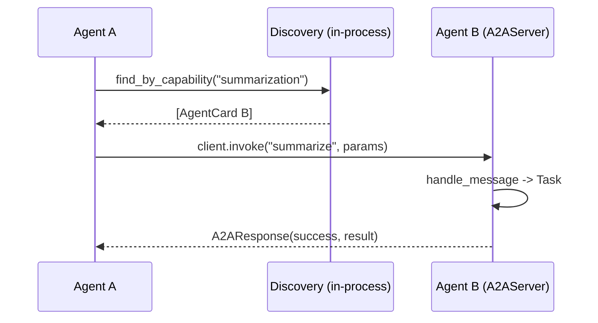

The `core/a2a` module implements the **Agent-to-Agent Protocol** (Google A2A
specification), enabling standardized JSON-RPC 2.0 communication between
agents, plus an agent-discovery service and the A2UI blueprint schema.

---

## Structure

```text
core/a2a/
├── __init__.py
├── agent_card.py    # AgentCard, AgentSkill, AgentCapabilities, AgentCapability
├── discovery.py     # AgentDiscovery, AgentRegistration
├── types.py         # Message, Task, Artifact, Part variants, TaskState/TaskStatus
├── protocol.py      # JSON-RPC types, A2ARequest/A2AResponse, A2AMethod, ErrorCode
├── client.py        # A2AClient, A2AClientConfig, A2AClientPool
├── server.py        # A2AServer, EchoA2AServer, TaskStore, InMemoryTaskStore
├── router.py        # create_wellknown_router, create_a2a_router, create_standalone_app
├── security.py      # HMAC request signing (BASELITH_A2A_SHARED_SECRET)
└── a2ui.py          # A2UIBlueprint, validate_blueprint (Agent-to-UI schema)
```

---

## Agent Card

Every agent describes its identity and capabilities via an **Agent Card**.
`AgentCard` is a `@dataclass`; the only required fields are `name` and
`description`. Transport over the wire happens through the discovery service
and the well-known endpoint — the card itself has no `publish()` method.

```python
from core.a2a import AgentCard, AgentCapabilities, AgentSkill

card = AgentCard(
    name="Data Analyzer",
    description="Analyzes data and generates insights",
    version="1.0.0",
    url="http://localhost:8001/a2a",          # base URL for A2A communication
    agentCapabilities=AgentCapabilities(streaming=True),
    skills=[
        AgentSkill(
            id="data_analysis",
            name="Data Analysis",
            description="Compute summary statistics and correlations",
            tags=["analytics"],
            examples=["analyze this CSV"],
        )
    ],
    metadata={
        "max_file_size_mb": 100,
        "supported_formats": ["csv", "json", "parquet"],
    },
)

# Convenience helpers for mutating skills/capabilities:
card.add_skill("visualization", "Visualization", "Render charts")
print(card.has_skill("visualization"))  # True
payload = card.to_dict()                 # JSON-serializable agent card
```

!!! note "`url` vs `endpoint`"
    `endpoint` is a legacy alias for `url`. `__post_init__` keeps the two in
    sync, so setting either one populates the other. There is **no**
    `agent_id` field.

`AgentCapability` (legacy `name`/`description`/`input_schema`/`output_schema`)
remains available via `card.capabilities` and `card.add_capability(...)` for
backward compatibility; new code should prefer `AgentSkill` and
`AgentCapabilities`.

---

## Discovery

`AgentDiscovery` is an **in-process, synchronous** registry keyed by agent
name, with health tracking. None of its methods are coroutines.

```python
from core.a2a import AgentDiscovery

discovery = AgentDiscovery(stale_threshold=300.0)  # seconds before stale

discovery.register(card)

# Find agents by legacy capability name (matches AgentCard.capabilities)
analysts = discovery.find_by_capability("data_analysis", healthy_only=True)

# Find agents by supported protocol (matches AgentCard.protocols)
rpc_agents = discovery.find_by_protocol("jsonrpc")

# Look up a single card by name
agent = discovery.get("Data Analyzer")

# Health tracking
discovery.heartbeat("Data Analyzer")     # refresh last-seen, mark healthy
discovery.record_failure("Data Analyzer")  # 3 failures -> is_healthy = False

# Enumeration
names = discovery.list_all()             # -> list[str] of agent names
healthy = discovery.list_healthy()       # -> list[str]
cards = discovery.get_all_cards(healthy_only=True)  # -> list[AgentCard]

# Maintenance
discovery.cleanup_stale()                # remove agents past stale_threshold
stats = discovery.get_stats()            # {total_agents, healthy_agents, ...}
```

!!! warning "No async / no `find_by_name` / no `mark_unhealthy`"
    There is no `find()`, `find_by_name()`, `mark_unhealthy()`, or async
    variant. Health degrades automatically after three `record_failure`
    calls; `heartbeat` restores it. `list_all()` returns **names**, not
    cards — use `get_all_cards()` for `AgentCard` objects.

### Well-known discovery endpoint

Per the A2A spec, an agent advertises its card at `/.well-known/agent.json`.
The main BaselithCore app mounts this automatically — `core.api.factory`
builds the card from app config plus the framework version and includes
`create_wellknown_router(...)` — so peer agents can discover this instance
without bespoke integration:

```bash
curl http://localhost:8000/.well-known/agent.json
# { "name": "Baselith-Core", "version": "0.11.x",
#   "capabilities": { "streaming": true, ... }, ... }
```

Both the standard path and the alias `/a2a/agent-card` are served. To
advertise a custom card from any FastAPI app **without** a full JSON-RPC
backend, use the discovery-only router:

```python
from fastapi import FastAPI
from core.a2a import AgentCard, AgentCapabilities
from core.a2a.router import create_wellknown_router

card = AgentCard(
    name="my-agent",
    description="…",
    version="1.0.0",
    agentCapabilities=AgentCapabilities(streaming=True),
)
app = FastAPI()
app.include_router(create_wellknown_router(card))
```

For the full JSON-RPC task backend (`message/send`, `tasks/get`,
`tasks/cancel`), use `create_a2a_router(server)` instead — by default it also
exposes the well-known endpoint.

### Streaming (`message/stream`)

The agent card advertises `streaming=True` **and** the backend honours it:
`create_a2a_router` serves `message/stream` as **Server-Sent Events**
(`text/event-stream`). Each A2A event is one `data:` frame; the sequence is the
task snapshot followed by a terminal `status-update` event carrying
`final: true`. Conformant peers read until `final: true` — previously this
method returned `UNSUPPORTED_OPERATION`, which broke those peers.

`A2AServer.dispatch_stream(request)` is the async-iterator counterpart to
`dispatch(request)`; a sync `dispatch()` of `message/stream` still returns the
final task in one response. The card also carries a `protocolVersion` field
(A2A `0.3.0`, distinct from the agent's own `version`) so peers can negotiate.

### Task re-subscription & push notifications

`tasks/resubscribe` is served (`core/a2a/task_streams.py`): over the streaming
endpoint it replays the task snapshot followed by the terminal
`status-update` (`final: true`) — the tail a reconnecting client needs; over
sync `dispatch()` it returns the current snapshot. Unknown ids get the spec's
`TaskNotFoundError` (-32003). `tasks/pushNotification/set|get` answer the
spec's `PushNotificationNotSupportedError` (-32007) — the conformant reply
for an agent whose card advertises `pushNotifications: false` — instead of a
generic `method_not_found`.

---

## A2A Client

`A2AClient` is an async HTTP client (uses `httpx`) bound to a single target
agent card. It manages connect/close lifecycle, retries, and a built-in
circuit breaker.

!!! note "Endpoint scheme validation"
    The client enforces an `http(s)` scheme on the agent card's endpoint, so a
    malicious or misconfigured card cannot coerce the client into `file://` /
    `gopher://` style requests — a `ValueError` is raised on first use.
    Private/internal hosts are **intentionally allowed**: A2A meshes commonly
    run peer agents on internal networks, so SSRF-style host blocking is left
    to the surrounding network policy rather than enforced here.

```python
from core.a2a import A2AClient, A2AClientConfig

config = A2AClientConfig(
    timeout=30.0,
    max_retries=3,
    retry_delay=1.0,
    retry_backoff=2.0,
    circuit_breaker_threshold=5,
    circuit_breaker_timeout=60.0,
)

client = A2AClient(analyst_card, config=config)
await client.connect()

response = await client.invoke(
    "analyze",
    params={"data": data, "metrics": ["mean", "std", "correlation"]},
    timeout=60,  # optional per-call override
)

if response.success:
    print(response.result)
else:
    print(response.error_code, response.error_message)

print(f"{response.latency_ms:.1f} ms")

# Health and cleanup
healthy = await client.health_check()    # bool
await client.close()
```

!!! warning "Client API surface"
    The constructor is `A2AClient(agent_card, config=None)` — retry/backoff
    settings live on `A2AClientConfig`, not as constructor kwargs. The only
    request method is `invoke(method, params=None, timeout=None)`; there is
    no `request()` or `stream_request()`. Streaming (`message/stream`) is
    declared in the protocol but not yet implemented server-side.

### Request signing (HMAC)

When `BASELITH_A2A_SHARED_SECRET` is set, every outgoing request is signed
with HMAC-SHA256 over the exact wire bytes (`X-A2A-Timestamp` /
`X-A2A-Signature` headers), and the A2A router rejects requests with a
missing, stale (±300 s skew window), or invalid signature with **401** before
any processing. Set the same secret on all peers of the mesh.

Without the secret the dispatch endpoint **fails closed in production**:
unsigned requests are rejected (`401`) unless the operator explicitly opts in
with `BASELITH_A2A_ALLOW_UNAUTHENTICATED=true`. Outside production the protocol
stays unauthenticated (backward compatible) and a CRITICAL log fires. Helpers
live in `core.a2a.security` (`build_signature_headers`, `verify_signature`,
`unauthenticated_a2a_allowed`).

### Client pool

`A2AClientPool` lazily creates and caches one `A2AClient` per agent name:

```python
from core.a2a import A2AClientPool

pool = A2AClientPool(config)
client = await pool.get_client(analyst_card)
results = await pool.health_check_all()   # {agent_name: bool}
await pool.close_all()
```

---

## A2A Server

`A2AServer` is an **abstract base class**. Subclass it and implement
`handle_message`; the base provides JSON-RPC dispatch and task lifecycle.

```python
from core.a2a import A2AServer, AgentCard, InMemoryTaskStore
from core.a2a import Message, Task, TaskState


class AnalyzerAgent(A2AServer):
    async def handle_message(self, message, context_id, metadata=None) -> Task:
        task = self.create_task(TaskState.WORKING, context_id)

        text = "".join(p.text for p in message.parts if hasattr(p, "text"))
        result = await analyze_data(text)

        task.add_artifact(self.create_text_artifact(result, name="analysis"))
        task.update_state(TaskState.COMPLETED, Message.agent_message(result))
        return task


server = AnalyzerAgent(my_agent_card, task_store=InMemoryTaskStore())

# Dispatch a raw JSON-RPC request dict (method/send, tasks/get, tasks/cancel)
response_dict = await server.dispatch(request_dict)
```

A ready-made `EchoA2AServer` is provided for testing — it echoes the inbound
text back as both a message and an artifact.

!!! warning "Server API surface"
    There is no `@server.handler(...)` decorator and no `server.start(port)`.
    Routing is method-based (`message/send`, `tasks/get`, `tasks/cancel`)
    inside `dispatch`.

To serve over HTTP, mount the router:

```python
from core.a2a import create_a2a_router, create_standalone_app

# Add to an existing FastAPI app:
app.include_router(create_a2a_router(server))

# Or build a standalone app and run with uvicorn:
standalone = create_standalone_app(server)
```

### Task storage

`TaskStore` is an abstract async interface (`get`, `save`, `delete`).
`InMemoryTaskStore` is the default development/testing implementation.

---

## Complete Flow



---

## A2UI — Agent-to-UI blueprint schema

`core/a2a/a2ui.py` defines a closed-whitelist JSON schema for any UI an
agent emits. The agent never returns raw HTML or JavaScript; it emits a
JSON tree of pre-approved components and the client renders the tree
natively (web, mobile, desktop). The schema rejects unknown component
types at the boundary, eliminating an entire class of code-injection
risk.

### Whitelisted components

| Component | Purpose |
|-----------|---------|
| `Container` | Layout group, holds `children` |
| `Text` | Plain text block |
| `Heading` | Heading level 1-6 |
| `Button` | Action trigger (`action`, `payload`) |
| `Link` | URL link |
| `Image` | `src` + `alt` |
| `Input` | Form field (text/number/email/password/textarea) |
| `Form` | Holds inputs and a submit `action` |
| `List` + `ListItem` | Ordered/unordered list |
| `Divider` | Visual separator |
| `Badge` | Tagged label with semantic tone (neutral/success/warning/danger/info) |

The schema enforces two structural caps to prevent denial-of-service via
runaway nesting: `MAX_TREE_DEPTH` (default 16) and `MAX_TREE_NODES`
(default 256).

### Validation entry point

```python
from core.a2a.a2ui import A2UIBlueprint, validate_blueprint

payload = {
    "schema_version": "a2ui/v1",
    "root": {
        "type": "container",
        "children": [
            {"type": "heading", "content": "Order #42", "level": 2},
            {"type": "text", "content": "Estimated delivery: tomorrow"},
            {
                "type": "form",
                "action": "submit_feedback",
                "children": [
                    {"type": "input", "name": "rating", "input_type": "number"},
                    {"type": "button", "label": "Send", "action": "submit"},
                ],
            },
        ],
    },
}

blueprint: A2UIBlueprint = validate_blueprint(payload)
```

`validate_blueprint` raises `A2UIValidationError` on bounds violation,
and Pydantic raises a `ValidationError` on unknown component types,
forbidden extra fields, or wrong schema version. Reject the agent's
output at the controller layer; never relay an unvalidated payload.
