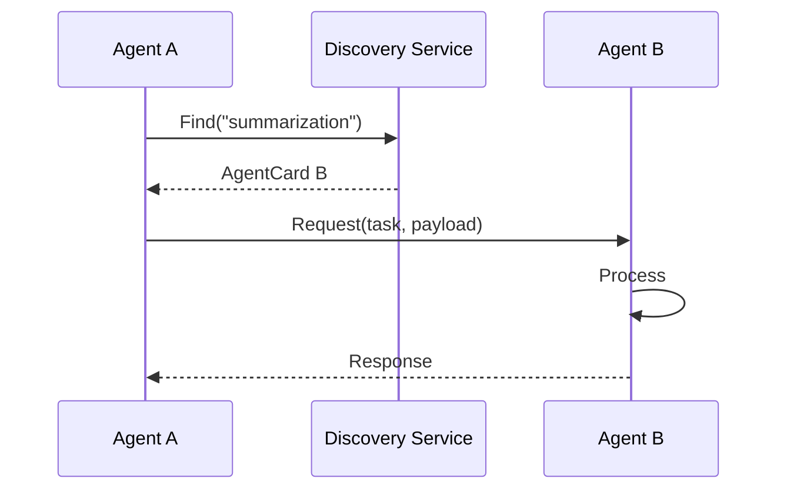

The `core/a2a` module implements the **Agent-to-Agent Protocol**, enabling standardized communication between different agents within the system.

---

## Structure

```text
core/a2a/
├── __init__.py
├── protocol.py       # Core protocol definition
├── client.py         # A2A Client implementation
├── server.py         # A2A Server implementation
├── discovery.py      # Agent discovery service
├── agent_card.py     # Agent Card specification
├── router.py         # Request routing logic
└── types.py          # Common type definitions
```

---

## Agent Card

Every agent publishes its capabilities via an **Agent Card**. This card serves as the agent's identity and service definition.

```python
from core.a2a import AgentCard

card = AgentCard(
    agent_id="analyzer-001",
    name="Data Analyzer",
    description="Analyzes data and generates insights",
    capabilities=["data_analysis", "visualization", "report"],
    endpoint="http://localhost:8001/a2a",
    version="1.0.0",
    metadata={
        "max_file_size_mb": 100,
        "supported_formats": ["csv", "json", "parquet"]
    }
)

# Publish the card to the discovery service
await card.publish()
```

---

## Discovery

The Discovery service allows agents to find each other based on capabilities or identity.

```python
from core.a2a import AgentDiscovery

discovery = AgentDiscovery()

# Find agents by capability
analysts = await discovery.find(capability="data_analysis")

# Find a specific agent by name
agent = await discovery.find_by_name("Data Analyzer")

# List all available agents
all_agents = await discovery.list_all()
```

---

## A2A Client

Use the `A2AClient` to communicate with other agents.

### Sending a Request

```python
from core.a2a import A2AClient

client = A2AClient()

# Send a synchronous request
response = await client.request(
    agent=analyst_card,
    task="analyze",
    payload={
        "data": data,
        "metrics": ["mean", "std", "correlation"]
    },
    timeout=60
)

print(response.result)
print(response.status)  # "success" | "error"
```

### Streaming Response

For long-running tasks or generated content, use the streaming interface.

```python
async for chunk in client.stream_request(
    agent=writer_card,
    task="generate_report",
    payload={"analysis": analysis_result}
):
    print(chunk, end="")
```

---

## A2A Server

Expose your own agent services using the `A2AServer`.

```python
from core.a2a import A2AServer

server = A2AServer(card=my_agent_card)

@server.handler("analyze")
async def handle_analyze(payload: dict) -> dict:
    """Handle analysis tasks."""
    result = await analyze_data(payload["data"])
    return {"analysis": result}

@server.handler("generate_report")
async def handle_report(payload: dict):
    """Handle report generation with streaming."""
    async for chunk in generate_report(payload):
        yield chunk

# Start the server
await server.start(port=8001)
```

---

## Complete Flow

The following diagram illustrates the interaction between agents and the discovery service.



---

## Security

The protocol supports authentication to ensure secure inter-agent communication.

```python
from core.a2a import A2AClient, AuthMethod

# Using an API Key
client = A2AClient(
    auth=AuthMethod.API_KEY,
    api_key="secret-key"
)

# Using JWT Token
client = A2AClient(
    auth=AuthMethod.JWT,
    jwt_token=token
)
```

---

## Resilience and Failover

Distributed systems can fail. The A2A protocol includes built-in mechanisms to handle failures gracefully.

### Circuit Breaker

Prevents cascading failures by stopping requests to unresponsive agents.

```python
from core.a2a import A2AClient, CircuitBreaker

client = A2AClient(
    circuit_breaker=CircuitBreaker(
        failure_threshold=5,  # Open circuit after 5 failures
        timeout=60,           # Reset timeout (seconds)
        half_open_calls=3     # Test calls before closing circuit
    )
)

# Protected call
try:
    result = await client.request(agent_card, task, payload)
except CircuitBreakerOpenError:
    # Circuit is open, agent is likely down
    fallback_result = await use_fallback_agent()
```

### Retry with Backoff

Automatically retry failed requests with exponential backoff.

```python
client = A2AClient(
    max_retries=3,
    retry_backoff="exponential",  # e.g., 1s, 2s, 4s
    retry_on=[NetworkError, TimeoutError]
)
```

### Health Monitoring

Continuously monitor agent health and update the discovery service.

```python
from core.a2a import AgentDiscovery

discovery = AgentDiscovery()

# Periodic health check loop
async def monitor_agents():
    while True:
        agents = await discovery.list_all()

        for agent in agents:
            try:
                health = await client.health_check(agent)
                if not health.is_healthy:
                    await discovery.mark_unhealthy(agent.id)
            except Exception:
                await discovery.mark_unhealthy(agent.id)

        await asyncio.sleep(30)
```

### Automatic Failover

Automatically try alternative agents if the primary one is unavailable.

```python
async def resilient_request(capability: str, task: dict):
    # Find all agents with the required capability
    agents = await discovery.find(capability=capability)

    # Sort by health status and current load
    agents = sort_by_health_and_load(agents)

    # Try each agent until success
    for agent in agents:
        try:
            result = await client.request(
                agent,
                task=task,
                timeout=30
            )
            return result
        except AgentUnreachableError:
            # Try the next agent
            continue

    raise AllAgentsUnreachableError()
```

!!! tip "Production Resilience"
    - Always use **retries with exponential backoff**.
    - Implement **circuit breakers** for external agent calls.
    - Actively **monitor health** and prune unhealthy agents from discovery.
    - Have a **fallback plan** for critical capabilities.

---

## Configuration

Configure the A2A protocol via environment variables in your `.env` file.

```env title=".env"
A2A_DISCOVERY_URL=http://localhost:8500
A2A_DEFAULT_TIMEOUT=60
A2A_AUTH_METHOD=api_key
A2A_API_KEY=your-secret-key
```

---

## A2UI — Agent-to-UI blueprint schema

`core/a2a/a2ui.py` defines a closed-whitelist JSON schema for any UI an
agent emits. The agent never returns raw HTML or JavaScript; it emits a
JSON tree of pre-approved components and the client renders the tree
natively (web, mobile, desktop). The schema rejects unknown component
types at the boundary, eliminating an entire class of code-injection
risk.

### Whitelisted components

| Component | Purpose |
|-----------|---------|
| `Container` | Layout group, holds `children` |
| `Text` | Plain text block |
| `Heading` | Heading level 1-6 |
| `Button` | Action trigger (`action`, `payload`) |
| `Link` | URL link |
| `Image` | `src` + `alt` |
| `Input` | Form field (text/number/email/password/textarea) |
| `Form` | Holds inputs and a submit `action` |
| `List` + `ListItem` | Ordered/unordered list |
| `Divider` | Visual separator |
| `Badge` | Tagged label with semantic tone (neutral/success/warning/danger/info) |

The schema enforces two structural caps to prevent denial-of-service via
runaway nesting: `MAX_TREE_DEPTH` (default 16) and `MAX_TREE_NODES`
(default 256).

### Validation entry point

```python
from core.a2a.a2ui import A2UIBlueprint, validate_blueprint

payload = {
    "schema_version": "a2ui/v1",
    "root": {
        "type": "container",
        "children": [
            {"type": "heading", "content": "Order #42", "level": 2},
            {"type": "text", "content": "Estimated delivery: tomorrow"},
            {
                "type": "form",
                "action": "submit_feedback",
                "children": [
                    {"type": "input", "name": "rating", "input_type": "number"},
                    {"type": "button", "label": "Send", "action": "submit"},
                ],
            },
        ],
    },
}

blueprint: A2UIBlueprint = validate_blueprint(payload)
```

`validate_blueprint` raises `A2UIValidationError` on bounds violation,
and Pydantic raises a `ValidationError` on unknown component types,
forbidden extra fields, or wrong schema version. Reject the agent's
output at the controller layer; never relay an unvalidated payload.
