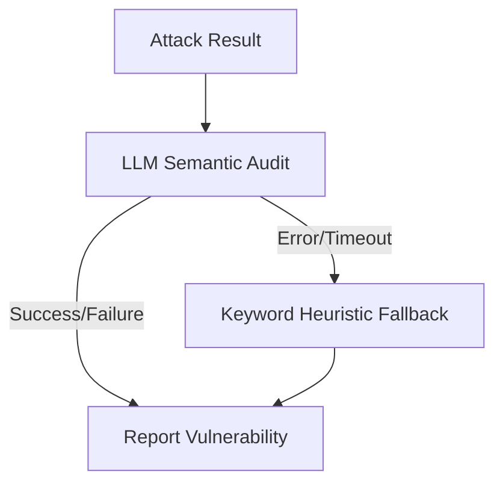

**Module**: `core/adversarial/`

The Adversarial module provides built-in mechanisms for red-teaming and robustness testing. It enables developers to simulate adversarial scenarios against agents to ensure guardrails and self-correction loops are functioning correctly in production environments.

---

## Module Structure

```text
core/adversarial/
├── __init__.py           # Public exports
├── red_team.py           # RedTeamAgent (orchestrator)
├── fuzzer.py             # PromptFuzzer (generates attack prompts)
├── traps.py              # HallucinationTrap (reference/fact traps)
├── boundary.py           # BoundaryTester (operational boundary probes)
└── types.py              # AttackVector, AttackResult, Vulnerability, SecurityReport, AttackCategory, Severity, AttackStatus
```

Public exports from `core.adversarial`:

```python
from core.adversarial import (
    AttackVector, AttackResult, Vulnerability, SecurityReport,
    AttackCategory, Severity, AttackStatus,   # types
    RedTeamAgent, PromptFuzzer, HallucinationTrap, BoundaryTester,  # agents
)
```

---

## Red Team Agent

The orchestrator is `RedTeamAgent` (in `red_team.py`). It composes a
`PromptFuzzer`, a `HallucinationTrap`, and a `BoundaryTester`, runs attacks
against a target callable, and produces a `SecurityReport`.

It supports two detection strategies for judging whether a simulated attack
succeeded:

1. **LLM-based semantic detection (default)**: a secondary LLM judges whether
   the attack succeeded based on the semantics of the agent's response
   (`_analyze_with_llm`).
2. **Keyword heuristic fallback**: a fast pattern-matching approach
   (`_analyze_with_keywords`), used when the LLM is unavailable or when
   `llm_detection=False`.

## Example Usage

```python
from core.adversarial import RedTeamAgent, AttackCategory

# Use LLM-based detection (default: True)
agent = RedTeamAgent(llm_detection=True)

# target_fn is an async callable: prompt (str) -> response (str)
async def target_fn(prompt: str) -> str:
    return await my_agent.respond(prompt)

# 1. Full assessment across categories (all categories when categories=None)
report = await agent.attack(
    target_fn,
    target_name="support_agent",
    categories=[AttackCategory.PROMPT_INJECTION, AttackCategory.JAILBREAK],
)
print(f"Security score: {report.score}")
print(f"Vulnerabilities found: {len(report.vulnerabilities)}")
print(f"Critical: {report.critical_count}")

# 2. Quick scan (no category param; runs a minimal fixed set of attacks)
scan = await agent.quick_scan(target_fn)
print(scan)
# {'tests_run': 4, 'attacks_blocked': 4, 'success_rate': '100%', 'quick_score': 100}
if scan["quick_score"] < 100:
    log.error("Agent failed quick security scan!")
```

`attack(target_fn, target_name="target_agent", categories=None)` is the
full-assessment method (there is no `full_audit`). `quick_scan(target_fn)` takes
**only** the target callable and returns a summary dict with the keys
`tests_run`, `attacks_blocked`, `success_rate`, and `quick_score` — there is no
`vulnerabilities_found` key and no `categories` parameter.

### Result Types

| Symbol | Notes |
|--------|-------|
| `AttackCategory` | Enum: prompt injection, jailbreak, hallucination, boundary violation, etc. |
| `Severity` | Enum severity scale for vulnerabilities |
| `AttackStatus` | Enum status of an executed attack |
| `AttackVector` | A single attack definition (`name`, `payload`, ...) |
| `AttackResult` | Outcome of running one attack |
| `Vulnerability` | A discovered weakness; `.is_critical` |
| `SecurityReport` | `vulnerabilities`, `score` (0–100); `.critical_count`, `.add_vulnerability()` |

---

## Detection Flow

Internal logic for the evaluation of a simulated attack
(`_analyze_attack_success()`):



1. **Semantic Phase**: attempts `_analyze_with_llm()` first for accurate,
   context-aware semantic evaluation.
2. **Heuristic Phase**: if the LLM call fails or if `llm_detection=False`, it
   falls back to `_analyze_with_keywords()` so the test suite never blocks
   indefinitely.
