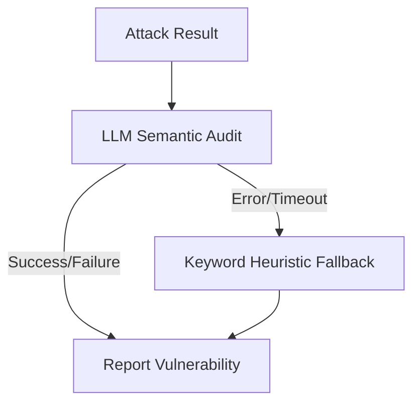

**Module**: `core/adversarial/`

The Adversarial module provides built-in mechanisms for red-teaming and robustness testing. It enables developers to simulate adversarial scenarios against agents to ensure guardrails and self-correction loops are functioning correctly in production environments.

---

## Module Structure

```text
core/adversarial/
├── __init__.py           # Audit exports
├── red_team.py           # RedTeamFramework core
├── scenarios/            # Built-in attack payloads
│   ├── injection.py      # Prompt injection
│   ├── jailbreak.py      # System bypass
│   └── ...
└── detectors.py          # Semantic success detection
```

---

## Red Team Framework

The `RedTeamFramework` supports two main detection strategies to evaluate whether an simulated attack was successful:

1. **LLM-based semantic detection (default)**: A secondary LLM judges whether the attack succeeded based on the semantic meaning of the agent's response.
2. **Keyword heuristic fallback**: A fast pattern-matching approach on known attack-success indicators, utilized when the LLM is unavailable or when `llm_detection=False`.

## Example Usage

```python
from core.adversarial.red_team import RedTeamFramework, AttackCategory

# Use LLM-based detection (default: True)
framework = RedTeamFramework(llm_detection=True)

# 1. Full audit across all attack categories
report = await framework.full_audit(target_agent)
print(f"Vulnerabilities found: {len(report.vulnerabilities)}")

# 2. Quick scan on specific categories
scan = await framework.quick_scan(
    target_agent,
    categories=[AttackCategory.PROMPT_INJECTION, AttackCategory.JAILBREAK],
)
if scan.vulnerabilities_found > 0:
    log.error("Agent failed security scan!")
```

---

## Detection Flow

Internal logic for the evaluation of a simulated attack (`_analyze_attack_success()`):



1. **Semantic Phase**: Attempts `_analyze_with_llm()` first for highly accurate, context-aware semantic evaluation.
2. **Heuristic Phase**: If the LLM call fails, times out, or if `llm_detection=False`, it falls back to `_analyze_with_keywords()` to ensure the test suite never blocks indefinitely.
