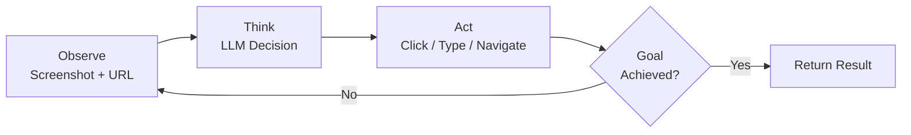
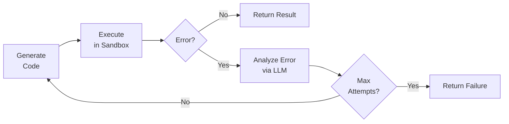

# Agentic Modules

The historical `core/agents/` entrypoints are now **compatibility shims**. The canonical implementations of **BrowserAgent** and **CodingAgent** live in the official plugins `plugins/browser_agent/` and `plugins/coding_agent/`, keeping the Sacred Core free from application-specific agent logic.

!!! info "Current State"
    Existing imports from `core.agents` remain supported for backward compatibility, but new code should prefer the plugin packages directly.

## Module Structure

```txt
plugins/
├── browser_agent/
│   ├── agent.py           # ReAct-loop browser automation
│   ├── tools.py           # LangChain/MCP-compatible browser tools
│   ├── types.py           # BrowserAction, PageState, BrowserAgentResult
│   └── plugin.py          # BrowserAgentPlugin
├── coding_agent/
│   ├── agent.py           # Auto-debug coding agent
│   ├── tools.py           # Coding tool definitions and adapters
│   ├── types.py           # CodeLanguage, CodingResult, CodeExecutionResult
│   └── plugin.py          # CodingAgentPlugin
└── ...

core/agents/
├── browser_agent.py       # Backward-compatible shim
├── browser_tools.py       # Backward-compatible shim
├── browser_types.py       # Backward-compatible shim
├── coding/
│   └── __init__.py        # Backward-compatible shim
└── coding_tools.py        # Backward-compatible shim
```

---

## BrowserAgent

An autonomous agent that controls a web browser via **Playwright**, using the Vision service for page understanding.

### Architecture

Implements the **ReAct (Reason + Act)** loop:



### Usage

```python
from plugins.browser_agent import BrowserAgent

# Context manager handles Playwright lifecycle
async with BrowserAgent(headless=True) as agent:
    result = await agent.execute_task(
        "Go to google.com and search for 'Python tutorials'"
    )
    print(result.success)      # True
    print(result.final_url)    # https://www.google.com/search?q=...
    print(result.steps_taken)  # Number of actions taken
```

### Configuration

| Parameter         | Default    | Description                           |
| ----------------- | ---------- | ------------------------------------- |
| `max_steps`       | `20`       | Maximum ReAct iterations              |
| `headless`        | `True`     | Run browser headlessly                |
| `viewport_width`  | `1280`     | Browser viewport width                |
| `viewport_height` | `720`      | Browser viewport height               |
| `vision_service`  | `None`     | Injected `VisionService` instance (defaults to `VisionService()`) |

### Supported Actions

| Action     | Description   | Example                                                    |
| ---------- | ------------- | ---------------------------------------------------------- |
| `navigate` | Go to a URL   | `{"action": "navigate", "value": "https://..."}`           |
| `click`    | Click element | `{"action": "click", "selector": "button.submit"}`         |
| `type`     | Type text     | `{"action": "type", "selector": "input", "value": "text"}` |
| `scroll`   | Scroll page   | `{"action": "scroll", "value": "down"}`                    |
| `wait`     | Wait seconds  | `{"action": "wait", "value": "2"}`                         |
| `extract`  | Extract text  | `{"action": "extract", "selector": ".result"}`             |
| `done`     | Goal complete | `{"action": "done", "reasoning": "task done"}`             |

### MCP Tools Integration

```python
from plugins.browser_agent import register_browser_tools

# Register the browser tools onto an MCP server (returns None)
register_browser_tools(server)
```

---

## CodingAgent

An autonomous coding agent with an **auto-debug loop** for code generation, testing, and refactoring. Executes code securely via the [Sandbox Service](services.md).

**Architecture**



**Usage**

```python
from plugins.coding_agent import CodingAgent

agent = CodingAgent(
    max_fix_attempts=5,
    execution_timeout=30,
)

# Auto-debug loop: runs the code, analyzes the error, and self-corrects
result = await agent.fix_code(
    code="def add(a, b):\n    retun a + b",
    error_message="SyntaxError: invalid syntax",
)

# Generate unit tests from existing code
tests = await agent.generate_tests(
    code="def add(a, b): return a + b",
    test_framework="pytest",
)

# Explain code
explanation = await agent.explain_code(code)

# Refactor code
refactored = await agent.refactor_code(code, goals="improve readability")
```

### Supported Languages

```python
from plugins.coding_agent import CodeLanguage

CodeLanguage.PYTHON     # "python"
CodeLanguage.JAVASCRIPT # "javascript"
CodeLanguage.TYPESCRIPT # "typescript"
```

**MCP Tools Integration**

```python
from plugins.coding_agent import register_coding_tools

register_coding_tools(server)  # Registers coding tools onto an MCP server (returns None)
```

---

## Security Notes

!!! warning "Sandbox Required"
    The `CodingAgent` **requires** the Sandbox Service (Docker-based execution). It will refuse to run code locally, preventing arbitrary code execution on the host.

!!! info "Vision Dependency"
    The `BrowserAgent` requires a configured Vision provider (Ollama, OpenAI, or Anthropic). Make sure `VISION_PROVIDER` is set in your `.env`.
