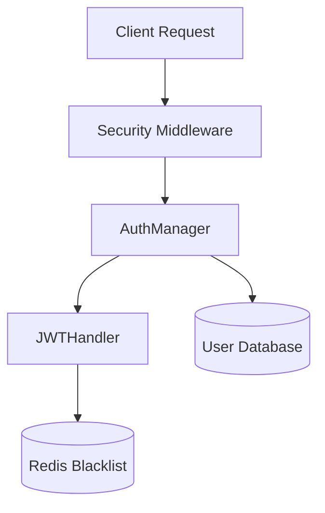

The `core/auth` module provides a secure, flexible system for managing user identity and controlling access to system resources. It supports JWT-based authentication, API key validation, and Role-Based Access Control (RBAC).

## Architecture

The authentication system is built around three main components:

1. **AuthManager**: The high-level orchestrator that handles login, token generation, and verification.
2. **JWTHandler**: Manages the creation, decoding, and blacklist validation of JSON Web Tokens.
3. **Security Middleware**: Intercepts incoming HTTP requests to enforce authentication and **distributed rate limits** via Redis.
4. **APIKeyValidator**: Manages API key registration, validation, and **expiration**.



---

## Authentication Flow

### Token Generation

When a user authenticates, the system generates a pair of tokens:

- **Access Token**: Short-lived (default 30m) token for API requests.
- **Refresh Token**: Long-lived token for obtaining new access tokens. BaselithCore implements **Refresh Token Rotation**, where using a refresh token revokes it and issues a new pair.

### Token Rotation Flow

1. Client sends a valid `refresh_token`.
2. `AuthManager` verifies and **immediately revokes** (blacklists) the token.
3. A new `access_token` and `refresh_token` are returned to the client.
4. If a leaked refresh token is reused, the rotation fails as the token is already blacklisted, protecting the account.

### Token Verification

For every request, the `AuthManager` verifies:

1. **Signature**: The token was signed by the system's `SECRET_KEY`.
2. **Expiration**: The token has not expired.
3. **Blacklist**: The token's unique identifier (`jti`) is not present in the Redis blacklist.

---

## Token Blacklisting

To support secure logout and incident response, BaselithCore implements a **Redis-backed token blacklist**.

When a token is revoked (e.g., during logout):

1. The token's `jti` (JWT ID) and expiration time are extracted.
2. The `jti` is stored in Redis with a TTL matching the token's remaining life.
3. Subsequent verification attempts for this token will fail immediately.

!!! important "Redis Dependency"
    Token blacklisting requires an active Redis connection. If Redis is unavailable, the system fails closed (rejects tokens) if `STRICT_AUTHENTICATION` is enabled.

---

## Role-Based Access Control (RBAC)

BaselithCore uses a standard set of roles to control access to API endpoints and internal services:

| Role        | Description                                                |
| ----------- | ---------------------------------------------------------- |
| `admin`     | Full system access, including configuration and user mgmt. |
| `developer` | Ability to create agents, plugins, and manage workflows.   |
| `user`      | Basic chat and query capabilities.                         |
| `guest`     | Read-only access to public resources.                      |

### Enforcing Roles

You can enforce role requirements in FastAPI routes using the `enforce_auth` utility:

```python
from core.middleware.security import SecurityManager

security = SecurityManager()

@app.get("/admin/stats")
async def get_stats(request: Request):
    # Only admins allowed, with a distributed rate limit of 10 req/min
    await security.enforce_auth(
        request, 
        allowed_roles={"admin"}, 
        limit_per_minute=10
    )
    return {"status": "ok"}
```

### API Key Expiration

API keys can be registered with an optional `expires_at` timestamp. The `APIKeyValidator` automatically rejects keys that are past their expiration date.

```python
from datetime import datetime, timedelta, timezone
from core.auth.manager import get_auth_manager

auth = get_auth_manager()
expires = datetime.now(timezone.utc) + timedelta(days=30)

auth.api_keys.register_key(
    api_key="sk-test-123",
    user_id="service-account",
    expires_at=expires
)
```

---

## Configuration

Settings are managed via `SecurityConfig` in `core/config/security.py`.

| Variable               | Default | Description                                         |
| ---------------------- | ------- | --------------------------------------------------- |
| `SECRET_KEY`           | -       | **Mandatory** key for signing tokens (min 32 chars) |
| `JWT_ALGORITHM`        | `HS256` | Algorithm used for JWT signing                      |
| `ACCESS_TOKEN_EXPIRE`  | `30`    | Access token lifetime in minutes                    |
| `REFRESH_TOKEN_EXPIRE` | `10080` | Refresh token lifetime in minutes (7 days)          |

!!! warning "Security"
    Never deploy to production with a `SECRET_KEY` shorter than 32 characters or the default `admin` password. The system will issue a warning at startup if insecure defaults are detected.
