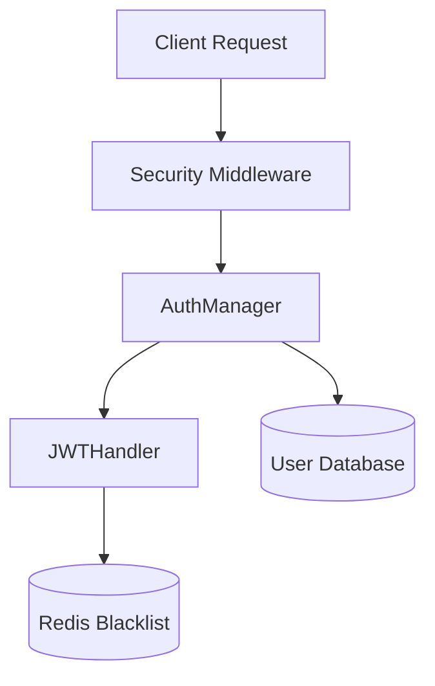
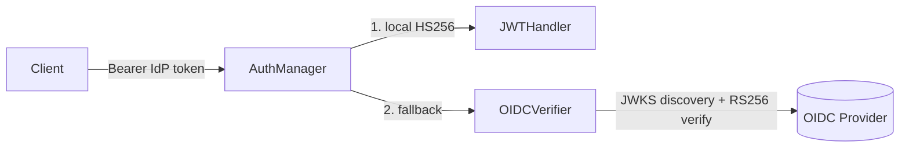

The `core/auth` module provides a secure, flexible system for managing user identity and controlling access to system resources. It supports JWT-based authentication, API key validation, and Role-Based Access Control (RBAC).

## Architecture

The authentication system is built around three main components:

1. **AuthManager**: The high-level orchestrator that handles login, token generation, and verification.
2. **JWTHandler**: Manages the creation, decoding, and blacklist validation of JSON Web Tokens.
3. **Security Middleware**: Intercepts incoming HTTP requests to enforce authentication and **distributed rate limits** via Redis.
4. **APIKeyValidator**: Manages API key registration, validation, and **expiration**.



---

## Authentication Flow

### Token Generation

When a user authenticates, the system generates a pair of tokens:

- **Access Token**: Short-lived (default 30m) token for API requests.
- **Refresh Token**: Long-lived token for obtaining new access tokens. BaselithCore implements **Refresh Token Rotation**, where using a refresh token revokes it and issues a new pair.

### Token Rotation Flow

1. Client sends a valid `refresh_token`.
2. `AuthManager` verifies and **immediately revokes** (blacklists) the token.
3. A new `access_token` and `refresh_token` are returned to the client.
4. If a leaked refresh token is reused, the rotation fails as the token is already blacklisted, protecting the account.

### Token Verification

For every request, the `AuthManager` verifies:

1. **Signature**: The token was signed by the system's `SECRET_KEY`.
2. **Expiration**: The token has not expired. The `exp` claim is **required** — a token without it (which would never expire and could never be blacklisted) is rejected as invalid.
3. **Blacklist**: The token's unique identifier (`jti`) is not present in the Redis blacklist.
4. **Issuer** (`iss`): If `JWT_ISSUER` is configured, only tokens issued by that issuer are accepted.
5. **Audience** (`aud`): If `JWT_AUDIENCE` is configured, only tokens intended for that audience are accepted.
6. **Strict mode** (`JWT_STRICT_VALIDATION=true`): rejects any token missing the `aud` or `iss` claims, regardless of handler configuration. Opt-in, non-breaking. Recommended for multi-region/multi-cluster deployments.

!!! tip "Multi-service environments"
    Configure `JWT_ISSUER` and `JWT_AUDIENCE` when running multiple services to prevent a token issued for service A from being accepted by service B. For multi-region deployments, also set `JWT_STRICT_VALIDATION=true` to enforce both claims.

### Signing-key handling & algorithm safety

- **Wrapped secret**: `JWTHandler` accepts the signing key as `str | SecretStr`.
  `AuthManager` passes it as a `SecretStr` and the plaintext is unwrapped only
  inside the handler, so the key does not leak through `repr()`/tracebacks/Sentry
  frames on the way in.
- **`none` algorithm rejected**: constructing a `JWTHandler` with the `none`
  (or empty) algorithm raises `ValueError`. The `none` algorithm disables
  signature verification — the classic JWT downgrade attack — so it is never
  permitted regardless of caller input.

---

## Token Blacklisting

To support secure logout and incident response, BaselithCore implements a **Redis-backed token blacklist**.

When a token is revoked (e.g., during logout):

1. The token's `jti` (JWT ID) and expiration time are extracted.
2. The `jti` is stored in Redis with a TTL matching the token's remaining life.
3. Subsequent verification attempts for this token will fail immediately.

!!! important "Redis Dependency"
    Token blacklisting requires an active Redis connection. If Redis is unavailable, the system fails closed (rejects tokens) if `STRICT_AUTHENTICATION` is enabled.

!!! note "Already-expired tokens"
    `revoke_token` only blacklists tokens that still have remaining lifetime (`exp > now`). Tokens that are already expired are intentionally **not** added to the blacklist because `verify_token` always runs standard JWT expiration verification (`verify_exp=True`) before consulting the blacklist, so an expired token is rejected before the blacklist check. This avoids storing zero-TTL entries that Redis would immediately evict.

!!! note "In-process verify cache vs. revocation"
    `verify_token` caches a successful verification in-process for a short window (≤5 s, never past the token's `exp`) to skip the signature decode and the Redis blacklist round-trip on repeat requests. `revoke_token` evicts the local entry immediately, so revocation is instant within the same worker; across other workers the blacklist takes effect after at most the cache window. The cache is a **bounded LRU** (8192 entries) — a burst of distinct valid tokens (rotation or token spray) cannot grow it without limit; the oldest entries are evicted at the cap.

---

## Role-Based Access Control (RBAC)

BaselithCore uses a standard set of roles to control access to API endpoints and internal services:

| Role        | Description                                                |
| ----------- | ---------------------------------------------------------- |
| `admin`     | Full system access, including configuration and user mgmt. |
| `developer` | Ability to create agents, plugins, and manage workflows.   |
| `user`      | Basic chat and query capabilities.                         |
| `guest`     | Read-only access to public resources.                      |

### Enforcing Roles

You can enforce role requirements in FastAPI routes using the `enforce_auth` utility:

```python
from core.middleware.security import SecurityManager

security = SecurityManager()

@app.get("/admin/stats")
async def get_stats(request: Request):
    # Only admins allowed, with a distributed rate limit of 10 req/min
    await security.enforce_auth(
        request,
        allowed_roles={"admin"},
        limit_per_minute=10
    )
    return {"status": "ok"}
```

### API Key Expiration

API keys can be registered with an optional `expires_at` timestamp. The `APIKeyValidator` automatically rejects keys that are past their expiration date.

```python
from datetime import datetime, timedelta, timezone
from core.auth.manager import get_auth_manager

auth = get_auth_manager()
expires = datetime.now(timezone.utc) + timedelta(days=30)

auth.api_keys.register_key(
    api_key="sk-test-123",
    user_id="service-account",
    expires_at=expires
)
```

---

## Capability Scopes (fine-grained authorization)

Roles are coarse. For least-privilege access — "this key may only publish to
webhooks, nothing else" — BaselithCore layers **capability scopes** on top of
roles. A scope is a `resource:action` string (e.g. `chat:write`,
`webhooks:write`, `tenants:manage`). The grammar and the default role→scope map
live in `core/auth/scopes.py`.

### Grammar

| Form           | Meaning                                   |
| -------------- | ----------------------------------------- |
| `chat:write`   | Exact capability                          |
| `chat:*`       | Every action on the `chat` resource       |
| `*`            | Superuser — every scope (held by `admin`) |

The capabilities an identity actually carries are the **union** of the scopes
implied by its roles (`ROLE_SCOPES`) and any explicit scopes attached to it (a
scoped API key or a JWT `scopes` claim). Explicit grants can only *add*
capability — they never subtract what a role already implies. This makes the
whole feature **additive and backward compatible**: an identity that carries
only roles keeps exactly the access it had before.

### Default role → scope map

| Role        | Scopes                                                      |
| ----------- | ---------------------------------------------------------- |
| `admin`     | `*` (all)                                                  |
| `service`   | `chat:*`, `memory:*`, `feedback:*`, `webhooks:*`, `metrics:read` |
| `user`      | `chat:read/write`, `memory:read/write`, `feedback:write`, `metrics:read` |
| `job`       | `chat:read/write`, `memory:read`, `metrics:read`           |
| `guest`     | `chat:read`, `metrics:read`                                |
| `anonymous` | *(none)*                                                   |

Control-plane scopes (`keys:manage`, `flags:manage`, `dlq:manage`,
`tenants:manage`, `plugins:manage`, `privacy:manage`) are reserved for `admin` (via `*`) or an
explicit grant.

### Enforcing scopes

Use the manager at any choke point — a route handler, a tool gate, a service
call — independent of HTTP routing:

```python
from core.auth.manager import get_auth_manager
from core.auth.types import AuthUser

auth = get_auth_manager()

# Imperative check (raises InsufficientScopeError → HTTP 403):
auth.enforce_scopes(user, "webhooks:write")

# Decorator form (identity passed as `user`/`current_user` kwarg):
@auth.require_scopes("webhooks:write")
async def create_webhook(user: AuthUser):
    ...

# On the identity directly:
if user.has_scope("tenants:manage"):
    ...
```

A denied check raises `InsufficientScopeError` (a subclass of
`InsufficientPermissionsError`), which the API error envelope renders as a
`403` with code `insufficient_scope`.

### Scoped API keys

Mint a least-privilege key with `API_KEYS_SCOPED` — `key=scope|scope` entries,
comma-separated:

```bash
API_KEYS_SCOPED="sk_hook=webhooks:write,sk_ro=chat:read|metrics:read"
```

`sk_hook` can publish webhooks and do nothing else; `sk_ro` is read-only. Each
scoped key is loaded with the `service` role but **no** role-derived data-plane
access beyond its explicit scopes. Programmatically:

```python
auth.api_keys.register_key(
    api_key="sk-test-123",
    user_id="hook-bot",
    scopes={"webhooks:write"},
)
```

### Scoped tokens

`create_token` accepts a `scopes` set that is embedded as a `scopes` JWT claim
and restored on `verify_token`:

```python
token = await auth.create_token(
    "u1", roles={AuthRole.GUEST}, scopes={"webhooks:write"}
)
```

---

## Federated SSO (OpenID Connect)

BaselithCore can accept bearer tokens minted by an external identity provider —
Okta, Auth0, Azure AD, Keycloak, or any OIDC-compliant IdP — alongside its own
HS256 tokens. This is the enterprise SSO path: users log in at the IdP, and the
IdP's access/ID token is presented to the API.

The feature is **opt-in** (`OIDC_ENABLED`) and **additive**. When enabled, the
bearer path verifies a token locally first (self-issued HS256) and only falls
back to OIDC if that fails — so existing self-issued tokens keep working with
zero network dependency.



### How verification works

1. The IdP's JWKS endpoint is resolved — either the explicit `OIDC_JWKS_URL`, or
   discovered from `{OIDC_ISSUER}/.well-known/openid-configuration`.
2. The signing key for the token's `kid` is fetched (cached by `PyJWKClient`;
   the network call runs in a worker thread so the event loop never blocks).
3. The signature (`RS256`/`ES256`), `iss`, `aud`, and `exp` are validated.
4. Claims are mapped to an `AuthUser` (see below).

### Claim mapping

| Setting               | Default   | Maps to                                  |
| --------------------- | --------- | ---------------------------------------- |
| `OIDC_USERNAME_CLAIM` | `sub`     | `AuthUser.user_id`                       |
| `OIDC_ROLES_CLAIM`    | `roles`   | roles (translated via `OIDC_ROLE_MAP`)   |
| `OIDC_SCOPES_CLAIM`   | `scope`   | capability scopes (space-string or array)|
| `OIDC_TENANT_CLAIM`   | *(none)*  | `AuthUser.tenant_id`                      |

IdP group/role strings are translated to BaselithCore [roles](#role-based-access-control-rbac)
via `OIDC_ROLE_MAP`; unmapped identities receive `OIDC_DEFAULT_ROLE` (`user`).
The resulting roles drive the same [capability scopes](#capability-scopes-fine-grained-authorization)
as any other identity.

### Example (Keycloak)

```bash
OIDC_ENABLED=true
OIDC_ISSUER=https://keycloak.example.com/realms/prod
OIDC_AUDIENCE=baselith-api
OIDC_ROLES_CLAIM=realm_access.roles   # provider-specific claim path
OIDC_ROLE_MAP="baselith-admins:admin,baselith-users:user"
OIDC_TENANT_CLAIM=org_id
```

!!! note "JWKS path varies by provider"
    Okta, Azure AD and Keycloak each expose JWKS at a different path, so the
    discovery document is read by default. Set `OIDC_JWKS_URL` explicitly to skip
    discovery (one fewer round-trip) or for providers with a non-standard layout.

---

### API Key Hashing

To prevent sensitive API keys from leaking into distributed logs or the Redis cache, BaselithCore **hashes all API keys** using SHA-256 before using them as identifiers for rate limiting.

When a request is received with `x-api-key`:

1. The key is validated against the database.
2. If valid, its SHA-256 hash is computed.
3. The hash is used as the key in Redis for tracking request counts.

This ensures that even if a Redis instance is compromised, the original API keys cannot be recovered from the rate-limiting keys.

---

## Admin Lockout

Failed admin login attempts are tracked in Redis. After **5 consecutive failures** within a 60-second window, the account is locked for **15 minutes**. A successful login clears the counter.

This protects against brute-force attacks on the `/admin` interface without requiring an external WAF.

!!! info "Redis-down fallback"
    If Redis is temporarily unavailable, admin lockout state falls back to an **in-memory counter** within the current process. This ensures brute-force protection is maintained even during Redis outages, though the in-memory state is not shared across multiple worker processes.

---

## Audit Logging

Every authentication event produced by `enforce_auth` emits a structured log line:

| Level     | Event              | Fields included               |
| --------- | ------------------ | ----------------------------- |
| `DEBUG`   | Successful auth    | `user`, `role`, `ip`, `path`  |
| `WARNING` | Unauthorized (401) | `ip`, `user-agent`, `path`    |
| `WARNING` | Forbidden (403)    | `user`, `roles`, `ip`, `path` |

Log format example:

```text
AUDIT | AUTH | ok      | user=u-123 role=user ip=10.0.0.5 path=/chat
AUDIT | AUTH | unauthorized | ip=1.2.3.4 ua=curl/7.x path=/admin
AUDIT | AUTH | forbidden    | user=u-123 roles=['user'] ip=10.0.0.5 path=/admin
```

The `user-agent` field is truncated to 200 characters to prevent log injection via oversized headers.

---

## Tenant Context Propagation

When a protected endpoint is called, `enforce_auth` writes the authenticated `AuthUser` to `request.state.user` **and** overrides the tenant context via `set_tenant_context(user.tenant_id)`. This ensures that `get_current_tenant_id()` returns the correct tenant for the duration of the request, even though `TenantMiddleware` runs before the FastAPI dependency graph is evaluated.

```python
# In any service called from a protected endpoint:
from core.context import get_current_tenant_id

tenant = get_current_tenant_id()  # Always correct — set by enforce_auth
```

---

## Configuration

Settings are managed via `SecurityConfig` in `core/config/security.py`.

| Variable               | Default | Description                                                  |
| ---------------------- | ------- | ------------------------------------------------------------ |
| `SECRET_KEY`           | -       | **Mandatory** key for signing tokens (min 32 chars)          |
| `JWT_ALGORITHM`        | `HS256` | Algorithm used for JWT signing                               |
| `JWT_ISSUER`           | `None`  | Optional `iss` claim added to tokens and validated on decode |
| `JWT_AUDIENCE`         | `None`  | Optional `aud` claim added to tokens and validated on decode |
| `JWT_STRICT_VALIDATION`| `false` | Rejects tokens missing `aud`/`iss`. Opt-in; enable for multi-region deployments |
| `ACCESS_TOKEN_EXPIRE`  | `30`    | Access token lifetime in minutes                             |
| `REFRESH_TOKEN_EXPIRE` | `10080` | Refresh token lifetime in minutes (7 days)                   |
| `API_KEYS_SCOPED`      | -       | Least-privilege scoped keys: `key=scope\|scope,...` (see [Capability Scopes](#capability-scopes-fine-grained-authorization)) |
| `OIDC_ENABLED`         | `false` | Enable federated SSO via an external OIDC provider           |
| `OIDC_ISSUER`          | `None`  | OIDC issuer URL (validated as `iss`)                         |
| `OIDC_AUDIENCE`        | `None`  | Expected `aud` for IdP tokens                                |
| `OIDC_JWKS_URL`        | `None`  | Explicit JWKS endpoint (else discovered from the issuer)     |
| `OIDC_ALGORITHMS`      | `RS256` | Accepted signing algorithms (comma-separated)               |
| `OIDC_ROLE_MAP`        | -       | `idp_role:app_role,...` mapping to BaselithCore roles        |

!!! warning "Security"
    Never deploy to production with a `SECRET_KEY` shorter than 32 characters or the default `admin` password. The system will issue a warning at startup if insecure defaults are detected.
