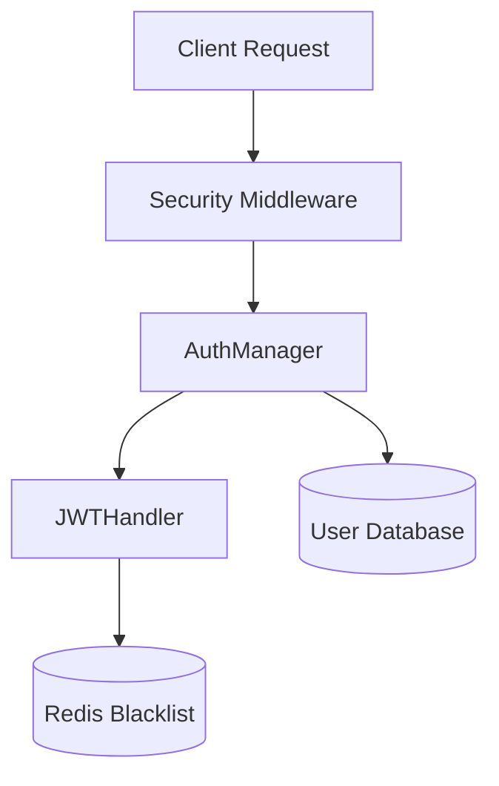

The `core/auth` module provides a secure, flexible system for managing user identity and controlling access to system resources. It supports JWT-based authentication, API key validation, and Role-Based Access Control (RBAC).

## Architecture

The authentication system is built around three main components:

1. **AuthManager**: The high-level orchestrator that handles login, token generation, and verification.
2. **JWTHandler**: Manages the creation, decoding, and blacklist validation of JSON Web Tokens.
3. **Security Middleware**: Intercepts incoming HTTP requests to enforce authentication and **distributed rate limits** via Redis.
4. **APIKeyValidator**: Manages API key registration, validation, and **expiration**.



---

## Authentication Flow

### Token Generation

When a user authenticates, the system generates a pair of tokens:

- **Access Token**: Short-lived (default 30m) token for API requests.
- **Refresh Token**: Long-lived token for obtaining new access tokens. BaselithCore implements **Refresh Token Rotation**, where using a refresh token revokes it and issues a new pair.

### Token Rotation Flow

1. Client sends a valid `refresh_token`.
2. `AuthManager` verifies and **immediately revokes** (blacklists) the token.
3. A new `access_token` and `refresh_token` are returned to the client.
4. If a leaked refresh token is reused, the rotation fails as the token is already blacklisted, protecting the account.

### Token Verification

For every request, the `AuthManager` verifies:

1. **Signature**: The token was signed by the system's `SECRET_KEY`.
2. **Expiration**: The token has not expired.
3. **Blacklist**: The token's unique identifier (`jti`) is not present in the Redis blacklist.
4. **Issuer** (`iss`): If `JWT_ISSUER` is configured, only tokens issued by that issuer are accepted.
5. **Audience** (`aud`): If `JWT_AUDIENCE` is configured, only tokens intended for that audience are accepted.

!!! tip "Multi-service environments"
    Configure `JWT_ISSUER` and `JWT_AUDIENCE` when running multiple services to prevent a token issued for service A from being accepted by service B.

---

## Token Blacklisting

To support secure logout and incident response, BaselithCore implements a **Redis-backed token blacklist**.

When a token is revoked (e.g., during logout):

1. The token's `jti` (JWT ID) and expiration time are extracted.
2. The `jti` is stored in Redis with a TTL matching the token's remaining life.
3. Subsequent verification attempts for this token will fail immediately.

!!! important "Redis Dependency"
    Token blacklisting requires an active Redis connection. If Redis is unavailable, the system fails closed (rejects tokens) if `STRICT_AUTHENTICATION` is enabled.

!!! note "Already-expired tokens"
    `revoke_token` only blacklists tokens that still have remaining lifetime (`exp > now`). Tokens that are already expired are intentionally **not** added to the blacklist because `verify_token` always runs standard JWT expiration verification (`verify_exp=True`) before consulting the blacklist, so an expired token is rejected before the blacklist check. This avoids storing zero-TTL entries that Redis would immediately evict.

---

## Role-Based Access Control (RBAC)

BaselithCore uses a standard set of roles to control access to API endpoints and internal services:

| Role        | Description                                                |
| ----------- | ---------------------------------------------------------- |
| `admin`     | Full system access, including configuration and user mgmt. |
| `developer` | Ability to create agents, plugins, and manage workflows.   |
| `user`      | Basic chat and query capabilities.                         |
| `guest`     | Read-only access to public resources.                      |

### Enforcing Roles

You can enforce role requirements in FastAPI routes using the `enforce_auth` utility:

```python
from core.middleware.security import SecurityManager

security = SecurityManager()

@app.get("/admin/stats")
async def get_stats(request: Request):
    # Only admins allowed, with a distributed rate limit of 10 req/min
    await security.enforce_auth(
        request, 
        allowed_roles={"admin"}, 
        limit_per_minute=10
    )
    return {"status": "ok"}
```

### API Key Expiration

API keys can be registered with an optional `expires_at` timestamp. The `APIKeyValidator` automatically rejects keys that are past their expiration date.

```python
from datetime import datetime, timedelta, timezone
from core.auth.manager import get_auth_manager

auth = get_auth_manager()
expires = datetime.now(timezone.utc) + timedelta(days=30)

auth.api_keys.register_key(
    api_key="sk-test-123",
    user_id="service-account",
    expires_at=expires
)
```

---

## Admin Lockout

Failed admin login attempts are tracked in Redis. After **5 consecutive failures** within a 60-second window, the account is locked for **15 minutes**. A successful login clears the counter.

This protects against brute-force attacks on the `/admin` interface without requiring an external WAF.

!!! info "Redis-down fallback"
    If Redis is temporarily unavailable, admin lockout state falls back to an **in-memory counter** within the current process. This ensures brute-force protection is maintained even during Redis outages, though the in-memory state is not shared across multiple worker processes.

---

## Audit Logging

Every authentication event produced by `enforce_auth` emits a structured log line:

| Level   | Event                 | Fields included                    |
|---------|-----------------------|------------------------------------|
| `DEBUG` | Successful auth       | `user`, `role`, `ip`, `path`       |
| `WARNING` | Unauthorized (401)  | `ip`, `user-agent`, `path`         |
| `WARNING` | Forbidden (403)     | `user`, `roles`, `ip`, `path`      |

Log format example:

```text
AUDIT | AUTH | ok      | user=u-123 role=user ip=10.0.0.5 path=/chat
AUDIT | AUTH | unauthorized | ip=1.2.3.4 ua=curl/7.x path=/admin
AUDIT | AUTH | forbidden    | user=u-123 roles=['user'] ip=10.0.0.5 path=/admin
```

The `user-agent` field is truncated to 200 characters to prevent log injection via oversized headers.

---

## Tenant Context Propagation

When a protected endpoint is called, `enforce_auth` writes the authenticated `AuthUser` to `request.state.user` **and** overrides the tenant context via `set_tenant_context(user.tenant_id)`. This ensures that `get_current_tenant_id()` returns the correct tenant for the duration of the request, even though `TenantMiddleware` runs before the FastAPI dependency graph is evaluated.

```python
# In any service called from a protected endpoint:
from core.context import get_current_tenant_id

tenant = get_current_tenant_id()  # Always correct — set by enforce_auth
```

---

## Configuration

Settings are managed via `SecurityConfig` in `core/config/security.py`.

| Variable               | Default | Description                                                    |
| ---------------------- | ------- | -------------------------------------------------------------- |
| `SECRET_KEY`           | -       | **Mandatory** key for signing tokens (min 32 chars)            |
| `JWT_ALGORITHM`        | `HS256` | Algorithm used for JWT signing                                 |
| `JWT_ISSUER`           | `None`  | Optional `iss` claim added to tokens and validated on decode   |
| `JWT_AUDIENCE`         | `None`  | Optional `aud` claim added to tokens and validated on decode   |
| `ACCESS_TOKEN_EXPIRE`  | `30`    | Access token lifetime in minutes                               |
| `REFRESH_TOKEN_EXPIRE` | `10080` | Refresh token lifetime in minutes (7 days)                     |

!!! warning "Security"
    Never deploy to production with a `SECRET_KEY` shorter than 32 characters or the default `admin` password. The system will issue a warning at startup if insecure defaults are detected.
