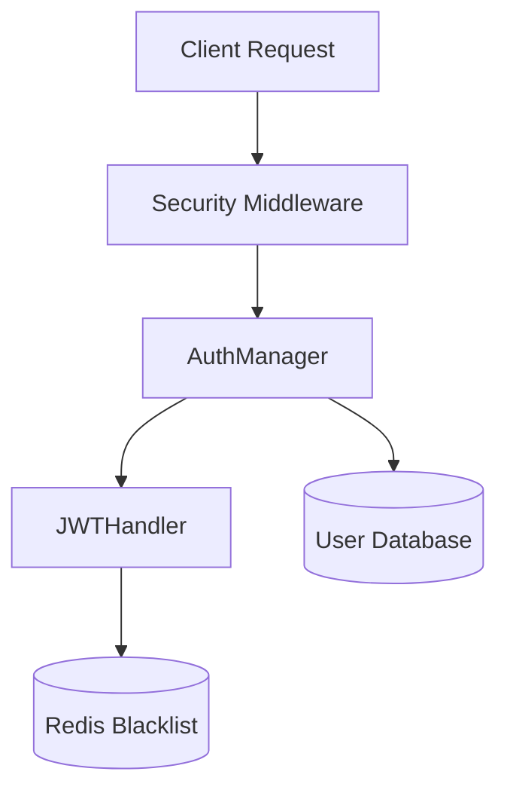
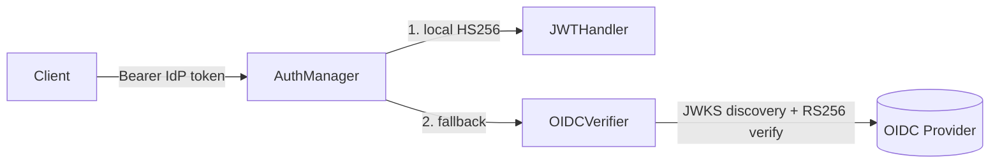

The `core/auth` module provides a secure, flexible system for managing user identity and controlling access to system resources. It supports JWT-based authentication, API key validation, and Role-Based Access Control (RBAC).

## Architecture

The authentication system is built around three main components:

1. **AuthManager**: The high-level orchestrator that handles login, token generation, and verification.
2. **JWTHandler**: Manages the creation, decoding, and blacklist validation of JSON Web Tokens.
3. **Security Middleware**: Intercepts incoming HTTP requests to enforce authentication and **distributed rate limits** via Redis.
4. **APIKeyValidator**: Manages API key registration, validation, and **expiration**.


```mermaid
graph TD
    Client[Client Request] --> Middleware[Security Middleware]
    Middleware --> Manager[AuthManager]
    Manager --> JWT[JWTHandler]
    Manager --> DB[(User Database)]
    JWT --> Redis[(Redis Blacklist)]
```

`JWTHandler` is assembled from focused private modules rather than one file, so
each concern can be read (and reviewed) on its own:

| Module | Responsibility |
| --- | --- |
| `core.auth.jwt` | `JWTHandler` itself: construction, the **verification** path (decode → blacklist → family → epoch), revocation, rotation and the short-lived in-process verify cache. |
| `core.auth._jwt_issue` | `TokenIssuanceMixin` — **minting**: assembling the claim set for access and refresh tokens and handing it to the key ring. Never touches Redis. |
| `core.auth._jwt_keys` | `JWTKeyRing` — signing/verification key material, `kid` selection, algorithm safety. |
| `core.auth._jwt_claims` | The reserved-claim set and the `extra_claims` sanitizer. |
| `core.auth._token_epoch` | `TokenEpochMixin` — per-user token epochs for bulk invalidation. |

The public surface is unchanged: `create_token`, `create_refresh_token`,
`verify_token`, `revoke_token` and `rotate_refresh_token` are all methods on
`JWTHandler`, imported as `from core.auth import JWTHandler`.

---

## Authentication Flow

### Token Generation

When a user authenticates, the system generates a pair of tokens:

- **Access Token**: Short-lived token for API requests. Lifetime is `SecurityConfig.access_token_lifetime` — default `3600` s (1 h), env `AUTH_ACCESS_TOKEN_LIFETIME` (legacy alias `AUTH_SESSION_LIFETIME`), floor 60 s.
- **Refresh Token**: Long-lived token for obtaining new access tokens — 7 days, the `JWTHandler` constructor default `refresh_lifetime=604800`; `AuthManager` does not pass it through, so there is no settings knob for it. BaselithCore implements **Refresh Token Rotation**, where using a refresh token revokes it and issues a new pair.

### Token Rotation Flow

1. Client sends a valid `refresh_token`.
2. `AuthManager` verifies and **immediately revokes** (blacklists) the token.
3. A new `access_token` and `refresh_token` are returned to the client.
4. If a leaked refresh token is reused, the rotation fails as the token is already blacklisted, protecting the account.

### Token Verification

For every request, the `AuthManager` verifies:

1. **Signature**: The token was signed by a key this deployment accepts — `SECRET_KEY`, or the `JWT_KEYS` entry named by the token's `kid` header.
2. **Expiration**: The token has not expired. The `exp` claim is **required** — a token without it (which would never expire and could never be blacklisted) is rejected as invalid.
3. **Blacklist**: The token's unique identifier (`jti`) is not present in the Redis blacklist.
4. **Issuer** (`iss`): If `JWT_ISSUER` is configured (it defaults from `APP_BASE_URL`), only tokens issued by that issuer are accepted.
5. **Audience** (`aud`): If `JWT_AUDIENCE` is configured (it defaults from `APP_BASE_URL`), only tokens intended for that audience are accepted.
6. **Strict mode** (`JWT_STRICT_VALIDATION`): rejects any token missing the `aud` or `iss` claims, regardless of handler configuration. Enabled automatically once `AUTH_REQUIRED=true` and both claims resolve.

!!! tip "Multi-service environments"
    Configure `JWT_ISSUER` and `JWT_AUDIENCE` when running multiple services to prevent a token issued for service A from being accepted by service B. For multi-region deployments, also set `JWT_STRICT_VALIDATION=true` to enforce both claims.

### Access-token lifetime

The access-token lifetime is configurable via `AUTH_ACCESS_TOKEN_LIFETIME` (seconds; the historical alias `AUTH_SESSION_LIFETIME` is also accepted), defaulting to `3600` (1 hour). Because a short access TTL is the primary compensating control for stateless JWTs (RFC 9700 §2.1), operators should tune this to their risk tolerance — the value governs the real `exp` claim on issued tokens, not merely an advertised expiry.

For bounded, one-off tokens (for example a delegated "act-as" token), pass the first-class `lifetime` parameter to `AuthManager.create_token(..., lifetime=<seconds>)` / `JWTHandler.create_token(..., lifetime=<seconds>)`. This is the **only** channel that shortens a token: `exp` is a reserved claim and is stripped from any caller-supplied `extra_claims`, so smuggling `exp` there is a silent no-op. The per-call `lifetime` overrides the configured default; values are clamped to at least 1 second.

### Signing-key handling & algorithm safety

- **Wrapped secret**: `JWTHandler` accepts the signing key as `str | SecretStr`.
  `AuthManager` passes it as a `SecretStr` and the plaintext is unwrapped only
  inside the handler, so the key does not leak through `repr()`/tracebacks/Sentry
  frames on the way in.
- **`none` algorithm rejected**: constructing a `JWTHandler` with the `none`
  (or empty) algorithm raises `ValueError`. The `none` algorithm disables
  signature verification — the classic JWT downgrade attack — so it is never
  permitted regardless of caller input.

### Key rotation without logging everyone out

A single shared secret carries two costs that only surface once you operate the
system: with HMAC, **every service that can verify a token can also mint one**,
and **rotating the key invalidates every live session at once** — so in practice
it never gets rotated.

A *key ring* (`core.auth._jwt_keys.JWTKeyRing`) removes both. Verification
accepts any key in the ring, chosen by the token's `kid` header, while signing
uses exactly one:

| Variable | Default | Description |
| --- | --- | --- |
| `JWT_KEYS` | *(unset)* | Verification key ring, `kid1=key1,kid2=key2`. PEM material may use `\n` escapes. |
| `JWT_ACTIVE_KID` | *(unset)* | Which ring entry signs new tokens. Required when `JWT_KEYS` lists more than one — otherwise the choice would be arbitrary. |
| `JWT_SIGNING_KEY` | *(unset)* | Private key for asymmetric signing (`EdDSA`/`RS256`/`ES256`). Omit on a verify-only service: the process then **refuses to mint** tokens rather than silently falling back to the shared secret and producing tokens nobody in the fleet can verify. |

The ring is held as a `SecretStr` on `SecurityConfig` (`jwt_keys`): under
HS256 — the default algorithm — every ring entry is a signing-capable shared
secret, so the whole ring is redacted from `repr()`, `model_dump()` and Sentry
frames exactly like `SECRET_KEY` and `JWT_SIGNING_KEY`. `parse_key_map`
accepts `str | SecretStr | None` directly, so the plaintext ring never has to
transit a caller-held variable.

Rotating a key is three steps, each individually safe:

1. Add the new key while still signing with the old —
   `JWT_KEYS=old=<current>,new=<new>` and `JWT_ACTIVE_KID=old`. Every process
   now *accepts* both.
2. Once every process has restarted, switch signing: `JWT_ACTIVE_KID=new`.
   Tokens already in flight still verify against `old`.
3. After the longest token lifetime has elapsed, drop the old key:
   `JWT_KEYS=new=<new>`.

Skipping step 1 is exactly what makes a naive rotation log everyone out.

Tokens minted before a ring was configured carry no `kid`; they are tried
against every key in turn, so introducing the ring breaks nothing in flight.
A token naming a `kid` the configured ring does **not** contain is a hard
reject (`InvalidTokenError`) — after a rotation drops a key, tokens still
naming it must not be silently adjudicated against the active key or the
deployment secret, which would degrade the ring's isolation without a signal.
On a ringless deployment a `kid` label is ignored and verification uses the
deployment secret, so a rolling deploy that introduces the ring keeps
labelled tokens from upgraded peers verifiable on old processes.
An **expired** token still reports expiry rather than an invalid signature —
trying more keys cannot change that verdict, and reporting it as a key problem
would send operators hunting the wrong thing.

Under an **asymmetric** algorithm the HMAC deployment secret is excluded from
the candidate set (PyJWT raises `InvalidKeyError` for it, which is not an
`InvalidTokenError`), and any `InvalidKeyError` from a key/algorithm mismatch
is normalized to `InvalidTokenError` — so an unverifiable token always
surfaces as a `401` auth failure, never a `500`.

### Binding tokens to their deployment

`JWT_ISSUER` and `JWT_AUDIENCE` now default from `APP_BASE_URL` when it is set,
and `JWT_STRICT_VALIDATION` turns **on by itself** once `AUTH_REQUIRED=true` and
both claims resolve — at that point every token carries them, so requiring them
costs nothing.

This matters because, left unset, `verify_token` checks neither claim: a token
minted by *any* deployment sharing `SECRET_KEY` verifies here. Staging tokens
working in production is the failure it prevents, and it is invisible until
someone notices. With no `APP_BASE_URL` there is nothing honest to default to
(a constant would make every environment identical again, which is the bug).

**In production with `AUTH_REQUIRED=true`, an unbound perimeter now refuses to
start**: the boot aborts with remediation instructions (set `APP_BASE_URL`, or
`JWT_ISSUER` + `JWT_AUDIENCE` explicitly). A deployment that consciously
accepts the risk — single environment, unique secret — can opt out with
`BASELITH_ALLOW_UNBOUND_JWT=true`, which downgrades the refusal to a startup
warning. Outside production, or with auth disabled, the check warns only.

### Invalidating tokens you do not hold

Blacklisting a `jti` requires having the token. The cases that matter most are
the ones where you do not: disabling an account, changing a password after a
compromise, "sign out everywhere". Those revoke the *refresh* token, but every
access token already minted stays valid until it expires — a short TTL bounds
that window, it does not close it.

Each user has a **token epoch**: a counter every token records under the `tv`
claim, checked at verification. Bumping it invalidates that user's entire token
population at once, without enumerating a single token:

```python
manager = ServiceRegistry.get(AuthManager)
if not await manager.revoke_user_tokens(user_id):
    # The epoch store was unreachable — the tokens are STILL LIVE. Do not
    # report the sessions as ended.
    ...
```

The counter lives in Redis, not the database, because it is read on the
verification path where a database round-trip would be both slow and a new hard
dependency. Three consequences worth knowing:

- **A wiped Redis fails closed.** Counters reset to zero, tokens minted under a
  higher epoch no longer match, and everyone signs in again. That is the right
  direction for a security control — the alternative would resurrect exactly the
  sessions a bump was meant to end.
- **Reads degrade open, writes report failure.** If the store is unreachable
  while *minting*, the token is issued without epoch protection rather than not
  at all; a failed *bump* returns `False` so the caller never reports a
  sign-out that did not happen.
- **`tv` is a reserved claim**, stripped from caller-supplied `extra_claims` —
  otherwise a caller could opt a token out of the invalidation the claim exists
  to enforce.

Tokens minted before epochs existed carry no `tv` and are accepted unchanged:
rejecting them would sign out every active user on deploy, and their own expiry
closes the gap within one access-token lifetime.

---

## Token Blacklisting

To support secure logout and incident response, BaselithCore implements a **Redis-backed token blacklist**.

When a token is revoked (e.g., during logout):

1. The token's `jti` (JWT ID) and expiration time are extracted.
2. The `jti` is stored in Redis with a TTL matching the token's remaining life.
3. Subsequent verification attempts for this token will fail immediately.

!!! important "Redis dependency — fails closed"
    Token blacklisting requires an active Redis connection, and there is no
    setting that relaxes this. `verify_token` issues the `jti` blacklist,
    family blacklist and user-epoch reads concurrently; a Redis error on the
    blacklist reads **propagates**, `AuthManager._verify_bearer` treats it like
    any other verification failure and resolves the bearer to the anonymous
    identity, so protected routes answer **401** while Redis is down. Two
    deliberate exceptions: a verification still held in the in-process cache
    (≤5 s) keeps working, and the per-user **epoch** read degrades to "no
    epoch" instead of raising (`core/auth/_token_epoch.py`) so token *minting*
    never blocks on the cache. The API-key denylist is the opposite — Redis
    read failures fall back to process-local state (`core/auth/api_keys.py`).

!!! note "Already-expired tokens"
    `revoke_token` only blacklists tokens that still have remaining lifetime (`exp > now`). Tokens that are already expired are intentionally **not** added to the blacklist because `verify_token` always runs standard JWT expiration verification (`verify_exp=True`) before consulting the blacklist, so an expired token is rejected before the blacklist check. This avoids storing zero-TTL entries that Redis would immediately evict.

!!! note "In-process verify cache vs. revocation"
    `verify_token` caches a successful verification in-process for a short window (≤5 s, never past the token's `exp`) to skip the signature decode and the Redis blacklist round-trip on repeat requests. `revoke_token` evicts the local entry immediately, so revocation is instant within the same worker; across other workers the blacklist takes effect after at most the cache window. The cache is a **bounded LRU** (8192 entries) — a burst of distinct valid tokens (rotation or token spray) cannot grow it without limit; the oldest entries are evicted at the cap.

### Refresh-token family revocation

Refresh tokens rotate: consuming one blacklists it and issues a fresh pair.
Since the 2026-07 pass, every refresh token also carries a reserved `family`
claim — the `jti` of the first token in its rotation lineage — and reuse of a
**blacklisted** refresh token triggers family revocation (RFC 9700 §4.14.2):

1. A stolen refresh token is rotated by the thief; the victim's copy is now
   blacklisted.
2. When the victim (or the thief, again) presents the consumed token,
   `verify_token` recognizes the reuse and writes
   `{cache_prefix}:jwt_family_blacklist:{family}` to Redis (`cache_prefix`
   is `RedisCacheConfig.cache_prefix`, default `baselithcore:cache`; TTL =
   refresh lifetime — no descendant can outlive that window).
3. Every descendant in the lineage — including the thief's freshly rotated
   token — is rejected with *"Token family has been revoked"*.

`family` is a **reserved claim**: caller-supplied `extra_claims` cannot graft
a token onto (or detach it from) another lineage. Legacy refresh tokens minted
before the claim keep rotating and start a fresh family on first rotation.
Access-token verification performs no family lookups (no added latency).

---

## Role-Based Access Control (RBAC)

BaselithCore uses the `AuthRole` enum (`core/auth/types.py`) to control access to API endpoints and internal services:

| Role        | Description                                                                 |
| ----------- | --------------------------------------------------------------------------- |
| `anonymous` | Unauthenticated caller; what `AuthManager.authenticate` returns on failure. |
| `user`      | Basic chat and query capabilities.                                          |
| `admin`     | Full system access, including configuration and user mgmt.                  |
| `service`   | Service-to-service auth; also satisfies `job`-only routes.                  |
| `guest`     | Read-only access to dashboards.                                             |
| `job`       | Automated job/scheduler access.                                             |
| `scoped`    | Pure capability identity: grants nothing by itself, authorization comes only from the explicit scopes attached to it (least-privilege scoped API keys). Never promoted to another role. |

### Enforcing Roles

You can enforce role requirements in FastAPI routes using the `enforce_auth` utility:

```python
from core.middleware.security import SecurityManager

security = SecurityManager()

@app.get("/admin/stats")
async def get_stats(request: Request):
    # Only admins allowed, with a distributed rate limit of 10 req/min
    await security.enforce_auth(
        request,
        allowed_roles={"admin"},
        limit_per_minute=10
    )
    return {"status": "ok"}
```

### API Key Expiration

API keys can be registered with an optional `expires_at` timestamp. The `APIKeyValidator` automatically rejects keys that are past their expiration date.

```python
from datetime import datetime, timedelta, timezone
from core.auth.manager import get_auth_manager

auth = get_auth_manager()
expires = datetime.now(timezone.utc) + timedelta(days=30)

auth.api_keys.register_key(
    api_key="sk-test-123",
    user_id="service-account",
    expires_at=expires
)
```

---

## Capability Scopes (fine-grained authorization)

Roles are coarse. For least-privilege access — "this key may only publish to
webhooks, nothing else" — BaselithCore layers **capability scopes** on top of
roles. A scope is a `resource:action` string (e.g. `chat:write`,
`webhooks:write`, `tenants:manage`). The grammar and the default role→scope map
live in `core/auth/scopes.py`.

### Grammar

| Form           | Meaning                                   |
| -------------- | ----------------------------------------- |
| `chat:write`   | Exact capability                          |
| `chat:*`       | Every action on the `chat` resource       |
| `*`            | Superuser — every scope (held by `admin`) |

The capabilities an identity actually carries are the **union** of the scopes
implied by its roles (`ROLE_SCOPES`) and any explicit scopes attached to it (a
scoped API key or a JWT `scopes` claim). Explicit grants can only *add*
capability — they never subtract what a role already implies. This makes the
whole feature **additive and backward compatible**: an identity that carries
only roles keeps exactly the access it had before.

### Default role → scope map

| Role        | Scopes                                                      |
| ----------- | ---------------------------------------------------------- |
| `admin`     | `*` (all)                                                  |
| `service`   | `chat:*`, `memory:*`, `feedback:*`, `webhooks:*`, `metrics:read`, `mcp:invoke` |
| `user`      | `chat:read/write`, `memory:read/write`, `feedback:write`, `metrics:read`, `mcp:invoke` |
| `job`       | `chat:read/write`, `memory:read`, `metrics:read`, `mcp:invoke` |
| `guest`     | `chat:read`, `metrics:read`                                |
| `anonymous` | *(none)*                                                   |
| `scoped`    | *(none — a scoped key is authorized solely by its explicit grants)* |

Control-plane scopes (`keys:manage`, `flags:manage`, `dlq:manage`,
`tenants:manage`, `plugins:manage`, `privacy:manage`, `compliance:manage`) are
reserved for `admin` (via `*`) or an explicit grant.

!!! note "`mcp:invoke` — reaching the MCP surface"
    `mcp:invoke` gates the Streamable HTTP MCP endpoint (`tools/list`,
    `tools/call`, `resources/read`, `prompts/get`) via
    `MCP_HTTP_REQUIRED_SCOPE`. It is a capability of its own so a key minted for
    an unrelated resource cannot reach the whole tool catalog. The four roles
    above carry it by default, so role-based identities see no change; a
    least-privilege **scoped key** and the read-only **`guest`** role do not,
    and now get `403` (JSON-RPC `-32002`) unless the scope is granted
    explicitly. See [MCP › Capability
    gate](mcp.md#capability-gate).

### Enforcing scopes

Use the manager at any choke point — a route handler, a tool gate, a service
call — independent of HTTP routing:

```python
from core.auth.manager import get_auth_manager
from core.auth.types import AuthUser

auth = get_auth_manager()

# Imperative check (raises InsufficientScopeError → HTTP 403):
auth.enforce_scopes(user, "webhooks:write")

# Decorator form (identity passed as `user`/`current_user` kwarg):
@auth.require_scopes("webhooks:write")
async def create_webhook(user: AuthUser):
    ...

# On the identity directly:
if user.has_scope("tenants:manage"):
    ...
```

A denied check raises `InsufficientScopeError` (a subclass of
`InsufficientPermissionsError`), which the API error envelope renders as a
`403` with code `insufficient_scope`.

### Scoped API keys

Mint a least-privilege key with `API_KEYS_SCOPED` — `key=scope|scope` entries,
comma-separated:

```bash
API_KEYS_SCOPED="sk_hook=webhooks:write,sk_ro=chat:read|metrics:read"
```

`sk_hook` can publish webhooks and do nothing else; `sk_ro` is read-only. Each
scoped key is loaded with the `service` role but **no** role-derived data-plane
access beyond its explicit scopes. Programmatically:

```python
auth.api_keys.register_key(
    api_key="sk-test-123",
    user_id="hook-bot",
    scopes={"webhooks:write"},
)
```

### Scoped tokens

`create_token` accepts a `scopes` set that is embedded as a `scopes` JWT claim
and restored on `verify_token`:

```python
token = await auth.create_token(
    "u1", roles={AuthRole.GUEST}, scopes={"webhooks:write"}
)
```

---

## OAuth 2.1 authorization-server primitives

`core.auth.oidc` is the *relying party* side: it verifies tokens minted by
someone else. `core.auth.oauth` is the opposite direction — the primitives for
**issuing** tokens others verify. It is pure protocol: no database, no HTTP
framework, no user interface, and no dependency outside the standard library,
`cryptography` and PyJWT. Everything stateful — a client registry, authorization
code storage, signing-key persistence, routes — is deliberately left to the
consumer, which is what lets the same rules serve any storage or transport.

```python
from core.auth.oauth import (
    ClientType, GrantType, OAuthClient, AuthorizationRequest,
    validate_authorization_request, validate_redirect_uri, resolve_scope,
    assert_grant_allowed, verify_code_challenge, derive_code_challenge,
    build_metadata_document, build_jwks_document,
)
```

### Scope is an intersection, never a union

The rule the whole model rests on: a client can only ever **narrow** what the
subject already holds. `resolve_scope` intersects three sets — what was
requested, what the client is registered for, and what the subject actually has
— and the result can never exceed any of them.

```python
granted = resolve_scope(
    requested=frozenset({"chat:read", "chat:write"}),
    client_allowed=client.allowed_scopes,
    subject_scopes=effective_scopes(user.roles, user.scopes),
    allow_empty=False,   # refuse rather than issue a zero-privilege token
)
```

An empty `requested` means "everything the client and subject share". The
subject side is wildcard-aware through `scope_satisfied`, so an identity holding
`*` or `chat:*` resolves to the concrete scopes those imply — a plain set
intersection would silently lock every privileged identity out. The client side
is **not** expanded: a client's registration is an explicit list by design.

Note the contrast with [Capability Scopes](#capability-scopes-fine-grained-authorization),
where role-derived and explicit grants are a *union*. That is correct there —
those describe what an identity has. Delegation describes what someone else may
use on its behalf, and there the only safe direction is narrowing.

### PKCE is mandatory and S256-only

`verify_code_challenge` refuses any method other than `S256`, including `plain`,
which OAuth 2.1 removes. The comparison is constant-time.

```python
challenge = derive_code_challenge(verifier)          # base64url(SHA-256), unpadded
verify_code_challenge(verifier, challenge, "S256")   # -> bool
```

### Redirect URIs match exactly

`validate_redirect_uri` compares the whole string. No prefix matching, no
wildcards, no path-suffix tolerance — those are how open redirectors turn into
token exfiltration. The single exemption is loopback redirection for native
clients (RFC 8252): `http://127.0.0.1:<any port>` and `http://[::1]:<any port>`
match on scheme, host, path and query while ignoring the port, because a CLI
cannot reserve one in advance. The exemption never applies to a non-loopback
host.

### Discovery documents

`build_metadata_document` renders RFC 8414 authorization-server metadata and
`build_jwks_document` converts `{kid: PEM}` public keys into a JWKS. The JWKS
builder refuses to emit a key carrying private members (`d`, `p`, `q`, `dp`,
`dq`, `qi`), so passing a private key by mistake raises instead of publishing
it.

The metadata document advertises only what OAuth 2.1 permits: `code` as the sole
response type, `S256` as the sole PKCE method, and no implicit or password
grant.

### Errors

Every failure is a typed exception carrying its RFC 6749 §5.2 code and the HTTP
status it maps to, so the wire format lives in one place rather than being
re-derived at each call site.

| Exception | `error` | Status |
| --------- | ------- | ------ |
| `InvalidRequestError` | `invalid_request` | 400 |
| `InvalidClientError` | `invalid_client` | 401 |
| `InvalidGrantError` | `invalid_grant` | 400 |
| `UnauthorizedClientError` | `unauthorized_client` | 400 |
| `UnsupportedGrantTypeError` | `unsupported_grant_type` | 400 |
| `InvalidScopeError` | `invalid_scope` | 400 |
| `InvalidTargetError` | `invalid_target` | 400 |
| `AccessDeniedError` | `access_denied` | 403 |
| `ServerError` | `server_error` | 500 |

`OAuthError.to_dict()` renders the response body, omitting
`error_description` when empty.

### Token exchange (RFC 8693) — delegation, not impersonation

`GrantType.TOKEN_EXCHANGE` (`urn:ietf:params:oauth:grant-type:token-exchange`)
adds a fourth shape to the model above: a party already holding a token gets a
*narrower* one that still names the original subject, plus a record of who is
now acting for them. Still pure protocol — verifying the presented token,
looking up a client registry and minting the new token are all left to the
consumer; this module only decides whether the exchange is allowed and how
narrow the result must be.

```python
from core.auth.oauth import (
    SubjectTokenContext, TokenExchangeRequest,
    validate_exchange_request, validate_delegation, resolve_exchange_scope,
    build_actor_claim, build_may_act_claim,
)

validate_exchange_request(actor, request)          # actor must be confidential,
                                                     # registered for the grant,
                                                     # and request.scope non-empty
validate_delegation(                                # rules 5-8: one hop, a real
    subject, actor=actor,                           # user subject, actor in the
    subject_client_actors=issuing_client.allowed_actors,  # allowlist, tenant match
)
granted = resolve_exchange_scope(                   # rule 9: requested ∩
    requested=request.scope,                        # subject.scope ∩
    subject_scope=subject.scope,                     # actor.allowed_scopes
    actor_allowed=actor.allowed_scopes,
)
act = build_actor_claim(actor.client_id)             # {"sub": ..., "client_id": ...}
```

Three properties carry the security weight:

- **One hop only.** `validate_delegation` refuses a subject token that already
  carries an `act` claim — there is no chain to serialize and no depth to
  bound. A consumer that also mints `act` for some other purpose (an
  impersonation feature, say) gets this refusal for free, *provided such a
  token reaches this function at all*: `validate_delegation` runs on an
  already-verified subject token, so a consumer whose impersonation tokens are
  session tokens signed by a different key ring never gets here — they are
  refused earlier, as unverifiable, which is a stronger refusal rather than a
  weaker one. This rule is what stops a token the server itself already
  delegated from being delegated again.
- **Scope only narrows.** `resolve_exchange_scope` intersects three sets —
  requested, what the subject token holds, and what the actor is registered
  for — and raises `InvalidScopeError` rather than return an empty grant, so a
  caller can never mistake "nothing was authorized" for a valid,
  zero-privilege token.
- **The actor is the authenticated client, not a second token.** There is no
  `actor_token` parameter in this model; whatever client authenticated the
  request *is* the actor, so there is exactly one source of truth for who is
  acting.

The narrowing survives **enforcement**, not just issuance: an agent-delegated
identity (`act` carrying a `client_id`) is adjudicated by its explicit scopes
alone — `AuthUser.effective_scopes()` skips role expansion for it, and the
coarse role gate treats it like a `SCOPED` key (admitted on data-tier routes,
refused by `require_admin`). Without this, a delegated token still carrying
`roles:["admin"]` would union role-derived scopes back in and re-widen to
`"*"`. Admin impersonation (`act` with only `sub`, no `client_id`) keeps the
opposite semantics on purpose: the admin must see exactly what the target
sees. `act` and `may_act` are **reserved claims** — stripped from
`extra_claims`; legitimate minting passes the first-class
`create_token(act=...)` parameter.

**Rule 10 — the target.** `resolve_exchange_target(request=..., actor=...,
subject=...)` validates the RFC 8693 `resource` parameter and returns the
audience the delegated token must carry: no `resource` inherits the subject
token's `aud` unchanged; a requested `resource` must be an RFC 8707 resource
indicator (absolute `http(s)` URI, host present, no fragment) **and** appear
in the actor's registered `OAuthClient.allowed_resources` — a client
registered for no targets gets every `resource` request refused
(`InvalidTargetError`, fail-closed). Audience restriction is what stops a
delegated token being replayed at a different resource server.

`build_may_act_claim(allowed_actors)` returns `{"client_id": sorted(...)}`
when the set is non-empty, `None` otherwise — the consumer attaches it to
tokens issued to a subject with a non-empty actor allowlist. RFC 8693 §4.4
defines `may_act` as identifying *a* party permitted to act on the token; a
list keyed by `client_id` is this module's extension of that shape, since more
than one party may be allowed to act for the same subject. It is advisory —
an offline verifier can see the constraint without a lookup — never the
enforcement point: a consumer must still re-check the allowlist at exchange
time, the way `validate_delegation` above does, so revoking an actor takes
effect immediately rather than only once outstanding tokens expire.

`OAuthClient.allowed_actors` (a `frozenset[str]` of client ids, empty by
default) is the field a consumer's client registry persists to drive
`validate_delegation` and `build_may_act_claim`; this module does not store it
itself.

## Federated SSO (OpenID Connect)

BaselithCore can accept bearer tokens minted by an external identity provider —
Okta, Auth0, Azure AD, Keycloak, or any OIDC-compliant IdP — alongside its own
HS256 tokens. This is the enterprise SSO path: users log in at the IdP, and the
IdP's access/ID token is presented to the API.

The feature is **opt-in** (`OIDC_ENABLED`) and **additive**. When enabled, the
bearer path verifies a token locally first (self-issued HS256) and only falls
back to OIDC if that fails — so existing self-issued tokens keep working with
zero network dependency.


```mermaid
graph LR
    Client -->|Bearer IdP token| Manager[AuthManager]
    Manager -->|1. local HS256| JWT[JWTHandler]
    Manager -->|2. fallback| OIDC[OIDCVerifier]
    OIDC -->|JWKS discovery + RS256 verify| IdP[(OIDC Provider)]
```

### How verification works

1. The IdP's JWKS endpoint is resolved — either the explicit `OIDC_JWKS_URL`, or
   discovered from `{OIDC_ISSUER}/.well-known/openid-configuration`.
2. The signing key for the token's `kid` is fetched (cached by `PyJWKClient`;
   the network call runs in a worker thread so the event loop never blocks).
3. The signature (`RS256`/`ES256`), `iss`, `aud`, and `exp` are validated.
4. Claims are mapped to an `AuthUser` (see below).

### Claim mapping

| Setting               | Default   | Maps to                                  |
| --------------------- | --------- | ---------------------------------------- |
| `OIDC_USERNAME_CLAIM` | `sub`     | `AuthUser.user_id`                       |
| `OIDC_ROLES_CLAIM`    | `roles`   | roles (translated via `OIDC_ROLE_MAP`)   |
| `OIDC_SCOPES_CLAIM`   | `scope`   | capability scopes (space-string or array)|
| `OIDC_TENANT_CLAIM`   | *(none)*  | `AuthUser.tenant_id`                      |

IdP group/role strings are translated to BaselithCore [roles](#role-based-access-control-rbac)
via `OIDC_ROLE_MAP`; unmapped identities receive `OIDC_DEFAULT_ROLE` (`user`).
The resulting roles drive the same [capability scopes](#capability-scopes-fine-grained-authorization)
as any other identity.

### Example (Keycloak)

```bash
OIDC_ENABLED=true
OIDC_ISSUER=https://keycloak.example.com/realms/prod
OIDC_AUDIENCE=baselith-api
OIDC_ROLES_CLAIM=realm_access.roles   # provider-specific claim path
OIDC_ROLE_MAP="baselith-admins:admin,baselith-users:user"
OIDC_TENANT_CLAIM=org_id
```

!!! note "JWKS path varies by provider"
    Okta, Azure AD and Keycloak each expose JWKS at a different path, so the
    discovery document is read by default. Set `OIDC_JWKS_URL` explicitly to skip
    discovery (one fewer round-trip) or for providers with a non-standard layout.

---

### API Key Hashing

To prevent sensitive API keys from leaking into distributed logs or the Redis cache, BaselithCore **hashes all API keys** using SHA-256 before using them as identifiers for rate limiting.

When a request is received with `x-api-key`:

1. The key is validated against the database.
2. If valid, its SHA-256 hash is computed.
3. The hash is used as the key in Redis for tracking request counts.

This ensures that even if a Redis instance is compromised, the original API keys cannot be recovered from the rate-limiting keys.

---

## Admin Lockout

Failed admin login attempts are tracked in Redis. After **5 consecutive failures** within a 60-second window, the account is locked for **15 minutes**. A successful login clears the counter.

This protects against brute-force attacks on the `/admin` interface without requiring an external WAF.

!!! info "Redis-down fallback"
    If Redis is temporarily unavailable, admin lockout state falls back to an **in-memory counter** within the current process. This ensures brute-force protection is maintained even during Redis outages, though the in-memory state is not shared across multiple worker processes.

---

## Multi-Factor Authentication (TOTP)

A second authentication factor (TOTP / RFC 6238) plus single-use recovery codes is available via `AuthManager.mfa`, satisfying **NIS2 Art. 21(2)(j)**. It is **opt-in** (`MFA_ENABLED`, default off), dependency-free, and compatible with standard authenticator apps. Enabling it does not change the JWT / API-key / OIDC paths — it is a login step-up your application invokes.

```python
auth = get_auth_manager()
enrollment = auth.mfa.enroll("alice@example.com")   # secret + recovery codes
...
auth.mfa.verify_code(secret, submitted_code)        # ±30s skew tolerance
```

Full enrollment/verification flow, configuration, and operational guidance: **[Multi-Factor Authentication (TOTP)](mfa.md)**.

---

## Audit Logging

Every authentication event produced by `enforce_auth` emits a structured log line:

| Level     | Event              | Fields included               |
| --------- | ------------------ | ----------------------------- |
| `DEBUG`   | Successful auth      | `user`, `role`, `ip`, `path`          |
| `WARNING` | Unauthorized (401)   | `ip`, `user-agent`, `path`            |
| `WARNING` | Rejected credential  | `error`, `reason`, `ip`, `path`       |
| `WARNING` | Forbidden (403)      | `user`, `roles`, `ip`, `path`         |

Log format example:

```text
AUDIT | AUTH | ok      | user=u-123 role=user ip=10.0.0.5 path=/chat
AUDIT | AUTH | unauthorized | ip=1.2.3.4 ua=curl/7.x path=/admin
AUDIT | AUTH | unauthorized | error=InvalidTokenError reason=Invalid token ip=1.2.3.4 path=/chat
AUDIT | AUTH | forbidden    | user=u-123 roles=['user'] ip=10.0.0.5 path=/admin
```

The `user-agent` field is truncated to 200 characters to prevent log injection via oversized headers, and the `reason` field goes through `core.utils.logsafe.sanitize_log_value` for the same reason (it can carry caller-controlled text, such as an unrecognised `kid`).

---

## Error disclosure: the 401 body says nothing

A rejected credential always yields the **same** response body:

```json
{ "status": 401, "detail": "Authentication required.", "code": "unauthorized", ... }
```

Both 401 paths in `enforce_auth` — a credential that raised an `AuthError`, and one that merely resolved to anonymous — return that identical string. Nothing about *which* check failed reaches the client, because that would be an oracle: PyJWT's own text names the failing step ("Signature verification failed", "Audience doesn't match", "Token is missing the \"exp\" claim"), telling whoever is probing exactly what to fix on the next attempt, one field at a time.

`JWTHandler.verify_token` therefore raises `InvalidTokenError("Invalid token")` for **every** non-expiry failure (and `OIDCVerifier.verify` raises `InvalidTokenError("Invalid OIDC token")`). The diagnostic is not lost — it goes two places instead:

- a `jwt_verification_failed` / `oidc_verification_failed` WARNING carrying `reason` (the PyJWT exception class) and `detail` (its sanitized message), emitted at the point of failure so it is recorded regardless of which caller invoked verification;
- the exception's `__cause__`, which keeps the original PyJWT exception — this is what `AuthManager` reports on its `JWT Authentication failed` audit line.

An **expired** token is the deliberate exception: it still raises `TokenExpiredError("Token has expired")`, a fixed string of our own (never PyJWT's), because a client needs to distinguish "refresh and retry" from "re-authenticate".

!!! warning "Don't reintroduce the leak"
    Any new code that turns an auth exception into an HTTP response must send a fixed message, not `str(exc)`. Route-level handlers get this for free through the RFC 9457 envelope in `core/api/errors.py`.

---

## Tenant Context Propagation

When a protected endpoint is called, `enforce_auth` writes the authenticated `AuthUser` to `request.state.user` **and** overrides the tenant context via `set_tenant_context(user.tenant_id)`. This ensures that `get_current_tenant_id()` returns the correct tenant for the duration of the request, even though `TenantMiddleware` runs before the FastAPI dependency graph is evaluated.

```python
# In any service called from a protected endpoint:
from core.context import get_current_tenant_id

tenant = get_current_tenant_id()  # Always correct — set by enforce_auth
```

---

## Configuration

Settings are managed via `SecurityConfig` in `core/config/security.py`.

| Variable               | Default | Description                                                  |
| ---------------------- | ------- | ------------------------------------------------------------ |
| `SECRET_KEY`           | -       | **Mandatory** key for signing tokens (min 32 chars)          |
| `JWT_ALGORITHM`        | `HS256` | Algorithm used for JWT signing                               |
| `JWT_KEYS`             | -       | Verification key ring `kid=key,...` — see [Key rotation](#key-rotation-without-logging-everyone-out) |
| `JWT_ACTIVE_KID`       | -       | Ring entry that signs new tokens (required with more than one key) |
| `JWT_SIGNING_KEY`      | -       | Private key for asymmetric signing; omit on verify-only services |
| `JWT_ISSUER`           | `APP_BASE_URL` | `iss` claim added to tokens and validated on decode |
| `JWT_AUDIENCE`         | `APP_BASE_URL` | `aud` claim added to tokens and validated on decode |
| `JWT_STRICT_VALIDATION`| auto    | Rejects tokens missing `aud`/`iss`. Enabled automatically when `AUTH_REQUIRED=true` and both resolve |
| `AUTH_ACCESS_TOKEN_LIFETIME` | `3600` | Access-token lifetime in **seconds** (min 60). Legacy alias `AUTH_SESSION_LIFETIME` is accepted for the same field |
| `API_KEYS_SCOPED`      | -       | Least-privilege scoped keys: `key=scope\|scope,...` (see [Capability Scopes](#capability-scopes-fine-grained-authorization)) |
| `OIDC_ENABLED`         | `false` | Enable federated SSO via an external OIDC provider           |
| `OIDC_ISSUER`          | `None`  | OIDC issuer URL (validated as `iss`)                         |
| `OIDC_AUDIENCE`        | `None`  | Expected `aud` for IdP tokens                                |
| `OIDC_JWKS_URL`        | `None`  | Explicit JWKS endpoint (else discovered from the issuer)     |
| `OIDC_ALGORITHMS`      | `RS256` | Accepted signing algorithms (comma-separated)               |
| `OIDC_ROLE_MAP`        | -       | `idp_role:app_role,...` mapping to BaselithCore roles        |

The refresh-token lifetime has no variable: `AuthManager` constructs
`JWTHandler` without overriding its `refresh_lifetime=604800` (7 days) default.

!!! warning "Security"
    Never deploy to production with a `SECRET_KEY` shorter than 32 characters or the default `admin` password. The system will issue a warning at startup if insecure defaults are detected.
