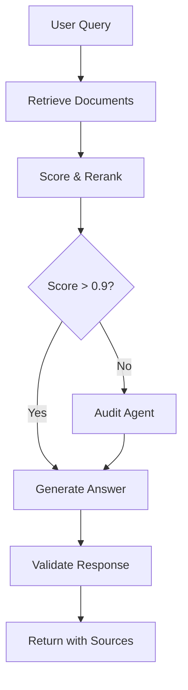

# Chat & RAG Workflow

The `core/chat/` module implements the production-ready conversational pipeline, including retrieval-augmented generation (RAG), streaming, conversation history, and plugin-extensible flow handlers.

## Module Structure

```yaml
core/chat/
├── service.py              # ChatService — main entry point (DI-aware)
├── rag_workflow.py         # LangGraph RAG graph definition
├── workflow_planner.py     # Dynamic workflow planning
├── workflow_retrieval.py   # Retrieval logic (Mixin-based)
├── workflow_response.py    # Response assembly
├── workflow_validation.py  # Guard-rail validation
├── context.py              # Context building: sources, docs, history
├── prompt.py               # Prompt templates
├── reranking.py            # Cross-encoder document reranking
├── streaming.py            # Streaming response support
├── history.py              # Conversation history management
├── factory.py              # ChatService factory
├── dependencies.py         # DI container for chat
├── agent_state.py          # LangGraph state definition
└── mixins/                 # Modular retrieval behaviour (Mixin pattern)
    ├── retrieval_search.py
    ├── retrieval_scoring.py
    └── retrieval_context.py
```

---

## ChatService

The main conversational interface. Extends `core.services.chat.ChatService` with full dependency injection.

### Basic Usage

```python
from core.chat.service import ChatService
from core.chat.dependencies import ChatDependencyConfig

# Configure and instantiate
config = ChatDependencyConfig(
    embedder_model="sentence-transformers/all-MiniLM-L6-v2",
    reranker_model="cross-encoder/ms-marco-MiniLM-L-6-v2",
    history_max_turns=10,
)
chat = ChatService(dependency_config=config)

# Ask a question — the request is a ChatRequest, the result a ChatResponse
from core.models.chat import ChatRequest

req = ChatRequest(
    query="What is the Plugin-First architecture?",
    conversation_id="conv-123",
    tenant_id="tenant-abc",
)
response = await chat.handle_chat_async(req)
print(response.answer)
print(response.sources)  # Optional[list[dict]] of source documents
```

### Entry points

`ChatService` (in `core/services/chat/service.py`, subclassed by
`core/chat/service.py`) exposes four request-shaped entry points — all
take a single `ChatRequest`:

| Method | Returns | Use |
|--------|---------|-----|
| `handle_chat(req)` | `ChatResponse` | Synchronous, blocking |
| `handle_chat_async(req)` | `ChatResponse` (awaitable) | Async, blocking |
| `handle_chat_stream(req)` | `Iterator[str]` | Synchronous token stream |
| `handle_chat_stream_async(req)` | `AsyncIterator[str]` | Async token stream |

### With Plugin Registry

```python
from core.plugins import PluginRegistry

registry = PluginRegistry()
chat = ChatService(plugin_registry=registry)
```

---

## RAG Workflow

The RAG pipeline is implemented as a **LangGraph state machine**, enabling conditional branching, audit steps, and extensibility.



### Conditional Audit Logic

```python
# The audit step is skipped automatically when similarity score > 0.9
# Controlled by workflow_planner.py — no configuration needed
```

### Backlog Planner

`core/chat/workflow_planner.py` exposes `BacklogPlanner`, which mutates an
`AgentState` in place to attach a generated backlog. It is constructed with
the owning `ChatService` and operates on the shared loop state:

```python
from core.chat.workflow_planner import BacklogPlanner

planner = BacklogPlanner(service=chat)
planner.plan_backlog(state)  # mutates state in place; returns None
```

---

## Conversation History

`ChatHistoryManager` (`core/services/chat/utils/history.py`) is async,
cache-backed, and keyed by `conversation_id`. It exposes `load` (returns the
trimmed turns plus a formatted history/summary string) and `append_turn`:

```python
from core.services.chat.utils.history import ChatHistoryManager

history = ChatHistoryManager(cache)  # cache is a CacheProtocol; built by the dependency factory

# Load prior turns for a conversation -> (turns, history_text)
turns, history_text = await history.load("conv-123")

# Append a completed turn
await history.append_turn(
    conversation_id="conv-123",
    history_turns=turns,
    user_query="Hello!",
    answer="Hi! How can I help?",
)
```

---

## Streaming Responses

```python
# Stream tokens for real-time output — pass a ChatRequest
from core.models.chat import ChatRequest

req = ChatRequest(query="...", conversation_id="conv-123")
async for chunk in chat.handle_chat_stream_async(req):
    print(chunk, end="", flush=True)
```

---

## Structured Prompt Architecture

BaselithCore implements a **4-Layer Prompt Architecture** to ensure prompts are modular, versioned, and resilient.

### The 4 Semantic Layers

| Layer | Name | Description |
| :--- | :--- | :--- |
| **Layer 1** | **Identity** | Who is the agent? (Role, personality, boundaries). |
| **Layer 2** | **Instructions** | What are the rules? (Workflow, error handling, escalation). |
| **Layer 3** | **Context** | What does it know? (Dynamic runtime data like user profile). |
| **Layer 4** | **Constraints** | How should it respond? (Output format, JSON schemas). |

### PromptEngine Usage

The `PromptEngine` handle assembly and rendering. It uses simple `{key}` substitution instead of Python's `.format()` to avoid conflicts with JSON braces.

```python
from core.chat.prompt_engine import PromptEngine, FewShotExample

# 1. Define the engine
engine = PromptEngine(
    identity="You are a senior research analyst.",
    instructions="Always search the web before answering.",
    output_constraints='Respond in JSON: {"answer": "...", "confidence": "high|low"}',
    version="1.2",
    changelog=["v1.2 - Added confidence scores", "v1.1 - Initial instructions"]
)

# 2. Add few-shot examples (Layer 2.5)
engine.with_example(FewShotExample(
    user_input="What is BaselithCore?",
    agent_output="BaselithCore is a white-label framework for building agents...",
    label="definition"
))

# 3. Render with runtime variables
system_prompt = engine.render(
    user_name="Antonio",
    context="User is exploring the core modules."
)
```

### Versioning & Audit

Every prompt managed by `PromptEngine` carries a version and a changelog. This allows for rigorous audit trails in production as prompts evolve.

```python
print(engine.version_info())
# Prompt version: 1.2
# Changelog:
# v1.2 - Added confidence scores
# v1.1 - Initial instructions
```

---

## Configuration

Key `ChatDependencyConfig` fields (`core/chat/dependencies.py`):

| Field                    | Description                                   |
| ------------------------ | --------------------------------------------- |
| `embedder_model`         | Embedding model for similarity search         |
| `reranker_model`         | Cross-encoder for reranking                   |
| `history_enabled`        | Toggle conversation history                   |
| `history_max_turns`      | Conversation turns kept in context            |
| `response_cache_enabled` | Toggle exact-match response caching           |
| `summary_enabled`        | Toggle rolling history summarization          |

!!! note "Candidate / top-k counts"
    `INITIAL_SEARCH_K` (`40`) and `FINAL_TOP_K` (`6`) are class-level
    constants on `ChatService`, not `ChatDependencyConfig` fields.

!!! tip "Plugin Extension"
    Register custom `FlowHandler`s in your plugin to intercept or augment the RAG pipeline at specific graph nodes without modifying core code.

---

## AgentState — loop instrumentation

`core/chat/agent_state.py` exposes `AgentState`, the shared dataclass
passed between chat steps. In addition to the request, history, hits,
and answer fields, the state carries explicit loop instrumentation so
handlers can record what the agent did without changing call sites.

| Field | Type | Purpose |
|-------|------|---------|
| `iteration_count` | `int` | Number of agentic loop steps so far |
| `retry_count` | `int` | Self-correction retries within the loop |
| `cost_usd` | `float` | Accumulated estimated LLM cost for this request |
| `scratchpad_ref` | `str \| None` | Optional thread id binding to a `Scratchpad` |
| `trajectory` | `list[ToolCall]` | Ordered record of every tool invocation |
| `trajectory_dropped` | `int` | Count of oldest `trajectory` entries pruned by the sliding window |
| `logs_dropped` | `int` | Count of oldest `logs` entries pruned by the sliding window |

The companion method `state.record_tool_call(call)` appends a typed
`ToolCall` to `trajectory`. Trajectory-aware evaluation
(see [Evaluation](evaluation.md)) consumes this list to score runs
against `TrajectoryCase` specifications.

### Sliding-window pruning

To prevent unbounded memory growth on long-running sessions, both
`trajectory` and `logs` are capped with class-level constants and pruned
in place on append:

| Constant | Default | Effect |
|----------|---------|--------|
| `AgentState.MAX_TRAJECTORY_ENTRIES` | `200` | Oldest tool calls are dropped once the cap is exceeded |
| `AgentState.MAX_LOG_ENTRIES` | `500` | Oldest log lines are dropped once the cap is exceeded |

Override at process start (e.g. in a startup hook) for workloads that
need a wider history; the dropped-counter fields make truncation
observable to evaluators and dashboards.

### Example

```python
from core.chat.agent_state import AgentState

state = AgentState(request=req)
state.iteration_count += 1
state.cost_usd += estimate_cost(model_id, prompt_tokens, completion_tokens)
state.record_tool_call({"name": "search", "args": {"q": q}, "ok": True})
```

### Models layer — portability primitives

The same dataclass cooperates with three companion primitives in
`core/models/`:

| Module | Purpose |
|--------|---------|
| [`pricing.py`](https://github.com/baselithcore/baselithcore/blob/main/core/models/pricing.py) | Provider pricing table + `estimate_cost(model_id, in, out)` |
| [`routing.py`](https://github.com/baselithcore/baselithcore/blob/main/core/models/routing.py) | `ModelRouter` selects the right model by `TaskCategory` + `Complexity` |
| [`fallback.py`](https://github.com/baselithcore/baselithcore/blob/main/core/models/fallback.py) | `FallbackChain` retries against secondary providers with circuit-breaker skip |

```python
from core.models.routing import ModelRouter, TaskCategory, Complexity
from core.models.pricing import estimate_cost

decision = ModelRouter().select(
    TaskCategory.EXECUTION, complexity=Complexity.COMPLEX
)
# decision.model_id, decision.rule, decision.category, decision.complexity
state.cost_usd += estimate_cost(decision.model_id, 1_200, 800)
```
