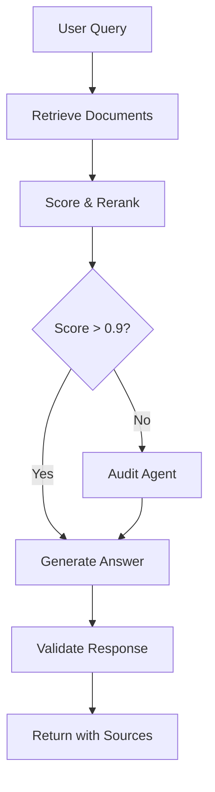

# Chat & RAG Workflow

The `core/chat/` module implements the production-ready conversational pipeline, including retrieval-augmented generation (RAG), streaming, conversation history, and plugin-extensible flow handlers.

## Module Structure

```yaml
core/chat/
├── service.py              # ChatService — main entry point (DI-aware)
├── rag_workflow.py         # LangGraph RAG graph definition
├── workflow_planner.py     # Dynamic workflow planning
├── workflow_retrieval.py   # Retrieval logic (Mixin-based)
├── workflow_response.py    # Response assembly
├── workflow_validation.py  # Guard-rail validation
├── context.py              # Context building: sources, docs, history
├── prompt.py               # Prompt templates
├── reranking.py            # Cross-encoder document reranking
├── streaming.py            # Streaming response support
├── history.py              # Conversation history management
├── factory.py              # ChatService factory
├── dependencies.py         # DI container for chat
├── agent_state.py          # LangGraph state definition
└── mixins/                 # Modular retrieval behaviour (Mixin pattern)
    ├── retrieval_search.py
    ├── retrieval_scoring.py
    └── retrieval_context.py
```

---

## ChatService

The main conversational interface. Extends `core.services.chat.ChatService` with full dependency injection.

### Basic Usage

```python
from core.chat.service import ChatService
from core.chat.dependencies import ChatDependencyConfig

# Configure and instantiate
config = ChatDependencyConfig(
    embedder_model="sentence-transformers/all-MiniLM-L6-v2",
    reranker_model="cross-encoder/ms-marco-MiniLM-L-6-v2",
    history_max_turns=10,
)
chat = ChatService(dependency_config=config)

# Ask a question
response = await chat.chat(
    query="What is the Plugin-First architecture?",
    conversation_id="conv-123",
    tenant_id="tenant-abc",
)
print(response.answer)
print(response.sources)  # List of source documents
```

### With Plugin Registry

```python
from core.plugins import PluginRegistry

registry = PluginRegistry()
chat = ChatService(plugin_registry=registry)
```

---

## RAG Workflow

The RAG pipeline is implemented as a **LangGraph state machine**, enabling conditional branching, audit steps, and extensibility.



### Conditional Audit Logic

```python
# The audit step is skipped automatically when similarity score > 0.9
# Controlled by workflow_planner.py — no configuration needed
```

### Workflow Planner

The `WorkflowPlanner` dynamically decides which steps to execute based on query complexity and retrieval scores:

```python
from core.chat.workflow_planner import WorkflowPlanner

planner = WorkflowPlanner()
backlog = await planner.plan_backlog(query, context)
# Returns ordered list of steps: ["retrieve", "rerank", "audit", "generate"]
```

---

## Conversation History

```python
from core.services.chat.utils.history import ChatHistoryManager

history = ChatHistoryManager(max_turns=10)

# Add a turn
history.add_turn(
    conversation_id="conv-123",
    user_message="Hello!",
    assistant_message="Hi! How can I help?"
)

# Retrieve for context
turns = history.get_turns("conv-123")
```

---

## Streaming Responses

```python
# Use the streaming endpoint for real-time output
async for chunk in chat.stream_chat(query="...", conversation_id="conv-123"):
    print(chunk, end="", flush=True)
```

---

## Context Building

The `context.py` module assembles the final prompt context from retrieved documents:

```python
from core.chat.context import build_context_and_sources

context_str, sources = build_context_and_sources(
    documents=retrieved_docs,
    max_context_length=8000,
)
```

---

## Configuration

Key `ChatDependencyConfig` options:

| Field               | Default                    | Description                                   |
| ------------------- | -------------------------- | --------------------------------------------- |
| `initial_search_k`  | `40`                       | Initial candidates retrieved from VectorStore |
| `final_top_k`       | `6`                        | Documents kept after reranking                |
| `history_max_turns` | `10`                       | Conversation turns kept in context            |
| `embedder_model`    | `"all-MiniLM-L6-v2"`       | Embedding model for similarity search         |
| `reranker_model`    | `"ms-marco-MiniLM-L-6-v2"` | Cross-encoder for reranking                   |

!!! tip "Plugin Extension"
    Register custom `FlowHandler`s in your plugin to intercept or augment the RAG pipeline at specific graph nodes without modifying core code.
