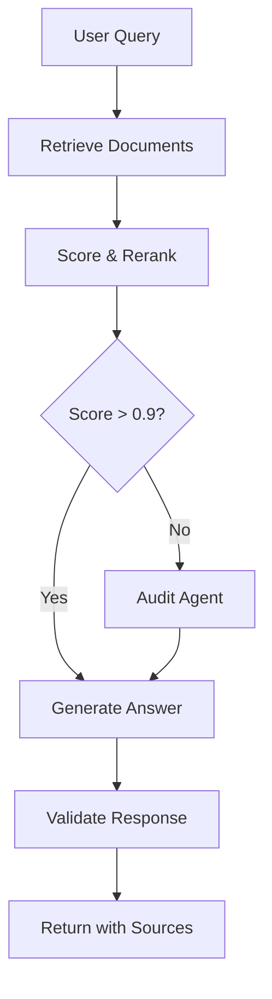
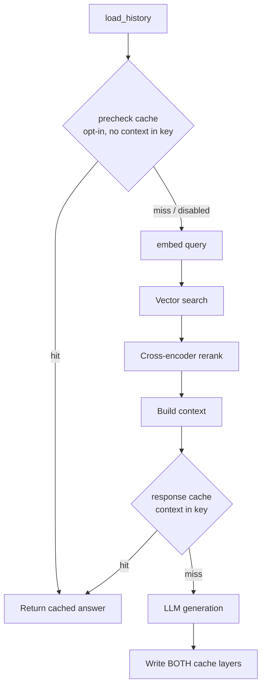

# Chat & RAG Workflow

The `core/chat/` module implements the production-ready conversational pipeline, including retrieval-augmented generation (RAG), streaming, conversation history, and plugin-extensible flow handlers.

## Module Structure

```yaml
core/chat/
├── service.py              # ChatService — main entry point (DI-aware)
├── rag_workflow.py         # Native RAG pipeline (FlowHandler + step collection)
├── workflow_planner.py     # Dynamic workflow planning
├── workflow_retrieval.py   # Retrieval logic (Mixin-based)
├── workflow_response.py    # Response assembly
├── workflow_validation.py  # Guard-rail validation
├── context.py              # Context building: sources, docs, history
├── prompt.py               # Prompt templates
├── reranking.py            # Cross-encoder document reranking
├── streaming.py            # Streaming response support
├── history.py              # Conversation history management
├── factory.py              # ChatService factory
├── dependencies.py         # DI container for chat
├── agent_state.py          # Typed shared loop state (AgentState)
├── precheck.py             # Pre-retrieval answer cache keys (opt-in)
└── mixins/                 # Modular retrieval behaviour (Mixin pattern)
    ├── retrieval_search.py
    ├── retrieval_scoring.py
    ├── retrieval_precheck.py
    └── retrieval_context.py
```

---

## ChatService

The main conversational interface. Extends `core.services.chat.ChatService` with full dependency injection.

### Basic Usage

```python
from core.chat.service import ChatService
from core.chat.dependencies import ChatDependencyConfig

# Configure and instantiate
config = ChatDependencyConfig(
    embedder_model="sentence-transformers/all-MiniLM-L6-v2",
    reranker_model="cross-encoder/ms-marco-MiniLM-L-6-v2",
    history_max_turns=10,
)
chat = ChatService(dependency_config=config)

# Ask a question — the request is a ChatRequest, the result a ChatResponse
from core.models.chat import ChatRequest

req = ChatRequest(
    query="What is the Plugin-First architecture?",
    conversation_id="conv-123",
    tenant_id="tenant-abc",
)
response = await chat.handle_chat_async(req)
print(response.answer)
print(response.sources)  # Optional[list[dict]] of source documents
```

### Entry points

`ChatService` (in `core/services/chat/service.py`, subclassed by
`core/chat/service.py`) exposes four request-shaped entry points — all
take a single `ChatRequest`:

| Method | Returns | Use |
|--------|---------|-----|
| `handle_chat(req)` | `ChatResponse` | Synchronous, blocking |
| `handle_chat_async(req)` | `ChatResponse` (awaitable) | Async, blocking |
| `handle_chat_stream(req)` | `Iterator[str]` | Synchronous token stream |
| `handle_chat_stream_async(req)` | `AsyncIterator[str]` | Async token stream |

### With Plugin Registry

```python
from core.plugins import PluginRegistry

registry = PluginRegistry()
chat = ChatService(plugin_registry=registry)
```

---

## RAG Workflow

The RAG pipeline is implemented natively as an **Orchestrator-compatible
`FlowHandler`** (`RagWorkflowHandler` in `core/chat/rag_workflow.py`) driving a
typed `AgentState` through explicit steps — conditional branching, audit
steps, and extensibility without any external graph framework.


```mermaid
graph TD
    A[User Query] --> B[Retrieve Documents]
    B --> C[Score & Rerank]
    C --> D{Score > 0.9?}
    D -- Yes --> F[Generate Answer]
    D -- No --> E[Audit Agent]
    E --> F
    F --> G[Validate Response]
    G --> H[Return with Sources]
```

### Conditional Audit Logic

```python
# The audit step is skipped automatically when similarity score > 0.9
# Controlled by workflow_planner.py — no configuration needed
```

### Backlog Planner

`core/chat/workflow_planner.py` exposes `BacklogPlanner`, which mutates an
`AgentState` in place to attach a generated backlog. It is constructed with
the owning `ChatService` and operates on the shared loop state:

```python
from core.chat.workflow_planner import BacklogPlanner

planner = BacklogPlanner(service=chat)
planner.plan_backlog(state)  # mutates state in place; returns None
```

---

## Answer caching: two layers, two freshness contracts

The RAG pipeline can serve a repeated question from cache at **two different
points**, and the difference between them is not performance but *freshness*.
Understanding which guarantee you are buying matters more than the latency
number.


```mermaid
graph TD
    A[load_history] --> P{precheck cache<br/>opt-in, no context in key}
    P -- hit --> Z[Return cached answer]
    P -- miss / disabled --> B[embed query]
    B --> C[Vector search]
    C --> D[Cross-encoder rerank]
    D --> E[Build context]
    E --> R{response cache<br/>context in key}
    R -- hit --> Z
    R -- miss --> G[LLM generation]
    G --> W[Write BOTH cache layers]
```

### Layer 1 — response cache (always on)

`RetrievalContextMixin.check_cache` keys on
`(normalized_query, sha256(history_text + context))`. Because the retrieved
context is *in the key*, this cache is **self-invalidating**: reindex a
document, the context changes, the hash changes, and the stale entry becomes
unreachable. It can never serve an answer derived from a corpus that no longer
exists.

The price of that guarantee is where it sits. The key cannot be computed until
the context exists, so a hit has already paid for the vector search, the
cross-encoder rerank and the context build. **Only LLM generation is saved.**

### Layer 2 — pre-retrieval cache (`CHAT_RAG_PRECHECK_ENABLED`, default `false`)

`RetrievalPrecheckMixin.check_precheck_cache` runs immediately after
`load_history` and keys on `(normalized_query, sha256(scope + history_text))`
— **no context**. A hit ends the request before any retrieval work happens:
no query embedding, no vector search, no cross-encoder pass, no context
assembly. On a repeated question that is close to the entire non-LLM cost of
the turn.

!!! danger "This layer trades freshness for latency — read before enabling"
    Dropping the context from the key drops the corpus-change signal with it.
    A document that is reindexed, added or deleted changes **neither the query
    nor the history**, so a pre-check entry written before the change looks
    just as valid afterwards. Unlike layer 1, this cache can serve an answer
    that the current corpus would no longer produce. That window is real and
    it is the reason the feature ships off.

#### How the staleness window is bounded

Three mitigations, strongest first:

1. **Corpus version in the key.** `IndexingService.index_version` is a
   monotonic counter bumped on every registry mutation — batch flush, stale
   deletion, state reload. It is folded into the hashed scope, so an
   in-process reindex orphans *every* pre-check entry at once. This is genuine
   invalidation, not expiry. If the version cannot be read,
   `build_precheck_key` returns `None` and the probe degrades to a no-op
   rather than risking a hit it cannot validate.
2. **A separate, short TTL** — `CHAT_RAG_PRECHECK_TTL`, default **60s**
   against the response cache's 3600s. This is the *only* defense against a
   reindex performed by **another process or replica**, whose `index_version`
   this process never observes. Multi-replica deployments should treat the TTL
   as the real bound and keep it small.
3. **A separate cache namespace** — Redis prefix segment `…:rag_precheck`, or
   a distinct in-process `TTLCache`. The layer can be flushed wholesale
   (`DEL <prefix>:rag_precheck:*`) after a bulk reindex without disturbing the
   response cache.

Beyond `index_version` there is **no push-based invalidation hook** in the
codebase: nothing in `core/services/indexing/` notifies the chat caches when
documents change. For cross-process corpus mutations the short TTL is the
entire defense. Documented deliberately — do not assume a listener exists.

#### Key scope

Without a context hash, nothing else in the key is tenant-dependent, so the
scope string carries what the response cache only encoded *implicitly* through
the retrieved context:

```text
rag_precheck:v1|corpus=<index_version>|tenant=<id>|kb=<label>|rag_only=<0|1>
```

The `rag_precheck:v1` marker also guarantees the two key spaces can never
collide, and lets the scheme be revised without honouring entries written
under the old one.

#### When entries are written

Both layers are populated from the same place —
`ResponseGenerator._store_answer_in_cache` — so they can never disagree about
what the answer for a turn was. The pre-check layer additionally refuses to
store an answer whose `state.context` is empty: pinning an ungrounded
"I couldn't find anything in the documents" reply would keep serving it for
the whole TTL, including after the very document the user asked about gets
indexed.

#### Choosing

| | Response cache | Pre-retrieval cache |
| --- | --- | --- |
| Default | on | **off** |
| Saves | LLM generation | embedding + search + rerank + context + LLM |
| Corpus change | always invalidates | invalidates in-process only |
| TTL | `CHAT_RESPONSE_CACHE_TTL` (3600s) | `CHAT_RAG_PRECHECK_TTL` (60s) |
| Namespace | `…:response` | `…:rag_precheck` |

Enable layer 2 when repeated identical questions dominate traffic, the corpus
is reindexed rarely or on a predictable schedule, and answers being up to
`CHAT_RAG_PRECHECK_TTL` seconds behind the index is acceptable. Leave it off
for live-updating corpora, or anywhere a stale answer is a correctness
problem rather than a cosmetic one.

```bash
CHAT_RAG_PRECHECK_ENABLED=true
CHAT_RAG_PRECHECK_TTL=60      # seconds; the staleness window you accept
CHAT_RAG_PRECHECK_MAXSIZE=256 # in-process backend only
```

---

## Conversation History

`ChatHistoryManager` (`core/services/chat/utils/history.py`) is async,
cache-backed, and keyed by `conversation_id`. It exposes `load` (returns the
trimmed turns plus a formatted history/summary string) and `append_turn`:

```python
from core.services.chat.utils.history import ChatHistoryManager

history = ChatHistoryManager(cache)  # cache is a CacheProtocol; built by the dependency factory

# Load prior turns for a conversation -> (turns, history_text)
turns, history_text = await history.load("conv-123")

# Append a completed turn
await history.append_turn(
    conversation_id="conv-123",
    history_turns=turns,
    user_query="Hello!",
    answer="Hi! How can I help?",
)
```

---

## Streaming Responses

```python
# Stream tokens for real-time output — pass a ChatRequest
from core.models.chat import ChatRequest

req = ChatRequest(query="...", conversation_id="conv-123")
async for chunk in chat.handle_chat_stream_async(req):
    print(chunk, end="", flush=True)
```

---

## Structured Prompt Architecture

BaselithCore implements a **4-Layer Prompt Architecture** to ensure prompts are modular, versioned, and resilient.

### The 4 Semantic Layers

| Layer | Name | Description |
| :--- | :--- | :--- |
| **Layer 1** | **Identity** | Who is the agent? (Role, personality, boundaries). |
| **Layer 2** | **Instructions** | What are the rules? (Workflow, error handling, escalation). |
| **Layer 3** | **Context** | What does it know? (Dynamic runtime data like user profile). |
| **Layer 4** | **Constraints** | How should it respond? (Output format, JSON schemas). |

### PromptEngine Usage

The `PromptEngine` handle assembly and rendering. It uses simple `{key}` substitution instead of Python's `.format()` to avoid conflicts with JSON braces.

```python
from core.chat.prompt_engine import PromptEngine, FewShotExample

# 1. Define the engine
engine = PromptEngine(
    identity="You are a senior research analyst.",
    instructions="Always search the web before answering.",
    output_constraints='Respond in JSON: {"answer": "...", "confidence": "high|low"}',
    version="1.2",
    changelog=["v1.2 - Added confidence scores", "v1.1 - Initial instructions"]
)

# 2. Add few-shot examples (Layer 2.5)
engine.with_example(FewShotExample(
    user_input="What is BaselithCore?",
    agent_output="BaselithCore is a white-label framework for building agents...",
    label="definition"
))

# 3. Render with runtime variables
system_prompt = engine.render(
    user_name="Antonio",
    context="User is exploring the core modules."
)
```

### Few-shot library bridge

`engine.with_library(library, task_type, limit=..., tags=...)` splices
examples from the task-indexed
[`FewShotLibrary`](../core-modules/personas.md) (`core.personas`) into the
few-shot layer. The library is YAML/JSON-backed — curated, version-controlled
example files editable by non-engineers — and a packaged seed ships at
`core/personas/examples/default_examples.yaml`
(`core.personas.DEFAULT_EXAMPLES_PATH`):

```python
from core.personas import DEFAULT_EXAMPLES_PATH, load_library

library = load_library(DEFAULT_EXAMPLES_PATH)
system_prompt = engine.with_library(library, "refusal").render()
```

### Registry-backed conversation prompt

The production conversation system prompt is **prompt-as-code**: the
canonical template lives in `core/chat/prompts/conversation_system.md`
(YAML front matter + body) and is served through the global
`PromptRegistry` under the name `conversation_system`. `build_prompt`
renders the `production`-labelled version on every request, emitting a
`prompt.render` span (name/version/checksum) so LLM spans are attributable
to a prompt version. Deployments override it by shipping a catalog via
`BASELITH_PROMPTS_DIR` — their versions/labels win over the packaged
default; the embedded constant remains only as a registry-unavailable
fallback.

### Versioning & Audit

Every prompt managed by `PromptEngine` carries a version and a changelog. This allows for rigorous audit trails in production as prompts evolve.

```python
print(engine.version_info())
# Prompt version: 1.2
# Changelog:
# v1.2 - Added confidence scores
# v1.1 - Initial instructions
```

---

## Configuration

Key `ChatDependencyConfig` fields (`core/chat/dependencies.py`):

| Field                    | Description                                   |
| ------------------------ | --------------------------------------------- |
| `embedder_model`         | Embedding model for similarity search         |
| `reranker_model`         | Cross-encoder for reranking (runs on the dedicated inference pool — see [NLP › Where inference runs](nlp.md#where-inference-runs)) |
| `history_enabled`        | Toggle conversation history                   |
| `history_max_turns`      | Conversation turns kept in context            |
| `response_cache_enabled` | Toggle exact-match response caching           |
| `precheck_cache_enabled` | Toggle the opt-in pre-retrieval cache (default off — see [Answer caching](#answer-caching-two-layers-two-freshness-contracts)) |
| `precheck_cache_ttl`     | Staleness window for the pre-retrieval cache, seconds |
| `summary_enabled`        | Toggle rolling history summarization          |

!!! note "Candidate / top-k counts"
    `INITIAL_SEARCH_K` (`40`) and `FINAL_TOP_K` (`6`) are class-level
    constants on `ChatService`, not `ChatDependencyConfig` fields.

!!! tip "Plugin Extension"
    Register custom `FlowHandler`s in your plugin to intercept or augment the RAG pipeline at specific graph nodes without modifying core code.

---

## AgentState — loop instrumentation

`core/chat/agent_state.py` exposes `AgentState`, the shared dataclass
passed between chat steps. In addition to the request, history, hits,
and answer fields, the state carries explicit loop instrumentation so
handlers can record what the agent did without changing call sites.

| Field | Type | Purpose |
|-------|------|---------|
| `iteration_count` | `int` | Number of agentic loop steps so far |
| `retry_count` | `int` | Self-correction retries within the loop |
| `cost_usd` | `float` | Accumulated estimated LLM cost for this request |
| `scratchpad_ref` | `str \| None` | Optional thread id binding to a `Scratchpad` |
| `trajectory` | `list[ToolCall]` | Ordered record of every tool invocation |
| `trajectory_dropped` | `int` | Count of oldest `trajectory` entries pruned by the sliding window |
| `logs_dropped` | `int` | Count of oldest `logs` entries pruned by the sliding window |

The companion method `state.record_tool_call(call)` appends a typed
`ToolCall` to `trajectory`. Trajectory-aware evaluation
(see [Evaluation](evaluation.md)) consumes this list to score runs
against `TrajectoryCase` specifications.

### Sliding-window pruning

To prevent unbounded memory growth on long-running sessions, both
`trajectory` and `logs` are capped with class-level constants and pruned
in place on append:

| Constant | Default | Effect |
|----------|---------|--------|
| `AgentState.MAX_TRAJECTORY_ENTRIES` | `200` | Oldest tool calls are dropped once the cap is exceeded |
| `AgentState.MAX_LOG_ENTRIES` | `500` | Oldest log lines are dropped once the cap is exceeded |

Override at process start (e.g. in a startup hook) for workloads that
need a wider history; the dropped-counter fields make truncation
observable to evaluators and dashboards.

### Example

```python
from core.chat.agent_state import AgentState

state = AgentState(request=req)
state.iteration_count += 1
state.cost_usd += estimate_cost(model_id, prompt_tokens, completion_tokens)
state.record_tool_call({"name": "search", "args": {"q": q}, "ok": True})
```

### Models layer — portability primitives

The same dataclass cooperates with three companion primitives in
`core/models/`:

| Module | Purpose |
|--------|---------|
| [`pricing.py`](https://github.com/baselithcore/baselithcore/blob/main/core/models/pricing.py) | Provider pricing table + `estimate_cost(model_id, in, out)` |
| [`routing.py`](https://github.com/baselithcore/baselithcore/blob/main/core/models/routing.py) | `ModelRouter` selects the right model by `TaskCategory` + `Complexity` |
| [`fallback.py`](https://github.com/baselithcore/baselithcore/blob/main/core/models/fallback.py) | `FallbackChain` retries against secondary providers with circuit-breaker skip |

```python
from core.models.routing import ModelRouter, TaskCategory, Complexity
from core.models.pricing import estimate_cost

decision = ModelRouter().select(
    TaskCategory.EXECUTION, complexity=Complexity.COMPLEX
)
# decision.model_id, decision.rule, decision.category, decision.complexity
state.cost_usd += estimate_cost(decision.model_id, 1_200, 800)
```
