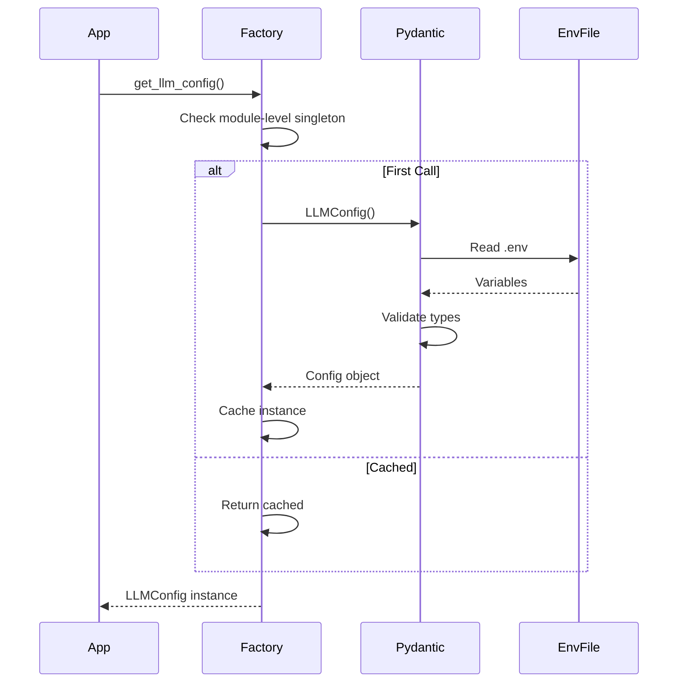

## Overview

The `core/config` module is the **foundation** of BaselithCore's runtime behavior and operational parameters. It provides a type-safe, centralized configuration management system built on Pydantic Settings, eliminating the anti-pattern of scattered environment variable access throughout the codebase.

**Key Benefits**:

- **Type Safety** - Automatic validation prevents invalid configurations from starting
- **Centralization** - Single source of truth for all runtime settings
- **Secret Protection** - `SecretStr` types prevent accidental logging of sensitive data
- **Testability** - Factory functions enable easy mocking in unit tests
- **Environment Flexibility** - Seamless switching between dev/staging/production configs

**Core Capabilities**:

1. **Lazy Loading** - Configuration objects created only when first accessed, improving startup time
2. **Singleton Pattern** - Same config instance shared across the application, ensuring consistency
3. **Startup Validation** - Pydantic catches misconfigurations before deployment, preventing runtime failures
4. **Secret Management** - Built-in protection against accidental exposure in logs or error messages

### Why Centralized Configuration?

In baselith-cores, configuration sprawl is a critical failure point. Without centralization:

- **Inconsistency**: Different modules interpret the same environment variable differently
- **No Validation**: Type errors and missing values fail silently until production
- **Security Risks**: Secrets appear in stack traces, logs, and monitoring tools
- **Testing Difficulty**: Hard-coded `os.getenv()` calls are nearly impossible to mock properly

The `core/config` architecture solves these by providing **strongly-typed configuration contracts** that are validated at application startup, not at runtime failure.

## Module Structure

```text
core/config/
├── __init__.py           # Exports and factory functions
├── base.py               # CoreConfig (CORE_ prefix)
├── app.py                # AppConfig (server, tenancy, telemetry, guardrails)
├── services.py           # LLMConfig, VectorStoreConfig, ChatConfig, Vision/Voice
├── storage.py            # PostgreSQL, GraphDB (RedisGraph), cache/queue Redis
├── resilience.py         # Circuit breaker, retry, rate limiting, bulkhead
├── security.py           # Auth, secrets, CORS, rate limits, headers
├── orchestration.py      # OrchestrationConfig, RouterConfig
├── plugins.py            # PluginConfig
├── memory.py             # SupermemoryConfig (intelligent memory layer)
├── environment.py        # get_runtime_environment / is_production_env
└── ...                   # cache, mcp, swarm, reasoning, world_model, etc.
```

---

## When to Use

Use `core/config` for defining **static application parameters** that are set at deployment time and remain constant during execution.

**When to Use Configuration For**:

| Use Case                    | Example                               | Why Config                 |
| --------------------------- | ------------------------------------- | -------------------------- |
| **Infrastructure Settings** | Database URLs, Redis connections      | External service addresses |
| **Service Behavior**        | Rate limits, timeouts, retry policies | Operational parameters     |
| **Feature Flags**           | `ENABLE_FEEDBACK=true`                | Gradual rollout control    |
| **LLM Parameters**          | Model names, API keys, endpoints      | Model infrastructure       |
| **Plugin Settings**         | Plugin-specific API keys, thresholds  | Plugin configuration       |

**Consider Alternatives When**:

| Scenario            | Use Instead      | Reason                         |
| ------------------- | ---------------- | ------------------------------ |
| **Runtime State**   | agent state      | Values change during execution |
| **User Data**       | Database models  | Persistent user-specific data  |
| **Dynamic Values**  | In-memory caches | Frequently changing values     |
| **Request Context** | Middleware/DI    | Per-request information        |

**Anti-Patterns (Do NOT Use For)**:

- Session-specific data
- Agent state (use orchestrator state management)
- Temporary flags (use feature flags properly, not config hacks)
- Hard-coded business logic masquerading as "configuration"

---

## Fundamental Principle

All configuration MUST be accessed via **factory functions**, never direct `os.getenv()` calls.

!!! warning "Mandatory Rule"
    **NEVER** use `os.getenv()` directly in business code. Always use factory functions.

**Rationale**:

1. **Type Safety** - Factory returns validated Pydantic models, not optional strings
2. **Lazy Loading** - Configuration loaded only when first accessed, improving cold starts
3. **Singleton Guarantee** - Each factory caches a module-level instance so the same object is shared app-wide
4. **Startup Validation** - Invalid configs fail fast with clear error messages
5. **Mockability** - Tests can easily patch factory functions

```python
# ✅ Correct
from core.config import get_llm_config
config = get_llm_config()
model = config.model

# ❌ Wrong
import os
model = os.getenv("LLM_MODEL")  # NO!
```

---

## Factory Functions

Each domain module exposes a factory function. The full set exported from
`core.config`:

```python
from core.config import (
    get_core_config,          # CoreConfig
    get_app_config,           # AppConfig
    get_llm_config,           # LLMConfig
    get_vectorstore_config,   # VectorStoreConfig
    get_chat_config,          # ChatConfig
    get_storage_config,       # StorageConfig
    get_resilience_config,    # ResilienceConfig
    get_security_config,      # SecurityConfig
    get_orchestration_config, # OrchestrationConfig
    get_router_config,        # RouterConfig
    get_plugin_config,        # PluginConfig
    get_supermemory_config,   # SupermemoryConfig
)
```

Most factories use a module-level singleton guard (created on first call). A
few (e.g. `get_supermemory_config`) use `functools.lru_cache`. Either way, the
result is a single shared instance per process.

---

## Configuration Modules

### Core Config

`CoreConfig` uses the `CORE_` env prefix.

```python
from core.config import get_core_config

config = get_core_config()

print(config.debug)           # bool          (CORE_DEBUG)
print(config.log_level)       # "INFO"        (CORE_LOG_LEVEL)
print(config.app_name)        # "Baselith-Core" (CORE_APP_NAME)
print(config.max_workers)     # 4             (CORE_MAX_WORKERS)
print(config.deterministic_mode)  # bool      (CORE_DETERMINISTIC_MODE)
```

**`.env` Variables**:

```env
CORE_DEBUG=true
CORE_LOG_LEVEL=INFO
CORE_APP_NAME=Baselith-Core
CORE_MAX_WORKERS=4
CORE_DETERMINISTIC_MODE=false
```

---

### App Config

`AppConfig` holds server, multi-tenancy, telemetry, cost-control, and
guardrail settings. Fields use explicit aliases (no shared prefix).

```python
from core.config import get_app_config

config = get_app_config()

print(config.host)                      # "0.0.0.0"  (HOST)
print(config.port)                      # 8000       (PORT)
print(config.strict_tenant_isolation)   # True       (STRICT_TENANT_ISOLATION)
print(config.telemetry_enabled)         # False      (TELEMETRY_ENABLED)
print(config.cost_control_enabled)      # True       (COST_CONTROL_ENABLED)
print(config.agent_max_tokens)          # 10000      (AGENT_MAX_TOKENS)
print(config.timezone)                  # ZoneInfo (derived from APP_TIMEZONE)
```

**`.env` Variables**:

```env
HOST=0.0.0.0
PORT=8000

# Multi-Tenancy (Default: true) — lives on AppConfig
STRICT_TENANT_ISOLATION=true

# Telemetry
TELEMETRY_ENABLED=false
TELEMETRY_OTEL_ENDPOINT=http://localhost:4317
SENTRY_DSN=

# Cost control
COST_CONTROL_ENABLED=true          # Alias: LLM_BUDGET_ENABLED
AGENT_MAX_TOKENS=10000             # Alias: LLM_BUDGET_MAX_TOKENS

APP_TIMEZONE=Europe/Rome
```

!!! tip "Multi-Tenancy"
    `STRICT_TENANT_ISOLATION` is enabled by default and is an `AppConfig`
    field. It ensures every database query and event respects the current
    tenant context. Set to `false` only for single-tenant migrations.

---

### Services Config (LLM / VectorStore / Chat)

These live in `core/config/services.py`. `LLMConfig` uses the `LLM_` prefix,
`VectorStoreConfig` the `VECTORSTORE_` prefix, and `ChatConfig` the `CHAT_`
prefix.

```python
from core.config import get_llm_config, get_vectorstore_config

llm = get_llm_config()
print(llm.provider)            # "ollama"     (LLM_PROVIDER)
print(llm.model)               # "llama3.2"   (LLM_MODEL)
print(llm.api_key)             # SecretStr | None (LLM_API_KEY / LLM_OPENAI_API_KEY)
print(llm.api_base)            # None         (LLM_API_BASE)
print(llm.temperature)         # 0.7          (LLM_TEMPERATURE)

vs = get_vectorstore_config()
print(vs.collection_name)      # "documents"  (VECTORSTORE_COLLECTION_NAME)
print(vs.host)                 # "localhost"  (VECTORSTORE_HOST / VECTORSTORE_QDRANT_HOST)
print(vs.port)                 # 6333         (VECTORSTORE_PORT)
print(vs.embedding_model)      # "sentence-transformers/all-MiniLM-L6-v2"
print(vs.embedding_dim)        # 384          (VECTORSTORE_EMBEDDING_DIM)
```

**`.env` Variables**:

```env
LLM_PROVIDER=ollama
LLM_MODEL=llama3.2
LLM_API_BASE=http://localhost:11434
LLM_API_KEY=sk-...                   # Alias: LLM_OPENAI_API_KEY

VECTORSTORE_COLLECTION_NAME=documents
VECTORSTORE_HOST=localhost           # Alias: VECTORSTORE_QDRANT_HOST
VECTORSTORE_PORT=6333
VECTORSTORE_EMBEDDING_MODEL=sentence-transformers/all-MiniLM-L6-v2
```

---

### Storage Config

`StorageConfig` covers PostgreSQL, GraphDB (RedisGraph), and the cache/queue
Redis instances. Fields use explicit aliases. The `conninfo` property builds a
PostgreSQL DSN from `database_url` (if set) or the discrete `DB_*` fields.

```python
from core.config import get_storage_config

config = get_storage_config()

# PostgreSQL
print(config.database_url)        # None or a full URL  (DATABASE_URL)
print(config.db_host)             # "postgres"          (DB_HOST)
print(config.db_name)             # "baselith"          (DB_NAME)
print(config.db_user)             # "baselith"          (DB_USER)
print(config.conninfo)            # "postgresql://..."  (computed)
print(config.postgres_enabled)    # True                (POSTGRES_ENABLED)

# GraphDB (RedisGraph)
print(config.graph_db_url)        # "redis://localhost:6379"  (GRAPH_DB_URL)

# Cache / Queue Redis
print(config.cache_backend)       # "local"  (CACHE_BACKEND)
print(config.cache_redis_url)     # "redis://localhost:6379/1"  (CACHE_REDIS_URL)
print(config.queue_redis_url)     # "redis://localhost:6379/2"  (QUEUE_REDIS_URL)
```

**`.env` Variables**:

```env
POSTGRES_ENABLED=true
DB_HOST=postgres
DB_PORT=5432
DB_NAME=baselith
DB_USER=baselith
DB_PASSWORD=your-strong-password     # Required in production — stored as SecretStr
# DATABASE_URL=postgresql://...      # Optional: overrides the discrete DB_* fields

GRAPH_DB_ENABLED=true
GRAPH_DB_URL=redis://localhost:6379

CACHE_BACKEND=local                  # default 'local'; set 'redis' to use CACHE_REDIS_URL
CACHE_REDIS_URL=redis://localhost:6379/1
QUEUE_REDIS_URL=redis://localhost:6379/2
```

!!! warning "Production requirement"
    When the runtime environment is `production` (`APP_ENV=production` or
    `ENVIRONMENT=production`) and `POSTGRES_ENABLED=true`, either
    `DATABASE_URL` or `DB_PASSWORD` **must** be set or the application refuses
    to start. `DB_PASSWORD` is stored as `SecretStr` and never appears in logs.

---

### Resilience Config

`ResilienceConfig` uses the `RESILIENCE_` prefix.

```python
from core.config import get_resilience_config

config = get_resilience_config()

# Circuit Breaker
print(config.cb_fail_max)             # 5
print(config.cb_reset_timeout)        # 60

# Rate Limiter
print(config.api_rate_limit)          # 100
print(config.api_rate_window)         # 60

# Retry
print(config.retry_max_attempts)      # 3
print(config.retry_base_delay)        # 1.0
```

---

### Security Config

`SecurityConfig` covers auth, secrets, CORS, rate limiting, and security
headers. Fields use explicit aliases.

```python
from core.config import get_security_config

config = get_security_config()

print(config.secret_key)            # SecretStr | None  (SECRET_KEY)
print(config.auth_required)         # True              (AUTH_REQUIRED)
print(config.jwt_issuer)            # None              (JWT_ISSUER)
print(config.jwt_audience)          # None              (JWT_AUDIENCE)
print(config.jwt_strict_validation) # False             (JWT_STRICT_VALIDATION)
print(config.allow_origins)         # []                (ALLOW_ORIGINS)
print(config.api_keys_user)         # Set[SecretStr]    (API_KEYS_USER)
```

**`.env` Variables**:

```env
SECRET_KEY=...                       # Required when AUTH_REQUIRED=true (min 32 chars)
AUTH_REQUIRED=true
JWT_ISSUER=
JWT_AUDIENCE=
JWT_STRICT_VALIDATION=false          # Reject JWTs missing aud/iss claims
ALLOW_ORIGINS=                       # CORS — empty blocks all cross-origin by default
API_KEYS_USER=key1,key2              # Comma-separated, coerced to Set[SecretStr]
```

!!! warning "Startup validation"
    `SecurityConfig` raises at construction if `AUTH_REQUIRED=true` without a
    `SECRET_KEY`, if `SECRET_KEY` is shorter than 32 characters, if `ADMIN_PASS`
    is an insecure default, or if `ALLOW_ORIGINS` contains `*` while
    `ADMIN_PASS` is set.

---

### Supermemory Config

Configuration for the [Supermemory](supermemory.md) intelligent memory layer.
All fields use the `SUPERMEMORY_` prefix. This factory uses `lru_cache`.

```python
from core.config import get_supermemory_config

config = get_supermemory_config()

print(config.enabled)        # False (default — opt-in)
print(config.api_key)        # SecretStr or None — use .get_secret_value()
print(config.base_url)       # None (uses Supermemory Cloud) or self-hosted URL
print(config.default_tag)    # "baselithcore_default"
print(config.search_limit)   # 5
print(config.min_score)      # 0.0
```

**`.env` Variables**:

```env
SUPERMEMORY_ENABLED=true
SUPERMEMORY_API_KEY=sm_live_...          # From console.supermemory.ai
SUPERMEMORY_BASE_URL=                    # Leave empty for cloud; set for self-hosted
SUPERMEMORY_DEFAULT_TAG=myapp_default
SUPERMEMORY_SEARCH_LIMIT=8
SUPERMEMORY_MIN_SCORE=0.3
```

!!! tip "Opt-in integration"
    `SUPERMEMORY_ENABLED` defaults to `false`. The `supermemory` SDK is only
    imported at provider instantiation time, so having the package installed
    does not affect startup until the provider is actually used.

---

## Validation

Pydantic v2 validates automatically at construction. BaselithCore uses
`pydantic_settings.BaseSettings` with `@field_validator` / `@model_validator`:

```python
from pydantic import SecretStr, model_validator
from pydantic_settings import BaseSettings, SettingsConfigDict


class SecurityConfig(BaseSettings):
    model_config = SettingsConfigDict(env_file=".env", extra="ignore")

    secret_key: SecretStr | None = None
    auth_required: bool = True

    @model_validator(mode="after")
    def _warn_insecure_defaults(self) -> "SecurityConfig":
        if self.auth_required and not self.secret_key:
            raise ValueError("SECRET_KEY is required when AUTH_REQUIRED=true")
        return self
```

If configuration is invalid, the app won't start:

```text
pydantic_core.ValidationError: 1 validation error for SecurityConfig
  Value error, SECRET_KEY is required when AUTH_REQUIRED=true
```

---

## Secrets

Secrets are managed with `SecretStr` (and `Set[SecretStr]` for key
collections):

```python
from pydantic import SecretStr
from pydantic_settings import BaseSettings


class LLMConfig(BaseSettings):
    api_key: SecretStr | None = None
```

```python
config = get_llm_config()

# Not logged accidentally
print(config.api_key)  # SecretStr('**********') or None

# Explicit access to value
if config.api_key:
    actual_secret = config.api_key.get_secret_value()
```

---

## How It Works

### Configuration Loading Flow



---

## Troubleshooting

### Error: `Value error` / required field missing

**Cause**: A required environment variable is unset (e.g. `SECRET_KEY` when
`AUTH_REQUIRED=true`).

**Solution**:

```bash
echo "SECRET_KEY=$(python -c 'import secrets; print(secrets.token_urlsafe(64))')" >> .env
```

---

### Error: invalid integer / type coercion

**Cause**: An environment variable has a non-numeric value for an integer
field (e.g. `PORT=localhost`).

**Solution**: set a valid value (`PORT=8000`).

---

### Issue: Configuration changes not reflected

**Cause**: Factories cache a singleton (module-level global, or `lru_cache`
for `get_supermemory_config`). Once accessed, the instance is reused.

**Solution** (development/testing): for `lru_cache`-backed factories you can
call `get_supermemory_config.cache_clear()`. For the module-level singleton
factories, reset the underlying global (or restart the process). In production,
configuration changes require an **app restart** — intentional for immutability.

---

## Testing

Mock configurations in tests by patching the factory:

```python
import pytest
from unittest.mock import patch
from core.config import LLMConfig


@pytest.fixture
def mock_llm_config():
    with patch("core.config.get_llm_config") as mock:
        mock.return_value = LLMConfig(provider="ollama", model="test-model")
        yield mock


def test_with_config(mock_llm_config):
    from core.config import get_llm_config
    config = get_llm_config()
    assert config.model == "test-model"
```

Or using environment variables with `monkeypatch`:

```python
def test_with_env(monkeypatch):
    monkeypatch.setenv("LLM_MODEL", "test-model")
    # Build a fresh config instance directly to bypass the cached singleton
    from core.config import LLMConfig
    config = LLMConfig()
    assert config.model == "test-model"
```
