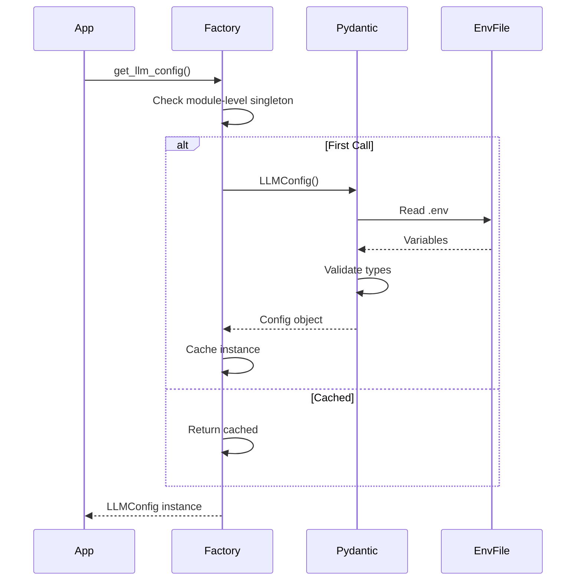

<!-- markdownlint-disable MD046 -->

## Overview

The `core/config` module is the **foundation** of BaselithCore's runtime behavior and operational parameters. It provides a type-safe, centralized configuration management system built on Pydantic Settings, eliminating the anti-pattern of scattered environment variable access throughout the codebase.

**Key Benefits**:

- **Type Safety** - Automatic validation prevents invalid configurations from starting
- **Centralization** - Single source of truth for all runtime settings
- **Secret Protection** - `SecretStr` types prevent accidental logging of sensitive data
- **Testability** - Factory functions enable easy mocking in unit tests
- **Environment Flexibility** - Seamless switching between dev/staging/production configs

**Core Capabilities**:

1. **Lazy Loading** - Configuration objects created only when first accessed, improving startup time
1. **Single `.env` Parse** - Importing `core.config` loads the repository `.env` into `os.environ` exactly once (`core.config.env.load_project_env`, `override=False` so real env vars win). Config classes no longer declare `env_file`, removing 20+ redundant file parses (~230ms → ~7ms to instantiate all settings classes)
1. **Singleton Pattern** - Same config instance shared across the application, ensuring consistency
1. **Startup Validation** - Pydantic catches misconfigurations before deployment, preventing runtime failures
1. **Secret Management** - Built-in protection against accidental exposure in logs or error messages

### Why Centralized Configuration?

In baselith-cores, configuration sprawl is a critical failure point. Without centralization:

- **Inconsistency**: Different modules interpret the same environment variable differently
- **No Validation**: Type errors and missing values fail silently until production
- **Security Risks**: Secrets appear in stack traces, logs, and monitoring tools
- **Testing Difficulty**: Hard-coded `os.getenv()` calls are nearly impossible to mock properly

The `core/config` architecture solves these by providing **strongly-typed configuration contracts** that are validated at application startup, not at runtime failure.

## Module Structure

```text
core/config/
├── __init__.py           # Exports and factory functions
├── base.py               # CoreConfig (CORE_ prefix)
├── app.py                # AppConfig (server, tenancy, telemetry, CHAT_GUARDRAILS_*)
├── guardrails.py         # GuardrailsSettings (GUARDRAILS_ prefix) — the live guards
├── services.py           # LLMConfig (re-exports ChatConfig, VectorStoreConfig, VisionConfig, VoiceConfig)
├── chat.py               # ChatConfig
├── vectorstore.py        # VectorStoreConfig (Qdrant / pgvector)
├── multimodal.py         # VisionConfig, VoiceConfig, FineTuningConfig
├── storage.py            # PostgreSQL, GraphDB (RedisGraph), cache/queue Redis
├── resilience.py         # Circuit breaker, retry, rate limiting, bulkhead
├── security.py           # Auth, secrets, CORS, rate limits, headers
├── _security_parsers.py  # env-string -> typed credential coercion for security.py
├── _security_posture.py  # Startup refuse/warn checks over a finished SecurityConfig
├── _collections.py       # csv_list — the parser every NoDecode collection field uses
├── observability.py      # ObservabilityConfig (metric cardinality, trace exemplars)
├── orchestration.py      # OrchestrationConfig, RouterConfig
├── plugins.py            # PluginConfig
├── memory.py             # SupermemoryConfig + MemoryRuntimeConfig (MEMORY_ prefix)
├── environment.py        # re-export of core/utils/runtime_env.py (stdlib-only)
├── drift.py              # suspected-typo detection for environment variables
├── quotas.py             # QuotaConfig + per-key/per-tenant runtime overrides
├── mcp.py                # MCPConfig + MCPServerSpec (declarative MCP_SERVERS registry)
├── sandbox.py            # SandboxConfig (SANDBOX_* incl. cost_per_compute_second)
├── webhooks.py           # WebhookConfig (WEBHOOKS_ENABLED, WEBHOOK_STORE, WEBHOOK_*)
└── ...                   # cache, swarm, reasoning, world_model, etc.
```

The per-module env tables live with the module they configure — e.g. the
declarative `MCP_SERVERS` registry under
[MCP › Configuration](mcp.md#configuration) and sandbox metering
(`SANDBOX_COST_PER_COMPUTE_SECOND`) under
[Services › Sandbox Configuration](services.md#sandbox-configuration), the
`GUARDRAILS_*` input/output guard settings under
[Guardrails › Configuration](guardrails.md#configuration), and `WEBHOOK_STORE`
under [Webhooks › Configuration](webhooks.md#configuration).

---

## When to Use

Use `core/config` for defining **static application parameters** that are set at deployment time and remain constant during execution.

**When to Use Configuration For**:

| Use Case                    | Example                               | Why Config                 |
| --------------------------- | ------------------------------------- | -------------------------- |
| **Infrastructure Settings** | Database URLs, Redis connections      | External service addresses |
| **Service Behavior**        | Rate limits, timeouts, retry policies | Operational parameters     |
| **Feature Flags**           | `ENABLE_FEEDBACK=true`                | Gradual rollout control    |
| **LLM Parameters**          | Model names, API keys, endpoints      | Model infrastructure       |
| **Plugin Settings**         | Plugin-specific API keys, thresholds  | Plugin configuration       |

**Consider Alternatives When**:

| Scenario            | Use Instead      | Reason                         |
| ------------------- | ---------------- | ------------------------------ |
| **Runtime State**   | agent state      | Values change during execution |
| **User Data**       | Database models  | Persistent user-specific data  |
| **Dynamic Values**  | In-memory caches | Frequently changing values     |
| **Request Context** | Middleware/DI    | Per-request information        |

**Anti-Patterns (Do NOT Use For)**:

- Session-specific data
- Agent state (use orchestrator state management)
- Temporary flags (use feature flags properly, not config hacks)
- Hard-coded business logic masquerading as "configuration"

---

## Fundamental Principle

All configuration MUST be accessed via **factory functions**, never direct `os.getenv()` calls.

!!! warning "Mandatory Rule"
    **NEVER** use `os.getenv()` directly in business code. Always use factory functions.

**Rationale**:

1. **Type Safety** - Factory returns validated Pydantic models, not optional strings
2. **Lazy Loading** - Configuration loaded only when first accessed, improving cold starts
3. **Singleton Guarantee** - Each factory caches a module-level instance so the same object is shared app-wide
4. **Startup Validation** - Invalid configs fail fast with clear error messages
5. **Mockability** - Tests can easily patch factory functions

```python
# ✅ Correct
from core.config import get_llm_config
config = get_llm_config()
model = config.model

# ❌ Wrong
import os
model = os.getenv("LLM_MODEL")  # NO!
```

---

## Collection settings: the `NoDecode` + `csv_list` contract {#collection-settings}

**Every new settings field holding a collection of *strings* must follow this
contract.** It is not a style preference — omitting either half reintroduces a
bug that has already shipped. (A field holding a mapping of nested *objects* is
a different case; see [Nested-object settings](#nested-object-settings) below.)

pydantic-settings treats any collection-typed field as *complex* and
JSON-decodes its raw environment value inside `EnvSettingsSource` — **before any
`field_validator` runs**. So a field that looks like it accepts a comma-separated
list does not: `FOO=a,b` raises `SettingsError` out of the **whole settings
class**, not just that field, and a class is usually a whole subsystem's
configuration. A blank value fails identically, which means an operator who
copies `.env.example` verbatim can break a subsystem by leaving a key empty.

Both halves are required:

```python
from typing import Annotated

from pydantic import Field, field_validator
from pydantic_settings import BaseSettings, NoDecode

from core.config._collections import csv_list


class ObservabilityConfig(BaseSettings):
    # 1. NoDecode — hand the raw string through untouched
    metrics_tenant_label_allowlist: Annotated[set[str], NoDecode] = Field(
        default_factory=set,
        alias="METRICS_TENANT_LABEL_ALLOWLIST",
    )

    # 2. a mode="before" validator that actually parses it
    @field_validator("metrics_tenant_label_allowlist", mode="before")
    @classmethod
    def _parse_allowlist(cls, value: object) -> object:
        return csv_list(value)
```

`csv_list` (`core/config/_collections.py`) normalises to a list of trimmed,
non-empty strings:

| Input | Result |
|---|---|
| `"core.,plugins."` | `['core.', 'plugins.']` |
| `"  "` (blank) | `[]` |
| `'["a", "b"]'` | `['a', 'b']` |
| an already-built list, or any non-string | returned unchanged |

The JSON form is still accepted on purpose: deployments configured against the
previous behaviour have one in their environment (`.env.example` itself ships
`TRUSTED_HOSTS=["app.example.com"]`), and `NoDecode` would otherwise hand them
the single-element list `['["app.example.com"]']`.

!!! warning "`csv_list` splits on a literal comma"
    A value that legitimately contains a comma cannot be expressed in the CSV
    form — a credential, an algorithm token, a description. Use the **JSON array**
    form for those:

    ```bash
    # Wrong: split into two useless entries
    SOME_KEYS=abc,def-with,comma

    # Right
    SOME_KEYS=["abc", "def-with,comma"]
    ```

### Nested-object settings are JSON-only {#nested-object-settings}

The contract above covers collections of **strings**, where a comma-separated
spelling is meaningful. A setting whose value is a mapping of *objects* has no CSV
spelling, so it keeps pydantic-settings' JSON decoding untouched — and a non-JSON
value still raises `SettingsError` out of the whole settings class:

| Setting | Shape | Module |
|---|---|---|
| `MCP_SERVERS` | `dict[str, MCPServerSpec]` | `core/config/mcp.py` |
| `PLUGIN_PLUGIN_CONFIGS` | `dict[str, dict[str, Any]]` | `core/config/plugins.py` |
| `WORLD_MODEL_RISK_WEIGHTS` | `dict[str, float]` | `core/config/world_model.py` |

```bash
# Raises SettingsError out of the whole MCPConfig
MCP_SERVERS=weather

# The only accepted form
MCP_SERVERS='{"weather": {"command": "python", "args": ["weather_server.py"]}}'
```

Adding a `csv_list` validator to one of these would be wrong, not merely
unnecessary: `csv_list` returns a list of strings, and the field needs a mapping.
If a future nested-object setting needs a friendlier spelling, give it its own
`mode="before"` validator — `OIDC_ROLE_MAP` is the precedent, parsing
`idp_role:app_role` pairs into a `dict[str, str]` under the same `NoDecode`.

---

## Factory Functions

Each domain module exposes a factory function. The most commonly used ones
exported from `core.config` (the full set also covers events, MCP, processing,
reasoning, sandbox, scraper, swarm, webhooks, world-model, vision and voice):

```python
from core.config import (
    get_core_config,          # CoreConfig
    get_app_config,           # AppConfig
    get_llm_config,           # LLMConfig
    get_vectorstore_config,   # VectorStoreConfig
    get_chat_config,          # ChatConfig
    get_storage_config,       # StorageConfig
    get_cache_config,         # CacheConfig
    get_resilience_config,    # ResilienceConfig
    get_security_config,      # SecurityConfig
    get_orchestration_config, # OrchestrationConfig
    get_router_config,        # RouterConfig
    get_plugin_config,        # PluginConfig
    get_supermemory_config,   # SupermemoryConfig
)
```

Most factories use a module-level singleton guard (created on first call). A
few (e.g. `get_supermemory_config`) use `functools.lru_cache`. Either way, the
result is a single shared instance per process.

---

## Configuration Modules

### Core Config

`CoreConfig` uses the `CORE_` env prefix.

```python
from core.config import get_core_config

config = get_core_config()

print(config.debug)           # bool          (CORE_DEBUG)
print(config.log_level)       # "INFO"        (CORE_LOG_LEVEL)
print(config.app_name)        # "Baselith-Core" (CORE_APP_NAME)
print(config.max_workers)     # 4             (CORE_MAX_WORKERS)
print(config.deterministic_mode)  # bool      (CORE_DETERMINISTIC_MODE)
```

**`.env` Variables**:

```env
CORE_DEBUG=true
CORE_LOG_LEVEL=INFO
CORE_APP_NAME=Baselith-Core
CORE_MAX_WORKERS=4
CORE_DETERMINISTIC_MODE=false
```

---

### App Config

`AppConfig` holds server, multi-tenancy, telemetry, cost-control, and
chat settings. Fields use explicit aliases (no shared prefix). Its
`CHAT_GUARDRAILS_*` fields configure only the keyword guard of the opt-in
`core/chat` RAG pipeline; the guards every request runs read `GUARDRAILS_*`
(`core/config/guardrails.py`).

```python
from core.config import get_app_config

config = get_app_config()

print(config.host)                      # "0.0.0.0"  (HOST)
print(config.port)                      # 8000       (PORT)
print(config.strict_tenant_isolation)   # True       (STRICT_TENANT_ISOLATION)
print(config.telemetry_enabled)         # False      (TELEMETRY_ENABLED)
print(config.cost_control_enabled)      # True       (COST_CONTROL_ENABLED)
print(config.agent_max_tokens)          # 10000      (AGENT_MAX_TOKENS)
print(config.timezone)                  # ZoneInfo (derived from APP_TIMEZONE)
```

**`.env` Variables**:

```env
HOST=0.0.0.0
PORT=8000

# Landing: path GET / redirects to (307). Empty = the root keeps answering 404,
# because no route is registered there.
BASELITH_ROOT_REDIRECT=

# Multi-Tenancy (Default: true) — lives on AppConfig
STRICT_TENANT_ISOLATION=true

# Telemetry
TELEMETRY_ENABLED=false
TELEMETRY_OTEL_ENDPOINT=http://localhost:4317
TELEMETRY_OTEL_PROTOCOL=grpc        # or http/protobuf (endpoint port becomes 4318)
TELEMETRY_LOGS_ENABLED=false        # OTLP log-record export, alongside stdout
SENTRY_DSN=

# Cost control
COST_CONTROL_ENABLED=true          # Alias: LLM_BUDGET_ENABLED
AGENT_MAX_TOKENS=10000             # Alias: LLM_BUDGET_MAX_TOKENS

APP_TIMEZONE=Europe/Rome
```

!!! tip "Multi-Tenancy"
    `STRICT_TENANT_ISOLATION` is enabled by default and is an `AppConfig`
    field. It ensures every database query and event respects the current
    tenant context. Set to `false` only for single-tenant migrations.

---

### Services Config (LLM / VectorStore / Chat)

These live in `core/config/services.py`. `LLMConfig` uses the `LLM_` prefix,
`VectorStoreConfig` the `VECTORSTORE_` prefix, and `ChatConfig` the `CHAT_`
prefix. `VectorStoreConfig` and `ChatConfig` themselves now live in
`core/config/vectorstore.py` and `core/config/chat.py` (extracted for the
file-size cap); `core.config.services` re-exports both, so existing imports are
unchanged.

```python
from core.config import get_llm_config, get_vectorstore_config

llm = get_llm_config()
print(llm.provider)            # "ollama"     (LLM_PROVIDER)
print(llm.model)               # "llama3.2"   (LLM_MODEL)
print(llm.api_key)             # SecretStr | None (LLM_API_KEY / LLM_OPENAI_API_KEY)
print(llm.api_base)            # None         (LLM_API_BASE — the DEFAULT provider's endpoint)
print(llm.ollama_api_base)     # None         (LLM_OLLAMA_API_BASE)
print(llm.preflight)           # "auto"       (LLM_PREFLIGHT — startup posture check)
print(llm.temperature)         # 0.7          (LLM_TEMPERATURE)

vs = get_vectorstore_config()
print(vs.collection_name)      # "documents"  (VECTORSTORE_COLLECTION_NAME)
print(vs.host)                 # "localhost"  (VECTORSTORE_HOST / VECTORSTORE_QDRANT_HOST)
print(vs.port)                 # 6333         (VECTORSTORE_PORT)
print(vs.embedding_model)      # "sentence-transformers/all-MiniLM-L6-v2"
print(vs.embedding_dim)        # 384          (VECTORSTORE_EMBEDDING_DIM)
```

**`.env` Variables**:

```env
LLM_PROVIDER=ollama
LLM_MODEL=llama3.2
# LLM_API_BASE is the endpoint of LLM_PROVIDER, not a global base URL. With
# LLM_PROVIDER=openai it reaches any OpenAI-compatible server (Azure OpenAI
# gateway, vLLM, LiteLLM, OpenRouter); empty keeps the SDK default.
LLM_API_BASE=http://localhost:11434
LLM_OLLAMA_API_BASE=                 # Ollama's own endpoint when it is NOT the default
LLM_API_KEY=sk-...                   # Alias: LLM_OPENAI_API_KEY
LLM_FALLBACK_STAGE_TIMEOUT=          # Per-stage bound for LLM_FALLBACK_CHAIN (unset = none)
LLM_FALLBACK_TOTAL_TIMEOUT=          # Whole-chain wall clock (unset = LLM_REQUEST_TIMEOUT)
LLM_ENABLE_NATIVE_TOOLS=true         # Native tool-calling in LLMService.generate() (default on)
LLM_MAX_CONCURRENT_REQUESTS=0        # Max in-flight provider calls per process (0 = unlimited)

# Anthropic serving backend: 'api' (default, needs ANTHROPIC_API_KEY),
# 'bedrock' / 'vertex' (the SDK's native cloud clients — AWS SigV4 /
# Google ADC credential chain, no Anthropic key).
LLM_ANTHROPIC_BACKEND=api
LLM_ANTHROPIC_AWS_REGION=            # Bedrock region (unset = SDK's AWS_REGION)
LLM_ANTHROPIC_VERTEX_PROJECT=        # Vertex project (unset = GOOGLE_CLOUD_PROJECT)
LLM_ANTHROPIC_VERTEX_REGION=         # Vertex region (unset = CLOUD_ML_REGION)

VECTORSTORE_COLLECTION_NAME=documents
VECTORSTORE_HOST=localhost           # Alias: VECTORSTORE_QDRANT_HOST
VECTORSTORE_PORT=6333
VECTORSTORE_EMBEDDING_MODEL=sentence-transformers/all-MiniLM-L6-v2

# Managed/remote Qdrant — both unset for the loopback compose default
QDRANT_API_KEY=                      # SecretStr; API key for managed/remote Qdrant
QDRANT_HTTPS=false                   # Use TLS for the Qdrant REST endpoint
VECTORSTORE_TIMEOUT_SECONDS=30.0     # Per-request deadline for vector store calls
VECTORSTORE_SEARCH_CACHE_ENABLED=true  # Cache vector search results in Redis
VECTORSTORE_SEARCH_CACHE_TTL=300     # Cached result lifetime in seconds (>= 1)
```

!!! note "Search result cache switches"
    `search_cache_enabled` (default `True`, env
    `VECTORSTORE_SEARCH_CACHE_ENABLED`) and `search_cache_ttl` (default `300`
    seconds, `ge=1`, env `VECTORSTORE_SEARCH_CACHE_TTL`) are declared
    `VectorStoreConfig` fields. The search orchestrator and the vector store
    service always read them with `getattr`, but until now neither was
    declared. The model ignores unknown keys (`extra="ignore"`), so an
    env-driven deployment could not disable the cache or change its TTL, and
    setting either variable did nothing. A TTL of `0` is rejected because some
    cache backends read `0` as "never expire". See
    [Services › Search Result Cache](services.md#search-result-cache).

!!! note "Bounding LLM concurrency"
    `max_concurrent_requests` (default `0` = unlimited, env
    `LLM_MAX_CONCURRENT_REQUESTS`) caps simultaneously in-flight
    (non-streaming) provider calls **per process** with a semaphore around the
    provider round-trip. Token budgets and rate limits bound spend per
    request/minute, but nothing bounded concurrency: a burst of requests
    opened that many provider calls at once. The slot is held only for the
    provider call itself, not across retry backoff — see
    [Services › Concurrency Cap](services.md#concurrency-cap-per-process).

!!! note "Anthropic on Bedrock / Vertex"
    `anthropic_backend` (default `"api"`, env `LLM_ANTHROPIC_BACKEND`) selects
    how Anthropic models are served. `bedrock` and `vertex` authenticate
    through the cloud's own credential chain and **require no Anthropic API
    key**; each region/project field defers to the SDK's own env resolution
    (`AWS_REGION` / `GOOGLE_CLOUD_PROJECT` / `CLOUD_ML_REGION`) when unset.
    See [Services › Anthropic serving backends](services.md#anthropic-serving-backends-llm_anthropic_backend).

!!! note "Remote Qdrant: auth, TLS, deadline"
    `qdrant_api_key` (`SecretStr`), `qdrant_https` and
    `request_timeout_seconds` (default `30.0`) are forwarded to
    `AsyncQdrantClient` as `api_key`/`https`/`timeout`, so a managed or remote
    Qdrant instance works with authentication and TLS, and a hung server fails
    fast into the retry/circuit-breaker wrappers instead of stalling callers.
    See [Services › VectorStore](services.md#vectorstore-service).

---

### Orchestration Config

`OrchestrationConfig` (`core/config/orchestration.py`) uses the
`ORCHESTRATOR_` env prefix. The same module holds `RouterConfig` (`ROUTER_`
prefix) for the semantic router.

```python
from core.config import get_orchestration_config

config = get_orchestration_config()

print(config.default_intent)                 # "qa_docs"
print(config.confidence_threshold)           # 0.6
print(config.checkpoint_enabled)             # True   (ORCHESTRATOR_CHECKPOINT_ENABLED)
print(config.checkpoint_backend)             # "auto" (ORCHESTRATOR_CHECKPOINT_BACKEND)
print(config.checkpoint_memory_max_entries)  # 1000   (ORCHESTRATOR_CHECKPOINT_MEMORY_MAX_ENTRIES)
print(config.tool_ledger)                    # "auto" (ORCHESTRATOR_TOOL_LEDGER)
```

**`.env` Variables**:

```env
ORCHESTRATOR_DEFAULT_INTENT=qa_docs
ORCHESTRATOR_ENABLE_TELEMETRY=false
ORCHESTRATOR_CONFIDENCE_THRESHOLD=0.6

# Durable checkpointing / human-in-the-loop — ON by default: runs persist
# resumable checkpoints, approval gates pause durably, /approvals is mounted.
ORCHESTRATOR_CHECKPOINT_ENABLED=true
ORCHESTRATOR_CHECKPOINT_BACKEND=auto              # 'postgres' | 'sqlite' | 'memory' | 'auto'
ORCHESTRATOR_CHECKPOINT_SQLITE_PATH=data/checkpoints.db   # 'sqlite' backend only
ORCHESTRATOR_CHECKPOINT_RESUME_ON_STARTUP=false
ORCHESTRATOR_CHECKPOINT_HISTORY_ENABLED=false
ORCHESTRATOR_CHECKPOINT_HISTORY_LIMIT=200         # 0 = unlimited snapshots per run
ORCHESTRATOR_CHECKPOINT_MEMORY_MAX_ENTRIES=1000   # retained-run cap, memory backend only

# Backing store for the tool idempotency ledger: 'auto' takes Postgres when
# POSTGRES_ENABLED, else the in-process ledger (warned); 'postgres' fails
# loudly instead; 'memory' is always in-process; 'off' records nothing.
ORCHESTRATOR_TOOL_LEDGER=auto                     # 'auto' | 'postgres' | 'memory' | 'off'

# Burst limit on side-effecting tool invocations — opt-in, in-process,
# keyed (tenant, tool); categories destructive / external_side_effect only.
ORCHESTRATOR_TOOL_RATE_LIMIT_ENABLED=false
ORCHESTRATOR_TOOL_RATE_LIMIT_MAX_CALLS=30
ORCHESTRATOR_TOOL_RATE_LIMIT_WINDOW_SECONDS=60
```

!!! note "Checkpointing is on by default"
    `ORCHESTRATOR_CHECKPOINT_ENABLED` defaults to `True` (changed from
    `False`): every chat run persists a resumable checkpoint, approval gates
    pause durably, and the operator-facing `/approvals` API is active in a
    stock deployment. The `auto` backend resolves to Postgres when
    `POSTGRES_ENABLED=true`, else a bounded in-memory store capped at
    `ORCHESTRATOR_CHECKPOINT_MEMORY_MAX_ENTRIES` (default `1000`; oldest
    finished runs evicted first). The `sqlite` backend gives crash-durable
    runs from a single file without a Postgres instance
    (`ORCHESTRATOR_CHECKPOINT_SQLITE_PATH`, default `data/checkpoints.db`).
    Set `ORCHESTRATOR_CHECKPOINT_ENABLED=false` to run without
    checkpointing. Full flow:
    [Orchestration › Durable checkpointing & resume](orchestration.md#durable-checkpointing-resume).

!!! note "`ORCHESTRATOR_TOOL_LEDGER` picks who remembers an effectful call"
    The tool idempotency ledger keeps a redelivered or resumed run from
    repeating a payment, a webhook or an email. `auto` (the default) resolves
    to the durable Postgres ledger when `POSTGRES_ENABLED=true` and otherwise
    to the in-process one, **logging the consequence** — deduplication then
    holds inside one worker only. `postgres` refuses to start the ledger it
    cannot build (`DurableLedgerUnavailable`) rather than degrading quietly,
    `memory` is the single-worker/test choice, and `off` disables recording
    entirely. The ledger is process-wide and built on first use. Full flow:
    [Orchestration › Choosing the ledger](orchestration.md#choosing-the-ledger-orchestrator_tool_ledger).

---

### Storage Config

`StorageConfig` covers PostgreSQL, GraphDB (RedisGraph), and the cache/queue
Redis instances. Fields use explicit aliases. The `conninfo` property builds a
PostgreSQL DSN from `database_url` (if set) or the discrete `DB_*` fields.

```python
from core.config import get_storage_config

config = get_storage_config()

# PostgreSQL
print(config.database_url)        # None or a full URL  (DATABASE_URL)
print(config.db_host)             # "postgres"          (DB_HOST)
print(config.db_name)             # "baselith"          (DB_NAME)
print(config.db_user)             # "baselith"          (DB_USER)
print(config.conninfo)            # "postgresql://..."  (computed)
print(config.postgres_enabled)    # True                (POSTGRES_ENABLED)
print(config.db_rls_enabled)      # False               (DB_RLS_ENABLED)

# GraphDB (RedisGraph)
print(config.graph_db_url)        # "redis://localhost:6379"  (GRAPH_DB_URL)

# Cache / Queue Redis
print(config.cache_backend)       # "local"  (CACHE_BACKEND)
print(config.cache_redis_url)     # "redis://localhost:6379/1"  (CACHE_REDIS_URL)
print(config.queue_redis_url)     # "redis://localhost:6379/2"  (QUEUE_REDIS_URL)
```

**`.env` Variables**:

```env
POSTGRES_ENABLED=true
DB_HOST=postgres
DB_PORT=5432
DB_NAME=baselith
DB_USER=baselith
DB_PASSWORD=your-strong-password     # Required in production — stored as SecretStr
# DATABASE_URL=postgresql://...      # Optional: overrides the discrete DB_* fields
# DB_RLS_ENABLED=false               # Opt-in: bind app.tenant_id per checkout for Postgres RLS

GRAPH_DB_ENABLED=true
GRAPH_DB_URL=redis://localhost:6379

CACHE_BACKEND=local                  # default 'local'; set 'redis' to use CACHE_REDIS_URL
CACHE_REDIS_URL=redis://localhost:6379/1
QUEUE_REDIS_URL=redis://localhost:6379/2
```

!!! warning "Production requirement"
    When the runtime environment resolves to `production` (see [Runtime
    environment](#runtime-environment) — `APP_ENV`/`ENVIRONMENT` set to
    `production`, `prod`, `prd`, `live`, or to any name the framework does not
    recognise) and `POSTGRES_ENABLED=true`, either `DATABASE_URL` or
    `DB_PASSWORD` **must** be set or the application refuses to start.
    `DB_PASSWORD` is stored as `SecretStr` and never appears in logs.

!!! note "Connection strings are redacted on every dump"
    `DATABASE_URL`, `DB_REPLICA_URL`, `GRAPH_DB_URL`, `CACHE_REDIS_URL` and
    `QUEUE_REDIS_URL` can embed `user:password@` userinfo. They stay plain
    `str` — call sites consume them directly as DSNs — so the leak is closed at
    the *serialization* boundary instead: `repr()`, `model_dump()` and
    `model_dump_json()` strip the userinfo and keep only scheme/host/port/path,
    which is what lands in config breadcrumbs, debug output and Sentry frames.
    Attribute access is untouched and still returns the credentialed value.
    `conninfo` is a plain `@property` rather than a `computed_field` for the
    same reason: as a computed field the assembled DSN — password included —
    would ride along in every dump, defeating the `SecretStr` on `DB_PASSWORD`.

```python
config.cache_redis_url                   # redis://:pw@cache:6379/1  (usable)
config.model_dump()["cache_redis_url"]   # redis://cache:6379/1      (redacted)
```

---

### Cache Config

`core/config/cache.py` holds three settings classes: `CacheConfig` (`CACHE_`
prefix), `RedisCacheConfig` (`REDIS_` prefix) and `SemanticCacheConfig`
(`SEMANTIC_CACHE_` prefix), each with its own factory.

```python
from core.config import get_cache_config, get_redis_cache_config

cache = get_cache_config()
print(cache.ttl_default)                  # 300.0  (CACHE_TTL_DEFAULT)
print(cache.maxsize_default)              # 256    (CACHE_MAXSIZE_DEFAULT)
print(cache.cross_worker_single_flight)   # False  (CACHE_CROSS_WORKER_SINGLE_FLIGHT)

redis = get_redis_cache_config()
print(redis.cache_prefix)                 # "baselithcore:cache" (REDIS_CACHE_PREFIX)
print(redis.cache_ttl)                    # 3600.0 (REDIS_CACHE_TTL)
```

**`.env` Variables**:

```env
CACHE_TTL_DEFAULT=300                     # Default TTL (s) for caches
CACHE_MAXSIZE_DEFAULT=256                 # Default max entries for in-memory caches
CACHE_CROSS_WORKER_SINGLE_FLIGHT=false    # Opt-in cross-worker miss coalescing (see below)

REDIS_CACHE_PREFIX=baselithcore:cache
REDIS_CACHE_TTL=3600
REDIS_MAX_CONNECTIONS=50
REDIS_SOCKET_TIMEOUT=5                    # Per-operation read deadline
REDIS_SOCKET_CONNECT_TIMEOUT=2            # TCP connect deadline

SEMANTIC_CACHE_MAXSIZE=1000               # Entries per tenant
SEMANTIC_CACHE_TTL=3600
SEMANTIC_CACHE_THRESHOLD=0.85             # Min similarity (0.0-1.0)
SEMANTIC_CACHE_FINGERPRINT_ENABLED=true   # n-gram fingerprint tier before the embedding scan
SEMANTIC_CACHE_FINGERPRINT_THRESHOLD=0.8  # Min Jaccard of word n-gram fingerprints (0.0-1.0)
```

!!! note "`RedisCacheConfig.url` is redacted on every dump"
    The Redis connection URL (`RedisCacheConfig.url`, env `CACHE_REDIS_URL`,
    default `"redis://localhost:6379/1"`, the same as `StorageConfig.cache_redis_url`) can embed `user:password@` credentials.
    It follows the same contract as the `StorageConfig` DSNs: the attribute
    stays a plain, usable `str`, while `repr()`, `model_dump()` and
    `model_dump_json()` strip the userinfo — so the credential never lands in
    config breadcrumbs, debug output or Sentry frames.

!!! note "Cross-worker single-flight is doubly gated"
    `CACHE_CROSS_WORKER_SINGLE_FLIGHT=true` coalesces cache-miss fills *across*
    workers/pods via a Redis lock, not just within one event loop. It only
    takes effect where the caller's backing cache is genuinely shared (Redis) —
    over a process-local store the losing worker has nothing to read back — and
    it is fail-open: if Redis is unreachable the path degrades to in-process
    coalescing. Full design in
    [Cache — single-flight](cache.md#single-flight-stampede-protection).

---

### Resilience Config

`ResilienceConfig` uses the `RESILIENCE_` prefix.

```python
from core.config import get_resilience_config

config = get_resilience_config()

# Circuit Breaker
print(config.cb_fail_max)             # 5
print(config.cb_reset_timeout)        # 60

# Rate Limiter
print(config.api_rate_limit)          # 100
print(config.api_rate_window)         # 60

# Retry
print(config.retry_max_attempts)      # 3
print(config.retry_base_delay)        # 1.0
```

---

### Quota Config

`QuotaConfig` (`core/config/quotas.py`) drives the persistent usage budgets in
[`core/quotas`](quotas.md). Fields use explicit `QUOTA*` aliases; everything
defaults to off/unlimited.

```env
QUOTAS_ENABLED=false                 # Master switch (default: false)
QUOTA_DAILY_REQUESTS=                # Per-identity request budgets; empty/0 = unlimited
QUOTA_MONTHLY_REQUESTS=
QUOTA_TENANT_DAILY_REQUESTS=         # Per-tenant aggregate request budgets
QUOTA_TENANT_MONTHLY_REQUESTS=
QUOTA_TENANT_DAILY_COST_USD=         # Per-tenant cumulative USD spend budgets
QUOTA_TENANT_MONTHLY_COST_USD=       # (default: unlimited)
QUOTA_IDENTITY_DAILY_COST_USD=       # Per-identity (API key / user) USD spend
QUOTA_IDENTITY_MONTHLY_COST_USD=     # budgets, independent of the tenant aggregate
QUOTA_BACKEND=redis                  # 'redis' (shared across workers) or 'memory'
```

The module also holds the runtime override registries — `set_key_quota` /
`set_tenant_quota` for request limits, `set_tenant_cost_budget` /
`get_tenant_cost_overrides` for tenant USD cost budgets, `set_key_cost_budget`
/ `get_key_cost_overrides` for per-identity USD cost budgets — so a tenant's
or key's plan can be raised or lowered without redeploying. See
[Usage Quotas](quotas.md#configuration) for semantics and enforcement.

---

### Security Config

`SecurityConfig` covers auth, secrets, CORS, rate limiting, and security
headers. Fields use explicit aliases.

```python
from core.config import get_security_config

config = get_security_config()

print(config.secret_key)            # SecretStr | None  (SECRET_KEY)
print(config.auth_required)         # True              (AUTH_REQUIRED)
print(config.jwt_issuer)            # APP_BASE_URL      (JWT_ISSUER)
print(config.jwt_audience)          # None              (JWT_AUDIENCE)
print(config.jwt_strict_validation) # auto              (JWT_STRICT_VALIDATION)
print(config.access_token_lifetime) # 3600              (AUTH_ACCESS_TOKEN_LIFETIME)
print(config.allow_origins)         # []                (ALLOW_ORIGINS)
print(config.trusted_hosts)         # []                (TRUSTED_HOSTS)
print(config.api_keys_user)         # Set[SecretStr]    (API_KEYS_USER)
```

**`.env` Variables**:

```env
SECRET_KEY=...                       # Required when AUTH_REQUIRED=true (min 32 chars)
AUTH_REQUIRED=true
JWT_ISSUER=
JWT_AUDIENCE=
JWT_STRICT_VALIDATION=                # Reject JWTs missing aud/iss; auto-on with AUTH_REQUIRED
JWT_ALGORITHM=HS256                  # EdDSA/RS256/ES256 to split signing from verification
JWT_KEYS=                            # Key ring 'kid=key,...' — SecretStr, redacted like SECRET_KEY
JWT_ACTIVE_KID=                      # Which ring key signs new tokens
AUTH_ACCESS_TOKEN_LIFETIME=3600      # Access-token TTL in seconds (alias: AUTH_SESSION_LIFETIME)
ALLOW_ORIGINS=                       # CORS — empty blocks all cross-origin by default
TRUSTED_HOSTS=                       # Host allowlist; empty = TrustedHostMiddleware not mounted
API_KEYS_USER=key1,key2              # Comma-separated, coerced to Set[SecretStr]
AUTH_FAILURE_LIMIT_PER_MINUTE=20     # Per-IP budget for *failed* auth (429 over budget); blank disables
CROSS_ORIGIN_OPENER_POLICY=same-origin-allow-popups   # COOP header; empty omits it
CROSS_ORIGIN_RESOURCE_POLICY=same-origin              # CORP header; same-site for split subdomains, empty omits
```

The `AUTH_FAILURE_LIMIT_PER_MINUTE` budget throttles credential brute-force /
stuffing per source IP: rejected authentication attempts (counted on
`authfail:{ip}` over `RATE_LIMIT_WINDOW_SECONDS`) trip to `429` once the budget
is exhausted, while successful auth never touches the counter. See
[Failed-auth throttle](middleware.md#failed-auth-throttle).

`CROSS_ORIGIN_OPENER_POLICY` / `CROSS_ORIGIN_RESOURCE_POLICY` feed the
cross-origin isolation pair `SecurityHeadersMiddleware` emits next to the CSP
(OWASP Secure Headers). The defaults keep OAuth/SSO popups opened by the
console working and stop foreign origins loading API responses as no-cors
subresources; CORS-approved `fetch` calls from `ALLOW_ORIGINS` are unaffected.
See [SecurityHeadersMiddleware](middleware.md#securityheadersmiddleware).

!!! warning "Startup validation"
    `SecurityConfig` raises at construction if `AUTH_REQUIRED=true` without a
    `SECRET_KEY`, if `SECRET_KEY` is shorter than 32 characters, if `ADMIN_PASS`
    is an insecure default, or if `ALLOW_ORIGINS` contains `*` while
    `ADMIN_PASS` is set.
    Two further checks run later, in the app lifespan
    (`core.api.startup_checks`): production without `JWT_ISSUER`/`JWT_AUDIENCE`
    **refuses to start** when `AUTH_REQUIRED=true` (opt out with
    `BASELITH_ALLOW_UNBOUND_JWT=true`), while production with an empty
    `TRUSTED_HOSTS` only logs an ERROR — there is no hostname the framework can
    infer, so that one stays advisory. See
    [Host header validation](../advanced/security.md#host-header-validation).

---

### Runtime environment

Two helpers answer a single question — *is this deployment production?* — and
almost every fail-closed control in the framework reads the answer: plugin
signature enforcement, unsigned-A2A rejection, the A2A SSRF internal-host deny,
admin lockout when Redis is unreachable, the JWT `iss`/`aud` startup check, and
whether `/docs` is served anonymously.

The logic lives in `core/utils/runtime_env.py` and is deliberately
**stdlib-only**: `core.plugins.integrity` and `core.a2a.security` run on paths
that must not pull pydantic in through `core.config`'s package init, so each
used to carry its own hand-rolled copy of the check. `core/config/environment.py`
is now a thin re-export of that module, and the private copies are gone — the
three implementations can no longer drift apart.

```python
from core.config import get_runtime_environment, is_production_env

# Or, from a module that must stay free of the config package:
from core.utils.runtime_env import is_known_environment, is_production_env

get_runtime_environment()               # "production" when APP_ENV=prod
is_production_env()                     # True
is_known_environment("qa")              # True
is_known_environment("integration-eu")  # False → treated as production
```

`APP_ENV` wins over `ENVIRONMENT`; both are stripped and lowercased. With
neither set the value defaults to `development` — *unless*
`assume_production_when_undeclared()` was armed: `create_app()` calls it when
`AUTH_REQUIRED` is on but neither variable was declared (a shape that smells
like a forgotten prod env var), after which the undeclared environment
resolves to `production` and `is_production_env()` returns `True` for **every**
production gate — plugin signature enforcement, unsigned-A2A rejection, the
A2A SSRF deny, `/docs` off — not just the docs endpoints. A warning is logged
at startup, and declaring any known environment name always overrides the
flag. Production spellings are folded onto the canonical `production`; every
other known name is returned as declared:

| Declared value | `get_runtime_environment()` | `is_production_env()` |
| -------------- | --------------------------- | --------------------- |
| `production`, `prod`, `prd`, `live` | `production` | `True` |
| `development`, `develop`, `dev`, `local`, `localhost` | as declared | `False` |
| `test`, `testing`, `tests`, `ci` | as declared | `False` |
| `staging`, `stage`, `stg`, `qa`, `uat` | as declared | `False` |
| `sandbox`, `demo`, `preview` | as declared | `False` |
| `preprod`, `pre-production`, `pre-prod`, `nonprod`, `non-production`, `non-prod` | as declared | `False` |
| anything else | as declared | **`True`** (fail closed) |

!!! warning "`APP_ENV=prod` now activates production hardening"
    Matching the literal string `production` meant the most common spelling in
    the wild — `prod` — silently disabled every control listed above, *and*
    still counted as "an environment was declared", which also defeated the
    "smells like prod" fallback that hides `/docs`. A deployment running
    `APP_ENV=prod` (or `prd`/`live`) gets the hardened posture from this
    release on: sign your plugins, set `BASELITH_A2A_SHARED_SECRET`, and give
    JWTs an `iss`/`aud` binding *before* upgrading — with `AUTH_REQUIRED=true`
    the missing binding is a **refuse-to-start** condition, not a warning.

!!! danger "Unrecognised environment names fail closed"
    A name in neither list — `integration-eu`, `eu-west-1`, a typo — is treated
    as **production**. An environment the framework cannot classify gets the
    hardened posture rather than the permissive one.

**Migration.** If your deployment uses a custom environment name and is *not*
production, declare a known non-production name in `APP_ENV` (`staging`,
`test`, `development`, …) and move the custom label to
`DEPLOYMENT_ENVIRONMENT`, the `AppConfig` field that tags telemetry with the
OTel `deployment.environment` resource attribute. Keep `ENVIRONMENT` itself on
a known name too: `DEPLOYMENT_ENVIRONMENT` falls back to it, but so does the
hardening gate.

### Web concurrency and CPU thread pools

`core/config/concurrency.py` is stdlib-only, like the runtime-environment
helpers, because it runs before anything heavy is imported.
`set_web_concurrency(n)` records the server's process count in
`BASELITH_WEB_CONCURRENCY` (children inherit it), and `get_web_concurrency()`
reads it back — `1` when single-process — so a plugin can tell that
request-spanning state cannot live in its own memory.

`share_cpu_threads()` splits the CPUs between the workers' math thread pools.
torch, numpy and onnxruntime size their pool to every core the first time they
load, so N workers each running a model start N × cores threads on cores
threads' worth of CPU. With two or more workers (the larger of
`BASELITH_WEB_CONCURRENCY` and `WEB_CONCURRENCY`) it sets `OMP_NUM_THREADS`,
`MKL_NUM_THREADS` and `OPENBLAS_NUM_THREADS` (the `THREAD_POOL_ENV_VARS`
tuple) to `cpus // workers`, at least one, where `cpus` honours CPU affinity
and cgroup cpusets when the platform exposes them. It uses `setdefault`, so a
value the operator set always wins, and returns the per-worker count, or
`None` for a single-process run, which it leaves alone. It must run before
torch or numpy is imported: `backend.py` and `baselith run` call it at startup.

```python
from core.config.concurrency import set_web_concurrency, share_cpu_threads

set_web_concurrency(4)
share_cpu_threads()   # 2 on an 8-core host: OMP/MKL/OPENBLAS_NUM_THREADS=2
```

---

### Supermemory Config

Configuration for the [Supermemory](supermemory.md) intelligent memory layer.
All fields use the `SUPERMEMORY_` prefix. This factory uses `lru_cache`.

```python
from core.config import get_supermemory_config

config = get_supermemory_config()

print(config.enabled)        # False (default — opt-in)
print(config.api_key)        # SecretStr or None — use .get_secret_value()
print(config.base_url)       # None (uses Supermemory Cloud) or self-hosted URL
print(config.default_tag)      # "baselithcore_default"
print(config.search_limit)     # 5
print(config.min_score)        # 0.0
print(config.timeout_seconds)  # 10.0
print(config.max_retries)      # 2
```

**`.env` Variables**:

```env
SUPERMEMORY_ENABLED=true
SUPERMEMORY_API_KEY=sm_live_...          # From console.supermemory.ai
SUPERMEMORY_BASE_URL=                    # Leave empty for cloud; set for self-hosted
SUPERMEMORY_DEFAULT_TAG=myapp_default
SUPERMEMORY_SEARCH_LIMIT=8
SUPERMEMORY_MIN_SCORE=0.3
SUPERMEMORY_TIMEOUT_SECONDS=10.0         # Per-request timeout for SDK calls
SUPERMEMORY_MAX_RETRIES=2                # SDK retries for transient errors
```

!!! tip "Opt-in integration"
    `SUPERMEMORY_ENABLED` defaults to `false`. The `supermemory` SDK is only
    imported at provider instantiation time, so having the package installed
    does not affect startup until the provider is actually used.

---

### Memory Runtime Config

`MemoryRuntimeConfig` holds the runtime behaviour of the in-process agent
memory (`AgentMemory`). All fields use the `MEMORY_` prefix. The factory is
`lru_cache`d and lives in the module — it is **not** re-exported from
`core.config`.

```python
from core.config.memory import get_memory_runtime_config

config = get_memory_runtime_config()

print(config.persistence_enabled)           # True   (MEMORY_PERSISTENCE_ENABLED)
print(config.context_folding_enabled)       # False  (MEMORY_CONTEXT_FOLDING_ENABLED)
print(config.context_fold_threshold_chars)  # 2000   (MEMORY_CONTEXT_FOLD_THRESHOLD_CHARS)
```

**`.env` Variables**:

```env
MEMORY_PERSISTENCE_ENABLED=true           # Back agent memory with the vector store
MEMORY_CONTEXT_FOLDING_ENABLED=false      # LLM-summarize older turns instead of truncating
MEMORY_CONTEXT_FOLD_THRESHOLD_CHARS=2000  # Below this, the verbatim fast-path runs
```

!!! warning "Persistence off means every memory dies with the process"
    `MEMORY_PERSISTENCE_ENABLED` defaults to `true`: the memory managers built
    by `core/bootstrap/lazy_init.py` receive a `VectorMemoryProvider` over the
    configured vector store, so long-term memories survive a restart and are
    shared between workers. Set it `false` — or leave the provider unbuildable,
    which is a warning rather than a startup failure — and the long-term tier
    degrades to a bounded in-process deque searched by substring, losing
    everything on exit. The bootstrap logs the consequence by name
    (`memory_persistence_disabled` / `memory_persistence_unavailable`). Full
    behaviour: [Memory › Persistence at
    bootstrap](memory.md#persistence-at-bootstrap).

---

## Environment drift

Every settings class is declared with `extra="ignore"`. That is what lets one
process carry variables meant for another, and it is also why a misspelled
variable produces no error: `CORE_LOG_LEVL=DEBUG` is accepted, ignored, and the
operator sees the default with no hint why.

`core/config/drift.py` closes that gap by reporting *suspected typos* rather
than unknown variables. A name that closely resembles a declared setting without
matching one is almost always a mistake; a name that resembles nothing is
usually a variable read through `os.getenv`, so it stays silent. Precision is
the point — a check that cries wolf gets ignored.

```python
from core.config.drift import suspected_typos

suspected_typos({"CORE_LOG_LEVL": "DEBUG"})
# [EnvSuspect(name='CORE_LOG_LEVL', suggestion='CORE_LOG_LEVEL')]
```

The known names come from the live `BaseSettings` class tree, so a plugin that
declares its own settings is covered as soon as it is imported. Two families are
skipped because their suffix is chosen at runtime and no declared name exists to
compare against: `BASELITH_FLAG_<FLAG>` and `BASELITH_PROMPT_VARIANTS_<PROMPT>`.

The application logs one warning per suspect at startup — never an exception, so
a false positive cannot stop a deployment — and the same report is available on
demand:

```bash
baselith config env
```

### What belongs in `.env.example`

The template is not the manual. It once carried an entry for nearly every
setting, so ~110 of its lines restated a default the code already had, and its
prose drifted out of step with the descriptions on the fields. Three kinds of
line survive there now:

- credentials the operator must supply (`__CHANGE_ME__`);
- values the template deliberately sets **away** from the code default — it is a
  profile as much as an example, and dropping those would silently change what
  `cp .env.example .env` produces;
- flags read straight from the environment rather than through a settings field,
  where a wrong value is a security incident (the `BASELITH_A2A_*` family, the
  SSRF and plugin-signature switches). Those have no `Field` to carry their
  description, so their prose stays in the template.

Everything else lives on the generated reference page. When a template entry is
removed, its documentation moves into the field's `description=` first — the
reference is generated from those, so prose deleted from the template without
that step would simply be lost.

### Keeping the surface honest

`scripts/check_config_surface.py` audits the three artefacts that describe the
same settings: the classes that bind the environment, the `.env.example`
template, and the generated reference page. It fails when a template entry binds
nothing, and when the reference page is stale.

```bash
python scripts/check_config_surface.py           # gate
python scripts/check_config_surface.py --write   # restamp the reference page
```

The gate reads the sources with `ast` rather than importing them: importing
`core.config` loads the repository `.env`, which would publish a developer's
local overrides as the shipped defaults.

It found real drift when introduced. `VISION_ANTHROPIC_API_KEY`,
`VOICE_ELEVENLABS_API_KEY`, `FINETUNE_OPENAI_API_KEY` and their neighbours were
documented but bound nothing: an explicit `alias=` **replaces** the class's
`env_prefix` instead of adding to it, so the prefixed names never reached the
field, and the fine-tuning credentials silently shared the chat provider's key.
Use `validation_alias=AliasChoices("PREFIXED_NAME", "BARE_NAME")` whenever a
field should answer to both.

A second guard, `tests/unit/core/config/test_env_binding_uniqueness.py`, walks
every `BaseSettings` class under `core/config/` and fails when a variable bound
by several classes carries more than one concrete default (a `None` default
defers to the class's own fallback and is not compared). Sharing a variable on
purpose is fine — a provider API key read by several integrations — as long as
the defaults agree. It was introduced after `CHAT_RESPONSE_CACHE_TTL` (bound by
both `AppConfig` and `ChatConfig`, now `AppConfig` only) and `CACHE_REDIS_URL`
(different hosts in `RedisCacheConfig` and `StorageConfig`, now both
`redis://localhost:6379/1`) had drifted.

### Settings that bind but do nothing

The reverse drift — a field that binds its variable while no code reads it —
passes that gate, because the setting is real to pydantic. Such fields are not
deleted: removing one changes nothing at runtime, but it hides the fact from a
deployment that still sets the variable. Their description
starts with **"Deprecated, no effect"** and names the setting that does the job
where one exists (for example `CORE_LOG_FORMAT` and `CORE_LOG_STRUCTURED` point
to `LOG_JSON`, `CHAT_MAX_HISTORY_LENGTH` to `CHAT_MEMORY_MAX_TURNS`). The
generated [reference](../getting-started/configuration.md) carries the same
wording.

## Validation

Pydantic v2 validates automatically at construction. BaselithCore uses
`pydantic_settings.BaseSettings` with `@field_validator` / `@model_validator`:

```python
from pydantic import SecretStr, model_validator
from pydantic_settings import BaseSettings, SettingsConfigDict


class SecurityConfig(BaseSettings):
    model_config = SettingsConfigDict(case_sensitive=False, extra="ignore")

    secret_key: SecretStr | None = None
    auth_required: bool = True

    @model_validator(mode="after")
    def _warn_insecure_defaults(self) -> "SecurityConfig":
        if self.auth_required and not self.secret_key:
            raise ValueError("SECRET_KEY is required when AUTH_REQUIRED=true")
        return self
```

If configuration is invalid, the app won't start:

```text
pydantic_core.ValidationError: 1 validation error for SecurityConfig
  Value error, SECRET_KEY is required when AUTH_REQUIRED=true
```

---

## Secrets

Secrets are managed with `SecretStr` (and `Set[SecretStr]` for key
collections):

```python
from pydantic import SecretStr
from pydantic_settings import BaseSettings


class LLMConfig(BaseSettings):
    api_key: SecretStr | None = None
```

```python
config = get_llm_config()

# Not logged accidentally
print(config.api_key)  # SecretStr('**********') or None

# Explicit access to value
if config.api_key:
    actual_secret = config.api_key.get_secret_value()
```

---

## How It Works

### Configuration Loading Flow


```mermaid
sequenceDiagram
    participant App
    participant Factory
    participant Pydantic
    participant EnvFile

    App->>Factory: get_llm_config()
    Factory->>Factory: Check module-level singleton
    alt First Call
        Factory->>Pydantic: LLMConfig()
        Pydantic->>EnvFile: Read .env
        EnvFile-->>Pydantic: Variables
        Pydantic->>Pydantic: Validate types
        Pydantic-->>Factory: Config object
        Factory->>Factory: Cache instance
    else Cached
        Factory->>Factory: Return cached
    end
    Factory-->>App: LLMConfig instance
```

---

## Troubleshooting

### Error: `Value error` / required field missing

**Cause**: A required environment variable is unset (e.g. `SECRET_KEY` when
`AUTH_REQUIRED=true`).

**Solution**:

```bash
echo "SECRET_KEY=$(python -c 'import secrets; print(secrets.token_urlsafe(64))')" >> .env
```

---

### Error: invalid integer / type coercion

**Cause**: An environment variable has a non-numeric value for an integer
field (e.g. `PORT=localhost`).

**Solution**: set a valid value (`PORT=8000`).

---

### Issue: Configuration changes not reflected

**Cause**: Factories cache a singleton (module-level global, or `lru_cache`
for `get_supermemory_config`). Once accessed, the instance is reused.

**Solution** (development/testing): for `lru_cache`-backed factories you can
call `get_supermemory_config.cache_clear()`. For the module-level singleton
factories, reset the underlying global (or restart the process). In production,
configuration changes require an **app restart** — intentional for immutability.

---

## Testing

Mock configurations in tests by patching the factory:

```python
import pytest
from unittest.mock import patch
from core.config import LLMConfig


@pytest.fixture
def mock_llm_config():
    with patch("core.config.get_llm_config") as mock:
        mock.return_value = LLMConfig(provider="ollama", model="test-model")
        yield mock


def test_with_config(mock_llm_config):
    from core.config import get_llm_config
    config = get_llm_config()
    assert config.model == "test-model"
```

Or using environment variables with `monkeypatch`:

```python
def test_with_env(monkeypatch):
    monkeypatch.setenv("LLM_MODEL", "test-model")
    # Build a fresh config instance directly to bypass the cached singleton
    from core.config import LLMConfig
    config = LLMConfig()
    assert config.model == "test-model"
```
