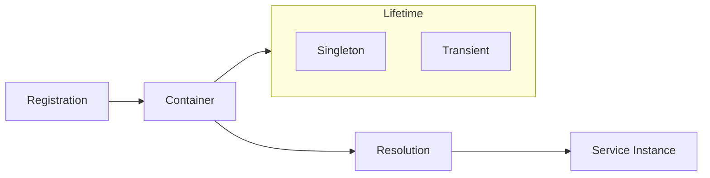

The `core/di` module provides a lightweight, performant Dependency Injection container.

---

## Overview



---

## Module Structure

```text
core/di/
├── __init__.py         # Public exports
├── container.py        # Main container
└── lazy_registry.py    # Lazy loading proxy
```

---

## Container

The `Container` manages service registration and resolution:

```python
from core.di import Container, Lifetime

# Create container
container = Container()

# Register singleton service
container.register(
    interface=LLMServiceProtocol,
    implementation=LLMService,
    lifetime=Lifetime.SINGLETON
)

# Register transient service (new instance each time)
container.register(
    interface=SessionContext,
    implementation=SessionContext,
    lifetime=Lifetime.TRANSIENT
)

# Resolve
llm = container.resolve(LLMServiceProtocol)
```

### Lifetime

| Lifetime | Behavior |
|----------|----------|
| `SINGLETON` | Single instance for entire application |
| `TRANSIENT` | New instance for each `resolve()` |

### API Reference

```python
class Container:
    def register(
        self,
       interface: Type[T],
        implementation: Type[T] | None = None,
        lifetime: Lifetime = Lifetime.SINGLETON,
        factory: Callable[[], T] | None = None,
        instance: T | None = None
    ) -> None:
        """
        Register a service.
        
        Args:
            interface: Service type/protocol
            implementation: Concrete class (optional if factory/instance)
            lifetime: SINGLETON or TRANSIENT
            factory: Factory function to create instances
            instance: Already-created instance (singleton only)
        """
    
    def resolve(self, interface: Type[T]) -> T:
        """
        Resolve a registered service.
        
        Raises:
            KeyError: If service not registered
        """
    
    def is_registered(self, interface: Type) -> bool:
        """Check if a service is registered."""
    
    async def dispose(self) -> None:
        """Release all resources."""
```

---

## Factory Registration

For complex creation logic:

```python
def create_llm_service():
    config = get_services_config()
    if config.use_local:
        return OllamaService(config.ollama_base)
    return OpenAIService(config.openai_key)

container.register(
    interface=LLMServiceProtocol,
    factory=create_llm_service,
    lifetime=Lifetime.SINGLETON
)
```

---

## Instance Registration

For already-created objects:

```python
# Singleton configuration
config = AppConfig()

container.register(
    interface=AppConfig,
    instance=config
)
```

---

## Lazy Loading

The `LazyProxy` delays creation until first access:

```python
from core.di import LazyProxy

# Service not created immediately
llm_service = LazyProxy(lambda: container.resolve(LLMService))

# First call → creation
response = await llm_service.generate("Hello")

# Subsequent calls → same instance
response2 = await llm_service.generate("World")
```

### Lazy Registry

The `LazyRegistry` extends the container with lazy support:

```python
from core.di import LazyRegistry

registry = LazyRegistry()

# Register with lazy init
registry.register_lazy(
    interface=HeavyService,
    factory=create_heavy_service
)

# Not yet created
assert not registry.is_initialized(HeavyService)

# First access → initialization
service = registry.resolve(HeavyService)
assert registry.is_initialized(HeavyService)
```

---

## Best Practices

### ✅ Do

```python
# Register interfaces, not implementations
container.register(LLMServiceProtocol, LLMService)

# Use factory for complex logic
container.register(DatabasePool, factory=create_pool)

# Resolve in constructors
class MyHandler:
    def __init__(self):
        self.llm = container.resolve(LLMServiceProtocol)
```

### ❌ Don't

```python
# Don't instantiate directly
self.llm = LLMService()  # NO!

# Don't use resolve in loops
for item in items:
    llm = container.resolve(LLMService)  # Inefficient for transient
```

---

## Plugin Integration

Plugins access services via DI:

```python
# plugins/my-plugin/handlers.py
from core.di import resolve

class MyHandler:
    def __init__(self, plugin):
        self.llm = resolve(LLMServiceProtocol)
        self.vectorstore = resolve(VectorStoreProtocol)
    
    async def handle(self, query: str, context: dict):
        # Use injected services
        embedding = await self.vectorstore.embed(query)
        response = await self.llm.generate(query)
        return response
```

---

## Thread Safety

The container is thread-safe:

```python
class Container:
    def __init__(self):
        self._lock = threading.RLock()
        self._services: dict = {}
    
    def register(self, ...):
        with self._lock:
            # Thread-safe registration
            ...
    
    def resolve(self, ...):
        with self._lock:
            # Thread-safe resolution
            ...
```

---

## Disposal

To release resources (e.g. connection pools):

```python
# Register with cleanup
container.register(
    interface=DatabasePool,
    factory=create_pool
)

# On app shutdown
await container.dispose()
```

Services implementing `async def dispose()` are called automatically.

---

## Testing

Mock services in tests:

```python
import pytest
from core.di import Container

@pytest.fixture
def container():
    c = Container()
    
    # Register mocks
    c.register(LLMServiceProtocol, instance=MockLLMService())
    c.register(VectorStoreProtocol, instance=MockVectorStore())
    
    yield c
    
    # Cleanup
    asyncio.run(c.dispose())

def test_handler(container):
    handler = MyHandler()
    # Handler uses mocks automatically
```
