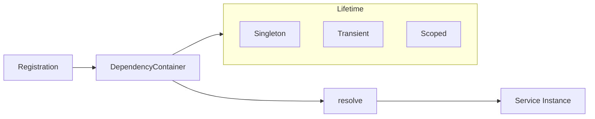

The `core/di` module provides a lightweight, performant Dependency Injection container.

---

## Overview



---

## Module Structure

```text
core/di/
├── __init__.py         # Public exports
├── container.py        # DependencyContainer, ServiceRegistry, Scope
└── lazy_registry.py    # LazyServiceRegistry for on-demand init
```

Public exports (`from core.di import ...`):

```python
from core.di import (
    DependencyContainer,
    ServiceRegistry,
    ServiceLifetime,
    ServiceNotFoundError,
    Scope,
    ScopeNotActiveError,
    LazyServiceRegistry,
    ResourceType,
    get_lazy_registry,
    reset_lazy_registry,
)
```

---

## DependencyContainer

The `DependencyContainer` manages service registration and resolution with
factory functions and three lifetimes:

```python
from core.di import DependencyContainer, ServiceLifetime

# Create container
container = DependencyContainer()

# Register a singleton service (default lifetime)
container.register(
    LLMServiceProtocol,
    lambda: LLMService(),
    ServiceLifetime.SINGLETON,
)

# Register a transient service (new instance each time)
container.register(
    SessionContext,
    lambda: SessionContext(),
    ServiceLifetime.TRANSIENT,
)

# Resolve
llm = container.resolve(LLMServiceProtocol)
```

`register` always takes a **factory callable** as its second argument. To
register an already-created object, use `register_instance`.

### ServiceLifetime

| Lifetime | Behavior |
|----------|----------|
| `SINGLETON` | Single instance for entire application (default) |
| `TRANSIENT` | New instance for each `resolve()` |
| `SCOPED` | Single instance per active `Scope` |

### API Reference

```python
class DependencyContainer:
    def register(
        self,
        interface: Type[T],
        factory: Callable[[], T],
        lifetime: ServiceLifetime = ServiceLifetime.SINGLETON,
    ) -> None:
        """Register a service with a factory function."""

    def register_instance(self, interface: Type[T], instance: T) -> None:
        """Register a service instance directly (always singleton)."""

    def create_scope(self) -> Scope:
        """Create a new dependency injection scope (context manager)."""

    def resolve(self, interface: Type[T]) -> T:
        """
        Resolve a service by its interface.

        Raises:
            ServiceNotFoundError: If the service is not registered.
            ScopeNotActiveError: If resolving a SCOPED service with no
                active scope.
        """

    def has(self, interface: Type) -> bool:
        """Check if a service is registered."""

    def clear(self) -> None:
        """Clear all registered services and singletons. Useful for testing."""
```

---

## Instance Registration

For already-created objects (always registered as a singleton):

```python
config = AppConfig()
container.register_instance(AppConfig, config)

assert container.resolve(AppConfig) is config
```

---

## Scoped Services

Scoped services are instantiated once per `Scope` and shared within it —
typically one scope per HTTP request. `Scope` works as both a sync and async
context manager:

```python
from core.di import DependencyContainer, ServiceLifetime

container = DependencyContainer()
container.register(DbSession, create_session, ServiceLifetime.SCOPED)

async with container.create_scope() as scope:
    session_a = scope.resolve(DbSession)
    session_b = scope.resolve(DbSession)
    assert session_a is session_b  # same instance within the scope

# Resolving a SCOPED service with no active scope raises ScopeNotActiveError
```

Inside an active scope, calling `container.resolve(...)` also picks up the
current scope automatically via a `ContextVar`.

---

## ServiceRegistry

`ServiceRegistry` is a simpler, global, class-level registry that stores
implementations directly (no factories or lifetimes). All methods are
classmethods:

```python
from core.di import ServiceRegistry, ServiceNotFoundError

ServiceRegistry.register(LLMServiceProtocol, LLMService())

llm = ServiceRegistry.get(LLMServiceProtocol)

assert ServiceRegistry.has(LLMServiceProtocol)

ServiceRegistry.clear()  # reset, useful for tests
```

`ServiceRegistry.get` raises `ServiceNotFoundError` when the interface is not
registered.

---

## Lazy Loading

`LazyServiceRegistry` registers **async** factory functions for heavy core
resources (LLM, vector store, databases) that are only initialized on first
use. Initialization is thread-safe and async-safe via double-checked locking.

```python
from core.di import get_lazy_registry, ResourceType

registry = get_lazy_registry()  # global singleton

async def build_vectorstore():
    return await create_vectorstore()

# Register an async factory keyed by a ResourceType or any string/type key
registry.register_factory(ResourceType.VECTORSTORE, build_vectorstore)

# Not yet created
assert not registry.is_initialized(ResourceType.VECTORSTORE)

# First access -> initialization (factory awaited once)
store = await registry.get_or_create(ResourceType.VECTORSTORE)
assert registry.is_initialized(ResourceType.VECTORSTORE)
```

`get_or_create` raises `KeyError` if no factory was registered for the key.

### ResourceType

Standard resource identifiers components can depend on:

```python
class ResourceType(str, Enum):
    LLM = "llm"
    VECTORSTORE = "vectorstore"
    GRAPH = "graph"
    POSTGRES = "postgres"
    REDIS = "redis"
    MEMORY = "memory"
    EVALUATION = "evaluation"
    EVOLUTION = "evolution"
```

### LazyServiceRegistry API

```python
class LazyServiceRegistry:
    def register_factory(
        self,
        interface: Union[Type[T], str],
        factory: Callable[[], Awaitable[T]],
    ) -> None: ...

    async def get_or_create(self, interface: Union[Type[T], str]) -> T: ...

    def is_initialized(self, interface: Union[Type, str]) -> bool: ...

    def get_initialized_services(self) -> Dict[str, bool]: ...

    async def shutdown_all(self) -> None:
        """Call shutdown()/close() on every initialized instance."""

    def clear(self) -> None: ...
```

### Lifecycle helpers

```python
from core.di import get_lazy_registry, reset_lazy_registry

registry = get_lazy_registry()       # process-wide singleton

# On shutdown: dispose every initialized service
await registry.shutdown_all()

reset_lazy_registry()                # clear + drop the global (test isolation)
```

`shutdown_all()` calls `shutdown()` (awaited) or `close()` (awaited if a
coroutine, else sync) on each initialized instance, then clears them.

---

## Best Practices

### ✅ Do

```python
# Register interfaces against factories, not concrete instantiations
container.register(LLMServiceProtocol, lambda: LLMService())

# Use LazyServiceRegistry for heavy/async resources
registry = get_lazy_registry()
registry.register_factory(ResourceType.POSTGRES, create_pg_pool)

# Resolve in constructors
class MyHandler:
    def __init__(self, container: DependencyContainer):
        self.llm = container.resolve(LLMServiceProtocol)
```

### ❌ Don't

```python
# Don't instantiate heavy services directly
self.llm = LLMService()  # NO!

# Don't resolve TRANSIENT services in tight loops
for item in items:
    llm = container.resolve(LLMService)  # creates a new instance each time
```

---

## Thread Safety

Both `DependencyContainer` and `ServiceRegistry` guard their internal state
with a `threading.Lock`. `LazyServiceRegistry` combines a `threading.Lock`
for registration with per-key `asyncio.Lock`s for initialization.

---

## Disposal

`LazyServiceRegistry.shutdown_all()` releases resources by calling
`shutdown()` or `close()` on each initialized instance:

```python
registry = get_lazy_registry()
registry.register_factory(ResourceType.POSTGRES, create_pool)

# ... application runs, pool is lazily created on first get_or_create ...

# On app shutdown
await registry.shutdown_all()
```

`DependencyContainer` has no async disposal hook; use `clear()` to drop
registrations (mainly in tests).

---

## Testing

Mock services in tests by registering instances and clearing afterwards:

```python
import pytest
from core.di import DependencyContainer, reset_lazy_registry

@pytest.fixture
def container():
    c = DependencyContainer()
    c.register_instance(LLMServiceProtocol, MockLLMService())
    c.register_instance(VectorStoreProtocol, MockVectorStore())
    yield c
    c.clear()
    reset_lazy_registry()  # isolate the global lazy registry between tests

def test_handler(container):
    handler = MyHandler(container)
    # handler resolves the mocks from the container
```
