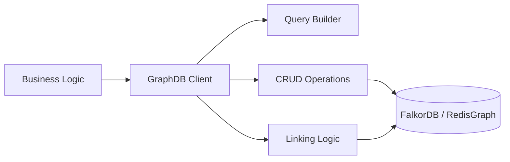

The `core/graph` module implements the second tier (L2) of the BaselithCore memory system. While Vector Memory (L3) handles semantic similarity, the Knowledge Graph models **structured relationships** between entities, allowing for complex reasoning and factual recall.

## Overview

By representing information as a graph of nodes and edges, BaselithCore can "understand" connections that are often lost in flat vector space.

**Key Capabilities**:

- **Entity Extraction**: Automatically identifies and stores people, places, organizations, and concepts.
- **Relationship Modeling**: Tracks how entities interact (e.g., "User likes Python", "Project depends on Module X").
- **FalkorDB Integration**: Uses high-performance Cypher queries for millisecond-latency traversals.
- **Subgraph Retrieval**: Extracts local context around a node to provide the LLM with relevant structural data.
- **Code Graphs**: Specialized logic for modeling software architectures (Files, Classes, Methods).

---

## Architecture



---

## Basic Usage

The `graph_db` instance is the primary interface for managing the knowledge graph.

```python
from core.graph import graph_db

# 1. Upsert a node
await graph_db.upsert_node(
    node_id="user-123",
    labels=["User"],
    properties={"name": "John", "role": "Developer"}
)

# 2. Create a relationship
await graph_db.upsert_edge(
    source_id="user-123",
    relationship="INTERESTED_IN",
    target_id="python-framework",
    properties={"level": "expert"}
)
```

### Running Cypher Queries

For complex traversals, you can execute raw Cypher queries.

```python
query = """
MATCH (u:User {id: $user_id})-[:INTERESTED_IN]->(topic)
RETURN topic.name as interest
"""
results = await graph_db.query(query, {"user_id": "user-123"})
```

---

## Specialized Modules

### Code Graph

The `code_graph` utilities allow the system to build and query a representation of the codebase.

```python
await graph_db.upsert_code_node(
    node_id="core/memory/manager.py",
    label="File",
    name="manager.py",
    file_path="core/memory/manager.py"
)
```

### Retrieval & Linking

- **Subgraph Extraction**: Use `get_document_subgraph(doc_id)` to get a visualization-ready neighborhood of a node.
- **External Issue Linking**: Integrate with Jira/GitHub via `link_node_to_external_issue`.

---

## Multi-Tier Integration

The Graph (L2) works in tandem with:

1. **L1 (Short-term)**: Recent entities from L1 are persisted in L2 for long-term tracking.
2. **L3 (Vector)**: Nodes in L2 can also exist as embeddings in L3, allowing for hybrid "Graph-RAG" searches.

---

## Multi-Tenant Isolation

The GraphDB module implements strict logical isolation for multi-tenant deployments.

1. **Automatic Injection**: The `GraphDb.query` method automatically retrieves the `tenant_id` from the current context and injects it into every Cypher query as a `$tenant_id` parameter.
2. **Property Enforcement**: All high-level operations (e.g., `upsert_node`, `upsert_edge`) automatically include and filter by `tenant_id` in their `MATCH` and `MERGE` clauses.
3. **Data Segregation**: Information from different tenants is stored within the same physical graph but is partitioned by the `tenant_id` property, ensuring that queries from one tenant can never "see" or interact with nodes of another.

!!! warning "Raw Cypher"
    When writing custom Cypher queries via `graph_db.query()`, you **must** include `{tenant_id: $tenant_id}` in your node patterns to ensure isolation is maintained.

---

## Configuration

| Variable           | Default                  | Description                          |
| ------------------ | ------------------------ | ------------------------------------ |
| `GRAPH_DB_ENABLED` | `true`                   | Global toggle for the graph system   |
| `GRAPH_DB_URL`     | `redis://localhost:6379` | Connection URL (FalkorDB compatible) |
| `GRAPH_DB_NAME`    | `baselith_graph`         | The name of the graph in Redis       |
| `GRAPH_CACHE_TTL`  | `3600`                   | TTL for recursive query results      |

---

## Best Practices

!!! tip "Idempotency"
    Use `upsert_node` and `upsert_edge` instead of raw `CREATE` queries to ensure your graph operations are idempotent and don't create duplicate entities.

!!! warning "Constraint Creation"
    Call `graph_db.create_constraints()` at least once during application initialization to ensure performance and data integrity (especially for unique IDs).
