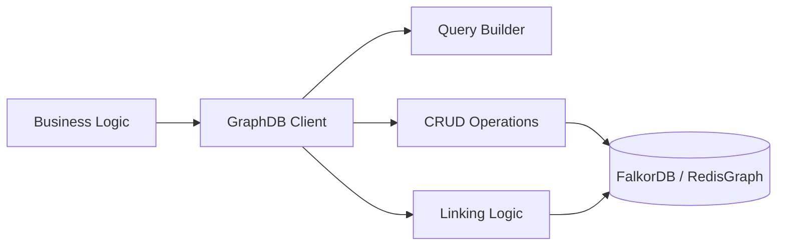

The `core/graph` module implements the second tier (L2) of the BaselithCore memory system. While Vector Memory (L3) handles semantic similarity, the Knowledge Graph models **structured relationships** between entities, allowing for complex reasoning and factual recall.

## Overview

By representing information as a graph of nodes and edges, BaselithCore can "understand" connections that are often lost in flat vector space.

**Key Capabilities**:

- **Entity Extraction**: Automatically identifies and stores people, places, organizations, and concepts.
- **Relationship Modeling**: Tracks how entities interact (e.g., "User likes Python", "Project depends on Module X").
- **FalkorDB Integration**: Uses high-performance Cypher queries for millisecond-latency traversals.
- **Subgraph Retrieval**: Extracts local context around a node to provide the LLM with relevant structural data.
- **Code Graphs**: Specialized logic for modeling software architectures (Files, Classes, Methods).

---

## Architecture


```mermaid
graph LR
    Logic[Business Logic] --> GDB[GraphDB Client]
    GDB --> QB[Query Builder]
    GDB --> OP[CRUD Operations]
    GDB --> LK[Linking Logic]

    OP --> Falkor[(FalkorDB / RedisGraph)]
    LK --> Falkor
```

---

## Basic Usage

The `graph_db` singleton (`core.graph.GraphDb`) is the primary interface for
managing the knowledge graph. It is a **synchronous** client over redis-py —
none of its methods are coroutines — and it is lazy: no connection is opened
until the first call. When `GRAPH_DB_ENABLED` is off every method is a no-op
that returns `None`, `[]`, `0` or `False`.

```python
from core.graph import graph_db

# 1. Upsert a node
graph_db.upsert_node(
    "user-123",
    labels=["User"],
    properties={"name": "John", "role": "Developer"},
)

# 2. Create a relationship
graph_db.upsert_edge(
    "user-123",
    "INTERESTED_IN",
    "python-framework",
    properties={"level": "expert"},
)

# 3. Read it back
graph_db.get_node("user-123")          # -> {"name": "John", ...} or None
```

### Running Cypher Queries

For complex traversals, you can execute raw Cypher queries.

```python
query = """
MATCH (u:User {id: $user_id, tenant_id: $tenant_id})-[:INTERESTED_IN]->(topic)
RETURN topic.name as interest
"""
rows = graph_db.query_decoded(query, {"user_id": "user-123"})
```

`query()` returns the raw `--compact` payload (property keys arrive as numeric
ids) and is kept for legacy callers; `query_decoded()` goes through redis-py's
graph module and yields typed `Node`/`Edge` objects (with `.properties`) and
plain scalars. Both inject `$tenant_id` from the bound context and cache
read-only results for `GRAPH_CACHE_TTL` seconds, under separate key spaces.

### `graph_db` API

| Method | Purpose |
| ------ | ------- |
| `is_enabled()` | Whether the graph is enabled (`GRAPH_DB_ENABLED`). |
| `ping()` | Backend reachability without altering state; `False` when disabled or unreachable. |
| `create_constraints()` | Idempotent uniqueness constraints (currently `Document.id`). |
| `query(cypher, params=None)` | Raw Cypher execution, tenant-injected, cached. |
| `query_decoded(cypher, params=None)` | Same, returning decoded rows. |
| `get_node(node_id)` | Node properties dict, or `None`. |
| `upsert_node(node_id, *, labels=None, properties=None)` | Create or merge a node by stable id. |
| `upsert_edge(source_id, relationship, target_id, *, properties=None)` | Create or merge a directed relationship. |
| `delete_node(node_id)` | Delete a node and its incident relationships. |
| `delete_orphan_nodes()` | Delete relationship-less nodes (never `Document`); returns the count. |
| `get_document_subgraph(doc_id)` | `{"nodes": [...], "links": [...]}` neighbourhood for visualisation. |
| `search_node(prop, value)` | Node id whose property matches, or `None`. |
| `record_document_feedback(document_id, feedback, comment=None)` | Feedback counters on a `Document` node. |
| `upsert_code_node(node_id, label, name, file_path, *, properties=None)` | Code entity (`File`, `Class`, `Function`). |
| `upsert_code_relation(source_id, relation_type, target_id)` | Relationship between code entities (`DEFINES`, `CONTAINS`, ...). |
| `close()` | Close the underlying Redis connection. |

---

## Specialized Modules

### Code Graph

The `code_graph` utilities allow the system to build and query a representation of the codebase.

```python
graph_db.upsert_code_node(
    "core/memory/manager.py",
    "File",
    "manager.py",
    "core/memory/manager.py",
)
graph_db.upsert_code_node(
    "core/memory/manager.py::MemoryManager",
    "Class",
    "MemoryManager",
    "core/memory/manager.py",
)
graph_db.upsert_code_relation(
    "core/memory/manager.py", "DEFINES", "core/memory/manager.py::MemoryManager"
)
```

### Retrieval & Linking

- **Subgraph Extraction**: `get_document_subgraph(doc_id)` returns a
  visualisation-ready neighbourhood of a node; `search_node(prop, value)`
  resolves a node id from a property such as `path` or `name`.
- **Document Feedback**: `record_document_feedback(document_id, feedback,
  comment=None)` (`core/graph/linking.py`) merges a `Document` node and bumps
  `feedback_total`, `feedback_positive` / `feedback_negative` (for
  `"positive"` / `"negative"`), `last_feedback_at`, and
  `last_feedback_comment` (truncated to 500 characters).

---

## Multi-Tier Integration

The Graph (L2) works in tandem with:

1. **L1 (Short-term)**: Recent entities from L1 are persisted in L2 for long-term tracking.
2. **L3 (Vector)**: Nodes in L2 can also exist as embeddings in L3, allowing for hybrid "Graph-RAG" searches.

---

## Multi-Tenant Isolation

The GraphDB module implements strict logical isolation for multi-tenant deployments.

1. **Automatic Injection**: The `GraphDb.query` method automatically retrieves the `tenant_id` from the current context and injects it into every Cypher query as a `$tenant_id` parameter.
2. **Property Enforcement**: All high-level operations (e.g., `upsert_node`, `upsert_edge`) automatically include and filter by `tenant_id` in their `MATCH` and `MERGE` clauses.
3. **Data Segregation**: Information from different tenants is stored within the same physical graph but is partitioned by the `tenant_id` property, ensuring that queries from one tenant can never "see" or interact with nodes of another.

!!! warning "Raw Cypher"
    When writing custom Cypher queries via `graph_db.query()`, you **must** include `{tenant_id: $tenant_id}` in your node patterns to ensure isolation is maintained.

---

## Configuration

| Variable           | Default                  | Description                                    |
| ------------------ | ------------------------ | ---------------------------------------------- |
| `GRAPH_DB_ENABLED` | `true`                   | Global toggle for the graph system             |
| `GRAPH_DB_URL`     | `redis://localhost:6379` | Connection URL (FalkorDB compatible)           |
| `GRAPH_DB_NAME`    | `agent_graph`            | The name of the graph in Redis                 |
| `GRAPH_DB_TIMEOUT` | `2.0`                    | Redis socket timeout in seconds (minimum 0.1)  |
| `GRAPH_CACHE_TTL`  | `3600`                   | TTL in seconds for cached read-only results    |

Defaults come from `core/config/storage.py`; `.env.example` ships the same
values, so a deployment built from it starts with the graph on and pointed at
the local FalkorDB/Redis instance.

---

## Best Practices

!!! tip "Idempotency"
    Use `upsert_node` and `upsert_edge` instead of raw `CREATE` queries to ensure your graph operations are idempotent and don't create duplicate entities.

!!! warning "Constraint Creation"
    Call `graph_db.create_constraints()` at least once during application initialization to ensure performance and data integrity (especially for unique IDs).
