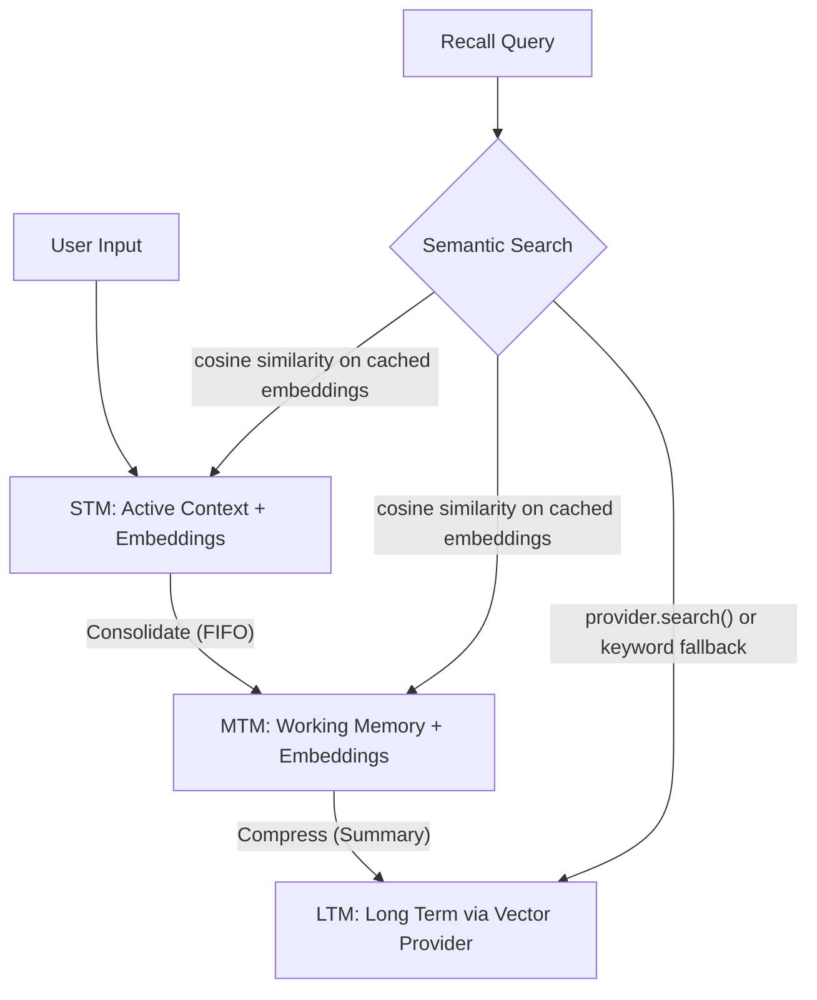

## Overview

The `HierarchicalMemory` module enables agents to manage context efficiently over long lifetimes using a biological-inspired three-tier architecture. This system automatically moves information between Short-Term Memory (STM), Medium-Term Memory (MTM), and Long-Term Memory (LTM) based on capacity and relevance.

**Key Features**:

- **Automatic Consolidation**: Moves items from STM to MTM when capacity is reached
- **Intelligent Compression**: Summarizes MTM items into LTM using LLMs
- **Cross-Tier Recall**: Retrieves information from all three tiers with a single query
- **Semantic Search**: STM and MTM use in-memory embedding cache for fast vector similarity; LTM delegates to the vector provider (Qdrant) with keyword fallback
- **Context Folding**: Prioritizes recent context while keeping relevant summary history

## Architecture

The system mimics human memory processes:

1. **STM (Short-Term Memory)**: High-resolution buffer for immediate interaction. Embeddings are cached in-memory alongside items for fast semantic search.
2. **MTM (Medium-Term Memory)**: Working memory for ongoing tasks and recent history. Embeddings are cached in-memory, with keyword fallback when no embedder is available.
3. **LTM (Long-Term Memory)**: Compressed, semantic storage for lifetime knowledge. Uses the vector provider (e.g. Qdrant) for search when available, falling back to keyword matching on an in-memory cache.



All similarity computations use the shared `core.utils.similarity.cosine_similarity` (numpy-based).

## Usage

### Initialization

The easiest way to partialy initialize the memory is via the lazy factory:

```python
from core.bootstrap.lazy_init import initialize_hierarchical_memory

memory = await initialize_hierarchical_memory()
```

### Adding Memories

```python
from core.memory.hierarchy import MemoryTier

# Add to Short-Term Memory (default)
await memory.add("User asked for better performance", tier=MemoryTier.STM)

# Add critical fact directly to Long-Term Memory
await memory.add(
    "User ID is 12345", 
    tier=MemoryTier.LTM, 
    importance=1.0
)
```

### Recalling Information

Retrieve relevant context from all tiers:

```python
results = await memory.recall("performance optimization", limit=5)

for item in results:
    print(f"[{item.metadata['tier']}] {item.content}")
```

### Generating Context for LLM

Get a formatted context string optimized for LLM prompts:

```python
context_str = memory.get_context(max_tokens=2000)
# Returns:
# ## Recent Context
# - User asked for better performance
# ...
# ## Long-term Knowledge
# - [Summary] Previous discussions focused on database latency...
```

## Configuration

Configure the hierarchy via `HierarchyConfig`:

```python
from core.memory.hierarchy import HierarchyConfig, TierConfig

config = HierarchyConfig(
    stm=TierConfig(max_items=10),
    mtm=TierConfig(max_items=20),
    auto_consolidate=True
)
```

| Setting            | Default | Description                                   |
| ------------------ | ------- | --------------------------------------------- |
| `stm.max_items`    | 10      | Max items in STM before consolidation         |
| `mtm.max_items`    | 20      | Max items in MTM before compression           |
| `auto_consolidate` | True    | Automatically move items when limits exceeded |

## Advanced Operations

### Manual Consolidation

Force migration of items from STM to MTM:

```python
# Move 5 oldest items from STM to MTM
count = await memory.consolidate_stm(items_to_migrate=5)
```

### Manual Compression

Force compression of MTM into LTM summaries:

```python
# Compress MTM until only 10 items remain
count = await memory.compress_mtm(target_count=10)
```

## Search Internals

Each tier uses a different search strategy:

| Tier    | Strategy                                       | Fallback                            |
| ------- | ---------------------------------------------- | ----------------------------------- |
| **STM** | Cosine similarity on in-memory embedding cache | Keyword matching                    |
| **MTM** | Cosine similarity on in-memory embedding cache | Keyword matching                    |
| **LTM** | `provider.search()` (vector DB, e.g. Qdrant)   | Keyword matching on in-memory cache |

When an embedder is available, `add()` automatically caches the embedding alongside the memory item in STM and MTM. This avoids re-computing embeddings at recall time and enables sub-millisecond semantic search on in-memory tiers.
