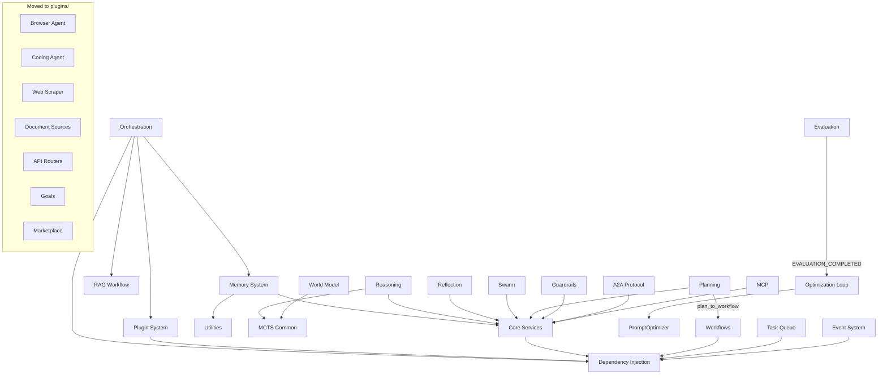

<!-- markdownlint-disable-file MD025 -->

---

## Module Categories

### Infrastructure

| Module                    | Description                                                      | Path                                             |
| ------------------------- | ---------------------------------------------------------------- | ------------------------------------------------ |
| **Dependency Injection**  | Service container and lifecycle management                       | [`core/di/`](di.md)                              |
| **Configuration**         | Centralized configuration with Pydantic                          | [`core/config/`](config.md)                      |
| **Middleware & Auth**     | Pure-ASGI middleware stack and auth dependencies                 | [`core/middleware/`](middleware.md)              |
| **Domain Models**         | Chat/domain models plus pricing, routing, and fallback           | [`core/models/`](models.md)                      |
| **Resilience**            | Circuit breakers, retry policies, bulkheads                      | [`core/resilience/`](resilience.md)              |
| **Registries & Errors**   | Generic thread-safe registry base and the exception hierarchy    | [`core/registries/`](registries.md)              |
| **Event System**          | Internal pub/sub for observability                               | [`core/events/`](events.md)                      |
| **Authentication & Auth** | Identity and access control management                           | [`core/auth/`](auth.md)                          |
| **Webhooks**              | Signed, retried, dead-lettered outbound event delivery           | [`core/webhooks/`](webhooks.md)                  |
| **Observability**         | Telemetry, tracing, and metric collection                        | [`core/observability/`](observability-module.md) |
| **NLP Utilities**         | Natural Language Processing tools and extractors                 | [`core/nlp/`](nlp.md)                            |
| **Caching System**        | Distributed cache management (Redis/memory)                      | [`core/cache/`](cache.md)                        |
| **Lifecycle Management**  | App and agent lifecycle coordination                             | [`core/lifecycle/`](lifecycle.md)                |
| **Real-time PubSub**      | Event-driven communication via Redis                             | [`core/realtime/`](realtime.md)                  |
| **Utilities**             | Shared cosine similarity (numpy) and token estimation (tiktoken) | `core/utils/`                                    |

### Orchestration & Execution

| Module             | Description                                                          | Path                                        |
| ------------------ | -------------------------------------------------------------------- | ------------------------------------------- |
| **Orchestration**  | Intent classification, flow routing, RAG workflow handler            | [`core/orchestration/`](orchestration.md)   |
| **Prioritization** | Priority resolution logic for orchestration and flow routing         | [`core/prioritization/`](prioritization.md) |
| **Workflows**      | Workflow builder, safe expression executor, plan-to-workflow adapter | [`core/workflows/`](workflows.md)           |
| **Planning**       | Goal decomposition, dependency-aware step plans, budget constraints  | [`core/planning/`](planning.md)             |
| **Plugin System**  | Plugin discovery and lifecycle                                       | [`core/plugins/`](plugins.md)               |
| **Task Queue**     | Distributed task scheduling with RQ                                  | [`core/task_queue/`](task-queue.md)         |
| **Chat & RAG**     | RAG-enabled chat workflows and historical context management         | [`core/chat/`](chat.md)                     |
| **Prompt Registry** | Versioned prompt templates with labels, A/B selection, and tracing  | [`core/prompts/`](prompts.md)               |

### Memory & Knowledge

| Module                  | Description                                     | Path                                                 |
| ----------------------- | ----------------------------------------------- | ---------------------------------------------------- |
| **Memory System**       | Multi-tier memory (Context, Graph, Vector)      | [`core/memory/`](memory.md)                          |
| **Hierarchical Memory** | Efficient STM/MTM/LTM context management        | [`core/memory/hierarchy.py`](hierarchical-memory.md) |
| **Knowledge Graph**     | L2 Structured entity relationships via FalkorDB | [`core/graph/`](graph.md)                            |
| **Services**            | LLM, VectorStore, Vision, Indexing, HITL        | [`core/services/`](services.md)                      |
| **Storage Layer**       | Persistent volume and blob storage              | [`core/storage/`](storage.md)                        |
| **Database Layer**      | Relational database abstractions                | [`core/db/`](db.md)                                  |

### Agentic Intelligence & Reasoning

| Module                 | Description                                                | Path                                |
| ---------------------- | ---------------------------------------------------------- | ----------------------------------- |
| **Reasoning**          | Chain/Tree-of-Thought reasoning with shared MCTS utilities | [`core/reasoning/`](reasoning.md)   |
| **Reflection**         | Self-evaluation and refinement                             | [`core/reflection/`](reflection.md) |
| **Swarm Intelligence** | Multi-agent coordination with batch parallel execution     | [`core/swarm/`](swarm.md)           |
| **Guardrails**         | Input/output protection                                    | [`core/guardrails/`](guardrails.md) |

### Official Plugin Capabilities

These capabilities are part of the framework ecosystem, but their canonical implementation now lives in official plugins rather than the Sacred Core.

| Capability                | Description                                              | Path                                   |
| ------------------------- | -------------------------------------------------------- | -------------------------------------- |
| **Agent Plugins**         | Browser and coding agents with compatibility shims in `plugins/browser_agent/` and `plugins/coding_agent/` | [`Agent Plugins`](agents.md) |
| **Web Scraper Plugin**    | High-performance HTTpx/Playwright crawler in `plugins/web_scraper/` | [`Web Scraper`](scraper.md)   |
| **Document Sources**      | Readers, OCR backends, and ingestion adapters            | `plugins/document_sources/`            |
| **API Router Plugins**    | Application routers such as chat, feedback, and admin    | `plugins/api_routers/`                 |

### World & Exploration

| Module          | Description                                            | Path                                  |
| --------------- | ------------------------------------------------------ | ------------------------------------- |
| **World Model** | Internal representation and prediction of world state  | [`core/world_model/`](world-model.md) |
| **Exploration** | Autonomous information exploration and discovery       | [`core/exploration/`](exploration.md) |
| **Adversarial** | Adversarial scenario simulation and robustness testing | [`core/adversarial/`](adversarial.md) |

### Identity & Meta

| Module         | Description                                                           | Path                            |
| -------------- | --------------------------------------------------------------------- | ------------------------------- |
| **Personas**   | Configurable personalities and traits for agents                      | [`core/personas/`](personas.md) |
| **Meta-Agent** | Agent coordinating other agents and running multi-perspective debates | [`core/meta/`](meta.md)         |

### Learning & Evaluation

| Module                | Description                                                 | Path                                    |
| --------------------- | ----------------------------------------------------------- | --------------------------------------- |
| **Evaluation**        | LLM response quality evaluation via RAG metrics             | [`core/evaluation/`](evaluation.md)     |
| **Learning Loop**     | Continuous learning and evolutionary improvement of prompts | [`core/learning/`](learning.md)         |
| **Optimization Loop** | Feedback-driven automated prompt tuning                     | [`core/optimization/`](optimization.md) |
| **Auto Fine-Tuning**  | Automatic fine-tuning based on feedback and experiences     | [`core/finetuning/`](finetuning.md)     |

### Social & Integration

| Module                | Description                                             | Path                      |
| --------------------- | ------------------------------------------------------- | ------------------------- |
| **A2A Protocol**      | Agent-to-agent communication                            | [`core/a2a/`](a2a.md)             |
| **MCP Integration**   | Model Context Protocol for tools                        | [`core/mcp/`](mcp.md)             |
| **Human-in-the-Loop** | Human intervention for critical decisions and approvals | [`core/human/`](human.md)         |
| **Marketplace**       | Plugin discovery, install, validation, and publishing   | [`core/marketplace/`](marketplace.md) |

---

## Module Dependencies

---

## Design Principles

Each core module follows these principles:

### 1. Single Responsibility

Each module has one clear responsibility and doesn't overlap with others.

### 2. Protocol-Based Interfaces

All modules define `Protocol` interfaces for decoupling and testability.

### 3. Async-First

All I/O operations are asynchronous by default.

### 4. Dependency Injection

Modules receive dependencies via DI, never instantiate them directly.

### 5. Observability

All modules emit structured events for monitoring and debugging.

---

## Quick Navigation

Looking for something specific?

- **Getting Started**: [Dependency Injection](di.md) and [Configuration](config.md)
- **Request Handling**: [Orchestration](orchestration.md) and [Memory](memory.md)
- **Advanced AI**: [Reasoning](reasoning.md), [Reflection](reflection.md), [Swarm](swarm.md)
- **Integration**: [A2A Protocol](a2a.md), [MCP](mcp.md)
- **Operations**: [Task Queue](task-queue.md), [Resilience](resilience.md)
