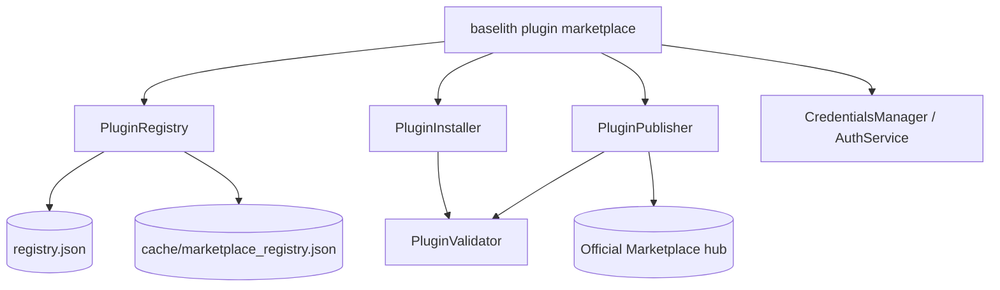

The `core/marketplace` module is the discovery and management engine for
framework extensions. It powers the `baselith plugin marketplace` CLI:
searching and listing the remote registry, installing plugins from Git over
HTTPS, validating downloaded directories, and publishing a local plugin to the
official hub.

## Overview



### Module structure

```text
core/marketplace/
├── __init__.py       # Public exports
├── models.py         # MarketplacePlugin, PluginCategory, PluginStatus, RegistryData, PluginReview
├── registry.py       # PluginRegistry — discovery + caching
├── installer.py      # PluginInstaller — HTTPS-only Git clone install/uninstall
├── validator.py      # PluginValidator — structure/manifest checks
├── publisher.py      # PluginPublisher — zip + submit to the hub
└── auth.py           # CredentialsManager + AuthService (CLI credentials)
```

!!! note "Configuration lives in `core/config`"
    The marketplace has no `client.py`/`config.py` of its own. All URLs and
    cache TTLs come from `PluginConfig` (`core/config/plugins.py`), accessed
    via `get_plugin_config()`.

---

## Public API

Exported from `core.marketplace`:

```python
from core.marketplace import (
    PluginRegistry,
    MarketplacePlugin,
    PluginCategory,
    PluginStatus,
    PluginInstaller,
    InstallResult,
    InstallStatus,
    PluginValidator,
    ValidationResult,
    ValidationIssue,
)
```

`PluginPublisher` lives in `core.marketplace.publisher`; `CredentialsManager`
and `AuthService` live in `core.marketplace.auth`.

---

## Data models

`core/marketplace/models.py` defines the Pydantic models exchanged with the
registry.

### `MarketplacePlugin`

Metadata for a single plugin in the registry.

| Field | Type | Notes |
| ----- | ---- | ----- |
| `id` | `str` | Unique id (e.g. `org.plugin`) |
| `name` | `str` | Display name |
| `version` | `str` | Semantic version |
| `description` | `str \| None` | |
| `author` | `str \| None` | Defaults to `"unknown"` |
| `category` | `PluginCategory` | Defaults to `OTHER` |
| `status` | `PluginStatus` | Defaults to `AVAILABLE` |
| `downloads`, `stars`, `rating`, `rating_count` | numeric | Registry stats |
| `git_url` | `str \| None` | Aliased from `repository`; used for install |
| `homepage`, `license`, `tags` | | `license` defaults to `AGPL-3.0` |
| `dependencies`, `python_requires`, `plugin_dependencies` | | `plugin_dependencies` accepts list or dict shapes |
| `min_framework_version` | `str` | Defaults to `2.0.0` |

### Enums

- **`PluginCategory`**: `ALL`, `AGENT`, `TOOL`, `SECURITY`, `UTILITY`,
  `ANALYSIS`, `INTEGRATION`, `WORKFLOW`, `UI`, `OTHER`.
- **`PluginStatus`**: `AVAILABLE`, `INSTALLED`, `DISABLED`, `DEPRECATED`,
  `STABLE`, `BETA`.

### `RegistryData` & `PluginReview`

`RegistryData` is the top-level registry JSON shape (`version`,
`last_updated`, `plugins: list[MarketplacePlugin]`, optional `categories`).
`PluginReview` models a user review (`rating` 1–5, `title`, `content`).

---

## PluginRegistry

`core/marketplace/registry.py` — the discovery client. Fetches and caches the
remote registry, then provides listing and search.

```python
from core.marketplace import PluginRegistry, PluginCategory

registry = PluginRegistry()

# List everything, optionally filtered by category
plugins = await registry.list_plugins(category=PluginCategory.AGENT)

# Fetch one plugin by id
plugin = await registry.get_plugin("org.example")

# Weighted text search (name > id > description > tags)
results = await registry.search(query="scraper", force=False)
```

### Caching

- `fetch(force=False)` returns in-memory data, then the on-disk cache
  (`cache/marketplace_registry.json`) if it is fresher than
  `registry_cache_ttl` (default 3600s), then the remote URL.
- `file://` registry URLs are supported for testing/air-gapped use.
- On a failed remote fetch, the registry falls back to an existing (even
  expired) cache before raising `RuntimeError`.

---

## PluginInstaller

`core/marketplace/installer.py` — installs and removes plugins on disk.

```python
from core.marketplace import PluginInstaller

installer = PluginInstaller()
result = await installer.install(plugin, branch="main")
if result.status is InstallStatus.SUCCESS:
    print("Installed to", result.destination)

await installer.uninstall("example-plugin")
```

`install()` returns an `InstallResult` (`status`, `plugin_id`, `destination`,
`error`) with status drawn from `InstallStatus` (`SUCCESS`, `FAILED`,
`ALREADY_INSTALLED`, `VALIDATION_ERROR`).

### Install flow & hardening

1. **HTTPS-only Git URLs.** `_validate_git_url()` rejects any scheme other than
   `https`, URLs that embed credentials, or URLs without a host.
2. **Path containment.** `_resolve_plugin_dir()` treats the plugin name as a
   single directory segment and resolves it inside the configured plugins root,
   rejecting absolute paths and `..` traversal.
3. **Shallow clone.** `git clone --depth 1 -b <branch>` into the destination,
   then the `.git` directory is removed.
4. **Dependencies.** If the cloned plugin has a `pyproject.toml`, its
   dependencies are installed via `pip install`. A failed install rolls back the
   directory.

`uninstall()` attempts a `pip uninstall` then removes the directory (with the
same path-containment guard).

---

## PluginValidator

`core/marketplace/validator.py` — validates a plugin directory's structure and
manifest before install/publish.

```python
from pathlib import Path
from core.marketplace import PluginValidator

result = PluginValidator().validate(Path("plugins/example-plugin"))
if not result.is_valid:
    for issue in result.errors:
        print(issue.level, issue.message)
```

`validate()` returns a `ValidationResult` (`is_valid`, `issues`, `metadata`)
exposing `.errors` and `.warnings` helpers over a list of `ValidationIssue`
(`level`, `message`, optional `file`).

Checks performed:

- **Errors**: missing `__init__.py`; missing both `manifest.yaml` and
  `pyproject.toml`; unparseable manifest; manifest without a `name`.
- **Warnings**: an incomplete manifest for marketplace indexing; a missing
  `router.py` (no API exposure).

When a valid manifest is present, its fields are extracted into a
`MarketplacePlugin` and returned as `result.metadata`.

---

## PluginPublisher

`core/marketplace/publisher.py` — packages a local plugin and submits it to the
official marketplace hub.

```python
from core.marketplace.publisher import PluginPublisher

publisher = PluginPublisher()
result = await publisher.publish(
    plugin_path="plugins/example-plugin",
    auth_token="<jwt>",        # or admin_key="<legacy key>"
)
```

Publish flow:

1. **Validate** the directory with `PluginValidator`; abort on errors.
2. **Compute the integrity hash** over the executable surface
   (`core.plugins.integrity.compute_plugin_hash`) and inject it into the
   manifest that ships in the archive.
3. **Zip** the directory, excluding dev-only trees (`__pycache__`,
   `node_modules`, `.ruff_cache`, `.mypy_cache`, `.pytest_cache`, `build`,
   `dist`, `*.egg-info`, dotfiles, UI sources under `ui/src/`). Only compiled
   `ui/dist/` ships.
4. **Submit** the archive to `/api/marketplace/plugins/submit` on the hub, using
   a Bearer `auth_token` or a legacy `admin_key`.

!!! warning "Publishing is locked to the official hub"
    `PluginPublisher` always uses `PluginConfig.OFFICIAL_MARKETPLACE_URL` for
    submission. The `registry_url` override is ignored for the submit endpoint
    to prevent redirection to a rogue registry. There is **no** Ed25519
    publisher-signing step — integrity is a SHA-256 hash injected into the
    manifest and verified by the loader.

---

## Authentication

`core/marketplace/auth.py` manages CLI credentials and remote identity
verification.

### `CredentialsManager`

Stores credentials in `~/.baselith/credentials.json` with restrictive
permissions (directory `0700`, file `0600`).

```python
from core.marketplace.auth import CredentialsManager

mgr = CredentialsManager()
await mgr.save_token(jwt, user_data={"email": "me@example.com"})
token = await mgr.load_token()
await mgr.save_api_key(api_key)
await mgr.delete_credentials()
```

`verify_token()` calls the Identity Provider's `/api/auth/verify` with the
Bearer token and returns the user profile or an error dict.

### `AuthService`

Higher-level helper over `CredentialsManager`:

- `get_current_identity()` — loads the saved token and verifies it.
- `sync_user_profile()` — verifies the token and caches the user profile.

---

## Configuration

Marketplace URLs and cache behaviour come from `PluginConfig`
(`core/config/plugins.py`, env prefix `PLUGIN_`):

| Setting | Env var(s) | Default |
| ------- | ---------- | ------- |
| Official hub URL (publishing) | `OFFICIAL_MARKETPLACE_URL` (hardcoded source of truth) | `https://marketplace.baselithcore.xyz` |
| Registry URL (discovery/install) | `MARKETPLACE_CENTRAL_URL`, `PLUGIN_REGISTRY_URL`, `REGISTRY_URL` | `…/api/marketplace/plugins/registry.json` |
| Auth/IdP URL | `MARKETPLACE_AUTH_URL`, `PLUGIN_AUTH_URL`, `AUTH_URL` | `https://marketplace.baselithcore.xyz` |
| Registry cache TTL (seconds) | — | `3600` |
| Plugins install directory | `PLUGIN_PLUGINS_PATH` | `plugins` |

The registry/auth URLs may be overridden (e.g. for local mirrors), but the
publish endpoint always targets `OFFICIAL_MARKETPLACE_URL`.

!!! tip "`MARKETPLACE_API_KEY`"
    The `baselith plugin marketplace publish` command reads an API key from the
    `--key` flag, the saved login credentials, or the `MARKETPLACE_API_KEY`
    environment variable. It is consumed by the CLI publish flow rather than
    being a field on `PluginConfig`.
