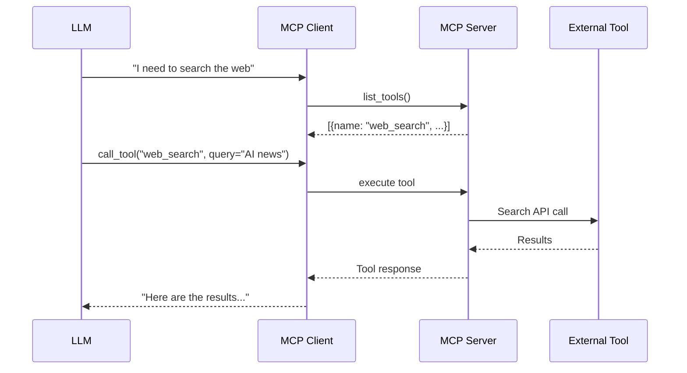
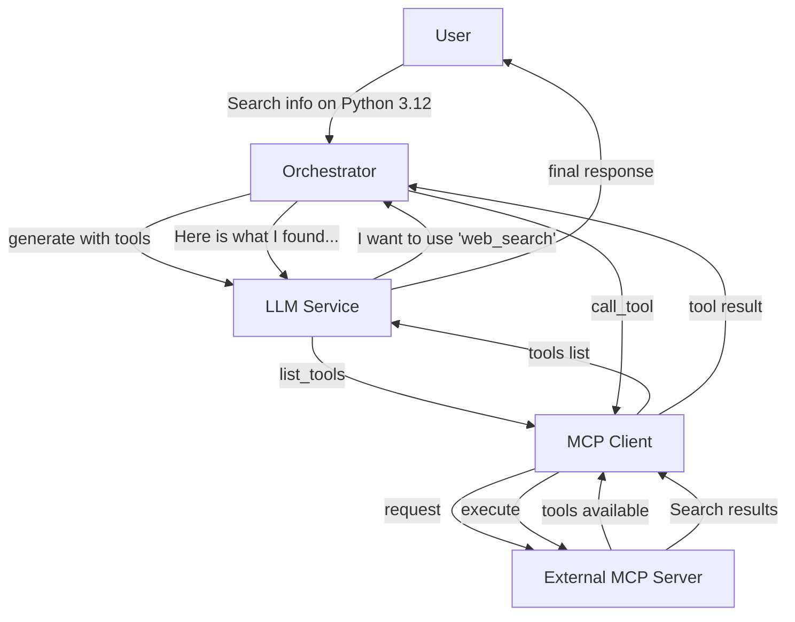

The `core/mcp` module implements the **Model Context Protocol** (MCP) to dynamically extend agent capabilities with external tools.

## What is MCP

The **Model Context Protocol** is an open standard for connecting LLMs to external data sources and tools in a secure and structured way.

### Problem Solved

LLMs are limited to:

- Static knowledge (training cutoff date)
- Inability to interact with external systems
- No access to real-time data

**Solution**: MCP allows LLMs to "call" external tools (APIs, databases, calculators, browsers) during generation.

### How It Works



### Benefits

**Extensibility**: Add new tools without model retraining

**Security**: Tools executed server-side with access control

**Standardization**: Common protocol across providers (OpenAI, Anthropic, etc.)

**Hot-Swappable**: Enable/disable tools without restart

---

## Structure

```plaintext
core/mcp/
├── __init__.py
├── client.py         # MCP Client (consume tools)
├── server.py         # MCP Server (expose tools)
├── handlers.py       # Request handlers
├── tools.py          # Tool definitions
└── types.py          # MCP Types
```

### Client vs Server: When to Use

| Component      | Role                                 | When to Use                                                           |
| -------------- | ------------------------------------ | --------------------------------------------------------------------- |
| **MCP Client** | Consumes tools from external servers | Your agent needs external capabilities (web search, database queries) |
| **MCP Server** | Exposes tools to LLM models          | You want to make your functionalities available to agents/LLMs        |

**Practical Example**:

- **Client**: Your RAG system uses an MCP server that exposes a "semantic_search" tool
- **Server**: You expose your vector store as an MCP tool for other systems

!!! tip "Both Together"
    A system can be both a client (consuming tools) and a server (exposing them). Common in baselith-core architectures.

---

## MCP Client

Connect to external MCP servers:

```python
from core.mcp import MCPClient

client = MCPClient(server_url="http://localhost:3000")

# List available tools
tools = await client.list_tools()

# Execute tool
result = await client.call_tool(
    name="web_search",
    arguments={"query": "AI trends 2024"}
)
```

---

## MCP Server

Expose tools to LLM models:

```python
from core.mcp import MCPServer, Tool

server = MCPServer()

@server.tool(
    name="calculate",
    description="Executes mathematical calculations",
    parameters={
        "expression": {"type": "string", "description": "Mathematical expression"}
    }
)
async def calculate(expression: str) -> str:
    result = eval(expression)  # Use sandbox in production!
    return str(result)

await server.start(port=3000)
```

---

## Documentation MCP Server

BaselithCore provides a specialized MCP Server to explore and search the documentation directly from your agentic IDE (e.g., Claude Desktop, Cursor, etc.).

### Connection Instructions

To connect to the Documentation MCP Server, you can use our interactive **MCP Wizard** or manually add the configuration.

<div class="mcp-wizard-container" style="margin: 2rem 0; text-align: center;">
  <a href="#" class="md-button md-button--mcp" style="padding: 0.8rem 2rem; font-size: 1rem;">
    <span class="twemoji">
      <svg xmlns="http://www.w3.org/2000/svg" viewBox="0 0 24 24"><path d="M12 2L4.5 20.29l.71.71L12 18l6.79 3 .71-.71L12 2z"/></path></svg>
    </span>
    <b>Open MCP Setup Wizard</b>
  </a>
</div>

Manually add the following configuration to your MCP client (STDIO transport):

```json
{
  "mcpServers": {
    "baselith-docs": {
      "command": "python",
      "args": ["-m", "mcp.main"],
      "env": {
        "PYTHONPATH": "/path/to/baselith-core/mkdocs-site"
      }
    }
  }
}
```

!!! note
    Replace `/path/to/baselith-core` with the absolute path to your local repository.

### Available Tools

- `search_docs`: Search the documentation using keywords or phrases.
- `list_docs`: List all available documentation pages.
- `get_doc_page`: Retrieve the full markdown content of a specific page.

---

---

## Tool Definitions

```python
from core.mcp import Tool, ToolParameter

search_tool = Tool(
    name="web_search",
    description="Search information on the web",
    parameters=[
        ToolParameter(
            name="query",
            type="string",
            description="Search query",
            required=True
        ),
        ToolParameter(
            name="limit",
            type="integer",
            description="Maximum number of results",
            default=10
        )
    ]
)
```

---

## LLM Integration

```python
from core.mcp import MCPClient
from core.services.llm import get_llm_service

mcp = MCPClient(server_url="http://localhost:3000")
llm = get_llm_service()

# Get available tools
tools = await mcp.list_tools()

# Generate with tools
response = await llm.generate(
    prompt="Search information on Python 3.12",
    tools=tools,
    tool_choice="auto"
)

# If LLM wants to use a tool
if response.tool_calls:
    for call in response.tool_calls:
        result = await mcp.call_tool(call.name, call.arguments)
        # Continue conversation with result
```

---

## Complete Flow Diagram

Here is how MCP integrates into an end-to-end flow:



### Step-by-Step

1. **Discovery**: LLM requests list of available tools
2. **Selection**: LLM decides which tool to use based on the query
3. **Execution**: Tool is executed server-side
4. **Integration**: Result is integrated into LLM context
5. **Response**: LLM generates final response using obtained data

---

## Common Troubleshooting

### Server Unreachable

**Error**:

```plaintext
MCPConnectionError: Failed to connect to http://localhost:3000
```

**Solutions**:

1. Verify the server is running:

   ```bash
   curl http://localhost:3000/health
   ```

2. Check timeout configuration:

   ```python
   client = MCPClient(
       server_url="http://localhost:3000",
       timeout=60,  # Increase if server is slow
       max_retries=3
   )
   ```

3. Verify firewall/network:

   ```bash
   telnet localhost 3000
   ```

### Tool Not Found

**Error**:

```plaintext
MCPToolNotFoundError: Tool 'web_search' not registered
```

**Debug**:

```python
# List actually available tools
tools = await mcp.list_tools()
print([t.name for t in tools])
# ['calculate', 'file_read']  # 'web_search' missing!

# Check on server that the tool is registered
```

### Timeout During Execution

**Error**:

```plaintext
MCPTimeoutError: Tool execution exceeded 30s timeout
```

**Cause**: Tool too slow (e.g., heavy web scraping)

**Solution**:

```python
# Increase timeout for specific tools
result = await mcp.call_tool(
    name="slow_web_scrape",
    arguments={"url": url},
    timeout=120  # 2 minutes for this tool
)
```

Or use the task queue:

```python
# Tool returns immediate job_id instead of blocking
@server.tool(name="heavy_task")
async def heavy_task(data: dict) -> dict:
    job_id = await enqueue("process_heavy", data=data)
    return {"job_id": job_id, "status": "queued"}
```

### Invalid Parameters

**Error**:

```plaintext
MCPValidationError: Missing required parameter 'query'
```

**Fix**: Check tool schema:

```python
tools = await mcp.list_tools()
tool = next(t for t in tools if t.name == "web_search")

print(tool.parameters)
# [
#   {"name": "query", "type": "string", "required": True},
#   {"name": "limit", "type": "integer", "default": 10}
# ]

# Call with correct parameters
await mcp.call_tool("web_search", {"query": "test"})  # ✅
```

!!! tip "Health Check"
    Always implement a `/health` endpoint on your MCP server for monitoring:
    ```python
    @server.health_check
    async def health():
        return {"status": "healthy", "tools_count": len(server.tools)}
    ```

---

## Configuration

```env title=".env"
MCP_SERVER_URL=http://localhost:3000
MCP_TIMEOUT=30
MCP_MAX_RETRIES=3
```
