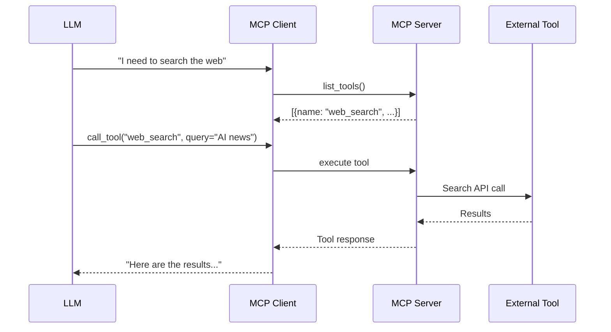

The `core/mcp` module implements the **Model Context Protocol** (MCP) to dynamically extend agent capabilities with external tools.

## What is MCP

The **Model Context Protocol** is an open standard for connecting LLMs to external data sources and tools in a secure and structured way.

### Problem Solved

LLMs are limited to:

- Static knowledge (training cutoff date)
- Inability to interact with external systems
- No access to real-time data

**Solution**: MCP allows LLMs to "call" external tools (APIs, databases, calculators, browsers) during generation.

### How It Works



### Benefits

**Extensibility**: Add new tools without model retraining

**Security**: Tools executed server-side with access control

**Standardization**: Common protocol across providers (OpenAI, Anthropic, etc.)

**Hot-Swappable**: Enable/disable tools without restart

---

## Transport

BaselithCore's MCP integration uses the **stdio transport**: the client spawns
the server as a child process and exchanges newline-delimited JSON-RPC 2.0
messages over the process's stdin/stdout. This is the transport used by Claude
Desktop and most MCP-aware IDEs. There is **no** HTTP/SSE client transport in
`core/mcp` — `MCPClient` always launches a local subprocess.

!!! note "Remaining transport work"
    The **Streamable HTTP** transport and **OAuth** authorization added in the
    2025-06-18 spec are not yet implemented — stdio only. Those are larger,
    separately-scoped additions (a new transport + an auth flow).

## Protocol version & tool annotations

The server negotiates the protocol version on `initialize`: it echoes the
client's requested version when supported (`2025-06-18`, `2025-03-26`,
`2024-11-05`) and otherwise offers its latest (`LATEST_PROTOCOL_VERSION =
"2025-06-18"`). `tools/list` emits 2025-06-18 **annotations** (behavioural
hints) derived from each tool's autonomy `category`, so a client can gate
side-effecting tools without executing them:

| `category` | `readOnlyHint` | `destructiveHint` | `idempotentHint` | `openWorldHint` |
|------------|:---:|:---:|:---:|:---:|
| `read_only` | ✅ | ❌ | ✅ | ❌ |
| `mutating` | ❌ | ❌ | ❌ | ❌ |
| `destructive` | ❌ | ✅ | ❌ | ❌ |
| `external_side_effect` | ❌ | ✅ | ❌ | ✅ |

These hints complement the server-side autonomy gate (`tools/call` still
rejects categories requiring human approval, since stdio has no approval
channel).

---

## Structure

```plaintext
core/mcp/
├── __init__.py        # exports: MCPServer, MCPClient, MCPToolAdapter
├── client.py          # MCPClient + MCPConnectionPool (consume tools, stdio)
├── server.py          # MCPServer (expose tools, stdio) + create_default_server
├── handlers.py        # MessageHandlerMixin (JSON-RPC dispatch)
├── tools.py           # MCPToolAdapter (wrap internal functions as MCP tools)
└── types.py           # MCPTool, MCPResource, MCPServerInfo (internal types)
```

The package exports exactly three public symbols:

```python
from core.mcp import MCPServer, MCPClient, MCPToolAdapter
```

### Client vs Server: When to Use

| Component      | Role                                 | When to Use                                                           |
| -------------- | ------------------------------------ | --------------------------------------------------------------------- |
| **MCP Client** | Consumes tools from external servers | Your agent needs external capabilities (web search, database queries) |
| **MCP Server** | Exposes tools to LLM models          | You want to make your functionalities available to agents/LLMs        |

!!! tip "Both Together"
    A system can be both a client (consuming tools) and a server (exposing them). Common in baselith-core architectures.

---

## MCP Client

`MCPClient` connects to an external MCP server by launching it as a local
subprocess (Python `.py` or Node `.js` script, or a custom command). It is best
used as an async context manager so the child process is always torn down.

```python
from core.mcp import MCPClient

# Spawn a local server script over stdio
async with MCPClient("./tools/weather_server.py") as client:
    tools = await client.list_tools()          # list[MCPToolInfo]
    result = await client.call_tool(
        "get_weather", {"city": "Rome"}
    )

# Or pass an explicit command instead of a script path
async with MCPClient(command=["python", "-m", "my_pkg.server"]) as client:
    ...
```

The constructor signature is `MCPClient(server_script=None, command=None)`.
`connect()` performs the MCP handshake and returns an `MCPServerInfo`; you can
also pass `server_script` / `command` / `env` directly to `connect()` to
override the constructor values. Beyond tools, the client also exposes
`list_resources()` and `read_resource(uri)`.

To manage several servers at once, use `MCPConnectionPool`:

```python
from core.mcp.client import MCPConnectionPool

async with MCPConnectionPool() as pool:
    await pool.add_server("weather", "./weather_server.py")
    await pool.add_server("database", "./db_server.py")
    result = await pool.call_tool("weather", "get_forecast", {...})
```

### Command Allowlist

A custom `command` can originate from a plugin manifest or operator config, so
`MCPClient` refuses to spawn arbitrary binaries: the basename of `argv[0]`
must appear in `MCP_ALLOWED_COMMANDS` (default
`python,python3,node,npx,uvx,uv,deno,bun,bunx`; versioned names like
`python3.12` are accepted, and the current interpreter is always allowed).
A disallowed command raises `ValueError` before any process is started.

### Request Timeout & Untrusted Output

Every request to an external server is bounded by
`MCP_CLIENT_REQUEST_TIMEOUT` (seconds, default `30.0`, see
`core.config.mcp.MCPConfig`). If a server hangs, the read aborts with a
`RuntimeError` and the client is marked disconnected — a late reply on the
single-flight stdio transport can never be mistaken for the response to a later
request. Tool calls are **not** auto-retried: retrying a non-idempotent tool
could double-execute a side effect.

Tool output from external servers is untrusted and is scanned for indirect
prompt injection (`scan_external_content`) before it enters the agent context —
log-only by default, sanitizing when `BASELITH_SANITIZE_EXTERNAL_CONTENT=true`.
See [Guardrails](guardrails.md).

---

## MCP Server

`MCPServer` exposes tools (and resources) to MCP clients over stdio. Register
tools with the `@server.tool(...)` decorator — if you omit `input_schema`, one
is auto-generated from the function's type hints. Run the server with
`run_stdio()` (or `run(transport="stdio")`); it reads JSON-RPC from stdin and
writes responses to stdout until the stream closes.

```python
import asyncio
from core.mcp import MCPServer

server = MCPServer(name="my-tools")

@server.tool(
    name="calculate",
    description="Evaluate a mathematical expression",
    input_schema={
        "type": "object",
        "properties": {
            "expression": {"type": "string", "description": "Math expression"}
        },
        "required": ["expression"],
    },
)
async def calculate(expression: str) -> str:
    return str(eval(expression))  # use a sandbox in production!

# Resources are registered the same way:
@server.resource(uri="mcp://config", name="App Config")
async def get_config(uri: str) -> str:
    return "..."

# Serve over stdio (blocks until stdin closes)
asyncio.run(server.run_stdio())
```

!!! note "No network listener / no health-check hook"
    There is no `server.start(port=...)` and no `@server.health_check`
    decorator — the server is stdio-only and stops with `server.stop()` or when
    the input stream ends. `create_default_server()` returns a server
    preloaded with simple `echo` and `get_system_info` tools.

### Autonomy approval gate

Tools carry an autonomy `category` (`read_only` default, `mutating`,
`destructive`, `external_side_effect`) declared at registration:
`@server.tool(..., category="mutating")`. Constructing the server with
`MCPServer(autonomy_policy=AutonomyPolicy(level=...))` activates the gate:
`tools/call` requests for categories that require approval at that level are
rejected (MCP transports have no human-approval channel, so the gate is
fail-closed). Built-in tools are pre-categorized — `execute_code` and
`index_document` are `mutating`, `scrape_url` is `external_side_effect`.
For in-process agent loops with a human channel, use
`core.orchestration.enforce_approval` instead.

### Wrapping internal functions: `MCPToolAdapter`

`MCPToolAdapter` bridges existing BaselithCore functions into MCP tools,
auto-generating JSON Schemas from type hints and offering bundled registration
helpers (`register_scraper_tools`, `register_rag_tools`,
`register_reasoning_tools`, `register_plugin_tools`, `register_all_tools`).

```python
from core.mcp import MCPServer, MCPToolAdapter

server = MCPServer()
adapter = MCPToolAdapter(server)
adapter.register_function(my_async_func, name="do_thing")
adapter.register_all_tools()
```

---

## Documentation MCP Server

BaselithCore provides a specialized MCP Server to explore and search the documentation directly from your agentic IDE (e.g., Claude Desktop, Cursor, etc.). It is implemented at [`mkdocs-site/mcp/main.py`](https://github.com/baselithcore) on top of `core.mcp.MCPServer`.

### Connection Instructions

To connect to the Documentation MCP Server, you can use our interactive **MCP Wizard** or manually add the configuration.

<div class="mcp-wizard-container" style="margin: 2rem 0; text-align: center;">
  <a href="#" class="md-button md-button--mcp" style="padding: 0.8rem 2rem; font-size: 1rem;">
    <span class="twemoji">
      <svg xmlns="http://www.w3.org/2000/svg" viewBox="0 0 24 24"><path d="M12 2L4.5 20.29l.71.71L12 18l6.79 3 .71-.71L12 2z"/></path></svg>
    </span>
    <b>Open MCP Setup Wizard</b>
  </a>
</div>

Manually add the following configuration to your MCP client (STDIO transport):

```json
{
  "mcpServers": {
    "baselith-docs": {
      "command": "python",
      "args": ["-m", "mcp.main"],
      "env": {
        "PYTHONPATH": "/path/to/baselith-core/mkdocs-site"
      }
    }
  }
}
```

!!! note
    Replace `/path/to/baselith-core` with the absolute path to your local repository.

### Available Tools

- `search_docs`: Search the documentation using keywords or phrases.
- `list_docs`: List all available documentation pages.
- `get_doc_page`: Retrieve the full markdown content of a specific page.

---

## LLM Integration

Wire MCP tools into a generation loop by listing the server's tools and routing
the model's tool calls back through the client:

```python
from core.mcp import MCPClient
from core.services.llm import get_llm_service

llm = get_llm_service()

async with MCPClient("./tools/web_server.py") as mcp:
    tools = await mcp.list_tools()   # list[MCPToolInfo]

    response = await llm.generate(
        prompt="Search information on Python 3.12",
        tools=tools,
        tool_choice="auto",
    )

    if response.tool_calls:
        for call in response.tool_calls:
            result = await mcp.call_tool(call.name, call.arguments)
            # feed `result` back into the conversation
```

---

## Configuration

MCP settings live in `core.config.mcp.MCPConfig` (read via `get_mcp_config()`).
The relevant environment variables:

```env title=".env"
MCP_SERVER_NAME=baselith-core
MCP_SERVER_VERSION=2.0.0
MCP_CLIENT_REQUEST_TIMEOUT=30.0
MCP_STDIO_TRANSPORT_ENABLED=true
MCP_SSE_TRANSPORT_ENABLED=false
MCP_EXECUTE_CODE_TIMEOUT=30
MCP_RAG_DEFAULT_TOP_K=5
```

!!! warning "No `MCP_SERVER_URL` / `MCP_MAX_RETRIES`"
    Because the transport is stdio-subprocess, there is no server URL to
    configure and no client-side retry setting. The only client tunable is
    `MCP_CLIENT_REQUEST_TIMEOUT`.
