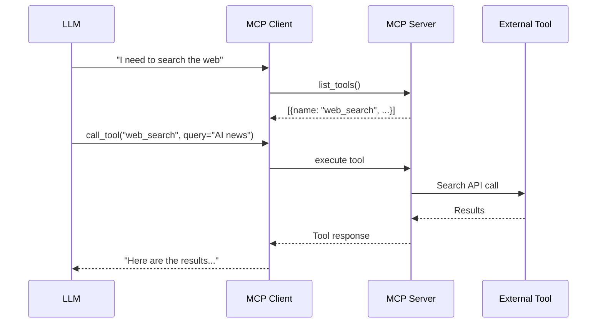

The `core/mcp` module implements the **Model Context Protocol** (MCP) to dynamically extend agent capabilities with external tools.

## What is MCP

The **Model Context Protocol** is an open standard for connecting LLMs to external data sources and tools in a secure and structured way.

### Problem Solved

LLMs are limited to:

- Static knowledge (training cutoff date)
- Inability to interact with external systems
- No access to real-time data

**Solution**: MCP allows LLMs to "call" external tools (APIs, databases, calculators, browsers) during generation.

### How It Works


```mermaid
sequenceDiagram
    participant LLM
    participant MCP Client
    participant MCP Server
    participant External Tool

    LLM->>MCP Client: "I need to search the web"
    MCP Client->>MCP Server: list_tools()
    MCP Server-->>MCP Client: [{name: "web_search", ...}]

    LLM->>MCP Client: call_tool("web_search", query="AI news")
    MCP Client->>MCP Server: execute tool
    MCP Server->>External Tool: Search API call
    External Tool-->>MCP Server: Results
    MCP Server-->>MCP Client: Tool response
    MCP Client-->>LLM: "Here are the results..."
```

### Benefits

**Extensibility**: Add new tools without model retraining

**Security**: Tools executed server-side with access control

**Standardization**: Common protocol across providers (OpenAI, Anthropic, etc.)

**Hot-Swappable**: Enable/disable tools without restart

---

## Transports

Two transports are supported on both sides:

**stdio** (default): the client spawns the server as a child process and
exchanges newline-delimited JSON-RPC 2.0 messages over the process's
stdin/stdout. This is the transport used by Claude Desktop and most MCP-aware
IDEs.

**Streamable HTTP** (opt-in, dual-era):

- **Server** — `MCP_HTTP_TRANSPORT_ENABLED=true` mounts the MCP server on the
  API surface at `MCP_HTTP_PATH` (default `/mcp`,
  `core/mcp/http_transport.py`). One JSON-RPC message per `POST` (batching was
  removed in 2025-06-18; arrays get `400`), `GET` returns `405` (no
  server-initiated stream).
- **Modern requests (2026-07-28)** are **stateless**: no session is required or
  minted, and a stale `Mcp-Session-Id` is ignored. They must carry the standard
  headers, validated against the body
  (`core/mcp/http_headers.py`) — a proxy routing on `Mcp-Name` while the server
  executes the body value is the confused-deputy split this closes:

    | Header | Mirrors | Required for |
    |--------|---------|--------------|
    | `MCP-Protocol-Version` | `_meta` protocol version | all requests |
    | `Mcp-Method` | `method` | all requests |
    | `Mcp-Name` | `params.name` / `params.uri` | `tools/call`, `resources/read`, `prompts/get` |

    A missing or mismatched header is `400` + `-32020`; values outside
    header-safe ASCII travel as `=?base64?…?=` and are decoded before
    comparison. Unsupported version → `400` + `-32022`; unknown method →
    `404` + `-32601` (the JSON-RPC body distinguishes it from a host that has
    no MCP endpoint at all).

- **Legacy requests** keep the session flow: `initialize` mints an
  `Mcp-Session-Id` response header; later requests must echo it
  (unknown/expired → `404`, the client re-initializes) and may carry
  `MCP-Protocol-Version` (unsupported → `400`); `DELETE` terminates the
  session.
- **Client** — `MCPClient(url="https://host/mcp", http_headers={...})`
  (`core/mcp/http_client_transport.py`): session capture/echo, negotiated
  protocol-version header, JSON and SSE response bodies, best-effort `DELETE`
  on `disconnect()`.

!!! warning "HTTP transport security (fail-closed defaults)"
    - **Authorization** — `MCP_HTTP_REQUIRE_AUTH` defaults to **true**: the
      request must carry credentials accepted by the central `AuthManager`
      (`Authorization: Bearer` JWT — local HS256 or federated OIDC — or an
      API key); anonymous callers get `401` +
      `WWW-Authenticate: Bearer resource_metadata="…"`.
      This makes the endpoint an OAuth **resource server** in the sense of
      the MCP authorization spec; token *issuance* (authorization server,
      client registration) belongs to your IdP, configured via the
      existing `OIDC_*` settings. Client-side, pass the token via
      `http_headers={"Authorization": "Bearer <token>"}`.
    - **Protected-resource metadata (RFC 9728)** — while auth is required the
      router also serves an *unauthenticated*
      `GET /.well-known/oauth-protected-resource{path}` (plus the bare
      `/.well-known/oauth-protected-resource` alias) publishing this
      resource's identifier and its `authorization_servers`. That list comes
      from `MCP_HTTP_AUTHORIZATION_SERVERS` (comma-separated), falling back to
      `OIDC_ISSUER`; with neither set the field is omitted and a warning is
      logged, because an OAuth client then has no way to discover where to get
      a token.
    - **Origin allowlist** — browser-originated requests (an `Origin` header)
      are rejected unless allowlisted in `MCP_HTTP_ALLOWED_ORIGINS`
      (DNS-rebinding defense). Non-browser clients are unaffected.
    - **Autonomy gate** — the HTTP-mounted server is created with the default
      SUPERVISED `AutonomyPolicy`: tool categories requiring human approval
      are rejected fail-closed (HTTP carries no approval channel).
    - Sessions expire after `MCP_HTTP_SESSION_TTL_SECONDS` (default 3600) and
      are process-local — multi-replica deployments need session-affine
      routing.

## Protocol eras

The server is **dual-era** (`core/mcp/modern.py`). It serves:

| Era | Versions | Selected by |
|-----|----------|-------------|
| **Modern** | `2026-07-28` | `_meta["io.modelcontextprotocol/protocolVersion"]` on the request |
| **Legacy** | `2025-11-25` … `2024-11-05` | an `initialize` handshake |

The era marker is per request, so both can run against the same process or
endpoint. Handler bodies are era-agnostic: the dispatcher validates the modern
metadata on the way in and shapes the modern result on the way out.

### Modern era (2026-07-28)

`2026-07-28` removed the handshake and protocol-level sessions. Every request
carries its own metadata and every result carries the server's:

```json
{
  "jsonrpc": "2.0", "id": 1, "method": "tools/list",
  "params": {
    "_meta": {
      "io.modelcontextprotocol/protocolVersion": "2026-07-28",
      "io.modelcontextprotocol/clientCapabilities": {},
      "io.modelcontextprotocol/clientInfo": {"name": "ExampleClient", "version": "1.0.0"}
    }
  }
}
```

- **`server/discover`** (mandatory) returns `supportedVersions`, `capabilities`
  and identity in one cacheable request — everything `initialize` used to
  carry. It answers bare too, which is the stdio era probe.
- **`resultType: "complete"`** on every result, plus
  `_meta["io.modelcontextprotocol/serverInfo"]`. `"input_required"` is the MRTR
  interim value; this server never asks the client for input, so it never
  emits one.
- **Caching hints** — `ttlMs` (`MCP_CACHE_TTL_MS`, default 60000) and
  `cacheScope` (`MCP_CACHE_SCOPE`, default **`private`**) on `server/discover`,
  the three `*/list` operations, `resources/templates/list` and
  `resources/read`. `private` is the safe default: listings and reads may be
  filtered per identity, and a shared cache would leak them across
  authorization contexts. Set `public` only when every caller sees the same
  primitives.
- **Version negotiation without a handshake** — an unsupported version returns
  `-32022` with `data.supported` / `data.requested` so the client can retry;
  a request missing `clientCapabilities` is `-32602`.
- **Removed methods** — `ping` and `logging/setLevel` return `-32601` in the
  modern era and keep working for legacy clients. The log level travels
  per-request in `_meta` instead.
- **Renumbered errors** — resource-not-found is `-32602` for modern clients and
  `-32002` for legacy ones (the revision retired `-32002`).

Legacy behaviour is untouched: a legacy result carries no `resultType`,
`_meta` or caching hints, since those fields do not exist in its revision.

### Legacy handshake

`initialize` echoes the client's requested version when supported and
otherwise offers `LATEST_PROTOCOL_VERSION = "2025-11-25"`. Per that revision,
`serverInfo` carries the optional `description` field and input-validation
failures on `tools/call` are returned as **tool execution errors**
(`isError: true`, SEP-1303) so the calling model can self-correct — never as
JSON-RPC protocol errors.

### Tool annotations

`tools/list` emits 2025-06-18 **annotations** (behavioural hints) derived from
each tool's autonomy `category`, so a client can gate side-effecting tools
without executing them:

| `category` | `readOnlyHint` | `destructiveHint` | `idempotentHint` | `openWorldHint` |
|------------|:---:|:---:|:---:|:---:|
| `read_only` | ✅ | ❌ | ✅ | ❌ |
| `mutating` | ❌ | ❌ | ❌ | ❌ |
| `destructive` | ❌ | ✅ | ❌ | ❌ |
| `external_side_effect` | ❌ | ✅ | ❌ | ✅ |

These hints complement the server-side autonomy gate (`tools/call` still
rejects categories requiring human approval).

### Capability advertisement

`ServerCapabilities` members are emitted as objects or **omitted entirely** —
never as JSON `null`, which strictly-typed clients reject. A sub-capability is
advertised only when it is actually implemented: `listChanged: true` is sent
because the server really does emit `notifications/*/list_changed` on any
`subscriptions/listen` stream that opted in. `extensions` advertises
`io.modelcontextprotocol/tasks`.

Advertising `logging` (default on, `MCPServerCapabilities.logging`) obliges the
server to answer `logging/setLevel`; it accepts the eight RFC 5424 severities
and rejects anything else.

`ping` is answered with an **empty** result object, per the spec.

### JSON Schema dialect

Tool `inputSchema` and `outputSchema` validators are compiled against **JSON
Schema 2020-12** (SEP-1613 makes it the default MCP dialect). A schema carrying
an explicit `$schema` still selects its own draft. This matters: a Draft-7
validator silently ignores 2019-09+ keywords such as `prefixItems`, so those
constraints would go unenforced and malformed arguments would reach the handler.

### Structured tool output

A tool may declare an `output_schema`; it is advertised as `outputSchema` on
`tools/list`, and `tools/call` then returns the payload as
`structuredContent` — mirrored as serialized JSON in a text block for clients
that only read `content` (2025-06-18):

```python
@server.tool(
    name="weather",
    description="Current weather",
    input_schema={"type": "object", "properties": {"city": {"type": "string"}}},
    output_schema={
        "type": "object",
        "properties": {"temp_c": {"type": "number"}, "city": {"type": "string"}},
        "required": ["temp_c", "city"],
    },
)
async def weather(city: str) -> dict:
    return {"temp_c": 21.5, "city": city}
```

The declared schema is a contract: output that violates it is returned as a
**tool execution error** (`isError: true`) rather than shipped to the client.

### Tool failures vs protocol errors

Exceptions raised *inside* a tool handler become `isError: true` results
carrying the message, never JSON-RPC errors — the model needs to see them to
retry or route around them. Protocol-level problems keep their spec codes:

| Condition | Code |
|-----------|-----:|
| Unknown tool, malformed arguments container, invalid cursor | `-32602` |
| Unknown resource URI (no resource and no matching template) | `-32002` |
| Unknown method | `-32601` |
| Server fault | `-32603` |

### Pagination

`tools/list`, `resources/list` and `resources/templates/list` page through an
opaque `cursor`, at most `MCP_LIST_PAGE_SIZE` entries (default 100) per page;
`nextCursor` is present only while another page exists. Entries are served in
sorted order, so a client can cache the listing. The cursor encodes the *last
key served*, not an index — entries registered or removed between pages
therefore cannot make the listing skip or repeat. A cursor this server did not
mint is rejected with `-32602` instead of silently restarting the listing.

### Resource templates

Parameterized resources are registered with `register_resource_template()` and
listed by `resources/templates/list`. Templates are RFC 6570 Level 1 (`{var}`),
each variable matching a single path segment; a `resources/read` whose URI
matches invokes `handler(uri, **variables)`:

```python
server.register_resource_template(
    uri_template="mcp://reports/{year}/{month}",
    name="Monthly report",
    description="One report per month",
    handler=read_report,           # async def read_report(uri, year, month) -> str
    mime_type="text/markdown",
)
```

Templates never appear in `resources/list` — that operation lists concrete,
directly readable URIs only.

### Prompts

Prompts are the third server primitive: templated messages a host surfaces as
slash commands or menu entries. `register_prompt()` declares the arguments;
the handler receives them as keywords and returns either a string (rendered as
one user message) or an explicit list of `PromptMessage` dicts.

```python
server.register_prompt(
    name="code_review",
    description="Ask for a code review",
    arguments=[{"name": "language", "description": "Source language", "required": True}],
    handler=review,                 # async def review(language: str) -> str
    completions={"language": ["python", "rust"]},
)
```

A missing required argument, or an unknown prompt name, is `-32602`. The
`prompts` capability is advertised as soon as a prompt is registered — the flag
follows what the server actually serves.

### Argument completion

`completion/complete` answers with candidates for one prompt argument or one
resource-template variable. A provider is either a static list (filtered here
by the prefix typed so far) or a callable — sync or async — receiving the
partial value, which is what a database- or API-backed provider needs:

```python
server.register_resource_template(
    uri_template="mcp://reports/{year}",
    name="Reports", description="", handler=read_report,
    completions={"year": lambda partial: fetch_years(partial)},
)
```

Responses are capped at 100 values with `total`/`hasMore` reporting the real
count. A provider that raises returns an empty list rather than failing the
request the user is typing into, and the `completions` capability is advertised
only when some primitive declares one.

### Icons

Tools, resources, resource templates and prompts accept `icons=[{"src",
"mimeType", "sizes"}]` (SEP-973) and emit the field only when set.

---

### Multi round-trip requests (MRTR)

2026-07-28 removed server-initiated requests. A handler that needs elicitation,
sampling or a roots listing raises `InputRequired`; `tools/call`,
`prompts/get` and `resources/read` turn that into an `InputRequiredResult`, and
the client retries the original request with the answers:

```python
from core.mcp.mrtr import InputRequired, get_input_responses

async def login(repo: str) -> str:
    answers = get_input_responses()
    if "github_login" not in answers:
        raise InputRequired(
            {"github_login": {"method": "elicitation/create", "params": {...}}},
            state={"repo": repo},          # sealed into requestState
        )
    return f"{answers['github_login']['content']['name']}@{repo}"
```

The retry is an independent request, so whatever the server must remember
travels in `requestState` — **through the client**, which makes it
attacker-controlled. `RequestStateSealer` therefore HMAC-seals it and binds it
to three things, each rejected on mismatch:

| Bound to | Blocks |
|----------|--------|
| the signature | forgery and tampering |
| the authenticated principal | cross-user replay |
| the originating method | moving state to a different request |
| a short expiry (`MCP_REQUEST_STATE_TTL_SECONDS`, default 300s) | long-lived replay |

Set `MCP_REQUEST_STATE_SECRET` in any multi-replica deployment: without it each
process mints a random key, so a retry landing on another replica is rejected.

A server never asks for something the client did not declare — an
`elicitation/create` to a client without the `elicitation` capability is
`-32021` with `data.requiredCapabilities`, not a request the client cannot
answer. A **legacy** client gets a tool execution error instead, since its
revision has no way to carry the ask.

Client-side this is transparent: pass an `input_provider` and `MCPClient`
fulfils each ask and retries, bounded to four rounds.

```python
async def provide(requests): ...          # returns the InputResponses map

async with MCPClient("./server.py", input_provider=provide) as client:
    await client.call_tool("login", {"repo": "acme"})
```

Without an `input_provider` the client declares no such capability, so a
conforming server will not ask.

### Long-running work: the tasks extension

`io.modelcontextprotocol/tasks` replaces the response with a durable handle, so
a slow operation does not hold a connection open past an intermediary's
timeout and survives a client reconnect. Both sides opt in — the client through
its per-request capabilities, the server by advertising the extension — and the
server **never** hands a task to a client that did not ask, because that client
would treat the handle as the answer.

```python
server.register_tool(
    name="index_corpus", description="...", input_schema={...},
    handler=index_corpus, long_running=True,
)
```

`tools/call` then returns `resultType: "task"` with a `taskId`, `ttlMs` and
`pollIntervalMs`; the client polls `tasks/get` until a terminal status:

| Status | Meaning |
|--------|---------|
| `working` | in progress |
| `input_required` | parked on an `inputRequests` map; answer with `tasks/update` |
| `completed` | `result` holds what the call would have returned |
| `failed` | `error` holds the JSON-RPC error |
| `cancelled` | `tasks/cancel` was honoured |

Cancellation is cooperative: the ack is an intent, not a guarantee. Handles are
process-local and expire after `MCP_TASK_TTL_MS`.

### Change notifications: `subscriptions/listen`

The revision removed the GET stream and `resources/subscribe`. Everything
server-initiated now flows on the response stream of a `subscriptions/listen`
request, and only what the client asked for:

```json
{"method": "subscriptions/listen",
 "params": {"notifications": {"toolsListChanged": true,
                              "resourceSubscriptions": ["mcp://config"]}}}
```

The first message is always `notifications/subscriptions/acknowledged`, whose
`notifications` field reports the subset the server actually honours. Every
message on the stream carries `io.modelcontextprotocol/subscriptionId` in
`_meta` — the JSON-RPC id of the listen request — because on stdio all
subscriptions share one channel and the client must demultiplex them.

Registering a tool, resource, template or prompt announces the matching
`list_changed` to the streams that opted in; `notify_resource_updated(uri)`
announces a content change to the streams watching that URI. When the server
ends a subscription it answers the listen request with an empty result, so the
client can tell a graceful close from a dropped transport.

A `subscriptions/listen` sent over a transport with no stream is rejected with
`-32601` rather than silently swallowing every notification.

### Mirrored parameters (`x-mcp-header`)

A tool may mark primitive parameters to be mirrored into `Mcp-Param-{Name}`
headers, so an intermediary can route on them without parsing the body:

```python
input_schema={
    "type": "object",
    "properties": {
        "region": {"type": "string", "x-mcp-header": "Region"},
        "query": {"type": "string"},
    },
}
```

The constraints are enforced at **registration** — non-empty HTTP token,
case-insensitively unique, only `string`/`integer`/`boolean`, only on
properties statically reachable through `properties` keys. A tool advertised
with an invalid annotation would be excluded by every conforming client, so
failing at declaration is the honest moment.

Server-side, each mirrored header is checked against the argument it mirrors
and a divergence is `-32020`: a gateway authorizing on the header while the
server executes a different body value is the confused deputy this closes.
Integers compare numerically, and a parameter absent from the arguments must
carry no header.

## Concurrency, cancellation and progress

`run_stdio()` serves each request as its own task via `RequestDispatcher`
([dispatch.py](https://github.com/baselithcore)). Two consequences:

- **A slow tool no longer blocks the connection.** Previously the read loop
  awaited each message inline, so one long call stalled every other request.
- **`notifications/cancelled` works.** The dispatcher cancels the in-flight
  task for that request id and — per the spec — sends *no* response. A
  cancellation for an id that already finished is ignored, since the race is
  normal.

Writes are serialized behind a lock: responses and progress notifications now
compete for the same stdout stream.

Handlers report progress with `report_progress()`, which reads the request's
`_meta.progressToken` from a context variable instead of forcing every tool to
accept a reporter argument:

```python
from core.mcp import report_progress

@server.tool(name="index_corpus", description="Index a corpus")
async def index_corpus(path: str) -> str:
    for done, item in enumerate(items, 1):
        await process(item)
        await report_progress(done, total=len(items), message=item.name)
    return "indexed"
```

Progress is opt-in: with no `progressToken` on the request, and outside a
request entirely, the call is a no-op. A failed send is logged and swallowed —
progress must never break the work it describes.

### Over Streamable HTTP

A modern HTTP request is answered with an **SSE stream** rather than a JSON
body when it needs one — that is, when it carries a `progressToken` or is a
`subscriptions/listen`. Progress notifications flow on that stream before the
final response, which terminates it. `X-Accel-Buffering: no` is set so reverse
proxies do not hold events back, and a comment line goes out during quiet
periods so intermediaries do not drop a long-lived stream.

**Closing the stream is the cancellation signal on HTTP** — there is no
`notifications/cancelled` on this transport. A client that disconnects has its
work cancelled rather than left running.

---

## Structure

```plaintext
core/mcp/
├── __init__.py                 # exports: MCPServer, MCPClient, MCPToolAdapter, MCPToolError
├── client.py                   # MCPClient (consume tools; stdio + HTTP)
├── client_handshake.py         # client-side era probe (server/discover → modern?)
├── client_operations.py        # tools / resources calls + MRTR retry loop
├── client_types.py             # MCPToolInfo
├── client_errors.py            # MCPToolError
├── cache.py                    # client-side ttlMs / cacheScope cache
├── pool.py                     # MCPConnectionPool (many servers at once)
├── stdio_client_transport.py   # stdio framing, id demux, command allowlist, spawn
├── http_client_transport.py    # Streamable HTTP client transport
├── server.py                   # MCPServer (registration API) + create_default_server
├── registration.py             # tools / resources / templates / prompts registry API
├── modern.py                   # 2026-07-28 era: per-request _meta, resultType, cache hints
├── mrtr.py                     # multi round-trip requests + sealed requestState
├── tasks.py                    # io.modelcontextprotocol/tasks extension
├── subscriptions.py            # subscriptions/listen + change notifications
├── sse.py                      # SSE response streams
├── http_headers.py             # Mcp-Method / Mcp-Name / Mcp-Param-* validation
├── param_headers.py            # x-mcp-header annotation rules
├── stdio_server.py             # stdio serve loop
├── dispatch.py                 # RequestDispatcher: concurrency + cancellation
├── progress.py                 # report_progress() for handlers
├── http_transport.py           # Streamable HTTP server router + SessionStore + RFC 9728
├── handlers.py                 # JSON-RPC dispatch, initialize, tools/*
├── resource_handlers.py        # resources/* (concrete + templates)
├── prompt_handlers.py          # prompts/*
├── completion.py               # completion/complete
├── pagination.py               # opaque list cursors
├── uri_template.py             # RFC 6570 Level-1 resource templates
├── errors.py                   # InvalidParams / ResourceNotFound → JSON-RPC codes
├── tools.py                    # MCPToolAdapter (wrap internal functions as MCP tools)
└── types.py                    # MCPTool, MCPResource, MCPResourceTemplate, MCPPrompt
```

The package exports five public symbols:

```python
from core.mcp import (
    MCPServer, MCPClient, MCPToolAdapter, MCPToolError, report_progress,
)
```

### Client vs Server: When to Use

| Component      | Role                                 | When to Use                                                           |
| -------------- | ------------------------------------ | --------------------------------------------------------------------- |
| **MCP Client** | Consumes tools from external servers | Your agent needs external capabilities (web search, database queries) |
| **MCP Server** | Exposes tools to LLM models          | You want to make your functionalities available to agents/LLMs        |

!!! tip "Both Together"
    A system can be both a client (consuming tools) and a server (exposing them). Common in baselith-core architectures.

---

## MCP Client

`MCPClient` connects to an external MCP server by launching it as a local
subprocess (Python `.py` or Node `.js` script, or a custom command). It is best
used as an async context manager so the child process is always torn down.

```python
from core.mcp import MCPClient

# Spawn a local server script over stdio
async with MCPClient("./tools/weather_server.py") as client:
    tools = await client.list_tools()          # list[MCPToolInfo]
    result = await client.call_tool(
        "get_weather", {"city": "Rome"}
    )

# Or pass an explicit command instead of a script path
async with MCPClient(command=["python", "-m", "my_pkg.server"]) as client:
    ...
```

The constructor signature is `MCPClient(server_script=None, command=None)`.
`connect()` establishes the protocol era and returns an `MCPServerInfo`; you
can also pass `server_script` / `command` / `env` directly to `connect()` to
override the constructor values. Beyond tools, the client also exposes
`list_resources()` and `read_resource(uri)`.

### Era detection

The client is dual-era too. `connect()` probes with `server/discover`
(`core/mcp/client_handshake.py`):

- a `DiscoverResult` naming a mutually supported modern version ⇒ **modern**.
  `client.is_modern` is `True`, no `initialize` and no
  `notifications/initialized` are sent, and every subsequent request carries
  `_meta` with the negotiated version, `clientCapabilities` and `clientInfo`.
  Over HTTP the standard `Mcp-Method` / `Mcp-Name` headers are derived from the
  body and Base64-encoded when the value is not header-safe.
- anything else — an error, a non-discover reply, or a server sharing no
  modern version — ⇒ **legacy**, and the client falls back to the `initialize`
  handshake.

The probe is deliberate rather than optimistic because guessing wrong is not a
graceful degradation: a legacy server can silently mis-serve a modern-shaped
request.

`call_tool()` returns `structuredContent` when the server sends it, falling
back to parsing the text mirror for servers that only produce `content`.

### Result caching

`client.cache` honours the server's `ttlMs` / `cacheScope` hints on
`server/discover`, the three `*/list` operations, `resources/templates/list`
and `resources/read`. The key is the method plus the parameters that shape the
result, so a different cursor or URI is a different entry and `_meta` never
splits one.

The TTL is a **freshness hint checked on access**, never a polling timer.
Three things are deliberately never cached: results with no hints (a legacy
server sends none, and caching them would invent a policy the server did not
state), interim `input_required` results, and anything produced from a
multi round-trip retry — its inputs are not part of the key, so the entry
would answer a request that never supplied them.

A `list_changed` notification arriving on the connection invalidates the
matching listing immediately: the TTL bounds staleness, the notification ends
it.

To manage several servers at once, use `MCPConnectionPool`:

```python
from core.mcp.client import MCPConnectionPool

async with MCPConnectionPool() as pool:
    await pool.add_server("weather", "./weather_server.py")
    await pool.add_server("database", "./db_server.py")
    result = await pool.call_tool("weather", "get_forecast", {...})
```

### Command Allowlist

A custom `command` can originate from a plugin manifest or operator config, so
`MCPClient` refuses to spawn arbitrary binaries: the basename of `argv[0]`
must appear in `MCP_ALLOWED_COMMANDS` (default
`python,python3,node,npx,uvx,uv,deno,bun,bunx`; versioned names like
`python3.12` are accepted, and the current interpreter is always allowed).
A disallowed command raises `ValueError` before any process is started.

### Tool execution errors

A `tools/call` result with `isError: true` means the server ran the tool and
the *tool* failed. `call_tool()` raises `MCPToolError` carrying the server's
message, so a failure can never be handed back to the model dressed as data —
catch it and feed `str(exc)` to the model for self-correction:

```python
from core.mcp import MCPClient, MCPToolError

try:
    result = await client.call_tool("get_weather", {"cty": "Rome"})
except MCPToolError as exc:
    result = f"Tool failed: {exc}"   # let the model retry with fixed arguments
```

`MCPToolError` is distinct from the `RuntimeError` raised on transport and
JSON-RPC protocol failures, which indicate a broken connection rather than a
correctable call.

### Request Timeout & Untrusted Output

Every request to an external server is bounded by
`MCP_CLIENT_REQUEST_TIMEOUT` (seconds, default `30.0`, see
`core.config.mcp.MCPConfig`) — a total deadline, not a per-frame one. If a
server hangs, the read aborts with a `RuntimeError` and the client is marked
disconnected. Tool calls are **not** auto-retried: retrying a non-idempotent
tool could double-execute a side effect.

Responses are demultiplexed on the JSON-RPC `id`
(`core/mcp/stdio_client_transport.py`): a server may interleave notifications
(`notifications/message`, `notifications/progress`) with replies, and a late
reply to an abandoned request may still be in the pipe. Frames that are not the
awaited response are dropped, so neither can be mistaken for a result.

Tool output from external servers is untrusted and is scanned for indirect
prompt injection (`scan_external_content`) before it enters the agent context —
sanitizing by default; `BASELITH_SANITIZE_EXTERNAL_CONTENT=false` for log-only.
See [Guardrails](guardrails.md).

### SSRF guard (Streamable HTTP transport)

`HTTPClientTransport` (the client side of the Streamable HTTP transport)
builds its `httpx.AsyncClient` via `core.security.http.create_hardened_async_client`,
so every request — and every redirect hop — is re-validated and IP-pinned
against `core.security.ssrf` before it reaches the wire. Private/loopback/
link-local/metadata-service hosts are rejected by default. Set
`MCP_ALLOW_INTERNAL_ENDPOINTS=true` only for trusted local development
against an MCP server on localhost or an internal network.

---

## MCP Server

`MCPServer` exposes tools, resources and prompts to MCP clients over stdio.
Register tools with the `@server.tool(...)` decorator — if you omit
`input_schema`, one is auto-generated from the function's type hints. Run the
server with `run_stdio()` (or `run(transport="stdio")`); it reads JSON-RPC from
stdin and writes responses to stdout until the stream closes.

```python
import asyncio
from core.mcp import MCPServer

server = MCPServer(name="my-tools")

@server.tool(
    name="calculate",
    description="Evaluate a mathematical expression",
    input_schema={
        "type": "object",
        "properties": {
            "expression": {"type": "string", "description": "Math expression"}
        },
        "required": ["expression"],
    },
)
async def calculate(expression: str) -> str:
    return str(eval(expression))  # use a sandbox in production!

# Resources are registered the same way:
@server.resource(uri="mcp://config", name="App Config")
async def get_config(uri: str) -> str:
    return "..."

# Serve over stdio (blocks until stdin closes)
asyncio.run(server.run_stdio())
```

!!! note "No network listener / no health-check hook"
    There is no `server.start(port=...)` and no `@server.health_check`
    decorator — `run_stdio()` is the built-in listener (mount the Streamable
    HTTP router for a network surface) and it stops with `server.stop()` or
    when the input stream ends. `create_default_server()` returns a server
    preloaded with simple `echo` and `get_system_info` tools.

### Autonomy approval gate

Tools carry an autonomy `category` (`read_only` default, `mutating`,
`destructive`, `external_side_effect`) declared at registration:
`@server.tool(..., category="mutating")`. Constructing the server with
`MCPServer(autonomy_policy=AutonomyPolicy(level=...))` activates the gate:
`tools/call` requests for categories that require approval at that level are
rejected (MCP transports have no human-approval channel, so the gate is
fail-closed). Built-in tools are pre-categorized — `execute_code` and
`index_document` are `mutating`, `scrape_url` is `external_side_effect`.
For in-process agent loops with a human channel, use
`core.orchestration.enforce_approval` instead.

### Wrapping internal functions: `MCPToolAdapter`

`MCPToolAdapter` bridges existing BaselithCore functions into MCP tools,
auto-generating JSON Schemas from type hints and offering bundled registration
helpers (`register_scraper_tools`, `register_rag_tools`,
`register_reasoning_tools`, `register_plugin_tools`, `register_all_tools`).

```python
from core.mcp import MCPServer, MCPToolAdapter

server = MCPServer()
adapter = MCPToolAdapter(server)
adapter.register_function(my_async_func, name="do_thing")
adapter.register_all_tools()
```

---

## Documentation MCP Server

BaselithCore provides a specialized MCP Server to explore and search the documentation directly from your agentic IDE (e.g., Claude Desktop, Cursor, etc.). It is implemented at [`mkdocs-site/mcp/main.py`](https://github.com/baselithcore) on top of `core.mcp.MCPServer`.

### Connection Instructions

To connect to the Documentation MCP Server, you can use our interactive **MCP Wizard** or manually add the configuration.

<div class="mcp-wizard-container" style="margin: 2rem 0; text-align: center;">
  <a href="#" class="md-button md-button--mcp" style="padding: 0.8rem 2rem; font-size: 1rem;">
    <span class="twemoji">
      <svg xmlns="http://www.w3.org/2000/svg" viewBox="0 0 24 24"><path d="M12 2L4.5 20.29l.71.71L12 18l6.79 3 .71-.71L12 2z"/></path></svg>
    </span>
    <b>Open MCP Setup Wizard</b>
  </a>
</div>

Manually add the following configuration to your MCP client (STDIO transport):

```json
{
  "mcpServers": {
    "baselith-docs": {
      "command": "python",
      "args": ["-m", "mcp.main"],
      "env": {
        "PYTHONPATH": "/path/to/baselith-core/mkdocs-site"
      }
    }
  }
}
```

!!! note
    Replace `/path/to/baselith-core` with the absolute path to your local repository.

### Available Tools

| Tool | What it does |
|------|--------------|
| `search_docs` | Ranked full-text search with snippets |
| `search_in_section` | Same, scoped to one documentation section |
| `get_doc_page` | Full markdown of a page by relative path |
| `get_doc_by_title` | Full markdown of a page by exact or partial title |
| `get_docs_batch` | Several pages in one round trip |
| `get_docs_summary` | Condensed overview of the documentation set |
| `find_related_pages` | Pages related to a given one |
| `list_docs` | Every available page |
| `get_nav` | Navigation tree |
| `get_nav_flat` | Navigation as a flat list |

Two resources are exposed as well: `mcp://docs/navigation` and
`mcp://docs/all`.

!!! tip "Verified end to end"
    The docs server runs on `core.mcp.MCPServer`, so it inherits the dual-era
    behaviour: legacy clients get the `initialize` handshake, and a modern
    client can call `server/discover` and issue stateless requests against the
    same process without any change to `mkdocs-site/mcp/`.

---

## LLM Integration

Wire MCP tools into a generation loop by listing the server's tools and routing
the model's tool calls back through the client:

```python
from core.mcp import MCPClient
from core.services.llm import get_llm_service

llm = get_llm_service()

async with MCPClient("./tools/web_server.py") as mcp:
    tools = await mcp.list_tools()   # list[MCPToolInfo]

    response = await llm.generate(
        prompt="Search information on Python 3.12",
        tools=tools,
        tool_choice="auto",
    )

    if response.tool_calls:
        for call in response.tool_calls:
            result = await mcp.call_tool(call.name, call.arguments)
            # feed `result` back into the conversation
```

---

## Configuration

MCP settings live in `core.config.mcp.MCPConfig` (read via `get_mcp_config()`).
The relevant environment variables:

```env title=".env"
MCP_SERVER_NAME=baselith-core
MCP_SERVER_VERSION=2.0.0
MCP_CLIENT_REQUEST_TIMEOUT=30.0
MCP_STDIO_TRANSPORT_ENABLED=true
MCP_SSE_TRANSPORT_ENABLED=false
MCP_EXECUTE_CODE_TIMEOUT=30
MCP_RAG_DEFAULT_TOP_K=5
MCP_ALLOW_INTERNAL_ENDPOINTS=false
MCP_LIST_PAGE_SIZE=100
MCP_HTTP_AUTHORIZATION_SERVERS=          # falls back to OIDC_ISSUER
MCP_CACHE_TTL_MS=60000
MCP_CACHE_SCOPE=private                  # or "public" — see Modern era above
MCP_SERVER_INSTRUCTIONS=                 # optional server/discover guidance
MCP_REQUEST_STATE_SECRET=                # REQUIRED for multi-replica MRTR
MCP_REQUEST_STATE_TTL_SECONDS=300
MCP_TASK_TTL_MS=3600000
MCP_TASK_POLL_INTERVAL_MS=1000
```

!!! warning "No `MCP_SERVER_URL` / `MCP_MAX_RETRIES`"
    Because the transport is stdio-subprocess, there is no server URL to
    configure and no client-side retry setting. The only client tunable is
    `MCP_CLIENT_REQUEST_TIMEOUT`.
