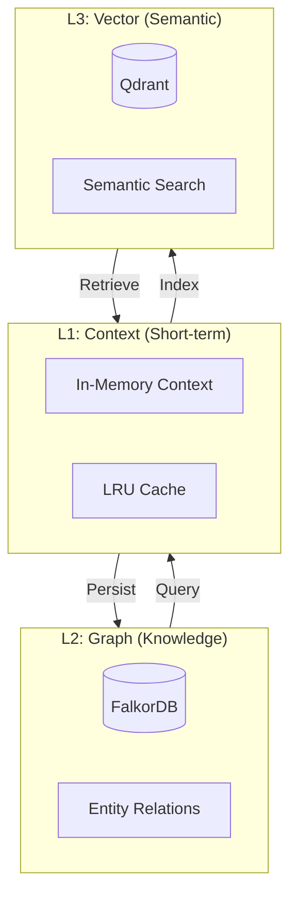
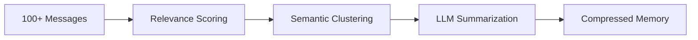

## Overview

The `core/memory` module is the **cognitive backbone** of BaselithCore, implementing an intelligent three-tier memory architecture that balances performance, semantic richness, and long-term knowledge retention.

**Key Benefits**:

- **Scalable Context** - Handle conversations with 1000+ messages without LLM context overflow
- **Semantic Recall** - Retrieve relevant past conversations via vector similarity
- **Knowledge Graphs** - Model entity relationships for deeper understanding
- **Intelligent Compression** - Automatically summarize old history to preserve context window
- **Multi-Session** - Isolate and manage memory across multiple concurrent conversations

**Core Capabilities**:

1. **L1 (Short-term)** - Fast in-memory cache for recent messages
2. **L2 (Knowledge Graph)** - Structured entity relationships via FalkorDB
3. **L3 (Semantic)** - Vector embeddings for similarity search via Qdrant

### Why Multi-Tier Memory?

Conversational agents face the **context window limitation** problem. LLMs can only process a limited number of tokens (~4K-128K depending on model). Without memory management:

- **Context Overflow** - Long conversations exceed LLM limits, truncating important history  
- **Lost Context** - Relevant information from 50 messages ago becomes inaccessible  
- **No Relationships** - Cannot model "User mentioned Paris in session 1, Rome in session 3"  
- **Linear Search** - Finding relevant past context requires scanning entire history

The three-tier architecture solves these by combining **speed** (L1), **structure** (L2), and **semantics** (L3).

## When to Use

Use `core/memory` when building conversational agents that require:

**When to Use Memory System For**:

| Use Case                 | Benefit                                   | Memory Tier Used          |
| ------------------------ | ----------------------------------------- | ------------------------- |
| **Chat History**         | Maintain conversation context             | L1 (Recent) + L3 (Search) |
| **Multi-Turn Reasoning** | Reference previous statements             | L1 + L2 (Graph)           |
| **Personalization**      | Remember user preferences across sessions | L2 (Knowledge Graph)      |
| **Semantic Search**      | "Find when user asked about weather"      | L3 (Vector)               |
| **Long Conversations**   | Handle 100+ message threads               | L1 (Compression)          |

**Consider Alternatives When**:

| Scenario                | Use Instead                 | Reason                           |
| ----------------------- | --------------------------- | -------------------------------- |
| **Static Knowledge**    | RAG pipeline with vector DB | No conversation state needed     |
| **Stateless Requests**  | Direct LLM call             | No history required              |
| **Real-time Streaming** | In-memory buffer only       | Persistence overhead unnecessary |

**❌ Anti-Patterns**:

- Using memory for **static documents** (use `plugins/document_sources` + Qdrant directly)
- Storing **large files** in messages (use file storage + references)
- Bypassing compression for **infinite history** (will cause OOM)

### Implementations

- **[Hierarchical Memory](hierarchical-memory.md)**: The strict STM/MTM/LTM implementation.
- **[Supermemory](supermemory.md)**: Cloud-native intelligent memory with automatic fact extraction, user profiles, and hybrid search.

### Efficiency Features

#### Proactive Context Folding (AgentFold)

The `ContextFolder` reduces token usage by summarizing older conversation turns while keeping recent ones verbatim.

```python
from core.memory.folding import ContextFolder

folder = ContextFolder(keep_latest_n=3)
compressed_history = await folder.fold(history)
# Result: "[Previous context: ... summary ...] \n [User]: recent..."
```

#### Memory Metrics

Monitor memory system performance with `MemoryMetricsCollector`.

```python
from core.memory.metrics import MemoryMetricsCollector

collector = MemoryMetricsCollector()
with collector.track_operation("recall") as tracker:
    results = await memory.recall("query")
    tracker.set_cache_hit(True)

print(collector.get_metrics().to_dict())
```

---

## Multi-Tier Architecture



### How It Works

**L1: Short-Term Context**

- **Storage**: Redis (in-memory cache)
- **Capacity**: Last 20-50 messages (configurable)
- **Purpose**: Fast retrieval for recent conversation turns
- **Eviction**: LRU when limit reached, triggers compression

**L2: Knowledge Graph**

- **Storage**: FalkorDB (graph database)
- **Capacity**: Unlimited entities and relationships
- **Purpose**: Model "User X likes Y", "Agent discussed Z in context W"
- **Query**: Cypher queries for structured reasoning

**L3: Semantic Search**

- **Storage**: Qdrant (vector database)
- **Capacity**: Millions of message embeddings
- **Purpose**: "Find all messages similar to current query"
- **Retrieval**: Cosine similarity on sentence embeddings (via shared `core.utils.similarity`)

**Memory Flow**:

1. **New Message** → Stored in L1 (Redis) immediately
2. **Embedding Generated** → Indexed in L3 (Qdrant) asynchronously  
3. **Entity Extraction** → Relationships stored in L2 (FalkorDB)
4. **Context Overflow** → Old messages compressed, summary kept in L1
5. **Query Time** → Recent from L1, relevant from L3, facts from L2

---

## Module Structure

```text
core/memory/
├── __init__.py        # Public exports
├── manager.py         # Main MemoryManager (AgentMemory)
├── hierarchy.py       # HierarchicalMemory (STM/MTM/LTM)
├── types.py           # Message, Context, MemoryItem types
├── providers.py             # VectorMemoryProvider + InMemoryProvider
├── supermemory_provider.py  # SupermemoryProvider + SupermemoryContextProvider
├── compression.py           # Memory compression with relevance decay
├── folding.py               # Context folding for token optimization
├── metrics.py               # Memory performance metrics
└── interfaces.py            # Protocols

core/utils/
├── __init__.py        # Public exports
├── similarity.py      # Shared numpy-based cosine similarity
└── tokens.py          # Token estimation (tiktoken + heuristic fallback)
```

---

## Memory Manager

The central component for memory management:

```python
from core.memory import MemoryManager

memory = MemoryManager()

# Retrieve session context
context = await memory.get_context(session_id="user-123")

# Add message
await memory.add_message(
    session_id="user-123",
    role="user",
    content="What's the weather in Rome?"
)

# Semantic search
results = await memory.search_similar(
    query="weather forecast",
    session_id="user-123",
    k=5
)
```

### API Reference

```python
class MemoryManager:
    async def get_context(
        self, 
        session_id: str
    ) -> ConversationContext:
        """
        Retrieves the full context for a session.
        
        Returns:
            context with recent messages and compressed memory
        """
    
    async def add_message(
        self,
        session_id: str,
        role: str,  # "user" | "assistant" | "system"
        content: str,
        metadata: dict | None = None
    ) -> None:
        """Adds a message to the history."""
    
    async def search_similar(
        self,
        query: str,
        session_id: str | None = None,
        k: int = 5
    ) -> list[SearchResult]:
        """Semantic search in memory."""
    
    async def clear_session(self, session_id: str) -> None:
        """Deletes all data for a session."""
```

---

## Data Structures

### Message

```python
@dataclass
class Message:
    role: str           # "user" | "assistant" | "system"
    content: str
    timestamp: datetime
    metadata: dict | None = None
```

### ConversationContext

```python
@dataclass
class ConversationContext:
    session_id: str
    tenant_id: str | None
    user_id: str | None
    
    # Last N messages (configurable)
    messages: list[Message]
    
    # Summary of long history
    compressed_memory: str | None
    
    # Custom data
    metadata: dict
    
    def to_dict(self) -> dict:
        """Serializes for handler passing."""
        
    def get_formatted_history(self) -> str:
        """Formats for LLM prompt."""
```

---

## Memory Compression

When history exceeds a limit, it is compressed:

```python
from core.memory.compression import MemoryCompressor

compressor = MemoryCompressor()

# Check if compression is needed
if await compressor.should_compress(session_id):
    # Compress old messages
    await compressor.compress(session_id)
```

### Compression Process



### Relevance Calculator

```python
from core.memory.compression import RelevanceCalculator

calculator = RelevanceCalculator()

# Calculate relevance with exponential decay
score = calculator.calculate(
    message=message,
    current_time=now,
    decay_rate=0.1  # Old messages lose importance
)
```

### Compression Strategies

```python
class CompressionStrategy(str, Enum):
    SUMMARIZATION = "summarization"  # LLM-based summary
    CLUSTERING = "clustering"        # Semantic clustering via embeddings
    PRUNING = "pruning"              # Remove low-relevance items
```

All similarity computations use the shared `core.utils.similarity.cosine_similarity` (numpy-based), replacing the previous per-module Python implementations.

---

## Storage Providers

### Redis/FalkorDB Provider (L1 + Part L2)

```python
from core.memory.providers import RedisMemoryProvider

provider = RedisMemoryProvider(
    redis_url="redis://localhost:6379", # FalkorDB compatible
    db=1  # Cache DB
)

# Operations
await provider.store_message(session_id, message)
messages = await provider.get_messages(session_id, limit=20)
```

### Qdrant Provider (L3)

```python
from core.memory.providers import QdrantMemoryProvider

provider = QdrantMemoryProvider(
    host="localhost",
    port=6333,
    collection="memory"
)

# Index message
await provider.index_message(session_id, message, embedding)

# Semantic search
results = await provider.search(
    embedding=query_embedding,
    filter={"session_id": session_id},
    limit=5
)
```

### Supermemory Provider

Cloud-native intelligent memory with automatic fact extraction and user profiles. See the dedicated **[Supermemory](supermemory.md)** page for full documentation.

```python
from core.memory import SupermemoryProvider, SupermemoryContextProvider

# Drop-in MemoryProvider replacement
provider = SupermemoryProvider(container_tag="user_42")
await provider.add(MemoryItem(content="User prefers dark mode", memory_type=MemoryType.ENTITY))
results = await provider.search("UI preferences")

# Prompt-ready context string (profile + relevant memories)
ctx = SupermemoryContextProvider(container_tag="user_42")
system_ctx = await ctx.get_context("current user task")
```

---

### Graph Memory Provider (GraphRAG)

Knowledge graph integration for entity relationship tracking and multi-hop reasoning.

```python
from core.memory.graph_provider import SimpleGraphMemoryProvider
from core.memory.manager import AgentMemory

# Create graph provider
graph = SimpleGraphMemoryProvider()

# Add entity relationships
await graph.add_relation(
    source="User_Alice",
    relation="works_at",
    target="Company_TechCorp",
    weight=1.0
)

await graph.add_relation(
    source="Company_TechCorp",
    relation="located_in",
    target="City_SanFrancisco",
    weight=0.9
)

# Integrate with AgentMemory
memory = AgentMemory(
    provider=postgres_provider,
    graph_provider=graph,
    embedder=embedder_service
)

# Query expands through graph relationships
results = await graph.query_graph(
    query="Where does Alice work?",
    limit=10
)
# Returns: [
#   {"source": "User_Alice", "relation": "works_at", "target": "Company_TechCorp", "weight": 1.0},
#   {"source": "Company_TechCorp", "relation": "located_in", "target": "City_SanFrancisco", "weight": 0.9}
# ]

# Get direct neighbors
neighbors = await graph.get_neighbors(
    node="User_Alice",
    relation="works_at"  # Optional filter
)
```

**Use Cases**:

- **Entity Tracking**: Model relationships between users, documents, concepts
- **Multi-Hop Reasoning**: "Alice works at TechCorp, which is in SF, which has policy X"
- **Swarm Intelligence**: Share structural knowledge across agents (see [Swarm Module](swarm.md))
- **Contextual Grounding**: Enrich semantic search with relationship data

**Performance**: Lightweight in-memory adjacency list. For production scale (>10K nodes), use FalkorDB via Redis connection.

---

## Integration with Orchestrator

```python
class Orchestrator:
    def __init__(self):
        self.memory = MemoryManager()
    
    async def handle_request(self, query: str, session_id: str):
        # 1. Load context
        context = await self.memory.get_context(session_id)
        
        # 2. Enrich with semantic search
        relevant = await self.memory.search_similar(query, session_id)
        context.metadata["relevant_history"] = relevant
        
        # 3. Process...
        response = await handler.handle(query, context.to_dict())
        
        # 4. Save new messages
        await self.memory.add_message(session_id, "user", query)
        await self.memory.add_message(session_id, "assistant", response)
        
        # 5. Compress if necessary
        if await self.memory.should_compress(session_id):
            await self.memory.compress(session_id)
        
        return response
```

---

## Multi-Tenancy

Memory supports tenant isolation:

```python
# Data is automatically filtered by tenant
context = await memory.get_context(
    session_id="session-123",
    tenant_id="tenant-abc"
)

# The tenant_id is propagated in all queries
```

---

## Configuration

```python
from core.config import get_storage_config

config = get_storage_config()

print(config.memory_max_messages)       # 50
print(config.memory_compression_threshold)  # 100
print(config.memory_ttl_hours)          # 24
```

```env title=".env"
MEMORY_MAX_MESSAGES=50
MEMORY_COMPRESSION_THRESHOLD=100
MEMORY_TTL_HOURS=24
```

---

## Best Practices

!!! tip "Context Window Optimization"
    - Keep `max_messages` low (20-50) for LLM performance
    - Use compression to preserve historical information
    - Leverage semantic search to retrieve relevant context

!!! tip "Session Cleanup"
    - Set reasonable TTLs for inactive sessions
    - Implement periodic cleanup for orphan data
    - Use `clear_session()` explicitly when appropriate

---

## Scratchpad — agent-written section memory

`core/memory/scratchpad.py` provides a section-organized scratchpad
that an agent writes during a run and re-reads to refocus on the goal.
Distinct from STM/MTM/LTM because it is *written by the agent itself*
and bounded per-section.

### Public API

| Symbol | Purpose |
|--------|---------|
| `Scratchpad` | High-level facade over a `ScratchpadBackend` |
| `ScratchpadBackend` | Protocol for storage (in-memory default; pluggable to Redis/Postgres) |
| `InMemoryScratchpadBackend` | Thread-isolated default backend |
| `ScratchpadOverflowError` | Raised when a section byte cap or section count cap is exceeded |

Defaults: 8 KB per section, 32 sections per thread. Threads are isolated
by `thread_id` so concurrent sessions cannot read each other's notes.

### Example

```python
from core.memory.scratchpad import Scratchpad

pad = Scratchpad()
pad.update_section("user-42", "goal", "synthesize Q3 report")
pad.update_section("user-42", "plan", "1. fetch metrics\n2. summarize\n3. publish")

# Re-read mid-loop to refocus
goal = pad.read_section("user-42", "goal")

# Splice everything into the system prompt
full = pad.read_all("user-42")
```

Expose `update_scratchpad(section, content)` and
`read_scratchpad(section?)` as tools so the agent can write to and
read from its own scratchpad without escaping the runtime.

---

## Hybrid retrieval — BM25 + Reciprocal Rank Fusion

`core/memory/hybrid_search.py` complements dense vector search with a
pure-Python BM25 index and a Reciprocal Rank Fusion (RRF) fuser. Dense
retrieval misses exact matches (error codes, identifiers, rare terms);
BM25 misses semantic neighbours. Fusing both catches both.

### Public API

| Symbol | Purpose |
|--------|---------|
| `BM25Index` | In-memory BM25Okapi index. `index({doc_id: text})` then `search(query, top_k)` |
| `HybridSearcher` | RRF fuser over independent ranked lists |
| `ScoredHit` | Frozen dataclass: `doc_id` + `score` |

Defaults: BM25 `k1=1.5`, `b=0.75`; RRF `k=60`; equal 0.5/0.5 weights.
Tune per-domain (legal text favours BM25; general knowledge favours
dense).

### Example: fuse keyword + dense

```python
from core.memory.hybrid_search import BM25Index, HybridSearcher, ScoredHit

bm25 = BM25Index()
bm25.index({d.id: d.text for d in corpus})

bm25_hits = bm25.search("error ERR_742", top_k=20)

# dense_hits comes from your existing vector provider
dense_hits = [ScoredHit(doc_id=h.id, score=h.score) for h in vector_provider.search(q)]

fused = HybridSearcher().fuse(bm25=bm25_hits, dense=dense_hits, top_k=3)
```

Feed `fused` into the existing reranker in
[`core/chat/reranking.py`](https://github.com/baselithcore/baselithcore/blob/main/core/chat/reranking.py)
for a final cross-encoder pass.
