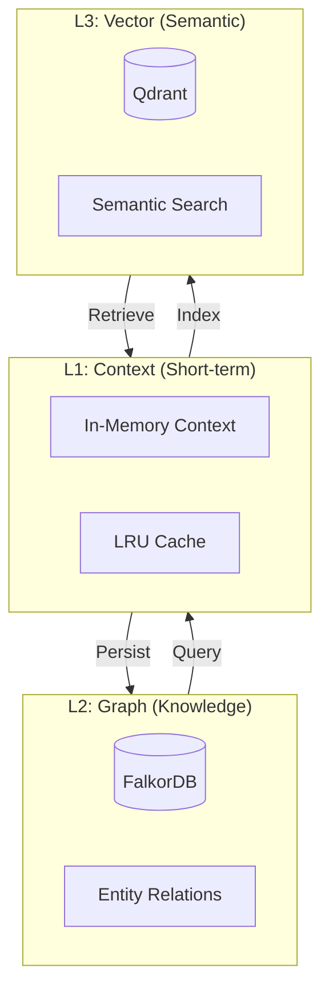
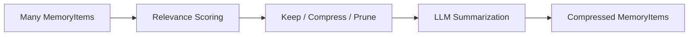

## Overview

The `core/memory` module is the **cognitive backbone** of BaselithCore, implementing an intelligent three-tier memory architecture that balances performance, semantic richness, and long-term knowledge retention.

**Key Benefits**:

- **Scalable Context** - Handle conversations with 1000+ messages without LLM context overflow
- **Semantic Recall** - Retrieve relevant past conversations via vector similarity
- **Knowledge Graphs** - Model entity relationships for deeper understanding
- **Intelligent Compression** - Automatically summarize old history to preserve context window
- **Multi-Session** - Isolate and manage memory across multiple concurrent conversations

**Core Capabilities**:

1. **L1 (Short-term)** - Fast in-memory cache for recent messages
2. **L2 (Knowledge Graph)** - Structured entity relationships via FalkorDB
3. **L3 (Semantic)** - Vector embeddings for similarity search via Qdrant

### Why Multi-Tier Memory?

Conversational agents face the **context window limitation** problem. LLMs can only process a limited number of tokens (~4K-128K depending on model). Without memory management:

- **Context Overflow** - Long conversations exceed LLM limits, truncating important history
- **Lost Context** - Relevant information from 50 messages ago becomes inaccessible
- **No Relationships** - Cannot model "User mentioned Paris in session 1, Rome in session 3"
- **Linear Search** - Finding relevant past context requires scanning entire history

The three-tier architecture solves these by combining **speed** (L1), **structure** (L2), and **semantics** (L3).

## When to Use

Use `core/memory` when building conversational agents that require:

**When to Use Memory System For**:

| Use Case                 | Benefit                                   | Memory Tier Used          |
| ------------------------ | ----------------------------------------- | ------------------------- |
| **Chat History**         | Maintain conversation context             | L1 (Recent) + L3 (Search) |
| **Multi-Turn Reasoning** | Reference previous statements             | L1 + L2 (Graph)           |
| **Personalization**      | Remember user preferences across sessions | L2 (Knowledge Graph)      |
| **Semantic Search**      | "Find when user asked about weather"      | L3 (Vector)               |
| **Long Conversations**   | Handle 100+ message threads               | L1 (Compression)          |

**Consider Alternatives When**:

| Scenario                | Use Instead                 | Reason                           |
| ----------------------- | --------------------------- | -------------------------------- |
| **Static Knowledge**    | RAG pipeline with vector DB | No conversation state needed     |
| **Stateless Requests**  | Direct LLM call             | No history required              |
| **Real-time Streaming** | In-memory buffer only       | Persistence overhead unnecessary |

**❌ Anti-Patterns**:

- Using memory for **static documents** (use `plugins/document_sources` + Qdrant directly)
- Storing **large files** in messages (use file storage + references)
- Bypassing compression for **infinite history** (will cause OOM)

### Implementations

- **[Hierarchical Memory](hierarchical-memory.md)**: The strict STM/MTM/LTM implementation.
- **[Supermemory](supermemory.md)**: Cloud-native intelligent memory with automatic fact extraction, user profiles, and hybrid search.

### Efficiency Features

#### Proactive Context Folding (AgentFold)

The `ContextFolder` reduces token usage by summarizing older conversation turns while keeping recent ones verbatim.

```python
from core.memory.folding import ContextFolder, FoldingConfig

folder = ContextFolder(config=FoldingConfig(keep_latest_n=3))
# history is a list[MemoryItem]
compressed_history = await folder.fold(history)
# Result: "[Previous context: ... summary ...] \n [User]: recent..."
```

#### Memory Metrics

Monitor memory system performance with `MemoryMetricsCollector`.

```python
from core.memory.metrics import MemoryMetricsCollector

collector = MemoryMetricsCollector()
with collector.track_operation("recall") as tracker:
    results = await memory.recall("query")
    tracker.set_cache_hit(True)

print(collector.get_metrics().to_dict())
```

---

## Multi-Tier Architecture



### How It Works

**L1: Short-Term / Working Memory**

- **Storage**: In-process buffer inside `AgentMemory` (a Python list)
- **Capacity**: `working_memory_limit` items (default 10; oldest evicted first)
- **Purpose**: Fast retrieval for the most recent turns

**L2: Knowledge Graph**

- **Default**: `SimpleGraphMemoryProvider` — a lightweight **in-memory**
  adjacency list (no external DB required)
- **Purpose**: Model "User X works_at Y", multi-hop reasoning
- **Scale-out**: back it with a graph DB (e.g. RedisGraph via `GRAPH_DB_URL`)
  for production-size graphs

**L3: Semantic Search**

- **Storage**: Vector store (Qdrant) via `VectorMemoryProvider`
- **Purpose**: "Find all memories similar to current query"
- **Retrieval**: Cosine similarity on embeddings (via shared
  `core.utils.similarity`)

**Memory Flow**:

1. **New memory** (`add_memory` / `remember`) → added to L1 working memory;
   if `memory_type != SHORT_TERM` and a provider is set, also persisted
2. **Embedding Generated** → computed by the embedder when available
3. **Relationships** → optionally stored in the graph provider (L2)
4. **Aging** → `compress_old_memories` summarizes/prunes older items
5. **Query Time** (`recall`) → blends working memory with provider results

---

## Module Structure

```text
core/memory/
├── __init__.py        # Public exports
├── manager.py         # AgentMemory (the main coordinator)
├── mixins/            # storage / search / optimization / context mixins
├── hierarchy.py       # HierarchicalMemory (STM/MTM/LTM)
├── types.py           # MemoryType enum + MemoryItem dataclass
├── providers.py             # VectorMemoryProvider + InMemoryProvider
├── graph_provider.py        # SimpleGraphMemoryProvider (in-memory graph)
├── supermemory_provider.py  # SupermemoryProvider + SupermemoryContextProvider
├── compression.py           # MemoryCompressor + RelevanceCalculator
├── folding.py               # ContextFolder for token optimization
├── metrics.py               # Memory performance metrics
├── scratchpad.py            # Agent-written section memory
├── hybrid_search.py         # BM25Index + HybridSearcher (RRF)
└── interfaces.py            # MemoryProvider / ContextProvider protocols

core/utils/
├── __init__.py        # Public exports
├── similarity.py      # Shared numpy-based cosine similarity
└── tokens.py          # Token estimation (tiktoken + heuristic fallback)
```

---

## AgentMemory

`AgentMemory` is the central coordinator for memory. It is composed from
storage, search, optimization, and context mixins. A process-wide singleton is
available via `get_memory()`.

```python
from core.memory import AgentMemory, MemoryType

memory = AgentMemory()  # provider/embedder optional; defaults to working memory

# Store memories
await memory.add_memory(
    "User prefers concise answers",
    memory_type=MemoryType.ENTITY,
)
await memory.remember(
    "Discussed Q3 roadmap",
    memory_type=MemoryType.EPISODIC,
    importance=0.8,
)

# Semantic recall across working + persisted memory
results = await memory.recall("user preferences", limit=5)

# Prompt-ready context string (uses ContextFolder when configured)
context = await memory.get_context_async(max_tokens=2000)
```

### API Reference

```python
class AgentMemory(StorageMixin, SearchMixin, OptimizationMixin, ContextMixin):
    def __init__(
        self,
        provider: MemoryProvider | None = None,
        graph_provider: "GraphMemoryProvider" | None = None,
        embedder: "EmbedderProtocol" | None = None,
        similarity_threshold: float = 0.7,
        short_term_limit: int = 50,
        working_memory_limit: int = 10,
        context_folder: "ContextFolder" | None = None,
    ) -> None: ...

    async def add_memory(
        self,
        content: str,
        memory_type: MemoryType = MemoryType.SHORT_TERM,
        metadata: dict | None = None,
    ) -> MemoryItem: ...

    async def remember(
        self,
        content: str,
        memory_type: MemoryType = MemoryType.SHORT_TERM,
        importance: float = 0.5,
        metadata: dict | None = None,
    ) -> MemoryItem: ...

    async def recall(
        self,
        query: str,
        memory_types: list[MemoryType] | None = None,
        limit: int = 5,
        memory_type: MemoryType | None = None,
        include_working: bool = True,
    ) -> list[MemoryItem]: ...

    async def get_context_async(self, max_tokens: int = 2000) -> str: ...

    async def compress_old_memories(
        self,
        days_threshold: int = 7,
        strategy: str = "summarization",
        batch_limit: int = 500,
    ) -> "CompressionResult" | None: ...
```

---

## Data Structures

### MemoryType

```python
class MemoryType(Enum):
    SHORT_TERM = "short_term"  # Working memory, context window
    LONG_TERM = "long_term"    # Knowledge base, vector store
    EPISODIC = "episodic"      # Past experiences, event logs
    ENTITY = "entity"          # Profiles, user preferences, facts
```

### MemoryItem

```python
@dataclass
class MemoryItem:
    content: str
    memory_type: MemoryType
    id: UUID = field(default_factory=uuid4)
    created_at: datetime = field(default_factory=lambda: datetime.now(timezone.utc))
    metadata: dict[str, Any] = field(default_factory=dict)
    score: float = 1.0            # Relevance/importance, 0.0–1.0
    embedding: list[float] | None = None

    def to_dict(self) -> dict[str, Any]: ...

    @classmethod
    def from_dict(cls, data: dict[str, Any]) -> "MemoryItem": ...
```

`MemoryEntry` is an alias of `MemoryItem` kept for backward compatibility.

---

## Memory Compression

Older memories can be compressed via `MemoryCompressor`. From `AgentMemory`,
call `compress_old_memories(...)`; to drive compression directly, use the
compressor with a list of `MemoryItem`s.

```python
from core.memory.compression import MemoryCompressor, CompressionStrategy

compressor = MemoryCompressor()

# memories: list[MemoryItem]
compressed, result = await compressor.compress(
    memories,
    strategy=CompressionStrategy.SUMMARIZATION,
)
print(result.compression_ratio)
```

### Compression Process



### Relevance Calculator

```python
from core.memory.compression import RelevanceCalculator

calculator = RelevanceCalculator()

# Exponential time decay + access-frequency boost
score = calculator.calculate_score(
    item=item,                 # a MemoryItem
    access_count=3,
    last_accessed=None,
)
```

### Compression Strategies

```python
class CompressionStrategy(str, Enum):
    SUMMARIZATION = "summarization"  # LLM-based summary
    CLUSTERING = "clustering"        # Semantic clustering via embeddings
    PRUNING = "pruning"              # Remove low-relevance items
```

All similarity computations use the shared `core.utils.similarity.cosine_similarity` (numpy-based).

---

## Storage Providers

`core/memory/providers.py` ships two `MemoryProvider` implementations.

### VectorMemoryProvider

Persists `MemoryItem`s to the vector store for semantic retrieval.

```python
from core.memory.providers import VectorMemoryProvider
from core.memory import MemoryItem, MemoryType

provider = VectorMemoryProvider(collection_name="agent_memory", embedder=embedder)

await provider.add(MemoryItem(content="hello", memory_type=MemoryType.LONG_TERM))
results = await provider.search("greeting", limit=5)
```

### InMemoryProvider

A lightweight, dependency-free provider useful for tests and local runs.

```python
from core.memory.providers import InMemoryProvider

provider = InMemoryProvider()
memory = AgentMemory(provider=provider)
```

### Supermemory Provider

Cloud-native intelligent memory with automatic fact extraction and user profiles. See the dedicated **[Supermemory](supermemory.md)** page for full documentation.

```python
from core.memory import SupermemoryProvider, SupermemoryContextProvider

# Drop-in MemoryProvider replacement
provider = SupermemoryProvider(container_tag="user_42")
await provider.add(MemoryItem(content="User prefers dark mode", memory_type=MemoryType.ENTITY))
results = await provider.search("UI preferences")

# Prompt-ready context string (profile + relevant memories)
ctx = SupermemoryContextProvider(container_tag="user_42")
system_ctx = await ctx.get_context("current user task")
```

---

### Graph Memory Provider (GraphRAG)

Knowledge graph integration for entity relationship tracking and multi-hop reasoning.

```python
from core.memory.graph_provider import SimpleGraphMemoryProvider
from core.memory.manager import AgentMemory

# Create graph provider
graph = SimpleGraphMemoryProvider()

# Add entity relationships
await graph.add_relation(
    source="User_Alice",
    relation="works_at",
    target="Company_TechCorp",
    weight=1.0
)

await graph.add_relation(
    source="Company_TechCorp",
    relation="located_in",
    target="City_SanFrancisco",
    weight=0.9
)

# Integrate with AgentMemory
memory = AgentMemory(
    provider=postgres_provider,
    graph_provider=graph,
    embedder=embedder_service
)

# Query expands through graph relationships
results = await graph.query_graph(
    query="Where does Alice work?",
    limit=10
)
# Returns: [
# {"source": "User_Alice", "relation": "works_at", "target": "Company_TechCorp", "weight": 1.0},
# {"source": "Company_TechCorp", "relation": "located_in", "target": "City_SanFrancisco", "weight": 0.9}
# ]

# Get direct neighbors
neighbors = await graph.get_neighbors(
    node="User_Alice",
    relation="works_at"  # Optional filter
)
```

**Use Cases**:

- **Entity Tracking**: Model relationships between users, documents, concepts
- **Multi-Hop Reasoning**: "Alice works at TechCorp, which is in SF, which has policy X"
- **Swarm Intelligence**: Share structural knowledge across agents (see [Swarm Module](swarm.md))
- **Contextual Grounding**: Enrich semantic search with relationship data

**Performance**: Lightweight in-memory adjacency list. For production scale (>10K nodes), use FalkorDB via Redis connection.

---

## Integration with the agent loop

```python
from core.memory import AgentMemory, MemoryType

memory = AgentMemory(provider=provider, embedder=embedder)

# 1. Enrich the prompt with relevant past memories
relevant = await memory.recall(query, limit=5)

# 2. Process the request with that context...
#    (e.g. pass into your handler / LLM call)

# 3. Persist the new turn
await memory.add_memory(query, memory_type=MemoryType.EPISODIC)
await memory.add_memory(answer, memory_type=MemoryType.EPISODIC)

# 4. Periodically reclaim space
await memory.compress_old_memories(days_threshold=7)
```

!!! note "AgentMemory and the Orchestrator"
    `Orchestrator.__init__` accepts an optional `memory_manager: AgentMemory`
    which is exposed to handlers via the orchestration context.

---

## Configuration

`AgentMemory` is configured through constructor arguments
(`similarity_threshold`, `short_term_limit`, `working_memory_limit`,
`provider`, `embedder`, `context_folder`) — there are no dedicated
`MEMORY_*` environment variables.

The optional [Supermemory](supermemory.md) layer is configured separately via
`SUPERMEMORY_*` variables (see the [Configuration](config.md) page), and the
underlying vector/Redis backends use `VECTORSTORE_*` / `CACHE_REDIS_URL`
from `StorageConfig` / `VectorStoreConfig`.

---

## Best Practices

!!! tip "Context Window Optimization"
    - Keep `working_memory_limit` low (10–50) for LLM performance
    - Use `compress_old_memories` to preserve historical information
    - Leverage `recall` to retrieve relevant context

!!! tip "Choosing a provider"
    - Use `InMemoryProvider` for tests and local development
    - Use `VectorMemoryProvider` for semantic persistence
    - Add a `SimpleGraphMemoryProvider` for relationship-aware reasoning

---

## Scratchpad — agent-written section memory

`core/memory/scratchpad.py` provides a section-organized scratchpad
that an agent writes during a run and re-reads to refocus on the goal.
Distinct from STM/MTM/LTM because it is *written by the agent itself*
and bounded per-section.

### Public API

| Symbol | Purpose |
|--------|---------|
| `Scratchpad` | High-level facade over a `ScratchpadBackend` |
| `ScratchpadBackend` | Protocol for storage (in-memory default; pluggable to Redis/Postgres) |
| `InMemoryScratchpadBackend` | Thread-isolated default backend |
| `ScratchpadOverflowError` | Raised when a section byte cap or section count cap is exceeded |

Defaults: 8 KB per section, 32 sections per thread. Threads are isolated
by `thread_id` so concurrent sessions cannot read each other's notes.

### Example

```python
from core.memory.scratchpad import Scratchpad

pad = Scratchpad()
pad.update_section("user-42", "goal", "synthesize Q3 report")
pad.update_section("user-42", "plan", "1. fetch metrics\n2. summarize\n3. publish")

# Re-read mid-loop to refocus
goal = pad.read_section("user-42", "goal")

# Splice everything into the system prompt
full = pad.read_all("user-42")
```

Expose `update_scratchpad(section, content)` and
`read_scratchpad(section?)` as tools so the agent can write to and
read from its own scratchpad without escaping the runtime.

---

## Hybrid retrieval — BM25 + Reciprocal Rank Fusion

`core/memory/hybrid_search.py` complements dense vector search with a
pure-Python BM25 index and a Reciprocal Rank Fusion (RRF) fuser. Dense
retrieval misses exact matches (error codes, identifiers, rare terms);
BM25 misses semantic neighbours. Fusing both catches both.

### Public API

| Symbol | Purpose |
|--------|---------|
| `BM25Index` | In-memory BM25Okapi index. `index({doc_id: text})` then `search(query, top_k)` |
| `HybridSearcher` | RRF fuser over independent ranked lists |
| `ScoredHit` | Frozen dataclass: `doc_id` + `score` |

Defaults: BM25 `k1=1.5`, `b=0.75`; RRF `k=60`; equal 0.5/0.5 weights.
Tune per-domain (legal text favours BM25; general knowledge favours
dense).

### Example: fuse keyword + dense

```python
from core.memory.hybrid_search import BM25Index, HybridSearcher, ScoredHit

bm25 = BM25Index()
bm25.index({d.id: d.text for d in corpus})

bm25_hits = bm25.search("error ERR_742", top_k=20)

# dense_hits comes from your existing vector provider
dense_hits = [ScoredHit(doc_id=h.id, score=h.score) for h in vector_provider.search(q)]

fused = HybridSearcher().fuse(bm25=bm25_hits, dense=dense_hits, top_k=3)
```

Feed `fused` into the existing reranker in
[`core/chat/reranking.py`](https://github.com/baselithcore/baselithcore/blob/main/core/chat/reranking.py)
for a final cross-encoder pass.
