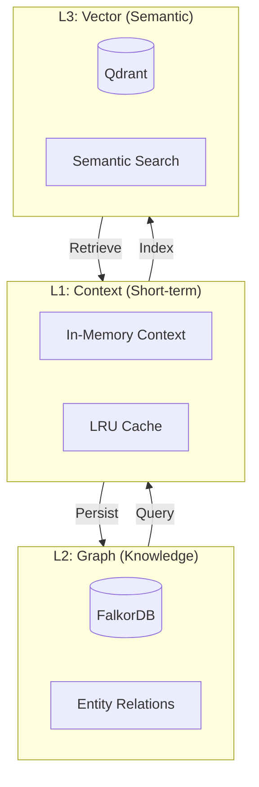

## Overview

The `core/memory` module is the **cognitive backbone** of BaselithCore, implementing an intelligent three-tier memory architecture that balances performance, semantic richness, and long-term knowledge retention.

**Key Benefits**:

- **Scalable Context** - Handle conversations with 1000+ messages without LLM context overflow
- **Semantic Recall** - Retrieve relevant past conversations via vector similarity
- **Knowledge Graphs** - Model entity relationships for deeper understanding
- **Intelligent Compression** - Automatically summarize old history to preserve context window
- **Multi-Session** - Isolate and manage memory across multiple concurrent conversations

**Core Capabilities**:

1. **L1 (Short-term)** - Fast in-memory cache for recent messages
2. **L2 (Knowledge Graph)** - Structured entity relationships via FalkorDB
3. **L3 (Semantic)** - Vector embeddings for similarity search via Qdrant

### Why Multi-Tier Memory?

Conversational agents face the **context window limitation** problem. LLMs can only process a limited number of tokens (~4K-128K depending on model). Without memory management:

- **Context Overflow** - Long conversations exceed LLM limits, truncating important history
- **Lost Context** - Relevant information from 50 messages ago becomes inaccessible
- **No Relationships** - Cannot model "User mentioned Paris in session 1, Rome in session 3"
- **Linear Search** - Finding relevant past context requires scanning entire history

The three-tier architecture solves these by combining **speed** (L1), **structure** (L2), and **semantics** (L3).

## When to Use

Use `core/memory` when building conversational agents that require:

**When to Use Memory System For**:

| Use Case                 | Benefit                                   | Memory Tier Used          |
| ------------------------ | ----------------------------------------- | ------------------------- |
| **Chat History**         | Maintain conversation context             | L1 (Recent) + L3 (Search) |
| **Multi-Turn Reasoning** | Reference previous statements             | L1 + L2 (Graph)           |
| **Personalization**      | Remember user preferences across sessions | L2 (Knowledge Graph)      |
| **Semantic Search**      | "Find when user asked about weather"      | L3 (Vector)               |
| **Long Conversations**   | Handle 100+ message threads               | L1 (Compression)          |

**Consider Alternatives When**:

| Scenario                | Use Instead                 | Reason                           |
| ----------------------- | --------------------------- | -------------------------------- |
| **Static Knowledge**    | RAG pipeline with vector DB | No conversation state needed     |
| **Stateless Requests**  | Direct LLM call             | No history required              |
| **Real-time Streaming** | In-memory buffer only       | Persistence overhead unnecessary |

**❌ Anti-Patterns**:

- Using memory for **static documents** (use `plugins/document_sources` + Qdrant directly)
- Storing **large files** in messages (use file storage + references)
- Bypassing compression for **infinite history** (will cause OOM)

### Implementations

- **[Hierarchical Memory](hierarchical-memory.md)**: The strict STM/MTM/LTM implementation.
- **[Supermemory](supermemory.md)**: Cloud-native intelligent memory with automatic fact extraction, user profiles, and hybrid search.

### Efficiency Features

#### Proactive Context Folding (AgentFold)

The `ContextFolder` reduces token usage by summarizing older conversation turns while keeping recent ones verbatim.

```python
from core.memory.folding import ContextFolder, FoldingConfig

folder = ContextFolder(config=FoldingConfig(keep_latest_n=3))
# history is a list[MemoryItem]
compressed_history = await folder.fold(history)
# Result: "[Previous context: ... summary ...] \n [User]: recent..."
```

Set `MEMORY_CONTEXT_FOLDING_ENABLED=true` to wire a `ContextFolder` into
every `AgentMemory` automatically (default off = truncation as before).
`get_context_async` then uses `fold_if_needed`: below
`MEMORY_CONTEXT_FOLD_THRESHOLD_CHARS` (default 2000) the verbatim fast-path
runs with no LLM call; above it, older turns are summarized and recent ones
kept verbatim. The orchestrator also shrinks its memory-context allowance
when the request has consumed >80% of its `LoopBudget` token cap
(`token_pressure()`), so context assembly can't push a run over the cap.

Folded summaries are **memoized by content hash** (SHA-256 over the folded
items, 32-entry FIFO): an unchanged block of older turns is summarized once,
not re-summarized with a fresh LLM call on every request — the folding sits on
the orchestration hot path, so without the memo each turn paid one summary
call for context that had not moved.

#### Memory Metrics

Monitor memory system performance with `MemoryMetricsCollector`.

```python
from core.memory.metrics import MemoryMetricsCollector

collector = MemoryMetricsCollector()
with collector.track_operation("recall") as tracker:
    results = await memory.recall("query")
    tracker.set_cache_hit(True)

print(collector.get_metrics().to_dict())
```

The operation history is a `deque(maxlen=max_history)`, so eviction past the
cap is O(1) instead of an O(n) list slice per record.

---

## Multi-Tier Architecture


```mermaid
graph TB
    subgraph L1["L1: Context (Short-term)"]
        Context[In-Memory Context]
        LRU[LRU Cache]
    end

    subgraph L2["L2: Graph (Knowledge)"]
        Graph[(FalkorDB)]
        Relations[Entity Relations]
    end

    subgraph L3["L3: Vector (Semantic)"]
        Vector[(Qdrant)]
        Embeddings[Semantic Search]
    end

    L1 --> |Persist| L2
    L1 --> |Index| L3
    L2 --> |Query| L1
    L3 --> |Retrieve| L1
```

### How It Works

**L1: Short-Term / Working Memory**

- **Storage**: In-process buffer inside `AgentMemory` (a Python list)
- **Capacity**: `working_memory_limit` items (default 10; oldest evicted first)
- **Purpose**: Fast retrieval for the most recent turns

**L2: Knowledge Graph**

- **Default**: `SimpleGraphMemoryProvider` — a lightweight **in-memory**
  adjacency list (no external DB required)
- **Purpose**: Model "User X works_at Y", multi-hop reasoning
- **Scale-out**: back it with a graph DB (e.g. RedisGraph via `GRAPH_DB_URL`)
  for production-size graphs

**L3: Semantic Search**

- **Storage**: Vector store (Qdrant) via `VectorMemoryProvider`
- **Purpose**: "Find all memories similar to current query"
- **Retrieval**: Cosine similarity on embeddings (via shared
  `core.utils.similarity`)

**Memory Flow**:

1. **New memory** (`add_memory` / `remember`) → added to L1 working memory;
   if `memory_type != SHORT_TERM` and a provider is set, also persisted
2. **Embedding Generated** → computed by the embedder when available
3. **Relationships** → optionally stored in the graph provider (L2)
4. **Aging** → `compress_old_memories` summarizes/prunes older items
5. **Query Time** (`recall`) → blends working memory with provider results

---

## Module Structure

```text
core/memory/
├── __init__.py        # Public exports
├── manager.py         # AgentMemory (the main coordinator)
├── mixins/            # storage / search / optimization / context mixins
├── hierarchy.py       # HierarchicalMemory (STM/MTM/LTM)
├── types.py           # MemoryType enum + MemoryItem dataclass
├── providers.py             # VectorMemoryProvider + InMemoryProvider
├── graph_provider.py        # SimpleGraphMemoryProvider (in-memory graph)
├── supermemory_provider.py  # SupermemoryProvider + SupermemoryContextProvider
├── compression.py           # MemoryCompressor + RelevanceCalculator
├── optimization_batch.py    # add_items / delete_items — batch-or-fan-out provider I/O
├── folding.py               # ContextFolder for token optimization
├── metrics.py               # Memory performance metrics
├── scratchpad.py            # Agent-written section memory
├── hybrid_search.py         # BM25Index + HybridSearcher (RRF)
├── embedding_compat.py      # encode_flexible — uniform sync/async embedder call
└── interfaces.py            # MemoryProvider / ContextProvider protocols

core/utils/
├── __init__.py        # Public exports
├── similarity.py      # Shared numpy-based cosine similarity
├── text_canon.py      # canonicalize / canonical_key — Unicode canonicalization for keys
└── tokens.py          # Token estimation (tiktoken + heuristic fallback)
```

!!! note "Embedders may be sync or async"
    Every embedder invocation in the memory layer goes through
    `core.memory.embedding_compat.encode_flexible`: an async `encode` is
    awaited, a plain sync `encode` is offloaded to a worker thread
    (`asyncio.to_thread`), and numpy output is normalized via `tolist()`.
    Call sites that previously awaited `embedder.encode(...)` directly either
    blocked the event loop with a sync embedder or raised `TypeError` inside a
    broad `except` — silently degrading recall to keyword search.

---

## AgentMemory

`AgentMemory` is the central coordinator for memory. It is composed from
storage, search, optimization, and context mixins. A process-wide singleton is
available via `get_memory()`.

```python
from core.memory import AgentMemory, MemoryType

memory = AgentMemory()  # provider/embedder optional; defaults to working memory

# Store memories
await memory.add_memory(
    "User prefers concise answers",
    memory_type=MemoryType.ENTITY,
)
await memory.remember(
    "Discussed Q3 roadmap",
    memory_type=MemoryType.EPISODIC,
    importance=0.8,
)

# Semantic recall across working + persisted memory
results = await memory.recall("user preferences", limit=5)

# Prompt-ready context string (uses ContextFolder when configured)
context = await memory.get_context_async(max_tokens=2000)
```

### API Reference

```python
class AgentMemory(StorageMixin, SearchMixin, OptimizationMixin, ContextMixin):
    def __init__(
        self,
        provider: MemoryProvider | None = None,
        graph_provider: "GraphMemoryProvider" | None = None,
        embedder: "EmbedderProtocol" | None = None,
        similarity_threshold: float = 0.7,
        short_term_limit: int = 50,
        working_memory_limit: int = 10,
        context_folder: "ContextFolder" | None = None,
        llm_service: Any | None = None,
    ) -> None: ...

    async def add_memory(
        self,
        content: str,
        memory_type: MemoryType = MemoryType.SHORT_TERM,
        metadata: dict | None = None,
    ) -> MemoryItem: ...

    async def remember(
        self,
        content: str,
        memory_type: MemoryType = MemoryType.SHORT_TERM,
        importance: float = 0.5,
        metadata: dict | None = None,
    ) -> MemoryItem: ...

    async def recall(
        self,
        query: str,
        memory_types: list[MemoryType] | None = None,
        limit: int = 5,
        memory_type: MemoryType | None = None,
        include_working: bool = True,
        min_score: float | None = None,
    ) -> list[MemoryItem]: ...

    async def get_context_async(self, max_tokens: int = 2000) -> str: ...
```

`similarity_threshold` gates **every** tier of `recall`: working memory
already filtered at it, and provider (long-term) hits are now held to the same
bar — passed to `provider.search(min_score=...)` and re-checked on the
returned scores, so a weak vector-store neighbour is not injected into the
prompt as noise. `min_score` overrides the gate per call (`0.0` restores
ungated recall).

`llm_service` is the summarizer compaction uses. Without one,
`compress_old_memories` refuses to run rather than fold a batch of memories
into a truncation of three of them — see
[What compaction requires](#what-compaction-requires).

```python

    async def compress_old_memories(
        self,
        days_threshold: int = 7,
        strategy: str = "summarization",
        batch_limit: int = 500,
        prune: bool = False,
    ) -> "CompressionResult" | None: ...
```

---

## Data Structures

### MemoryType

```python
class MemoryType(Enum):
    SHORT_TERM = "short_term"  # Working memory, context window
    LONG_TERM = "long_term"    # Knowledge base, vector store
    EPISODIC = "episodic"      # Past experiences, event logs
    ENTITY = "entity"          # Profiles, user preferences, facts
```

### MemoryItem

```python
@dataclass
class MemoryItem:
    content: str
    memory_type: MemoryType
    id: UUID = field(default_factory=uuid4)
    created_at: datetime = field(default_factory=lambda: datetime.now(timezone.utc))
    metadata: dict[str, Any] = field(default_factory=dict)
    score: float = 1.0            # Relevance/importance, 0.0–1.0
    embedding: list[float] | None = None

    def to_dict(self) -> dict[str, Any]: ...

    @classmethod
    def from_dict(cls, data: dict[str, Any]) -> "MemoryItem": ...
```

`MemoryEntry` is an alias of `MemoryItem` kept for backward compatibility.

---

## Memory Compression

Older memories can be compressed via `MemoryCompressor`. From `AgentMemory`,
call `compress_old_memories(...)`; to drive compression directly, use the
compressor with a list of `MemoryItem`s.

```python
from core.memory.compression import MemoryCompressor, CompressionStrategy

compressor = MemoryCompressor(llm_service=llm_service)

# memories: list[MemoryItem]
compressed, result = await compressor.compress(
    memories,
    strategy=CompressionStrategy.SUMMARIZATION,
)
print(result.compression_ratio)
```

`MemoryCompressor` without an `llm_service` still produces a "summary": the
fallback is `" | ".join(m.content[:100] for m in memories[:3])`. Driving the
compressor yourself, that is your call to make; through `AgentMemory` it is
refused, because there the summary replaces the originals.

### What compaction requires

`compress_old_memories` is destructive — the items folded into a summary are
deleted once it is written — so three preconditions gate a run. None of them
degrades the run: the first two abort it and return `None`, the third leaves
the sources in place:

| Precondition | Why | Without it |
| --- | --- | --- |
| A provider that can enumerate (`list_items`) | What gets deleted must be what was read | Returns `None`, logged as `memory_compression_unsupported` |
| An `llm_service` on the `AgentMemory` | A summary that is a truncation of three items is data loss, not compression | Returns `None`, logged as `memory_compression_skipped_no_summarizer` |
| Summaries that record their `source_ids` | Only the items a summary actually absorbed may be deleted | The summary is written and nothing is deleted — space, not a memory, is what is lost |

The batch used to come from `provider.search("")` — the nearest neighbours of
the empty string's embedding, an arbitrary slice that changed between runs —
and afterwards *every* id it had returned was deleted, including the items the
compressor had scored high enough to keep. Enumeration
([`list_items`](#enumerating-a-provider)) is what makes the read deterministic.

The write order changed with it: the summaries are added **before** their
sources are deleted, so a crash between the two phases leaves a recoverable
duplicate rather than a hole.

### Pruning is opt-in

The relevance calculator also classifies items below `pruning_threshold` (and
past `max_age_days`) as prune candidates and drops them from the compressor's
output. Deleting those is a discard, not a compression — nothing is written in
their place — so it is a separate, off-by-default request:

```python
result = await memory.compress_old_memories(days_threshold=7)
result.pruned_count   # candidates the decay curve aged out — counted, not deleted

result = await memory.compress_old_memories(days_threshold=7, prune=True)
# now those candidates are deleted alongside the folded sources
```

`pruned_count` is reported either way, so the count can be reviewed before the
deletion is authorised. The old delete-everything-we-read step performed that
discard as a silent side effect of every compaction run.

### Compression Process


```mermaid
flowchart LR
    Memories[Many MemoryItems] --> Relevance[Relevance Scoring]
    Relevance --> Classify[Keep / Compress / Prune]
    Classify --> Summary[LLM Summarization]
    Summary --> Compressed[Compressed MemoryItems]
```

### Relevance Calculator

```python
from core.memory.compression import RelevanceCalculator

calculator = RelevanceCalculator()

# Exponential time decay + access-frequency boost
score = calculator.calculate_score(
    item=item,                 # a MemoryItem
    access_count=3,
    last_accessed=None,
)
```

### Compression Strategies

```python
class CompressionStrategy(str, Enum):
    SUMMARIZATION = "summarization"  # LLM-based summary
    CLUSTERING = "clustering"        # Semantic clustering via embeddings
    PRUNING = "pruning"              # Remove low-relevance items
```

All similarity computations use the shared `core.utils.similarity.cosine_similarity` (numpy-based).
For the clustering strategy, both the batched `encode()` pass and the
pairwise-similarity/greedy-clustering pass run on the dedicated inference
executor (`core.utils.concurrency.run_inference`), keeping the CPU-bound work
off the event loop. The offload carries the caller's `contextvars` (tenant,
trace) into the worker — see
[NLP › Where inference runs](nlp.md#where-inference-runs).

---

## Storage Providers

`core/memory/providers.py` ships two `MemoryProvider` implementations.

### VectorMemoryProvider

Persists `MemoryItem`s to the vector store for semantic retrieval.

```python
from core.memory.providers import VectorMemoryProvider
from core.memory import MemoryItem, MemoryType

provider = VectorMemoryProvider(collection_name="agent_memory", embedder=embedder)

await provider.add(MemoryItem(content="hello", memory_type=MemoryType.LONG_TERM))
results = await provider.search("greeting", limit=5)

# One embedding pass and one upsert for the whole batch
await provider.add_many([item_a, item_b, item_c])

# One filtered vector-store round-trip for the whole batch of deletes
await provider.delete_many(["id-1", "id-2", "id-3"])
```

`add()` is now a one-item `add_many()`: both funnel into a single
`VectorStoreService.index()` call, which handles a batch end to end. Symmetrically,
`delete_many(item_ids: list[str]) -> None` funnels into
`VectorStoreService.delete_documents()` — one filtered delete for the whole
batch instead of one round-trip per ID.

!!! note "A recalled item keeps the id it was stored under"
    Items are written with `Document.id = str(item.id)`, so the identity
    survives the store and comes back on the payload's `document_id`;
    `search()` restores it on the reconstructed `MemoryItem`. Reconstruction
    used to drop it and let `MemoryItem` mint a fresh uuid, which made every
    read-back unaddressable — a delete keyed on the recalled item's id named a
    row that had never existed, so compaction removed nothing and its
    summaries accumulated next to the originals they were meant to replace.

### Batched maintenance writes

`consolidate()` and `compress_old_memories()` each rewrite a whole batch of
items. Driving them through `MemoryProvider.add()` cost **one embedding call
and one durability-acked upsert per item**, so the ack was amortized over
nothing — a 500-item compaction meant 500 round trips. The same held for the
delete side: `compress_old_memories()` used to issue up to 1000 sequential
`provider.delete()` calls. Both directions now go through
`core.memory.optimization_batch`:

```python
from core.memory.optimization_batch import add_items, delete_items

# Uses provider.add_many(items) / provider.delete_many(item_ids) when the
# provider has them; otherwise falls back to a bounded fan-out of single
# add() / delete() calls.
await add_items(provider, items, fanout_limit=8)
await delete_items(provider, item_ids, fanout_limit=8)
```

`add_many` and `delete_many` are **optional extensions**, discovered by duck
typing — they are not part of the `MemoryProvider` protocol in
`core/memory/interfaces.py`, so existing providers keep working unchanged.
Implement them when your backend can index or delete a batch in one call; skip
them and you get the bounded fan-out (`_PROVIDER_FANOUT_LIMIT = 8` concurrent
round trips, so a large compaction cannot open hundreds at once).

!!! note "Add now precedes delete"
    In `compress_old_memories()` the summaries are written **before** their
    source items are deleted: the summaries are new items, not updates, so a
    crash between the phases leaves a recoverable duplicate rather than a
    hole. (The order used to be the other way round.) With a batch-capable
    provider each phase is **one** round-trip for the whole batch — an upsert
    via `add_items` → `provider.add_many`, then one filtered delete via
    `delete_items` → `provider.delete_many`. Order *within* a phase is
    irrelevant, which is what makes the fan-out, the batch upsert and the
    batch delete safe.

### Enumerating a provider

`list_items(limit=100, offset=None) -> tuple[list[MemoryItem], Any]` is the
deterministic counterpart of `search`. Maintenance work — compaction,
retention — has to know *which* items it is acting on, and a similarity query
cannot answer that: it ranks by distance from some query vector and returns a
different slice whenever the corpus changes.

```python
items, offset = await provider.list_items(limit=200)
while offset is not None:
    page, offset = await provider.list_items(limit=200, offset=offset)
    items.extend(page)
```

`VectorMemoryProvider` pages through the vector store's scroll API;
`InMemoryProvider` walks its insertion order. The second element is the
continuation token for the next page and `None` once the store is exhausted.
Like `add_many`/`delete_many`, `list_items` is an optional extension
discovered by duck typing rather than a method on the `MemoryProvider`
protocol — a provider without it keeps working, and
[compaction](#what-compaction-requires) is the one operation that refuses to
run against it.

### InMemoryProvider

A lightweight, dependency-free provider useful for tests and local runs. It
implements the item-at-a-time protocol plus `list_items`, so batch writes and
deletes take the fan-out path above while compaction can still enumerate it.

```python
from core.memory.providers import InMemoryProvider

provider = InMemoryProvider()
memory = AgentMemory(provider=provider)
```

### Supermemory Provider

Cloud-native intelligent memory with automatic fact extraction and user profiles. See the dedicated **[Supermemory](supermemory.md)** page for full documentation.

```python
from core.memory import SupermemoryProvider, SupermemoryContextProvider

# Drop-in MemoryProvider replacement
provider = SupermemoryProvider(container_tag="user_42")
await provider.add(MemoryItem(content="User prefers dark mode", memory_type=MemoryType.ENTITY))
results = await provider.search("UI preferences")

# Prompt-ready context string (profile + relevant memories)
ctx = SupermemoryContextProvider(container_tag="user_42")
system_ctx = await ctx.get_context("current user task")
```

---

### Graph Memory Provider (GraphRAG)

Knowledge graph integration for entity relationship tracking and multi-hop reasoning.

!!! note "Library API — not wired by default"
    The memory the default app builds has no `graph_provider`; the graph is
    consulted only when you pass one to `AgentMemory(graph_provider=...)`.

```python
from core.memory.graph_provider import SimpleGraphMemoryProvider
from core.memory.manager import AgentMemory

# Create graph provider
graph = SimpleGraphMemoryProvider()

# Add entity relationships
await graph.add_relation(
    source="User_Alice",
    relation="works_at",
    target="Company_TechCorp",
    weight=1.0
)

await graph.add_relation(
    source="Company_TechCorp",
    relation="located_in",
    target="City_SanFrancisco",
    weight=0.9
)

# Integrate with AgentMemory
memory = AgentMemory(
    provider=postgres_provider,
    graph_provider=graph,
    embedder=embedder_service
)

# Query expands through graph relationships
results = await graph.query_graph(
    query="Where does Alice work?",
    limit=10
)
# Returns: [
# {"source": "User_Alice", "relation": "works_at", "target": "Company_TechCorp", "weight": 1.0},
# {"source": "Company_TechCorp", "relation": "located_in", "target": "City_SanFrancisco", "weight": 0.9}
# ]

# Get direct neighbors
neighbors = await graph.get_neighbors(
    node="User_Alice",
    relation="works_at"  # Optional filter
)
```

**Use Cases**:

- **Entity Tracking**: Model relationships between users, documents, concepts
- **Multi-Hop Reasoning**: "Alice works at TechCorp, which is in SF, which has policy X"
- **Swarm Intelligence**: Share structural knowledge across agents (see [Swarm Module](swarm.md))
- **Contextual Grounding**: Enrich semantic search with relationship data

**Performance**: Lightweight in-memory adjacency list. For production scale (>10K nodes), use FalkorDB via Redis connection.

---

## Integration with the agent loop

```python
from core.memory import AgentMemory, MemoryType

# llm_service is what lets step 4 run; without it compaction returns None
memory = AgentMemory(provider=provider, embedder=embedder, llm_service=llm_service)

# 1. Enrich the prompt with relevant past memories
relevant = await memory.recall(query, limit=5)

# 2. Process the request with that context...
#    (e.g. pass into your handler / LLM call)

# 3. Persist the new turn
await memory.add_memory(query, memory_type=MemoryType.EPISODIC)
await memory.add_memory(answer, memory_type=MemoryType.EPISODIC)

# 4. Periodically reclaim space (prune=True also deletes the aged-out items)
await memory.compress_old_memories(days_threshold=7)
```

!!! note "AgentMemory and the Orchestrator"
    `Orchestrator.__init__` accepts an optional `memory_manager: AgentMemory`
    which is exposed to handlers via the orchestration context.

---

## Configuration

`AgentMemory` is configured through constructor arguments
(`similarity_threshold`, `short_term_limit`, `working_memory_limit`,
`provider`, `graph_provider`, `embedder`, `context_folder`, `llm_service`).
The only dedicated `MEMORY_*` environment variables are the runtime knobs on
`MemoryRuntimeConfig` (`core/config/memory.py`, env prefix `MEMORY_`, read via
`get_memory_runtime_config()`):

| Env var | Default | Purpose |
| ------- | ------- | ------- |
| `MEMORY_CONTEXT_FOLDING_ENABLED` | `false` | Wire a `ContextFolder` into every `AgentMemory` (older turns LLM-summarized instead of hard-truncated) — see [Proactive Context Folding](#proactive-context-folding-agentfold) |
| `MEMORY_CONTEXT_FOLD_THRESHOLD_CHARS` | `2000` | Fold only when the assembled context exceeds this many characters; below it the verbatim fast-path runs with no LLM call |
| `MEMORY_PERSISTENCE_ENABLED` | `true` | Back the bootstrapped memory managers with the configured vector store — see [Persistence at bootstrap](#persistence-at-bootstrap) |

### Persistence at bootstrap

The `memory` and `hierarchical_memory` resources built by
`core/bootstrap/lazy_init.py` are constructed **with** a
`VectorMemoryProvider` (collections `agent_memory` and `hierarchical_memory`)
and an embedder, so long-term memories outlive the process and are shared
between workers. Both used to be constructed with no provider at all, and that
is not a degraded mode anyone chose: without one, `HierarchicalMemory`'s
long-term tier is a bounded in-process deque (`ltm.max_items`, default `500`
per tenant) searched by keyword, and an `AgentMemory` long-term write lands in
the working-memory buffer instead of a store. Either way the memories die with
the worker and are invisible to every other one. The bootstrapped
`AgentMemory` also receives an `llm_service`, which is what lets
[compaction](#what-compaction-requires) run.

Set `MEMORY_PERSISTENCE_ENABLED=false` to keep everything in the process
again. The bootstrap logs a warning naming the consequence
(`memory_persistence_disabled` when it is switched off,
`memory_persistence_unavailable` when the provider could not be built — an
unreachable backend does not fail startup) and the long-term tier degrades to
the in-process deque, so every memory is lost on exit.

!!! note "The provider is built off the event loop"
    Constructing the vector client runs a server compatibility check and the
    embedder loads a sentence-transformer model — both synchronous and slow.
    The build runs in a worker thread (`asyncio.to_thread`), so it does not
    stall in-flight requests.

!!! warning "`get_memory()` is a separate, provider-less singleton"
    `core.memory.get_memory()` still returns a bare `AgentMemory()`: no
    provider, no embedder, no `llm_service`. Persistence is wired on the
    lazily-initialized `memory` resource, so reach for it via the lazy
    registry (`get_lazy_registry().get_or_create("memory")`) or pass your own
    provider when you construct an `AgentMemory` yourself.

The optional [Supermemory](supermemory.md) layer is configured separately via
`SUPERMEMORY_*` variables (see the [Configuration](config.md) page), and the
underlying vector/Redis backends use `VECTORSTORE_*` / `CACHE_REDIS_URL`
from `StorageConfig` / `VectorStoreConfig`.

---

## Best Practices

!!! tip "Context Window Optimization"
    - Keep `working_memory_limit` low (10–50) for LLM performance
    - Use `compress_old_memories` to preserve historical information
    - Leverage `recall` to retrieve relevant context

!!! tip "Choosing a provider"
    - Use `InMemoryProvider` for tests and local development
    - Use `VectorMemoryProvider` for semantic persistence
    - Add a `SimpleGraphMemoryProvider` for relationship-aware reasoning

---

## Scratchpad — agent-written section memory

`core/memory/scratchpad.py` provides a section-organized scratchpad
that an agent writes during a run and re-reads to refocus on the goal.
Distinct from STM/MTM/LTM because it is *written by the agent itself*
and bounded per-section.

!!! note "Library API — not wired by default"
    No handler in the default app creates or writes a `Scratchpad`
    (`AgentState.scratchpad_ref` is never set by the running loop). Give one to
    your own handler or tool.

### Public API

| Symbol | Purpose |
|--------|---------|
| `Scratchpad` | High-level facade over a `ScratchpadBackend` |
| `ScratchpadBackend` | Protocol for storage (in-memory default; pluggable) |
| `InMemoryScratchpadBackend` | Thread-isolated default backend |
| `RedisScratchpadBackend` | Durable, tenant-scoped Redis backend (`scratchpad_redis.py`) |
| `ScratchpadOverflowError` | Raised when a section byte cap or section count cap is exceeded |

Defaults: 8 KB per section, 32 sections per thread. Threads are isolated
by `thread_id` so concurrent sessions cannot read each other's notes.

### Durable backend (Redis)

`RedisScratchpadBackend` persists sections across process restarts and
workers — one Redis hash per thread, every operation a single O(1) command.
Security & lifecycle: keys embed the **tenant resolved from the
authenticated context** (`get_current_tenant_id` — never caller input;
fails closed under `strict_tenant_isolation`), and a **sliding TTL**
(`BASELITH_SCRATCHPAD_TTL_SECONDS`, default 86400, `0` disables) expires
abandoned threads instead of accumulating them forever.

Round-trips are minimized on both sides of the wire: `set()` pipelines
`HSET` + `EXPIRE` into one round-trip (falling back to two sequential
commands for clients without pipeline support), and the backend exposes
`get_all(thread_id)` — one `HGETALL` for every section. `Scratchpad.read_all`
sniffs for `get_all` on the backend and prefers it, so a full scratchpad read
costs one command instead of `HKEYS` plus one `HGET` per section.

```python
from core.memory.scratchpad import Scratchpad
from core.memory.scratchpad_redis import RedisScratchpadBackend

pad = Scratchpad(RedisScratchpadBackend())   # cache Redis URL from config
```

### Example

```python
from core.memory.scratchpad import Scratchpad

pad = Scratchpad()
pad.update_section("user-42", "goal", "synthesize Q3 report")
pad.update_section("user-42", "plan", "1. fetch metrics\n2. summarize\n3. publish")

# Re-read mid-loop to refocus
goal = pad.read_section("user-42", "goal")

# Splice everything into the system prompt
full = pad.read_all("user-42")
```

Expose `update_scratchpad(section, content)` and
`read_scratchpad(section?)` as tools so the agent can write to and
read from its own scratchpad without escaping the runtime.

### Async surface

Inside an agent loop, the synchronous methods are a full Redis round-trip on the
event loop. Every one has an `a`-prefixed twin, and both surfaces share the same
validation and caps (`_validate`, `_check_section_budget`, `_render`) so they
cannot drift:

| Sync | Async |
|---|---|
| `update_section(thread_id, section, content)` | `aupdate_section(...)` |
| `read_section(thread_id, section)` | `aread_section(...)` |
| `clear_section(thread_id, section)` | `aclear_section(...)` |
| `list_sections(thread_id)` | `alist_sections(...)` |
| `read_all(thread_id)` | `aread_all(...)` |
| `clear(thread_id)` | `aclear(...)` |

```python
pad = Scratchpad(RedisScratchpadBackend())

await pad.aupdate_section("user-42", "goal", "synthesize Q3 report")
goal = await pad.aread_section("user-42", "goal")
full = await pad.aread_all("user-42")
```

The `ScratchpadBackend` protocol gained the matching backend hooks — `aget`,
`aset`, `adelete`, `alist`, `aclear` — and `InMemoryScratchpadBackend`
implements them (plus `get_all` / `aget_all`).

!!! info "A sync-only backend still works, and still does not block the loop"
    `Scratchpad` prefers the backend's `a*` coroutine and otherwise offloads the
    synchronous method with `asyncio.to_thread`. A third-party backend written
    before the async protocol existed keeps working unchanged. Likewise
    `aread_all` prefers `aget_all` (one `HGETALL`), then offloads a synchronous
    `get_all`, and only then falls back to one `get` per section.

`RedisScratchpadBackend` holds **two** clients: the sync one for the synchronous
methods and an asyncio one for the `a*` ones. The async client is built lazily
and memoised **per event loop** — an asyncio Redis connection is bound to the
loop that opened it, so a backend reused from a second loop (a restarted worker,
two `asyncio.run` calls) gets a fresh client. Inject your own with
`RedisScratchpadBackend(async_redis_client=...)`. If no async client can be
built, the failure is logged once and the async methods fall back to
`to_thread` over the sync client — never a blocking call on the loop.

---

## Hybrid retrieval — BM25 + Reciprocal Rank Fusion

`core/memory/hybrid_search.py` complements dense vector search with a
pure-Python BM25 index and a Reciprocal Rank Fusion (RRF) fuser. Dense
retrieval misses exact matches (error codes, identifiers, rare terms);
BM25 misses semantic neighbours. Fusing both catches both.

### Public API

| Symbol | Purpose |
|--------|---------|
| `BM25Index` | In-memory BM25Okapi index. `index({doc_id: text})` then `search(query, top_k)` |
| `BM25Index.index_tokenized` | Build from cached per-doc stats instead of re-tokenizing on every rebuild |
| `BM25Index.search_with_extra` | Score per-query `extra` documents on top of the cached base index; df/idf/avgdl are recomputed over the union, so scores equal a full rebuild |
| `bm25_doc_stats` | `text -> (term_freqs, token_count)`, the input both of the above take |
| `HybridSearcher` | RRF fuser over independent ranked lists |
| `ScoredHit` | Frozen dataclass: `doc_id` + `score` |

Defaults: BM25 `k1=1.5`, `b=0.75`; RRF `k=60`; equal 0.5/0.5 weights.
Tune per-domain (legal text favours BM25; general knowledge favours
dense).

### Tokenization

Documents and queries are canonicalized before splitting
(`core.utils.text_canon.canonicalize`: NFKC, accents stripped, casefolded,
whitespace collapsed) and then tokenized with a Unicode-aware `\w+`. The
previous ASCII-only pattern truncated `"perché"` to `perch` and dropped CJK
text entirely; now accented and non-Latin memories index as whole words and an
unaccented query still matches an accented document. The same canonical form
(plus punctuation removal, `canonical_key`) is the near-duplicate key used by
memory-tier dedup and by the semantic cache's exact-match tier, so every
text-keyed component agrees on what "the same text" means.

### Query cost

`BM25Index` holds an inverted index (`term -> [(doc_index, term_freq), ...]`),
and a query only ever touches the documents reachable from its own terms'
posting lists: scoring accumulates into a sparse `doc_index -> score` dict, and
`search`, `search_with_extra` and `HybridSearcher.fuse` take the head with
`heapq.nlargest(top_k, ...)` rather than sorting every candidate and discarding
the tail. Cost per query is O(query terms × matching docs) plus O(N log
`top_k`) selection — not O(corpus).

Ordering is unchanged, ties included: equal scores rank by ascending corpus
position. The internal `_rank_top` helper makes that tie-break explicit by
ranking `(score, -position)` pairs, because a sparse dict does not iterate in
position order and selecting on the score alone would silently reshuffle
equal-scoring documents. In `search_with_extra` the `extra` documents occupy
positions after the base corpus, so a base document still outranks an
equally-scored extra.

Measured speedups per query shape (single rare term on a 50k-doc corpus:
700x) are tabulated in
[Performance Tuning](../advanced/performance-optimizations.md#sparse-bm25-scoring-and-heap-selection).

Inside `HierarchicalMemory` recall (`core/memory/hierarchy_search.py`), the
whole fusion pass — tokenization, BM25 scoring, RRF — is pure CPU, so past a
corpus of 64 items (`_FUSE_OFFLOAD_THRESHOLD`) it runs on the dedicated
inference executor (`core.utils.concurrency.run_inference`) instead of inline
on the event loop; below the threshold the thread hand-off would cost more
than the work, so it stays inline. The opt-in reranker already ran off-loop
the same way.

The offload carries the caller's `contextvars` (tenant, trace) into the worker —
see [NLP › Where inference runs](nlp.md#where-inference-runs). That is
load-bearing here: the tiers this pass reads are tenant-scoped, so a worker
running in an empty context would resolve them to a shared `default` bucket (or
raise under `strict_tenant_isolation`). `HierarchicalMemory` used to carry a
local `copy_context()` shim for exactly this; `run_inference` now owns it and the
shim is gone.

### Example: fuse keyword + dense

```python
from core.memory.hybrid_search import BM25Index, HybridSearcher, ScoredHit

bm25 = BM25Index()
bm25.index({d.id: d.text for d in corpus})

bm25_hits = bm25.search("error ERR_742", top_k=20)

# dense_hits comes from your existing vector provider
dense_hits = [ScoredHit(doc_id=h.id, score=h.score) for h in vector_provider.search(q)]

fused = HybridSearcher().fuse(bm25=bm25_hits, dense=dense_hits, top_k=3)
```

Feed `fused` into the existing reranker in
[`core/chat/reranking.py`](https://github.com/baselithcore/baselithcore/blob/main/core/chat/reranking.py)
for a final cross-encoder pass.
